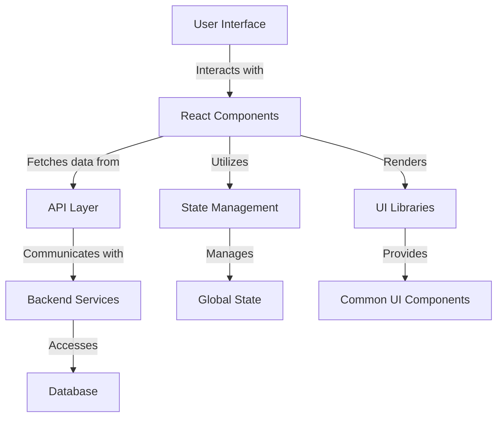

# Performance Standards — React

## Overview and scope

The purpose of this document is to outline the performance standards for React applications developed within Xentic. It serves as a guideline for engineers to ensure optimal performance, maintainability, and user experience across all frontend applications. This document is intended for all frontend developers, architects, and project managers involved in the development and deployment of React applications at Xentic.

### Scope

This performance standard covers the following areas:

- Core Web Vitals metrics and targets
- Code splitting strategies
- Virtualization techniques for rendering long lists
- Best practices for image handling
- Dependency management and analysis

### Non-goals

This document does not cover:

- Backend performance standards
- Non-React based frontend frameworks
- User experience design principles outside of performance

### Glossary

| Term                     | Definition                                                                                     |
|--------------------------|------------------------------------------------------------------------------------------------|
| Core Web Vitals          | A set of metrics that measure real-world user experience for performance.                     |
| LCP                      | Largest Contentful Paint; measures loading performance.                                       |
| INP                      | Input Delay; measures responsiveness to user interactions.                                    |
| CLS                      | Cumulative Layout Shift; measures visual stability.                                           |
| Code Splitting           | A technique to split code into smaller chunks, allowing for faster initial load times.        |
| Virtualization           | A technique to render only the visible portion of a long list, improving performance.         |

### How this standard fits the Xentic platform

The performance standards outlined in this document are integral to the Xentic platform's commitment to delivering high-quality, performant applications. By adhering to these standards, teams can ensure that their applications meet the expectations of our users and align with the overall goals of Xentic. This document will be regularly updated to reflect new insights, technologies, and best practices in frontend development.

### Core Web Vitals Targets

| Metric                   | Target   |
|--------------------------|----------|
| LCP                      | < 2.5s   |
| INP                      | < 100ms  |
| CLS                      | < 0.1    |
| Initial JS bundle        | < 200KB gzipped |

### Code Splitting

To improve load times, developers MUST implement code splitting in their React applications. An example of code splitting using React's `lazy` function is shown below:

```typescript
const DashboardPage = lazy(() => import('@/pages/DashboardPage'));
```

### Virtualization for Long Lists

When rendering long lists, developers SHOULD utilize virtualization to enhance performance. Below is an example using the `@tanstack/react-virtual` library:

```typescript
import { useVirtualizer } from '@tanstack/react-virtual';

const UserList = ({ users }: { users: User[] }) => {
  const parentRef = useRef<HTMLDivElement>(null);
  const virtualizer = useVirtualizer({
    count: users.length,
    getScrollElement: () => parentRef.current,
    estimateSize: () => 72,
  });

  return (
    <div ref={parentRef} style={{ height: '600px', overflow: 'auto' }}>
      <div style={{ height: virtualizer.getTotalSize() }}>
        {virtualizer.getVirtualItems().map(vItem => (
          <div key={vItem.key} style={{ position: 'absolute', top: vItem.start, width: '100%' }}>
            <UserCard user={users[vItem.index]} />
          </div>
        ))}
      </div>
    </div>
  );
};
```

### Rules

- Developers MUST use `loading="lazy"` on all below-fold images to improve loading performance.
- Developers MUST always set explicit `width` and `height` attributes on images to prevent Cumulative Layout Shift (CLS).
- Developers MUST run `npx vite-bundle-analyzer` before each release to analyze the bundle size and dependencies.
- Any new dependency exceeding 50KB gzipped MUST be flagged for architect review to ensure compliance with performance standards.

## Standards and policies

1. **Performance Metrics Compliance**  
   Developers MUST ensure that all applications meet the Core Web Vitals targets outlined in this document. Regular monitoring and reporting should be conducted to maintain compliance.

2. **Code Splitting Implementation**  
   Developers MUST implement code splitting using dynamic imports to optimize initial loading times. This can be achieved using React's `lazy` and `Suspense` components as shown below:

   ```typescript
   const LazyComponent = lazy(() => import('@/components/LazyComponent'));

   return (
     <Suspense fallback={<div>Loading...</div>}>
       <LazyComponent />
     </Suspense>
   );
   ```

3. **Virtualization for Performance**  
   When dealing with large datasets, developers MUST utilize virtualization techniques to render only the visible items. This approach minimizes rendering overhead and enhances performance.

4. **Image Optimization**  
   Developers MUST optimize images by using appropriate formats (e.g., WebP) and resolutions. All images MUST include the `loading="lazy"` attribute to defer loading off-screen images.

5. **Explicit Image Dimensions**  
   Developers MUST always specify explicit `width` and `height` attributes for images to prevent layout shifts, thereby improving CLS metrics.

6. **Dependency Management**  
   Developers MUST run `npx vite-bundle-analyzer` before each release to analyze bundle sizes and dependencies. This practice helps identify large dependencies that could impact performance.

7. **Review of Large Dependencies**  
   Any new dependency exceeding 50KB gzipped MUST be flagged for architect review. This ensures that performance implications are considered before integration.

8. **Avoid Inline Styles**  
   Developers MUST NOT use inline styles for critical layout elements. Instead, CSS classes should be utilized to maintain separation of concerns and improve performance.

9. **State Management Optimization**  
   Developers SHOULD use efficient state management solutions (e.g., React Context, Redux) and avoid unnecessary re-renders by implementing memoization techniques like `React.memo` and `useMemo`.

10. **Minimize Reconciliation**  
    Developers MUST minimize reconciliation by using `key` props correctly in lists to ensure React can efficiently update the DOM.

11. **Code Quality and Linting**  
    Developers MUST adhere to coding standards and utilize ESLint with the recommended Xentic configuration to maintain code quality and consistency.

12. **Testing for Performance**  
    Developers SHOULD implement performance testing using tools like Lighthouse or WebPageTest to evaluate and optimize application performance regularly.

13. **Documentation of Performance Issues**  
    Developers MUST document any identified performance issues in the project’s issue tracker, along with proposed solutions and timelines for resolution.

14. **Continuous Integration**  
    All projects MUST integrate performance checks into the CI/CD pipeline to ensure that performance standards are met before deployment.

15. **Training and Knowledge Sharing**  
    Developers SHOULD participate in regular training sessions and knowledge-sharing initiatives to stay updated on best practices and emerging technologies related to React performance.

By adhering to these standards and policies, Xentic aims to ensure that all React applications deliver optimal performance, providing an excellent user experience while maintaining maintainability and scalability.

## Architecture and design

The architecture of React applications at Xentic should be designed to facilitate performance, scalability, and maintainability. Below is a component diagram that illustrates the key components and their interactions within a typical React application.



### Data Flows

1. **User Interaction**: Users interact with the UI, triggering events that are handled by React components.
2. **Data Fetching**: Components fetch data from the API layer, which communicates with backend services.
3. **State Management**: The state management layer (e.g., Redux, Context API) manages the application state and provides data to components.
4. **Rendering**: Components render UI based on the state and fetched data, utilizing common UI libraries for consistency.

### Integration Points

- **API Layer**: All components MUST interact with a centralized API layer for data fetching. This layer abstracts the backend services and provides a consistent interface.
- **State Management**: Components MUST utilize a state management solution to manage shared state across the application.
- **UI Libraries**: Common UI components MUST be used to ensure consistency and reusability across different parts of the application.

### Failure Domains

- **Network Failures**: Applications MUST gracefully handle network failures when fetching data from the API layer. This includes displaying error messages and fallback UI.
- **State Management Failures**: Developers SHOULD implement error boundaries around components that rely on critical state data to prevent application crashes.
- **Rendering Failures**: Components MUST be designed to handle rendering errors, ensuring that the application remains functional even if certain parts fail.

### Example Configuration

Below is an example of a typical configuration for a React application using YAML format:

```yaml
api:
  baseUrl: "https://api.internal.xentic.io/v1"
  timeout: 5000

stateManagement:
  provider: "redux"
  initialState:
    user: null
    settings: {}

ui:
  theme: "light"
  components:
    button:
      color: "primary"
      size: "medium"
```

### SQL Example

For applications that interact with a database, the following SQL query can be used to fetch user data:

```sql
SELECT id, name, email, created_at
FROM users
WHERE active = TRUE
ORDER BY created_at DESC
LIMIT 100;
```

### Code Example

An example of a React component that fetches user data and handles errors gracefully is shown below:

```typescript
import React, { useEffect, useState } from 'react';
import axios from 'axios';

const UserList: React.FC = () => {
  const [users, setUsers] = useState<User[]>([]);
  const [error, setError] = useState<string | null>(null);

  useEffect(() => {
    const fetchUsers = async () => {
      try {
        const response = await axios.get(`${process.env.REACT_APP_API_BASE_URL}/users`);
        setUsers(response.data);
      } catch (err) {
        setError('Failed to fetch users');
      }
    };

    fetchUsers();
  }, []);

  if (error) {
    return <div>{error}</div>;
  }

  return (
    <ul>
      {users.map(user => (
        <li key={user.id}>{user.name}</li>
      ))}
    </ul>
  );
};
```

By adhering to these architectural and design principles, Xentic ensures that React applications are robust, maintainable, and performant, providing an excellent user experience while being scalable for future growth.

## Configuration Reference

The following sections outline the configuration settings for React applications at Xentic, including `application.yml`, Terraform configurations, and environment variables.

### Application Configuration (application.yml)

The `application.yml` file should include the following configurations:

```yaml
api:
  baseUrl: "https://api.internal.xentic.io/v1"
  timeout: 5000  # Timeout in milliseconds

stateManagement:
  provider: "redux"  # Options: redux, context
  initialState:
    user: null
    settings: {}

ui:
  theme: "light"  # Options: light, dark
  components:
    button:
      color: "primary"  # Options: primary, secondary, danger
      size: "medium"  # Options: small, medium, large

performance:
  lazyLoadImages: true  # Enable lazy loading for images
  codeSplitting: true  # Enable code splitting
  bundleAnalyzer: true  # Enable bundle analysis
```

### Terraform Configuration

The following Terraform configuration can be used to set up environment variables and resources for React applications:

```hcl
resource "aws_s3_bucket" "react_app_bucket" {
  bucket = "react-app-bucket"
  acl    = "public-read"

  tags = {
    Name        = "React App Bucket"
    Environment = "production"
  }
}

resource "aws_ssm_parameter" "api_base_url" {
  name  = "/xentic/react/api/base_url"
  type  = "String"
  value = "https://api.internal.xentic.io/v1"
}

resource "aws_ssm_parameter" "timeout" {
  name  = "/xentic/react/api/timeout"
  type  = "String"
  value = "5000"
}
```

### Environment Variables

Developers MUST set the following environment variables in their development and production environments:

| Variable Name           | Default Value                       | Production Value                     |
|-------------------------|------------------------------------|-------------------------------------|
| `REACT_APP_API_BASE_URL` | `https://api.internal.xentic.io/v1` | `https://api.internal.xentic.io/v1` |
| `REACT_APP_TIMEOUT`      | `5000`                            | `5000`                              |
| `REACT_APP_THEME`        | `light`                           | `dark` or `light`                  |
| `REACT_APP_STATE_PROVIDER` | `redux`                         | `redux` or `context`               |

### Additional Configuration Notes

- Developers MUST ensure that all configuration values are correctly set before deploying applications to production.
- Sensitive information (e.g., API keys, secrets) MUST NOT be hardcoded in the application code and should be managed using environment variables or secure vaults.
- Configuration values should be documented and shared with the team to maintain consistency across different environments.

By adhering to these configuration standards, Xentic ensures that React applications are well-structured, maintainable, and easily configurable for different environments.

## Implementation guide

To implement performance standards in React applications at Xentic, developers MUST follow the steps outlined below, ensuring that each component is optimized for performance, maintainability, and scalability.

### Step 1: Optimize Component Structure

Developers SHOULD structure components to be as small and focused as possible. This promotes reusability and improves performance.

```typescript
// Button.tsx
import React from 'react';

interface ButtonProps {
  onClick: () => void;
  label: string;
}

const Button: React.FC<ButtonProps> = ({ onClick, label }) => {
  return (
    <button onClick={onClick} className="btn">
      {label}
    </button>
  );
};

export default Button;
```

### Step 2: Use Memoization

Developers MUST use `React.memo` and `useMemo` to prevent unnecessary re-renders of components.

```typescript
// UserList.tsx
import React, { useEffect, useState, useMemo } from 'react';
import axios from 'axios';
import Button from './Button';

const UserList: React.FC = () => {
  const [users, setUsers] = useState<User[]>([]);
  const [error, setError] = useState<string | null>(null);

  useEffect(() => {
    const fetchUsers = async () => {
      try {
        const response = await axios.get(`${process.env.REACT_APP_API_BASE_URL}/users`);
        setUsers(response.data);
      } catch (err) {
        setError('Failed to fetch users');
      }
    };

    fetchUsers();
  }, []);

  const renderedUsers = useMemo(() => {
    return users.map(user => (
      <li key={user.id}>{user.name}</li>
    ));
  }, [users]);

  if (error) {
    return <div>{error}</div>;
  }

  return (
    <ul>
      {renderedUsers}
    </ul>
  );
};

export default React.memo(UserList);
```

### Step 3: Implement Lazy Loading

Developers MUST implement lazy loading for images and components to improve initial load time.

```typescript
// LazyImage.tsx
import React, { useEffect, useState } from 'react';

interface LazyImageProps {
  src: string;
  alt: string;
}

const LazyImage: React.FC<LazyImageProps> = ({ src, alt }) => {
  const [isVisible, setIsVisible] = useState(false);

  const handleScroll = () => {
    const rect = document.getElementById(alt)?.getBoundingClientRect();
    if (rect && rect.top < window.innerHeight) {
      setIsVisible(true);
      window.removeEventListener('scroll', handleScroll);
    }
  };

  useEffect(() => {
    window.addEventListener('scroll', handleScroll);
    return () => {
      window.removeEventListener('scroll', handleScroll);
    };
  }, []);

  return (
    
  );
};

export default LazyImage;
```

### Step 4: Implement Code Splitting

Developers MUST implement code splitting using React's `React.lazy` and `Suspense` to load components only when needed.

```typescript
// App.tsx
import React, { Suspense } from 'react';

const UserList = React.lazy(() => import('./UserList'));

const App: React.FC = () => {
  return (
    <div>
      <h1>User Management</h1>
      <Suspense fallback={<div>Loading...</div>}>
        <UserList />
      </Suspense>
    </div>
  );
};

export default App;
```

### Step 5: Monitor Performance

Developers SHOULD implement performance monitoring using tools like React Profiler and Lighthouse.

1. **React Profiler**: Utilize the built-in Profiler component to measure the performance of your components.
2. **Lighthouse**: Run Lighthouse audits regularly to identify performance bottlenecks.

### Step 6: Optimize Asset Delivery

Developers MUST ensure that images and other assets are optimized for delivery.

- Use formats like WebP for images.
- Compress CSS and JavaScript files.
- Utilize a Content Delivery Network (CDN) for serving static assets.

### Step 7: Conduct Regular Performance Reviews

Developers MUST schedule regular performance reviews to identify and address potential issues. Use the following checklist:

| Review Item                        | Frequency     | Responsible  |
|------------------------------------|---------------|--------------|
| Run Lighthouse audits              | Bi-weekly     | Frontend Team |
| Analyze bundle size                | Monthly       | DevOps       |
| Review API response times          | Monthly       | Backend Team |
| Check for unused dependencies       | Quarterly     | Frontend Team |

By following these steps, developers at Xentic can ensure that their React applications are optimized for performance, providing a seamless user experience while maintaining code quality and scalability.

## Security requirements

To ensure the security of React applications at Xentic, developers MUST adhere to the following requirements, which encompass threat modeling, authentication and authorization, secrets management, input validation, and audit logging.

### Threat Model Summary

Developers MUST conduct a threat modeling exercise for each application, identifying potential threats and vulnerabilities. The following table outlines common threats and recommended mitigations:

| Threat                         | Description                                       | Mitigation Strategy                                 |
|--------------------------------|---------------------------------------------------|----------------------------------------------------|
| Cross-Site Scripting (XSS)    | Malicious scripts executed in the user's browser | Use libraries like DOMPurify to sanitize inputs    |
| Cross-Site Request Forgery (CSRF) | Unauthorized actions performed on behalf of users | Implement CSRF tokens in forms and state-changing requests |
| Insecure Direct Object References (IDOR) | Unauthorized access to objects or resources | Validate user permissions for each request         |
| Sensitive Data Exposure        | Unintended exposure of sensitive information      | Use HTTPS and encrypt sensitive data in transit    |

### Authentication and Authorization

Xentic applications MUST implement robust authentication and authorization mechanisms. The following practices MUST be followed:

- **Use OAuth 2.0 or OpenID Connect** for user authentication.
- **Implement Role-Based Access Control (RBAC)** to restrict access to resources based on user roles.

Example of an authentication flow using OAuth 2.0:

```javascript
import { useEffect } from 'react';
import { useHistory } from 'react-router-dom';

const Login = () => {
  const history = useHistory();

  const handleLogin = () => {
    window.location.href = 'https://auth.internal.xentic.io/oauth/authorize?client_id=YOUR_CLIENT_ID&redirect_uri=YOUR_REDIRECT_URI&response_type=token';
  };

  useEffect(() => {
    const hash = window.location.hash;
    if (hash) {
      const token = hash.split('&')[0].split('=')[1];
      localStorage.setItem('access_token', token);
      history.push('/dashboard');
    }
  }, [history]);

  return <button onClick={handleLogin}>Login</button>;
};
```

### Secrets Management

Developers MUST NOT hardcode secrets or sensitive information in the application code. Instead, they MUST use environment variables or a secure vault solution (e.g., AWS Secrets Manager, HashiCorp Vault).

Example of using environment variables in a `.env` file:

```plaintext
REACT_APP_API_KEY=your_api_key_here
REACT_APP_SECRET=your_secret_here
```

### Input Validation

All user inputs MUST be validated both on the client and server sides to prevent injection attacks and ensure data integrity. Developers SHOULD use libraries such as Joi or Yup for input validation.

Example of input validation using Yup:

```javascript
import * as Yup from 'yup';

const validationSchema = Yup.object().shape({
  email: Yup.string().email().required(),
  password: Yup.string().min(8).required(),
});

// Usage in a form
const handleSubmit = async (values) => {
  await validationSchema.validate(values);
  // Proceed with form submission
};
```

### Audit Logging

To maintain accountability and traceability, developers MUST implement audit logging for critical actions within the application. The following actions should be logged:

- User logins and logouts
- Changes to user roles and permissions
- Sensitive data access and modifications

Example of logging user actions:

```javascript
const logUserAction = (action) => {
  fetch('https://api.internal.xentic.io/logs', {
    method: 'POST',
    headers: {
      'Content-Type': 'application/json',
      'Authorization': `Bearer ${localStorage.getItem('access_token')}`,
    },
    body: JSON.stringify({ action, timestamp: new Date().toISOString() }),
  });
};

// Log a user login action
logUserAction('User logged in');
```

By adhering to these security requirements, Xentic ensures that its React applications are resilient against common threats, safeguarding user data and maintaining trust in its services.

## Testing strategy

To ensure the reliability and maintainability of React applications at Xentic, developers MUST implement a comprehensive testing strategy that includes unit tests, integration tests, and contract tests. This strategy should aim for a minimum code coverage target of 80% across all components and modules.

### Unit Tests

Unit tests are essential for validating the functionality of individual components. Developers MUST use testing libraries such as Jest and React Testing Library to create unit tests.

#### Example Unit Test Class

```typescript
// UserList.test.tsx
import React from 'react';
import { render, screen } from '@testing-library/react';
import UserList from './UserList';
import axios from 'axios';

jest.mock('axios');

describe('UserList', () => {
  it('renders user list correctly', async () => {
    const users = [{ id: 1, name: 'John Doe' }, { id: 2, name: 'Jane Doe' }];
    (axios.get as jest.Mock).mockResolvedValueOnce({ data: users });

    render(<UserList />);

    const userItems = await screen.findAllByRole('listitem');
    expect(userItems).toHaveLength(2);
    expect(screen.getByText('John Doe')).toBeInTheDocument();
    expect(screen.getByText('Jane Doe')).toBeInTheDocument();
  });

  it('displays error message on fetch failure', async () => {
    (axios.get as jest.Mock).mockRejectedValueOnce(new Error('Failed to fetch users'));

    render(<UserList />);

    const errorMessage = await screen.findByText('Failed to fetch users');
    expect(errorMessage).toBeInTheDocument();
  });
});
```

### Integration Tests

Integration tests validate the interaction between multiple components and services. Developers SHOULD ensure that integration tests cover key user flows.

#### Example Integration Test Class

```typescript
// App.test.tsx
import React from 'react';
import { render, screen } from '@testing-library/react';
import App from './App';

describe('App', () => {
  it('renders UserList component', () => {
    render(<App />);
    expect(screen.getByText('User Management')).toBeInTheDocument();
  });
});
```

### Contract Tests

Contract tests ensure that the API contracts between the frontend and backend are adhered to. Developers MUST use tools like Pact to implement contract testing.

#### Example Contract Test

```typescript
// pact.test.ts
import { Pact } from '@pact-foundation/pact';
import axios from 'axios';

const provider = new Pact({
  consumer: 'UserService',
  provider: 'UserAPI',
  port: 1234,
});

describe('User API Pact', () => {
  beforeAll(() => provider.setup());
  afterAll(() => provider.finalize());

  beforeEach(() => {
    const interaction = {
      state: 'users exist',
      uponReceiving: 'a request for users',
      withRequest: {
        method: 'GET',
        path: '/users',
      },
      willRespondWith: {
        status: 200,
        body: [{ id: 1, name: 'John Doe' }],
      },
    };

    return provider.addInteraction(interaction);
  });

  it('fetches users from the API', async () => {
    const response = await axios.get('http://localhost:1234/users');
    expect(response.data).toEqual([{ id: 1, name: 'John Doe' }]);
  });
});
```

### Coverage Targets

Developers MUST aim for a minimum of 80% code coverage across all tests. This target ensures that a significant portion of the codebase is tested, reducing the likelihood of undetected issues.

| Test Type         | Coverage Target |
|-------------------|-----------------|
| Unit Tests        | 80%             |
| Integration Tests | 80%             |
| Contract Tests    | 100%            |

### Best Practices

- Tests MUST be run automatically in the CI/CD pipeline.
- Developers SHOULD write tests concurrently with feature development to ensure that new code is covered.
- Tests MUST NOT be skipped or ignored; all tests should pass before merging code into the main branch.

By adhering to this testing strategy, Xentic developers can ensure that their React applications are robust, reliable, and maintainable, ultimately delivering a high-quality user experience.

## Observability and operations

To maintain high performance and reliability in Xentic's React applications, developers MUST implement comprehensive observability practices, including metrics, logs, traces, dashboards, alerts, and Service Level Objectives (SLOs). The following guidelines outline the requirements for each component of observability.

### Metrics

Developers MUST instrument applications to collect key performance metrics. The following metrics MUST be tracked:

- **Response Time**: Measure the time taken to respond to user requests.
- **Error Rate**: Track the percentage of failed requests.
- **User Interaction Metrics**: Monitor user engagement metrics, such as time spent on pages and click-through rates.

Example configuration for Prometheus metrics:

```yaml
metrics:
  enabled: true
  endpoint: /metrics
  labels:
    environment: production
```

### Logs

Logging is critical for troubleshooting and understanding application behavior. Developers MUST implement structured logging and include the following information in logs:

- Timestamps
- Log levels (INFO, WARN, ERROR)
- User identifiers
- Request IDs for tracing

Example of structured logging in a React application:

```javascript
const logEvent = (event) => {
  console.log(JSON.stringify({
    timestamp: new Date().toISOString(),
    level: 'INFO',
    event,
    userId: localStorage.getItem('user_id'),
    requestId: generateRequestId(),
  }));
};

// Log a user action
logEvent('User clicked on the submit button');
```

### Traces

Distributed tracing MUST be implemented to track requests across microservices. This allows for identifying bottlenecks and understanding request flow. Developers SHOULD use tools like OpenTelemetry for tracing.

Example of tracing with OpenTelemetry:

```javascript
import { trace } from '@opentelemetry/api';

const tracer = trace.getTracer('xentic-react-app');

const fetchData = async () => {
  const span = tracer.startSpan('fetchData');
  try {
    const response = await fetch('https://api.internal.xentic.io/data');
    return await response.json();
  } catch (error) {
    span.recordException(error);
    throw error;
  } finally {
    span.end();
  }
};
```

### Dashboards

Dashboards MUST be created to visualize key metrics and logs. Developers SHOULD use tools like Grafana or Kibana for creating dashboards that provide insights into application performance.

#### Example Dashboard Configuration for Grafana

```json
{
  "title": "Application Performance Dashboard",
  "panels": [
    {
      "type": "graph",
      "title": "Response Time",
      "targets": [
        {
          "target": "avg(response_time)",
          "refId": "A"
        }
      ]
    },
    {
      "type": "table",
      "title": "Error Rates",
      "targets": [
        {
          "target": "sum(error_rate)",
          "refId": "B"
        }
      ]
    }
  ]
}
```

### Alerts

Alerts MUST be configured to notify the engineering team of critical issues. The following alerting rules MUST be established:

- Alert on high error rates (e.g., > 5% of requests fail).
- Alert on increased response times (e.g., average response time exceeds 2 seconds).
- Alert on system resource usage (e.g., CPU or memory usage exceeds 80%).

Example alerting rule in Prometheus:

```yaml
groups:
  - name: application-alerts
    rules:
      - alert: HighErrorRate
        expr: rate(errors_total[5m]) / rate(requests_total[5m]) > 0.05
        for: 5m
        labels:
          severity: critical
        annotations:
          summary: "High error rate detected"
          description: "More than 5% of requests are failing."
```

### Service Level Objectives (SLOs)

Developers MUST define SLOs to measure the reliability and performance of applications. SLOs should be based on user expectations and business requirements. Common SLOs include:

| SLO Description                   | Target     |
|-----------------------------------|------------|
| 99.9% of requests respond within 200ms | 99.9%      |
| Less than 1% error rate           | < 1%       |
| 95% of users experience < 1s load time | 95%        |

### On-Call Runbook Steps

In the event of an incident, the following runbook steps MUST be followed by the on-call engineer:

1. **Acknowledge the alert**: Confirm receipt of the alert and begin investigation.
2. **Check dashboards**: Review relevant dashboards for metrics and logs to identify the issue.
3. **Investigate logs**: Look for error messages or unusual patterns in the logs.
4. **Check dependencies**: Verify the health of dependent services and APIs.
5. **Communicate with stakeholders**: Provide updates to affected teams and users.
6. **Implement a fix**: Apply a fix or rollback changes if necessary.
7. **Postmortem**: Conduct a postmortem analysis to identify root causes and prevent future incidents.

By adhering to these observability and operations standards, Xentic can ensure that its React applications remain performant, reliable, and responsive to user needs.

## Migration and versioning

To maintain the integrity and performance of Xentic's React applications, developers MUST follow established migration and versioning practices. This section outlines the upgrade paths, deprecation policy, backward compatibility, and rollback procedures.

### Upgrade Paths

1. **Semantic Versioning**: All packages MUST adhere to semantic versioning (MAJOR.MINOR.PATCH). Breaking changes MUST increment the MAJOR version, new features that are backward compatible MUST increment the MINOR version, and bug fixes MUST increment the PATCH version.
   
2. **Upgrade Strategy**: Developers SHOULD upgrade dependencies regularly to benefit from performance improvements and security patches. An upgrade strategy MUST include:
   - Regularly scheduled reviews of dependencies.
   - Testing against the latest version in a staging environment before production deployment.

3. **Changelog**: A changelog MUST be maintained for each service, documenting changes, deprecations, and migration steps. This changelog SHOULD be accessible at:
   - `https://docs.internal.xentic.io/changelog`

### Deprecation Policy

1. **Deprecation Notices**: When a feature or API is deprecated, developers MUST provide clear deprecation notices in the documentation and code comments. Notices MUST include:
   - The version in which the feature will be removed.
   - Suggested alternatives or migration paths.

2. **Grace Period**: A grace period of at least one major version MUST be provided before removing deprecated features. During this period, both the old and new implementations MUST coexist.

### Backward Compatibility

1. **Backward Compatibility**: Developers MUST ensure that new versions of components are backward compatible with the previous versions unless a breaking change is explicitly documented.

2. **Feature Flags**: When introducing new features, developers SHOULD use feature flags to allow gradual rollout and testing. This approach allows for easy rollback if issues arise.

#### Example Feature Flag Implementation

```javascript
const featureFlags = {
  newFeature: true, // Toggle this to enable/disable the new feature
};

if (featureFlags.newFeature) {
  // New feature implementation
} else {
  // Fallback to old implementation
}
```

### Rollback Procedures

1. **Rollback Strategy**: A rollback strategy MUST be in place to revert to a previous stable version in case of a failed deployment. This strategy MUST include:
   - Automated rollback scripts that can be executed with minimal manual intervention.
   - Clear documentation on how to perform a rollback.

2. **Version Control**: All code MUST be version-controlled using Git. Tags MUST be created for each release, allowing for easy identification of stable versions.

#### Example Rollback Command

```bash
# Rollback to the previous stable version
git checkout tags/v1.0.0
```

3. **Testing Rollbacks**: Rollback procedures MUST be tested regularly in staging environments to ensure they work as expected.

### Summary Table

| Policy Aspect            | Requirement                                                                 |
|-------------------------|-----------------------------------------------------------------------------|
| Upgrade Paths           | MUST follow semantic versioning; regular dependency reviews.               |
| Deprecation Notices     | MUST provide clear notices with alternatives; grace period of one major version. |
| Backward Compatibility   | MUST ensure new versions are backward compatible; use feature flags.       |
| Rollback Procedures      | MUST have automated rollback strategies; test rollback procedures regularly. |

By adhering to these migration and versioning standards, Xentic developers can ensure that their React applications remain stable, performant, and maintainable throughout their lifecycle.

## FAQ, anti-patterns, and checklists

### Frequently Asked Questions (FAQ)

1. **What is the recommended way to manage state in a React application?**
   - Developers SHOULD use state management libraries like Redux or Context API for complex state management. For simpler applications, local component state is sufficient.

2. **How can I optimize performance in a React application?**
   - Performance optimization MUST include techniques such as code splitting, lazy loading of components, and memoization using `React.memo` and `useMemo`.

3. **What should I do if I encounter a memory leak in my application?**
   - Developers MUST ensure to clean up subscriptions and event listeners in the `useEffect` cleanup function to prevent memory leaks.

4. **How do I handle error boundaries in React?**
   - Developers MUST implement error boundaries using the `componentDidCatch` lifecycle method or the `ErrorBoundary` component to catch JavaScript errors in the component tree.

5. **What is the best practice for API calls in React?**
   - API calls MUST be made in the `useEffect` hook to ensure they are executed after the component mounts. Developers SHOULD handle loading and error states appropriately.

6. **How can I ensure accessibility in my React applications?**
   - Developers MUST follow WAI-ARIA guidelines and use semantic HTML elements to ensure accessibility. Tools like Axe or Lighthouse SHOULD be used for auditing.

7. **When should I use class components vs functional components?**
   - Developers SHOULD prefer functional components with hooks for new development as they offer a simpler and more readable syntax. Class components MUST be used only when necessary.

8. **What is the role of PropTypes in React?**
   - Developers MUST use PropTypes to validate the props passed to components, ensuring that they receive the correct data types and structures.

9. **How can I implement routing in my React application?**
   - Routing MUST be implemented using `react-router-dom`, which provides a declarative way to manage navigation and URLs in the application.

10. **What should I do to ensure my components are reusable?**
    - Developers MUST design components to be reusable by accepting props for customization and avoiding hard-coded values.

### Anti-Patterns

| Anti-Pattern                     | Description                                                                                   | Recommendation                                      |
|----------------------------------|-----------------------------------------------------------------------------------------------|----------------------------------------------------|
| Overusing State                   | Storing too much data in component state rather than deriving it from props.                | Use props to derive state whenever possible.       |
| Inline Functions in Render       | Defining functions inside the render method, causing unnecessary re-renders.                | Define functions outside of the render method.     |
| Not Using Keys in Lists          | Failing to provide a unique `key` prop for list items, which can lead to performance issues. | Always provide a unique key prop for list items.   |
| Deeply Nested Components          | Creating deeply nested components that are hard to maintain and understand.                  | Flatten component hierarchy when possible.          |
| Side Effects in Render           | Performing side effects directly in the render method instead of `useEffect`.                | Use `useEffect` for side effects.                   |
| Mutating State Directly          | Modifying state directly rather than using the state setter function.                        | Always use the state setter function to update state. |

### Pre-Merge Checklist

- [ ] Code adheres to Xentic's coding standards.
- [ ] All new features are covered by unit tests with at least 80% coverage.
- [ ] Documentation is updated to reflect changes.
- [ ] Code has been reviewed by at least one other developer.
- [ ] No console logs are present in the codebase.
- [ ] All linting errors are resolved.

### Production Checklist

- [ ] All tests pass in the CI/CD pipeline.
- [ ] Performance benchmarks are met and documented.
- [ ] Rollback procedures are tested and documented.
- [ ] Monitoring and alerting are configured for the new release.
- [ ] Deployment is communicated to stakeholders.
- [ ] Backup of the current production version is created before deployment.
