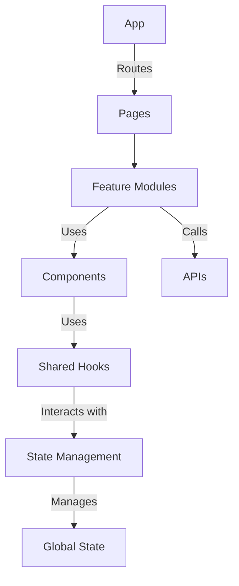

# Standard React Project Structure

## Overview and scope

The purpose of this document is to establish a standardized project structure for React applications developed within Xentic. This standard aims to ensure consistency, maintainability, and scalability across all frontend projects, facilitating collaboration among development teams. 

### Audience

This standard is intended for all frontend developers, architects, and project managers involved in the design, development, and maintenance of React applications at Xentic. It serves as a guideline for both new and existing projects.

### Scope

This standard applies to all React projects within Xentic, regardless of their size or complexity. It encompasses:

- Directory structure
- Naming conventions
- Feature module rules
- Code organization best practices
- Integration with shared libraries

### Non-goals

This document does NOT aim to cover:

- Specific implementation details for third-party libraries or frameworks not used within Xentic.
- Design patterns or architectural decisions beyond the scope of project structure.
- Testing strategies or deployment processes.

### Glossary

| Term                | Definition                                                                 |
|---------------------|-----------------------------------------------------------------------------|
| Component           | A reusable piece of UI that can manage its own state and lifecycle.        |
| Feature Module      | A self-contained unit of functionality that exposes a public API.          |
| Hook                | A function that lets you use state and other React features in functional components. |
| Store               | A centralized place to manage application state, often using state management libraries. |
| Type                | A TypeScript definition that describes the shape of an object.             |

### How this standard fits the Xentic platform

The standardized React project structure aligns with Xentic's commitment to delivering high-quality software solutions. By adhering to this structure, teams can:

- Enhance collaboration by reducing cognitive load when navigating codebases.
- Facilitate onboarding of new developers through clear and consistent organization.
- Promote code reusability and modularity, allowing for easier feature development and maintenance.

### Standard React Project Structure (Vite + TypeScript)

```plaintext
src/
├── assets/            # Static assets (images, fonts, etc.)
├── components/        # Reusable UI components
│   ├── ui/           # Primitive UI components (Button, Input, Modal)
│   └── shared/       # Composed reusable components
├── features/         # Feature modules
│   └── users/        # User-related features
│       ├── components/ # Feature-specific components
│       ├── hooks/      # Feature-specific hooks
│       ├── api.ts      # API calls related to users
│       ├── types.ts    # Type definitions for users
│       └── index.ts    # Public API of the feature
├── hooks/            # Shared hooks across features
├── lib/              # Shared libraries and utilities
├── pages/            # Page components for routing
├── store/            # State management (Redux, Zustand, etc.)
├── types/            # Global TypeScript types
└── utils/            # Utility functions
```

### Feature Module Rule

Features MUST expose a public API via `index.ts`. Other features MUST NOT import from internal paths to maintain encapsulation and prevent tight coupling.

```typescript
// features/users/index.ts
export { UserList } from './components/UserList';
export { useCurrentUser } from './hooks/useCurrentUser';
export type { User, CreateUserRequest } from './types';
```

### Naming Conventions

| Type       | Convention      | Example                      |
|------------|------------------|------------------------------|
| Component  | PascalCase       | `UserProfileCard.tsx`       |
| Hook       | `use` prefix     | `useUserProfile.ts`         |
| Store      | `Store` suffix   | `userStore.ts`              |
| Type       | PascalCase       | `UserProfile`                |

By following these guidelines, Xentic aims to foster a robust and efficient development environment that aligns with our overall architectural vision.

## Standards and policies

1. **Project Structure**: All React projects MUST adhere to the standardized directory structure outlined in this document. Deviations MUST be justified and approved by the architecture team.

2. **Naming Conventions**: 
   - All components MUST use PascalCase for file names and component names (e.g., `UserProfile.tsx`).
   - Hooks MUST be prefixed with `use` (e.g., `useFetchData.ts`).
   - Types MUST also use PascalCase (e.g., `UserProfile.ts`).

3. **Feature Modules**: Each feature MUST reside in its own directory under `src/features/`. This directory MUST contain:
   - A `components/` subdirectory for feature-specific components.
   - A `hooks/` subdirectory for feature-specific hooks.
   - An `api.ts` file for API calls related to the feature.
   - A `types.ts` file for type definitions specific to the feature.
   - An `index.ts` file that exposes the public API of the feature.

4. **Encapsulation**: Features MUST NOT import from internal paths of other features. All inter-feature communication MUST occur through the public API defined in `index.ts`.

5. **Shared Libraries**: 
   - Shared libraries MUST be placed under `src/lib/` and MUST follow the naming convention `com.xentic.common:*`.
   - Libraries MUST be documented with clear usage examples in the README files located in their respective directories.

6. **Static Assets**: All static assets (images, fonts, etc.) MUST be stored in the `src/assets/` directory. Assets MUST be referenced using relative paths within components.

7. **State Management**: 
   - State management solutions (e.g., Redux, Zustand) MUST be implemented in the `src/store/` directory.
   - Store files MUST follow the naming convention of `<featureName>Store.ts` (e.g., `userStore.ts`).

8. **Testing**: Each component and feature MUST include associated tests. Test files MUST be located in the same directory as the component or feature and MUST follow the naming convention `<ComponentName>.test.tsx` (e.g., `UserProfile.test.tsx`).

9. **Documentation**: All public APIs and components MUST be documented using JSDoc comments. Documentation MUST include descriptions of parameters, return types, and examples of usage.

10. **Code Reviews**: All code MUST undergo a peer review process before merging into the main branch. Reviews MUST check for adherence to these standards and policies.

11. **Version Control**: All projects MUST use Git for version control. Branch names MUST follow the convention `feature/<feature-name>` or `bugfix/<bug-name>`.

12. **Continuous Integration**: All repositories MUST be configured to use a CI/CD pipeline that runs tests and lints code on every push to the main branch.

13. **Environment Configuration**: Configuration files (e.g., `.env`) MUST NOT be committed to version control. Instead, a sample configuration file (e.g., `.env.example`) MUST be provided.

14. **Dependencies**: All dependencies MUST be declared in the `package.json` file. Unused dependencies MUST NOT be included and should be removed during code cleanup.

15. **Code Style**: All code MUST adhere to the ESLint and Prettier configurations provided by Xentic. Developers MUST run linting and formatting checks before committing code.

By following these standards and policies, Xentic aims to create a cohesive and efficient development environment that supports high-quality software delivery.

## Architecture and design

The architecture of a React application at Xentic is designed to promote modularity, maintainability, and scalability. Below is a component diagram that illustrates the key components and their interactions within the system.



### Data Flows

1. **User Interaction**: Users interact with UI components, which trigger state updates and API calls.
2. **State Management**: The state management layer (e.g., Redux) maintains the application state, allowing components to subscribe to relevant state changes.
3. **API Calls**: Feature modules make API calls to fetch or manipulate data, which is then reflected in the UI.
4. **Component Rendering**: Components re-render based on state changes, providing a dynamic user experience.

### Integration Points

- **APIs**: Each feature module should have a dedicated API file (e.g., `api.ts`) to handle all network requests. This file MUST define functions for fetching, creating, updating, and deleting resources.
  
```typescript
// features/users/api.ts
import axios from 'axios';

const API_URL = 'https://api.internal.xentic.io/users';

export const fetchUsers = async () => {
    const response = await axios.get(API_URL);
    return response.data;
};

export const createUser = async (userData) => {
    const response = await axios.post(API_URL, userData);
    return response.data;
};
```

- **Shared Libraries**: Shared libraries (e.g., authentication, common utilities) MUST be integrated through the `src/lib/` directory. All shared libraries MUST be imported using their designated paths, such as `import { AuthService } from 'com.xentic.auth:auth-starter';`.

### Failure Domains

- **Network Failures**: API calls may fail due to network issues. Applications MUST handle such failures gracefully, providing user feedback and retry mechanisms where appropriate.
- **State Management**: Improper state management can lead to inconsistent UI states. Developers MUST ensure that state updates are performed correctly and that components are subscribed to the necessary state slices.
- **Component Failures**: Individual components may fail to render due to missing props or errors in lifecycle methods. Error boundaries MUST be implemented to catch and handle these errors at the component level.

### Summary

By adhering to the architecture and design principles outlined above, Xentic ensures that React applications are robust, maintainable, and scalable. This structured approach facilitates better collaboration among teams and enhances the overall quality of the software delivered.

## Configuration reference

### application.yml

The `application.yml` file is used to configure various aspects of the React application. Below is an example configuration with default and production values.

```yaml
server:
  port: 3000

logging:
  level:
    root: INFO
    com.xentic: DEBUG

api:
  base-url: https://api.internal.xentic.io
  timeout: 5000

features:
  enableFeatureX: true
  enableFeatureY: false

security:
  auth:
    clientId: YOUR_CLIENT_ID
    clientSecret: YOUR_CLIENT_SECRET
```

### Terraform Configuration

The following Terraform configuration is used to provision resources for the React application. It includes default values and production values.

| Variable              | Default Value                | Production Value                     |
|-----------------------|------------------------------|--------------------------------------|
| `app_name`            | `xentic-react-app`           | `xentic-react-app-prod`              |
| `app_environment`     | `development`                | `production`                         |
| `app_instance_count`  | `1`                          | `3`                                  |
| `app_port`            | `3000`                       | `80`                                 |
| `db_instance_type`    | `db.t2.micro`               | `db.m5.large`                       |
| `db_name`             | `xentic_db`                  | `xentic_db_prod`                    |

### Environment Variables

Environment variables should be used to manage sensitive information and configuration settings. Below is a table of recommended environment variables with default and production values.

| Environment Variable      | Default Value                | Production Value                     |
|---------------------------|------------------------------|--------------------------------------|
| `REACT_APP_API_URL`      | `http://localhost:3000/api`  | `https://api.internal.xentic.io`    |
| `REACT_APP_AUTH_CLIENT_ID`| `default_client_id`         | `prod_client_id`                     |
| `REACT_APP_AUTH_SECRET`  | `default_secret`            | `prod_secret`                        |
| `NODE_ENV`               | `development`                | `production`                         |
| `REACT_APP_FEATURE_X`    | `true`                       | `false`                              |
| `REACT_APP_FEATURE_Y`    | `false`                      | `true`                               |

### Example Usage

To use the environment variables in your React application, you can access them as follows:

```javascript
const apiUrl = process.env.REACT_APP_API_URL;
const clientId = process.env.REACT_APP_AUTH_CLIENT_ID;

// Example API call using the configured base URL
fetch(`${apiUrl}/users`)
  .then(response => response.json())
  .then(data => console.log(data));
```

By adhering to the configuration standards outlined above, Xentic ensures a consistent and manageable approach to application settings across different environments.

## Implementation guide

To implement a standard React project structure at Xentic, follow these step-by-step guidelines. This guide will cover the creation of a basic React application, including the setup of directories, components, state management, and routing.

### Step 1: Setting Up the Project

1. **Create the React Application**:
   Use Create React App to bootstrap your project. Run the following command in your terminal:

   ```bash
   npx create-react-app xentic-react-app
   cd xentic-react-app
   ```

2. **Directory Structure**:
   Organize your project as follows:

   ```
   xentic-react-app/
   ├── public/
   ├── src/
   │   ├── assets/
   │   ├── components/
   │   ├── features/
   │   ├── hooks/
   │   ├── lib/
   │   ├── pages/
   │   ├── store/
   │   ├── App.tsx
   │   └── index.tsx
   ├── package.json
   └── README.md
   ```

### Step 2: Creating Components

1. **Create a Sample Component**:
   Create a new file named `UserProfile.tsx` in the `src/components/` directory.

   ```typescript
   // src/components/UserProfile.tsx
   import React from 'react';

   interface UserProfileProps {
       name: string;
       age: number;
   }

   const UserProfile: React.FC<UserProfileProps> = ({ name, age }) => {
       return (
           <div>
               <h1>User Profile</h1>
               <p>Name: {name}</p>
               <p>Age: {age}</p>
           </div>
       );
   };

   export default UserProfile;
   ```

2. **Using the Component**:
   Update `App.tsx` to include the `UserProfile` component.

   ```typescript
   // src/App.tsx
   import React from 'react';
   import UserProfile from './components/UserProfile';

   const App: React.FC = () => {
       return (
           <div>
               <UserProfile name="John Doe" age={30} />
           </div>
       );
   };

   export default App;
   ```

### Step 3: Setting Up State Management

1. **Install Redux**:
   Install Redux and React-Redux.

   ```bash
   npm install redux react-redux
   ```

2. **Create a Store**:
   Create a new file `userStore.ts` in the `src/store/` directory.

   ```typescript
   // src/store/userStore.ts
   import { createSlice, configureStore } from '@reduxjs/toolkit';

   const userSlice = createSlice({
       name: 'user',
       initialState: { name: '', age: 0 },
       reducers: {
           setUser: (state, action) => {
               state.name = action.payload.name;
               state.age = action.payload.age;
           },
       },
   });

   export const { setUser } = userSlice.actions;

   const store = configureStore({
       reducer: {
           user: userSlice.reducer,
       },
   });

   export default store;
   ```

3. **Integrate Redux Store**:
   Wrap your application with the Redux Provider in `index.tsx`.

   ```typescript
   // src/index.tsx
   import React from 'react';
   import ReactDOM from 'react-dom';
   import { Provider } from 'react-redux';
   import store from './store/userStore';
   import App from './App';

   ReactDOM.render(
       <Provider store={store}>
           <App />
       </Provider>,
       document.getElementById('root')
   );
   ```

### Step 4: Adding Routing

1. **Install React Router**:
   Install React Router for navigation.

   ```bash
   npm install react-router-dom
   ```

2. **Set Up Routes**:
   Create a new file `Home.tsx` in the `src/pages/` directory.

   ```typescript
   // src/pages/Home.tsx
   import React from 'react';

   const Home: React.FC = () => {
       return <h2>Home Page</h2>;
   };

   export default Home;
   ```

3. **Update App for Routing**:
   Modify `App.tsx` to include routing.

   ```typescript
   // src/App.tsx
   import React from 'react';
   import { BrowserRouter as Router, Route, Switch } from 'react-router-dom';
   import UserProfile from './components/UserProfile';
   import Home from './pages/Home';

   const App: React.FC = () => {
       return (
           <Router>
               <Switch>
                   <Route path="/" exact component={Home} />
                   <Route path="/user" render={() => <UserProfile name="John Doe" age={30} />} />
               </Switch>
           </Router>
       );
   };

   export default App;
   ```

### Step 5: Testing Components

1. **Create a Test File**:
   Create a test file for `UserProfile` in the same directory.

   ```typescript
   // src/components/UserProfile.test.tsx
   import React from 'react';
   import { render } from '@testing-library/react';
   import UserProfile from './UserProfile';

   test('renders user profile', () => {
       const { getByText } = render(<UserProfile name="John Doe" age={30} />);
       expect(getByText(/User Profile/i)).toBeInTheDocument();
       expect(getByText(/Name: John Doe/i)).toBeInTheDocument();
       expect(getByText(/Age: 30/i)).toBeInTheDocument();
   });
   ```

2. **Run Tests**:
   Use the following command to run your tests:

   ```bash
   npm test
   ```

### Conclusion

By following this implementation guide, developers at Xentic can create a well-structured React application that adheres to the company’s standards. This structure promotes maintainability, scalability, and ease of collaboration across teams.

## Security requirements

To ensure the security of the React application at Xentic, the following requirements must be adhered to:

### Threat Model Summary

1. **Identify Assets**:
   - User data (personal information)
   - Application state
   - API endpoints
   - Authentication tokens

2. **Potential Threats**:
   - Unauthorized access to user data
   - Cross-Site Scripting (XSS)
   - Cross-Site Request Forgery (CSRF)
   - Man-in-the-Middle (MitM) attacks

3. **Mitigation Strategies**:
   - Implement secure authentication and authorization mechanisms.
   - Use Content Security Policy (CSP) headers.
   - Validate and sanitize all user inputs.
   - Employ HTTPS for all communications.

### Authentication and Authorization (Authn/Z)

- **Authentication**: All users must authenticate using OAuth 2.0 or OpenID Connect. The application MUST utilize the `com.xentic.auth:auth-starter` library for handling authentication.

- **Authorization**: Role-based access control (RBAC) MUST be implemented. Ensure that each API endpoint checks for the user's roles before granting access.

#### Example Configuration

```yaml
security:
  auth:
    provider: oauth2
    tokenUrl: https://auth.internal.xentic.io/token
    clientId: YOUR_CLIENT_ID
    clientSecret: YOUR_CLIENT_SECRET
    scopes:
      - read
      - write
```

### Secrets Management

- Secrets MUST NOT be hardcoded in the application code. Use environment variables or a secrets management tool.
- Store sensitive information such as API keys and database credentials in a secure vault like HashiCorp Vault or AWS Secrets Manager.

#### Example of Environment Variable Usage

```yaml
security:
  secrets:
    apiKey: ${API_KEY}
    dbPassword: ${DB_PASSWORD}
```

### Input Validation

- All user inputs MUST be validated on both the client and server sides.
- Use libraries such as `yup` or `joi` for schema validation.

#### Example Input Validation with Yup

```javascript
import * as yup from 'yup';

const userSchema = yup.object().shape({
    name: yup.string().required(),
    age: yup.number().positive().integer().required(),
});

// Validate input
userSchema.validate({ name: 'John', age: 30 })
    .then(() => console.log('Valid!'))
    .catch(err => console.log(err.errors));
```

### Audit Logging

- The application MUST implement audit logging for all critical actions, including successful and failed authentication attempts, data modifications, and access to sensitive resources.
- Logs MUST be stored securely and should include timestamps, user identifiers, and action details.

#### Example Logging Configuration

```yaml
logging:
  level:
    root: INFO
    com.xentic: DEBUG
  audit:
    enabled: true
    logPath: /var/log/xentic/audit.log
```

#### Example Audit Log Entry

```javascript
const logAuditEntry = (action, userId) => {
    const logEntry = {
        timestamp: new Date().toISOString(),
        userId: userId,
        action: action,
    };
    console.log(JSON.stringify(logEntry));
};

// Log a successful login
logAuditEntry('LOGIN_SUCCESS', 'user123');
```

By adhering to these security requirements, Xentic ensures that the React application is robust against common vulnerabilities and threats, thereby protecting user data and maintaining trust.

## Testing strategy

At Xentic, a comprehensive testing strategy is essential for maintaining code quality and ensuring application reliability. The following outlines the mandatory testing types, coverage targets, and examples of test classes.

### Testing Types

1. **Unit Tests**: 
   - Focus on individual components or functions.
   - Each unit test MUST cover a specific functionality of the component.
   - Aim for at least **80% code coverage** on unit tests.

2. **Integration Tests**: 
   - Validate the interaction between multiple components or modules.
   - Integration tests MUST cover scenarios where components interact with the Redux store or external APIs.
   - Aim for at least **70% code coverage** on integration tests.

3. **Contract Tests**: 
   - Ensure that APIs adhere to predefined contracts.
   - Use tools like Pact to define and validate contracts between the frontend and backend.
   - Contract tests MUST be run in CI/CD pipelines to ensure API compatibility.

### Coverage Targets

| Test Type          | Minimum Coverage Target |
|--------------------|------------------------|
| Unit Tests         | 80%                    |
| Integration Tests   | 70%                    |
| Contract Tests     | 100%                   |

### Example Test Classes

1. **Unit Test Example**:
   Create a test file for the `UserProfile` component.

   ```typescript
   // src/components/UserProfile.test.tsx
   import React from 'react';
   import { render } from '@testing-library/react';
   import UserProfile from './UserProfile';

   describe('UserProfile Component', () => {
       test('renders user profile with correct data', () => {
           const { getByText } = render(<UserProfile name="John Doe" age={30} />);
           expect(getByText(/User Profile/i)).toBeInTheDocument();
           expect(getByText(/Name: John Doe/i)).toBeInTheDocument();
           expect(getByText(/Age: 30/i)).toBeInTheDocument();
       });

       test('does not render user profile if no name is provided', () => {
           const { queryByText } = render(<UserProfile name="" age={30} />);
           expect(queryByText(/Name:/i)).not.toBeInTheDocument();
       });
   });
   ```

2. **Integration Test Example**:
   Test the interaction between the `UserProfile` component and the Redux store.

   ```typescript
   // src/store/userStore.test.ts
   import configureStore from 'redux-mock-store';
   import { Provider } from 'react-redux';
   import { render } from '@testing-library/react';
   import UserProfile from '../components/UserProfile';
   import React from 'react';

   const mockStore = configureStore([]);

   describe('UserProfile Integration Test', () => {
       let store;

       beforeEach(() => {
           store = mockStore({
               user: { name: 'Jane Doe', age: 25 },
           });
       });

       test('renders user profile from store', () => {
           const { getByText } = render(
               <Provider store={store}>
                   <UserProfile />
               </Provider>
           );
           expect(getByText(/Name: Jane Doe/i)).toBeInTheDocument();
           expect(getByText(/Age: 25/i)).toBeInTheDocument();
       });
   });
   ```

3. **Contract Test Example**:
   Define a contract test using Pact.

   ```javascript
   // pact/test/userService.pact.js
   const { Pact } = require('@pact-foundation/pact');

   const provider = new Pact({
       consumer: 'XenticFrontend',
       provider: 'UserService',
       port: 1234,
   });

   describe('User Service Pact', () => {
       beforeAll(() => provider.setup());

       afterAll(() => provider.finalize());

       it('should return user data', async () => {
           const interaction = {
               state: 'user exists',
               uponReceiving: 'a request for user data',
               withRequest: {
                   method: 'GET',
                   path: '/user/1',
               },
               willRespondWith: {
                   status: 200,
                   body: {
                       name: 'John Doe',
                       age: 30,
                   },
               },
           };

           await provider.addInteraction(interaction);
           // Call the API and assert the response
       });
   });
   ```

### Running Tests

To run all tests, use the following command:

```bash
npm test
```

### Conclusion

Implementing a robust testing strategy is crucial for ensuring the quality and reliability of the React applications at Xentic. By adhering to the prescribed testing types, coverage targets, and utilizing the provided examples, developers can maintain high standards of code quality and application functionality.

## Observability and operations

To ensure the reliability and performance of React applications at Xentic, observability is paramount. This section outlines the required practices for metrics, logs, traces, dashboards, alerts, SLOs, and on-call runbook steps.

### Metrics

Metrics MUST be collected and monitored to track application performance and user behavior. The following metrics are essential:

- **Response Time**: Measure the time taken for API calls.
- **Error Rates**: Track the number of errors encountered by users.
- **User Engagement**: Monitor user interactions and session durations.
- **Performance Metrics**: Include metrics such as Time to First Byte (TTFB) and First Contentful Paint (FCP).

#### Example Metrics Configuration

```yaml
metrics:
  enabled: true
  endpoint: https://metrics.internal.xentic.io
  collectionInterval: 60s
  metricsList:
    - responseTime
    - errorRate
    - userEngagement
```

### Logs

Logging is critical for troubleshooting and understanding application behavior. The application MUST implement structured logging using a logging library such as Winston or Log4j.

- **Log Levels**: Use appropriate log levels (DEBUG, INFO, WARN, ERROR).
- **Log Format**: Logs MUST be structured in JSON format for easier parsing.

#### Example Logging Configuration

```yaml
logging:
  level:
    root: INFO
    com.xentic: DEBUG
  format: json
  logPath: /var/log/xentic/app.log
```

### Traces

Distributed tracing MUST be implemented to track requests across microservices. Use tools like OpenTelemetry or Jaeger to collect and visualize traces.

- **Trace Context**: Ensure that trace context is passed along with requests.
- **Sampling Rate**: Configure a sampling rate to balance performance and trace granularity.

#### Example Trace Configuration

```yaml
tracing:
  enabled: true
  provider: jaeger
  endpoint: https://jaeger.internal.xentic.io/api/traces
  samplingRate: 0.1
```

### Dashboards

Dashboards MUST be created to visualize key metrics and logs. Use tools like Grafana or Kibana to build dashboards that provide insights into application performance.

- **Key Dashboards**:
  - Application Performance Dashboard
  - Error Tracking Dashboard
  - User Engagement Dashboard

### Alerts

Alerts MUST be configured to notify the team of critical issues. Use monitoring tools like Prometheus or Datadog to set up alerts based on defined thresholds.

- **Alert Types**:
  - High error rates
  - Slow response times
  - Service downtime

#### Example Alert Configuration

```yaml
alerts:
  enabled: true
  thresholds:
    errorRate:
      critical: 5
      warning: 2
    responseTime:
      critical: 1000ms
      warning: 500ms
```

### Service Level Objectives (SLOs)

SLOs MUST be defined to establish performance targets for the application. These objectives help in measuring reliability and performance.

| Metric              | SLO Target      |
|---------------------|-----------------|
| Response Time       | < 200ms         |
| Error Rate          | < 1%            |
| Availability        | 99.9%           |

### On-Call Runbook Steps

In the event of an incident, the following on-call runbook steps MUST be followed:

1. **Identify the Incident**:
   - Check monitoring dashboards for alerts.
   - Review logs for error messages.

2. **Assess Impact**:
   - Determine the scope and impact of the incident.
   - Communicate with stakeholders about the ongoing situation.

3. **Mitigation**:
   - Apply temporary fixes if possible (e.g., scaling services, rolling back deployments).
   - Document any changes made during the incident resolution.

4. **Resolution**:
   - Identify the root cause of the incident.
   - Implement permanent fixes and test thoroughly.

5. **Post-Mortem**:
   - Conduct a post-mortem analysis to review the incident.
   - Document findings and update runbooks as necessary.

By adhering to these observability and operational standards, Xentic ensures that React applications are monitored effectively, leading to enhanced reliability and user satisfaction.

## Migration and versioning

To maintain the integrity and performance of React applications at Xentic, a structured migration and versioning strategy MUST be implemented. This section outlines the upgrade paths, deprecation policy, backward compatibility, and rollback procedures.

### Upgrade Paths

When upgrading dependencies or the React framework itself, the following paths MUST be adhered to:

1. **Semantic Versioning**: Follow [SemVer](https://semver.org/) principles. Versions MUST be in the format `MAJOR.MINOR.PATCH`.
   - **MAJOR**: Introduces incompatible changes.
   - **MINOR**: Adds functionality in a backward-compatible manner.
   - **PATCH**: Backward-compatible bug fixes.

2. **Upgrade Steps**:
   - Review release notes for breaking changes.
   - Update dependencies incrementally (e.g., from `1.x` to `1.y` before moving to `2.0`).
   - Test thoroughly after each upgrade step.

### Deprecation Policy

Deprecation of features or APIs MUST follow a structured approach:

1. **Announcement**: Deprecate features in a minor release with clear communication in release notes.
2. **Grace Period**: Provide a grace period of at least two minor releases before removal.
3. **Documentation**: Update documentation to reflect deprecated features and provide alternatives.

| Feature           | Deprecation Version | Removal Version | Notes                       |
|-------------------|---------------------|-----------------|-----------------------------|
| Old API Endpoint   | 1.5.0               | 1.7.0           | Use `/api/v2/resource`     |
| Legacy Component   | 1.3.0               | 1.5.0           | Use `NewComponent` instead  |

### Backward Compatibility

Backward compatibility MUST be ensured when introducing new features or making changes. This includes:

- **Feature Toggles**: Implement feature toggles to allow gradual rollout of new features without breaking existing functionality.
- **Versioned APIs**: Maintain versioned APIs (e.g., `/api/v1/resource` and `/api/v2/resource`) to support older clients.

#### Example Feature Toggle Configuration

```yaml
featureToggles:
  newFeature:
    enabled: false
  legacySupport:
    enabled: true
```

### Rollback Procedures

In case of a failed deployment or migration, a rollback procedure MUST be in place:

1. **Version Control**: Use version control (e.g., Git) to manage code changes. Each deployment MUST be tagged.
2. **Rollback Steps**:
   - Identify the last stable version.
   - Revert to the last stable version in the version control system.
   - Redeploy the application.

#### Example Rollback Command

```bash
# Rollback to the last stable tag
git checkout tags/v1.4.0
npm install
npm run build
npm run deploy
```

### Versioning Strategy for Components

For internal components and libraries, a consistent versioning strategy MUST be followed:

- **Library Versioning**: Use the same semantic versioning strategy.
- **Changelog**: Maintain a changelog to document changes, enhancements, and fixes.

#### Example Changelog Entry

```markdown
## [1.5.0] - 2023-10-01
### Added
- New `UserProfile` component with enhanced features.

### Changed
- Updated `Button` component styles.

### Deprecated
- `OldButton` component will be removed in version 1.7.0.
```

### Conclusion

By adhering to these migration and versioning standards, Xentic ensures that React applications remain stable, maintainable, and user-friendly. This structured approach minimizes disruptions during upgrades and fosters a culture of continuous improvement and reliability.

## FAQ, anti-patterns, and checklists

### FAQ

1. **What is the recommended way to structure a React project?**
   - A React project at Xentic MUST follow a modular structure that separates components, services, and styles into distinct directories.

2. **How should state management be handled?**
   - State management MUST utilize React's built-in hooks or libraries like Redux or MobX. Avoid using global variables for state management.

3. **What testing frameworks are recommended?**
   - Jest and React Testing Library MUST be used for unit and integration testing. End-to-end tests SHOULD be performed using Cypress.

4. **How should API calls be managed?**
   - API calls MUST be managed using a dedicated service layer that abstracts the API logic. Axios or Fetch API SHOULD be used for making HTTP requests.

5. **What is the policy on third-party libraries?**
   - Third-party libraries MUST be approved by the architecture team. Ensure they are actively maintained and have a clear license.

6. **How should styles be managed?**
   - Styles MUST be managed using CSS Modules or styled-components to avoid global scope issues. Avoid using inline styles for complex components.

7. **What is the best practice for handling errors?**
   - Errors MUST be handled gracefully using error boundaries and user-friendly messages. Logging errors to an external service is also recommended.

8. **How should environment variables be managed?**
   - Environment variables MUST be stored in a `.env` file and accessed using `process.env`. Sensitive information MUST NOT be hardcoded in the source code.

9. **What is the policy for code reviews?**
   - All code MUST undergo a peer review process before merging. Reviewers SHOULD check for adherence to coding standards and overall code quality.

10. **How often should dependencies be updated?**
    - Dependencies MUST be reviewed and updated at least once a month to ensure security and compatibility. Use tools like Dependabot for automation.

### Anti-Patterns

| Anti-Pattern                | Description                                                                                   |
|-----------------------------|-----------------------------------------------------------------------------------------------|
| Direct DOM Manipulation     | Avoid manipulating the DOM directly. Use React's state and props to manage UI updates.      |
| Overusing Context API       | Context API MUST NOT be overused for state management. Limit its use to global states only.  |
| Inline Styles                | Inline styles should be avoided for maintainability. Use CSS Modules or styled-components.   |
| Uncontrolled Components      | Avoid uncontrolled components. Use controlled components for better state management.         |
| Lack of Prop Validation      | All components MUST validate props using PropTypes or TypeScript to ensure type safety.      |
| Ignoring Accessibility       | Applications MUST adhere to accessibility standards (WCAG) to ensure usability for all users.|
| Not Using Keys in Lists     | Always provide a unique key prop when rendering lists to help React identify which items have changed. |

### Pre-Merge Checklist

- [ ] Code adheres to Xentic's coding standards.
- [ ] All tests are written and pass successfully.
- [ ] Code is reviewed by at least one other developer.
- [ ] Documentation is updated to reflect changes.
- [ ] No console logs are left in the code.
- [ ] All dependencies are up to date.

### Production Checklist

- [ ] Application is built and tested in the staging environment.
- [ ] Performance metrics are monitored.
- [ ] Error tracking is set up and functional.
- [ ] Backup of the current production environment is taken.
- [ ] Rollback procedures are documented and ready.
- [ ] Deployment is communicated to all stakeholders.
