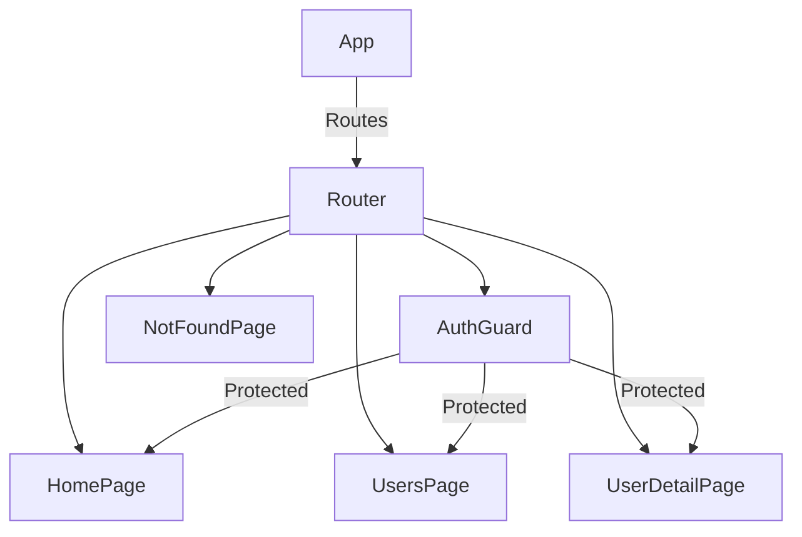

# Routing Standards — React Router v6

## Overview and scope

The purpose of this document is to establish comprehensive routing standards for applications developed using React Router v6 within the Xentic platform. These standards aim to ensure consistency, maintainability, and scalability across all front-end projects. 

### Audience

This document is intended for:
- Front-end developers at Xentic
- Software architects and team leads
- Quality assurance engineers
- Technical writers

### Scope

This standard applies to all new and existing React applications developed at Xentic. It encompasses:
- Route configuration
- Route protection mechanisms
- Lazy loading of components
- Navigation practices

### Non-goals

This document does not aim to:
- Define the overall architecture of Xentic applications
- Cover non-React applications or other frameworks
- Provide detailed instructions on React itself

### Glossary

| Term           | Definition                                                                 |
|----------------|-----------------------------------------------------------------------------|
| Route          | A mapping between a URL path and a React component.                        |
| AuthGuard      | A higher-order component that protects routes from unauthorized access.     |
| Lazy Loading    | A design pattern that loads components only when they are needed.          |
| Navigate       | A function provided by React Router to programmatically change routes.     |

### How This Standard Fits the Xentic Platform

The routing standards outlined in this document align with Xentic's commitment to delivering high-quality, user-friendly applications. By adhering to these standards, developers will create a more cohesive user experience, streamline the development process, and facilitate easier onboarding for new team members. 

### Route Configuration

The following example demonstrates the standard route configuration using React Router v6:

```typescript
const router = createBrowserRouter([
  { path: '/login', element: <LoginPage /> },
  {
    path: '/',
    element: <AuthGuard><AppLayout /></AuthGuard>,
    children: [
      { index: true, element: <Navigate to="/users" replace /> },
      { path: 'users', element: <Suspense fallback={<PageLoader />}><UsersPage /></Suspense> },
      { path: 'users/:id', element: <Suspense fallback={<PageLoader />}><UserDetailPage /></Suspense> },
    ],
  },
]);
```

### Auth Guard

Below is the implementation of the AuthGuard component, which protects routes from unauthorized access:

```typescript
export const AuthGuard = ({ children }: { children: ReactNode }) => {
  const token = useAuthStore(state => state.token);
  const location = useLocation();
  if (!token) return <Navigate to="/login" state={{ from: location }} replace />;
  return children;
};
```

### Rules

Developers MUST adhere to the following rules when implementing routing in Xentic applications:

- **All page-level components MUST be lazy loaded.**
- **Protected routes MUST use `AuthGuard`.**
- **Use nested routes for shared layouts.**
- **MUST NOT use `window.location.href` — always use `useNavigate`.**

By following these guidelines, developers will contribute to a more robust and maintainable codebase, ultimately enhancing the quality of applications delivered by Xentic.

## Standards and policies

1. **Route Naming Convention**  
   All routes MUST follow a consistent naming convention that reflects the component being rendered. Use lowercase and hyphens for multi-word paths.  
   Example:  
   - Correct: `/user-profile`, `/order-history`  
   - Incorrect: `/UserProfile`, `/OrderHistory`  

2. **Route Structure**  
   Routes MUST be structured hierarchically to represent the application's navigation flow. Parent routes SHOULD encapsulate child routes.  
   Example:  
   ```typescript
   const router = createBrowserRouter([
     {
       path: '/products',
       element: <ProductsLayout />,
       children: [
         { path: 'list', element: <ProductList /> },
         { path: 'details/:id', element: <ProductDetails /> },
       ],
     },
   ]);
   ```

3. **Error Handling**  
   A global error boundary MUST be implemented to catch errors in routing and display a user-friendly message.  
   Example:  
   ```typescript
   const ErrorBoundary = () => {
     return <div>Something went wrong. Please try again later.</div>;
   };
   ```

4. **404 Handling**  
   A catch-all route for 404 errors MUST be defined at the end of the route configuration.  
   Example:  
   ```typescript
   { path: '*', element: <NotFoundPage /> }
   ```

5. **Route Protection**  
   All routes that require authentication MUST utilize the `AuthGuard` component to ensure that unauthorized users are redirected.  
   Example:  
   ```typescript
   {
     path: '/admin',
     element: <AuthGuard><AdminPage /></AuthGuard>,
   }
   ```

6. **Dynamic Routing**  
   Dynamic routes MUST be defined using parameters and should be descriptive of the data being accessed.  
   Example:  
   ```typescript
   { path: '/products/:productId', element: <ProductDetail /> }
   ```

7. **State Management**  
   State management for routing MUST leverage React Context or a state management library to ensure consistent access across components.  

8. **Performance Optimization**  
   Lazy loading MUST be implemented for all non-critical routes to optimize initial load times.  
   Example:  
   ```typescript
   const LazyComponent = React.lazy(() => import('./LazyComponent'));
   ```

9. **Accessibility**  
   All navigational elements MUST be accessible, with appropriate ARIA roles and attributes to enhance usability for all users.  

10. **Documentation**  
    Each route MUST be documented in the codebase, explaining its purpose and any parameters it accepts. Use comments effectively.  
    Example:  
    ```typescript
    // Route for displaying user profile
    { path: '/user/:userId', element: <UserProfile /> }
    ```

11. **Testing**  
    All routes MUST be covered by unit tests to ensure expected behavior and error handling. Utilize testing libraries like Jest and React Testing Library.  

12. **Internationalization**  
    Routes MUST support internationalization by allowing for dynamic path segments based on the user's language preference.  
    Example:  
    ```typescript
    { path: '/:lang/products', element: <ProductsPage /> }
    ```

By adhering to these standards and policies, Xentic developers will ensure a high-quality, maintainable, and scalable routing architecture that aligns with the company's best practices.

## Architecture and design

The architecture for routing in React applications at Xentic is designed to be modular, scalable, and maintainable. The following sections outline the component diagram, data flows, integration points, and failure domains.

### Component Diagram

Below is a simplified component diagram illustrating the routing architecture using Mermaid syntax:



### Data Flows

The data flow within the routing architecture follows a unidirectional pattern:

- **User Interaction**: Users interact with the application through navigation links or buttons.
- **Route Change**: The `useNavigate` hook is invoked to change routes.
- **Auth Check**: The `AuthGuard` component checks for authentication tokens.
- **Component Rendering**: Based on the route, the appropriate component is rendered.
- **State Management**: Application state is managed through React Context or state management libraries, ensuring components receive the necessary data.

### Integration Points

The routing system integrates with various components and services:

| Component         | Description                                                  |
|-------------------|--------------------------------------------------------------|
| `AuthGuard`       | Protects routes by checking user authentication status.      |
| `Suspense`        | Handles lazy loading of components to improve performance.    |
| `ErrorBoundary`   | Catches errors during rendering and displays fallback UI.    |
| `useNavigate`     | Programmatically navigates between routes.                   |
| `React Context`   | Shares global state across components, including user data.  |

### Failure Domains

Identifying failure domains is essential for building resilient applications. The following failure domains are recognized:

1. **Authentication Failure**: If the authentication service fails, users should be redirected to the login page.
   - **Mitigation**: Implement error handling in the `AuthGuard` to provide user feedback.

2. **Component Loading Failure**: If a lazy-loaded component fails to load, a fallback UI must be displayed.
   - **Mitigation**: Use `Suspense` with a fallback component to handle loading errors gracefully.

3. **Route Not Found**: When users navigate to a non-existent route, a 404 page should be displayed.
   - **Mitigation**: Ensure a catch-all route is defined at the end of the routing configuration.

4. **State Management Failure**: Issues with state management can lead to inconsistent UI.
   - **Mitigation**: Regularly test and monitor state updates, ensuring all components react to changes appropriately.

5. **Network Issues**: If a network request fails while fetching data for a route, the application should handle this gracefully.
   - **Mitigation**: Implement retry logic and user notifications for network errors.

By adhering to these architectural guidelines and understanding the data flows, integration points, and potential failure domains, Xentic developers will build robust and maintainable routing systems that enhance user experience and application performance.

## Configuration reference

### Application Configuration (application.yml)

The following table outlines the configuration settings for routing in Xentic applications. This configuration file should be placed in the root of the application.

| Property                      | Default Value          | Production Value       | Description                                               |
|-------------------------------|-----------------------|------------------------|-----------------------------------------------------------|
| `routing.basePath`           | `/`                   | `/`                    | Base path for the application routes.                     |
| `routing.lazyLoad`           | `true`                | `true`                 | Enable lazy loading for non-critical routes.              |
| `routing.authGuardEnabled`   | `true`                | `true`                 | Enable authentication guard for protected routes.         |
| `routing.errorBoundary`       | `true`                | `true`                 | Enable global error boundary for error handling.          |
| `routing.notFoundPage`       | `NotFoundPage`        | `NotFoundPage`         | Component to render for 404 errors.                       |
| `routing.defaultLanguage`     | `en`                  | `en`                   | Default language for internationalization.                |

Example `application.yml`:

```yaml
routing:
  basePath: /
  lazyLoad: true
  authGuardEnabled: true
  errorBoundary: true
  notFoundPage: NotFoundPage
  defaultLanguage: en
```

### Terraform Configuration

For infrastructure as code, the following Terraform variables should be defined to configure routing:

| Variable                     | Default Value          | Description                                               |
|------------------------------|-----------------------|-----------------------------------------------------------|
| `routing_base_path`          | `/`                   | Base path for the application routes.                     |
| `routing_lazy_load`          | `true`                | Enable lazy loading for non-critical routes.              |
| `routing_auth_guard_enabled`  | `true`                | Enable authentication guard for protected routes.         |
| `routing_error_boundary`      | `true`                | Enable global error boundary for error handling.          |
| `routing_not_found_page`     | `NotFoundPage`        | Component to render for 404 errors.                       |

Example Terraform configuration:

```hcl
variable "routing_base_path" {
  default = "/"
}

variable "routing_lazy_load" {
  default = true
}

variable "routing_auth_guard_enabled" {
  default = true
}

variable "routing_error_boundary" {
  default = true
}

variable "routing_not_found_page" {
  default = "NotFoundPage"
}
```

### Environment Variables

Developers MUST define the following environment variables for routing configurations. These can be set in the `.env` file or directly in the environment.

| Environment Variable         | Default Value          | Description                                               |
|------------------------------|-----------------------|-----------------------------------------------------------|
| `REACT_APP_ROUTING_BASE_PATH`| `/`                   | Base path for the application routes.                     |
| `REACT_APP_ROUTING_LAZY_LOAD`| `true`                | Enable lazy loading for non-critical routes.              |
| `REACT_APP_ROUTING_AUTH_GUARD_ENABLED`| `true`        | Enable authentication guard for protected routes.         |
| `REACT_APP_ROUTING_ERROR_BOUNDARY`| `true`          | Enable global error boundary for error handling.          |
| `REACT_APP_ROUTING_NOT_FOUND_PAGE`| `NotFoundPage`    | Component to render for 404 errors.                       |

Example `.env` file:

```
REACT_APP_ROUTING_BASE_PATH=/
REACT_APP_ROUTING_LAZY_LOAD=true
REACT_APP_ROUTING_AUTH_GUARD_ENABLED=true
REACT_APP_ROUTING_ERROR_BOUNDARY=true
REACT_APP_ROUTING_NOT_FOUND_PAGE=NotFoundPage
```

By adhering to these configuration standards, Xentic developers will ensure that routing is consistently managed across all environments, contributing to a reliable and maintainable application architecture.

## Implementation guide

To implement routing in a React application at Xentic using React Router v6, follow these step-by-step instructions. This guide covers the setup of the routing structure, the creation of components, and the integration of authentication guards.

### Step 1: Install React Router

Ensure that React Router is installed in your project. Run the following command in your terminal:

```bash
npm install react-router-dom
```

### Step 2: Create the Routing Structure

Create a `Router.tsx` file in your `src` directory. This file will define the routes for your application.

```typescript
// src/Router.tsx
import React from 'react';
import { BrowserRouter as Router, Routes, Route } from 'react-router-dom';
import AuthGuard from './components/AuthGuard';
import HomePage from './pages/HomePage';
import UsersPage from './pages/UsersPage';
import UserDetailPage from './pages/UserDetailPage';
import NotFoundPage from './pages/NotFoundPage';

const AppRouter: React.FC = () => {
    return (
        <Router>
            <Routes>
                <Route path="/" element={<HomePage />} />
                <Route 
                    path="/users" 
                    element={
                        <AuthGuard>
                            <UsersPage />
                        </AuthGuard>
                    } 
                />
                <Route 
                    path="/users/:id" 
                    element={
                        <AuthGuard>
                            <UserDetailPage />
                        </AuthGuard>
                    } 
                />
                <Route path="*" element={<NotFoundPage />} />
            </Routes>
        </Router>
    );
};

export default AppRouter;
```

### Step 3: Create the AuthGuard Component

The `AuthGuard` component will protect routes that require authentication. Create a new file named `AuthGuard.tsx`.

```typescript
// src/components/AuthGuard.tsx
import React from 'react';
import { Navigate } from 'react-router-dom';

const AuthGuard: React.FC<{ children: React.ReactNode }> = ({ children }) => {
    const isAuthenticated = Boolean(localStorage.getItem('authToken')); // Example authentication check

    if (!isAuthenticated) {
        return <Navigate to="/" replace />;
    }

    return <>{children}</>;
};

export default AuthGuard;
```

### Step 4: Create Page Components

Create the necessary page components in the `src/pages` directory.

**HomePage.tsx**

```typescript
// src/pages/HomePage.tsx
import React from 'react';

const HomePage: React.FC = () => {
    return <h1>Welcome to Xentic</h1>;
};

export default HomePage;
```

**UsersPage.tsx**

```typescript
// src/pages/UsersPage.tsx
import React from 'react';

const UsersPage: React.FC = () => {
    return <h1>Users List</h1>;
};

export default UsersPage;
```

**UserDetailPage.tsx**

```typescript
// src/pages/UserDetailPage.tsx
import React from 'react';
import { useParams } from 'react-router-dom';

const UserDetailPage: React.FC = () => {
    const { id } = useParams<{ id: string }>();
    return <h1>User Detail for ID: {id}</h1>;
};

export default UserDetailPage;
```

**NotFoundPage.tsx**

```typescript
// src/pages/NotFoundPage.tsx
import React from 'react';

const NotFoundPage: React.FC = () => {
    return <h1>404 - Page Not Found</h1>;
};

export default NotFoundPage;
```

### Step 5: Integrate the Router into Your Application

In your main application file (e.g., `App.tsx`), import and use the `AppRouter` component.

```typescript
// src/App.tsx
import React from 'react';
import AppRouter from './Router';

const App: React.FC = () => {
    return <AppRouter />;
};

export default App;
```

### Step 6: Testing the Routing

Run your application using:

```bash
npm start
```

Navigate through the application to ensure that the routing works correctly. Access protected routes to verify that the `AuthGuard` redirects unauthenticated users properly.

### Summary

By following these steps, Xentic developers will establish a robust routing structure using React Router v6. The integration of an authentication guard ensures that sensitive routes are protected, enhancing the security of the application.

## Security requirements

### Threat Model Summary

The security of the application is paramount to protect sensitive user data and maintain the integrity of the system. The following threats have been identified:

- **Unauthorized Access**: Users may attempt to access protected resources without proper authentication.
- **Data Leakage**: Sensitive information may be exposed through improper handling of user input or errors.
- **Cross-Site Scripting (XSS)**: Malicious scripts may be injected into the application through unsanitized input.
- **Denial of Service (DoS)**: Attackers may attempt to overwhelm the application with excessive requests.

### Authentication and Authorization

Xentic applications MUST implement robust authentication and authorization mechanisms. The following practices MUST be adhered to:

- Use OAuth 2.0 or JWT for authentication.
- Store authentication tokens securely in `localStorage` or `sessionStorage`.
- Validate user roles and permissions on the server-side before granting access to resources.

Example of checking authentication in `AuthGuard`:

```typescript
const isAuthenticated = Boolean(localStorage.getItem('authToken')); // Example authentication check
```

### Secrets Management

Secrets, such as API keys and database credentials, MUST NOT be hard-coded in the application. Instead, they should be managed using environment variables or a secrets management tool.

Example of defining secrets in a `.env` file:

```
REACT_APP_API_KEY=your_api_key_here
REACT_APP_DB_PASSWORD=your_db_password_here
```

### Input Validation

All user inputs MUST be validated both on the client-side and server-side to prevent injection attacks and ensure data integrity. Use libraries like `Yup` or `Joi` for schema validation.

Example of input validation using `Yup`:

```typescript
import * as Yup from 'yup';

const userSchema = Yup.object().shape({
    username: Yup.string().required('Username is required'),
    email: Yup.string().email('Invalid email').required('Email is required'),
    password: Yup.string().min(8, 'Password must be at least 8 characters').required('Password is required'),
});
```

### Audit Logging

Audit logging is essential for tracking user actions and detecting potential security incidents. Xentic applications MUST implement logging for critical actions, including:

- User logins and logouts
- Changes to user roles or permissions
- Access to sensitive data

Log entries should include:

| Field                | Description                             |
|----------------------|-----------------------------------------|
| `timestamp`          | The date and time of the action        |
| `userId`            | The ID of the user performing the action|
| `action`             | Description of the action performed     |
| `ipAddress`          | IP address of the user                  |

Example of logging a user login action:

```typescript
const logUserLogin = (userId: string) => {
    const logEntry = {
        timestamp: new Date().toISOString(),
        userId,
        action: 'User Login',
        ipAddress: window.location.hostname,
    };
    console.log(logEntry); // Replace with actual logging mechanism
};
```

By adhering to these security requirements, Xentic developers will significantly enhance the security posture of the application, protecting both user data and system integrity.

## Testing strategy

To ensure the reliability and maintainability of routing in Xentic's React applications, a comprehensive testing strategy must be implemented. This strategy includes unit tests, integration tests, and contract tests, with specific coverage targets to maintain high code quality.

### Testing Types

1. **Unit Tests**: 
   - Validate individual components and functions in isolation.
   - Focus on testing the behavior of components like `AuthGuard`, `HomePage`, and routing logic in `Router.tsx`.

2. **Integration Tests**: 
   - Test the interaction between components and the routing system.
   - Ensure that components render correctly when routed to specific paths.

3. **Contract Tests**: 
   - Verify that the API responses match the expected structure when integrating with backend services.
   - Ensure that routing behavior aligns with the defined contracts.

### Coverage Targets

- **Unit Test Coverage**: 80% or higher
- **Integration Test Coverage**: 70% or higher
- **Contract Test Coverage**: 100% for all public APIs

### Example Test Classes

#### Unit Tests

```typescript
// src/__tests__/AuthGuard.test.tsx
import React from 'react';
import { render } from '@testing-library/react';
import { MemoryRouter } from 'react-router-dom';
import AuthGuard from '../components/AuthGuard';

test('renders children when authenticated', () => {
    localStorage.setItem('authToken', 'test-token');
    const { getByText } = render(
        <MemoryRouter>
            <AuthGuard>
                <h1>Protected Content</h1>
            </AuthGuard>
        </MemoryRouter>
    );
    expect(getByText('Protected Content')).toBeInTheDocument();
});

test('redirects to home when not authenticated', () => {
    localStorage.removeItem('authToken');
    const { container } = render(
        <MemoryRouter>
            <AuthGuard>
                <h1>Protected Content</h1>
            </AuthGuard>
        </MemoryRouter>
    );
    expect(container).toBeEmptyDOMElement(); // Expect redirect to happen
});
```

#### Integration Tests

```typescript
// src/__tests__/Router.test.tsx
import React from 'react';
import { render } from '@testing-library/react';
import { MemoryRouter, Routes, Route } from 'react-router-dom';
import AppRouter from '../Router';
import HomePage from '../pages/HomePage';
import UsersPage from '../pages/UsersPage';

test('renders HomePage at root path', () => {
    const { getByText } = render(
        <MemoryRouter initialEntries={['/']}>
            <AppRouter />
        </MemoryRouter>
    );
    expect(getByText('Welcome to Xentic')).toBeInTheDocument();
});

test('renders UsersPage when authenticated', () => {
    localStorage.setItem('authToken', 'test-token');
    const { getByText } = render(
        <MemoryRouter initialEntries={['/users']}>
            <AppRouter />
        </MemoryRouter>
    );
    expect(getByText('Users List')).toBeInTheDocument();
});
```

#### Contract Tests

Using a testing library such as `supertest` to validate API responses:

```typescript
// src/__tests__/api.test.ts
import request from 'supertest';
import app from '../app'; // Assuming you have an Express app

describe('GET /api/users', () => {
    it('should return a list of users', async () => {
        const response = await request(app).get('/api/users');
        expect(response.status).toBe(200);
        expect(response.body).toMatchObject([
            { id: expect.any(Number), username: expect.any(String) }
        ]);
    });
});
```

### Summary of Testing Strategy

| Test Type         | Coverage Target | Description                                      |
|-------------------|----------------|--------------------------------------------------|
| Unit Tests        | 80%            | Validate individual components and functions      |
| Integration Tests | 70%            | Test interactions between components and routing  |
| Contract Tests    | 100%           | Verify API responses match expected structures    |

By implementing this testing strategy, Xentic developers will ensure that the routing functionality is robust, reliable, and maintainable, thereby enhancing the overall quality of the application.

## Observability and operations

To ensure the reliability and performance of Xentic's React applications utilizing React Router v6, observability practices MUST be established. This includes metrics, logs, traces, dashboards, alerts, and Service Level Objectives (SLOs). The following guidelines detail the necessary components for effective observability and operations.

### Metrics

Xentic applications MUST collect the following metrics to monitor routing performance:

- **Page Load Times**: Measure the time taken to load different routes.
- **Error Rates**: Track the number of 404 errors and other HTTP status codes.
- **User Navigation Paths**: Analyze the most common routes taken by users.
- **Session Duration**: Measure how long users stay on the application.

Example of collecting metrics using a monitoring library:

```typescript
import { useEffect } from 'react';
import { useLocation } from 'react-router-dom';
import { reportPageLoadTime, reportErrorRate } from './metricsService';

const usePageMetrics = () => {
    const location = useLocation();

    useEffect(() => {
        const startTime = performance.now();
        
        return () => {
            const loadTime = performance.now() - startTime;
            reportPageLoadTime(location.pathname, loadTime);
        };
    }, [location]);
};
```

### Logs

Comprehensive logging MUST be implemented to capture essential events and errors. Logs should include:

- **User Actions**: Log significant user interactions such as navigation events.
- **Error Logs**: Capture errors encountered during routing or component rendering.
- **Performance Logs**: Record performance-related data, including load times.

Example of logging user navigation:

```typescript
import { useEffect } from 'react';
import { useLocation } from 'react-router-dom';
import { logNavigation } from './loggingService';

const useNavigationLogging = () => {
    const location = useLocation();

    useEffect(() => {
        logNavigation(location.pathname);
    }, [location]);
};
```

### Traces

Distributed tracing MUST be utilized to track requests across services. This allows for identifying bottlenecks and understanding the flow of requests through the application. Implement tracing using tools such as OpenTelemetry.

Example of tracing a request:

```typescript
import { trace } from '@opentelemetry/api';

const tracer = trace.getTracer('xentic-router');

const traceRequest = (route: string) => {
    const span = tracer.startSpan(`Navigating to ${route}`);
    // Perform navigation logic...
    span.end();
};
```

### Dashboards

Dashboards MUST be created to visualize key metrics and logs. Xentic developers SHOULD use tools like Grafana or Kibana to create dashboards that display:

- Page load times and trends over time.
- Error rates and types of errors encountered.
- User navigation paths and session durations.

### Alerts

Alerts MUST be configured to notify the team of critical issues. Set up alerts for:

- High error rates (e.g., more than 5% of requests resulting in 404 errors).
- Increased page load times (e.g., average load time exceeding 2 seconds).
- Unusual user activity patterns (e.g., spikes in navigation to error pages).

### Service Level Objectives (SLOs)

SLOs MUST be defined to measure the reliability of the routing system. Examples of SLOs include:

| Objective               | Target                | Description                                       |
|-------------------------|----------------------|---------------------------------------------------|
| Page Load Time          | 95% < 2 seconds      | 95% of page loads should complete in under 2 seconds. |
| Error Rate              | < 1%                 | Less than 1% of all requests should result in an error. |
| User Session Duration    | > 5 minutes          | Average user session duration should exceed 5 minutes. |

### On-Call Runbook Steps

In the event of an incident, the following on-call runbook steps MUST be followed:

1. **Identify the Incident**: Review alerts and logs to determine the nature of the incident.
2. **Assess Impact**: Determine the number of affected users and the severity of the issue.
3. **Gather Metrics**: Collect relevant metrics to understand the extent of the problem.
4. **Communicate**: Notify stakeholders and affected users about the incident.
5. **Implement Fixes**: Apply necessary fixes or workarounds to mitigate the issue.
6. **Post-Incident Review**: Conduct a review to analyze the incident and improve future responses.

By adhering to these observability and operations standards, Xentic developers will ensure that the routing functionality is not only reliable but also continuously monitored for performance and issues, leading to an improved user experience.

## Migration and versioning

When upgrading to React Router v6, Xentic developers MUST follow a structured migration and versioning policy to ensure stability and backward compatibility. The following guidelines outline the upgrade paths, deprecation policies, backward compatibility considerations, and rollback procedures.

### Upgrade Paths

- **Major Version Upgrades**: Upgrading from v5 to v6 is considered a major version change. Developers MUST review the [official migration guide](https://reactrouter.com/docs/en/v6/upgrading/v5) for detailed instructions.
- **Minor and Patch Updates**: For minor and patch updates within the same major version (e.g., v6.x), developers SHOULD regularly update to benefit from bug fixes and performance improvements.

### Deprecation Policy

- **Deprecation Notices**: Xentic developers MUST regularly check for deprecation notices in the release notes. Any features marked as deprecated MUST be phased out in future releases.
- **Grace Period**: Deprecated features will remain functional for at least one major version after the deprecation notice. Developers MUST plan to replace deprecated features within this timeframe.

### Backward Compatibility

- **Routing Structure**: React Router v6 introduces a new routing structure. Developers MUST refactor existing routes to comply with the new `<Routes>` component and nested routing patterns.
  
  Example of refactoring routes:

  ```javascript
  // Before (v5)
  import { BrowserRouter as Router, Route } from 'react-router-dom';

  <Router>
      <Route path="/" component={HomePage} />
      <Route path="/users" component={UsersPage} />
  </Router>

  // After (v6)
  import { BrowserRouter as Router, Routes, Route } from 'react-router-dom';

  <Router>
      <Routes>
          <Route path="/" element={<HomePage />} />
          <Route path="/users" element={<UsersPage />} />
      </Routes>
  </Router>
  ```

- **API Changes**: Some APIs have changed in v6. Developers MUST review the API changes and update their code accordingly.

### Rollback Procedures

In the event of a failed upgrade or critical issues arising from the new version, developers MUST have a rollback strategy in place:

1. **Version Control**: Ensure that all changes are committed to version control (e.g., Git). Use tags to mark stable releases.
2. **Testing**: Before upgrading, run all tests to establish a baseline. After the upgrade, run the tests again to identify issues.
3. **Rollback Steps**:
   - If issues are detected, revert to the previous stable version using version control.
   - Clear the build cache and reinstall dependencies:
     ```bash
     npm install
     ```
   - Redeploy the application to the previous stable version.

4. **Post-Rollback Review**: Conduct a review to understand the reasons for the failure and document the findings for future upgrades.

### Versioning Strategy

Xentic applications MUST adhere to semantic versioning (SemVer) for all internal libraries and components. The versioning format should be `MAJOR.MINOR.PATCH`, where:

- **MAJOR** version increases when incompatible API changes are introduced.
- **MINOR** version increases when functionality is added in a backward-compatible manner.
- **PATCH** version increases when backward-compatible bug fixes are made.

### Example Versioning Table

| Version | Release Date | Changes                                   |
|---------|--------------|-------------------------------------------|
| 6.0.0  | YYYY-MM-DD   | Major upgrade with new routing structure  |
| 6.1.0  | YYYY-MM-DD   | Added new features and backward-compatible updates |
| 6.1.1  | YYYY-MM-DD   | Bug fixes and performance improvements     |

By following these migration and versioning standards, Xentic developers will maintain the integrity and reliability of applications while ensuring a smooth transition to new versions of React Router.

### FAQ, anti-patterns, and checklists

#### FAQ

1. **What is React Router?**
   - React Router is a standard library for routing in React applications, enabling navigation among views of various components.

2. **What are the key features of React Router v6?**
   - Key features include nested routes, route ranking, improved data loading, and a simpler API.

3. **How do I define routes in React Router v6?**
   - Routes are defined using the `<Routes>` component, which contains `<Route>` elements specifying paths and components.

4. **Can I use dynamic routing with React Router v6?**
   - Yes, dynamic routing is supported. You can define routes that accept URL parameters.

5. **What is the difference between `element` and `component` in route definitions?**
   - In v6, you use `element` to render components, while `component` has been removed. You must pass JSX to `element`.

6. **How can I handle 404 pages in React Router v6?**
   - You can define a catch-all route at the end of your routes to handle 404 errors.

   ```javascript
   <Routes>
       <Route path="/" element={<HomePage />} />
       <Route path="*" element={<NotFoundPage />} />
   </Routes>
   ```

7. **How do I navigate programmatically in React Router v6?**
   - Use the `useNavigate` hook to programmatically navigate within your components.

   ```javascript
   const navigate = useNavigate();
   const handleClick = () => {
       navigate('/users');
   };
   ```

8. **What is the purpose of the `Outlet` component?**
   - The `Outlet` component is used to render child routes in a parent route.

9. **How can I protect routes in React Router v6?**
   - Use a custom wrapper component that checks authentication status and conditionally renders the desired component or redirects.

10. **What should I do if I encounter issues with route transitions?**
    - Ensure that your components are properly structured and that you are using the correct hooks. Review the console for errors and check the documentation for troubleshooting tips.

#### Anti-Patterns

| Anti-Pattern                          | Description                                                                                          |
|---------------------------------------|------------------------------------------------------------------------------------------------------|
| Using `component` prop in routes     | The `component` prop is deprecated in v6. Always use the `element` prop to pass JSX.               |
| Not using `<Routes>` for routing      | Failing to wrap routes in `<Routes>` will lead to unexpected behavior and routing issues.          |
| Overusing nested routes                | Excessive nesting can lead to complex routing structures that are hard to manage and debug.        |
| Directly manipulating the history      | Avoid using `window.history` directly; always use the `useNavigate` hook for navigation.            |
| Ignoring route transitions            | Not handling transitions can lead to a poor user experience. Use `useTransition` for smooth transitions. |

#### Pre-Merge Checklist

- [ ] Ensure all routes are defined using `<Routes>` and `<Route>`.
- [ ] Verify that all route paths are unique and correctly defined.
- [ ] Check for proper use of the `element` prop in routes.
- [ ] Confirm that all dynamic routes are functioning as expected.
- [ ] Validate that 404 handling is implemented correctly.
- [ ] Review component structure for clarity and maintainability.
- [ ] Ensure that all navigation methods use the `useNavigate` hook.
- [ ] Run unit tests to confirm routing behavior.

#### Production Checklist

- [ ] Verify that all routes are tested in staging before deployment.
- [ ] Ensure that logging for navigation and errors is implemented.
- [ ] Confirm that performance metrics are being collected.
- [ ] Review the application for any deprecated features and plan for their removal.
- [ ] Ensure that user authentication and authorization are correctly implemented for protected routes.
- [ ] Conduct a final review of the application for any routing issues.
- [ ] Deploy the application to production and monitor for any unexpected routing behavior.
