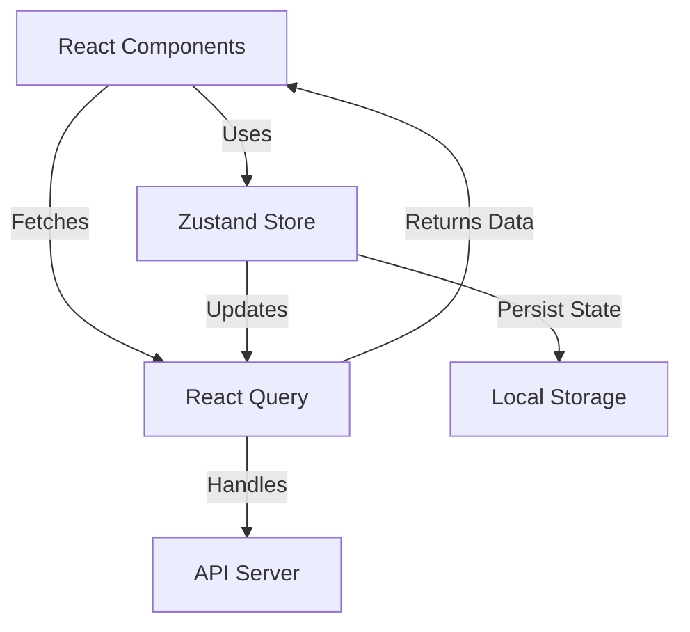

# State Management — React + Zustand + React Query

## Overview and scope

The purpose of this document is to establish a comprehensive standard for state management in React applications utilizing Zustand and React Query within the Xentic platform. This standard aims to guide developers in making informed decisions regarding state management strategies, ensuring consistency, maintainability, and performance across all projects.

### Audience

This document is intended for:
- Frontend Developers
- Technical Leads
- Architects
- Quality Assurance Engineers

### Scope

This standard covers:
- The decision-making process for choosing between React Query, Zustand, and local state management (e.g., `useState`, `useReducer`).
- Best practices for implementing server state management with React Query.
- Guidelines for managing global client state using Zustand.
- Code examples illustrating the correct usage of these libraries.

### Non-goals

This document does NOT cover:
- State management solutions outside of React, Zustand, or React Query.
- Detailed implementation of complex business logic or application architecture.
- Integration of third-party libraries unrelated to state management.

### Glossary

| Term               | Definition                                                                 |
|--------------------|-----------------------------------------------------------------------------|
| **Server State**   | Data that is fetched from a server and may be cached for performance.      |
| **Client State**   | Data that is managed locally within the application, such as UI state.     |
| **Zustand**        | A minimalistic state management library for React applications.            |
| **React Query**    | A library for fetching, caching, and synchronizing server state in React.  |
| **useState**       | A React hook for managing local state in functional components.            |
| **useReducer**     | A React hook for managing complex state logic in functional components.    |

### How This Standard Fits the Xentic Platform

The Xentic platform emphasizes the importance of a cohesive development experience, ensuring that all applications adhere to established best practices. By following this state management standard, developers will:
- Enhance collaboration through a shared understanding of state management techniques.
- Improve code quality and reduce technical debt by adhering to prescribed patterns.
- Facilitate easier onboarding of new team members by providing clear guidelines.

### State Decision Tree

| Criteria                        | State Management Approach         |
|---------------------------------|-----------------------------------|
| Server data (fetched/cached)    | React Query                       |
| Shared across features           | Zustand store                     |
| UI-only (open/close, form field) | useState / useReducer             |

### React Query — Server State

```typescript
export const userKeys = {
  all: ['users'] as const,
  list: (filters: object) => [...userKeys.all, 'list', filters] as const,
  detail: (id: string) => [...userKeys.all, 'detail', id] as const,
};

export const useUsers = (page: number, size: number) =>
  useQuery({
    queryKey: userKeys.list({ page, size }),
    queryFn: () => api.get<UserListResponse>(`/users?page=${page}&size=${size}`),
    staleTime: 5 * 60 * 1000,
  });

export const useCreateUser = () => {
  const queryClient = useQueryClient();
  return useMutation({
    mutationFn: (data: CreateUserRequest) => api.post<User>('/users', data),
    onSuccess: () => queryClient.invalidateQueries({ queryKey: userKeys.all }),
  });
};
```

### Zustand — Global Client State

```typescript
export const useAuthStore = create<AuthState>()(
  persist(
    (set) => ({
      user: null,
      token: null,
      login: (user, token) => set({ user, token }),
      logout: () => set({ user: null, token: null }),
    }),
    { name: 'auth-storage' }
  )
);
```

### Rules

- **MUST NOT** use Zustand for server data — React Query owns that responsibility.
- **MUST NOT** use `useEffect` combined with `useState` for data fetching.
- **MUST** split Zustand stores by domain — avoid creating a global mega-store.

## Standards and policies

1. **MUST** use `React Query` for managing server state. This includes any data that is fetched from APIs and requires caching, synchronization, or background updates.

2. **MUST NOT** use Zustand for server state management. Zustand is intended for client state only, and using it for server state can lead to inconsistencies and performance issues.

3. **MUST** utilize `Zustand` for managing global client state that is shared across multiple components. This includes user authentication state, theme settings, and other application-wide settings.

4. **SHOULD** use `useState` or `useReducer` for managing local component state. This is appropriate for UI-specific states such as form inputs, toggle states, or any transient state that does not need to be shared.

5. **MUST** create separate Zustand stores for different domains or features. This enhances maintainability and prevents the creation of a global mega-store that can become unwieldy.

6. **MUST NOT** mix server state and client state in the same Zustand store. This separation ensures clarity and avoids potential bugs related to state management.

7. **SHOULD** define clear and descriptive keys for queries in React Query to improve readability and maintainability. Use a consistent naming convention across the application.

   | Key Type      | Example                     |
   |---------------|-----------------------------|
   | All           | `['users']`                 |
   | List          | `['users', 'list', filters]`|
   | Detail        | `['users', 'detail', id]`   |

8. **MUST** handle loading and error states when using React Query. This ensures a better user experience by providing feedback during data fetching.

   ```typescript
   const { data, error, isLoading } = useUsers(page, size);
   if (isLoading) return <LoadingSpinner />;
   if (error) return <ErrorMessage message={error.message} />;
   ```

9. **SHOULD** use the `onSuccess`, `onError`, and `onSettled` callbacks in React Query mutations to handle side effects, such as invalidating queries or updating local state.

10. **MUST** persist Zustand state where necessary, such as user authentication tokens, to ensure that the application retains state across sessions.

    ```typescript
    export const useAuthStore = create<AuthState>()(
      persist(
        (set) => ({
          user: null,
          token: null,
          login: (user, token) => set({ user, token }),
          logout: () => set({ user: null, token: null }),
        }),
        { name: 'auth-storage' }
      )
    );
    ```

11. **MUST NOT** use `useEffect` for data fetching when using React Query. Instead, leverage the built-in data fetching capabilities of React Query to handle server state.

12. **SHOULD** implement error boundaries in components that utilize React Query to gracefully handle unexpected errors and improve user experience.

13. **MUST** document all Zustand stores and React Query hooks with JSDoc comments to provide clarity on their purpose and usage.

14. **SHOULD** consider performance implications when using Zustand and React Query, especially in large applications. Profile and optimize where necessary.

15. **MUST** ensure that all state management code adheres to the Xentic coding standards, including naming conventions, file organization, and documentation practices.

By adhering to these standards and policies, Xentic developers will ensure that state management in React applications is consistent, maintainable, and performant.

## Architecture and design

The architecture for state management in Xentic's React applications using Zustand and React Query is designed to provide clear separation of concerns, maintainability, and performance. Below is a component diagram, data flow description, integration points, and failure domains.



### Data Flows

1. **Component to Zustand Store**: Components interact with Zustand stores to retrieve and update global client state. For example, a login component may call the `login` method on the Zustand store to update the authentication state.

2. **Component to React Query**: Components utilize React Query to fetch server state. The hooks defined in React Query manage the fetching and caching of data, returning the results to the components.

3. **Zustand Store to React Query**: Zustand can be used to trigger updates or side effects in React Query. For instance, when a user logs in, the Zustand store can notify React Query to refetch user-related data.

4. **React Query to API Server**: React Query handles all interactions with the API server, including GET, POST, PUT, and DELETE requests. It manages the caching and synchronization of the server state.

5. **Zustand Store to Local Storage**: Zustand stores can persist state to local storage, allowing the application to retain user preferences or authentication tokens across sessions.

### Integration Points

- **Zustand Store**: 
  - Global state management for user authentication, theme settings, and other shared states.
  - Example of a Zustand store for authentication:
  
    ```typescript
    export const useAuthStore = create<AuthState>()(
      persist(
        (set) => ({
          user: null,
          token: null,
          login: (user, token) => set({ user, token }),
          logout: () => set({ user: null, token: null }),
        }),
        { name: 'auth-storage' }
      )
    );
    ```

- **React Query**: 
  - Handles all server state management, including fetching, caching, and synchronization.
  - Example of a React Query hook for fetching users:

    ```typescript
    export const useUsers = (page: number, size: number) =>
      useQuery({
        queryKey: userKeys.list({ page, size }),
        queryFn: () => api.get<UserListResponse>(`/users?page=${page}&size=${size}`),
        staleTime: 5 * 60 * 1000,
      });
    ```

### Failure Domains

1. **Zustand Store Failures**: 
   - If the Zustand store fails to update (e.g., due to a bug in the state management logic), components relying on that state may not render correctly. This can lead to inconsistent UI states.

2. **React Query Failures**: 
   - If a network request fails (e.g., due to server downtime or network issues), React Query will handle the error state. Components must implement error handling to provide feedback to users.

3. **Local Storage Failures**: 
   - If local storage is unavailable (e.g., in private browsing mode), the application should gracefully handle the absence of persisted state without crashing.

4. **API Server Failures**: 
   - If the API server is down or returns an error, React Query will provide mechanisms to handle loading and error states. Components must be designed to handle these scenarios.

### Summary

By adhering to the architecture and design principles outlined in this section, Xentic developers will ensure that state management in React applications is robust, efficient, and maintainable. The clear separation of concerns between server state and client state, along with well-defined integration points, will facilitate a smooth development experience and enhance application performance.

## Configuration reference

### application.yml

This section outlines the configuration settings for the application, including defaults and production values.

```yaml
server:
  port: 8080

database:
  url: jdbc:mysql://localhost:3306/xentic_db
  username: xentic_user
  password: xentic_password

auth:
  jwt:
    secret: your_jwt_secret_key
    expiration: 3600 # in seconds

logging:
  level:
    root: INFO
    com.xentic: DEBUG

zustand:
  persist:
    enabled: true
    storage: localStorage

react-query:
  defaultOptions:
    queries:
      staleTime: 300000 # 5 minutes
      cacheTime: 600000 # 10 minutes
    mutations:
      onError: "handleError"
```

### Terraform Configuration

Below is the Terraform configuration for deploying the application, including environment variables.

| Resource Type        | Resource Name        | Default Value                      | Production Value                     |
|----------------------|----------------------|------------------------------------|--------------------------------------|
| `aws_instance`       | `xentic_app_server`  | `t2.micro`                         | `t2.medium`                          |
| `aws_db_instance`    | `xentic_db`          | `db.t2.micro`                     | `db.t2.medium`                       |
| `aws_security_group` | `xentic_sg`          | `allow all`                       | `allow http, https, and mysql`      |

### Environment Variables

| Variable Name            | Default Value              | Production Value            |
|--------------------------|----------------------------|-----------------------------|
| `NODE_ENV`               | `development`              | `production`                |
| `REACT_APP_API_URL`     | `http://localhost:8080/api`| `https://api.xentic.io`    |
| `REACT_APP_AUTH_SECRET`  | `your_jwt_secret_key`     | `your_production_jwt_secret`|

### Summary of Configuration

- **application.yml**: Contains application-specific settings, including server, database, authentication, logging, Zustand persistence, and React Query options.
- **Terraform Configuration**: Defines infrastructure resources, including instance types for application and database, along with security group rules.
- **Environment Variables**: Specifies environment-specific configurations that should be set before deploying to production.

By following these configuration guidelines, Xentic developers will ensure that the application is properly set up for both development and production environments, enhancing reliability and maintainability.

## Implementation guide

To implement state management in a React application using Zustand and React Query, follow the step-by-step guide below. This guide includes examples for setting up Zustand stores, using React Query for data fetching, and integrating both for a seamless state management experience.

### Step 1: Install Required Packages

First, ensure that you have the necessary packages installed in your React project:

```bash
npm install zustand react-query axios
```

### Step 2: Create Zustand Store

Create a Zustand store for managing authentication state. This store will handle user login and logout actions.

```typescript
// src/stores/authStore.ts
import create from 'zustand';
import { persist } from 'zustand/middleware';

interface AuthState {
  user: string | null;
  token: string | null;
  login: (user: string, token: string) => void;
  logout: () => void;
}

export const useAuthStore = create<AuthState>()(
  persist(
    (set) => ({
      user: null,
      token: null,
      login: (user, token) => set({ user, token }),
      logout: () => set({ user: null, token: null }),
    }),
    { name: 'auth-storage' }
  )
);
```

### Step 3: Set Up React Query

Next, configure React Query to manage server state. Create a custom hook for fetching user data.

```typescript
// src/hooks/useUsers.ts
import { useQuery } from 'react-query';
import axios from 'axios';

const fetchUsers = async (page: number, size: number) => {
  const response = await axios.get(`/api/users?page=${page}&size=${size}`);
  return response.data;
};

export const useUsers = (page: number, size: number) => {
  return useQuery(['users', page, size], () => fetchUsers(page, size), {
    staleTime: 5 * 60 * 1000, // 5 minutes
  });
};
```

### Step 4: Implement Authentication Logic

Create a login component that utilizes both Zustand and React Query. This component will handle user authentication and fetch user data upon successful login.

```typescript
// src/components/Login.tsx
import React, { useState } from 'react';
import { useAuthStore } from '../stores/authStore';
import { useUsers } from '../hooks/useUsers';

const Login: React.FC = () => {
  const [username, setUsername] = useState('');
  const [password, setPassword] = useState('');
  const { login } = useAuthStore();
  const { data: users, refetch } = useUsers(1, 10);

  const handleLogin = async () => {
    // Simulate API call for authentication
    const token = 'fake-jwt-token'; // Replace with real token from API
    login(username, token);
    await refetch(); // Fetch users after login
  };

  return (
    <div>
      <h2>Login</h2>
      <input
        type="text"
        value={username}
        onChange={(e) => setUsername(e.target.value)}
        placeholder="Username"
      />
      <input
        type="password"
        value={password}
        onChange={(e) => setPassword(e.target.value)}
        placeholder="Password"
      />
      <button onClick={handleLogin}>Login</button>
      {users && (
        <ul>
          {users.map((user: any) => (
            <li key={user.id}>{user.name}</li>
          ))}
        </ul>
      )}
    </div>
  );
};

export default Login;
```

### Step 5: Use the Auth Store in Your Application

Ensure that your application can access the Zustand store and React Query provider. Wrap your main application component with the `QueryClientProvider` from React Query.

```typescript
// src/App.tsx
import React from 'react';
import { QueryClient, QueryClientProvider } from 'react-query';
import Login from './components/Login';

const queryClient = new QueryClient();

const App: React.FC = () => {
  return (
    <QueryClientProvider client={queryClient}>
      <div className="App">
        <Login />
      </div>
    </QueryClientProvider>
  );
};

export default App;
```

### Step 6: Handle Errors Gracefully

Implement error boundaries in your components to manage unexpected errors from React Query.

```typescript
// src/components/ErrorBoundary.tsx
import React from 'react';

class ErrorBoundary extends React.Component {
  state = { hasError: false };

  static getDerivedStateFromError(error: Error) {
    return { hasError: true };
  }

  componentDidCatch(error: Error, errorInfo: React.ErrorInfo) {
    console.error("Error caught by ErrorBoundary:", error, errorInfo);
  }

  render() {
    if (this.state.hasError) {
      return <h1>Something went wrong.</h1>;
    }

    return this.props.children; 
  }
}

export default ErrorBoundary;
```

### Step 7: Wrap Your Application with Error Boundary

Wrap your main application component with the `ErrorBoundary` to catch errors from child components.

```typescript
// src/App.tsx
import React from 'react';
import { QueryClient, QueryClientProvider } from 'react-query';
import Login from './components/Login';
import ErrorBoundary from './components/ErrorBoundary';

const queryClient = new QueryClient();

const App: React.FC = () => {
  return (
    <QueryClientProvider client={queryClient}>
      <ErrorBoundary>
        <div className="App">
          <Login />
        </div>
      </ErrorBoundary>
    </QueryClientProvider>
  );
};

export default App;
```

### Summary

By following these steps, you have successfully implemented state management in your React application using Zustand for client state and React Query for server state. This architecture allows for a clean separation of concerns, efficient state management, and improved user experience through error handling and data fetching strategies.

## Security requirements

### Threat Model Summary

The application must be designed with security in mind to mitigate risks associated with unauthorized access, data breaches, and other vulnerabilities. The following threats should be considered:

- **Unauthorized Access**: Attackers may attempt to gain access to user accounts or sensitive data.
- **Data Breaches**: Sensitive user information could be exposed due to improper handling of authentication tokens or API responses.
- **Cross-Site Scripting (XSS)**: Malicious scripts could be injected into the application, compromising user data.
- **Cross-Site Request Forgery (CSRF)**: Attackers may trick users into executing unwanted actions on authenticated sessions.

### Authentication and Authorization

- **Authentication**: The application MUST use JWT (JSON Web Tokens) for user authentication. Tokens MUST be securely signed and stored.
- **Authorization**: Role-based access control (RBAC) MUST be implemented to restrict access to resources based on user roles.

#### Example JWT Configuration

```yaml
auth:
  jwt:
    secret: your_jwt_secret_key
    expiration: 3600 # in seconds
```

### Secrets Management

- Secrets such as JWT tokens and database credentials MUST NOT be hard-coded in the application.
- Use environment variables to manage sensitive information securely.

#### Example Environment Variables

| Variable Name            | Description                          |
|--------------------------|--------------------------------------|
| `REACT_APP_AUTH_SECRET`  | Secret key for JWT signing           |
| `DATABASE_URL`           | Database connection string            |
| `API_KEY`                | API key for external services        |

### Input Validation

- All user inputs MUST be validated on both the client and server sides to prevent injection attacks.
- Use libraries such as `yup` or `validator.js` for client-side validation.

#### Example Input Validation

```typescript
import * as Yup from 'yup';

const loginSchema = Yup.object().shape({
  username: Yup.string().required('Username is required'),
  password: Yup.string().min(8, 'Password must be at least 8 characters').required('Password is required'),
});
```

### Audit Logging

- The application MUST implement audit logging to track user actions and access to sensitive data.
- Logs MUST include timestamps, user identifiers, and action descriptions.

#### Example Logging Configuration

```yaml
logging:
  level:
    root: INFO
    com.xentic: DEBUG
  audit:
    enabled: true
    log_file: /var/log/xentic/audit.log
```

### Summary of Security Measures

- **Authentication**: Implement JWT for secure user authentication.
- **Secrets Management**: Use environment variables to manage sensitive information.
- **Input Validation**: Validate all user inputs to prevent injection attacks.
- **Audit Logging**: Enable logging to track user actions and access to sensitive data.

By adhering to these security requirements, Xentic developers will enhance the security posture of the application, ensuring that user data is protected and the risk of unauthorized access is minimized.

## Testing strategy

To ensure the quality and reliability of the application, a comprehensive testing strategy must be implemented. This strategy will include unit tests, integration tests, and contract tests, along with defined coverage targets. 

### Testing Types

1. **Unit Tests**: 
   - Validate individual components or functions in isolation.
   - Focus on testing the logic of Zustand stores, React components, and utility functions.
   
2. **Integration Tests**: 
   - Test the interaction between multiple components, including Zustand and React Query.
   - Ensure that the application behaves as expected when different parts are combined.

3. **Contract Tests**: 
   - Verify that the API contracts between the frontend and backend are adhered to.
   - Ensure that any changes in the API do not break the existing functionality.

### Coverage Targets

- **Unit Test Coverage**: Minimum of 80% coverage across all components and stores.
- **Integration Test Coverage**: Minimum of 70% coverage for key user flows.
- **Contract Test Coverage**: 100% adherence to API contracts.

### Example Test Classes

#### Unit Tests

```typescript
// src/stores/authStore.test.ts
import { useAuthStore } from './authStore';

describe('Auth Store', () => {
  it('should initialize with null user and token', () => {
    const { user, token } = useAuthStore.getState();
    expect(user).toBeNull();
    expect(token).toBeNull();
  });

  it('should login user', () => {
    const { login } = useAuthStore.getState();
    login('testUser', 'testToken');
    const { user, token } = useAuthStore.getState();
    expect(user).toBe('testUser');
    expect(token).toBe('testToken');
  });

  it('should logout user', () => {
    const { logout } = useAuthStore.getState();
    logout();
    const { user, token } = useAuthStore.getState();
    expect(user).toBeNull();
    expect(token).toBeNull();
  });
});
```

#### Integration Tests

```typescript
// src/components/Login.test.tsx
import React from 'react';
import { render, screen, fireEvent } from '@testing-library/react';
import { QueryClient, QueryClientProvider } from 'react-query';
import Login from './Login';
import { useAuthStore } from '../stores/authStore';

const queryClient = new QueryClient();

describe('Login Component', () => {
  it('should render login form', () => {
    render(
      <QueryClientProvider client={queryClient}>
        <Login />
      </QueryClientProvider>
    );
    expect(screen.getByPlaceholderText(/username/i)).toBeInTheDocument();
    expect(screen.getByPlaceholderText(/password/i)).toBeInTheDocument();
  });

  it('should login and fetch users on successful login', async () => {
    render(
      <QueryClientProvider client={queryClient}>
        <Login />
      </QueryClientProvider>
    );

    fireEvent.change(screen.getByPlaceholderText(/username/i), { target: { value: 'testUser' } });
    fireEvent.change(screen.getByPlaceholderText(/password/i), { target: { value: 'testPassword' } });
    fireEvent.click(screen.getByText(/login/i));

    // Mock the API response for users
    // Assume fetchUsers is mocked to return a list of users
    await screen.findByText(/user name/i); // Adjust based on expected user names
  });
});
```

#### Contract Tests

```typescript
// src/tests/apiContract.test.ts
import axios from 'axios';
import nock from 'nock';

describe('API Contract Tests', () => {
  beforeAll(() => {
    nock('https://api.internal.xentic.io')
      .get('/api/users?page=1&size=10')
      .reply(200, [
        { id: 1, name: 'User One' },
        { id: 2, name: 'User Two' },
      ]);
  });

  it('should fetch users from API', async () => {
    const response = await axios.get('https://api.internal.xentic.io/api/users?page=1&size=10');
    expect(response.data).toEqual([
      { id: 1, name: 'User One' },
      { id: 2, name: 'User Two' },
    ]);
  });
});
```

### Summary

By implementing a thorough testing strategy that includes unit, integration, and contract tests, Xentic ensures that the application remains robust, functional, and maintainable. Regularly reviewing and updating tests will help maintain high standards of quality and reliability as the application evolves.

## Observability and operations

To ensure the reliability and performance of the application, Xentic MUST implement a robust observability strategy that includes metrics, logs, traces, dashboards, alerts, and Service Level Objectives (SLOs). This section outlines the necessary components for effective observability and operational management.

### Metrics

Metrics are critical for understanding application performance and user behavior. The following metrics MUST be collected:

- **Response Times**: Measure the time taken for API calls and user interactions.
- **Error Rates**: Track the number of failed requests and errors encountered by users.
- **User Engagement**: Monitor user interactions, such as logins, clicks, and navigation paths.
- **Resource Utilization**: Observe CPU, memory, and network usage of the application.

#### Example Metrics Configuration

```yaml
metrics:
  enabled: true
  endpoint: /metrics
  collection_interval: 10s
```

### Logs

Logging is essential for troubleshooting and understanding application behavior. The application MUST implement structured logging with the following guidelines:

- **Log Levels**: Use appropriate log levels (DEBUG, INFO, WARN, ERROR) to categorize logs.
- **Structured Logs**: Logs MUST be in JSON format to facilitate parsing and querying.
- **Sensitive Data**: Sensitive information MUST NOT be logged.

#### Example Logging Configuration

```yaml
logging:
  level:
    root: INFO
    com.xentic: DEBUG
  format: json
  log_file: /var/log/xentic/app.log
```

### Traces

Distributed tracing allows for tracking requests across microservices. The application MUST implement tracing to identify bottlenecks and latency issues.

- **Trace Context**: Each request MUST carry trace context to correlate logs and metrics.
- **Tracing Library**: Use a tracing library such as OpenTelemetry or Jaeger.

#### Example Tracing Configuration

```yaml
tracing:
  enabled: true
  provider: jaeger
  endpoint: http://jaeger-agent:6831
```

### Dashboards

Dashboards provide a visual representation of metrics and logs. Xentic MUST create dashboards to monitor key performance indicators (KPIs) and application health.

- **Grafana**: Use Grafana for visualizing metrics collected from the application.
- **Key Dashboards**: Create dashboards for response times, error rates, and user engagement.

### Alerts

Alerts are crucial for proactive incident management. The application MUST implement alerting based on defined thresholds for key metrics.

- **Alerting Rules**: Set up alerting rules for high error rates, slow response times, and resource utilization.
- **Notification Channels**: Integrate with notification channels such as Slack, email, or PagerDuty.

#### Example Alerting Configuration

```yaml
alerts:
  enabled: true
  rules:
    - name: High Error Rate
      expr: rate(http_requests_total{status="500"}[5m]) > 0.1
      for: 5m
      labels:
        severity: critical
      annotations:
        summary: "High error rate detected"
        description: "More than 10% of requests are failing."
```

### Service Level Objectives (SLOs)

SLOs define the target performance and reliability levels for the application. Xentic MUST establish SLOs to measure service quality.

- **Availability**: Aim for 99.9% uptime.
- **Performance**: Ensure that 95% of requests are served within 200ms.

#### Example SLO Configuration

```yaml
slo:
  availability:
    target: 99.9
    period: monthly
  performance:
    target: 95
    response_time: 200ms
```

### On-Call Runbook Steps

In the event of an incident, the on-call team MUST follow a predefined runbook to ensure a swift resolution. The following steps should be included:

1. **Identify the Incident**: Review alerts and logs to understand the nature of the incident.
2. **Assess Impact**: Determine the impact on users and business operations.
3. **Communicate**: Notify stakeholders and affected users about the incident.
4. **Mitigate**: Implement immediate fixes or workarounds to reduce impact.
5. **Investigate**: Analyze logs and metrics to identify root causes.
6. **Document**: Record findings and actions taken for future reference.
7. **Review**: Conduct a post-mortem to improve processes and prevent recurrence.

By adhering to these observability and operational practices, Xentic will ensure that the application remains reliable, performant, and responsive to user needs. Regular reviews and updates to observability practices will help maintain high operational standards as the application evolves.

## Migration and versioning

To maintain a robust and reliable application, Xentic MUST establish clear migration and versioning policies for the React application using Zustand and React Query. This section outlines the upgrade paths, deprecation policy, backward compatibility, and rollback procedures.

### Upgrade Paths

When upgrading dependencies or libraries, Xentic MUST follow a structured upgrade path to ensure stability:

1. **Review Release Notes**: Before upgrading, developers MUST review the release notes of the libraries for breaking changes and new features.
2. **Incremental Upgrades**: Upgrade libraries incrementally, rather than jumping multiple versions, to minimize the risk of introducing bugs.
3. **Testing**: After each upgrade, run the full suite of unit, integration, and contract tests to validate the application’s functionality.

#### Example Upgrade Process

```bash
# Upgrade Zustand
npm install zustand@latest

# Upgrade React Query
npm install react-query@latest

# Run tests
npm test
```

### Deprecation Policy

Xentic MUST implement a deprecation policy that includes:

- **Deprecation Notices**: Any deprecated features MUST be clearly documented in the codebase with comments and in the changelog.
- **Grace Period**: Provide a grace period of at least one major version before removing deprecated features to allow teams to adapt.
- **Migration Guides**: Create migration guides for deprecated features, outlining alternative approaches and any necessary code changes.

#### Example Deprecation Notice

```typescript
/**
 * @deprecated This method will be removed in version 3.0.0. 
 * Use `newMethod` instead.
 */
function oldMethod() {
  // implementation
}
```

### Backward Compatibility

To ensure backward compatibility, Xentic MUST adhere to the following practices:

- **Semantic Versioning**: Use semantic versioning (MAJOR.MINOR.PATCH) to communicate changes. Breaking changes MUST increment the MAJOR version.
- **Feature Flags**: Implement feature flags for new features, allowing teams to toggle them on or off without affecting existing functionality.
- **API Stability**: Maintain stable APIs across versions. If changes are necessary, provide alternative methods or endpoints.

#### Example Feature Flag Configuration

```yaml
feature_flags:
  newFeature: false
```

### Rollback Procedures

In the event of an unsuccessful deployment or upgrade, Xentic MUST have a rollback procedure in place:

1. **Version Control**: Use version control (e.g., Git) to manage code changes. Ensure that all deployments are tagged with version numbers.
2. **Deployment Scripts**: Maintain deployment scripts that can revert to previous versions of the application and its dependencies.
3. **Monitoring**: Continuously monitor application performance and error rates after deployment. If critical issues arise, initiate the rollback process.

#### Example Rollback Command

```bash
# Rollback to the previous version
git checkout v1.2.0
npm install
npm run build
npm start
```

### Summary

By adhering to these migration and versioning guidelines, Xentic will ensure that the React application using Zustand and React Query remains stable, maintainable, and user-friendly. Regular reviews of the migration process and adherence to the deprecation policy will facilitate a smooth transition between versions while minimizing disruption to development teams and end-users.

## FAQ, anti-patterns, and checklists

### Frequently Asked Questions (FAQ)

1. **What is Zustand?**
   - Zustand is a small, fast, and scalable state management solution for React applications that allows for easy state management without the boilerplate of Redux.

2. **How does Zustand differ from Redux?**
   - Zustand is simpler and does not require reducers or actions. It uses hooks and allows for direct manipulation of state, making it more intuitive for developers.

3. **What is React Query?**
   - React Query is a library for fetching, caching, and synchronizing server state in React applications, providing a powerful toolset for managing asynchronous data.

4. **When should I use Zustand over React Query?**
   - Use Zustand for local state management where you need to share state across components. Use React Query for server state management, especially when dealing with API calls.

5. **Can I use Zustand and React Query together?**
   - Yes, you can use both libraries together. Zustand can manage local state while React Query handles server state, allowing for a clear separation of concerns.

6. **How do I handle side effects in Zustand?**
   - Zustand allows you to manage side effects using middleware or by directly calling functions within your store setup.

7. **What should I avoid when using Zustand?**
   - Avoid storing derived state directly in Zustand. Instead, compute derived state on-the-fly using selectors.

8. **How do I handle error states in React Query?**
   - React Query provides built-in error handling mechanisms, allowing you to define error boundaries and display error messages based on query states.

9. **What is the recommended way to structure Zustand stores?**
   - Structure Zustand stores by feature or domain, keeping related state and actions together to enhance maintainability.

10. **How can I optimize performance when using React Query?**
    - Use caching strategies, pagination, and query invalidation to optimize performance and reduce unnecessary network requests.

### Anti-Patterns

| Anti-Pattern                     | Description                                                                                      | Recommended Practice                                                      |
|----------------------------------|--------------------------------------------------------------------------------------------------|--------------------------------------------------------------------------|
| Storing Derived State            | Storing computed or derived state in Zustand instead of calculating it on-the-fly.              | Use selectors to compute derived state from the store.                  |
| Overusing React Query            | Using React Query for every piece of data, including static data that doesn't change.          | Use local state or Zustand for static data that doesn't require fetching.|
| Not Handling Loading States       | Failing to manage loading states when fetching data with React Query.                           | Implement loading indicators and manage loading states in UI components. |
| Global State for Everything      | Using Zustand for all state, including UI state that is local to a component.                   | Keep UI state local to components and only use Zustand for shared state. |
| Ignoring Query Keys              | Not providing unique query keys in React Query, leading to unexpected behavior.                  | Always use unique keys for queries to ensure proper caching and refetching.|
| Not Leveraging DevTools          | Not using React Query DevTools for monitoring queries and state.                               | Integrate React Query DevTools for better debugging and performance insights. |

### Pre-Merge Checklist

- [ ] Code adheres to Xentic's coding standards and best practices.
- [ ] All unit tests are written and passing.
- [ ] Integration tests are created for new features.
- [ ] Code is reviewed by at least one other developer.
- [ ] Documentation is updated to reflect changes.
- [ ] No console logs or commented-out code remain in the final commit.
- [ ] All dependencies are updated to their latest compatible versions.

### Production Checklist

- [ ] Ensure all features are tested in a staging environment.
- [ ] Verify that all critical metrics and logging are in place.
- [ ] Confirm that all environment variables are correctly configured.
- [ ] Run performance tests to ensure the application meets SLOs.
- [ ] Review and approve deployment plan with the team.
- [ ] Monitor the application closely after deployment for any issues.
- [ ] Have a rollback plan ready in case of deployment failure.

By following these guidelines, Xentic will maintain high standards in state management practices using React, Zustand, and React Query, ensuring a robust and maintainable application.
