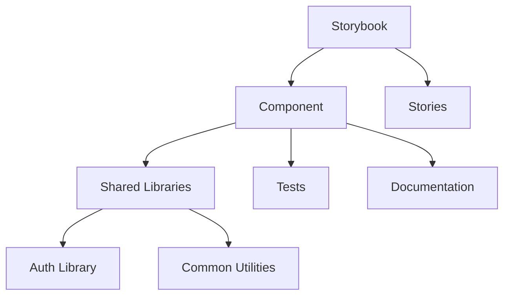

# Storybook Component Documentation — React

## Overview and scope

The purpose of this document is to provide comprehensive guidelines for the development and usage of Storybook components within the Xentic platform. It aims to ensure consistency, maintainability, and scalability across all front-end projects utilizing React.

### Audience
This document is intended for:
- Front-end developers working on React applications.
- UI/UX designers involved in component design.
- Quality Assurance (QA) engineers responsible for testing components.
- Technical leads and architects overseeing front-end architecture.

### Scope
This standard covers:
- Component structure and organization.
- Naming conventions for components and stories.
- Documentation practices for components.
- Testing strategies for Storybook components.
- Integration with the Xentic CI/CD pipeline.

### Non-goals
This document does NOT cover:
- Backend integration or API design.
- Non-React frameworks or libraries.
- General front-end development practices unrelated to Storybook.

### Glossary
| Term           | Definition                                                                 |
|----------------|-----------------------------------------------------------------------------|
| Component      | A reusable piece of UI that encapsulates its own structure, styling, and behavior. |
| Story          | A single state of a component, showcasing its rendering and behavior in isolation. |
| Storybook      | An open-source tool for developing UI components in isolation for React.    |
| CI/CD          | Continuous Integration/Continuous Deployment, a set of practices to automate software development. |

### How this standard fits the Xentic platform
The implementation of Storybook components aligns with Xentic's commitment to modularity and reusability in software development. By adhering to these standards, teams can:
- Ensure that components are easily discoverable and usable across different services.
- Facilitate collaboration between developers and designers through clear documentation and visual representation.
- Enhance the testing process by enabling isolated component testing, thereby improving the overall quality of the application.

### Example Component Structure
To illustrate the recommended structure for a Storybook component, consider the following directory layout:

```
/src
  /components
    /Button
      ├── Button.jsx
      ├── Button.stories.jsx
      ├── Button.test.jsx
      ├── Button.css
      └── Button.md
```

### Example Story Definition
Here is an example of how a Storybook story should be defined for a Button component:

```jsx
import React from 'react';
import Button from './Button';

export default {
  title: 'Components/Button',
  component: Button,
};

const Template = (args) => <Button {...args} />;

export const Primary = Template.bind({});
Primary.args = {
  label: 'Primary Button',
  primary: true,
};

export const Secondary = Template.bind({});
Secondary.args = {
  label: 'Secondary Button',
  primary: false,
};
```

By following these guidelines, Xentic aims to create a robust and efficient workflow for building and maintaining UI components, ultimately leading to a superior user experience across all applications.

## Standards and policies

1. **Component Naming Conventions**  
   Components MUST be named using PascalCase. For example, a button component should be named `Button` and not `button` or `btn`.

2. **File Structure**  
   Each component MUST reside in its own directory under `/src/components/<ComponentName>/`. This directory MUST contain the component file, its stories, tests, styles, and documentation.

3. **Story Naming**  
   Stories MUST be named using the format `<ComponentName>.<StoryDescription>`. For example, `Button.Primary` for a primary button story.

4. **Documentation**  
   Each component MUST include a Markdown file (`<ComponentName>.md`) that provides usage examples, props descriptions, and any relevant notes. This documentation MUST be clear and concise.

5. **Prop Types Validation**  
   All components MUST use PropTypes or TypeScript for prop type validation to ensure correct usage and improve maintainability.

6. **Storybook Configuration**  
   The Storybook configuration file (`main.js`) MUST include necessary addons such as `@storybook/addon-docs` and `@storybook/addon-controls` to enhance the development experience.

7. **Accessibility**  
   Components MUST adhere to accessibility standards (WCAG 2.1) and include relevant ARIA attributes to ensure they are usable by all users.

8. **Styling**  
   CSS for components MUST be scoped to the component itself. Avoid global styles that can affect other components. Use CSS Modules or styled-components for styling.

9. **Testing**  
   Each component MUST have an associated test file (`<ComponentName>.test.jsx`) that includes unit tests for rendering, props, and behavior. Tests MUST be written using Jest and React Testing Library.

10. **Version Control**  
    All changes to components MUST be tracked using Git. Feature branches MUST be created for new components or significant changes, and pull requests MUST be reviewed by at least one other developer.

11. **Component Reusability**  
    Components MUST be designed for reusability. Avoid hardcoding values; instead, use props to allow customization.

12. **State Management**  
    Local state management within components SHOULD be handled using React's built-in hooks (useState, useEffect). For global state, consider using context or a state management library (e.g., Redux).

13. **Performance Optimization**  
    Components MUST be optimized for performance. Use `React.memo` for functional components that do not need to re-render on every state change.

14. **Error Handling**  
    Components MUST include error boundaries where necessary to catch and handle errors gracefully without crashing the application.

15. **Linting and Formatting**  
    Code MUST adhere to the ESLint and Prettier configurations defined in the Xentic repository. Run linting and formatting checks before committing code.

16. **Environment Variables**  
    Any configuration or environment-specific settings MUST be managed through environment variables. Use `.env` files for local development and ensure sensitive information is not hardcoded.

17. **Shared Libraries**  
    Components that require authentication or common utilities MUST utilize shared libraries from `com.xentic.common` or `com.xentic.auth` as per Xentic conventions.

18. **Continuous Integration**  
    All components MUST pass automated tests in the CI/CD pipeline before being merged into the main branch. Ensure that Storybook builds successfully as part of the pipeline.

19. **Deprecation Policy**  
    When a component is deprecated, it MUST be clearly documented in the Markdown file, and a migration path MUST be provided for users to transition to the new component.

20. **Feedback and Iteration**  
    Teams SHOULD actively seek feedback on components from users and stakeholders. Iterations based on feedback MUST be incorporated to improve usability and functionality.

By adhering to these standards and policies, Xentic ensures that all Storybook components are developed with a high level of quality, maintainability, and usability, fostering a collaborative and efficient development environment.

## Architecture and design

The architecture of Storybook components at Xentic is designed to facilitate modular development, enhance collaboration, and ensure maintainability. The following sections outline the component diagram, data flows, integration points, and failure domains.

### Component Diagram

The following diagram illustrates the structure and relationships between components, stories, and shared libraries:



### Data Flows

1. **Component Interaction**  
   Components interact with each other through props and callbacks. For example, a `Button` component may receive an `onClick` prop from a parent component, allowing it to trigger an action.

2. **State Management**  
   Local state is managed within components using React hooks. For global state, components should utilize context or a state management library. Data flows from parent components down to child components via props.

3. **API Integration**  
   Components that require data from APIs MUST utilize shared libraries for making HTTP requests. This ensures a consistent approach to data fetching across the application.

### Integration Points

- **Shared Libraries**  
  Components MUST integrate with shared libraries located in the `com.xentic.common` and `com.xentic.auth` packages. For example, authentication-related components should use the `auth-starter` library for handling user sessions.

- **Storybook Configuration**  
  The Storybook setup MUST include necessary addons and configurations to enhance the development experience. This includes configuring `main.js` to include addons like `@storybook/addon-docs` and `@storybook/addon-controls`.

- **CI/CD Pipeline**  
  Each component MUST be integrated into the CI/CD pipeline, ensuring that all components are tested and Storybook builds successfully before merging into the main branch.

### Failure Domains

1. **Component Failures**  
   Components MUST include error boundaries to catch rendering errors and prevent application crashes. This is critical for maintaining a robust user experience.

2. **Data Fetching Failures**  
   Components that rely on external APIs MUST handle errors gracefully. This includes displaying error messages or fallback UIs when data fetching fails.

3. **Integration Failures**  
   If a shared library fails (e.g., authentication issues), components that depend on it MUST provide fallback mechanisms or disable certain functionalities to maintain application stability.

### Summary

By adhering to the outlined architecture and design principles, Xentic ensures that Storybook components are robust, maintainable, and easily integrated into the broader application ecosystem. This structured approach promotes collaboration among teams and enhances the overall quality of the user interface.

## Configuration reference

The following tables outline the configuration settings for Storybook components, including the application YAML file, Terraform settings, and environment variables. These configurations are essential for ensuring that components behave consistently across different environments.

### Application Configuration (application.yml)

```yaml
storybook:
  port: 6006
  host: 0.0.0.0
  staticDir: ./public
  addons:
    - '@storybook/addon-docs'
    - '@storybook/addon-controls'
  babel:
    presets:
      - '@babel/preset-react'
  webpack:
    configure:
      resolve:
        extensions: ['.js', '.jsx', '.ts', '.tsx']
```

### Terraform Configuration

| Variable Name             | Default Value          | Production Value         |
|---------------------------|------------------------|--------------------------|
| `storybook_port`          | `6006`                 | `6006`                   |
| `storybook_host`          | `0.0.0.0`              | `0.0.0.0`                |
| `storybook_static_dir`    | `./public`             | `./public`               |
| `storybook_addons`        | `['@storybook/addon-docs', '@storybook/addon-controls']` | `['@storybook/addon-docs', '@storybook/addon-controls']` |

### Environment Variables

| Environment Variable      | Default Value          | Production Value         |
|---------------------------|------------------------|--------------------------|
| `STORYBOOK_PORT`          | `6006`                 | `6006`                   |
| `STORYBOOK_HOST`          | `0.0.0.0`              | `0.0.0.0`                |
| `STORYBOOK_STATIC_DIR`    | `./public`             | `./public`               |
| `STORYBOOK_ADDONS`        | `@storybook/addon-docs,@storybook/addon-controls` | `@storybook/addon-docs,@storybook/addon-controls` |

### Notes

- The `storybook.port` setting in `application.yml` MUST match the `STORYBOOK_PORT` environment variable to ensure consistent behavior across environments.
- The `staticDir` setting MUST point to the directory where static assets are located, ensuring they are served correctly during development.
- The addons listed in both the YAML and Terraform configurations MUST be included to enhance the Storybook experience, providing documentation and controls for components.
- Environment variables MUST be used to override default values in production to maintain security and flexibility.

By adhering to these configuration standards, Xentic ensures that the Storybook setup is consistent, reliable, and easily manageable across different environments.

## Implementation guide

To implement Storybook components at Xentic, follow this step-by-step guide that covers the setup, component creation, and best practices. 

### Step 1: Setting Up Storybook

1. **Install Storybook**  
   Run the following command in your project directory to install Storybook:

   ```bash
   npx sb init
   ```

2. **Configure Storybook**  
   Ensure your `main.js` file in the `.storybook` directory includes the necessary addons:

   ```javascript
   module.exports = {
     stories: ['../src/**/*.stories.@(js|jsx|ts|tsx)'],
     addons: [
       '@storybook/addon-links',
       '@storybook/addon-essentials',
       '@storybook/addon-docs',
       '@storybook/addon-controls',
     ],
   };
   ```

### Step 2: Creating a Component

1. **Create a Button Component**  
   Create a new file `Button.jsx` in the `src/components` directory:

   ```javascript
   import React from 'react';
   import PropTypes from 'prop-types';
   import './Button.css';

   const Button = ({ label, onClick, disabled }) => {
     return (
       <button className="button" onClick={onClick} disabled={disabled}>
         {label}
       </button>
     );
   };

   Button.propTypes = {
     label: PropTypes.string.isRequired,
     onClick: PropTypes.func,
     disabled: PropTypes.bool,
   };

   Button.defaultProps = {
     onClick: () => {},
     disabled: false,
   };

   export default Button;
   ```

2. **Add Styles**  
   Create a `Button.css` file for styling:

   ```css
   .button {
     padding: 10px 20px;
     border: none;
     border-radius: 5px;
     background-color: #007bff;
     color: white;
     cursor: pointer;
     transition: background-color 0.3s;
   }

   .button:disabled {
     background-color: #cccccc;
     cursor: not-allowed;
   }

   .button:hover:not(:disabled) {
     background-color: #0056b3;
   }
   ```

### Step 3: Writing Stories

1. **Create a Story for the Button Component**  
   Create a new file `Button.stories.jsx` in the same directory:

   ```javascript
   import React from 'react';
   import Button from './Button';

   export default {
     title: 'Components/Button',
     component: Button,
   };

   const Template = (args) => <Button {...args} />;

   export const Primary = Template.bind({});
   Primary.args = {
     label: 'Click Me',
     onClick: () => alert('Button clicked!'),
   };

   export const Disabled = Template.bind({});
   Disabled.args = {
     label: 'Disabled Button',
     disabled: true,
   };
   ```

### Step 4: Running Storybook

1. **Start Storybook**  
   Run the following command to start Storybook:

   ```bash
   npm run storybook
   ```

2. **Access Storybook**  
   Open your browser and navigate to `http://localhost:6006` to view the Storybook interface.

### Step 5: Testing the Component

1. **Install Testing Library**  
   Ensure you have the testing library installed:

   ```bash
   npm install --save-dev @testing-library/react @testing-library/jest-dom
   ```

2. **Create a Test for the Button Component**  
   Create a new file `Button.test.jsx`:

   ```javascript
   import React from 'react';
   import { render, fireEvent } from '@testing-library/react';
   import Button from './Button';

   test('renders button with label', () => {
     const { getByText } = render(<Button label="Test Button" />);
     expect(getByText(/Test Button/i)).toBeInTheDocument();
   });

   test('calls onClick when clicked', () => {
     const handleClick = jest.fn();
     const { getByText } = render(<Button label="Click Me" onClick={handleClick} />);
     fireEvent.click(getByText(/Click Me/i));
     expect(handleClick).toHaveBeenCalledTimes(1);
   });
   ```

### Best Practices

- **Documentation**: Each component MUST have a corresponding story file that documents its props and usage.
- **Accessibility**: Components MUST be accessible. Use semantic HTML and ARIA attributes where necessary.
- **Versioning**: Components MUST be versioned appropriately in the repository to track changes.
- **Code Reviews**: All new components MUST undergo code review before merging into the main branch.

By following this implementation guide, developers at Xentic can create, document, and test Storybook components that adhere to the company's standards and best practices.

## Security requirements

To ensure the security of Storybook components at Xentic, the following security requirements MUST be adhered to:

### Threat Model Summary

1. **Untrusted Input**: Components MUST validate all incoming data to prevent injection attacks (e.g., XSS, SQL injection).
2. **Unauthorized Access**: Components MUST implement authentication and authorization checks to ensure that only authorized users can access certain functionalities.
3. **Data Exposure**: Sensitive information MUST NOT be exposed in the client-side code or logs.
4. **Dependency Vulnerabilities**: All third-party libraries MUST be regularly reviewed for vulnerabilities and updated accordingly.

### Authentication and Authorization

- All components that require user authentication MUST utilize the Xentic authentication library (`com.xentic.auth:auth-starter`).
- Authorization checks MUST be implemented to restrict access to certain component functionalities based on user roles.

Example of an authorization check:

```javascript
import { useAuth } from 'com.xentic.auth';

const SecureComponent = () => {
  const { user } = useAuth();

  if (!user || !user.hasAccess) {
    return <div>Access Denied</div>;
  }

  return <div>Secure Content</div>;
};
```

### Secrets Management

- Secrets, such as API keys and database credentials, MUST be stored securely using environment variables or a secrets management tool.
- Secrets MUST NOT be hard-coded in the source code.

Example of using environment variables in a configuration file:

```yaml
api:
  key: ${API_KEY}
```

### Input Validation

- All user inputs MUST be validated and sanitized to prevent injection attacks.
- Use libraries like `validator.js` for input validation.

Example of input validation:

```javascript
import validator from 'validator';

const handleInputChange = (input) => {
  if (!validator.isAlphanumeric(input)) {
    throw new Error('Invalid input');
  }
  // Process valid input
};
```

### Audit Logging

- Components MUST implement logging for critical actions, such as user logins, data modifications, and error occurrences.
- Logs MUST be sent to a centralized logging system for monitoring and auditing purposes.

Example of logging a user action:

```javascript
import { logAction } from 'com.xentic.common:logging';

const handleButtonClick = () => {
  logAction('Button clicked', { userId: currentUser.id });
  // Additional logic
};
```

### Summary of Security Practices

| Security Aspect            | Requirement                                                                 |
|----------------------------|-----------------------------------------------------------------------------|
| Input Validation           | MUST validate and sanitize all user inputs.                                |
| Authentication             | MUST utilize Xentic's authentication library for secure access.            |
| Secrets Management         | MUST store secrets securely, never hard-coded in the source code.          |
| Audit Logging              | MUST log critical actions and errors for monitoring and auditing.          |
| Dependency Management      | MUST regularly review and update third-party libraries for vulnerabilities. |

By implementing these security requirements, Xentic ensures that Storybook components are robust against common security threats, thereby protecting both the application and its users.

## Testing strategy

At Xentic, a comprehensive testing strategy is crucial for ensuring the quality and reliability of Storybook components. The testing strategy includes unit tests, integration tests, and contract tests, each serving a specific purpose in the development lifecycle. 

### Types of Tests

1. **Unit Tests**: 
   - Focus on individual components and their functionality.
   - Each component MUST have a corresponding unit test file.
   - Coverage target: 80% or higher.

2. **Integration Tests**: 
   - Validate the interaction between multiple components or modules.
   - Ensure that components work together as expected.
   - Coverage target: 70% or higher.

3. **Contract Tests**: 
   - Ensure that components adhere to defined interfaces and contracts.
   - Useful for validating props and expected outputs across different versions of components.

### Coverage Targets

| Test Type        | Coverage Target |
|------------------|-----------------|
| Unit Tests       | 80%             |
| Integration Tests| 70%             |
| Contract Tests   | 100%            |

### Example Test Classes

#### Unit Test Example

For the `Button` component, create a file named `Button.test.jsx` in the `src/components` directory:

```javascript
import React from 'react';
import { render, fireEvent } from '@testing-library/react';
import Button from './Button';

describe('Button Component', () => {
  test('renders button with label', () => {
    const { getByText } = render(<Button label="Test Button" />);
    expect(getByText(/Test Button/i)).toBeInTheDocument();
  });

  test('calls onClick when clicked', () => {
    const handleClick = jest.fn();
    const { getByText } = render(<Button label="Click Me" onClick={handleClick} />);
    fireEvent.click(getByText(/Click Me/i));
    expect(handleClick).toHaveBeenCalledTimes(1);
  });

  test('is disabled when disabled prop is true', () => {
    const { getByText } = render(<Button label="Can't Click Me" disabled={true} />);
    expect(getByText(/Can't Click Me/i)).toBeDisabled();
  });
});
```

#### Integration Test Example

For testing the interaction between components, create a file named `App.test.jsx`:

```javascript
import React from 'react';
import { render, fireEvent } from '@testing-library/react';
import App from './App'; // Assuming App uses the Button component

describe('App Component', () => {
  test('button click updates state', () => {
    const { getByText } = render(<App />);
    const button = getByText(/Click Me/i);
    fireEvent.click(button);
    expect(getByText(/Button clicked!/i)).toBeInTheDocument();
  });
});
```

#### Contract Test Example

For validating the contract of the `Button` component, create a file named `Button.contract.test.js`:

```javascript
import Button from './Button';

describe('Button Component Contract', () => {
  test('should have required props', () => {
    const requiredProps = {
      label: 'Test',
      onClick: jest.fn(),
    };
    const button = new Button(requiredProps);
    expect(button.props.label).toBeDefined();
    expect(button.props.onClick).toBeDefined();
  });

  test('should throw error if required props are missing', () => {
    expect(() => {
      new Button({});
    }).toThrow();
  });
});
```

### Best Practices for Testing

- **Isolation**: Each test MUST be isolated to prevent side effects from affecting other tests.
- **Descriptive Naming**: Test cases MUST have descriptive names that clearly convey their purpose.
- **Mocking**: Use mocking for external dependencies to ensure tests run quickly and reliably.
- **Continuous Integration**: All tests MUST be executed in the CI pipeline to ensure code quality before merging.

By adhering to this testing strategy, Xentic can ensure that Storybook components are thoroughly tested, maintainable, and reliable, ultimately leading to higher quality software and a better user experience.

## Observability and operations

At Xentic, observability is a critical aspect of our engineering practices to ensure that Storybook components perform optimally in production. This section outlines the necessary metrics, logs, traces, dashboards, alerts, and SLOs that MUST be implemented for effective observability.

### Metrics

Metrics MUST be collected to monitor the performance and usage of Storybook components. Key metrics include:

- **Render Time**: Measure the time taken to render components.
- **Error Rate**: Track the percentage of failed component renders or interactions.
- **User Interaction Metrics**: Monitor how users interact with components (e.g., button clicks, form submissions).

Example of a metrics configuration in a YAML file:

```yaml
metrics:
  enabled: true
  endpoints:
    - path: /api/metrics
      method: GET
```

### Logs

Comprehensive logging MUST be implemented for all components to facilitate troubleshooting and performance analysis. Logs MUST include:

- **Info Logs**: General information about component usage.
- **Error Logs**: Detailed error messages when components fail.
- **Debug Logs**: Verbose logging for development and debugging purposes.

Example of a logging configuration in a properties file:

```properties
logging.level.root=INFO
logging.level.com.xentic=DEBUG
logging.file.name=/var/log/xentic/storybook-components.log
```

### Traces

Distributed tracing MUST be utilized to track requests as they flow through various components. This helps in identifying bottlenecks and understanding the performance of individual components.

- **Trace Context**: Each request MUST carry trace context headers.
- **Integration with Tracing Tools**: Use tools like Zipkin or Jaeger for trace visualization.

Example of adding trace context in a component:

```javascript
import { trace } from 'opentracing';

const MyComponent = () => {
  const span = trace.startSpan('MyComponentRender');

  // Component logic

  span.finish();
  return <div>My Component</div>;
};
```

### Dashboards

Dashboards MUST be created to visualize key metrics and logs. These dashboards should provide insights into component performance, user interactions, and error rates.

- **Grafana**: Use Grafana to create interactive dashboards.
- **Prometheus**: Integrate with Prometheus for metrics collection and querying.

Example of a Grafana dashboard configuration:

```json
{
  "title": "Storybook Components Dashboard",
  "panels": [
    {
      "type": "graph",
      "title": "Component Render Time",
      "targets": [
        {
          "target": "avg(render_time)",
          "refId": "A"
        }
      ]
    },
    {
      "type": "table",
      "title": "Error Rate",
      "targets": [
        {
          "target": "sum(errors) / sum(total_requests)",
          "refId": "B"
        }
      ]
    }
  ]
}
```

### Alerts

Alerts MUST be configured to notify the team of any anomalies or issues with Storybook components. Key alerts include:

- **High Error Rate**: Alert when the error rate exceeds a predefined threshold.
- **Performance Degradation**: Alert when render times exceed acceptable limits.

Example of an alert configuration in YAML:

```yaml
alerts:
  - name: High Error Rate
    condition: "sum(rate(errors[5m])) > 0.05"
    severity: critical
    message: "High error rate detected in Storybook components."
```

### Service Level Objectives (SLOs)

SLOs MUST be defined to set clear expectations for component performance. Common SLOs include:

- **Availability**: 99.9% uptime for all components.
- **Performance**: 95% of renders should complete within 200ms.

Example of SLO documentation:

| SLO Name           | Target     | Description                           |
|--------------------|------------|---------------------------------------|
| Component Availability | 99.9%     | The component must be available 99.9% of the time. |
| Render Performance  | 95% within 200ms | 95% of component renders must complete within 200 milliseconds. |

### On-Call Runbook Steps

In the event of an incident, the following on-call runbook steps MUST be followed:

1. **Acknowledge the Alert**: Confirm receipt of the alert and begin investigation.
2. **Check Logs and Metrics**: Review logs and metrics for anomalies or errors.
3. **Identify the Root Cause**: Use tracing to identify where the issue originated.
4. **Implement a Fix**: Apply a fix or workaround as necessary.
5. **Document the Incident**: Record the incident details, including the root cause and resolution steps.
6. **Review and Improve**: Conduct a post-mortem to identify improvements for future incidents.

By implementing these observability practices, Xentic ensures that Storybook components are monitored effectively, enabling rapid response to issues and continuous improvement in performance and reliability.

## Migration and versioning

At Xentic, managing migration and versioning of Storybook components is essential to ensure stability and compatibility across our applications. This section outlines the upgrade paths, deprecation policy, backward compatibility, and rollback strategies that MUST be adhered to.

### Upgrade Paths

When upgrading Storybook components, the following paths MUST be followed:

- **Major Version Upgrades**: These upgrades may introduce breaking changes. A comprehensive migration guide MUST be provided, detailing changes and necessary modifications.
- **Minor Version Upgrades**: These upgrades should include new features and improvements but MUST maintain backward compatibility. Changelog entries MUST be clear about what has changed.
- **Patch Version Upgrades**: These should only include bug fixes and MUST not introduce any new features or breaking changes.

### Deprecation Policy

Components that are to be deprecated MUST follow this policy:

1. **Deprecation Announcement**: A deprecation notice MUST be added to the component documentation at least one major version prior to removal.
2. **Grace Period**: A grace period of two major versions MUST be provided before the component is removed.
3. **Alternative Recommendations**: Documentation MUST include recommended alternatives or replacements for deprecated components.

### Backward Compatibility

Backward compatibility is crucial for ensuring that existing applications continue to function correctly after upgrades. The following guidelines MUST be followed:

- **Prop Changes**: Any changes to component props MUST be backward compatible. If a prop is removed, it MUST be replaced with an equivalent.
- **Default Values**: Default values for props MUST remain unchanged unless a new default is explicitly defined and documented.
- **Behavioral Changes**: Any behavioral changes MUST be clearly documented, and if they are breaking, the version MUST be incremented accordingly.

### Rollback Strategies

In the event of issues arising from an upgrade, a rollback strategy MUST be in place:

- **Version Control**: All component versions MUST be tagged in the version control system (e.g., Git) to facilitate easy rollback.
- **Deployment Rollback**: If an issue is detected post-deployment, the previous stable version MUST be redeployed immediately.
- **Database Migrations**: If database migrations are part of the upgrade, they MUST be reversible. Use techniques such as "up" and "down" migrations to ensure that data can be restored.

### Example Migration Guide

When a major version upgrade occurs, a migration guide MUST be provided. Here is an example structure:

```markdown
# Migration Guide for Storybook Component v2.0.0

## Breaking Changes
- The `color` prop has been renamed to `bgColor`. Update your usage accordingly.
- The `onClick` prop now requires a function that returns a Promise.

## New Features
- Added support for `loading` state in the Button component.

## Deprecated Features
- The `icon` prop is deprecated. Use `startIcon` or `endIcon` instead.

## Rollback Instructions
To rollback to the previous version, run:
```bash
npm install @xentic/storybook-components@1.0.0
```
```

### Versioning Scheme

Xentic follows [Semantic Versioning](https://semver.org/) for all Storybook components:

| Version Type | Increment Condition                       |
|--------------|------------------------------------------|
| Major        | Breaking changes                         |
| Minor        | New features, no breaking changes        |
| Patch        | Bug fixes                                |

### Conclusion

By adhering to these migration and versioning standards, Xentic ensures that Storybook components are maintained effectively, allowing for smooth transitions between versions while minimizing disruptions to development and production environments.

## FAQ, anti-patterns, and checklists

### FAQ

1. **What is Storybook?**
   - Storybook is an open-source tool for developing UI components in isolation for React, Vue, and Angular.

2. **How do I install Storybook?**
   - You can install Storybook using npm or yarn:
     ```bash
     npx sb init
     ```

3. **What file structure should I use for Storybook?**
   - Components should be organized under `src/components` and stories should be placed in `src/components/__stories__`.

4. **How do I create a story for a component?**
   - A story can be created by exporting a default object and named exports for each variant:
     ```javascript
     import MyComponent from './MyComponent';

     export default {
       title: 'MyComponent',
       component: MyComponent,
     };

     export const Default = () => <MyComponent />;
     ```

5. **How do I test my components in Storybook?**
   - You can use tools like Jest and React Testing Library to write tests for your components, and run them alongside Storybook.

6. **Can I use addons with Storybook?**
   - Yes, Storybook supports various addons for accessibility, documentation, and more. You MUST configure them in the `.storybook/main.js` file.

7. **How do I deploy Storybook?**
   - You can deploy Storybook using platforms like GitHub Pages or Vercel. Use the following command to build:
     ```bash
     npm run build-storybook
     ```

8. **What is the purpose of the `parameters` in Storybook?**
   - Parameters allow you to customize the behavior of your stories, such as layout, backgrounds, and actions.

9. **How do I handle global styles in Storybook?**
   - Global styles can be imported in the `preview.js` file:
     ```javascript
     import '../src/styles/global.css';
     ```

10. **What is the difference between `args` and `argTypes`?**
    - `args` are the values passed to your component, while `argTypes` define the types and controls for those args.

### Anti-Patterns

| Anti-Pattern                     | Description                                                                                       |
|----------------------------------|---------------------------------------------------------------------------------------------------|
| Hardcoding Styles                | Styles should be defined in CSS/SCSS files instead of inline to promote reusability and maintainability. |
| Ignoring Accessibility            | All components MUST be accessible. Use tools like aXe or Lighthouse to check for compliance.     |
| Overusing Global State           | Avoid using global state unnecessarily; prefer local state or context APIs for better performance. |
| Large Story Files                | Each story file should focus on a single component; avoid combining multiple components in one file. |
| Not Using PropTypes or TypeScript| Always define prop types or use TypeScript to ensure type safety and better documentation.       |
| Failing to Update Stories        | Stories MUST be updated alongside component changes to reflect the latest functionality and props. |

### Pre-Merge Checklist

- [ ] Code adheres to Xentic's coding standards.
- [ ] All components have corresponding stories.
- [ ] Stories demonstrate all variations of the component.
- [ ] Accessibility checks have been performed.
- [ ] Unit tests cover critical functionality.
- [ ] Documentation is updated to reflect changes.
- [ ] No console warnings or errors are present.

### Production Checklist

- [ ] All components have been tested in Storybook.
- [ ] Performance benchmarks are within acceptable limits.
- [ ] Deployment scripts have been validated.
- [ ] Rollback procedures are documented and tested.
- [ ] Monitoring and alerting are configured for production.
- [ ] Stakeholders have approved the deployment.
