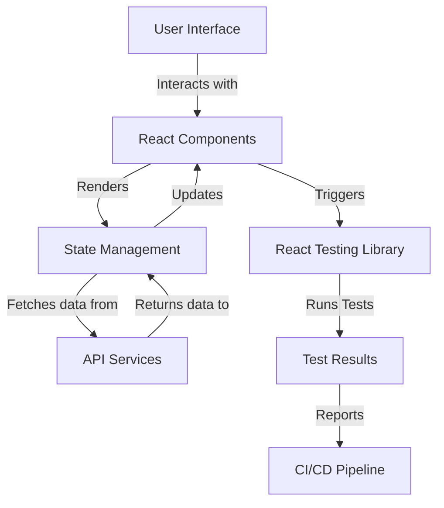

# Testing with React Testing Library

## Overview and scope

The purpose of this document is to establish a comprehensive set of standards and best practices for testing React applications using React Testing Library (RTL) at Xentic. This document aims to guide developers in writing effective and maintainable tests, ensuring consistency across projects and enhancing the overall quality of the codebase.

### Audience

This document is intended for:
- Frontend Developers
- Quality Assurance Engineers
- Technical Leads
- Project Managers

### Scope

This standard covers:
- Setting up React Testing Library in Xentic projects
- Writing unit tests, integration tests, and end-to-end tests
- Best practices for test organization and structure
- Mocking and testing asynchronous behavior
- Code examples and configuration templates

### Non-goals

This document does NOT cover:
- Testing strategies for non-React applications
- Detailed explanations of JavaScript or React concepts
- Frameworks or libraries outside of React Testing Library

### Glossary

| Term                        | Definition                                                                 |
|-----------------------------|-----------------------------------------------------------------------------|
| React Testing Library (RTL) | A lightweight library for testing React components without relying on implementation details. |
| Unit Test                   | A test that verifies the functionality of a specific section of code, typically a function or component. |
| Integration Test            | A test that checks the interaction between multiple components or modules. |
| End-to-End Test             | A test that simulates real user scenarios and verifies the application as a whole. |

### How This Standard Fits the Xentic Platform

At Xentic, we prioritize code quality and maintainability. By adhering to these testing standards, we ensure that our React applications are robust, reliable, and easier to maintain over time. The integration of React Testing Library into our development workflow aligns with our commitment to delivering high-quality software and enhances collaboration among team members.

### Configuration Example

To set up React Testing Library in a new Xentic React project, include the following dependencies in your `package.json`:

```json
{
  "devDependencies": {
    "@testing-library/react": "^12.1.0",
    "@testing-library/jest-dom": "^5.16.4",
    "jest": "^27.0.6"
  }
}
```

### Sample Test Structure

A typical test file structure for a React component might look like this:

```
src/
└── components/
    ├── MyComponent/
    │   ├── MyComponent.jsx
    │   ├── MyComponent.test.jsx
    │   └── MyComponent.styles.css
```

### Example Test Case

Here is an example of a simple unit test using React Testing Library:

```javascript
import React from 'react';
import { render, screen } from '@testing-library/react';
import MyComponent from './MyComponent';

test('renders the component with the correct text', () => {
  render(<MyComponent />);
  const linkElement = screen.getByText(/hello world/i);
  expect(linkElement).toBeInTheDocument();
});
```

By following the guidelines outlined in this document, Xentic teams can ensure a consistent and effective approach to testing React applications, ultimately leading to higher quality software and improved developer productivity.

## Standards and policies

1. **MUST** use React Testing Library (RTL) for testing all React components within Xentic projects. This ensures consistency and leverages the advantages of RTL's user-centric testing approach.

2. **MUST NOT** rely on implementation details when writing tests. Tests should focus on the behavior of the component as a user would interact with it, promoting maintainability and reducing fragility.

3. **SHOULD** organize test files alongside the components they test. Each component should have a corresponding test file named `<ComponentName>.test.jsx` to enhance discoverability and maintainability.

4. **MUST** include descriptive test cases that clearly state what behavior is being tested. Use the `test` or `it` function to provide meaningful descriptions.

   ```javascript
   test('displays the correct title when rendered', () => {
     // test implementation
   });
   ```

5. **MUST NOT** use global state or context in tests unless absolutely necessary. If context is required, it should be mocked or provided explicitly in the test.

6. **SHOULD** utilize `beforeEach` and `afterEach` hooks for setup and teardown of test environments to ensure tests are isolated and do not affect each other.

   ```javascript
   beforeEach(() => {
     // setup code
   });

   afterEach(() => {
     // cleanup code
   });
   ```

7. **MUST** mock external dependencies (e.g., API calls) using libraries such as `jest.mock` or `msw` (Mock Service Worker) to ensure tests run in isolation and do not rely on external systems.

8. **SHOULD** use `screen` queries provided by RTL to select elements in tests. This promotes better readability and aligns with how users interact with the application.

   ```javascript
   const button = screen.getByRole('button', { name: /submit/i });
   ```

9. **MUST** test asynchronous behavior using `async/await` and the `waitFor` utility from RTL to handle state updates or API responses.

   ```javascript
   test('loads data and displays it', async () => {
     render(<MyComponent />);
     await waitFor(() => expect(screen.getByText(/data loaded/i)).toBeInTheDocument());
   });
   ```

10. **MUST NOT** write tests that are flaky or dependent on timing. Use RTL's built-in utilities to handle asynchronous behavior and avoid using `setTimeout` or `setInterval` directly in tests.

11. **SHOULD** group related tests using `describe` blocks to improve organization and readability.

    ```javascript
    describe('MyComponent', () => {
      test('renders correctly', () => {
        // test implementation
      });

      test('handles click events', () => {
        // test implementation
      });
    });
    ```

12. **MUST** ensure that all tests are run as part of the CI/CD pipeline to maintain code quality and catch regressions early.

13. **SHOULD** write integration tests for components that interact with each other to ensure they work together as expected.

14. **MUST** document any complex test cases or unusual setups in comments to aid future developers in understanding the rationale behind the tests.

15. **MUST NOT** leave commented-out code or tests in the codebase. If a test is no longer relevant, it should be removed entirely.

16. **SHOULD** regularly review and refactor tests to improve clarity, maintainability, and performance, ensuring that tests remain relevant as the codebase evolves.

By adhering to these standards and policies, Xentic teams will foster a culture of quality and reliability in their React applications, ultimately leading to enhanced user satisfaction and reduced technical debt.

## Architecture and design

The architecture of testing with React Testing Library (RTL) at Xentic is designed to ensure that components are thoroughly tested for functionality, usability, and integration. The following sections outline the component diagram, data flows, integration points, and failure domains.

### Component Diagram



### Data Flows

1. **User Interaction**: Users interact with the UI, triggering events on React components.
2. **State Management**: Components manage their state through hooks or external libraries (e.g., Redux).
3. **API Calls**: Components may fetch data from API services, which return data to the state management layer.
4. **Rendering**: Updated state causes components to re-render, reflecting the latest data.
5. **Testing Flow**: Tests are executed using RTL, which simulates user interactions and checks component behavior.

### Integration Points

- **API Services**: Components interact with backend services to fetch or send data. Mocking these services is essential for isolated testing.
- **State Management Libraries**: Integration with libraries such as Redux or Context API should be mocked or provided in tests to ensure accurate state representation.
- **CI/CD Pipeline**: All tests must run in the CI/CD pipeline to catch regressions and maintain code quality.

### Failure Domains

- **Component Rendering**: If a component fails to render correctly, it may indicate issues with props or state management.
- **API Failures**: If API calls fail or return unexpected results, tests must handle these scenarios gracefully.
- **Asynchronous Behavior**: Tests that do not properly handle asynchronous updates may lead to flaky tests, causing intermittent failures.
- **Integration Issues**: Components that rely on other components must be tested together to ensure they function as expected.

### Best Practices Summary

- **MUST** ensure that all components are covered by unit tests and integration tests.
- **SHOULD** use mocking libraries to simulate API responses and external dependencies.
- **MUST NOT** allow tests to depend on real API calls or external services.
- **SHOULD** document any integration points and failure domains in the test code for clarity.

By following these architectural guidelines, Xentic teams will create a robust testing environment that enhances the reliability and maintainability of React applications.

## Configuration Reference

To ensure that React Testing Library is configured correctly in Xentic projects, the following configurations must be adhered to across various environments.

### application.yml

The `application.yml` file is used to configure testing settings for the React application. Below is a sample configuration:

```yaml
testing:
  react:
    library:
      version: "12.1.0"
      jest_dom_version: "5.16.4"
    test_environment: "jsdom"
    timeout: 5000
    reporters:
      - "default"
      - "jest-junit"
```

### Terraform Configuration

When deploying test environments using Terraform, you can define environment variables that will be used during testing. Below is an example of how to set this up:

```hcl
resource "aws_lambda_function" "react_test_lambda" {
  function_name = "ReactTestFunction"
  runtime       = "nodejs14.x"
  handler       = "index.handler"
  source_code_hash = filebase64sha256("lambda.zip")
  
  environment {
    NODE_ENV = "test"
    REACT_APP_TEST_API_URL = "https://test.api.internal.xentic.io"
  }
}
```

### Environment Variables

The following table outlines the environment variables that should be set for testing environments, along with their default and production values.

| Variable                        | Default Value                          | Production Value                      |
|---------------------------------|---------------------------------------|--------------------------------------|
| `NODE_ENV`                      | `test`                                | `production`                         |
| `REACT_APP_TEST_API_URL`       | `https://test.api.internal.xentic.io` | `https://api.internal.xentic.io`    |
| `REACT_APP_TEST_TIMEOUT`       | `5000`                                | `3000`                               |
| `REACT_APP_JEST_REPORTER`      | `default`                            | `jest-junit`                         |
| `REACT_APP_TEST_DB_URL`        | `https://db.test.internal.xentic.io` | `https://db.internal.xentic.io`     |

### Additional Configuration Options

- **Test Timeout**: Adjust the timeout for tests in `jest.config.js`:

```javascript
module.exports = {
  testTimeout: 5000,
};
```

- **Setup Files**: Specify setup files for Jest in `jest.config.js`:

```javascript
module.exports = {
  setupFilesAfterEnv: ['<rootDir>/src/setupTests.js'],
};
```

- **Custom Test Environment**: If using a custom test environment, specify it in `jest.config.js`:

```javascript
module.exports = {
  testEnvironment: 'jsdom',
};
```

By following these configuration guidelines, Xentic teams can ensure that their React applications are set up for effective testing with React Testing Library, leading to improved reliability and maintainability.

## Implementation guide

To implement testing with React Testing Library (RTL) effectively at Xentic, follow the steps outlined below. Each step includes code examples to demonstrate best practices and ensure comprehensive testing coverage.

### Step 1: Install Required Packages

Ensure you have the necessary packages installed in your React project. Run the following command:

```bash
npm install --save-dev @testing-library/react @testing-library/jest-dom jest
```

### Step 2: Set Up Jest Configuration

Create a `jest.config.js` file in the root of your project to configure Jest settings:

```javascript
module.exports = {
  testEnvironment: 'jsdom',
  setupFilesAfterEnv: ['<rootDir>/src/setupTests.js'],
  testTimeout: 5000,
};
```

### Step 3: Create a Setup File

In `src/setupTests.js`, import `@testing-library/jest-dom` to extend Jest with additional matchers:

```javascript
import '@testing-library/jest-dom/extend-expect';
```

### Step 4: Write a Sample Component

Create a simple React component in `src/components/MyComponent.js`:

```javascript
import React, { useState } from 'react';

const MyComponent = () => {
  const [data, setData] = useState(null);

  const fetchData = async () => {
    const response = await fetch('https://api.internal.xentic.io/data');
    const result = await response.json();
    setData(result);
  };

  return (
    <div>
      <button onClick={fetchData}>Fetch Data</button>
      {data && <p>{data.message}</p>}
    </div>
  );
};

export default MyComponent;
```

### Step 5: Write Unit Tests for the Component

Create a test file `src/components/MyComponent.test.js`:

```javascript
import React from 'react';
import { render, screen, fireEvent, waitFor } from '@testing-library/react';
import MyComponent from './MyComponent';

jest.mock('node-fetch');
import fetch from 'node-fetch';

describe('MyComponent', () => {
  beforeEach(() => {
    fetch.mockClear();
  });

  test('renders button', () => {
    render(<MyComponent />);
    const button = screen.getByRole('button', { name: /fetch data/i });
    expect(button).toBeInTheDocument();
  });

  test('fetches and displays data', async () => {
    fetch.mockResolvedValueOnce({
      json: jest.fn().mockResolvedValueOnce({ message: 'Data loaded' }),
    });

    render(<MyComponent />);
    fireEvent.click(screen.getByRole('button', { name: /fetch data/i }));

    await waitFor(() => expect(screen.getByText(/data loaded/i)).toBeInTheDocument());
  });
});
```

### Step 6: Run the Tests

Execute the tests using the following command:

```bash
npm test
```

### Step 7: Ensure Coverage

To measure test coverage, add the following to your `jest.config.js`:

```javascript
module.exports = {
  // ...existing config
  collectCoverage: true,
  coverageDirectory: 'coverage',
  coverageThreshold: {
    global: {
      branches: 80,
      functions: 80,
      lines: 80,
      statements: 80,
    },
  },
};
```

### Step 8: Review and Refactor Tests

Regularly review your tests to ensure they remain relevant and efficient. Refactor any tests that are overly complex or difficult to understand.

### Step 9: Document Test Cases

Use comments in your test files to document complex test cases or any unusual setups:

```javascript
// This test simulates a successful API call and checks if the data is displayed correctly.
```

### Step 10: Integrate with CI/CD

Ensure that all tests are included in your CI/CD pipeline configuration. For example, if using GitHub Actions, your workflow file might look like this:

```yaml
name: CI

on: [push, pull_request]

jobs:
  test:
    runs-on: ubuntu-latest
    steps:
      - name: Checkout code
        uses: actions/checkout@v2
      
      - name: Set up Node.js
        uses: actions/setup-node@v2
        with:
          node-version: '14'

      - name: Install dependencies
        run: npm install

      - name: Run tests
        run: npm test
```

By following this implementation guide, Xentic teams will ensure that they have a robust and maintainable testing strategy using React Testing Library, ultimately leading to higher code quality and user satisfaction.

## Security requirements

To ensure the security of applications developed at Xentic, the following security requirements must be adhered to throughout the testing lifecycle. This includes a comprehensive threat model, authentication and authorization practices, secrets management, input validation, and audit logging.

### Threat Model Summary

A threat model should identify potential threats to the application, including:

| Threat Type       | Description                                                     | Mitigation Strategy                                  |
|-------------------|-----------------------------------------------------------------|-----------------------------------------------------|
| **Injection Attacks** | Attackers may attempt to inject malicious code or SQL queries. | Use parameterized queries and ORM libraries.        |
| **Cross-Site Scripting (XSS)** | Malicious scripts could be executed in the user's browser. | Sanitize user inputs and use Content Security Policy (CSP). |
| **Cross-Site Request Forgery (CSRF)** | Unauthorized commands could be transmitted from a user. | Implement anti-CSRF tokens in forms and AJAX requests. |
| **Data Leakage**   | Sensitive data could be exposed through inadequate access controls. | Implement strict access control measures and data encryption. |

### Authentication and Authorization

- **MUST** implement OAuth 2.0 for user authentication.
- **MUST NOT** hardcode any sensitive credentials in the codebase.
- **SHOULD** use role-based access control (RBAC) to manage user permissions.
- **MUST** validate user roles on the server-side for each request.

Example of OAuth 2.0 configuration in `application.yml`:

```yaml
security:
  oauth2:
    client:
      registration:
        xentic:
          client-id: "${OAUTH_CLIENT_ID}"
          client-secret: "${OAUTH_CLIENT_SECRET}"
          redirect-uri: "{baseUrl}/login/oauth2/code/{registrationId}"
          authorization-grant-type: authorization_code
      provider:
        xentic:
          authorization-uri: "https://auth.internal.xentic.io/oauth/authorize"
          token-uri: "https://auth.internal.xentic.io/oauth/token"
          user-info-uri: "https://auth.internal.xentic.io/userinfo"
```

### Secrets Management

- **MUST** use a secrets management tool such as HashiCorp Vault or AWS Secrets Manager.
- **MUST NOT** store sensitive information in source code or configuration files.
- **SHOULD** rotate secrets regularly to minimize risks.

Example of retrieving a secret from HashiCorp Vault:

```bash
vault kv get -field=api_key secret/xentic/my_service
```

### Input Validation

- **MUST** validate all user inputs on both the client and server sides.
- **SHOULD** use libraries that provide built-in validation mechanisms (e.g., Joi for Node.js).
- **MUST NOT** trust any input data without proper validation.

Example of input validation using Joi:

```javascript
const Joi = require('joi');

const schema = Joi.object({
  username: Joi.string().alphanum().min(3).max(30).required(),
  password: Joi.string().pattern(new RegExp('^[a-zA-Z0-9]{3,30}$')).required(),
});

const { error, value } = schema.validate({ username: 'user', password: 'pass123' });
if (error) {
  throw new Error(`Input validation failed: ${error.details[0].message}`);
}
```

### Audit Logging

- **MUST** implement logging for all authentication attempts, data access, and changes to sensitive data.
- **SHOULD** use a centralized logging solution (e.g., ELK Stack) to aggregate logs.
- **MUST NOT** log sensitive information such as passwords or personal data.

Example of logging an authentication attempt:

```javascript
const logger = require('winston');

function authenticateUser(username, password) {
  // Log the attempt
  logger.info(`Authentication attempt for user: ${username}`);
  
  // Authentication logic here...
}
```

By adhering to these security requirements, Xentic teams will significantly reduce the risk of security vulnerabilities in their applications, ensuring a safer environment for both developers and users.

## Testing strategy

At Xentic, a comprehensive testing strategy is essential to maintain high-quality standards in our React applications. The testing strategy encompasses unit tests, integration tests, and contract tests, with specific coverage targets to ensure robustness.

### Types of Tests

1. **Unit Tests**
   - **Purpose**: Validate individual components or functions in isolation.
   - **Tools**: React Testing Library, Jest.
   - **Coverage Target**: 80% minimum for each component.

2. **Integration Tests**
   - **Purpose**: Test the interaction between multiple components or services.
   - **Tools**: React Testing Library, Jest, Mock Service Worker (MSW) for API mocking.
   - **Coverage Target**: 70% minimum for integration scenarios.

3. **Contract Tests**
   - **Purpose**: Ensure that the API contracts between services are respected.
   - **Tools**: Pact or similar libraries.
   - **Coverage Target**: 100% for critical service contracts.

### Coverage Targets

To maintain quality, the following coverage targets must be met:

| Coverage Type | Target Percentage |
|---------------|-------------------|
| Unit Tests    | 80%                |
| Integration Tests | 70%            |
| Contract Tests | 100%              |

### Example Test Classes

#### Unit Test Example

Unit tests should focus on individual components. Below is an example of a unit test for a button component.

```javascript
// src/components/Button.test.js
import React from 'react';
import { render, screen } from '@testing-library/react';
import Button from './Button';

describe('Button Component', () => {
  test('renders with correct label', () => {
    render(<Button label="Click Me" />);
    expect(screen.getByRole('button', { name: /click me/i })).toBeInTheDocument();
  });
});
```

#### Integration Test Example

Integration tests should validate that components work together as expected.

```javascript
// src/components/MyComponent.integration.test.js
import React from 'react';
import { render, screen, fireEvent, waitFor } from '@testing-library/react';
import MyComponent from './MyComponent';
import { rest } from 'msw';
import { setupServer } from 'msw/node';

const server = setupServer(
  rest.get('https://api.internal.xentic.io/data', (req, res, ctx) => {
    return res(ctx.json({ message: 'Data loaded' }));
  })
);

beforeAll(() => server.listen());
afterEach(() => server.resetHandlers());
afterAll(() => server.close());

describe('MyComponent Integration Test', () => {
  test('fetches and displays data from API', async () => {
    render(<MyComponent />);
    fireEvent.click(screen.getByRole('button', { name: /fetch data/i }));

    await waitFor(() => expect(screen.getByText(/data loaded/i)).toBeInTheDocument());
  });
});
```

#### Contract Test Example

Contract tests ensure that services adhere to agreed-upon contracts.

```javascript
// src/tests/api.contract.test.js
const { Pact } = require('@pact-foundation/pact');
const path = require('path');

const provider = new Pact({
  port: 1234,
  log: path.resolve(process.cwd(), 'logs', 'pact.log'),
  dir: path.resolve(process.cwd(), 'pacts'),
  consumer: 'MyConsumer',
  provider: 'MyProvider',
});

describe('API Contract Test', () => {
  beforeAll(() => provider.setup());
  afterAll(() => provider.finalize());

  it('should return a valid response', async () => {
    await provider.addInteraction({
      uponReceiving: 'a request for data',
      withRequest: {
        method: 'GET',
        path: '/data',
      },
      willRespondWith: {
        status: 200,
        body: { message: 'Data loaded' },
      },
    });

    // Your API call logic here...
  });
});
```

### Best Practices

- **MUST** write tests for all new features and bug fixes.
- **SHOULD** run tests locally before committing code.
- **MUST NOT** ignore failing tests; they must be addressed immediately.
- **SHOULD** use descriptive test names to clarify the purpose of each test.

By adhering to this testing strategy, Xentic teams will ensure that their applications are reliable, maintainable, and of high quality, ultimately leading to enhanced user satisfaction and reduced technical debt.

## Observability and operations

To ensure the reliability and performance of our React applications at Xentic, a robust observability and operations strategy is essential. This includes metrics, logs, traces, dashboards, alerts, and Service Level Objectives (SLOs). 

### Metrics

- **MUST** collect key performance indicators (KPIs) such as:
  - Application response time
  - Error rates
  - User engagement metrics (e.g., page load time, interaction time)
  - API response times

Example of a metrics configuration in `application.yml`:

```yaml
metrics:
  enabled: true
  prometheus:
    endpoint: /metrics
    port: 9090
```

### Logs

- **MUST** implement structured logging to facilitate easier querying and analysis.
- **SHOULD** include context information such as user ID, session ID, and request ID in logs.
- **MUST NOT** log sensitive information such as passwords or personal data.

Example of a logging configuration using Winston:

```javascript
const winston = require('winston');

const logger = winston.createLogger({
  level: 'info',
  format: winston.format.json(),
  transports: [
    new winston.transports.Console(),
    new winston.transports.File({ filename: 'combined.log' }),
  ],
});

logger.info('User logged in', { userId: '12345', sessionId: 'abcde' });
```

### Traces

- **MUST** implement distributed tracing to monitor requests across microservices.
- **SHOULD** use tools like OpenTelemetry or Jaeger for tracing.
- **MUST NOT** ignore trace data; it is crucial for diagnosing performance issues.

Example of setting up OpenTelemetry:

```javascript
const { NodeTracerProvider } = require('@opentelemetry/node');
const { registerInstrumentations } = require('@opentelemetry/instrumentation');

const provider = new NodeTracerProvider();
provider.register();
registerInstrumentations({
  tracerProvider: provider,
  instrumentations: [
    // Add your instrumentations here
  ],
});
```

### Dashboards

- **MUST** create dashboards to visualize key metrics and logs.
- **SHOULD** use tools like Grafana or Kibana for dashboarding.
- **MUST NOT** have dashboards that are difficult to interpret; they should be user-friendly.

Example of a simple Grafana dashboard configuration:

```json
{
  "title": "Application Metrics",
  "panels": [
    {
      "type": "graph",
      "title": "Response Time",
      "targets": [
        {
          "target": "avg(response_time)",
          "refId": "A"
        }
      ]
    }
  ]
}
```

### Alerts

- **MUST** configure alerts based on SLOs to notify teams of potential issues.
- **SHOULD** use tools like Prometheus Alertmanager or PagerDuty for alert management.
- **MUST NOT** create alerts that are too sensitive or noisy; they should be actionable.

Example of an alerting rule in Prometheus:

```yaml
groups:
  - name: application-alerts
    rules:
      - alert: HighErrorRate
        expr: rate(http_requests_total{status="500"}[5m]) > 0.05
        for: 10m
        labels:
          severity: critical
        annotations:
          summary: "High error rate detected"
          description: "More than 5% of requests are failing."
```

### Service Level Objectives (SLOs)

- **MUST** define clear SLOs for availability, latency, and error rates.
- **SHOULD** review and adjust SLOs regularly to reflect business needs.
- **MUST NOT** set unrealistic SLOs that cannot be achieved.

Example of SLO definitions:

| SLO Type      | Objective               | Measurement Interval |
|---------------|-------------------------|----------------------|
| Availability  | 99.9% uptime            | Monthly              |
| Latency       | 95% of requests < 200ms | Weekly               |
| Error Rate    | < 1% error rate         | Daily                |

### On-Call Runbook Steps

- **MUST** maintain an up-to-date on-call runbook for incident response.
- **SHOULD** include escalation paths, troubleshooting steps, and contact information.
- **MUST NOT** have vague instructions; all steps should be clear and actionable.

Example of a runbook entry for a high error rate incident:

1. **Identify the Issue**: Check the alerting system for high error rates.
2. **Check Logs**: Review application logs for error messages.
3. **Investigate Recent Changes**: Look for recent deployments or configuration changes.
4. **Rollback if Necessary**: If a deployment caused the issue, roll back to the previous stable version.
5. **Notify Stakeholders**: Inform the team and relevant stakeholders about the incident and resolution steps.
6. **Post-Mortem**: Conduct a post-mortem analysis to prevent future occurrences.

By implementing these observability and operations practices, Xentic teams will enhance the reliability and performance of their applications, leading to improved user experiences and operational efficiency.

## Migration and versioning

When working with React applications at Xentic, it is crucial to establish a clear migration and versioning policy to ensure smooth transitions between versions, maintain backward compatibility, and manage deprecations effectively.

### Upgrade Paths

- **MUST** provide documented upgrade paths for each major version of the application.
- **SHOULD** include a changelog that details breaking changes, new features, and deprecated features.
- **MUST NOT** skip major versions during upgrades; always follow the defined upgrade path.

Example of a changelog entry:

```markdown
## [1.2.0] - 2023-10-01
### Added
- New `Button` component with loading state.

### Changed
- Updated `MyComponent` to use the new `Button`.

### Deprecated
- `OldButton` component will be removed in version 2.0.0.
```

### Deprecation Policy

- **MUST** clearly mark deprecated features in the documentation and code comments.
- **SHOULD** provide an alternative solution or replacement for deprecated features.
- **MUST NOT** remove deprecated features without a grace period of at least one full release cycle.

Example of marking a deprecated function:

```javascript
/**
 * @deprecated Use `newFunction` instead.
 */
function oldFunction() {
  // Implementation
}
```

### Backward Compatibility

- **MUST** ensure that new versions are backward compatible with the previous major version.
- **SHOULD** run automated tests against previous versions to validate compatibility.
- **MUST NOT** introduce breaking changes without proper versioning and communication.

### Rollback Procedures

In the event of a failed deployment or critical issue, a rollback procedure must be in place:

1. **Identify the Issue**: Monitor application logs and alerts to detect issues post-deployment.
2. **Notify the Team**: Inform relevant stakeholders about the issue and the need for a rollback.
3. **Execute Rollback**: Use the following command to revert to the previous stable version:

   ```bash
   git checkout <previous-stable-commit>
   ```

4. **Deploy the Previous Version**: Redeploy the application using the stable version.
5. **Verify Functionality**: Conduct smoke tests to ensure that the rollback was successful and the application is functioning as expected.
6. **Document the Incident**: Record the incident in the issue tracker, including the cause and resolution steps for future reference.

### Versioning Strategy

- **MUST** follow Semantic Versioning (SemVer) for all releases: MAJOR.MINOR.PATCH.
- **SHOULD** increment the MAJOR version for breaking changes, MINOR for new features, and PATCH for bug fixes.
- **MUST NOT** use version numbers that are not aligned with the SemVer standard.

Example of a versioning scheme:

| Version       | Type            | Description                        |
|---------------|-----------------|------------------------------------|
| 1.0.0        | Initial Release | First stable release of the app.  |
| 1.1.0        | Minor           | Added new features without breaking changes. |
| 2.0.0        | Major           | Introduced breaking changes and removed deprecated features. |

By adhering to these migration and versioning guidelines, Xentic teams will ensure a smooth development process, minimize disruptions during upgrades, and maintain a high level of application reliability and user satisfaction.

## FAQ, anti-patterns, and checklists

### FAQ

1. **What is React Testing Library?**
   - React Testing Library is a testing utility for React that encourages good testing practices. It focuses on testing components in a way that resembles how users interact with them.

2. **When should I use React Testing Library?**
   - You should use React Testing Library whenever you want to test the behavior of your components, ensuring that they render correctly and respond to user interactions.

3. **What are the key benefits of using React Testing Library?**
   - It promotes testing from the user's perspective, encourages better practices, and helps catch bugs related to user interactions.

4. **How do I set up React Testing Library?**
   - Install the library using npm or yarn:
     ```bash
     npm install --save-dev @testing-library/react
     ```
   - Import it in your test files:
     ```javascript
     import { render, screen } from '@testing-library/react';
     ```

5. **What is the difference between shallow rendering and full rendering?**
   - Shallow rendering only renders the component one level deep, while full rendering renders the entire component tree. React Testing Library performs full rendering by default.

6. **How can I mock API calls in my tests?**
   - You can use libraries like `jest.mock` to mock API calls. For example:
     ```javascript
     jest.mock('axios');
     ```

7. **What are some common mistakes to avoid?**
   - Avoid testing implementation details instead of user interactions. Focus on what the user sees and does.

8. **How do I test asynchronous components?**
   - Use `waitFor` or `findBy` queries to handle asynchronous behavior in your tests:
     ```javascript
     const button = screen.getByRole('button');
     fireEvent.click(button);
     await waitFor(() => expect(screen.getByText(/loading/i)).toBeInTheDocument());
     ```

9. **Can I test context providers with React Testing Library?**
   - Yes, wrap your component in the necessary context providers during testing:
     ```javascript
     render(
       <MyContextProvider>
         <MyComponent />
       </MyContextProvider>
     );
     ```

10. **What should I do if my tests are flaky?**
    - Investigate the causes of flakiness, such as timing issues or reliance on external data. Ensure your tests are isolated and deterministic.

### Anti-Patterns

| Anti-Pattern                       | Description                                                                 |
|------------------------------------|-----------------------------------------------------------------------------|
| Testing Implementation Details      | Focusing on how a component is implemented rather than how it behaves for the user. |
| Overusing `act`                    | Using `act` unnecessarily can lead to confusion; use it only when needed.  |
| Not Cleaning Up After Tests        | Failing to unmount components or clear mocks can lead to side effects in tests. |
| Using `wait` Instead of `waitFor` | Using `wait` is discouraged; prefer `waitFor` for better readability and reliability. |
| Mocking Too Much                   | Over-mocking can lead to tests that do not accurately reflect real-world usage. |

### Pre-Merge Checklist

- **MUST** ensure all tests pass locally before merging.
- **SHOULD** run `npm test` to verify that all tests are executed.
- **MUST NOT** merge code with failing tests.
- **SHOULD** check for code coverage reports to ensure adequate test coverage.
- **MUST** review code for adherence to coding standards and best practices.

### Production Checklist

- **MUST** ensure that all tests pass in the CI/CD pipeline.
- **SHOULD** run end-to-end tests to validate the entire application flow.
- **MUST NOT** deploy code that has not been tested in a staging environment.
- **SHOULD** monitor application performance and error rates post-deployment.
- **MUST** have a rollback plan in case of deployment issues.
