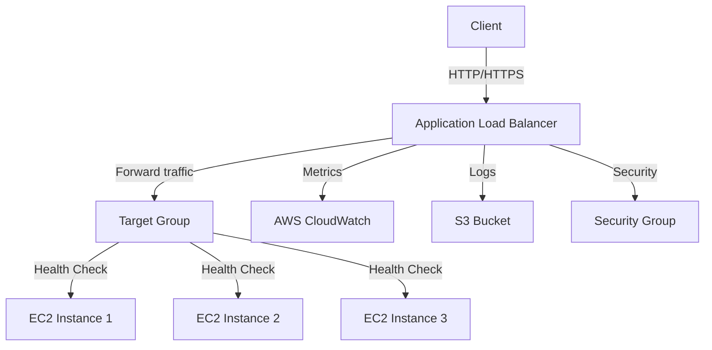

# Application Load Balancer — AWS

## Overview and scope

The purpose of this document is to establish standards and best practices for implementing Application Load Balancers (ALBs) within the AWS environment at Xentic. This standard aims to ensure that all engineering teams adhere to consistent configurations and practices when deploying ALBs, thereby enhancing reliability, scalability, and security across our services.

### Audience

This document is intended for:

- Cloud Engineers
- DevOps Teams
- Software Architects
- System Administrators
- Security Teams

### Scope

This standard covers:

- Configuration guidelines for AWS Application Load Balancers
- Best practices for routing and traffic management
- Security configurations, including SSL/TLS settings
- Integration with other AWS services (e.g., EC2, ECS, Lambda)
- Monitoring and logging requirements

### Non-goals

This document does NOT cover:

- Implementation details for non-AWS load balancers
- Specific application-level configurations
- Network architecture beyond the scope of ALBs

### Glossary

| Term                     | Definition                                                                 |
|--------------------------|-----------------------------------------------------------------------------|
| ALB                      | Application Load Balancer, a service that automatically distributes incoming application traffic across multiple targets. |
| Target Group             | A group of resources (EC2 instances, containers, IP addresses) that the ALB routes traffic to. |
| Listener                 | A process that checks for connection requests from clients, using the protocol and port specified. |
| Health Check             | A feature that checks the status of targets in a target group to ensure they can handle requests. |

### How This Standard Fits the Xentic Platform

At Xentic, we strive for excellence in our cloud infrastructure. The implementation of Application Load Balancers is a critical component of our microservices architecture, allowing us to efficiently manage traffic and ensure high availability. Adhering to this standard will help maintain a robust and secure environment across all services.

### Configuration Example

Below is an example of a basic ALB configuration in YAML format:

```yaml
Resources:
  MyApplicationLoadBalancer:
    Type: AWS::ElasticLoadBalancingV2::LoadBalancer
    Properties:
      Name: my-app-alb
      Subnets:
        - subnet-12345678
        - subnet-87654321
      SecurityGroups:
        - sg-12345678
      Scheme: internet-facing
      Tags:
        - Key: Name
          Value: My Application Load Balancer

  MyTargetGroup:
    Type: AWS::ElasticLoadBalancingV2::TargetGroup
    Properties:
      Name: my-target-group
      Port: 80
      Protocol: HTTP
      VpcId: vpc-12345678
      HealthCheckProtocol: HTTP
      HealthCheckPath: /health
      HealthCheckIntervalSeconds: 30
      HealthCheckTimeoutSeconds: 5
      HealthyThresholdCount: 2
      UnhealthyThresholdCount: 2
```

By following this standard, teams at Xentic will ensure that ALBs are deployed consistently, securely, and efficiently across all applications.

## Standards and policies

1. **MUST** use the Java base package naming convention `com.xentic.<service>` for all services that interact with Application Load Balancers.

2. **MUST NOT** use hardcoded values for any configuration parameters in code. All configurations related to ALBs must be externalized in property files or environment variables.

3. **SHOULD** implement SSL/TLS for all ALB listeners to ensure secure communication. Use AWS Certificate Manager (ACM) for managing SSL certificates.

   Example configuration:
   ```yaml
   Listeners:
     - Protocol: HTTPS
       Port: 443
       DefaultActions:
         - Type: forward
           TargetGroupArn: !Ref MyTargetGroup
       Certificates:
         - CertificateArn: arn:aws:acm:region:account-id:certificate/certificate-id
   ```

4. **MUST** configure health checks for all target groups to ensure that only healthy instances receive traffic. Health checks should be customized based on application requirements.

   Example health check configuration:
   ```yaml
   HealthCheckProtocol: HTTP
   HealthCheckPath: /health
   HealthCheckIntervalSeconds: 30
   HealthCheckTimeoutSeconds: 5
   HealthyThresholdCount: 2
   UnhealthyThresholdCount: 2
   ```

5. **MUST** tag all ALBs and related resources with the following tags:
   - `Environment`: Development, Staging, or Production
   - `Owner`: The team or individual responsible for the service
   - `Service`: The name of the service using the ALB

   Example tagging:
   ```yaml
   Tags:
     - Key: Environment
       Value: Production
     - Key: Owner
       Value: TeamA
     - Key: Service
       Value: MyService
   ```

6. **SHOULD** enable access logging for ALBs to capture detailed information about requests sent to the load balancer. Logs should be stored in an S3 bucket.

   Example configuration for access logging:
   ```yaml
   AccessLogs:
     S3Bucket: my-logs-bucket
     S3BucketPrefix: alb-logs/
     Enabled: true
   ```

7. **MUST NOT** expose ALBs directly to the internet without proper security measures. Use security groups to restrict access based on IP ranges and protocols.

8. **SHOULD** use path-based or host-based routing for microservices to optimize traffic management and improve performance.

   Example of path-based routing:
   ```yaml
   Rules:
     - Priority: 1
       Conditions:
         - Field: path-pattern
           Values:
             - /api/*
       Actions:
         - Type: forward
           TargetGroupArn: !Ref MyApiTargetGroup
   ```

9. **MUST** monitor ALB performance metrics using AWS CloudWatch. Set up alarms for critical metrics such as `HTTPCode_ELB_5XX_Count`, `HTTPCode_Target_2XX_Count`, and `TargetResponseTime`.

10. **SHOULD** regularly review and audit ALB configurations to ensure compliance with security and performance standards. Use AWS Config to track changes and compliance.

11. **MUST** ensure that all changes to ALB configurations are documented in the internal change management system, including the rationale for changes and the impact assessment.

12. **MUST NOT** use deprecated features or settings in ALB configurations. Always refer to the latest AWS documentation for current best practices.

By adhering to these standards and policies, Xentic will maintain a secure, efficient, and scalable infrastructure for its applications using AWS Application Load Balancers.

## Architecture and design

The architecture of the Application Load Balancer (ALB) within the AWS environment at Xentic is designed to ensure high availability, scalability, and security for our applications. The following sections provide a detailed description of the component diagram, data flows, integration points, and failure domains.

### Component Diagram



### Data Flows

1. **Client Request Flow**:
   - Clients send HTTP/HTTPS requests to the ALB.
   - The ALB routes the requests to the appropriate target group based on listener rules.

2. **Health Check Flow**:
   - The ALB performs health checks on the targets in the target group at specified intervals.
   - If a target fails the health check, it is marked as unhealthy and removed from the routing pool until it passes the health check again.

3. **Logging and Monitoring Flow**:
   - The ALB logs requests to an S3 bucket for access logging.
   - Metrics are sent to AWS CloudWatch for monitoring and alerting.

### Integration Points

- **EC2 Instances**: The ALB integrates with EC2 instances that serve as the targets for incoming traffic.
- **CloudWatch**: The ALB sends performance metrics to AWS CloudWatch for monitoring and alerting.
- **S3**: Access logs are stored in an S3 bucket for auditing and analysis.
- **Security Groups**: Security groups control access to the ALB and the target instances.

### Failure Domains

1. **ALB Failure**:
   - If the ALB itself fails, traffic will not be routed to the target instances. To mitigate this, multiple ALBs can be deployed across different Availability Zones.

2. **Target Instance Failure**:
   - If an EC2 instance in the target group fails, the ALB will automatically stop routing traffic to that instance after it fails the health check. Ensure that the target group has multiple instances for redundancy.

3. **Network Issues**:
   - Network issues may prevent the ALB from reaching the target instances. Implementing cross-zone load balancing can help distribute traffic evenly across instances in different Availability Zones.

### Summary of Best Practices

| Best Practice                        | Description                                                                 |
|--------------------------------------|-----------------------------------------------------------------------------|
| Use Multi-AZ Deployment              | Deploy ALBs across multiple Availability Zones for high availability.      |
| Configure Health Checks              | Set up appropriate health checks to ensure only healthy instances receive traffic. |
| Enable Access Logging                | Log all requests to an S3 bucket for auditing and analysis.               |
| Monitor with CloudWatch              | Use CloudWatch to monitor ALB metrics and set up alerts for critical thresholds. |
| Implement Security Groups             | Restrict access to the ALB and target instances using security groups.     |

By adhering to these architectural guidelines and best practices, Xentic ensures that its Application Load Balancers are robust, efficient, and capable of handling traffic securely and reliably.

## Configuration reference

### application.yml Configuration

The following is a sample `application.yml` configuration for an application that uses an AWS Application Load Balancer:

```yaml
server:
  port: 8080

aws:
  loadbalancer:
    name: my-app-alb
    scheme: internet-facing
    subnets:
      - subnet-12345678
      - subnet-87654321
    securityGroups:
      - sg-12345678
    accessLogs:
      enabled: true
      s3Bucket: my-logs-bucket
      s3BucketPrefix: alb-logs/
    targetGroup:
      name: my-target-group
      port: 80
      protocol: HTTP
      healthCheck:
        path: /health
        intervalSeconds: 30
        timeoutSeconds: 5
        healthyThresholdCount: 2
        unhealthyThresholdCount: 2
    tags:
      - key: Environment
        value: Production
      - key: Owner
        value: TeamA
      - key: Service
        value: MyService
```

### Terraform Configuration

Below is an example of a Terraform configuration for deploying an Application Load Balancer:

```hcl
resource "aws_lb" "my_app_alb" {
  name               = "my-app-alb"
  internal           = false
  load_balancer_type = "application"
  security_groups    = [aws_security_group.my_alb_sg.id]
  subnets            = [aws_subnet.my_subnet_1.id, aws_subnet.my_subnet_2.id]

  enable_deletion_protection = false

  tags = {
    Environment = "Production"
    Owner       = "TeamA"
    Service     = "MyService"
  }
}

resource "aws_lb_target_group" "my_target_group" {
  name     = "my-target-group"
  port     = 80
  protocol = "HTTP"
  vpc_id   = aws_vpc.my_vpc.id

  health_check {
    path                = "/health"
    interval            = 30
    timeout             = 5
    healthy_threshold   = 2
    unhealthy_threshold = 2
  }
}

resource "aws_lb_listener" "my_listener" {
  load_balancer_arn = aws_lb.my_app_alb.arn
  port              = 443
  protocol          = "HTTPS"

  default_action {
    type             = "forward"
    target_group_arn = aws_lb_target_group.my_target_group.arn
  }

  certificate_arn = "arn:aws:acm:region:account-id:certificate/certificate-id"
}
```

### Environment Variables Configuration

The following table outlines the required environment variables for configuring the AWS Application Load Balancer, including default and production values.

| Environment Variable           | Default Value           | Production Value          |
|--------------------------------|-------------------------|---------------------------|
| `AWS_LOADBALANCER_NAME`       | `my-app-alb`            | `my-app-alb`              |
| `AWS_LOADBALANCER_SCHEME`     | `internet-facing`       | `internet-facing`         |
| `AWS_LOADBALANCER_SUBNETS`    | `subnet-12345678`      | `subnet-12345678,subnet-87654321` |
| `AWS_LOADBALANCER_SECURITY_GROUP` | `sg-12345678`      | `sg-12345678`            |
| `AWS_LOADBALANCER_ACCESS_LOGS`| `false`                 | `true`                    |
| `AWS_LOADBALANCER_S3_BUCKET`   | `my-logs-bucket`       | `my-logs-bucket`         |
| `AWS_LOADBALANCER_TARGET_GROUP` | `my-target-group`      | `my-target-group`        |
| `AWS_LOADBALANCER_HEALTH_CHECK_PATH` | `/health`        | `/health`                |
| `AWS_LOADBALANCER_HEALTH_CHECK_INTERVAL` | `30`         | `30`                     |
| `AWS_LOADBALANCER_HEALTH_CHECK_TIMEOUT` | `5`          | `5`                      |
| `AWS_LOADBALANCER_HEALTHY_THRESHOLD` | `2`              | `2`                      |
| `AWS_LOADBALANCER_UNHEALTHY_THRESHOLD` | `2`            | `2`                      |

By following the above configuration references, teams at Xentic will ensure that Application Load Balancers are consistently deployed and managed across all environments.

## Implementation guide

To implement an Application Load Balancer (ALB) in AWS for Xentic applications, follow the steps outlined below. This guide includes necessary configurations, code examples, and deployment instructions.

### Step 1: Create VPC and Subnets

Ensure you have a Virtual Private Cloud (VPC) set up with public subnets. Use the following Terraform configuration to create a VPC and subnets:

```hcl
resource "aws_vpc" "my_vpc" {
  cidr_block = "10.0.0.0/16"

  tags = {
    Name = "my-vpc"
  }
}

resource "aws_subnet" "my_subnet_1" {
  vpc_id                  = aws_vpc.my_vpc.id
  cidr_block              = "10.0.1.0/24"
  availability_zone       = "us-west-2a"
  map_public_ip_on_launch = true

  tags = {
    Name = "my-subnet-1"
  }
}

resource "aws_subnet" "my_subnet_2" {
  vpc_id                  = aws_vpc.my_vpc.id
  cidr_block              = "10.0.2.0/24"
  availability_zone       = "us-west-2b"
  map_public_ip_on_launch = true

  tags = {
    Name = "my-subnet-2"
  }
}
```

### Step 2: Create Security Group

Create a security group that allows HTTP and HTTPS traffic to the ALB:

```hcl
resource "aws_security_group" "my_alb_sg" {
  vpc_id = aws_vpc.my_vpc.id

  ingress {
    from_port   = 80
    to_port     = 80
    protocol    = "tcp"
    cidr_blocks = ["0.0.0.0/0"]
  }

  ingress {
    from_port   = 443
    to_port     = 443
    protocol    = "tcp"
    cidr_blocks = ["0.0.0.0/0"]
  }

  egress {
    from_port   = 0
    to_port     = 0
    protocol    = "-1"
    cidr_blocks = ["0.0.0.0/0"]
  }

  tags = {
    Name = "my-alb-sg"
  }
}
```

### Step 3: Deploy Application Load Balancer

Now, create the ALB using the following Terraform configuration:

```hcl
resource "aws_lb" "my_app_alb" {
  name               = "my-app-alb"
  internal           = false
  load_balancer_type = "application"
  security_groups    = [aws_security_group.my_alb_sg.id]
  subnets            = [aws_subnet.my_subnet_1.id, aws_subnet.my_subnet_2.id]

  enable_deletion_protection = false

  tags = {
    Environment = "Production"
    Owner       = "TeamA"
    Service     = "MyService"
  }
}
```

### Step 4: Create Target Group

Define a target group that will be associated with the ALB:

```hcl
resource "aws_lb_target_group" "my_target_group" {
  name     = "my-target-group"
  port     = 80
  protocol = "HTTP"
  vpc_id   = aws_vpc.my_vpc.id

  health_check {
    path                = "/health"
    interval            = 30
    timeout             = 5
    healthy_threshold   = 2
    unhealthy_threshold = 2
  }
}
```

### Step 5: Create Listener

Create a listener for the ALB that forwards traffic to the target group:

```hcl
resource "aws_lb_listener" "my_listener" {
  load_balancer_arn = aws_lb.my_app_alb.arn
  port              = 443
  protocol          = "HTTPS"

  default_action {
    type             = "forward"
    target_group_arn = aws_lb_target_group.my_target_group.arn
  }

  certificate_arn = "arn:aws:acm:region:account-id:certificate/certificate-id"
}
```

### Step 6: Deploy EC2 Instances

Deploy EC2 instances that will serve as targets for the ALB. Below is an example configuration:

```hcl
resource "aws_instance" "my_ec2_instance" {
  ami           = "ami-0c55b159cbfafe1f0" # Example AMI ID
  instance_type = "t2.micro"
  subnet_id     = aws_subnet.my_subnet_1.id
  security_groups = [aws_security_group.my_alb_sg.name]

  tags = {
    Name = "my-ec2-instance"
  }
}
```

### Step 7: Register Targets

Register the EC2 instances with the target group:

```hcl
resource "aws_lb_target_group_attachment" "my_target_attachment" {
  target_group_arn = aws_lb_target_group.my_target_group.arn
  target_id        = aws_instance.my_ec2_instance.id
  port             = 80
}
```

### Step 8: Validate Configuration

Once all resources are created, validate the ALB configuration by accessing the ALB DNS name. Ensure that the health checks are passing and that traffic is routed correctly to the EC2 instances.

### Summary of Steps

1. Create a VPC and public subnets.
2. Set up a security group allowing HTTP/HTTPS traffic.
3. Deploy the Application Load Balancer.
4. Create a target group for the ALB.
5. Set up a listener for the ALB.
6. Launch EC2 instances as targets.
7. Register the EC2 instances with the target group.
8. Validate the configuration by testing the ALB.

By following these steps, Xentic will successfully implement an Application Load Balancer in AWS, ensuring high availability and scalability for its applications.

## Security requirements

To ensure the security of the Application Load Balancer (ALB) within the AWS environment at Xentic, the following security requirements must be adhered to:

### Threat Model Summary

- **External Threats**: Unauthorized access, DDoS attacks, and data interception.
- **Internal Threats**: Misconfiguration, insider threats, and accidental exposure of sensitive information.
- **Mitigation Strategies**:
  - Implement strict security group rules.
  - Use AWS WAF (Web Application Firewall) to filter malicious traffic.
  - Regularly review and update security configurations.

### Authentication and Authorization (Authn/Z)

- **Authentication**: 
  - All services behind the ALB MUST require authentication via OAuth2 or similar mechanisms.
  - Use AWS Cognito or a similar identity provider for managing user identities.

- **Authorization**:
  - Implement role-based access control (RBAC) to restrict access to resources.
  - Use AWS IAM roles and policies to control permissions for services interacting with the ALB.

### Secrets Management

- **Secrets Storage**:
  - Secrets (e.g., API keys, database credentials) MUST NOT be hardcoded in the application code.
  - Use AWS Secrets Manager or AWS Parameter Store to securely store and manage secrets.

- **Example Configuration for Secrets Manager**:
```yaml
secrets:
  database:
    name: my_database
    secret_id: /prod/myapp/database
```

### Input Validation

- **Validation Requirements**:
  - All incoming requests MUST be validated against a predefined schema to prevent injection attacks.
  - Use libraries such as Hibernate Validator or custom validation logic to ensure input integrity.

- **Example Code for Input Validation**:
```java
import javax.validation.constraints.NotBlank;

public class UserRequest {
    @NotBlank(message = "Username must not be empty")
    private String username;

    @NotBlank(message = "Password must not be empty")
    private String password;

    // Getters and Setters
}
```

### Audit Logging

- **Logging Requirements**:
  - All access to the ALB MUST be logged for audit purposes. This includes successful and failed authentication attempts.
  - Use AWS CloudTrail and enable ALB access logs to monitor traffic.

- **Example Configuration for Access Logs**:
```yaml
aws:
  loadbalancer:
    accessLogs:
      enabled: true
      s3Bucket: my-logs-bucket
      s3BucketPrefix: alb-logs/
      retentionDays: 30
```

- **Audit Log Format**:
  - Logs MUST include the following fields:
    - Timestamp
    - Source IP
    - HTTP method
    - Requested URL
    - Response status code
    - User identity (if applicable)

| Log Field         | Description                             |
|-------------------|-----------------------------------------|
| `timestamp`       | The time of the request.                |
| `source_ip`       | The IP address of the client.           |
| `http_method`     | The HTTP method used (GET, POST, etc.).|
| `requested_url`   | The URL requested by the client.        |
| `response_code`   | The HTTP response status code.          |
| `user_identity`   | The identity of the user (if authenticated). |

By implementing these security requirements, Xentic will safeguard its Application Load Balancer and the applications it serves, ensuring a robust security posture against various threats.

## Testing strategy

To ensure the reliability and performance of the Application Load Balancer (ALB) and the services behind it, Xentic MUST implement a comprehensive testing strategy that includes unit tests, integration tests, and contract tests. This section outlines the requirements and examples for each type of test, as well as coverage targets.

### Unit Tests

Unit tests are essential for verifying the functionality of individual components in isolation. Xentic applications MUST achieve a minimum of 80% code coverage for unit tests.

- **Testing Framework**: JUnit 5
- **Mocking Framework**: Mockito

#### Example Unit Test Class

```java
import static org.mockito.Mockito.*;
import static org.junit.jupiter.api.Assertions.*;
import org.junit.jupiter.api.Test;

public class MyServiceTest {

    private final MyRepository myRepository = mock(MyRepository.class);
    private final MyService myService = new MyService(myRepository);

    @Test
    public void testGetDataReturnsExpectedValue() {
        when(myRepository.findData()).thenReturn("Expected Data");

        String result = myService.getData();

        assertEquals("Expected Data", result);
        verify(myRepository, times(1)).findData();
    }
}
```

### Integration Tests

Integration tests are crucial for validating the interaction between multiple components, including the ALB, services, and databases. Xentic applications MUST achieve a minimum of 70% code coverage for integration tests.

- **Testing Framework**: Spring Boot Test
- **Database**: H2 (in-memory database for testing)

#### Example Integration Test Class

```java
import static org.springframework.test.web.servlet.request.MockMvcRequestBuilders.*;
import static org.springframework.test.web.servlet.result.MockMvcResultMatchers.*;
import org.junit.jupiter.api.BeforeEach;
import org.junit.jupiter.api.Test;
import org.springframework.beans.factory.annotation.Autowired;
import org.springframework.boot.test.autoconfigure.web.servlet.AutoConfigureMockMvc;
import org.springframework.boot.test.context.SpringBootTest;

@SpringBootTest
@AutoConfigureMockMvc
public class MyControllerIntegrationTest {

    @Autowired
    private MockMvc mockMvc;

    @Test
    public void testGetEndpointReturns200() throws Exception {
        mockMvc.perform(get("/api/data"))
                .andExpect(status().isOk())
                .andExpect(content().string("Expected Data"));
    }
}
```

### Contract Tests

Contract tests ensure that the services behind the ALB adhere to the expected API contracts. Xentic MUST implement contract tests using Pact or a similar framework.

- **Testing Framework**: Pact
- **Coverage Target**: 100% adherence to defined contracts

#### Example Contract Test Class

```java
import au.com.dius.pact.consumer.junit5.PactConsumerTestExt;
import au.com.dius.pact.consumer.junit5.PactFolder;
import org.junit.jupiter.api.Test;
import org.junit.jupiter.api.extension.ExtendWith;

@ExtendWith(PactConsumerTestExt.class)
@PactFolder("pacts")
public class MyServiceContractTest {

    @Test
    void testServiceContract() {
        // Define interactions and expectations here
    }
}
```

### Coverage Targets

| Test Type       | Minimum Coverage Target |
|------------------|------------------------|
| Unit Tests       | 80%                    |
| Integration Tests| 70%                    |
| Contract Tests   | 100%                   |

### Summary

- Xentic MUST implement unit, integration, and contract tests for all services behind the ALB.
- Achieve a minimum of 80% code coverage for unit tests and 70% for integration tests.
- Ensure 100% adherence to API contracts through contract tests.
- Utilize appropriate testing frameworks and tools as outlined in this strategy.

By adhering to this testing strategy, Xentic will ensure that its Application Load Balancer and associated services are robust, reliable, and ready for production deployment.

## Observability and operations

To maintain high availability and performance of the Application Load Balancer (ALB) at Xentic, comprehensive observability and operational practices MUST be implemented. This includes metrics collection, logging, tracing, dashboards, alerts, and Service Level Objectives (SLOs).

### Metrics

Xentic MUST collect and monitor the following key metrics for the ALB:

- **Request Count**: Total number of requests received.
- **Error Count**: Total number of 4xx and 5xx responses.
- **Latency**: Time taken to process requests.
- **Healthy Host Count**: Number of healthy targets in the target group.
- **Unhealthy Host Count**: Number of unhealthy targets in the target group.

#### Example Metrics Configuration (Prometheus)

```yaml
prometheus:
  scrape_configs:
    - job_name: 'alb'
      metrics_path: '/metrics'
      static_configs:
        - targets: ['<ALB_DNS>:<PORT>']
```

### Logs

All access and error logs MUST be captured for the ALB. These logs should include:

- Timestamp
- Request method
- Request path
- Response status code
- Latency
- User agent

#### Example Configuration for ALB Access Logs

```yaml
aws:
  loadbalancer:
    accessLogs:
      enabled: true
      s3Bucket: my-alb-logs
      s3BucketPrefix: access-logs/
      retentionDays: 30
```

### Traces

Distributed tracing MUST be implemented to track requests as they pass through the ALB and backend services. Xentic SHOULD use AWS X-Ray or OpenTelemetry for tracing.

#### Example Configuration for AWS X-Ray

```yaml
aws:
  xray:
    serviceName: my-service
    samplingRate: 0.1
```

### Dashboards

Dashboards MUST be created to visualize the collected metrics and logs. Xentic SHOULD utilize Grafana or AWS CloudWatch for dashboarding.

#### Example Grafana Dashboard Configuration

```json
{
  "title": "ALB Dashboard",
  "panels": [
    {
      "type": "graph",
      "title": "Request Count",
      "targets": [
        {
          "target": "sum(rate(alb_request_count[5m]))"
        }
      ]
    },
    {
      "type": "graph",
      "title": "Error Rate",
      "targets": [
        {
          "target": "sum(rate(alb_error_count[5m]))"
        }
      ]
    }
  ]
}
```

### Alerts

Alerts MUST be configured to notify the operations team of any anomalies or performance issues. Key alerts include:

- High error rate (e.g., > 5% error rate over 5 minutes)
- High latency (e.g., > 200ms average response time)
- Low healthy host count (e.g., < 2 healthy hosts)

#### Example Alert Configuration (Prometheus Alertmanager)

```yaml
groups:
  - name: alb-alerts
    rules:
      - alert: HighErrorRate
        expr: sum(rate(alb_error_count[5m])) / sum(rate(alb_request_count[5m])) > 0.05
        for: 5m
        labels:
          severity: critical
        annotations:
          summary: "High error rate detected"
          description: "Error rate exceeds 5% for the last 5 minutes."
```

### Service Level Objectives (SLOs)

Xentic MUST define clear SLOs to ensure service reliability. Suggested SLOs include:

| Objective                     | Target          |
|-------------------------------|-----------------|
| Availability                   | 99.9%           |
| Error Rate                     | < 1%            |
| Response Time (P95)           | < 200ms         |

### On-Call Runbook Steps

In the event of an incident, the on-call engineer MUST follow these steps:

1. **Identify the Issue**: Check the ALB metrics and logs for anomalies.
2. **Assess Impact**: Determine which services are affected and the severity of the issue.
3. **Notify Team**: Alert the engineering team and stakeholders using the designated communication channel (e.g., Slack, PagerDuty).
4. **Mitigate**: If applicable, scale the target group or adjust the ALB configuration to alleviate the issue.
5. **Document**: Record the incident details, including metrics, logs, and actions taken, in the incident management system.
6. **Post-Incident Review**: Conduct a review to analyze the root cause and improve future responses.

By implementing these observability and operational practices, Xentic will ensure that the Application Load Balancer remains performant, reliable, and aligned with business objectives.

## Migration and versioning

When managing the lifecycle of applications behind the Application Load Balancer (ALB) at Xentic, it is critical to establish a clear migration and versioning strategy. This section outlines the upgrade paths, deprecation policy, backward compatibility requirements, and rollback procedures.

### Upgrade Paths

Xentic applications MUST follow a defined upgrade path to ensure smooth transitions between versions. The following guidelines MUST be adhered to:

- **Semantic Versioning**: All services MUST use semantic versioning (MAJOR.MINOR.PATCH) to indicate changes.
- **Backward Compatibility**: Minor and patch updates MUST maintain backward compatibility with previous versions.
- **Major Updates**: Major version changes MAY introduce breaking changes; therefore, they MUST be clearly documented.

#### Example Versioning Table

| Version   | Change Type        | Description                                         |
|-----------|--------------------|-----------------------------------------------------|
| 1.0.0    | Initial Release     | First stable release of the service.                |
| 1.1.0    | Minor Update        | Added new features without breaking changes.        |
| 1.1.1    | Patch Update        | Bug fixes and performance improvements.              |
| 2.0.0    | Major Update        | Introduced breaking changes in the API.             |

### Deprecation Policy

Xentic MUST establish a clear deprecation policy for features and APIs. The following guidelines MUST be followed:

- **Notification**: Deprecated features MUST be announced at least one release cycle in advance.
- **Grace Period**: A grace period of at least two release cycles MUST be provided before removal.
- **Documentation**: Deprecated features MUST be clearly marked in the documentation, with migration paths suggested.

#### Example Deprecation Notification

```markdown
### Deprecation Notice for /api/old-endpoint

The `/api/old-endpoint` will be deprecated in version 2.0.0. Please migrate to `/api/new-endpoint` by version 1.3.0.
```

### Backward Compatibility

Backward compatibility is crucial for ensuring that existing clients can continue to function after updates. Xentic MUST adhere to the following practices:

- **Versioned APIs**: All APIs MUST be versioned (e.g., `/api/v1/resource`) to allow clients to specify which version they are using.
- **Feature Toggles**: New features MUST be implemented behind feature toggles to allow gradual rollout and testing.
- **Testing**: Regression tests MUST be conducted to verify that existing functionality remains intact after updates.

#### Example API Versioning

```java
@RestController
@RequestMapping("/api/v1/resource")
public class MyResourceController {
    // Existing implementation
}

@RestController
@RequestMapping("/api/v2/resource")
public class MyResourceV2Controller {
    // New implementation with additional features
}
```

### Rollback Procedures

In the event of a failed deployment or critical issue, Xentic MUST have rollback procedures in place. The following steps MUST be followed:

1. **Version Control**: All deployments MUST be tracked in version control to facilitate easy rollback.
2. **Automated Rollbacks**: Deployment scripts MUST include automated rollback capabilities to revert to the last stable version.
3. **Monitoring**: Deployments MUST be monitored closely for issues; if critical errors are detected, rollbacks MUST be initiated immediately.

#### Example Rollback Script (Bash)

```bash
#!/bin/bash

# Rollback to the previous stable version
git checkout <previous-stable-version>
docker-compose up -d --force-recreate
```

### Summary

- Xentic applications MUST follow semantic versioning and maintain backward compatibility.
- A clear deprecation policy MUST be established, including notifications and grace periods.
- All APIs MUST be versioned, and regression tests MUST be conducted to ensure existing functionality.
- Rollback procedures MUST be in place to quickly revert to stable versions in case of deployment failures.

By adhering to these migration and versioning standards, Xentic will ensure that its services behind the Application Load Balancer remain stable, reliable, and maintainable throughout their lifecycle.

## FAQ, anti-patterns, and checklists

### FAQ

1. **What is an Application Load Balancer (ALB)?**
   - An ALB is a service that automatically distributes incoming application traffic across multiple targets, such as EC2 instances, containers, and IP addresses.

2. **How does ALB differ from Classic Load Balancer?**
   - ALB operates at the application layer (Layer 7) and can route traffic based on content, while Classic Load Balancer operates at the transport layer (Layer 4) and does not have content-based routing capabilities.

3. **What protocols does ALB support?**
   - ALB supports HTTP, HTTPS, and WebSocket protocols.

4. **How can I configure health checks for my targets?**
   - Health checks can be configured by specifying the protocol, path, port, and response timeout in the target group settings.

   ```yaml
   healthCheck:
     protocol: HTTP
     path: /health
     port: 80
     interval: 30
     timeout: 5
     healthyThreshold: 2
     unhealthyThreshold: 2
   ```

5. **What is the maximum number of targets I can register with an ALB?**
   - Each ALB can support up to 50 targets per Availability Zone, with a maximum of 100 targets across all Availability Zones.

6. **How do I enable access logging for my ALB?**
   - Access logging can be enabled in the ALB settings, specifying an S3 bucket for storing logs.

7. **What is the cost associated with using an ALB?**
   - Costs are incurred based on the number of Load Balancer Capacity Units (LCUs) used, which are calculated based on new connections, active connections, and processed bytes.

8. **Can I use ALB with AWS Lambda?**
   - Yes, ALB can be configured to route requests to AWS Lambda functions, allowing for serverless architectures.

9. **How can I secure my ALB?**
   - Security can be enhanced by using HTTPS listeners, configuring security groups, and implementing AWS WAF (Web Application Firewall).

10. **What should I do if my ALB is not routing traffic?**
    - Check the target group health status, verify listener rules, and ensure that security groups allow traffic from the ALB.

### Anti-Patterns

| Anti-Pattern                        | Description                                                                 |
|-------------------------------------|-----------------------------------------------------------------------------|
| Hardcoding Target Group Instances    | Hardcoding instance IDs in the ALB configuration makes it difficult to scale and manage. |
| Ignoring Health Check Configuration  | Not configuring proper health checks can lead to routing traffic to unhealthy instances. |
| Using Only One Availability Zone     | Deploying ALB in a single Availability Zone increases the risk of downtime. |
| Overlooking Security Groups          | Failing to configure security groups properly can expose your services to security risks. |
| Not Enabling Access Logs            | Not enabling access logs can hinder troubleshooting and monitoring efforts. |

### Pre-Merge Checklist

- [ ] Ensure all code changes are reviewed by at least one other engineer.
- [ ] Verify that all unit tests pass with a minimum coverage of 80%.
- [ ] Confirm that integration tests have been executed and passed.
- [ ] Check that the ALB configuration adheres to Xentic standards.
- [ ] Ensure that all environment variables and configurations are documented.

### Production Checklist

- [ ] Confirm that the ALB is configured with the correct target groups and health checks.
- [ ] Validate that access logging is enabled and logs are being sent to the designated S3 bucket.
- [ ] Ensure that monitoring and alerting are set up for the ALB metrics.
- [ ] Verify that the security groups and IAM roles are correctly configured.
- [ ] Conduct a final review of deployment scripts and rollback procedures.
