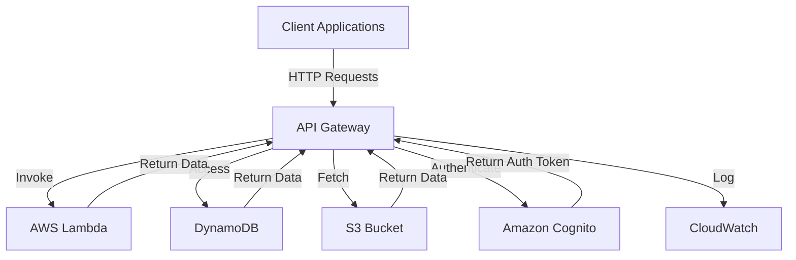

# API Gateway Standards — AWS

## Overview and scope

The purpose of this document is to define the standards and best practices for implementing an API Gateway within the AWS ecosystem at Xentic. This standard aims to ensure consistency, security, and efficiency across all services that utilize the API Gateway, facilitating seamless integration and communication between microservices.

### Audience

This document is intended for:
- **Developers**: Implementing and maintaining API Gateway configurations.
- **Architects**: Designing and reviewing API Gateway architectures.
- **DevOps Engineers**: Managing deployments and monitoring API performance.
- **Security Teams**: Ensuring compliance with security policies and practices.

### Scope

This standard covers:
- Configuration and deployment of AWS API Gateway.
- Security practices, including authentication and authorization.
- Rate limiting and throttling strategies.
- Monitoring and logging best practices.
- Integration with other AWS services such as Lambda, DynamoDB, and S3.

### Non-goals

This document does NOT cover:
- Detailed implementation of individual microservices.
- Non-AWS API Gateway solutions.
- Client-side API consumption practices.

### Glossary

| Term               | Definition                                                                 |
|--------------------|----------------------------------------------------------------------------|
| API Gateway        | A service that acts as a single entry point for APIs, managing traffic and requests. |
| Throttling         | The process of controlling the rate of requests sent to an API.           |
| Rate Limiting      | A technique used to limit the number of requests a user can make in a given time frame. |
| Lambda             | A serverless compute service that runs code in response to events.         |
| DynamoDB           | A fully managed NoSQL database service provided by AWS.                   |

### How this standard fits the Xentic platform

The API Gateway is a critical component of the Xentic platform, serving as the backbone for service-to-service communication and external API exposure. Adhering to these standards will ensure that:
- All APIs are uniformly designed, making them easier to consume and maintain.
- Security measures are consistently applied, protecting sensitive data and services.
- Performance is optimized through effective throttling and monitoring practices.

By following these guidelines, Xentic can achieve a robust, scalable, and secure API architecture that aligns with our organizational goals.

### Example Configuration

Below is an example of a basic AWS API Gateway configuration using YAML:

```yaml
apiVersion: v1
kind: ApiGateway
metadata:
  name: example-api
spec:
  description: "Example API for Xentic services"
  endpointType: "REGIONAL"
  resources:
    - path: /users
      methods:
        - method: GET
          authorizationType: AWS_IAM
          throttling:
            rateLimit: 100
            burstLimit: 200
```

### Example SQL for Monitoring

To monitor API usage, you may create a SQL table to log requests:

```sql
CREATE TABLE api_usage_logs (
    id SERIAL PRIMARY KEY,
    api_endpoint VARCHAR(255) NOT NULL,
    request_time TIMESTAMP DEFAULT CURRENT_TIMESTAMP,
    response_time INT,
    status_code INT
);
```

By adhering to these standards, Xentic aims to create a cohesive and efficient API ecosystem that supports the dynamic needs of our services.

## Standards and policies

1. **MUST** use the Java base package naming convention `com.xentic.<service>` for all API Gateway related code and configurations. This ensures consistency across the codebase.

2. **MUST NOT** expose any sensitive data through the API Gateway. All responses must be sanitized to prevent leakage of sensitive information.

3. **MUST** implement authentication and authorization using AWS IAM roles or Amazon Cognito. The `authorizationType` for each method should be set accordingly.

   ```yaml
   methods:
     - method: GET
       authorizationType: AWS_IAM
   ```

4. **SHOULD** enable CORS (Cross-Origin Resource Sharing) for APIs that will be accessed from web browsers. This is crucial for client-side applications.

   ```yaml
   cors:
     allowOrigins: "'*'"
     allowMethods: "'GET, POST, OPTIONS'"
   ```

5. **MUST** define throttling limits for each API method to prevent abuse and ensure fair usage. Rate limits should be set based on expected traffic.

   ```yaml
   throttling:
     rateLimit: 100
     burstLimit: 200
   ```

6. **MUST NOT** allow unrestricted access to APIs. All endpoints must have defined security policies to control access.

7. **SHOULD** implement logging for all API requests and responses. This can be achieved using AWS CloudWatch for monitoring and alerting.

   ```yaml
   logging:
     level: INFO
     destination: "cloudwatch"
   ```

8. **MUST** use versioning in API endpoints to manage changes and provide backward compatibility. This can be done by including the version in the path.

   ```yaml
   resources:
     - path: /v1/users
   ```

9. **SHOULD** utilize API Gateway stages for different environments (e.g., development, testing, production). Each stage should have its own configuration and settings.

10. **MUST** ensure that all API Gateway configurations are stored in version control systems (e.g., Git) to maintain a history of changes and facilitate collaboration.

11. **SHOULD** use AWS Lambda for backend processing where applicable, ensuring that the integration is seamless and performance is optimized.

12. **MUST NOT** hardcode configurations or sensitive information in code. Use AWS Secrets Manager or Parameter Store for managing sensitive data.

13. **MUST** implement monitoring and alerting for API performance metrics, such as latency and error rates, to proactively manage issues.

14. **SHOULD** provide comprehensive API documentation using tools like Swagger or OpenAPI to facilitate ease of use for developers consuming the APIs.

15. **MUST** adhere to Xentic's coding standards and best practices when implementing API Gateway configurations, ensuring code quality and maintainability.

16. **SHOULD** review and update API Gateway configurations regularly to adapt to changing business needs and technological advancements.

By following these standards and policies, Xentic will ensure a secure, efficient, and maintainable API Gateway architecture that meets the demands of our services and clients.

## Architecture and design

The architecture of the API Gateway at Xentic is designed to facilitate efficient communication between various microservices while ensuring security, scalability, and maintainability. Below is a component diagram that illustrates the key components and their interactions.



### Data Flows

1. **Client Requests**: Clients send HTTP requests to the API Gateway.
2. **Routing**: The API Gateway routes requests to the appropriate backend service (AWS Lambda, DynamoDB, or S3).
3. **Authentication**: The API Gateway verifies the request using Amazon Cognito or AWS IAM roles.
4. **Data Retrieval**: If the request involves data retrieval, the API Gateway interacts with DynamoDB or S3 to fetch the required data.
5. **Response**: The API Gateway aggregates responses from various services and sends them back to the client.

### Integration Points

- **AWS Lambda**: The primary compute service for executing business logic in response to API requests.
- **DynamoDB**: Used for storing and retrieving structured data.
- **S3**: Utilized for serving static content or file storage.
- **Amazon Cognito**: Handles user authentication and authorization.
- **CloudWatch**: Monitors API performance and logs API requests and responses.

### Failure Domains

To ensure high availability and fault tolerance, the following failure domains are considered:

- **Network Failures**: The API Gateway should be deployed in multiple Availability Zones (AZs) to mitigate network issues.
- **Service Failures**: AWS Lambda functions should include error handling and retries to manage transient failures.
- **Data Store Failures**: DynamoDB should be configured with global tables for cross-region replication, ensuring data availability.
- **Authentication Failures**: Implement fallback mechanisms for authentication, such as allowing temporary access tokens during outages.

### Configuration Examples

Below is an example of an AWS API Gateway configuration that includes integration with Lambda and DynamoDB:

```yaml
apiVersion: v1
kind: ApiGateway
metadata:
  name: user-service-api
spec:
  description: "API for managing users"
  endpointType: "REGIONAL"
  resources:
    - path: /v1/users
      methods:
        - method: GET
          integration:
            type: AWS_PROXY
            uri: "arn:aws:lambda:us-east-1:123456789012:function:getUserFunction"
          authorizationType: AWS_IAM
          throttling:
            rateLimit: 100
            burstLimit: 200
```

### Monitoring and Logging

To ensure that API performance is monitored effectively, the following CloudWatch logging configuration should be implemented:

```yaml
logging:
  level: INFO
  destination: "cloudwatch"
  logGroup: "/aws/api-gateway/user-service-api"
  retentionInDays: 14
```

By adhering to these architectural standards, Xentic will create a robust, scalable, and secure API Gateway environment that effectively supports our microservices architecture.

## Configuration reference

### application.yml Example

The following `application.yml` configuration provides a comprehensive setup for an AWS API Gateway:

```yaml
apiGateway:
  name: user-service-api
  description: "API for managing users"
  endpointType: "REGIONAL"
  resources:
    - path: /v1/users
      methods:
        - method: GET
          integration:
            type: AWS_PROXY
            uri: "arn:aws:lambda:us-east-1:123456789012:function:getUserFunction"
          authorizationType: AWS_IAM
          throttling:
            rateLimit: 100
            burstLimit: 200
        - method: POST
          integration:
            type: AWS_PROXY
            uri: "arn:aws:lambda:us-east-1:123456789012:function:createUserFunction"
          authorizationType: AWS_IAM
          throttling:
            rateLimit: 50
            burstLimit: 100
  cors:
    allowOrigins: "'*'"
    allowMethods: "'GET, POST, OPTIONS'"
  logging:
    level: INFO
    destination: "cloudwatch"
    logGroup: "/aws/api-gateway/user-service-api"
    retentionInDays: 14
```

### Terraform Configuration

The following Terraform configuration sets up an AWS API Gateway with Lambda integration:

```hcl
resource "aws_api_gateway_rest_api" "user_service_api" {
  name        = "user-service-api"
  description = "API for managing users"
}

resource "aws_api_gateway_resource" "users" {
  rest_api_id = aws_api_gateway_rest_api.user_service_api.id
  parent_id   = aws_api_gateway_rest_api.user_service_api.root_resource_id
  path_part   = "v1/users"
}

resource "aws_api_gateway_method" "get_users" {
  rest_api_id   = aws_api_gateway_rest_api.user_service_api.id
  resource_id   = aws_api_gateway_resource.users.id
  http_method   = "GET"
  authorization = "AWS_IAM"
}

resource "aws_api_gateway_method" "post_users" {
  rest_api_id   = aws_api_gateway_rest_api.user_service_api.id
  resource_id   = aws_api_gateway_resource.users.id
  http_method   = "POST"
  authorization = "AWS_IAM"
}

resource "aws_api_gateway_integration" "get_users_integration" {
  rest_api_id = aws_api_gateway_rest_api.user_service_api.id
  resource_id = aws_api_gateway_resource.users.id
  http_method = aws_api_gateway_method.get_users.http_method

  integration_http_method = "POST"
  type                    = "AWS_PROXY"
  uri                     = "arn:aws:lambda:us-east-1:123456789012:function:getUserFunction"
}

resource "aws_api_gateway_integration" "post_users_integration" {
  rest_api_id = aws_api_gateway_rest_api.user_service_api.id
  resource_id = aws_api_gateway_resource.users.id
  http_method = aws_api_gateway_method.post_users.http_method

  integration_http_method = "POST"
  type                    = "AWS_PROXY"
  uri                     = "arn:aws:lambda:us-east-1:123456789012:function:createUserFunction"
}
```

### Environment Variables

The following table outlines the environment variables that MUST be configured for the API Gateway, along with their default and production values:

| Variable Name               | Default Value               | Production Value                |
|-----------------------------|-----------------------------|---------------------------------|
| `API_GATEWAY_NAME`          | `user-service-api`          | `user-service-api-prod`         |
| `API_GATEWAY_DESCRIPTION`   | `API for managing users`    | `Production API for managing users` |
| `AWS_REGION`                | `us-east-1`                 | `us-east-1`                     |
| `LAMBDA_GET_USER_FUNCTION`  | `getUserFunction`           | `getUserFunctionProd`           |
| `LAMBDA_CREATE_USER_FUNCTION`| `createUserFunction`        | `createUserFunctionProd`        |
| `CORS_ALLOW_ORIGINS`        | `'*'`                       | `'https://www.xentic.com'`     |

By following these configuration standards, Xentic ensures that the API Gateway is set up correctly for both development and production environments, promoting consistency and reliability across services.

## Implementation guide

To implement the API Gateway at Xentic using AWS, follow these step-by-step instructions. This guide will cover the necessary configurations, code examples, and best practices to ensure a robust implementation.

### Step 1: Set Up AWS API Gateway

1. **Create an API Gateway**:
   Use the AWS Management Console or AWS CLI to create a new API Gateway.

   ```bash
   aws apigateway create-rest-api --name user-service-api --description "API for managing users" --endpoint-configuration types=REGIONAL
   ```

2. **Get the API ID**:
   After creating the API, retrieve the API ID for further configuration.

   ```bash
   API_ID=$(aws apigateway get-rest-apis --query "items[?name=='user-service-api'].id" --output text)
   ```

### Step 2: Define Resources and Methods

1. **Create Resource**:
   Create the `/v1/users` resource under the API.

   ```bash
   PARENT_ID=$(aws apigateway get-resources --rest-api-id $API_ID --query "items[?path=='/'].id" --output text)
   aws apigateway create-resource --rest-api-id $API_ID --parent-id $PARENT_ID --path-part v1/users
   ```

2. **Create Methods**:
   Define the GET and POST methods for the `/v1/users` resource.

   ```bash
   # Create GET method
   aws apigateway put-method --rest-api-id $API_ID --resource-id $(aws apigateway get-resources --rest-api-id $API_ID --query "items[?path=='/v1/users'].id" --output text) --http-method GET --authorization-type AWS_IAM

   # Create POST method
   aws apigateway put-method --rest-api-id $API_ID --resource-id $(aws apigateway get-resources --rest-api-id $API_ID --query "items[?path=='/v1/users'].id" --output text) --http-method POST --authorization-type AWS_IAM
   ```

### Step 3: Integrate with AWS Lambda

1. **Create Lambda Functions**:
   Ensure you have the Lambda functions `getUserFunction` and `createUserFunction` deployed.

   ```bash
   aws lambda create-function --function-name getUserFunction --runtime java11 --role <role-arn> --handler com.xentic.user.GetUserHandler --zip-file fileb://getUserFunction.zip
   aws lambda create-function --function-name createUserFunction --runtime java11 --role <role-arn> --handler com.xentic.user.CreateUserHandler --zip-file fileb://createUserFunction.zip
   ```

2. **Integrate Lambda with API Gateway**:
   Set up the integration for both methods.

   ```bash
   # Integrate GET method
   aws apigateway put-integration --rest-api-id $API_ID --resource-id $(aws apigateway get-resources --rest-api-id $API_ID --query "items[?path=='/v1/users'].id" --output text) --http-method GET --type AWS_PROXY --integration-http-method POST --uri arn:aws:lambda:us-east-1:123456789012:function:getUserFunction

   # Integrate POST method
   aws apigateway put-integration --rest-api-id $API_ID --resource-id $(aws apigateway get-resources --rest-api-id $API_ID --query "items[?path=='/v1/users'].id" --output text) --http-method POST --type AWS_PROXY --integration-http-method POST --uri arn:aws:lambda:us-east-1:123456789012:function:createUserFunction
   ```

### Step 4: Deploy the API

1. **Create a Deployment**:
   Deploy the API to make it accessible.

   ```bash
   aws apigateway create-deployment --rest-api-id $API_ID --stage-name prod
   ```

### Step 5: Configure CORS

1. **Enable CORS**:
   Configure Cross-Origin Resource Sharing (CORS) for the API.

   ```bash
   aws apigateway put-integration-response --rest-api-id $API_ID --resource-id $(aws apigateway get-resources --rest-api-id $API_ID --query "items[?path=='/v1/users'].id" --output text) --http-method OPTIONS --status-code 200 --response-parameters method.response.header.Access-Control-Allow-Origin="'*'" --response-parameters method.response.header.Access-Control-Allow-Methods="'GET, POST, OPTIONS'"
   ```

### Step 6: Configure Logging

1. **Enable CloudWatch Logs**:
   Set up logging to monitor API usage.

   ```bash
   aws apigateway create-stage --rest-api-id $API_ID --stage-name prod --method-settings '[{"methodPath":"v1/users/GET","loggingLevel":"INFO","dataTraceEnabled":true}]'
   ```

### Step 7: Environment Variables

Ensure the following environment variables are set in your Lambda functions:

| Variable Name               | Value                          |
|-----------------------------|--------------------------------|
| `AWS_REGION`                | `us-east-1`                   |
| `LAMBDA_GET_USER_FUNCTION`  | `getUserFunction`             |
| `LAMBDA_CREATE_USER_FUNCTION`| `createUserFunction`         |

### Summary

By following these steps, Xentic will have a fully functional API Gateway integrated with AWS Lambda, allowing for efficient user management. Ensure that all configurations are reviewed and tested in a staging environment before moving to production.

## Security requirements

### Threat Model Summary

Xentic's API Gateway must be designed to mitigate various security threats, including but not limited to:

- **Unauthorized Access**: Ensure that only authenticated users can access the API.
- **Data Breaches**: Protect sensitive data from being exposed during transmission or storage.
- **Denial of Service (DoS)**: Implement rate limiting to prevent abuse of the API.
- **Injection Attacks**: Validate and sanitize all inputs to prevent SQL injection and other injection attacks.
- **Man-in-the-Middle Attacks**: Use HTTPS to encrypt data in transit.

### Authentication and Authorization (Authn/z)

- **Authentication**: Xentic MUST use AWS IAM for authentication. Each API method MUST require AWS_IAM authorization.
- **Authorization**: Role-based access control (RBAC) MUST be implemented to ensure users have the appropriate permissions to access specific resources.

Example IAM policy for API Gateway:

```json
{
  "Version": "2012-10-17",
  "Statement": [
    {
      "Effect": "Allow",
      "Action": [
        "execute-api:Invoke"
      ],
      "Resource": [
        "arn:aws:execute-api:us-east-1:123456789012:user-service-api/prod/*"
      ]
    }
  ]
}
```

### Secrets Management

- Secrets, such as API keys and database credentials, MUST NOT be hardcoded in the codebase.
- Use AWS Secrets Manager or AWS Systems Manager Parameter Store to securely manage and access secrets.

Example of accessing secrets in Java:

```java
import com.amazonaws.services.secretsmanager.AWSSecretsManager;
import com.amazonaws.services.secretsmanager.AWSSecretsManagerClientBuilder;
import com.amazonaws.services.secretsmanager.model.GetSecretValueRequest;
import com.amazonaws.services.secretsmanager.model.GetSecretValueResult;

public String getSecret(String secretName) {
    AWSSecretsManager client = AWSSecretsManagerClientBuilder.standard().build();
    GetSecretValueRequest getSecretValueRequest = new GetSecretValueRequest().withSecretId(secretName);
    GetSecretValueResult getSecretValueResult = client.getSecretValue(getSecretValueRequest);
    return getSecretValueResult.getSecretString();
}
```

### Input Validation

- All inputs MUST be validated against a strict schema to prevent injection attacks.
- Use libraries such as Hibernate Validator or custom validation logic to ensure data integrity.

Example validation using Hibernate Validator:

```java
import javax.validation.constraints.NotNull;
import javax.validation.constraints.Size;

public class User {

    @NotNull
    @Size(min = 1, max = 100)
    private String username;

    @NotNull
    @Size(min = 8, max = 100)
    private String password;

    // Getters and setters
}
```

### Audit Logging

- API Gateway MUST enable logging to capture all requests and responses for auditing purposes.
- Logs MUST be sent to AWS CloudWatch and retained for a minimum of 90 days.

Example CloudWatch logging configuration in Terraform:

```hcl
resource "aws_api_gateway_stage" "prod" {
  rest_api_id = aws_api_gateway_rest_api.user_service_api.id
  stage_name  = "prod"

  method_settings {
    method_path = "v1/users/GET"
    logging_level = "INFO"
    data_trace_enabled = true
  }

  method_settings {
    method_path = "v1/users/POST"
    logging_level = "INFO"
    data_trace_enabled = true
  }
}
```

### Summary

By adhering to these security requirements, Xentic ensures that the API Gateway is robust against common threats while providing a secure environment for user data. All team members MUST follow these guidelines to maintain the integrity and security of the API services.

## Testing strategy

To ensure the reliability and performance of the API Gateway, Xentic MUST implement a comprehensive testing strategy that includes unit tests, integration tests, and contract tests. Each type of test serves a specific purpose and collectively contributes to the overall quality of the API.

### 1. Unit Tests

Unit tests MUST be written to validate individual components of the API, such as request handlers and utility functions. Each unit test should cover various scenarios, including successful responses and error handling.

**Coverage Target**: A minimum of 80% code coverage for all service classes.

**Example Test Class**:
```java
import static org.mockito.Mockito.*;
import static org.junit.jupiter.api.Assertions.*;
import org.junit.jupiter.api.Test;

public class GetUserHandlerTest {

    private final UserService userService = mock(UserService.class);
    private final GetUserHandler handler = new GetUserHandler(userService);

    @Test
    public void testGetUser_Success() {
        String userId = "123";
        User user = new User(userId, "testUser");
        when(userService.getUser(userId)).thenReturn(user);

        APIGatewayProxyResponseEvent response = handler.handleRequest(new APIGatewayProxyRequestEvent().withPathParameters(Map.of("userId", userId)), null);

        assertEquals(200, response.getStatusCode());
        assertEquals("{\"id\":\"123\",\"username\":\"testUser\"}", response.getBody());
    }

    @Test
    public void testGetUser_NotFound() {
        String userId = "123";
        when(userService.getUser(userId)).thenThrow(new UserNotFoundException());

        APIGatewayProxyResponseEvent response = handler.handleRequest(new APIGatewayProxyRequestEvent().withPathParameters(Map.of("userId", userId)), null);

        assertEquals(404, response.getStatusCode());
    }
}
```

### 2. Integration Tests

Integration tests MUST validate the interaction between the API Gateway and the AWS Lambda functions. These tests should ensure that the API correctly routes requests and that the Lambda functions return the expected results.

**Coverage Target**: A minimum of 70% code coverage for integration scenarios.

**Example Test Class**:
```java
import static io.restassured.RestAssured.*;
import static org.hamcrest.Matchers.*;
import org.junit.jupiter.api.Test;

public class UserServiceIntegrationTest {

    @Test
    public void testCreateUser() {
        given()
            .contentType("application/json")
            .body("{\"username\":\"newUser\", \"password\":\"password123\"}")
        .when()
            .post("https://api.internal.xentic.io/v1/users")
        .then()
            .statusCode(201)
            .body("username", equalTo("newUser"));
    }

    @Test
    public void testGetUser() {
        given()
            .pathParam("userId", "123")
        .when()
            .get("https://api.internal.xentic.io/v1/users/{userId}")
        .then()
            .statusCode(200)
            .body("id", equalTo("123"));
    }
}
```

### 3. Contract Tests

Contract tests MUST be implemented to ensure that the API adheres to the defined contract between the API Gateway and its consumers. This is crucial for maintaining backward compatibility and ensuring that changes do not break existing clients.

**Example Pact File**:
```json
{
  "consumer": {
    "name": "UserServiceClient"
  },
  "provider": {
    "name": "UserServiceAPI"
  },
  "interactions": [
    {
      "description": "a request for a user",
      "request": {
        "method": "GET",
        "path": "/v1/users/123"
      },
      "response": {
        "status": 200,
        "body": {
          "id": "123",
          "username": "testUser"
        }
      }
    }
  ]
}
```

### 4. Coverage Targets Summary

| Test Type       | Coverage Target |
|------------------|-----------------|
| Unit Tests       | 80%             |
| Integration Tests| 70%             |
| Contract Tests   | 100%            |

### 5. Continuous Integration

Xentic MUST integrate the testing strategy into the CI/CD pipeline. Automated tests should run on every push to the repository, and any test failures MUST block the deployment process.

### Summary

By implementing a robust testing strategy that includes unit, integration, and contract tests, Xentic ensures the reliability and quality of the API Gateway. All team members MUST adhere to these testing standards to maintain a high level of service integrity.

## Observability and operations

To ensure the effective monitoring and management of the API Gateway, Xentic MUST implement comprehensive observability practices. This includes metrics collection, logging, tracing, dashboarding, alerting, and defining Service Level Objectives (SLOs). 

### Metrics

Metrics MUST be collected to monitor the performance and health of the API Gateway. Key metrics include:

- **Request Count**: Total number of API requests.
- **Error Rate**: Percentage of failed requests.
- **Latency**: Time taken to process requests.
- **Throttling Count**: Number of requests that were throttled.
  
Metrics should be sent to AWS CloudWatch for aggregation and analysis.

Example CloudWatch metrics configuration in Terraform:

```hcl
resource "aws_cloudwatch_metric_alarm" "high_error_rate" {
  alarm_name          = "HighErrorRate"
  comparison_operator = "GreaterThanThreshold"
  evaluation_periods  = "1"
  metric_name        = "4XXError"
  namespace          = "AWS/ApiGateway"
  period             = "60"
  statistic          = "Sum"
  threshold          = "5"
  alarm_description  = "This metric monitors the high error rate"
  dimensions = {
    ApiName = aws_api_gateway_rest_api.user_service_api.name
  }
}
```

### Logs

All API Gateway logs MUST be enabled and sent to AWS CloudWatch Logs. Logs should include:

- **Request and Response Logs**: Capture details of incoming requests and outgoing responses.
- **Error Logs**: Capture stack traces and error messages for debugging.

Example logging configuration in AWS API Gateway:

```yaml
loggingLevel: INFO
dataTraceEnabled: true
requestParameters:
  method.request.header.X-Request-ID: true
```

### Traces

Distributed tracing MUST be implemented to track requests as they flow through the API Gateway and downstream services. Xentic SHOULD use AWS X-Ray for tracing.

Example configuration for AWS X-Ray:

```yaml
xray:
  enabled: true
  samplingRate: 0.1
```

### Dashboards

Xentic MUST create dashboards in AWS CloudWatch to visualize key metrics and logs. Dashboards should include:

- API performance metrics (latency, error rates).
- Request volume trends.
- Throttling events.
  
Example CloudWatch dashboard JSON:

```json
{
  "widgets": [
    {
      "type": "metric",
      "x": 0,
      "y": 0,
      "width": 24,
      "height": 6,
      "properties": {
        "metrics": [
          [ "AWS/ApiGateway", "4XXError", "ApiName", "user-service-api" ],
          [ "AWS/ApiGateway", "Latency", "ApiName", "user-service-api" ]
        ],
        "period": 300,
        "stat": "Sum",
        "region": "us-east-1",
        "title": "API Gateway Metrics"
      }
    }
  ]
}
```

### Alerts

Alerts MUST be configured for critical metrics to notify the on-call team. Alerts should be set for:

- High error rates.
- Latency exceeding defined thresholds.
- Throttling events.

Example alert configuration in Terraform:

```hcl
resource "aws_cloudwatch_metric_alarm" "high_latency" {
  alarm_name          = "HighLatency"
  comparison_operator = "GreaterThanThreshold"
  evaluation_periods  = "1"
  metric_name        = "Latency"
  namespace          = "AWS/ApiGateway"
  period             = "60"
  statistic          = "Average"
  threshold          = "200"
  alarm_description  = "This metric monitors high latency in API Gateway"
  dimensions = {
    ApiName = aws_api_gateway_rest_api.user_service_api.name
  }
}
```

### Service Level Objectives (SLOs)

SLOs MUST be defined to set expectations for service performance. Common SLOs include:

- **Availability**: 99.9% uptime.
- **Error Rate**: Less than 1% of requests resulting in errors.
- **Latency**: 95th percentile latency under 200ms.

### On-Call Runbook Steps

In the event of an incident, the on-call engineer MUST follow these steps:

1. **Identify the Alert**: Check CloudWatch for triggered alarms.
2. **Assess the Impact**: Determine the scope and impact of the issue.
3. **Check Logs**: Review API Gateway logs in CloudWatch Logs for errors.
4. **Investigate Metrics**: Analyze metrics for anomalies.
5. **Engage Team**: If necessary, escalate to the engineering team.
6. **Document Findings**: Record the incident details and resolution steps.
7. **Post-Mortem**: Conduct a post-mortem analysis to prevent future occurrences.

### Summary

By implementing robust observability practices, including metrics, logs, traces, dashboards, alerts, and SLOs, Xentic ensures that the API Gateway operates reliably and efficiently. All team members MUST adhere to these observability standards to maintain high service quality and operational excellence.

## Migration and versioning

Xentic MUST establish clear migration and versioning policies to ensure smooth transitions between API versions and maintain backward compatibility. This is critical for minimizing disruption to consumers of the API and ensuring that new features can be adopted without breaking existing functionality.

### Upgrade Paths

When introducing new versions of the API, Xentic MUST provide clear upgrade paths. This includes:

- **Versioning Strategy**: Use semantic versioning (e.g., v1.0.0, v1.1.0) to indicate breaking changes, new features, and patches.
- **Documentation**: Each new version MUST have comprehensive documentation detailing changes, new features, and migration steps. This documentation should be accessible at `https://docs.internal.xentic.io/api/migration`.

### Deprecation Policy

Xentic MUST implement a deprecation policy for API endpoints. This policy should include:

- **Notice Period**: Deprecation notices MUST be communicated at least three months in advance through the API response headers and documentation.
- **Deprecation Header**: Use a custom header to indicate deprecated endpoints:
  ```http
  Deprecated: true
  ```
- **Sunset Date**: Clearly specify a sunset date in the documentation and response headers when the endpoint will be removed.

### Backward Compatibility

New versions MUST maintain backward compatibility wherever possible. This can be achieved by:

- **Non-breaking Changes**: Add new fields or endpoints rather than modifying or removing existing ones.
- **Versioned Endpoints**: Use versioned paths in the API to allow consumers to choose which version to use:
  ```
  /v1/users
  /v2/users
  ```

### Rollback Procedures

In the event of a failed deployment or critical issue with a new version, Xentic MUST have rollback procedures in place:

1. **Automated Rollbacks**: Utilize AWS Lambda and CloudFormation to automate rollbacks to the previous stable version.
2. **Version Control**: Maintain version control of all API Gateway configurations and Lambda functions in a Git repository.
3. **Rollback Steps**:
   - Identify the version that needs to be rolled back.
   - Execute the rollback script to revert to the previous version.
   - Monitor the API for stability post-rollback.

### Migration Example

When migrating from v1 to v2, the following steps MUST be followed:

1. **Update Documentation**:
   - Document new features and changes in v2.
   - Provide migration guides for consumers.

2. **Example Migration Guide**:
   ```markdown
   ## Migration from v1 to v2
   - **New Features**: 
     - Added `email` field to user object.
   - **Breaking Changes**:
     - Removed `username` from user object. Use `email` instead.
   - **Migration Steps**:
     1. Update your API calls to use `/v2/users`.
     2. Adjust your data model to accommodate the new `email` field.
   ```

3. **Deprecation Notice**:
   - Add the following header to all responses from v1:
   ```http
   Deprecated: true
   ```
   - Include a message in the response body:
   ```json
   {
     "message": "This API version is deprecated. Please migrate to v2."
   }
   ```

### Versioning Table

| Version | Release Date | Status          | Deprecation Notice |
|---------|--------------|------------------|--------------------|
| v1.0.0 | 2023-01-01   | Active           | N/A                |
| v1.1.0 | 2023-03-01   | Active           | N/A                |
| v2.0.0 | 2023-06-01   | Active           | v1.0.0 deprecated  |
| v1.0.1 | 2023-07-01   | Deprecated       | 2023-09-01         |

### Summary

By adhering to these migration and versioning standards, Xentic ensures that API consumers can seamlessly transition between versions while minimizing disruption. All team members MUST follow these guidelines to maintain the integrity and usability of the API.

## FAQ, anti-patterns, and checklists

### FAQ

1. **What is the purpose of the API Gateway?**
   - The API Gateway serves as a single entry point for all API requests, providing features such as authentication, routing, and rate limiting.

2. **How should we handle authentication?**
   - Authentication MUST be handled using AWS Cognito or a similar service. Tokens should be validated at the API Gateway level.

3. **What should we do if we encounter high latency?**
   - Investigate the backend services for performance issues, check for throttling, and analyze logs for bottlenecks.

4. **How are API versions managed?**
   - API versions MUST be managed using semantic versioning and clearly defined upgrade paths, as outlined in the versioning policy.

5. **What logging level should be used in production?**
   - The logging level MUST be set to `INFO` in production environments to balance verbosity and performance.

6. **How can we monitor API health?**
   - Health checks MUST be implemented and monitored through CloudWatch metrics and alarms for critical thresholds.

7. **What are the SLOs for API performance?**
   - Common SLOs include 99.9% availability, less than 1% error rate, and 95th percentile latency under 200ms.

8. **How should we handle deprecation of API endpoints?**
   - A deprecation policy MUST be followed, including a notice period, deprecation header, and sunset date.

9. **What tools can we use for distributed tracing?**
   - Xentic SHOULD use AWS X-Ray for distributed tracing to gain insights into request flows and performance.

10. **How do we ensure backward compatibility?**
    - New versions MUST maintain backward compatibility by avoiding breaking changes and using versioned endpoints.

### Anti-Patterns

| Anti-Pattern                        | Description                                                                                       |
|-------------------------------------|---------------------------------------------------------------------------------------------------|
| Hardcoding Configuration             | Configuration values MUST NOT be hardcoded in the codebase; use environment variables instead.    |
| Ignoring Rate Limiting              | Failing to implement rate limiting can lead to service overload; this MUST be enforced.           |
| Lack of Documentation                | API endpoints MUST be well-documented to ensure consumers understand how to use them effectively. |
| Not Using Versioning                 | Failing to version APIs can lead to breaking changes; versioning MUST be implemented.            |
| Overly Verbose Logging               | Excessive logging can degrade performance; log levels MUST be appropriately set.                 |
| Ignoring Security Best Practices     | Security measures MUST NOT be overlooked; always validate inputs and secure sensitive data.      |

### Pre-Merge Checklist

- [ ] Code adheres to Xentic’s coding standards.
- [ ] All unit tests are written and passing.
- [ ] Integration tests are implemented for critical paths.
- [ ] API documentation is updated.
- [ ] Security reviews are completed.
- [ ] Performance benchmarks are conducted.
- [ ] Code is reviewed by at least one other engineer.

### Production Checklist

- [ ] Deployment plan is reviewed and approved.
- [ ] Backup of the current version is created.
- [ ] Monitoring and alerting are configured.
- [ ] Traffic is gradually shifted to the new version (canary deployment).
- [ ] Post-deployment verification tests are executed.
- [ ] Rollback plan is in place and tested.
- [ ] Stakeholders are notified of the deployment.
