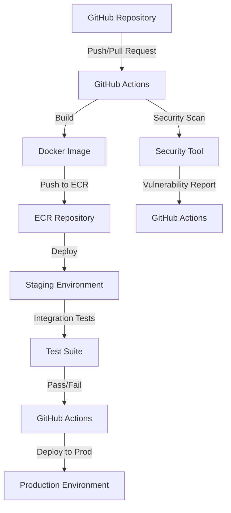

# CI/CD Pipeline Standards — GitHub Actions + AWS

## Overview and scope

The purpose of this document is to establish the standards and best practices for implementing Continuous Integration and Continuous Deployment (CI/CD) pipelines using GitHub Actions and AWS services at Xentic. This document outlines the necessary steps, configurations, and guidelines for ensuring consistent and secure deployment practices across all services.

### Audience

This document is intended for:
- **Developers**: who are responsible for writing and maintaining code.
- **DevOps Engineers**: who manage the CI/CD pipelines and infrastructure.
- **Architects**: who design and oversee the implementation of the CI/CD processes.
- **Quality Assurance Teams**: who validate the deployments and ensure software quality.

### Scope

The scope of this document includes:
- CI/CD pipeline stages and their respective responsibilities.
- Configuration examples for GitHub Actions workflows.
- Security practices and compliance requirements.
- Guidelines for managing AWS resources in the context of CI/CD.

### Non-goals

This document does NOT cover:
- Detailed explanations of AWS services outside the context of CI/CD.
- In-depth GitHub Actions syntax or features unrelated to Xentic's standards.
- Specific implementation details for individual services; rather, it focuses on general practices applicable across services.

### Glossary

| Term               | Definition                                                                 |
|--------------------|-----------------------------------------------------------------------------|
| CI/CD              | Continuous Integration and Continuous Deployment.                          |
| GitHub Actions     | A CI/CD service that allows automation of workflows directly in GitHub.   |
| ECR                | Amazon Elastic Container Registry, a fully managed Docker container registry.|
| OIDC               | OpenID Connect, an authentication layer on top of OAuth 2.0.              |
| SHA                | Secure Hash Algorithm, a cryptographic hash function used for versioning.  |

### How This Standard Fits the Xentic Platform

This standard is designed to integrate seamlessly with the existing Xentic platform, ensuring that all services adhere to the same CI/CD practices. By standardizing the pipeline stages and configurations, we aim to enhance collaboration among teams, improve deployment reliability, and maintain a high level of security. The following pipeline stages are defined:

#### Pipeline Stages

| Stage                  | Description                                             |
|------------------------|---------------------------------------------------------|
| **PR**                 | Code is tested and reviewed before merging.            |
| **Test**               | Automated tests are run to validate the code.          |
| **Lint**               | Code quality checks are performed.                      |
| **Build**              | The application is built into a deployable artifact.   |
| **Security Scan**      | Security scans are performed to identify vulnerabilities.|
| **Merge to Main**      | Code is merged into the main branch.                    |
| **Push to ECR**        | Docker images are pushed to Amazon ECR.                 |
| **Deploy Staging**     | The application is deployed to the staging environment.  |
| **Integration Tests**   | Integration tests are executed in the staging environment.|
| **Deploy Prod**        | The application is deployed to the production environment. |

By following these standards, Xentic will ensure that our CI/CD processes are efficient, secure, and aligned with industry best practices.

## Standards and policies

1. **MUST** use the naming convention `com.xentic.<service>` for all service-related code and configurations. This ensures consistency across all projects and ease of identification.

2. **MUST NOT** hardcode sensitive information, such as AWS credentials or API keys, directly in the codebase. Instead, use AWS Secrets Manager or environment variables to manage sensitive data securely.

3. **MUST** configure GitHub Actions workflows to trigger on specific events, such as `push`, `pull_request`, and `release`. This ensures that the CI/CD pipeline runs at appropriate times.

   ```yaml
   on:
     push:
       branches:
         - main
     pull_request:
       branches:
         - main
   ```

4. **SHOULD** use reusable workflows for common tasks across multiple repositories to reduce duplication and maintain consistency.

5. **MUST** include a `security scan` step in the CI/CD pipeline to identify vulnerabilities before deployment. Use tools like Snyk or AWS Inspector.

   ```yaml
   - name: Security Scan
     run: snyk test
   ```

6. **MUST NOT** allow deployments to production without passing all tests and security scans. This is critical for maintaining application integrity and security.

7. **MUST** tag Docker images with a version number or commit SHA to ensure traceability and rollback capabilities.

   ```yaml
   - name: Build Docker Image
     run: |
       docker build -t myapp:${{ github.sha }} .
   ```

8. **SHOULD** use GitHub Actions caching to speed up builds and reduce resource consumption.

   ```yaml
   - name: Cache Docker layers
     uses: actions/cache@v2
     with:
       path: /tmp/.buildx-cache
       key: ${{ runner.os }}-buildx-${{ github.sha }}
   ```

9. **MUST** implement IAM roles with the principle of least privilege for all AWS resources accessed during the CI/CD process. This minimizes security risks.

10. **MUST NOT** expose AWS service endpoints publicly unless absolutely necessary. Use VPCs and security groups to control access.

11. **SHOULD** document all CI/CD processes and configurations in the repository’s `README.md` or a dedicated `docs/` folder to facilitate onboarding and knowledge sharing.

12. **MUST** monitor CI/CD pipeline performance and set up alerts for failures or long-running jobs. Use AWS CloudWatch for logging and monitoring.

13. **MUST** use a consistent format for all configuration files, including YAML, HCL, and properties files. This improves readability and maintainability.

   Example of a YAML configuration for an AWS service:
   ```yaml
   resources:
     MyS3Bucket:
       Type: AWS::S3::Bucket
       Properties:
         BucketName: my-xentic-bucket
   ```

14. **MUST** enforce code reviews for all changes to the CI/CD pipeline configurations to ensure adherence to standards and best practices.

15. **SHOULD** use version control for all infrastructure as code (IaC) configurations to track changes and facilitate rollbacks.

16. **MUST** ensure that all AWS resources are tagged appropriately for cost tracking and management. Use a standard tagging schema across all services.

   | Tag Key      | Tag Value        |
   |--------------|------------------|
   | Environment  | Production       |
   | Owner        | <team_name>      |
   | Project      | <service_name>   |

By adhering to these standards and policies, Xentic will maintain a robust and secure CI/CD pipeline that aligns with industry best practices and internal conventions.

## Architecture and design

The CI/CD pipeline architecture at Xentic leverages GitHub Actions for automation and AWS services for deployment and resource management. The following component diagram illustrates the key components of the CI/CD architecture and their interactions:



### Data Flows

1. **Code Changes**: Developers push code changes to the GitHub repository, triggering the CI/CD pipeline.
2. **Build Process**: GitHub Actions builds the Docker image and runs security scans.
3. **Artifact Storage**: Successfully built images are pushed to Amazon ECR for storage.
4. **Staging Deployment**: The application is deployed to the staging environment for further testing.
5. **Integration Testing**: Automated tests are executed in the staging environment.
6. **Production Deployment**: Upon successful tests, the application is deployed to the production environment.

### Integration Points

- **GitHub Actions**: Integrates with GitHub repositories to automate workflows based on events.
- **Amazon ECR**: Stores Docker images built during the CI/CD process.
- **Security Tools**: External tools such as Snyk or AWS Inspector are integrated for vulnerability scanning.
- **AWS CloudWatch**: Monitors the CI/CD pipeline performance and triggers alerts for failures.

### Failure Domains

1. **Code Quality**: If code does not pass linting or testing, the pipeline should halt, preventing deployment.
2. **Security Vulnerabilities**: Any identified vulnerabilities during the security scan must block the deployment to ensure application integrity.
3. **Build Failures**: If the Docker image fails to build, the pipeline must not proceed to deployment stages.
4. **Integration Tests**: Failure in integration tests in the staging environment must prevent promotion to production.

### Example Configuration

Below is a sample GitHub Actions workflow configuration that illustrates the stages of the CI/CD pipeline:

```yaml
name: CI/CD Pipeline

on:
  push:
    branches:
      - main
  pull_request:
    branches:
      - main

jobs:
  build:
    runs-on: ubuntu-latest
    steps:
      - name: Checkout Code
        uses: actions/checkout@v2

      - name: Set up Docker Buildx
        uses: docker/setup-buildx-action@v1

      - name: Build Docker Image
        run: |
          docker build -t myapp:${{ github.sha }} .

      - name: Security Scan
        run: snyk test

      - name: Push to ECR
        run: |
          $(aws ecr get-login --no-include-email --region us-east-1)
          docker tag myapp:${{ github.sha }} <account_id>.dkr.ecr.us-east-1.amazonaws.com/myapp:${{ github.sha }}
          docker push <account_id>.dkr.ecr.us-east-1.amazonaws.com/myapp:${{ github.sha }}

  deploy:
    runs-on: ubuntu-latest
    needs: build
    steps:
      - name: Deploy to Staging
        run: |
          aws ecs update-service --cluster my-cluster --service my-service --force-new-deployment

      - name: Run Integration Tests
        run: |
          ./run_integration_tests.sh

      - name: Deploy to Production
        if: success()
        run: |
          aws ecs update-service --cluster my-cluster --service my-service-prod --force-new-deployment
```

By adhering to this architecture and design, Xentic ensures a robust, scalable, and secure CI/CD pipeline that facilitates efficient software delivery and deployment.

## Configuration reference

### application.yml

The following is a sample `application.yml` configuration file for a typical Xentic service:

```yaml
server:
  port: 8080

spring:
  application:
    name: my-service

aws:
  region: us-east-1
  s3:
    bucket: my-xentic-bucket
  rds:
    endpoint: mydb.xentic.io
    username: ${DB_USERNAME}
    password: ${DB_PASSWORD}
    database: my_database

logging:
  level:
    root: INFO
    com.xentic: DEBUG
```

### Terraform Configuration

Below is an example of a Terraform configuration for deploying an S3 bucket and an RDS instance:

```hcl
provider "aws" {
  region = "us-east-1"
}

resource "aws_s3_bucket" "my_bucket" {
  bucket = "my-xentic-bucket"
  acl    = "private"

  tags = {
    Environment = "Production"
    Owner       = "<team_name>"
    Project     = "<service_name>"
  }
}

resource "aws_db_instance" "my_db" {
  identifier         = "my-db-instance"
  engine             = "mysql"
  instance_class     = "db.t2.micro"
  allocated_storage   = 20
  username           = var.db_username
  password           = var.db_password
  db_name            = "my_database"
  skip_final_snapshot = true

  tags = {
    Environment = "Production"
    Owner       = "<team_name>"
    Project     = "<service_name>"
  }
}
```

### Environment Variables

The following table outlines the environment variables used in the application, including their default and production values:

| Environment Variable | Default Value      | Production Value         |
|----------------------|--------------------|---------------------------|
| `DB_USERNAME`        | `admin`            | `<production_db_username>`|
| `DB_PASSWORD`        | `password`         | `<production_db_password>`|
| `AWS_ACCESS_KEY_ID` | `default_access_key` | `<production_access_key>` |
| `AWS_SECRET_ACCESS_KEY` | `default_secret_key` | `<production_secret_key>` |
| `S3_BUCKET`          | `my-xentic-bucket` | `my-xentic-bucket`       |
| `LOG_LEVEL`          | `INFO`             | `ERROR`                   |

### Additional Configuration

**Dockerfile Example**

The following is a sample Dockerfile for building the application:

```dockerfile
FROM openjdk:11-jre-slim
VOLUME /tmp
COPY target/my-service.jar app.jar
ENTRYPOINT ["java","-jar","/app.jar"]
```

**Database Initialization Script**

An example SQL script for initializing the database:

```sql
CREATE TABLE users (
    id SERIAL PRIMARY KEY,
    username VARCHAR(50) NOT NULL UNIQUE,
    password VARCHAR(255) NOT NULL,
    created_at TIMESTAMP DEFAULT CURRENT_TIMESTAMP
);
```

By adhering to these configuration references, Xentic ensures that all services are consistently configured and easily deployable across different environments.

## Implementation guide

To implement a CI/CD pipeline using GitHub Actions and AWS at Xentic, follow these step-by-step instructions. This guide covers the necessary configurations, code examples, and best practices to ensure a robust deployment process.

### Step 1: Set Up GitHub Repository

1. **Create a new repository** in GitHub for your service, ensuring it follows the naming convention `service-name`.
2. **Clone the repository** to your local machine:
   ```bash
   git clone https://github.com/xentic/service-name.git
   cd service-name
   ```

### Step 2: Create GitHub Actions Workflow

1. **Create a directory** for GitHub Actions workflows:
   ```bash
   mkdir -p .github/workflows
   ```

2. **Create a workflow file** named `ci-cd-pipeline.yml` in the `.github/workflows` directory:
   ```yaml
   name: CI/CD Pipeline

   on:
     push:
       branches:
         - main
     pull_request:
       branches:
         - main

   jobs:
     build:
       runs-on: ubuntu-latest
       steps:
         - name: Checkout Code
           uses: actions/checkout@v2

         - name: Set up Docker Buildx
           uses: docker/setup-buildx-action@v1

         - name: Build Docker Image
           run: |
             docker build -t myapp:${{ github.sha }} .

         - name: Security Scan
           run: snyk test

         - name: Push to ECR
           run: |
             $(aws ecr get-login --no-include-email --region us-east-1)
             docker tag myapp:${{ github.sha }} <account_id>.dkr.ecr.us-east-1.amazonaws.com/myapp:${{ github.sha }}
             docker push <account_id>.dkr.ecr.us-east-1.amazonaws.com/myapp:${{ github.sha }}

     deploy:
       runs-on: ubuntu-latest
       needs: build
       steps:
         - name: Deploy to Staging
           run: |
             aws ecs update-service --cluster my-cluster --service my-service --force-new-deployment

         - name: Run Integration Tests
           run: |
             ./run_integration_tests.sh

         - name: Deploy to Production
           if: success()
           run: |
             aws ecs update-service --cluster my-cluster --service my-service-prod --force-new-deployment
   ```

### Step 3: Configure AWS ECR

1. **Create an Amazon ECR repository**:
   ```bash
   aws ecr create-repository --repository-name myapp
   ```

2. **Set up permissions** for your GitHub Actions to access ECR by creating an IAM role with the necessary policies.

### Step 4: Configure AWS ECS

1. **Create an ECS cluster**:
   ```bash
   aws ecs create-cluster --cluster-name my-cluster
   ```

2. **Define a task definition** for your application:
   ```json
   {
     "family": "myapp",
     "containerDefinitions": [
       {
         "name": "myapp",
         "image": "<account_id>.dkr.ecr.us-east-1.amazonaws.com/myapp:latest",
         "memory": 512,
         "cpu": 256,
         "essential": true,
         "portMappings": [
           {
             "containerPort": 8080,
             "hostPort": 8080
           }
         ]
       }
     ]
   }
   ```

3. **Register the task definition**:
   ```bash
   aws ecs register-task-definition --cli-input-json file://task-definition.json
   ```

### Step 5: Set Up Environment Variables

1. **Create a `.env` file** in your repository root for local development:
   ```
   DB_USERNAME=admin
   DB_PASSWORD=password
   AWS_ACCESS_KEY_ID=default_access_key
   AWS_SECRET_ACCESS_KEY=default_secret_key
   ```

2. **Ensure sensitive information** is stored securely in AWS Secrets Manager for production.

### Step 6: Implement Database Initialization

1. **Create a SQL script** for initializing your database:
   ```sql
   CREATE TABLE users (
       id SERIAL PRIMARY KEY,
       username VARCHAR(50) NOT NULL UNIQUE,
       password VARCHAR(255) NOT NULL,
       created_at TIMESTAMP DEFAULT CURRENT_TIMESTAMP
   );
   ```

2. **Run the SQL script** during your application startup or via a migration tool.

### Step 7: Monitor and Optimize

1. **Set up AWS CloudWatch** to monitor the performance of your CI/CD pipeline:
   - Create CloudWatch alarms for build failures and long-running jobs.

2. **Review and optimize** your pipeline regularly based on performance metrics and feedback.

### Conclusion

By following these steps, Xentic can implement a robust CI/CD pipeline using GitHub Actions and AWS. This ensures efficient deployment and management of services while adhering to internal standards and best practices.

## Security requirements

To ensure the security of Xentic's CI/CD pipeline, the following security requirements must be adhered to:

### Threat Model Summary

- **Insider Threats**: Employees with access to sensitive data or deployment capabilities may intentionally or unintentionally compromise security.
- **External Attacks**: Malicious actors may attempt to exploit vulnerabilities in the application or infrastructure.
- **Data Breaches**: Unauthorized access to sensitive data, including secrets and user information, must be prevented.

### Authentication and Authorization

- **MUST** use AWS Identity and Access Management (IAM) roles to control access to AWS resources.
- **MUST NOT** hard-code AWS credentials in the application code or configuration files.
- **MUST** implement least privilege access for all IAM roles and policies.
- **MUST** use multi-factor authentication (MFA) for all accounts with access to production environments.
- **MUST** utilize OAuth 2.0 or OpenID Connect for user authentication in applications.

### Secrets Management

- **MUST** store sensitive information, such as database passwords and API keys, in AWS Secrets Manager or AWS Systems Manager Parameter Store.
- **MUST NOT** expose secrets in logs or error messages.
- **MUST** rotate secrets regularly and upon any suspected compromise.
- **Example of retrieving a secret from AWS Secrets Manager**:
  
  ```java
  AWSSecretsManager client = AWSSecretsManagerClientBuilder.standard()
      .withRegion("us-east-1")
      .build();
  
  String secretName = "mySecret";
  GetSecretValueRequest getSecretValueRequest = new GetSecretValueRequest()
      .withSecretId(secretName);
  
  GetSecretValueResult getSecretValueResult = client.getSecretValue(getSecretValueRequest);
  String secret = getSecretValueResult.getSecretString();
  ```

### Input Validation

- **MUST** validate all user inputs to prevent injection attacks, such as SQL injection and cross-site scripting (XSS).
- **MUST** use a whitelist approach for input validation, allowing only expected values.
- **Example of input validation in Java**:
  
  ```java
  public boolean isValidUsername(String username) {
      return username != null && username.matches("^[a-zA-Z0-9_]{3,20}$");
  }
  ```

### Audit Logging

- **MUST** implement logging for all CI/CD pipeline activities, including build, deployment, and access events.
- **MUST** store logs in a secure and tamper-proof manner, using AWS CloudTrail or Amazon S3 with versioning enabled.
- **MUST** regularly review logs for suspicious activities and anomalies.
- **Example of enabling logging in AWS CloudTrail**:
  
  ```bash
  aws cloudtrail create-trail --name myTrail --s3-bucket-name my-log-bucket
  aws cloudtrail start-logging --name myTrail
  ```

### Summary

By adhering to these security requirements, Xentic can mitigate risks associated with its CI/CD pipeline and ensure a secure software development lifecycle. All team members involved in the development and deployment processes must be trained on these standards and practices.

## Testing strategy

At Xentic, a comprehensive testing strategy is essential to ensure the quality and reliability of our services. The testing strategy encompasses unit tests, integration tests, and contract tests, each serving a specific purpose in the software development lifecycle.

### Testing Types

- **Unit Tests**: 
  - **Purpose**: Validate individual components or methods in isolation.
  - **Coverage Target**: A minimum of 80% code coverage is required for all services.
  - **Tools**: JUnit, Mockito.

- **Integration Tests**: 
  - **Purpose**: Test the interaction between different components and external systems.
  - **Coverage Target**: At least 70% of critical integration points should be covered.
  - **Tools**: Spring Test, Testcontainers.

- **Contract Tests**: 
  - **Purpose**: Ensure that services adhere to defined contracts, particularly in microservices architecture.
  - **Coverage Target**: All public APIs must have corresponding contract tests.
  - **Tools**: Pact, Spring Cloud Contract.

### Example Test Classes

#### Unit Test Example

A sample unit test class for a UserService:

```java
package com.xentic.userservice.service;

import static org.mockito.Mockito.*;
import static org.junit.jupiter.api.Assertions.*;

import org.junit.jupiter.api.BeforeEach;
import org.junit.jupiter.api.Test;
import org.mockito.InjectMocks;
import org.mockito.Mock;
import org.mockito.MockitoAnnotations;

class UserServiceTest {

    @InjectMocks
    private UserService userService;

    @Mock
    private UserRepository userRepository;

    @BeforeEach
    void setUp() {
        MockitoAnnotations.openMocks(this);
    }

    @Test
    void testCreateUser() {
        User user = new User("testuser", "password");
        when(userRepository.save(any(User.class))).thenReturn(user);

        User createdUser = userService.createUser(user);

        assertNotNull(createdUser);
        assertEquals("testuser", createdUser.getUsername());
        verify(userRepository, times(1)).save(user);
    }
}
```

#### Integration Test Example

An example integration test for a REST controller:

```java
package com.xentic.userservice.controller;

import static org.springframework.test.web.servlet.request.MockMvcRequestBuilders.*;
import static org.springframework.test.web.servlet.result.MockMvcResultMatchers.*;

import com.xentic.userservice.UserServiceApplication;
import org.junit.jupiter.api.Test;
import org.springframework.beans.factory.annotation.Autowired;
import org.springframework.boot.test.autoconfigure.web.servlet.AutoConfigureMockMvc;
import org.springframework.boot.test.context.SpringBootTest;

@SpringBootTest(classes = UserServiceApplication.class)
@AutoConfigureMockMvc
class UserControllerIntegrationTest {

    @Autowired
    private MockMvc mockMvc;

    @Test
    void testGetUser() throws Exception {
        mockMvc.perform(get("/users/1"))
                .andExpect(status().isOk())
                .andExpect(jsonPath("$.username").value("testuser"));
    }
}
```

#### Contract Test Example

A sample contract test using Pact:

```java
package com.xentic.userservice.contract;

import au.com.dius.pact.consumer.junit5.PactConsumerTestExt;
import au.com.dius.pact.consumer.junit5.PactTestFor;
import au.com.dius.pact.consumer.junit5.Provider;
import au.com.dius.pact.consumer.junit5.Consumer;
import org.junit.jupiter.api.Test;
import org.junit.jupiter.api.extension.ExtendWith;

@ExtendWith(PactConsumerTestExt.class)
@Provider("UserServiceProvider")
@Consumer("UserServiceConsumer")
class UserServiceContractTest {

    @Pact(consumer = "UserServiceConsumer", provider = "UserServiceProvider")
    public RequestResponsePact createPact(PactDslWithProvider builder) {
        return builder
                .given("User exists")
                .uponReceiving("A request to get a user")
                .path("/users/1")
                .method("GET")
                .willRespondWith()
                .status(200)
                .body("{\"username\":\"testuser\"}")
                .toPact();
    }

    @Test
    void testGetUser() {
        // Implementation for the consumer test
    }
}
```

### Coverage Reporting

To ensure that the coverage targets are met, Xentic uses tools like JaCoCo for Java projects. The coverage report should be included in the CI/CD pipeline, and any service that does not meet the coverage target must be addressed before merging.

### Summary

By implementing a robust testing strategy that includes unit, integration, and contract tests, Xentic can ensure the reliability and quality of its services. All developers MUST adhere to the outlined coverage targets and testing practices to maintain high standards of software quality.

## Observability and operations

At Xentic, observability is a critical aspect of our CI/CD pipeline. It encompasses metrics, logs, traces, dashboards, alerts, and Service Level Objectives (SLOs) to ensure that our services are running optimally and any issues are promptly addressed.

### Metrics

Metrics provide quantitative data about the performance and health of services. The following metrics MUST be collected:

- **Request Latency**: Measure the time taken to process requests.
- **Error Rates**: Track the number of failed requests.
- **Throughput**: Monitor the number of requests processed per second.
- **Resource Utilization**: Measure CPU, memory, and disk usage.

**Example of Prometheus metrics configuration in YAML**:

```yaml
prometheus:
  scrape_configs:
    - job_name: 'xentic-services'
      static_configs:
        - targets: ['service1:8080', 'service2:8080']
```

### Logs

Logging is essential for debugging and understanding application behavior. Xentic services MUST implement structured logging and store logs in a centralized location.

- **Log Format**: Use JSON format for logs to facilitate parsing.
- **Log Levels**: Implement log levels (DEBUG, INFO, WARN, ERROR) appropriately.

**Example of logging configuration in Logback (XML)**:

```xml
<configuration>
    <appender name="FILE" class="ch.qos.logback.core.FileAppender">
        <file>logs/application.log</file>
        <encoder>
            <pattern>%d{yyyy-MM-dd HH:mm:ss} [%thread] %-5level %logger{36} - %msg%n</pattern>
        </encoder>
    </appender>
    
    <root level="INFO">
        <appender-ref ref="FILE" />
    </root>
</configuration>
```

### Traces

Distributed tracing is vital for understanding the flow of requests across microservices. Xentic MUST implement tracing using tools like OpenTelemetry or AWS X-Ray.

- **Trace Context**: Ensure that trace context is propagated across service boundaries.
- **Sampling**: Implement sampling strategies to reduce overhead.

**Example of OpenTelemetry configuration in Java**:

```java
OpenTelemetry openTelemetry = OpenTelemetrySdk.builder()
    .setTracerProvider(SdkTracerProvider.builder()
        .addSampler(Sampler.alwaysOn())
        .build())
    .buildAndRegisterGlobal();
```

### Dashboards

Dashboards provide visual insights into the performance and health of services. Xentic MUST create dashboards using tools like Grafana or AWS CloudWatch.

- **Key Metrics to Display**:
  - Request Latency
  - Error Rates
  - System Resource Utilization
  
**Example of a Grafana dashboard JSON**:

```json
{
  "dashboard": {
    "title": "Service Metrics",
    "panels": [
      {
        "type": "graph",
        "title": "Request Latency",
        "targets": [
          {
            "target": "avg(request_latency)"
          }
        ]
      },
      {
        "type": "graph",
        "title": "Error Rates",
        "targets": [
          {
            "target": "sum(errors)"
          }
        ]
      }
    ]
  }
}
```

### Alerts

Alerts are crucial for proactive monitoring. Xentic MUST configure alerts based on key metrics to notify the on-call team of potential issues.

- **Alert Conditions**:
  - High error rates (e.g., > 5% over 5 minutes)
  - Increased latency (e.g., > 2 seconds)
  - Resource utilization thresholds (e.g., CPU > 80%)

**Example of Prometheus alerting rules**:

```yaml
groups:
  - name: service-alerts
    rules:
      - alert: HighErrorRate
        expr: rate(errors[5m]) / rate(total_requests[5m]) > 0.05
        for: 5m
        labels:
          severity: critical
        annotations:
          summary: "High error rate detected"
          description: "More than 5% of requests are failing."
```

### SLOs

Service Level Objectives (SLOs) define the expected level of service performance. Xentic MUST establish SLOs for all critical services.

- **Example SLOs**:
  - **Availability**: 99.9% uptime
  - **Latency**: 95% of requests < 200ms
  - **Error Rate**: < 1% error rate

### On-Call Runbook Steps

In case of incidents, the on-call team MUST follow a defined runbook to ensure a structured response:

1. **Identify the Alert**: Review the alert details and affected services.
2. **Check Dashboards**: Look at relevant dashboards for metrics and logs.
3. **Investigate Logs**: Search logs for errors or anomalies related to the incident.
4. **Communicate**: Notify relevant stakeholders about the incident.
5. **Mitigate**: Apply temporary fixes as necessary to restore service.
6. **Document**: Record the incident details and resolution steps for future reference.
7. **Postmortem**: Conduct a postmortem analysis to identify root causes and prevent recurrence.

By adhering to these observability and operations standards, Xentic can ensure that our services remain reliable, performant, and responsive to incidents, thus maintaining high levels of customer satisfaction.

## Migration and versioning

At Xentic, managing migration and versioning of services is crucial for maintaining stability and ensuring smooth transitions between different versions of our applications. The following guidelines outline the policies and practices that MUST be followed.

### Upgrade Paths

- **Semantic Versioning**: All services MUST adhere to [Semantic Versioning](https://semver.org/) (MAJOR.MINOR.PATCH). Breaking changes should increment the MAJOR version, while backward-compatible features should increment the MINOR version, and bug fixes should increment the PATCH version.
- **Upgrade Documentation**: Each service MUST provide clear upgrade documentation that outlines the changes between versions, including any breaking changes, new features, and deprecated features.

**Example of versioning in service configuration (YAML)**:

```yaml
version: 1.2.0
description: "User Service"
upgrade_notes:
  - "Added new endpoint for user profile."
  - "Deprecated /users endpoint; use /profiles instead."
```

### Deprecation Policy

- **Deprecation Notices**: When a feature is deprecated, it MUST be documented in the release notes and communicated to all stakeholders. The deprecation period should be a minimum of one full release cycle (e.g., 6 months).
- **Removal Timeline**: Deprecated features MUST not be removed until at least one subsequent major version after deprecation has been released. This allows clients sufficient time to transition to alternatives.

### Backward Compatibility

- **Backward Compatibility Guarantees**: Services MUST maintain backward compatibility for all public APIs for at least two major versions. This ensures that clients can upgrade at their own pace without breaking changes affecting their integrations.
- **Versioned APIs**: If breaking changes are necessary, the API MUST be versioned. For example, the URL structure should include the version number, such as `/v1/users` and `/v2/users`.

**Example of versioned API in a REST controller**:

```java
@RestController
@RequestMapping("/v1/users")
public class UserController {
    // Endpoint implementation
}
```

### Rollback Procedures

- **Rollback Strategy**: A rollback strategy MUST be defined for each deployment. This includes the ability to revert to the previous version of the service quickly and safely.
- **Automated Rollbacks**: Where possible, automated rollbacks should be implemented in the CI/CD pipeline. This will ensure that in the event of a failure, the previous stable version can be restored without manual intervention.

**Example of a rollback script (Bash)**:

```bash
#!/bin/bash

# Rollback to previous version
echo "Rolling back to previous version..."
aws ecs update-service --cluster my-cluster --service my-service --force-new-deployment --desired-count 1
```

### Migration Scripts

- **Database Migrations**: All database schema changes MUST be managed through migration scripts. These scripts should be versioned and stored in a dedicated directory within the service repository.
- **Migration Tool**: Xentic recommends using tools like Flyway or Liquibase for managing database migrations. This ensures that all changes are tracked and can be applied consistently across environments.

**Example of a Flyway migration script (SQL)**:

```sql
-- V1__Create_user_table.sql
CREATE TABLE users (
    id SERIAL PRIMARY KEY,
    username VARCHAR(255) NOT NULL,
    password VARCHAR(255) NOT NULL,
    created_at TIMESTAMP DEFAULT CURRENT_TIMESTAMP
);
```

### Change Management

- **Change Approval Process**: All changes MUST go through a change approval process that includes code reviews, testing, and sign-off from relevant stakeholders before deployment.
- **Changelog Maintenance**: Each service MUST maintain a changelog that documents all changes made in each version, including new features, bug fixes, and breaking changes.

**Example of a changelog entry**:

```markdown
## [1.2.0] - 2023-10-01
### Added
- New endpoint for user profiles.

### Deprecated
- /users endpoint will be removed in version 2.0.

### Fixed
- Resolved issue with user authentication timeout.
```

By adhering to these migration and versioning standards, Xentic can ensure that our services evolve smoothly while minimizing disruption to our clients and maintaining high levels of service reliability.

## FAQ, anti-patterns, and checklists

### FAQ

1. **What is the purpose of using GitHub Actions for CI/CD?**
   - GitHub Actions provides a flexible and integrated way to automate workflows, allowing for continuous integration and deployment directly from the repository.

2. **How can I ensure my AWS credentials are secure in the CI/CD pipeline?**
   - AWS credentials MUST be stored in GitHub Secrets and accessed through environment variables in the workflow to prevent exposure in logs.

3. **What should I do if a deployment fails?**
   - Investigate the logs for errors, check the status of the previous deployment, and if necessary, roll back to the last stable version using the defined rollback procedures.

4. **How often should I run my CI/CD pipeline?**
   - The pipeline SHOULD run on every commit to the main branch and on pull requests to ensure code quality and integration.

5. **What testing frameworks are recommended for Java applications?**
   - Xentic recommends using JUnit for unit testing and Mockito for mocking dependencies to ensure comprehensive test coverage.

6. **How can I manage environment-specific configurations?**
   - Use environment variables or configuration files that are loaded based on the environment (e.g., dev, staging, production) to manage configurations securely.

7. **What is the role of infrastructure as code (IaC) in our CI/CD pipeline?**
   - IaC allows Xentic to manage and provision infrastructure through code, ensuring consistency and repeatability across environments.

8. **How can I monitor the performance of my deployed applications?**
   - Implement application performance monitoring (APM) tools like New Relic or AWS CloudWatch to track metrics and logs for deployed applications.

9. **What should I include in my pre-merge checklist?**
   - Ensure code is reviewed, all tests pass, and documentation is updated before merging changes into the main branch.

10. **How do I handle secrets in my applications?**
    - Secrets MUST be managed using AWS Secrets Manager or Parameter Store, and access should be controlled through IAM roles.

### Anti-Patterns

| Anti-Pattern                     | Description                                                                                   |
|----------------------------------|-----------------------------------------------------------------------------------------------|
| Hardcoding Secrets                | Storing sensitive information directly in code or configuration files.                        |
| Ignoring Test Coverage            | Failing to implement sufficient tests, leading to undetected bugs in production.             |
| Manual Deployments                | Relying on manual processes for deployments, increasing the risk of errors.                  |
| Untracked Dependencies            | Not using a dependency management tool, leading to version conflicts and instability.        |
| Lack of Rollback Procedures       | Failing to define a rollback strategy, making it difficult to recover from failed deployments.|
| Ignoring Performance Monitoring    | Not implementing monitoring tools, resulting in unawareness of application health and performance. |
| Inconsistent Environments         | Having different configurations across environments, leading to deployment issues.           |

### Pre-Merge Checklist

- [ ] Code has been reviewed by at least one other engineer.
- [ ] All unit and integration tests pass successfully.
- [ ] Documentation has been updated to reflect any changes.
- [ ] Code adheres to Xentic's coding standards and style guides.
- [ ] No hardcoded secrets are present in the codebase.
- [ ] All dependencies are up-to-date and compatible.
- [ ] The feature has been tested in a staging environment.
- [ ] Versioning has been updated according to the semantic versioning policy.

### Production Checklist

- [ ] Deployment has been approved by relevant stakeholders.
- [ ] The CI/CD pipeline has completed successfully without errors.
- [ ] Health checks for the application are in place and functioning.
- [ ] Monitoring and alerting are configured for the new deployment.
- [ ] Rollback procedures are documented and ready to be executed if needed.
- [ ] Post-deployment verification tests have been planned and scheduled.
- [ ] A communication plan is in place to inform stakeholders of the deployment status.
