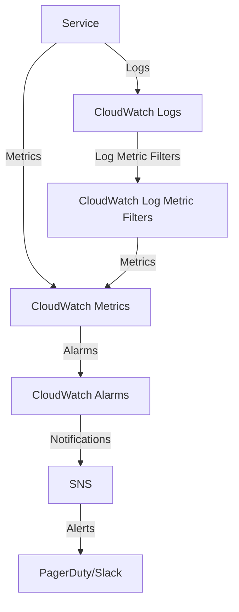

# CloudWatch Monitoring Standards

## Overview and scope

The purpose of this document is to establish the standards and best practices for monitoring AWS services using CloudWatch at Xentic. This standard aims to ensure that all production services are consistently monitored, providing visibility into performance, reliability, and operational health. 

### Audience
This document is intended for:
- Infrastructure Engineers
- DevOps Engineers
- Software Developers
- Site Reliability Engineers (SREs)

### Scope
This standard applies to all production services deployed within the AWS cloud environment at Xentic. It encompasses the configuration of CloudWatch alarms, log metric filters, and dashboards that are mandatory for effective monitoring. 

### Non-goals
- This document does not cover application-level logging or monitoring outside of AWS CloudWatch.
- It does not define incident response procedures or escalation paths.

### Glossary
| Term                     | Definition                                                                 |
|--------------------------|-----------------------------------------------------------------------------|
| CloudWatch                | A monitoring and observability service provided by AWS.                   |
| Alarm                    | A notification mechanism that triggers when a specified condition is met. |
| Metric                   | A quantitative measurement used to track the performance of a service.    |
| Dashboard                | A visual representation of metrics and alarms for monitoring purposes.     |
| SNS                      | Simple Notification Service, used for sending alerts.                     |

### How this standard fits the Xentic platform
This standard is a critical component of the Xentic platform's operational excellence framework. By adhering to these guidelines, teams will ensure that all services are equipped with the necessary monitoring capabilities to detect issues proactively and maintain high availability. 

### Required Alarms (every production service)
Each production service MUST implement the following CloudWatch alarms to monitor error rates and latency:

```hcl
resource "aws_cloudwatch_metric_alarm" "error_rate" {
  alarm_name          = "${var.service}-error-rate"
  comparison_operator = "GreaterThanThreshold"
  evaluation_periods  = 2
  threshold           = 5
  alarm_actions       = [aws_sns_topic.alerts.arn]
}

resource "aws_cloudwatch_metric_alarm" "p99_latency" {
  alarm_name          = "${var.service}-p99-latency"
  comparison_operator = "GreaterThanThreshold"
  evaluation_periods  = 3
  threshold           = 2000   # ms
  extended_statistic  = "p99"
  alarm_actions       = [aws_sns_topic.alerts.arn]
}
```

### Log Metric Filters
Log metric filters MUST be configured to capture error logs for each service:

```hcl
resource "aws_cloudwatch_log_metric_filter" "errors" {
  name    = "${var.service}-error-filter"
  pattern = "{ $.level = \"ERROR\" }"
  metric_transformation {
    name      = "ErrorCount"
    namespace = "Application/${var.service}"
    value     = "1"
  }
}
```

### Dashboard Requirements
Every service MUST have a CloudWatch dashboard that includes the following metrics:
- Request rate
- Error rate
- P50/P95/P99 latency
- ECS CPU/memory utilization
- RDS connections

### Rules
- SNS alerts MUST be configured to send notifications to PagerDuty for production environments and to Slack for all environments.
- Log retention policies MUST be set to 30 days for non-production environments and 90 days for production environments.

## Standards and policies

1. **Monitoring Coverage**: Every production service MUST have comprehensive monitoring coverage through CloudWatch, including metrics, logs, and alarms. This ensures that all critical components are being observed.

2. **Alarm Configuration**: Alarms MUST be configured for all critical metrics, including but not limited to:
   - Error rates
   - Latency (P50, P95, P99)
   - Resource utilization (CPU, memory)
   - Custom application metrics

3. **Naming Conventions**: All CloudWatch resources (alarms, dashboards, log groups) MUST follow the naming convention `com.xentic.<service>.<resource-type>.<description>` to ensure consistency and traceability.

4. **Thresholds**: Alarm thresholds MUST be defined based on historical performance data. Use the following guidelines:
   - Error rate alarms: Thresholds should be based on the 95th percentile of error rates over the last 30 days.
   - Latency alarms: Set thresholds based on the 90th percentile latency observed over the last 30 days.

5. **Log Groups**: Each service MUST create a dedicated CloudWatch log group named `com.xentic.<service>.logs` to store application logs. This helps in isolating logs per service for easier debugging.

6. **Retention Policies**: Log retention policies MUST be enforced as follows:
   - Production logs: Retain for a minimum of 90 days.
   - Non-production logs: Retain for a minimum of 30 days.

7. **Dashboard Visibility**: Dashboards MUST be created for each service, providing a real-time view of key metrics. The dashboard MUST include:
   - A summary of alarms and their states
   - Visualizations for key performance indicators (KPIs)
   - Historical trends for critical metrics

8. **Alerting Mechanisms**: SNS alerts MUST be configured to notify relevant teams via:
   - PagerDuty for production incidents
   - Slack for all environments
   - Email notifications as a fallback

9. **Log Metric Filters**: Log metric filters MUST be established to track specific log patterns, such as:
   - ERROR logs
   - WARN logs
   - Custom application-defined logs

10. **Documentation**: Each service MUST maintain documentation of its monitoring setup, including:
    - Alarm configurations
    - Dashboard definitions
    - Log group structures
    - Any custom metrics being tracked

11. **Testing Alarms**: Alarm configurations MUST be tested periodically to ensure they are functioning as expected. This includes simulating conditions that would trigger the alarms.

12. **Access Control**: IAM policies MUST be configured to restrict access to CloudWatch resources. Only authorized personnel should be able to modify alarm configurations or dashboards.

13. **Cost Management**: Monitoring configurations MUST be reviewed regularly to avoid unnecessary costs. Unused alarms and log groups MUST be removed to optimize resource usage.

14. **Compliance with Xentic Standards**: All monitoring configurations MUST adhere to the overarching Xentic engineering standards, ensuring alignment with company policies and practices.

15. **Incident Response Integration**: Monitoring solutions MUST integrate with incident response workflows to facilitate quick resolution of issues. This includes linking alarms to incident management tools.

16. **Service-Level Objectives (SLOs)**: Each service MUST define SLOs that align with its monitoring metrics. These SLOs MUST be tracked and reported regularly to ensure accountability.

17. **Review Cycle**: Monitoring setups MUST be reviewed at least quarterly to ensure they are up-to-date with current service architecture and performance expectations.

18. **Training and Awareness**: Teams MUST participate in training sessions to stay informed about CloudWatch capabilities and best practices, ensuring effective monitoring implementations.

19. **Version Control**: All CloudWatch configuration files (YAML, HCL, etc.) MUST be stored in version control systems (e.g., Git) to track changes and facilitate collaboration.

20. **Alert Fatigue Prevention**: To minimize alert fatigue, alarms MUST be designed to avoid excessive notifications. Use composite alarms where applicable to reduce noise.

By adhering to these standards and policies, Xentic will ensure a robust monitoring framework that supports operational excellence and service reliability.

## Architecture and design

The architecture for monitoring AWS services using CloudWatch at Xentic involves several key components that work together to ensure effective observability and alerting. The following diagram illustrates the primary components and their interactions:



### Data Flows
- **Service to CloudWatch Logs**: Each service sends logs to its dedicated CloudWatch log group (`com.xentic.<service>.logs`).
- **Service to CloudWatch Metrics**: Services emit custom metrics to CloudWatch, which can be used for monitoring performance.
- **CloudWatch Metrics to Alarms**: Metrics are monitored by CloudWatch alarms, which evaluate conditions based on thresholds defined in the configuration.
- **Alarms to SNS**: When an alarm state changes (e.g., from OK to ALARM), a notification is sent to an SNS topic.
- **SNS to Alerts**: SNS sends alerts to appropriate channels such as PagerDuty for production incidents and Slack for all environments.

### Integration Points
- **CloudWatch Logs**: Integration with AWS Lambda for log processing and transformation.
- **SNS**: Integration with incident management tools (e.g., PagerDuty) for alerting.
- **AWS Lambda**: Optional integration for custom metrics and log processing, allowing for advanced monitoring scenarios.

### Failure Domains
- **CloudWatch Service**: If CloudWatch experiences downtime, all monitoring capabilities are affected. Services must implement fallback logging to local storage to prevent data loss.
- **SNS Notifications**: If SNS fails to deliver notifications, alerts may not reach the on-call team. Teams MUST ensure redundancy in alerting mechanisms, such as email notifications as a fallback.
- **Log Group Retention**: If log retention policies are not correctly configured, critical logs may be lost, impacting troubleshooting efforts. Regular audits of log retention settings are mandatory.

### Configuration Examples
#### CloudWatch Log Group Configuration
```hcl
resource "aws_cloudwatch_log_group" "service_logs" {
  name              = "com.xentic.${var.service}.logs"
  retention_in_days = 90  # Production logs
}
```

#### CloudWatch Metric Configuration
```hcl
resource "aws_cloudwatch_metric_alarm" "high_cpu_usage" {
  alarm_name          = "${var.service}-high-cpu-usage"
  metric_name         = "CPUUtilization"
  namespace           = "AWS/ECS"
  statistic           = "Average"
  period              = 300
  evaluation_periods  = 1
  threshold           = 80
  comparison_operator = "GreaterThanThreshold"
  alarm_actions       = [aws_sns_topic.alerts.arn]
}
```

### Summary of Key Components
| Component                     | Description                                                 |
|-------------------------------|-------------------------------------------------------------|
| CloudWatch Logs                | Store application logs for monitoring and troubleshooting.  |
| CloudWatch Metrics             | Collect performance metrics from services.                  |
| CloudWatch Alarms              | Trigger alerts based on defined thresholds.                 |
| SNS                           | Send notifications to alerting systems.                     |
| PagerDuty/Slack               | Incident management and communication tools.                |
| AWS Lambda                    | Optional integration for processing logs and metrics.       |

By adhering to this architectural design and ensuring proper integration of components, Xentic can maintain a robust monitoring framework that effectively supports operational excellence and service reliability.

## Configuration reference

### application.yml Configuration

The following is an example of the `application.yml` configuration for a service using CloudWatch monitoring:

```yaml
cloudwatch:
  log-group:
    name: com.xentic.<service>.logs
    retention-days: 90  # Production retention policy
  metrics:
    enabled: true
    namespace: com.xentic.<service>
  alarms:
    high-cpu-usage:
      enabled: true
      threshold: 80
      evaluation-periods: 1
      period: 300
      comparison-operator: GreaterThanThreshold
    high-error-rate:
      enabled: true
      threshold: 5
      evaluation-periods: 1
      period: 300
      comparison-operator: GreaterThanThreshold
  sns:
    topic-arn: arn:aws:sns:us-east-1:123456789012:com.xentic.<service>.alerts
```

### Terraform Configuration

The following Terraform configuration snippets illustrate how to set up CloudWatch log groups and alarms:

#### CloudWatch Log Group

```hcl
resource "aws_cloudwatch_log_group" "service_logs" {
  name              = "com.xentic.${var.service}.logs"
  retention_in_days = 90  # Production logs
}
```

#### CloudWatch Alarm for High CPU Usage

```hcl
resource "aws_cloudwatch_metric_alarm" "high_cpu_usage" {
  alarm_name          = "${var.service}-high-cpu-usage"
  metric_name         = "CPUUtilization"
  namespace           = "AWS/ECS"
  statistic           = "Average"
  period              = 300
  evaluation_periods  = 1
  threshold           = 80
  comparison_operator = "GreaterThanThreshold"
  alarm_actions       = [aws_sns_topic.alerts.arn]
}
```

#### CloudWatch Alarm for High Error Rate

```hcl
resource "aws_cloudwatch_metric_alarm" "high_error_rate" {
  alarm_name          = "${var.service}-high-error-rate"
  metric_name         = "ErrorRate"
  namespace           = "AWS/ECS"
  statistic           = "Average"
  period              = 300
  evaluation_periods  = 1
  threshold           = 5
  comparison_operator = "GreaterThanThreshold"
  alarm_actions       = [aws_sns_topic.alerts.arn]
}
```

### Environment Variables Configuration

The following table outlines the recommended environment variables for configuring CloudWatch monitoring:

| Variable Name                     | Default Value                   | Production Value                     |
|-----------------------------------|---------------------------------|--------------------------------------|
| CLOUDWATCH_LOG_GROUP              | com.xentic.<service>.logs      | com.xentic.<service>.logs           |
| CLOUDWATCH_RETENTION_DAYS         | 30                              | 90                                   |
| CLOUDWATCH_METRICS_ENABLED        | false                           | true                                 |
| CLOUDWATCH_SNS_TOPIC_ARN          | N/A                             | arn:aws:sns:us-east-1:123456789012:com.xentic.<service>.alerts |
| CLOUDWATCH_ALARM_HIGH_CPU_THRESHOLD| 70                              | 80                                   |
| CLOUDWATCH_ALARM_HIGH_ERROR_THRESHOLD| 3                             | 5                                    |

### Summary of Configuration Components

- **Log Group**: Each service MUST create a dedicated log group in CloudWatch.
- **Retention Policy**: Log retention MUST be configured based on environment (30 days for non-production, 90 days for production).
- **Metrics**: Custom metrics MUST be enabled to capture service-specific performance data.
- **Alarms**: Alarms MUST be configured for critical metrics, with appropriate thresholds based on historical data.
- **SNS Topic**: An SNS topic MUST be defined to handle notifications for alarms.

By following the configuration standards outlined above, Xentic services will ensure a consistent and effective monitoring setup across all environments.

## Implementation guide

To implement CloudWatch monitoring standards at Xentic, follow the step-by-step guide below. This guide includes code examples for setting up CloudWatch logs, metrics, alarms, and notifications.

### Step 1: Create CloudWatch Log Group

Each service MUST create a dedicated log group in CloudWatch to store application logs. Use the following Terraform configuration:

```hcl
resource "aws_cloudwatch_log_group" "service_logs" {
  name              = "com.xentic.${var.service}.logs"
  retention_in_days = 90  # Production logs
}
```

### Step 2: Configure CloudWatch Metrics

Enable custom metrics for your service to monitor performance. The following example demonstrates how to set up metrics in the `application.yml`:

```yaml
cloudwatch:
  metrics:
    enabled: true
    namespace: com.xentic.<service>
```

### Step 3: Set Up CloudWatch Alarms

Define alarms for critical metrics to trigger notifications when thresholds are breached. Below are examples for high CPU usage and high error rate:

#### High CPU Usage Alarm

```hcl
resource "aws_cloudwatch_metric_alarm" "high_cpu_usage" {
  alarm_name          = "${var.service}-high-cpu-usage"
  metric_name         = "CPUUtilization"
  namespace           = "AWS/ECS"
  statistic           = "Average"
  period              = 300
  evaluation_periods  = 1
  threshold           = 80
  comparison_operator = "GreaterThanThreshold"
  alarm_actions       = [aws_sns_topic.alerts.arn]
}
```

#### High Error Rate Alarm

```hcl
resource "aws_cloudwatch_metric_alarm" "high_error_rate" {
  alarm_name          = "${var.service}-high-error-rate"
  metric_name         = "ErrorRate"
  namespace           = "AWS/ECS"
  statistic           = "Average"
  period              = 300
  evaluation_periods  = 1
  threshold           = 5
  comparison_operator = "GreaterThanThreshold"
  alarm_actions       = [aws_sns_topic.alerts.arn]
}
```

### Step 4: Configure SNS for Notifications

Set up an SNS topic to handle notifications for alarms. Below is an example of the SNS configuration in `application.yml`:

```yaml
cloudwatch:
  sns:
    topic-arn: arn:aws:sns:us-east-1:123456789012:com.xentic.<service>.alerts
```

### Step 5: Implement Logging in Your Service

Ensure that your service logs messages to the CloudWatch log group. Below is a Java example of how to configure logging:

```java
import org.slf4j.Logger;
import org.slf4j.LoggerFactory;

public class MyService {
    private static final Logger logger = LoggerFactory.getLogger(MyService.class);

    public void processRequest() {
        logger.info("Processing request...");
        // Business logic here
        logger.error("An error occurred while processing the request.");
    }
}
```

### Step 6: Validate Configuration

After deploying the configuration, validate that logs are being sent to CloudWatch and that alarms are triggering correctly. Use the AWS Management Console or CLI to check the status of your log groups and alarms.

### Step 7: Monitor and Adjust

Regularly monitor the performance of your service and adjust thresholds for alarms based on historical data and operational needs. Consider the following:

- Review alarm history to identify patterns.
- Adjust thresholds to minimize false positives.
- Ensure that the SNS topic is correctly configured to notify the right teams.

### Summary of Implementation Steps

1. **Create CloudWatch Log Group**: Use Terraform to define a log group for your service.
2. **Enable Metrics**: Configure metrics in `application.yml`.
3. **Set Up Alarms**: Define alarms for critical metrics using Terraform.
4. **Configure SNS**: Set up an SNS topic for alarm notifications.
5. **Implement Logging**: Use logging frameworks to send logs to CloudWatch.
6. **Validate Configuration**: Ensure logs and alarms are functioning as expected.
7. **Monitor and Adjust**: Regularly review and adjust monitoring settings based on service performance.

By following these steps, Xentic will establish a comprehensive CloudWatch monitoring setup that enhances operational visibility and incident response capabilities.

## Security requirements

To ensure the security of CloudWatch monitoring at Xentic, the following security requirements MUST be adhered to:

### Threat Model Summary

- **Data Breach**: Unauthorized access to logs and metrics could expose sensitive information.
- **Denial of Service (DoS)**: Attackers may attempt to flood the monitoring system with excessive logs or metrics.
- **Privilege Escalation**: Misconfigured IAM roles could allow unauthorized access to CloudWatch resources.

### Authentication and Authorization (AuthN/Z)

- Access to CloudWatch resources MUST be restricted using AWS Identity and Access Management (IAM) roles.
- Each service MUST have a dedicated IAM role with the least privilege principle applied. For example:

```json
{
  "Version": "2012-10-17",
  "Statement": [
    {
      "Effect": "Allow",
      "Action": [
        "logs:CreateLogGroup",
        "logs:CreateLogStream",
        "logs:PutLogEvents",
        "cloudwatch:PutMetricData",
        "cloudwatch:DescribeAlarms",
        "cloudwatch:PutMetricAlarm"
      ],
      "Resource": "*"
    }
  ]
}
```

- IAM policies MUST be reviewed regularly to ensure compliance with the principle of least privilege.

### Secrets Management

- Secrets such as AWS access keys and database credentials MUST NOT be hardcoded in the application code.
- Use AWS Secrets Manager or AWS Systems Manager Parameter Store to manage sensitive information securely.
- Example of retrieving a secret from AWS Secrets Manager in Java:

```java
import com.amazonaws.services.secretsmanager.AWSSecretsManager;
import com.amazonaws.services.secretsmanager.AWSSecretsManagerClientBuilder;
import com.amazonaws.services.secretsmanager.model.GetSecretValueRequest;
import com.amazonaws.services.secretsmanager.model.GetSecretValueResult;

public class SecretsManagerUtil {
    public String getSecret(String secretName) {
        AWSSecretsManager client = AWSSecretsManagerClientBuilder.standard().build();
        GetSecretValueRequest request = new GetSecretValueRequest().withSecretId(secretName);
        GetSecretValueResult result = client.getSecretValue(request);
        return result.getSecretString();
    }
}
```

### Input Validation

- All input data must be validated before processing to prevent injection attacks and ensure data integrity.
- Use libraries such as Hibernate Validator or Apache Commons Validator to enforce input validation rules.
- Example of input validation using annotations:

```java
import javax.validation.constraints.NotNull;
import javax.validation.constraints.Size;

public class UserRequest {
    @NotNull
    @Size(min = 1, max = 50)
    private String username;

    // Getters and Setters
}
```

### Audit Logging

- All access to CloudWatch logs and metrics MUST be logged for auditing purposes.
- Enable AWS CloudTrail to monitor API calls made to CloudWatch and other AWS services.
- Regularly review CloudTrail logs to detect unauthorized access or anomalies.
- Example of enabling CloudTrail:

```hcl
resource "aws_cloudtrail" "main" {
  name                          = "cloudtrail-logs"
  s3_bucket_name                = aws_s3_bucket.cloudtrail_bucket.bucket
  include_global_service_events = true
  is_multi_region_trail        = true
  enable_logging               = true
}
```

### Summary of Security Practices

- **IAM Roles**: Each service MUST use dedicated IAM roles with least privilege.
- **Secrets Management**: Secrets MUST be managed using AWS Secrets Manager or Parameter Store.
- **Input Validation**: All inputs MUST be validated using appropriate libraries.
- **Audit Logging**: CloudTrail MUST be enabled to log access to CloudWatch resources.

By implementing these security requirements, Xentic can ensure that its CloudWatch monitoring setup is secure and resilient against potential threats.

## Testing strategy

To ensure the reliability and correctness of the CloudWatch monitoring setup at Xentic, a comprehensive testing strategy MUST be implemented. This strategy encompasses unit tests, integration tests, and contract tests, each with specific coverage targets and examples.

### Unit Tests

Unit tests MUST be written for all components responsible for interacting with CloudWatch. These tests should validate the behavior of individual methods in isolation. A coverage target of at least **80%** for unit tests is recommended.

#### Example Unit Test Class

```java
import static org.mockito.Mockito.*;
import static org.junit.Assert.*;

import org.junit.Before;
import org.junit.Test;

public class CloudWatchServiceTest {
    private CloudWatchService cloudWatchService;
    private CloudWatchClient mockClient;

    @Before
    public void setUp() {
        mockClient = mock(CloudWatchClient.class);
        cloudWatchService = new CloudWatchService(mockClient);
    }

    @Test
    public void testPutMetricData() {
        cloudWatchService.putMetricData("TestMetric", 1.0);
        verify(mockClient).putMetricData(any());
    }

    @Test(expected = IllegalArgumentException.class)
    public void testPutMetricDataWithNullName() {
        cloudWatchService.putMetricData(null, 1.0);
    }
}
```

### Integration Tests

Integration tests MUST cover the interaction between the service and AWS CloudWatch. These tests should validate the end-to-end functionality, ensuring that logs and metrics are correctly sent to CloudWatch. A coverage target of **70%** for integration tests is recommended.

#### Example Integration Test Class

```java
import static org.junit.Assert.*;

import org.junit.Test;

public class CloudWatchIntegrationTest {
    @Test
    public void testCloudWatchLogging() {
        CloudWatchService cloudWatchService = new CloudWatchService();
        cloudWatchService.logToCloudWatch("Integration test log");
        
        // Validate log entry in CloudWatch (mocked or through a test account)
        // This would typically involve checking the presence of the log entry
        assertTrue(cloudWatchService.verifyLogEntry("Integration test log"));
    }
}
```

### Contract Tests

Contract tests MUST ensure that the API contracts between services are adhered to, especially when interacting with CloudWatch APIs. These tests should validate that the requests and responses conform to the expected formats. A coverage target of **100%** for contract tests is mandatory.

#### Example Contract Test Class

```java
import static org.junit.Assert.*;

import org.junit.Test;

public class CloudWatchContractTest {
    @Test
    public void testPutMetricDataContract() {
        CloudWatchService cloudWatchService = new CloudWatchService();
        MetricData metricData = new MetricData("TestMetric", 1.0);
        
        // Simulate the API response
        Response response = cloudWatchService.putMetricData(metricData);
        
        assertEquals(200, response.getStatusCode());
        assertEquals("Success", response.getMessage());
    }
}
```

### Coverage Targets Summary

| Test Type       | Coverage Target |
|------------------|-----------------|
| Unit Tests       | 80%             |
| Integration Tests| 70%             |
| Contract Tests   | 100%            |

### Best Practices

- **Use Mocks**: For unit tests, use mocking frameworks like Mockito to isolate dependencies.
- **Environment Setup**: Ensure that integration tests run in an environment that closely resembles production.
- **Automated Testing**: Implement CI/CD pipelines to automate the execution of tests on each code commit.
- **Test Data Management**: Use dedicated test accounts or environments for integration tests to avoid polluting production data.

By adhering to this testing strategy, Xentic will ensure that its CloudWatch monitoring implementation is robust, reliable, and ready for production use.

## Observability and operations

To achieve comprehensive observability within Xentic's AWS infrastructure, the following components MUST be implemented: metrics, logs, traces, dashboards, alerts, and Service Level Objectives (SLOs). Each component plays a critical role in ensuring that services are running optimally and that any issues can be detected and resolved quickly.

### Metrics

Metrics provide quantitative data about the performance and health of services. Xentic services MUST publish metrics to CloudWatch using the following guidelines:

- **Custom Metrics**: Services MUST define custom metrics relevant to their operations.
- **Standard Metrics**: Utilize AWS standard metrics (e.g., CPU utilization, memory usage) where applicable.

#### Example of Publishing Custom Metrics in Java

```java
import com.amazonaws.services.cloudwatch.AmazonCloudWatch;
import com.amazonaws.services.cloudwatch.AmazonCloudWatchClientBuilder;
import com.amazonaws.services.cloudwatch.model.PutMetricDataRequest;
import com.amazonaws.services.cloudwatch.model.PutMetricDataResult;
import com.amazonaws.services.cloudwatch.model.MetricDatum;

public class MetricsPublisher {
    private final AmazonCloudWatch cloudWatch = AmazonCloudWatchClientBuilder.defaultClient();

    public void publishMetric(String metricName, double value) {
        MetricDatum datum = new MetricDatum()
                .withMetricName(metricName)
                .withValue(value)
                .withUnit("Count");
        
        PutMetricDataRequest request = new PutMetricDataRequest()
                .withNamespace("Xentic/ServiceMetrics")
                .withMetricData(datum);
        
        PutMetricDataResult response = cloudWatch.putMetricData(request);
    }
}
```

### Logs

Logging is essential for understanding application behavior and troubleshooting issues. Xentic services MUST implement structured logging and send logs to CloudWatch Logs.

- **Log Format**: Logs MUST be structured in JSON format for easier parsing.
- **Log Levels**: Use appropriate log levels (INFO, WARN, ERROR) consistently.

#### Example of Structured Logging in Java

```java
import org.slf4j.Logger;
import org.slf4j.LoggerFactory;

public class LogExample {
    private static final Logger logger = LoggerFactory.getLogger(LogExample.class);

    public void processRequest(String requestId) {
        logger.info("Processing request", Map.of("requestId", requestId));
        // Process logic
        logger.error("Error processing request", Map.of("requestId", requestId));
    }
}
```

### Traces

Distributed tracing is critical for identifying performance bottlenecks across microservices. Xentic MUST implement tracing using AWS X-Ray or a compatible tracing solution.

- **Trace Context**: Each service MUST propagate trace context in requests to downstream services.
- **Sampling**: Implement sampling strategies to limit the volume of trace data.

### Dashboards

Dashboards provide a visual representation of metrics and logs. Xentic MUST create CloudWatch dashboards for each service to monitor key performance indicators (KPIs).

#### Example Dashboard Configuration (YAML)

```yaml
Dashboard:
  DashboardName: "Xentic Service Dashboard"
  Widgets:
    - Type: "metric"
      Properties:
        Metrics:
          - "AWS/EC2"
          - "CPUUtilization"
        Title: "EC2 CPU Utilization"
        Period: 300
```

### Alerts

Alerts are crucial for proactive incident management. Xentic MUST configure CloudWatch Alarms to notify the on-call team when metrics exceed defined thresholds.

#### Example Alert Configuration (HCL)

```hcl
resource "aws_cloudwatch_metric_alarm" "high_cpu" {
  alarm_name          = "HighCPUUtilization"
  metric_name         = "CPUUtilization"
  namespace           = "AWS/EC2"
  statistic           = "Average"
  period              = 300
  evaluation_periods  = 1
  threshold           = 80
  comparison_operator = "GreaterThanThreshold"
  alarm_actions       = [aws_sns_topic.alerts.arn]
}
```

### Service Level Objectives (SLOs)

SLOs define the expected level of service performance. Xentic MUST establish SLOs for critical services, which should be monitored and reported regularly.

- **Availability SLO**: Define the percentage of uptime expected (e.g., 99.9%).
- **Performance SLO**: Define response time thresholds for key endpoints.

### On-Call Runbook Steps

In the event of an incident, the on-call team MUST follow these steps:

1. **Identify**: Use CloudWatch dashboards to identify affected services.
2. **Assess**: Check CloudWatch logs for error messages and stack traces.
3. **Notify**: If the issue is critical, notify the relevant stakeholders via the incident management tool.
4. **Mitigate**: Implement a temporary fix if possible, or roll back to a stable version.
5. **Document**: Record the incident details, root cause, and resolution steps in the incident management system.
6. **Review**: Conduct a post-mortem to identify improvements for future incidents.

By adhering to these observability and operations standards, Xentic will ensure that its services are monitored effectively, enabling quick detection and resolution of issues to maintain high service quality.

## Migration and versioning

To maintain a robust and resilient infrastructure at Xentic, the following guidelines MUST be followed regarding migration and versioning of services that interact with AWS CloudWatch.

### Upgrade Paths

- Services MUST have a clearly defined upgrade path for major and minor versions.
- Each upgrade path MUST include:
  - **Changelog**: A comprehensive list of changes, including new features, bug fixes, and breaking changes.
  - **Migration Guide**: Detailed instructions on how to migrate from one version to another.
  
#### Example Changelog Format

```markdown
# Changelog

## [1.2.0] - 2023-10-01
### Added
- New metric: `UserSignUps`
  
### Changed
- Updated logging format to include request IDs.

### Deprecated
- The `logToCloudWatch(String message)` method will be removed in version 1.3.0.
```

### Deprecation Policy

- Features MUST be marked as deprecated at least one version prior to removal.
- Deprecation notices MUST be included in the changelog and the service's documentation.
- Deprecated features MUST remain functional for at least one full release cycle before removal.

### Backward Compatibility

- Services MUST ensure backward compatibility for non-breaking changes.
- If a breaking change is necessary, it MUST be clearly documented, and a migration path MUST be provided.
- The versioning scheme MUST follow [Semantic Versioning](https://semver.org/), where:
  - **Major** version changes indicate breaking changes.
  - **Minor** version changes indicate new features that are backward compatible.
  - **Patch** version changes indicate backward-compatible bug fixes.

### Rollback Procedures

In the event of a failed deployment or migration, the following rollback procedures MUST be in place:

1. **Version Control**: All service versions MUST be tagged in the version control system (e.g., Git).
2. **Backup Configuration**: Configuration files MUST be backed up prior to deployment.
3. **Rollback Steps**:
   - Identify the last stable version.
   - Revert to the last stable version using the version control system.
   - Restore the previous configuration from backup.
   - Redeploy the service.

#### Example Rollback Command

```bash
# Rollback to the last stable version
git checkout tags/v1.1.0
```

### Migration Example

When migrating from version 1.1.0 to 1.2.0, follow these steps:

1. **Review the Changelog**: Understand the new features and breaking changes.
2. **Update Dependencies**: Modify the `pom.xml` or `build.gradle` to use the new version.
3. **Run Migration Scripts**: If applicable, execute any database migration scripts.
4. **Test**: Run all unit, integration, and contract tests to ensure compatibility.
5. **Deploy**: Deploy the updated service to a staging environment for further testing.
6. **Monitor**: After deployment, monitor CloudWatch metrics and logs for any anomalies.

### Migration Example Configuration (YAML)

```yaml
version: "1.2.0"
dependencies:
  - name: "com.xentic.auth:auth-starter"
    version: "2.0.0"
  - name: "com.xentic.common:common-utils"
    version: "1.1.0"
```

By following these migration and versioning standards, Xentic will ensure that its services remain stable, maintainable, and compatible with AWS CloudWatch, while minimizing disruptions during upgrades.

## FAQ, anti-patterns, and checklists

### Frequently Asked Questions (FAQ)

1. **What metrics should I monitor?**
   - Services MUST monitor both custom and standard metrics relevant to their operations.

2. **How do I publish custom metrics?**
   - Use the provided Java example to publish metrics to CloudWatch.

3. **What log format should I use?**
   - Logs MUST be structured in JSON format for easier parsing.

4. **How can I ensure my service is traceable?**
   - Implement distributed tracing using AWS X-Ray and propagate trace context in requests.

5. **What is the purpose of CloudWatch dashboards?**
   - Dashboards provide a visual representation of metrics and logs for monitoring key performance indicators (KPIs).

6. **How do I set up alerts?**
   - Configure CloudWatch Alarms to notify the on-call team when metrics exceed defined thresholds.

7. **What should I include in my service level objectives (SLOs)?**
   - SLOs MUST define expected availability and performance metrics for critical services.

8. **What steps should I take during an incident?**
   - Follow the on-call runbook steps outlined in the document for effective incident management.

9. **How do I handle deprecations in my service?**
   - Mark features as deprecated at least one version prior to removal, and document the changes in the changelog.

10. **What is the rollback procedure if a deployment fails?**
    - Use version control to revert to the last stable version and restore previous configurations from backup.

### Anti-Patterns

| Anti-Pattern                     | Description                                                                                  |
|----------------------------------|----------------------------------------------------------------------------------------------|
| Hardcoding Metrics                | Services MUST NOT hardcode metric names or values; use constants or configuration files instead. |
| Ignoring Logs                    | Services MUST NOT ignore log entries; all logs should be reviewed during incidents.         |
| Lack of Alerts                   | Services MUST NOT operate without alerts; proactive monitoring is essential for incident management. |
| Inconsistent Logging Levels      | Services MUST NOT use inconsistent log levels; maintain uniformity across the application.  |
| Not Using CloudWatch Dashboards  | Services MUST NOT skip creating dashboards; visual monitoring is crucial for performance assessment. |
| Overloading Metrics               | Services MUST NOT publish excessive metrics; focus on relevant metrics to avoid noise.      |

### Pre-Merge Checklist

- [ ] Code adheres to Xentic's coding standards.
- [ ] Custom metrics are defined and implemented.
- [ ] Structured logging is in place.
- [ ] Distributed tracing is implemented.
- [ ] CloudWatch dashboards are created and updated.
- [ ] Alerts are configured for key metrics.
- [ ] SLOs are documented and reviewed.
- [ ] All tests (unit, integration, contract) pass successfully.
- [ ] Changelog is updated with relevant changes.

### Production Checklist

- [ ] Ensure all configurations are backed up before deployment.
- [ ] Review CloudWatch metrics and logs for anomalies.
- [ ] Monitor the deployment process for errors.
- [ ] Validate that all services are functioning as expected post-deployment.
- [ ] Confirm that alerts are operational and notify the on-call team.
- [ ] Document any issues encountered during deployment in the incident management system.
- [ ] Conduct a post-deployment review to identify areas for improvement.
