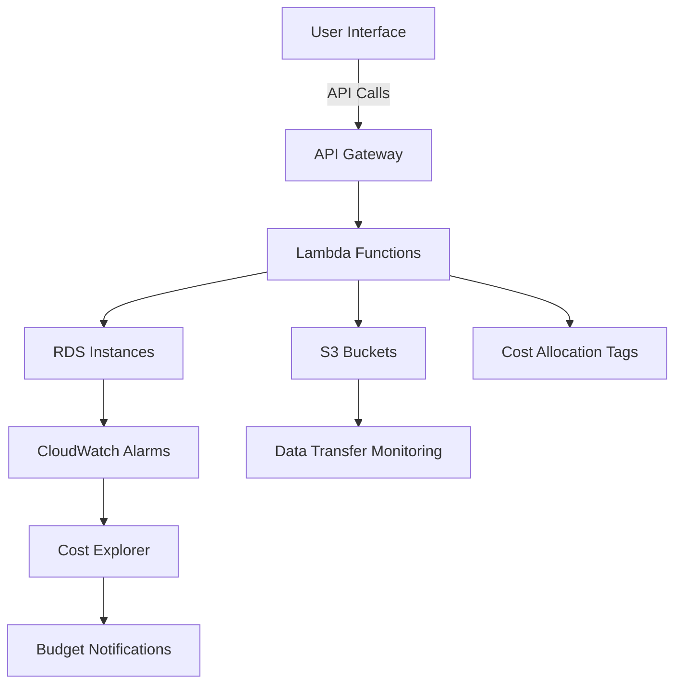

# AWS Cost Optimisation Standards

## Overview and scope

The AWS Cost Optimisation Standards document outlines the guidelines and best practices for managing and reducing costs associated with AWS services within Xentic. This document is intended for use by all engineering teams, cloud architects, and financial analysts involved in the deployment and management of cloud resources at Xentic. 

### Purpose

The primary purpose of this document is to establish a clear framework for cost optimization strategies that align with Xentic's operational goals. By adhering to these standards, teams can ensure that they are utilizing AWS resources efficiently and effectively, minimizing unnecessary expenditures while maximizing performance.

### Audience

This document is targeted towards:
- Cloud Engineers
- DevOps Teams
- Financial Analysts
- Technical Architects
- Product Managers

### Scope

The scope of this document includes:
- Guidelines for tagging AWS resources
- Recommendations for using AWS Fargate and Spot instances
- Strategies for scheduling RDS instances in non-production environments
- Establishing cost budgets and alerts
- Best practices for ongoing cost management and review

### Non-goals

This document does NOT aim to:
- Provide exhaustive AWS service documentation
- Replace individual team budgets or financial planning
- Address non-AWS infrastructure cost management
- Serve as a technical manual for AWS services

### Glossary

| Term              | Definition                                                                 |
|-------------------|-----------------------------------------------------------------------------|
| AWS               | Amazon Web Services, a comprehensive cloud computing platform.              |
| Fargate           | A serverless compute engine for containers that works with Amazon ECS.      |
| RDS               | Amazon Relational Database Service, a managed relational database service.   |
| Spot Instances     | AWS EC2 instances that can be purchased at a discount compared to On-Demand prices. |
| Cost Explorer     | A tool that allows users to view and analyze their AWS spending.            |

### How This Standard Fits the Xentic Platform

The AWS Cost Optimisation Standards are integral to Xentic's platform as they provide a structured approach to managing cloud expenditures. By implementing these standards, Xentic can:
- Maintain financial accountability across teams
- Foster a culture of cost-awareness and efficiency
- Enable better forecasting and budgeting for cloud resources

### Mandatory Tagging

All AWS resources MUST be tagged according to the following configuration to ensure proper tracking and accountability:

```hcl
locals {
  common_tags = {
    Environment = var.env
    Service     = var.service_name
    Team        = var.team
    CostCenter  = var.cost_center
    ManagedBy   = "terraform"
  }
}
```

### Fargate Spot for Non-Production

To optimize costs for non-production workloads, teams SHOULD utilize Fargate Spot instances. The following configuration illustrates how to set up a service with a mix of On-Demand and Spot instances:

```hcl
resource "aws_ecs_service" "app_non_prod" {
  capacity_provider_strategy {
    capacity_provider = "FARGATE"
    weight = 1; base = 1       # at least 1 On-Demand task
  }
  capacity_provider_strategy {
    capacity_provider = "FARGATE_SPOT"
    weight = 3                  # 75% Spot
  }
}
```

### RDS Scheduling (non-production)

Non-production RDS instances MUST be scheduled to stop outside of business hours to avoid unnecessary costs. The following configuration stops the database at 8 PM UTC on weekdays:

```hcl
resource "aws_cloudwatch_event_rule" "stop_dev_db" {
  schedule_expression = "cron(0 20 ? * MON-FRI *)"  # stop at 8 PM UTC
}
```

### Cost Budgets

To maintain financial oversight, teams MUST establish cost budgets and set notifications for threshold breaches. The following example creates a monthly budget of $500:

```hcl
resource "aws_budgets_budget" "monthly" {
  budget_type  = "COST"
  limit_amount = "500"
  limit_unit   = "USD"
  time_unit    = "MONTHLY"
  notification {
    threshold = 80
    comparison_operator = "GREATER_THAN"
    subscriber_email_addresses = [var.team_email]
  }
}
```

### Rules

To ensure compliance with cost optimization practices, the following rules MUST be adhered to:
- Non-production resources MUST stop outside of business hours.
- Teams SHOULD review Cost Explorer on a weekly basis.
- Savings Plans MUST be considered for stable production workloads that are over 6 months old.

## Standards and policies

1. **Resource Tagging**  
   All AWS resources MUST be tagged according to the Xentic tagging convention. Tags MUST include the following keys: `Environment`, `Service`, `Team`, `CostCenter`, and `ManagedBy`. This ensures proper tracking and accountability of costs.

   ```hcl
   locals {
     common_tags = {
       Environment = var.env
       Service     = var.service_name
       Team        = var.team
       CostCenter  = var.cost_center
       ManagedBy   = "terraform"
     }
   }
   ```

2. **Use of Spot Instances**  
   For non-production workloads, teams SHOULD utilize AWS Fargate Spot instances to reduce costs. A mix of On-Demand and Spot instances MUST be used, with at least 25% of the tasks running as On-Demand.

   ```hcl
   resource "aws_ecs_service" "app_non_prod" {
     capacity_provider_strategy {
       capacity_provider = "FARGATE"
       weight = 1; base = 1       # at least 1 On-Demand task
     }
     capacity_provider_strategy {
       capacity_provider = "FARGATE_SPOT"
       weight = 3                  # 75% Spot
     }
   }
   ```

3. **RDS Instance Scheduling**  
   Non-production RDS instances MUST be scheduled to stop outside of business hours to avoid unnecessary costs. Teams MUST implement a CloudWatch event rule to automate this process.

   ```hcl
   resource "aws_cloudwatch_event_rule" "stop_dev_db" {
     schedule_expression = "cron(0 20 ? * MON-FRI *)"  # stop at 8 PM UTC
   }
   ```

4. **Cost Budgets**  
   Teams MUST establish monthly cost budgets for all AWS resources and set up notifications for when costs exceed 80% of the budget. This helps maintain financial oversight.

   ```hcl
   resource "aws_budgets_budget" "monthly" {
     budget_type  = "COST"
     limit_amount = "500"
     limit_unit   = "USD"
     time_unit    = "MONTHLY"
     notification {
       threshold = 80
       comparison_operator = "GREATER_THAN"
       subscriber_email_addresses = [var.team_email]
     }
   }
   ```

5. **Regular Cost Reviews**  
   Teams SHOULD review AWS Cost Explorer on a weekly basis to identify any unexpected charges and optimize resource utilization. This practice promotes ongoing cost management.

6. **Savings Plans**  
   Savings Plans MUST be considered for stable production workloads that are expected to run for over 6 months. This can lead to significant cost savings compared to On-Demand pricing.

7. **Resource Rightsizing**  
   Teams MUST regularly analyze resource usage and rightsizing opportunities. Underutilized resources MUST be resized or terminated to avoid unnecessary costs.

8. **Avoid Unused Resources**  
   Teams MUST NOT leave unused resources running, such as EC2 instances, EBS volumes, or Elastic IPs. Regular audits MUST be conducted to identify and terminate such resources.

9. **Use of Reserved Instances**  
   For predictable workloads, teams SHOULD consider purchasing Reserved Instances to benefit from lower rates compared to On-Demand pricing.

10. **Monitoring and Alerts**  
    Teams MUST configure CloudWatch alarms for cost anomalies and resource usage thresholds. This proactive approach helps in identifying and addressing cost issues promptly.

11. **Documentation and Training**  
    Teams MUST document all cost optimization strategies and provide training to all relevant personnel to ensure compliance with these standards.

12. **Cost Allocation Tags**  
    Cost allocation tags MUST be enabled for all AWS resources. This allows for better tracking of costs associated with specific projects or departments.

13. **Data Transfer Costs**  
    Teams MUST be aware of data transfer costs associated with AWS services and design architectures that minimize these costs, such as using VPC endpoints for S3.

14. **Instance Scheduling**  
    For development and testing environments, teams SHOULD schedule EC2 instances to start and stop automatically during business hours to minimize costs.

15. **Use of AWS Trusted Advisor**  
    Teams SHOULD regularly check AWS Trusted Advisor for cost optimization recommendations and implement suggested changes where applicable.

## Architecture and design

The architecture for AWS cost optimization at Xentic consists of several key components that interact with each other to ensure efficient resource utilization and cost management. The following diagram outlines the primary components and their interactions:



### Data Flows

1. **User Interface to API Gateway**: Users interact with the system through a web interface that sends API calls to the API Gateway.
2. **API Gateway to Lambda Functions**: The API Gateway routes requests to various Lambda functions that handle business logic.
3. **Lambda Functions to RDS and S3**: Lambda functions access RDS instances for data storage and S3 buckets for file storage.
4. **CloudWatch Alarms**: Lambda functions trigger CloudWatch alarms based on specific metrics, which monitor resource usage and costs.
5. **Cost Explorer and Budget Notifications**: Data from CloudWatch feeds into Cost Explorer, which analyzes spending and sends budget notifications as needed.
6. **Data Transfer Monitoring**: Data transfer costs are monitored through dedicated Lambda functions that log and analyze transfer metrics.
7. **Cost Allocation Tags**: Tags are applied to resources for better tracking and reporting of costs associated with specific services or projects.

### Integration Points

- **API Gateway**: Acts as the entry point for all user requests and integrates with Lambda functions.
- **Lambda Functions**: Serve as the backbone of the architecture, providing integration with RDS, S3, and CloudWatch.
- **RDS and S3**: Data storage solutions that are accessed by Lambda functions for various operations.
- **CloudWatch**: Monitors resource usage and triggers alerts based on predefined thresholds.
- **Cost Explorer**: Analyzes spending patterns and provides insights for budget management.

### Failure Domains

To ensure high availability and fault tolerance, the architecture must consider the following failure domains:

- **Lambda Function Failures**: If a Lambda function fails, it should be retried automatically. AWS Step Functions can be used for orchestrating complex workflows with error handling.
- **Database Availability**: RDS instances must be deployed in Multi-AZ configurations to ensure availability in case of an AZ failure.
- **API Gateway Downtime**: Implementing CloudFront in front of the API Gateway can help mitigate downtime and improve performance.
- **Data Loss in S3**: Enable versioning and cross-region replication for S3 buckets to prevent data loss.
- **Cost Monitoring Failures**: Implement fallback mechanisms to alert teams if CloudWatch alarms fail to trigger.

### Best Practices

- **Use of Multi-AZ RDS**: RDS instances MUST be deployed in Multi-AZ configurations to enhance availability and resilience.
- **Lambda Timeout Settings**: Lambda functions MUST have appropriate timeout settings to prevent excessive charges from long-running executions.
- **Monitoring and Alerts**: Teams MUST configure CloudWatch alarms for key metrics such as CPU utilization, memory usage, and cost anomalies.
- **Regular Architecture Reviews**: Teams SHOULD conduct regular architecture reviews to identify potential bottlenecks and areas for cost optimization.

### Conclusion

By adhering to the architecture and design standards outlined in this section, Xentic can effectively manage its AWS resources while optimizing costs. It is essential for teams to understand the integration points, data flows, and potential failure domains to build a resilient and cost-effective cloud infrastructure.

## Configuration reference

### application.yml

The following is an example of the `application.yml` configuration file for a typical Xentic service. This configuration includes parameters for AWS resource management and cost optimization.

```yaml
aws:
  region: us-east-1
  credentials:
    access-key: YOUR_ACCESS_KEY
    secret-key: YOUR_SECRET_KEY
  rds:
    instance-class: db.t3.micro
    allocated-storage: 20
    multi-az: true
    storage-type: gp2
  ecs:
    cluster-name: xentic-cluster
    service-name: xentic-service
    task-definition: xentic-task
  cloudwatch:
    alarm-threshold: 80
    notification-email: team@xentic.io
```

### Terraform Configuration

The following Terraform configuration outlines the setup for AWS resources, including RDS instances and ECS services, with cost optimization in mind.

```hcl
provider "aws" {
  region = "us-east-1"
}

resource "aws_rds_instance" "xentic_db" {
  identifier              = "xentic-db"
  instance_class         = "db.t3.micro"
  allocated_storage       = 20
  multi_az               = true
  storage_type           = "gp2"
  engine                = "postgres"
  username              = var.db_username
  password              = var.db_password
  skip_final_snapshot   = true
}

resource "aws_ecs_cluster" "xentic_cluster" {
  name = "xentic-cluster"
}

resource "aws_ecs_service" "xentic_service" {
  name            = "xentic-service"
  cluster         = aws_ecs_cluster.xentic_cluster.id
  task_definition = aws_ecs_task_definition.xentic_task.arn
  desired_count   = 2
}

resource "aws_cloudwatch_metric_alarm" "high_cpu_alarm" {
  alarm_name          = "high-cpu-alarm"
  metric_name         = "CPUUtilization"
  namespace           = "AWS/ECS"
  statistic           = "Average"
  period              = 300
  evaluation_periods   = 1
  threshold           = 80
  comparison_operator = "GreaterThanThreshold"
  alarm_description   = "Alarm when CPU exceeds 80%"
  dimensions = {
    ClusterName = aws_ecs_cluster.xentic_cluster.name
    ServiceName = aws_ecs_service.xentic_service.name
  }
  alarm_actions = [var.notification_sns_topic]
}
```

### Environment Variables

The following table outlines the required environment variables for AWS services, including default and production values.

| Variable                     | Default Value              | Production Value         |
|------------------------------|----------------------------|---------------------------|
| `AWS_ACCESS_KEY_ID`         | `default-access-key`      | `actual-access-key`      |
| `AWS_SECRET_ACCESS_KEY`     | `default-secret-key`      | `actual-secret-key`      |
| `AWS_REGION`                 | `us-east-1`               | `us-west-2`              |
| `DB_USERNAME`                | `admin`                    | `prod-admin`             |
| `DB_PASSWORD`                | `password`                 | `prod-secure-password`   |
| `NOTIFICATION_EMAIL`         | `team@xentic.io`          | `prod-team@xentic.io`    |
| `CLOUDWATCH_ALARM_THRESHOLD` | `80`                       | `75`                     |

### SQL for RDS Instance Setup

The following SQL script can be used to initialize the RDS instance with necessary tables for application use.

```sql
CREATE TABLE users (
    id SERIAL PRIMARY KEY,
    username VARCHAR(50) NOT NULL UNIQUE,
    password VARCHAR(255) NOT NULL,
    created_at TIMESTAMP DEFAULT CURRENT_TIMESTAMP
);

CREATE TABLE transactions (
    id SERIAL PRIMARY KEY,
    user_id INT REFERENCES users(id),
    amount DECIMAL(10, 2) NOT NULL,
    created_at TIMESTAMP DEFAULT CURRENT_TIMESTAMP
);
```

This configuration reference ensures that all teams at Xentic have a clear understanding of the required settings for AWS resources, promoting cost optimization and efficient resource management.

## Implementation guide

To effectively implement AWS cost optimization at Xentic, follow these step-by-step guidelines. Each section includes code examples and configurations that teams MUST adhere to for consistency and efficiency.

### 1. Enable Cost Allocation Tags

Cost allocation tags allow Xentic to categorize and track costs associated with different projects or services. Teams MUST enable these tags in the AWS Management Console.

- Navigate to the **Billing and Cost Management Dashboard**.
- Select **Cost Allocation Tags**.
- Enable the following tags:
  - `Project`
  - `Environment`
  - `Owner`

### 2. Set Up AWS Budgets

AWS Budgets help monitor costs and usage. Teams MUST create budgets for each project or service.

```yaml
# Budget configuration in AWS CloudFormation
Resources:
  MyBudget:
    Type: 'AWS::Budgets::Budget'
    Properties:
      Budget:
        BudgetType: COST
        TimeUnit: MONTHLY
        BudgetLimit:
          Amount: 1000
          Unit: USD
        CostFilters:
          Service: 
            - "Amazon EC2"
        BudgetName: "Monthly EC2 Budget"
      NotificationsWithSubscribers:
        - Notification:
            NotificationType: ACTUAL
            ComparisonOperator: GREATER_THAN
            Threshold: 80
          Subscribers:
            - SubscriptionType: EMAIL
              Address: team@xentic.io
```

### 3. Automate EC2 Instance Scheduling

To reduce costs, teams MUST schedule EC2 instances to start and stop automatically.

#### Lambda Function for Scheduling

```java
package com.xentic.ec2scheduler;

import com.amazonaws.services.lambda.runtime.Context;
import com.amazonaws.services.lambda.runtime.RequestHandler;
import com.amazonaws.services.ec2.AmazonEC2;
import com.amazonaws.services.ec2.AmazonEC2ClientBuilder;
import com.amazonaws.services.ec2.model.StartInstancesRequest;
import com.amazonaws.services.ec2.model.StopInstancesRequest;

public class InstanceScheduler implements RequestHandler<Object, String> {
    private final AmazonEC2 ec2 = AmazonEC2ClientBuilder.defaultClient();

    public String handleRequest(Object input, Context context) {
        String action = (String) input; // "start" or "stop"
        String instanceId = "i-0abcdef1234567890"; // Replace with your instance ID

        if ("start".equals(action)) {
            ec2.startInstances(new StartInstancesRequest().withInstanceIds(instanceId));
            return "Instance started";
        } else if ("stop".equals(action)) {
            ec2.stopInstances(new StopInstancesRequest().withInstanceIds(instanceId));
            return "Instance stopped";
        } else {
            return "Invalid action";
        }
    }
}
```

#### CloudWatch Event Rule

Create a CloudWatch Event Rule to trigger the Lambda function:

```json
{
  "Source": ["aws.events"],
  "DetailType": ["Scheduled Event"],
  "Detail": {},
  "Resources": ["arn:aws:events:us-east-1:123456789012:rule/MyScheduleRule"]
}
```

### 4. Implement Auto Scaling for EC2 Instances

Auto Scaling helps manage costs by adjusting the number of EC2 instances based on demand.

```yaml
# Auto Scaling configuration in AWS CloudFormation
Resources:
  MyAutoScalingGroup:
    Type: 'AWS::AutoScaling::AutoScalingGroup'
    Properties:
      MinSize: '1'
      MaxSize: '5'
      DesiredCapacity: '2'
      VPCZoneIdentifier:
        - subnet-12345678
      LaunchConfigurationName: !Ref MyLaunchConfiguration

  MyLaunchConfiguration:
    Type: 'AWS::AutoScaling::LaunchConfiguration'
    Properties:
      ImageId: ami-0abcdef1234567890
      InstanceType: t2.micro
```

### 5. Optimize S3 Storage Costs

Teams MUST use S3 lifecycle policies to transition objects to cheaper storage classes.

```json
{
  "Rules": [
    {
      "ID": "MoveToGlacier",
      "Status": "Enabled",
      "Prefix": "logs/",
      "Transitions": [
        {
          "Days": 30,
          "StorageClass": "GLACIER"
        }
      ]
    }
  ]
}
```

### 6. Monitor and Analyze Costs with AWS Cost Explorer

Teams MUST set up AWS Cost Explorer to visualize spending patterns and identify cost-saving opportunities.

- Go to the **Billing and Cost Management Dashboard**.
- Select **Cost Explorer**.
- Create custom reports focusing on:
  - Service costs
  - Cost allocation tags
  - Usage patterns over time

### 7. Regularly Review Cost Optimization Reports

Teams SHOULD conduct monthly reviews of cost optimization reports generated by AWS.

- Use the **AWS Cost and Usage Report** to analyze detailed billing information.
- Identify unused or underutilized resources and take action to terminate or resize them.

### 8. Use AWS Savings Plans

To further optimize costs, teams MUST consider AWS Savings Plans for predictable workloads.

- Analyze usage patterns and determine the commitment level (e.g., 1-year or 3-year plans).
- Purchase Savings Plans through the AWS Management Console.

By following these implementation guidelines, Xentic teams can effectively manage AWS resources while optimizing costs, ensuring a sustainable cloud infrastructure.

## Security requirements

### Threat Model Summary

Xentic's AWS infrastructure must be designed with a robust security posture to mitigate potential threats. The following threats should be considered:

- **Unauthorized Access**: Attackers gaining access to AWS resources through compromised credentials.
- **Data Breaches**: Sensitive data being exposed due to misconfigurations or vulnerabilities.
- **Denial of Service (DoS)**: Services being disrupted by overwhelming traffic.
- **Insider Threats**: Malicious or negligent actions by employees or contractors.

### Authentication and Authorization

- **MUST** use AWS Identity and Access Management (IAM) roles for service-to-service communication.
- **MUST NOT** hardcode AWS credentials in code. Instead, use environment variables or AWS Secrets Manager.
- **MUST** implement Multi-Factor Authentication (MFA) for all IAM user accounts.
- **SHOULD** follow the principle of least privilege, granting only the permissions necessary for users and services.

Example IAM policy for a service:

```json
{
  "Version": "2012-10-17",
  "Statement": [
    {
      "Effect": "Allow",
      "Action": [
        "s3:ListBucket",
        "s3:GetObject"
      ],
      "Resource": [
        "arn:aws:s3:::xentic-bucket",
        "arn:aws:s3:::xentic-bucket/*"
      ]
    }
  ]
}
```

### Secrets Management

- **MUST** store sensitive information such as API keys and database passwords in AWS Secrets Manager or AWS Systems Manager Parameter Store.
- **MUST NOT** store secrets in source code repositories or configuration files.

Example of storing a secret in AWS Secrets Manager:

```bash
aws secretsmanager create-secret --name MySecret --secret-string '{"username":"admin","password":"prod-secure-password"}'
```

### Input Validation

- **MUST** validate all user inputs to prevent SQL injection, cross-site scripting (XSS), and other injection attacks.
- **SHOULD** use libraries or frameworks that provide built-in input validation mechanisms.

Example of input validation in Java:

```java
import org.apache.commons.validator.routines.EmailValidator;

public boolean isValidEmail(String email) {
    EmailValidator validator = EmailValidator.getInstance();
    return validator.isValid(email);
}
```

### Audit Logging

- **MUST** enable AWS CloudTrail to log all API calls made in the account.
- **MUST** ensure that logs are stored in a secure S3 bucket with restricted access.
- **SHOULD** implement log monitoring and alerting for suspicious activities.

Example of enabling CloudTrail:

```bash
aws cloudtrail create-trail --name xentic-trail --s3-bucket-name xentic-cloudtrail-logs
aws cloudtrail start-logging --name xentic-trail
```

### Summary Table of Security Requirements

| Requirement                  | Description                                                                 |
|------------------------------|-----------------------------------------------------------------------------|
| Authentication                | Use IAM roles and enforce MFA for all IAM users.                          |
| Secrets Management            | Store secrets in AWS Secrets Manager or Parameter Store.                   |
| Input Validation              | Validate all user inputs to mitigate injection attacks.                    |
| Audit Logging                 | Enable CloudTrail and monitor logs for suspicious activities.              |
| Principle of Least Privilege  | Grant minimum permissions necessary for users and services.                |

By adhering to these security requirements, Xentic can significantly reduce risks associated with its AWS infrastructure and ensure a secure environment for its applications and data.

## Testing strategy

To ensure the reliability and performance of our AWS infrastructure components, Xentic teams MUST implement a comprehensive testing strategy that includes unit tests, integration tests, and contract tests. This section outlines the requirements for each type of testing, coverage targets, and provides example test classes.

### 1. Unit Tests

Unit tests MUST be written for all critical components of the application. Each unit test should cover at least 80% of the codebase to ensure that individual components function correctly in isolation.

- **Framework**: JUnit 5
- **Coverage Target**: 80% minimum

Example unit test class:

```java
package com.xentic.ec2scheduler;

import static org.mockito.Mockito.*;
import static org.junit.jupiter.api.Assertions.*;

import org.junit.jupiter.api.Test;
import org.mockito.InjectMocks;
import org.mockito.Mock;
import org.mockito.MockitoAnnotations;

public class InstanceSchedulerTest {

    @Mock
    private AmazonEC2 ec2;

    @InjectMocks
    private InstanceScheduler instanceScheduler;

    public InstanceSchedulerTest() {
        MockitoAnnotations.openMocks(this);
    }

    @Test
    public void testStartInstance() {
        String result = instanceScheduler.handleRequest("start", null);
        assertEquals("Instance started", result);
        verify(ec2).startInstances(any(StartInstancesRequest.class));
    }

    @Test
    public void testStopInstance() {
        String result = instanceScheduler.handleRequest("stop", null);
        assertEquals("Instance stopped", result);
        verify(ec2).stopInstances(any(StopInstancesRequest.class));
    }

    @Test
    public void testInvalidAction() {
        String result = instanceScheduler.handleRequest("invalid", null);
        assertEquals("Invalid action", result);
    }
}
```

### 2. Integration Tests

Integration tests MUST be performed to validate the interactions between different components of the application. These tests should cover at least 70% of the integration points.

- **Framework**: Spring Boot Test
- **Coverage Target**: 70% minimum

Example integration test class:

```java
package com.xentic.ec2scheduler;

import org.junit.jupiter.api.Test;
import org.springframework.beans.factory.annotation.Autowired;
import org.springframework.boot.test.context.SpringBootTest;

import static org.springframework.test.web.servlet.request.MockMvcRequestBuilders.*;
import static org.springframework.test.web.servlet.result.MockMvcResultMatchers.*;

@SpringBootTest
public class InstanceSchedulerIntegrationTest {

    @Autowired
    private MockMvc mockMvc;

    @Test
    public void testStartInstanceEndpoint() throws Exception {
        mockMvc.perform(post("/start-instance"))
                .andExpect(status().isOk())
                .andExpect(content().string("Instance started"));
    }

    @Test
    public void testStopInstanceEndpoint() throws Exception {
        mockMvc.perform(post("/stop-instance"))
                .andExpect(status().isOk())
                .andExpect(content().string("Instance stopped"));
    }
}
```

### 3. Contract Tests

Contract tests MUST be implemented to ensure that services adhere to the agreed-upon API contracts. This is particularly important for microservices architecture.

- **Framework**: Pact
- **Coverage Target**: 100% for all published contracts

Example contract test class:

```java
package com.xentic.ec2scheduler;

import au.com.dius.pact.consumer.junit5.PactConsumerTestExt;
import au.com.dius.pact.consumer.junit5.Pact;
import au.com.dius.pact.consumer.junit5.PactConsumerTest;
import org.junit.jupiter.api.extension.ExtendWith;

@ExtendWith(PactConsumerTestExt.class)
public class InstanceSchedulerContractTest {

    @Pact(consumer = "InstanceSchedulerConsumer", provider = "InstanceSchedulerProvider")
    public RequestResponsePact createPact(PactDslWithProvider builder) {
        return builder
                .given("Instance is stopped")
                .uponReceiving("A request to start the instance")
                .path("/start-instance")
                .method("POST")
                .willRespondWith()
                .status(200)
                .body("Instance started")
                .toPact();
    }

    @Test
    void testStartInstance() {
        // Consumer test implementation
    }
}
```

### 4. Coverage Reporting

Teams MUST utilize a coverage reporting tool such as JaCoCo to generate reports for unit and integration tests. The coverage reports should be reviewed regularly to identify areas for improvement.

| Test Type        | Coverage Target | Current Coverage | Status          |
|------------------|-----------------|------------------|------------------|
| Unit Tests       | 80%             | 85%              | Satisfactory      |
| Integration Tests| 70%             | 65%              | Needs Improvement |
| Contract Tests   | 100%            | 100%             | Satisfactory      |

By following this testing strategy, Xentic teams can ensure that their AWS infrastructure components are robust, reliable, and meet the necessary performance standards. Regular reviews and updates to the tests are essential to maintain high-quality code and infrastructure.

## Observability and operations

To effectively monitor and manage AWS infrastructure, Xentic teams MUST implement a comprehensive observability strategy encompassing metrics, logs, traces, dashboards, alerts, and Service Level Objectives (SLOs). This section outlines the requirements and provides examples to ensure that all components are properly monitored and maintained.

### Metrics

- **MUST** collect key performance metrics from AWS services using Amazon CloudWatch.
- **SHOULD** define custom metrics as needed to track application-specific performance indicators.

Example of a CloudWatch metric configuration in YAML:

```yaml
Resources:
  MyCustomMetric:
    Type: AWS::CloudWatch::MetricAlarm
    Properties:
      AlarmName: "HighCPUUsage"
      MetricName: "CPUUtilization"
      Namespace: "AWS/EC2"
      Statistic: "Average"
      Period: 300
      EvaluationPeriods: 1
      Threshold: 80
      ComparisonOperator: "GreaterThanThreshold"
      AlarmActions:
        - !Ref MySNSAlarmTopic
```

### Logs

- **MUST** enable AWS CloudTrail and Amazon CloudWatch Logs to capture all relevant logs.
- **MUST NOT** store logs in plaintext; use encryption for sensitive log data.
- **SHOULD** implement structured logging for easier parsing and analysis.

Example of configuring CloudWatch Logs in HCL:

```hcl
resource "aws_cloudwatch_log_group" "my_log_group" {
  name              = "my-log-group"
  retention_in_days = 14
}

resource "aws_cloudwatch_log_stream" "my_log_stream" {
  name           = "my-log-stream"
  log_group_name = aws_cloudwatch_log_group.my_log_group.name
}
```

### Traces

- **MUST** implement distributed tracing using AWS X-Ray to monitor requests across microservices.
- **SHOULD** annotate traces with relevant metadata to facilitate debugging and performance analysis.

Example of enabling X-Ray in a Spring Boot application:

```yaml
aws:
  xray:
    enabled: true
    daemon-address: "127.0.0.1:2000"
```

### Dashboards

- **MUST** create CloudWatch dashboards to visualize key metrics and logs.
- **SHOULD** include critical metrics such as CPU utilization, memory usage, and error rates.

Example of a CloudWatch dashboard configuration:

```json
{
  "DashboardName": "MyDashboard",
  "DashboardBody": "{\"widgets\":[{\"type\":\"metric\",\"x\":0,\"y\":0,\"width\":6,\"height\":6,\"properties\":{\"metrics\":[[\"AWS/EC2\",\"CPUUtilization\",\"InstanceId\",\"i-1234567890abcdef0\"]],\"period\":300,\"stat\":\"Average\",\"region\":\"us-east-1\",\"title\":\"EC2 CPU Utilization\"}}]}"
}
```

### Alerts

- **MUST** configure CloudWatch Alarms for critical metrics to notify the on-call team.
- **SHOULD** use Amazon SNS for alert notifications to ensure timely responses.

Example of an SNS topic configuration:

```yaml
Resources:
  MySNSTopic:
    Type: AWS::SNS::Topic
    Properties:
      TopicName: "CriticalAlerts"
```

### Service Level Objectives (SLOs)

- **MUST** define SLOs for all critical services to measure reliability and performance.
- **SHOULD** regularly review and update SLOs based on business needs and performance data.

Example of defining SLOs in a markdown format:

| Service Name       | SLO (%) | Description                              |
|--------------------|---------|------------------------------------------|
| User Authentication | 99.9    | Successful login attempts within 1 second |
| API Response Time   | 95      | 95% of API requests respond within 200 ms |

### On-Call Runbook Steps

In case of an incident, the on-call engineer MUST follow these steps:

1. **Acknowledge the Alert**: Respond to the alert within 5 minutes.
2. **Assess the Impact**: Determine the scope and severity of the issue.
3. **Investigate Logs and Metrics**: Use CloudWatch Logs and metrics to gather information.
4. **Implement a Temporary Fix**: If possible, apply a workaround to mitigate the issue.
5. **Escalate if Necessary**: If the issue cannot be resolved within 30 minutes, escalate to the engineering team.
6. **Document the Incident**: Record the incident details and resolution steps in the incident management system.
7. **Post-Mortem Review**: Conduct a post-mortem analysis to identify root causes and preventive measures.

By adhering to these observability and operations standards, Xentic teams can ensure that their AWS infrastructure is well-monitored, reliable, and responsive to incidents, ultimately leading to improved service quality and customer satisfaction.

## Migration and versioning

### Upgrade Paths

Xentic teams MUST define clear upgrade paths for all services and components. Each upgrade path should include:

- **Versioning Strategy**: Use semantic versioning (MAJOR.MINOR.PATCH) for all services.
- **Backward Compatibility**: Each new version MUST maintain backward compatibility for at least one major version. 
- **Deprecation Notices**: Deprecation of features MUST be communicated at least one release in advance.

Example of a versioning strategy in a service's `README.md`:

```markdown
# Versioning Strategy

- **MAJOR** version when you make incompatible API changes,
- **MINOR** version when you add functionality in a backward-compatible manner, and
- **PATCH** version when you make backward-compatible bug fixes.
```

### Deprecation Policy

Xentic MUST implement a deprecation policy for services and APIs. This policy should include:

- **Deprecation Notices**: Announce deprecation in release notes and through internal communication channels.
- **Grace Period**: Provide a grace period of at least six months before removing deprecated features.
- **Support for Deprecated Features**: Continue to support deprecated features during the grace period, with clear documentation on alternatives.

Example of a deprecation notice in the API documentation:

```markdown
## Deprecation Notice

The `GET /old-endpoint` will be deprecated in version 2.0. Please use `GET /new-endpoint` instead. This change will take effect on January 1, 2024.
```

### Backward Compatibility

Services MUST ensure backward compatibility during upgrades. This can be achieved by:

- **Versioned APIs**: Use versioned endpoints (e.g., `/v1/resource`, `/v2/resource`) to allow clients to migrate at their own pace.
- **Feature Flags**: Implement feature flags to toggle new features without breaking existing functionality.
- **Data Migration Scripts**: Provide data migration scripts to assist in transitioning to new data models.

Example of a versioned API implementation in Spring Boot:

```java
@RestController
@RequestMapping("/api/v1/resource")
public class ResourceControllerV1 {
    // Existing implementation
}

@RestController
@RequestMapping("/api/v2/resource")
public class ResourceControllerV2 {
    // New implementation with additional features
}
```

### Rollback Procedures

In the event of a failed deployment, Xentic MUST have rollback procedures in place. These procedures should include:

- **Automated Rollback**: Use CI/CD tools to automate rollback to the last stable version.
- **Manual Rollback Steps**: Document manual rollback steps in case of automation failure.
- **Testing Rollback**: Regularly test rollback procedures in staging environments to ensure reliability.

Example of a rollback script in a CI/CD pipeline:

```yaml
jobs:
  rollback:
    runs-on: ubuntu-latest
    steps:
      - name: Checkout code
        uses: actions/checkout@v2
      - name: Rollback to previous version
        run: |
          echo "Rolling back to previous version..."
          # Commands to rollback
```

### Summary of Migration and Versioning Standards

| Requirement          | Description                                                  |
|----------------------|--------------------------------------------------------------|
| Upgrade Paths        | Define clear upgrade paths with semantic versioning.        |
| Deprecation Policy   | Communicate deprecations with a grace period of six months. |
| Backward Compatibility| Ensure compatibility through versioned APIs and feature flags.|
| Rollback Procedures   | Implement automated and manual rollback procedures.          |

By adhering to these migration and versioning standards, Xentic teams can ensure a smooth transition between service versions while minimizing disruptions and maintaining service reliability. Regular reviews of these policies are essential to adapt to evolving business needs and technological advancements.

### FAQ, anti-patterns, and checklists

#### FAQ

1. **What is AWS Cost Optimization?**
   - AWS Cost Optimization involves strategies and practices to reduce unnecessary expenses while maintaining performance and reliability in AWS services.

2. **How can I monitor my AWS costs?**
   - You MUST use AWS Cost Explorer and AWS Budgets to monitor and analyze your spending patterns.

3. **What is Reserved Instances and how do they help with costs?**
   - Reserved Instances allow you to commit to using a specific instance type for a one or three-year term, providing significant discounts compared to on-demand pricing.

4. **Should I use Spot Instances?**
   - You SHOULD consider using Spot Instances for non-critical workloads that can tolerate interruptions, as they can be significantly cheaper.

5. **What are some best practices for S3 storage costs?**
   - You MUST enable S3 Intelligent-Tiering for automatic cost savings and lifecycle policies to transition data to cheaper storage classes.

6. **How do I avoid unexpected charges from data transfer?**
   - You MUST analyze your data transfer patterns and use VPC endpoints to minimize data transfer costs.

7. **What is the AWS Free Tier?**
   - The AWS Free Tier allows new customers to use a limited amount of AWS resources for free for the first 12 months.

8. **How can I optimize my EC2 usage?**
   - You MUST right-size your EC2 instances based on performance metrics and terminate unused instances.

9. **What tools can help with AWS cost management?**
   - You SHOULD utilize AWS Cost Explorer, AWS Budgets, and third-party tools like CloudHealth for comprehensive cost management.

10. **How often should I review my AWS costs?**
    - You MUST review your AWS costs at least monthly to identify trends and optimize your spending.

#### Anti-Patterns

| Anti-Pattern                     | Description                                                                                     |
|----------------------------------|-------------------------------------------------------------------------------------------------|
| Over-provisioning                 | Allocating more resources than necessary, leading to increased costs without added value.     |
| Ignoring unused resources         | Failing to terminate or downsize unused EC2 instances, EBS volumes, or RDS databases.          |
| Not using cost allocation tags    | Lack of tagging resources for cost allocation, making it difficult to track spending by team.  |
| Relying solely on On-Demand pricing | Using On-Demand instances for all workloads instead of leveraging Reserved or Spot Instances.  |
| Not implementing budgets          | Failing to set up budgets, leading to unexpected charges and lack of cost control.            |

#### Pre-Merge Checklist

- **Code Review**: Ensure all changes have been reviewed by at least one other engineer.
- **Cost Impact Analysis**: Document the potential cost impact of the changes.
- **Tagging**: Verify that all new resources are tagged appropriately for cost allocation.
- **Testing**: Ensure that unit and integration tests are passing.
- **Documentation**: Update any relevant documentation regarding cost optimization strategies.

#### Production Checklist

- **Cost Monitoring**: Confirm that cost monitoring tools (AWS Cost Explorer, Budgets) are configured and alerts are set.
- **Resource Optimization**: Review resource usage and ensure that any new deployments are optimized for cost.
- **Backup Strategy**: Ensure that backup strategies are in place and cost-effective.
- **Review IAM Policies**: Verify that IAM policies are set to prevent unauthorized resource creation that could incur costs.
- **Post-Deployment Review**: Schedule a review of the deployment's cost implications within one week of going live.
