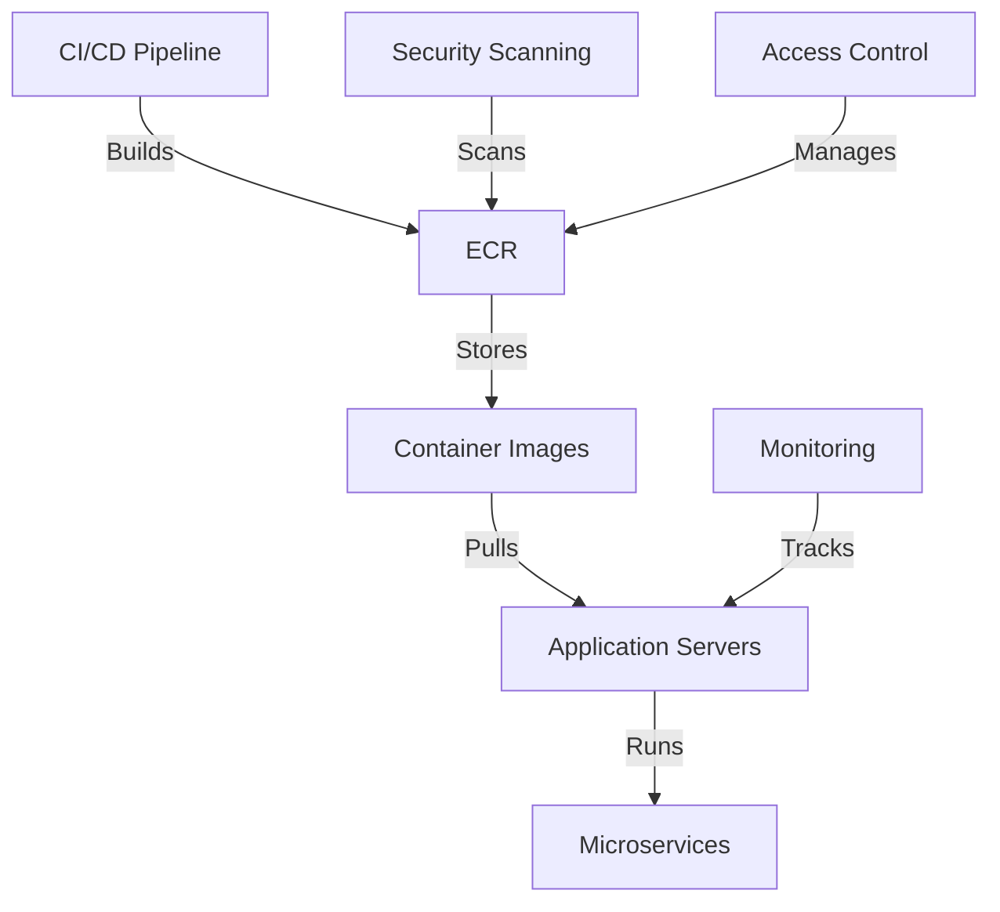

# ECR Container Image Standards — AWS

## Overview and scope

The purpose of this document is to establish standards for managing and deploying container images within Amazon Elastic Container Registry (ECR) at Xentic. These standards aim to ensure consistency, security, and efficiency in our containerized application deployments.

### Audience

This document is intended for:
- DevOps engineers
- Software developers
- System architects
- Security teams

### Scope

This standard applies to all container images stored in Amazon ECR for Xentic services. It encompasses:
- Naming conventions
- Versioning strategies
- Security best practices
- Image lifecycle management
- Integration with CI/CD pipelines

### Non-goals

This document does NOT cover:
- Detailed instructions on using AWS services outside of ECR
- Application architecture decisions unrelated to container images
- Deployment strategies that do not involve containerized applications

### Glossary

| Term                | Definition                                                                 |
|---------------------|-----------------------------------------------------------------------------|
| ECR                 | Amazon Elastic Container Registry, a fully managed Docker container registry. |
| Container Image     | A lightweight, standalone, executable package that includes everything needed to run a piece of software. |
| CI/CD               | Continuous Integration/Continuous Deployment, a method to frequently deliver apps to customers. |
| Tagging             | A way to label images with specific identifiers for versioning and management. |

### How this standard fits the Xentic platform

The ECR Container Image Standards are integral to the Xentic platform as they provide a framework for:
- Ensuring that all container images adhere to a common structure and security posture.
- Facilitating easier collaboration among teams by standardizing image management practices.
- Enhancing the reliability and maintainability of our applications by promoting best practices in image versioning and lifecycle management.

By adhering to these standards, Xentic can achieve a more streamlined and secure approach to deploying containerized applications, ultimately leading to improved operational efficiency and reduced risk. 

### Related Documentation

For additional context and details, refer to the following internal documents:
- [Xentic CI/CD Pipeline Standards](https://docs.internal.xentic.io/ci-cd-standards)
- [Xentic Security Best Practices](https://docs.internal.xentic.io/security-best-practices)

### Summary

In summary, this document outlines the essential standards for managing ECR container images at Xentic. All teams MUST familiarize themselves with these standards to ensure compliance and contribute to a secure and efficient container management strategy.

## Standards and policies

1. **Naming Conventions**
   - Container images MUST be named using the format `com.xentic.<service>:<version>`.
   - The `<service>` portion MUST reflect the service name in lowercase, and the `<version>` MUST follow semantic versioning (e.g., `1.0.0`).
   - Example:
     ```bash
     docker tag myapp:1.0.0 com.xentic.myapp:1.0.0
     ```

2. **Versioning Strategies**
   - Images MUST be tagged with both a semantic version and a `latest` tag for the most recent stable version.
   - All images MUST be versioned to facilitate rollbacks and traceability.
   - Example of tagging:
     ```bash
     docker tag com.xentic.myapp:1.0.0 com.xentic.myapp:latest
     ```

3. **Security Best Practices**
   - Images MUST be scanned for vulnerabilities before being pushed to ECR.
   - Only images that pass security scans MUST be deployed to production environments.
   - Use AWS ECR's built-in scanning feature or integrate a third-party scanning tool.
   - Example of enabling ECR image scanning:
     ```yaml
     imageScanningConfiguration:
       scanOnPush: true
     ```

4. **Image Lifecycle Management**
   - Unused images MUST be removed from ECR after 30 days to conserve storage and reduce costs.
   - Implement lifecycle policies in ECR to automate the cleanup of old images.
   - Example lifecycle policy:
     ```json
     {
       "rules": [
         {
           "rulePriority": 1,
           "description": "Expire images older than 30 days",
           "selection": {
             "tagStatus": "any",
             "countType": "sinceImagePushed",
             "countUnit": "days",
             "countNumber": 30
           },
           "action": {
             "type": "expire"
           }
         }
       ]
     }
     ```

5. **Integration with CI/CD Pipelines**
   - CI/CD pipelines MUST include steps to build, test, and push container images to ECR.
   - Ensure that the pipeline uses IAM roles with the least privilege necessary for ECR access.
   - Example CI/CD step in a YAML pipeline:
     ```yaml
     - name: Build and Push to ECR
       run: |
         $(aws ecr get-login --no-include-email --region us-east-1)
         docker build -t com.xentic.myapp:latest .
         docker tag com.xentic.myapp:latest <account_id>.dkr.ecr.us-east-1.amazonaws.com/com.xentic.myapp:latest
         docker push <account_id>.dkr.ecr.us-east-1.amazonaws.com/com.xentic.myapp:latest
     ```

6. **Access Control**
   - Access to ECR MUST be controlled via IAM policies that restrict who can push or pull images.
   - Teams MUST use IAM roles rather than IAM users for accessing ECR.
   - Example IAM policy for ECR access:
     ```json
     {
       "Version": "2012-10-17",
       "Statement": [
         {
           "Effect": "Allow",
           "Action": [
             "ecr:PutImage",
             "ecr:InitiateLayerUpload",
             "ecr:UploadLayerPart",
             "ecr:CompleteLayerUpload",
             "ecr:BatchCheckLayerAvailability",
             "ecr:GetAuthorizationToken",
             "ecr:DescribeRepositories",
             "ecr:ListImages"
           ],
           "Resource": "*"
         }
       ]
     }
     ```

7. **Documentation and Metadata**
   - Each container image MUST include metadata that documents the image's purpose, version, and any relevant dependencies.
   - Use a README file within the image or maintain documentation in a centralized repository.
   - Example of a README file:
     ```markdown
     # MyApp Container Image
     - **Version**: 1.0.0
     - **Dependencies**: Java 11, Spring Boot
     - **Purpose**: This image runs the MyApp service.
     ```

8. **Testing and Validation**
   - Container images MUST be tested in a staging environment before being promoted to production.
   - Automated tests MUST be included in the CI/CD pipeline to validate image functionality.
   - Example of a test command in a CI/CD pipeline:
     ```yaml
     - name: Run Tests
       run: |
         docker run --rm com.xentic.myapp:latest ./run-tests.sh
     ```

By adhering to these standards, Xentic ensures that the management of container images in ECR is efficient, secure, and compliant with internal policies. All teams MUST familiarize themselves with these policies and integrate them into their workflows.

## Architecture and design

The architecture for managing container images in Amazon ECR at Xentic is designed to ensure scalability, security, and reliability. Below is a component diagram that outlines the key components and their interactions.



### Data Flows

- **Image Build and Push**: 
  - The CI/CD pipeline builds the container image and pushes it to ECR. This process includes tagging the image appropriately.
  
- **Image Pull**: 
  - Application servers pull the container images from ECR during deployment. The latest stable version is always preferred.

- **Security Scanning**: 
  - Before an image is pushed to ECR, it is scanned for vulnerabilities. Only images that pass the security checks are allowed to be stored.

- **Monitoring**: 
  - Application servers are monitored for performance and health metrics, which are essential for maintaining operational efficiency.

### Integration Points

- **CI/CD Pipeline**: 
  - Integrates with ECR for building, testing, and deploying container images. It should include steps for security scanning and validation.

- **IAM Policies**: 
  - IAM roles are used to manage access to ECR, ensuring that only authorized personnel and services can push or pull images.

- **Monitoring Tools**: 
  - Integration with monitoring tools (e.g., AWS CloudWatch) for tracking the performance of deployed microservices.

### Failure Domains

- **Image Build Failures**: 
  - If the CI/CD pipeline fails to build the image, notifications MUST be sent to the development team for immediate resolution.

- **Security Scan Failures**: 
  - If an image fails the security scan, it MUST NOT be pushed to ECR, and the development team MUST be notified to address vulnerabilities.

- **Pull Failures**: 
  - If an application server fails to pull the image from ECR, it MUST log the error and retry the pull operation a predefined number of times before alerting the operations team.

### Summary of Best Practices

- **Container Image Management**:
  - Images MUST be versioned and tagged properly to ensure traceability and rollback capabilities.

- **Security**:
  - Security scans MUST be integrated into the CI/CD pipeline to ensure that only secure images are deployed.

- **Monitoring and Alerts**:
  - Implement monitoring solutions to track the health of application servers and alert on failures.

### Example Configuration

Below is an example configuration for an ECR repository that includes lifecycle policies and image scanning settings:

```yaml
repositoryPolicy:
  repositoryName: com.xentic.myapp
  imageScanningConfiguration:
    scanOnPush: true
  lifecyclePolicy:
    rules:
      - rulePriority: 1
        description: "Expire images older than 30 days"
        selection:
          tagStatus: "any"
          countType: "sinceImagePushed"
          countUnit: "days"
          countNumber: 30
        action:
          type: "expire"
```

By adhering to these architectural standards, Xentic ensures a robust and efficient container image management process within AWS ECR, facilitating seamless integration and deployment across services. All teams MUST follow these guidelines to maintain consistency and security in containerized application deployments.

## Configuration reference

### application.yml

The following is a sample `application.yml` configuration for a service using ECR:

```yaml
spring:
  application:
    name: myapp
  cloud:
    aws:
      ecr:
        repository: com.xentic.myapp
        region: us-east-1
        image-scanning:
          enabled: true
      credentials:
        access-key: ${AWS_ACCESS_KEY_ID}
        secret-key: ${AWS_SECRET_ACCESS_KEY}
  docker:
    image:
      name: com.xentic.myapp
      tag: latest
```

### Terraform Configuration

The following Terraform configuration creates an ECR repository with lifecycle policies and image scanning enabled:

```hcl
resource "aws_ecr_repository" "myapp" {
  name                 = "com.xentic.myapp"
  image_scanning_configuration {
    scan_on_push = true
  }
  
  lifecycle_policy {
    policy = jsonencode({
      rules = [
        {
          rulePriority = 1
          description  = "Expire images older than 30 days"
          selection = {
            tagStatus = "any"
            countType = "sinceImagePushed"
            countUnit = "days"
            countNumber = 30
          }
          action = {
            type = "expire"
          }
        }
      ]
    })
  }
}
```

### Environment Variables

The following table outlines the required environment variables for accessing ECR, along with their default and production values:

| Variable                     | Default Value        | Production Value             | Description                                  |
|------------------------------|----------------------|------------------------------|----------------------------------------------|
| `AWS_ACCESS_KEY_ID`         | `your-access-key`    | `actual-production-access-key` | AWS access key for ECR access.              |
| `AWS_SECRET_ACCESS_KEY`     | `your-secret-key`    | `actual-production-secret-key` | AWS secret key for ECR access.              |
| `AWS_DEFAULT_REGION`        | `us-east-1`          | `us-east-1`                  | Default region for AWS services.             |
| `DOCKER_IMAGE_NAME`          | `com.xentic.myapp`   | `com.xentic.myapp`           | Name of the Docker image.                    |
| `DOCKER_IMAGE_TAG`           | `latest`             | `latest`                     | Tag for the Docker image.                    |

### SQL for Metadata Storage

If you need to store metadata related to the container images in a database, the following SQL schema can be used:

```sql
CREATE TABLE image_metadata (
    id SERIAL PRIMARY KEY,
    image_name VARCHAR(255) NOT NULL,
    version VARCHAR(50) NOT NULL,
    created_at TIMESTAMP DEFAULT CURRENT_TIMESTAMP,
    updated_at TIMESTAMP DEFAULT CURRENT_TIMESTAMP ON UPDATE CURRENT_TIMESTAMP,
    dependencies TEXT,
    purpose TEXT
);

INSERT INTO image_metadata (image_name, version, dependencies, purpose)
VALUES ('com.xentic.myapp', '1.0.0', 'Java 11, Spring Boot', 'This image runs the MyApp service.');
```

### Summary

All configurations, environment variables, and database schemas MUST be aligned with the standards outlined in this document. Teams MUST ensure that they are using the correct values for production environments and adhere to the naming conventions specified for ECR container images.

## Implementation guide

To implement the standards for ECR container images at Xentic, follow the step-by-step guide below. This guide covers the setup of the CI/CD pipeline, the creation of Docker images, and the integration with AWS ECR.

### Step 1: Setting Up AWS ECR

1. **Create an ECR Repository**:
   Use the AWS CLI to create a new ECR repository.

   ```bash
   aws ecr create-repository --repository-name com.xentic.myapp --image-scanning-configuration scanOnPush=true
   ```

2. **Configure Repository Policies**:
   Apply a policy to allow specific actions.

   ```json
   {
     "Version": "2012-10-17",
     "Statement": [
       {
         "Effect": "Allow",
         "Principal": {
           "AWS": "arn:aws:iam::YOUR_ACCOUNT_ID:role/YOUR_ROLE"
         },
         "Action": [
           "ecr:BatchCheckLayerAvailability",
           "ecr:PutImage",
           "ecr:InitiateLayerUpload",
           "ecr:UploadLayerPart",
           "ecr:CompleteLayerUpload"
         ],
         "Resource": "arn:aws:ecr:us-east-1:YOUR_ACCOUNT_ID:repository/com.xentic.myapp"
       }
     ]
   }
   ```

### Step 2: Dockerfile Creation

1. **Create a Dockerfile**:
   The Dockerfile should be placed in the root of your project.

   ```dockerfile
   FROM openjdk:11-jre-slim
   VOLUME /tmp
   COPY target/myapp.jar myapp.jar
   ENTRYPOINT ["java", "-jar", "myapp.jar"]
   ```

### Step 3: Build and Tag the Docker Image

1. **Build the Docker Image**:
   Run the following command in your project directory.

   ```bash
   docker build -t com.xentic.myapp:latest .
   ```

2. **Tag the Image for ECR**:
   Tag the image to match the ECR repository URI.

   ```bash
   docker tag com.xentic.myapp:latest YOUR_ACCOUNT_ID.dkr.ecr.us-east-1.amazonaws.com/com.xentic.myapp:latest
   ```

### Step 4: Authenticate Docker to ECR

1. **Authenticate**:
   Use the following command to authenticate Docker to your ECR registry.

   ```bash
   aws ecr get-login-password --region us-east-1 | docker login --username AWS --password-stdin YOUR_ACCOUNT_ID.dkr.ecr.us-east-1.amazonaws.com
   ```

### Step 5: Push the Docker Image to ECR

1. **Push the Image**:
   Push the tagged image to the ECR repository.

   ```bash
   docker push YOUR_ACCOUNT_ID.dkr.ecr.us-east-1.amazonaws.com/com.xentic.myapp:latest
   ```

### Step 6: CI/CD Integration

1. **Configure CI/CD Pipeline**:
   Below is an example of a GitHub Actions workflow that builds, tests, and pushes the image to ECR.

   ```yaml
   name: CI/CD Pipeline

   on:
     push:
       branches:
         - main

   jobs:
     build:
       runs-on: ubuntu-latest
       steps:
         - name: Checkout code
           uses: actions/checkout@v2

         - name: Set up JDK 11
           uses: actions/setup-java@v2
           with:
             java-version: '11'

         - name: Build with Maven
           run: mvn clean package

         - name: Log in to Amazon ECR
           run: |
             aws ecr get-login-password --region us-east-1 | docker login --username AWS --password-stdin YOUR_ACCOUNT_ID.dkr.ecr.us-east-1.amazonaws.com

         - name: Build Docker image
           run: docker build -t com.xentic.myapp:latest .

         - name: Tag Docker image
           run: docker tag com.xentic.myapp:latest YOUR_ACCOUNT_ID.dkr.ecr.us-east-1.amazonaws.com/com.xentic.myapp:latest

         - name: Push Docker image
           run: docker push YOUR_ACCOUNT_ID.dkr.ecr.us-east-1.amazonaws.com/com.xentic.myapp:latest
   ```

### Step 7: Security Scanning

1. **Integrate Security Scanning**:
   Ensure that your CI/CD pipeline includes a step for security scanning before pushing the image.

   ```yaml
   - name: Run Security Scan
     run: |
       trivy image --exit-code 1 --severity HIGH,CRITICAL YOUR_ACCOUNT_ID.dkr.ecr.us-east-1.amazonaws.com/com.xentic.myapp:latest
   ```

### Step 8: Testing the Deployed Image

1. **Run Tests**:
   After deployment, run tests to validate the application.

   ```bash
   docker run --rm YOUR_ACCOUNT_ID.dkr.ecr.us-east-1.amazonaws.com/com.xentic.myapp:latest ./run-tests.sh
   ```

### Summary

By following these steps, Xentic teams MUST ensure that container images are built, tested, and deployed according to the established standards. This process enhances security, reliability, and traceability of container images in AWS ECR. All teams MUST document their configurations and adhere to the naming conventions specified for ECR container images.

## Security requirements

To ensure the security of container images stored in AWS ECR, Xentic adopts a comprehensive threat model and implements best practices in authentication and authorization, secrets management, input validation, and audit logging.

### Threat Model Summary

The following threats have been identified concerning ECR container images:

- **Unauthorized Access**: Unauthorized users gaining access to ECR repositories.
- **Image Tampering**: Malicious modifications to container images.
- **Data Leakage**: Exposure of sensitive data through misconfigured repositories or images.
- **Vulnerabilities in Dependencies**: Inclusion of vulnerable libraries or packages within images.

### Authentication and Authorization

1. **IAM Roles and Policies**:
   - Teams MUST use IAM roles with the principle of least privilege for ECR access.
   - Define specific policies that restrict actions to only what is necessary.

   Example IAM policy:

   ```json
   {
     "Version": "2012-10-17",
     "Statement": [
       {
         "Effect": "Allow",
         "Action": [
           "ecr:DescribeRepositories",
           "ecr:ListImages",
           "ecr:BatchGetImage",
           "ecr:PutImage",
           "ecr:InitiateLayerUpload",
           "ecr:UploadLayerPart",
           "ecr:CompleteLayerUpload"
         ],
         "Resource": "arn:aws:ecr:us-east-1:YOUR_ACCOUNT_ID:repository/com.xentic.myapp"
       }
     ]
   }
   ```

2. **Multi-Factor Authentication (MFA)**:
   - Teams SHOULD enforce MFA for all IAM users with access to ECR.

### Secrets Management

1. **Use AWS Secrets Manager**:
   - Store sensitive information such as AWS credentials in AWS Secrets Manager.
   - Access secrets programmatically using the AWS SDK.

   Example code to retrieve a secret:

   ```java
   AWSSecretsManager secretsManager = AWSSecretsManagerClientBuilder.standard().build();
   GetSecretValueRequest getSecretValueRequest = new GetSecretValueRequest().withSecretId("mySecretId");
   GetSecretValueResult getSecretValueResult = secretsManager.getSecretValue(getSecretValueRequest);
   String secret = getSecretValueResult.getSecretString();
   ```

2. **Environment Variables**:
   - Secrets MUST NOT be hardcoded in the application code or Dockerfile.
   - Use environment variables to pass secrets to the container at runtime.

### Input Validation

1. **Validate Input Data**:
   - All input data to the application MUST be validated against expected formats and types.
   - Use libraries like Hibernate Validator for Java applications.

   Example validation annotation:

   ```java
   @NotNull
   @Size(min = 1, max = 255)
   private String imageName;
   ```

2. **Sanitize User Inputs**:
   - Implement sanitization for any user-generated content to prevent injection attacks.

### Audit Logging

1. **Enable AWS CloudTrail**:
   - Teams MUST enable AWS CloudTrail to log all API calls made to ECR.
   - Review CloudTrail logs regularly for unauthorized access attempts.

2. **Application Logging**:
   - Implement logging in the application to capture important events related to image management.
   - Use a structured logging framework like Logback or Log4j.

   Example logging configuration:

   ```xml
   <configuration>
       <appender name="FILE" class="ch.qos.logback.core.FileAppender">
           <file>logs/myapp.log</file>
           <encoder>
               <pattern>%d{yyyy-MM-dd HH:mm:ss} %-5level %logger{36} - %msg%n</pattern>
           </encoder>
       </appender>
       <root level="INFO">
           <appender-ref ref="FILE" />
       </root>
   </configuration>
   ```

### Summary

To maintain the security of container images in AWS ECR, Xentic teams MUST implement the outlined security requirements. This includes adhering to strict authentication and authorization protocols, managing secrets securely, validating all input data, and enabling comprehensive audit logging. Regular reviews and updates to security practices MUST be conducted to adapt to evolving threats.

## Testing strategy

To ensure the reliability and quality of containerized applications deployed to AWS ECR, Xentic teams MUST implement a comprehensive testing strategy that includes unit tests, integration tests, and contract tests. The following guidelines outline the requirements and expectations for each type of test, along with coverage targets and example test classes.

### 1. Unit Tests

Unit tests are essential for validating individual components of the application. Teams MUST aim for a minimum of 80% code coverage for unit tests.

- **Framework**: Use JUnit 5 for writing unit tests.
- **Mocking**: Utilize Mockito for mocking dependencies.

#### Example Unit Test Class

```java
package com.xentic.myapp.service;

import static org.mockito.Mockito.*;
import static org.junit.jupiter.api.Assertions.*;

import org.junit.jupiter.api.Test;
import org.mockito.InjectMocks;
import org.mockito.Mock;
import org.mockito.MockitoAnnotations;

class MyServiceTest {

    @Mock
    private MyRepository myRepository;

    @InjectMocks
    private MyService myService;

    public MyServiceTest() {
        MockitoAnnotations.openMocks(this);
    }

    @Test
    void testGetData() {
        // Arrange
        when(myRepository.findData()).thenReturn("Expected Data");

        // Act
        String result = myService.getData();

        // Assert
        assertEquals("Expected Data", result);
        verify(myRepository, times(1)).findData();
    }
}
```

### 2. Integration Tests

Integration tests validate the interaction between multiple components and external systems. Teams MUST ensure at least 70% coverage for integration tests.

- **Framework**: Use Spring Boot Test for integration testing.
- **Database**: Utilize an in-memory database (H2) for testing.

#### Example Integration Test Class

```java
package com.xentic.myapp;

import static org.springframework.test.web.servlet.request.MockMvcRequestBuilders.*;
import static org.springframework.test.web.servlet.result.MockMvcResultMatchers.*;

import org.junit.jupiter.api.Test;
import org.springframework.beans.factory.annotation.Autowired;
import org.springframework.boot.test.autoconfigure.web.servlet.AutoConfigureMockMvc;
import org.springframework.boot.test.context.SpringBootTest;

@SpringBootTest
@AutoConfigureMockMvc
class MyControllerIntegrationTest {

    @Autowired
    private MockMvc mockMvc;

    @Test
    void testGetEndpoint() throws Exception {
        mockMvc.perform(get("/api/data"))
                .andExpect(status().isOk())
                .andExpect(content().string("Expected Data"));
    }
}
```

### 3. Contract Tests

Contract tests ensure that the interactions between services adhere to defined contracts. Teams MUST implement contract tests for any service-to-service communication.

- **Framework**: Use Pact for contract testing.
- **Consumer-Provider Setup**: Define contracts in the consumer service and verify them in the provider service.

#### Example Pact Test Class

```java
package com.xentic.myapp.consumer;

import au.com.dius.pact.consumer.junit5.PactConsumerTestExt;
import au.com.dius.pact.consumer.junit5.Pact;
import au.com.dius.pact.consumer.dsl.PactDslWithProvider;
import au.com.dius.pact.consumer.junit5.PactTestFor;
import org.junit.jupiter.api.extension.ExtendWith;

@ExtendWith(PactConsumerTestExt.class)
@PactTestFor(providerName = "MyProvider", port = "8080")
class MyConsumerPactTest {

    @Pact(consumer = "MyConsumer")
    public RequestResponsePact createPact(PactDslWithProvider builder) {
        return builder
                .given("provider state")
                .uponReceiving("a request for data")
                .path("/api/data")
                .method("GET")
                .willRespondWith()
                .status(200)
                .body("Expected Data")
                .toPact();
    }
}
```

### Coverage Targets

| Test Type        | Minimum Coverage |
|------------------|------------------|
| Unit Tests       | 80%              |
| Integration Tests| 70%              |
| Contract Tests   | 100% (All contracts MUST be verified) |

### Conclusion

Xentic teams MUST prioritize testing throughout the development lifecycle. Adhering to the outlined testing strategy will ensure that applications are robust, maintainable, and ready for deployment to AWS ECR. Regular reviews of test coverage and effectiveness MUST be conducted to continually improve the quality of the codebase.

## Observability and operations

To ensure the reliability and performance of containerized applications deployed to AWS ECR, Xentic teams MUST implement robust observability and operations practices. This includes setting up metrics, logs, traces, dashboards, alerts, and Service Level Objectives (SLOs). The following guidelines outline the necessary components and configurations.

### 1. Metrics

- **Monitoring Tools**: Teams MUST utilize AWS CloudWatch for collecting and monitoring metrics.
- **Custom Metrics**: Applications SHOULD emit custom metrics for critical business operations.

#### Example Custom Metric Configuration (CloudWatch)

```yaml
Resources:
  MyMetric:
    Type: "AWS::CloudWatch::Metric"
    Properties:
      MetricName: "SuccessfulRequests"
      Namespace: "MyApp"
      Statistic: "Sum"
      Period: 60
      Unit: "Count"
```

### 2. Logging

- **Log Aggregation**: Teams MUST configure centralized logging using AWS CloudWatch Logs or a third-party service like ELK Stack.
- **Structured Logging**: Applications SHOULD log in a structured format (e.g., JSON) to facilitate easier searching and filtering.

#### Example Logback Configuration for Structured Logging

```xml
<configuration>
    <appender name="CLOUDWATCH" class="ch.qos.logback.classic.net.SocketAppender">
        <remoteHost>logs.us-east-1.amazonaws.com</remoteHost>
        <port>25888</port>
        <encoder class="ch.qos.logback.core.encoder.LayoutWrappingEncoder">
            <layout class="net.logstash.logback.layout.LogstashTcpSocketAppender">
                <jsonGenerator class="net.logstash.logback.argument.StructuredArguments"/>
            </layout>
        </encoder>
    </appender>
    <root level="INFO">
        <appender-ref ref="CLOUDWATCH"/>
    </root>
</configuration>
```

### 3. Tracing

- **Distributed Tracing**: Teams MUST implement distributed tracing using AWS X-Ray to monitor and analyze requests across microservices.
- **Trace Context**: Applications SHOULD propagate trace context through HTTP headers.

#### Example Code for Propagating Trace Context

```java
import com.amazonaws.xray.AWSXRay;
import com.amazonaws.xray.entities.Subsegment;

public void someServiceMethod() {
    Subsegment subsegment = AWSXRay.beginSubsegment("someServiceMethod");
    try {
        // Your business logic here
    } finally {
        subsegment.close();
    }
}
```

### 4. Dashboards

- **CloudWatch Dashboards**: Teams MUST create CloudWatch Dashboards to visualize key metrics and logs.
- **Custom Dashboards**: Applications SHOULD provide custom dashboards for application-specific metrics.

#### Example CloudWatch Dashboard Configuration

```json
{
  "DashboardName": "MyAppDashboard",
  "DashboardBody": "{\"widgets\":[{\"type\":\"metric\",\"x\":0,\"y\":0,\"width\":6,\"height\":6,\"properties\":{\"metrics\":[[\"AWS/EC2\",\"CPUUtilization\",\"InstanceId\",\"i-1234567890abcdef0\"]],\"period\":300}}]}"
}
```

### 5. Alerts

- **Alerting on Metrics**: Teams MUST set up CloudWatch Alarms to notify on critical metrics (e.g., error rates, latency).
- **Notification Channels**: Alerts SHOULD be sent to appropriate channels (e.g., Slack, email) using AWS SNS.

#### Example CloudWatch Alarm Configuration

```yaml
Resources:
  HighErrorRateAlarm:
    Type: "AWS::CloudWatch::Alarm"
    Properties:
      AlarmDescription: "Alarm when error rate exceeds threshold"
      MetricName: "ErrorRate"
      Namespace: "MyApp"
      Statistic: "Average"
      Period: 60
      EvaluationPeriods: 1
      Threshold: 5.0
      ComparisonOperator: "GreaterThanThreshold"
      AlarmActions:
        - !Ref SNSTopic
```

### 6. Service Level Objectives (SLOs)

- **Define SLOs**: Teams MUST define SLOs for critical services based on user expectations (e.g., 99.9% availability).
- **Regular Review**: SLOs SHOULD be reviewed quarterly to ensure they remain relevant and achievable.

#### Example SLO Definition

| Service          | SLO Metric                  | Target      |
|------------------|-----------------------------|-------------|
| User Service     | Availability                | 99.9%       |
| Payment Service   | Latency (95th Percentile)   | < 200 ms    |
| Order Service    | Error Rate                  | < 1%       |

### 7. On-call Runbook Steps

In the event of an incident, teams MUST follow the on-call runbook steps to ensure a structured response:

1. **Acknowledge the Alert**: Respond to alerts within 5 minutes.
2. **Investigate the Issue**: Check logs and metrics to identify the root cause.
3. **Mitigate Impact**: If applicable, implement a temporary fix or rollback.
4. **Communicate**: Notify stakeholders of the incident and provide updates.
5. **Document the Incident**: Log all findings and actions taken in the incident report.
6. **Postmortem Review**: Conduct a postmortem to analyze the incident and identify improvements.

### Conclusion

Xentic teams MUST prioritize observability and operations for containerized applications in AWS ECR. By implementing the outlined practices, teams can ensure high availability, performance, and reliability, ultimately enhancing the user experience and operational efficiency. Regular reviews and updates to observability practices MUST be conducted to adapt to changing requirements and technologies.

## Migration and versioning

As Xentic evolves its containerized applications and services, teams MUST adhere to a structured migration and versioning policy. This policy ensures seamless upgrades, maintains backward compatibility, and provides clear rollback procedures.

### 1. Upgrade Paths

- **Semantic Versioning**: All container images MUST follow [Semantic Versioning](https://semver.org/) (MAJOR.MINOR.PATCH) to clearly communicate the nature of changes.
- **Upgrade Strategy**: Teams SHOULD define a clear upgrade path for each service, specifying:
  - **Breaking Changes**: Document any breaking changes in the release notes.
  - **Deprecation Notices**: Provide deprecation notices at least one version prior to removal.

| Version Type  | Description                                   | Upgrade Path                      |
|---------------|-----------------------------------------------|-----------------------------------|
| MAJOR         | Breaking changes that require migration       | MUST migrate to the latest version |
| MINOR         | New features and improvements                 | SHOULD upgrade when feasible       |
| PATCH         | Bug fixes and minor improvements              | MAY upgrade at any time           |

### 2. Deprecation Policy

- **Deprecation Timeline**: Services MUST provide a deprecation timeline for features that will be removed. This timeline MUST include:
  - **Announcement**: At least one version prior to deprecation.
  - **Grace Period**: A minimum of two subsequent releases before removal.
  
- **Documentation**: Deprecated features MUST be documented in the release notes and internal documentation.

#### Example Deprecation Notice

```markdown
### Deprecation Notice for Feature X
**Version**: 2.0.0  
**Deprecation Announcement**: Feature X will be deprecated in version 3.0.0.  
**Grace Period**: Feature X will be removed in version 4.0.0.  
**Action Required**: Please migrate to Feature Y before the removal date.
```

### 3. Backward Compatibility

- **Compatibility Testing**: Teams MUST ensure that new versions of services are backward compatible with previous versions unless explicitly stated otherwise.
- **API Versioning**: If breaking changes are necessary, teams SHOULD implement API versioning (e.g., `/api/v1/resource`) to maintain compatibility.

#### Example API Versioning

```java
@RestController
@RequestMapping("/api/v1/resource")
public class ResourceController {
    // Version 1 of the API
}
```

### 4. Rollback Procedures

In the event of a failed deployment, teams MUST have a rollback strategy in place to restore the previous stable version. This includes:

- **Version Tagging**: All container images MUST be tagged with their version number in the repository.
- **Rollback Commands**: Document rollback commands for each service.

#### Example Rollback Command

```bash
# Rollback to the previous version of the container
docker run --rm -d --name myapp -p 8080:8080 com.xentic.myapp:1.0.0
```

### 5. Migration Scripts

If database changes are required during an upgrade, teams MUST provide migration scripts that are idempotent and reversible. These scripts should be versioned alongside the application code.

#### Example Migration Script (SQL)

```sql
-- Migration script for adding a new column
ALTER TABLE users ADD COLUMN last_login TIMESTAMP;

-- Rollback script for removing the column
ALTER TABLE users DROP COLUMN last_login;
```

### 6. Testing Migrations

- **Automated Tests**: Teams MUST implement automated tests for migration scripts to ensure they execute correctly without data loss.
- **Staging Environment**: Migrations MUST be tested in a staging environment before being applied to production.

### Conclusion

Xentic teams MUST adhere to the outlined migration and versioning policies to ensure smooth transitions between service versions, maintain backward compatibility, and facilitate quick rollbacks when necessary. Regular reviews of migration practices MUST be conducted to adapt to evolving project requirements and technologies.

## FAQ, anti-patterns, and checklists

### FAQ

1. **What is ECR?**
   - Amazon Elastic Container Registry (ECR) is a fully managed Docker container registry that makes it easy for developers to store, manage, and deploy Docker container images.

2. **How do I push an image to ECR?**
   - You MUST authenticate to your ECR registry and then use the Docker CLI to tag and push your image. Example:
     ```bash
     $(aws ecr get-login --no-include-email --region <region>)
     docker tag my-image:latest <account-id>.dkr.ecr.<region>.amazonaws.com/my-image:latest
     docker push <account-id>.dkr.ecr.<region>.amazonaws.com/my-image:latest
     ```

3. **What is the maximum image size allowed in ECR?**
   - The maximum image size for ECR is 10 GB.

4. **How do I pull an image from ECR?**
   - You MUST authenticate to your ECR registry and then use the Docker CLI to pull your image. Example:
     ```bash
     $(aws ecr get-login --no-include-email --region <region>)
     docker pull <account-id>.dkr.ecr.<region>.amazonaws.com/my-image:latest
     ```

5. **Can I use private repositories in ECR?**
   - Yes, ECR allows you to create private repositories to store your container images securely.

6. **What is the lifecycle policy in ECR?**
   - Lifecycle policies in ECR allow you to automate the process of cleaning up unused images based on rules you define.

7. **How can I enable image scanning in ECR?**
   - You MUST enable image scanning when creating or updating your repository. Example:
     ```json
     {
       "repositoryPolicyText": {
         "scanningConfiguration": {
           "scanOnPush": true
         }
       }
     }
     ```

8. **What are the best practices for ECR image tagging?**
   - Teams SHOULD follow Semantic Versioning for tagging images and MUST avoid using the `latest` tag in production environments.

9. **How do I configure permissions for ECR?**
   - You MUST use IAM roles and policies to grant permissions for actions on ECR repositories.

10. **Is there a cost associated with using ECR?**
    - Yes, ECR incurs costs based on the amount of data stored and data transferred out of the service.

### Anti-Patterns

| Anti-Pattern                     | Description                                                                                   |
|----------------------------------|-----------------------------------------------------------------------------------------------|
| Using `latest` Tag              | Teams MUST NOT use the `latest` tag for production images as it can lead to unpredictable deployments. |
| Not Implementing Image Scanning  | Teams MUST NOT skip enabling image scanning as it increases security risks from vulnerabilities. |
| Hardcoding Credentials            | Teams MUST NOT hardcode AWS credentials in your application code; use IAM roles instead.     |
| Ignoring Lifecycle Policies       | Teams MUST NOT neglect to set lifecycle policies, leading to unnecessary storage costs and clutter. |
| Not Versioning Images             | Teams MUST NOT push images without proper versioning, making it difficult to track changes.   |

### Pre-Merge Checklist

- [ ] Code adheres to Xentic's Java package structure: `com.xentic.<service>`.
- [ ] All container images are tagged following Semantic Versioning.
- [ ] Image scanning is enabled for all pushed images.
- [ ] Dockerfiles are optimized for size and build speed.
- [ ] IAM roles and permissions are correctly configured for ECR access.
- [ ] Documentation is updated to reflect changes made in the service.

### Production Checklist

- [ ] Ensure all images are scanned for vulnerabilities before deployment.
- [ ] Verify that the correct version of the image is deployed.
- [ ] Monitor CloudWatch for any anomalies post-deployment.
- [ ] Confirm that rollback procedures are documented and tested.
- [ ] Ensure that lifecycle policies are in place to manage old images.
- [ ] Validate that all services are running the expected container images.
