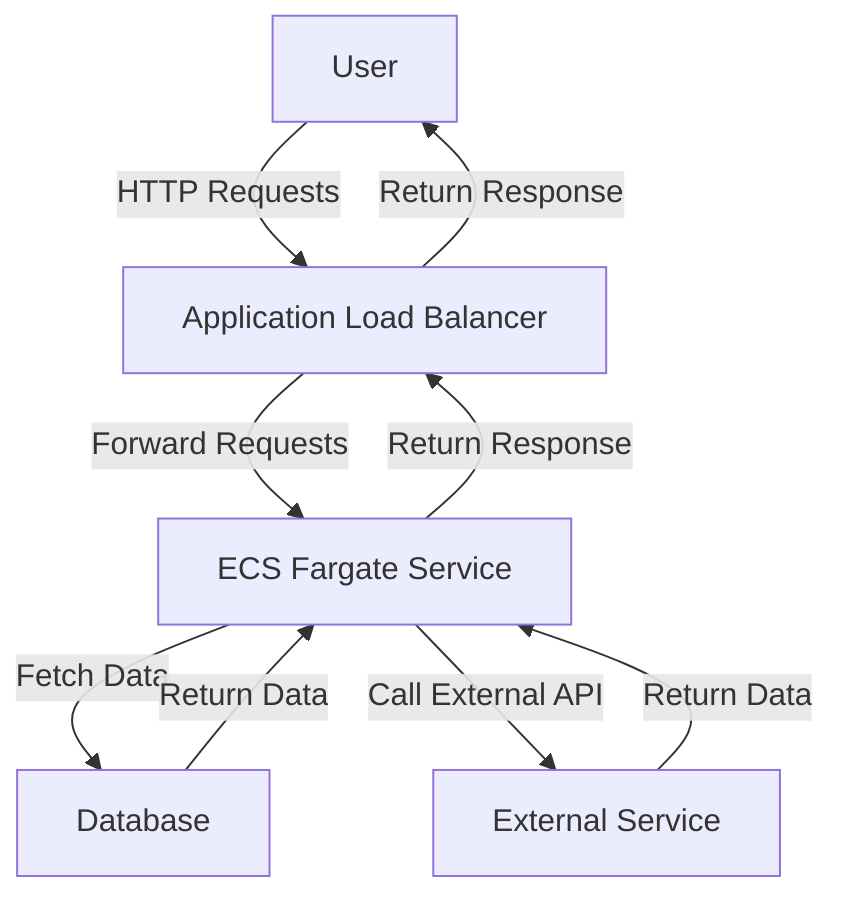

# ECS Fargate Deployment Standards

## Overview and scope

The ECS Fargate Deployment Standards document serves as a comprehensive guideline for deploying applications using AWS ECS Fargate within Xentic's infrastructure. This document is intended for software engineers, DevOps teams, and system architects involved in the deployment and management of microservices on AWS.

### Purpose

The purpose of this document is to outline the mandatory standards and best practices for deploying services using ECS Fargate. By adhering to these standards, teams will ensure consistency, security, and scalability across all services deployed within the Xentic platform.

### Audience

The primary audience for this document includes:
- Software Engineers
- DevOps Engineers
- System Architects
- Technical Leads

### Scope

This standard applies to all services deployed on AWS ECS Fargate at Xentic, covering:
- Task Definition Essentials
- Auto-scaling configurations
- Security and networking best practices
- Logging and monitoring requirements

### Non-goals

This document does not cover:
- General AWS account management
- Non-Fargate deployment strategies (e.g., EC2)
- Application-level coding standards

### Glossary

| Term                      | Definition                                                                                       |
|---------------------------|--------------------------------------------------------------------------------------------------|
| ECS                       | Elastic Container Service, a fully managed container orchestration service provided by AWS.     |
| Fargate                   | A serverless compute engine for containers that works with ECS, allowing you to run containers without managing servers. |
| Task Definition           | A blueprint that describes how a Docker container should run in ECS.                            |
| SSM Parameter Store       | A service that provides secure storage for configuration data and secrets.                      |
| HA                        | High Availability, ensuring that a service remains operational even in the event of failures.    |

### How This Standard Fits the Xentic Platform

The ECS Fargate Deployment Standards are integral to Xentic's cloud architecture, designed to support microservices that are resilient, scalable, and maintainable. By following these standards, Xentic aims to:
- Enhance deployment efficiency and reduce operational overhead.
- Improve security posture by managing secrets and configurations centrally.
- Ensure high availability and performance of services through auto-scaling and load balancing.

### Task Definition Essentials

The following is a sample of a task definition that adheres to Xentic's standards:

```json
{
  "family": "user-service",
  "networkMode": "awsvpc",
  "requiresCompatibilities": ["FARGATE"],
  "cpu": "512",
  "memory": "1024",
  "containerDefinitions": [{
    "name": "user-service",
    "image": "ACCOUNT.dkr.ecr.REGION.amazonaws.com/user-service:GIT_SHA",
    "portMappings": [{ "containerPort": 8080 }],
    "secrets": [
      { "name": "DATABASE_URL", "valueFrom": "arn:aws:ssm:REGION:ACCOUNT:parameter/prod/user-service/db-url" }
    ],
    "logConfiguration": {
      "logDriver": "awslogs",
      "options": { "awslogs-group": "/ecs/user-service", "awslogs-region": "us-east-1" }
    },
    "healthCheck": {
      "command": ["CMD-SHELL", "curl -f http://localhost:8080/actuator/health || exit 1"],
      "interval": 30,
      "timeout": 5,
      "retries": 3,
      "startPeriod": 60
    }
  }]
}
```

### Auto-Scaling Configuration

The following HCL snippet demonstrates how to configure auto-scaling for ECS services:

```hcl
resource "aws_appautoscaling_policy" "ecs_cpu" {
  policy_type = "TargetTrackingScaling"
  target_tracking_scaling_policy_configuration {
    target_value = 70.0   # scale out when CPU > 70%
    predefined_metric_specification {
      predefined_metric_type = "ECSServiceAverageCPUUtilization"
    }
    scale_out_cooldown = 60
    scale_in_cooldown  = 300
  }
}
```

### Rules

To ensure compliance with Xentic's ECS Fargate Deployment Standards, the following rules MUST be followed:
- Always use Fargate — no EC2 instance management.
- Secrets must be retrieved from SSM Parameter Store — hardcoding is strictly prohibited.
- All tasks MUST run in private subnets to enhance security.
- A minimum of 2 desired tasks MUST be configured for high availability.
- The `latest` image tag MUST NOT be used in production; always specify the Git SHA for versioning.

## Standards and policies

1. **MUST** use the package naming convention `com.xentic.<service>` for all Java applications deployed on ECS Fargate. This ensures consistency across the codebase and facilitates easier maintenance.

2. **MUST NOT** use hardcoded values for sensitive information such as database credentials or API keys. All secrets MUST be stored in AWS SSM Parameter Store and accessed via the `secrets` configuration in the task definition.

3. **MUST** configure logging for all containers using AWS CloudWatch Logs. The log configuration MUST include a log group specific to the service, following the naming convention `/ecs/<service-name>`.

4. **MUST** define health checks for all containerized services. Health checks MUST be defined in the task definition to ensure that ECS can automatically replace unhealthy tasks.

5. **SHOULD** use a CI/CD pipeline for deploying services to ECS Fargate. This pipeline MUST include stages for building, testing, and deploying the service to ensure quality and reliability.

6. **MUST** implement auto-scaling for all ECS services based on CPU and/or memory utilization. The target value for scaling MUST be set to maintain performance while minimizing costs.

7. **MUST NOT** expose services directly to the internet unless absolutely necessary. Use an Application Load Balancer (ALB) to manage traffic and apply security groups to restrict access.

8. **MUST** configure service discovery using AWS Cloud Map or DNS for inter-service communication. This ensures that services can discover and communicate with each other reliably.

9. **MUST** use versioned Docker images for deployments. The image tag MUST be based on the Git SHA to ensure traceability and rollback capability.

10. **SHOULD** utilize AWS IAM roles for tasks to manage permissions securely. Roles MUST be scoped to the minimum permissions necessary for the service to function.

11. **MUST** monitor all deployed services using AWS CloudWatch metrics and alarms. Key metrics such as CPU utilization, memory usage, and request counts MUST be tracked.

12. **MUST NOT** use the `latest` tag for Docker images in production environments. This practice can lead to unpredictable deployments and should be avoided.

13. **MUST** ensure that all services are deployed in a VPC with appropriate security groups and network ACLs configured to restrict access based on the principle of least privilege.

14. **SHOULD** document all service configurations, including environment variables and secrets, in a centralized documentation platform such as Confluence or internal wiki.

15. **MUST** perform regular security reviews of the deployed services and their configurations to identify and mitigate potential vulnerabilities.

16. **SHOULD** implement a centralized logging solution that aggregates logs from all services for easier troubleshooting and analysis.

17. **MUST** utilize AWS CodePipeline or similar tools for automating the deployment process, ensuring that deployments are consistent and repeatable.

18. **MUST** configure timeouts for all services to prevent long-running tasks from consuming resources indefinitely. Timeouts MUST be set based on the expected processing time for requests.

19. **MUST NOT** allow public access to the ECS management console. Access should be restricted to specific IP ranges or through a VPN.

20. **SHOULD** conduct regular load testing on services to ensure they can handle expected traffic volumes and to identify potential bottlenecks.

21. **MUST** use tagging for all ECS resources to facilitate cost tracking and resource management. Tags should include the service name, environment (e.g., dev, staging, prod), and owner.

22. **MUST** ensure that all services are compliant with Xentic's security policies, including encryption of data at rest and in transit.

23. **SHOULD** review and update ECS task definitions regularly to incorporate improvements and optimizations based on operational feedback and performance metrics.

24. **MUST** implement a rollback strategy for deployments, allowing for quick recovery in case of failed deployments or performance issues. 

By adhering to these standards and policies, Xentic aims to maintain a robust and secure deployment environment for all services running on AWS ECS Fargate.

## Architecture and design

The architecture for deploying applications on AWS ECS Fargate at Xentic is designed to ensure high availability, scalability, and security. The following sections describe the component diagram, data flows, integration points, and failure domains.

### Component Diagram

The following Mermaid diagram illustrates the key components involved in the ECS Fargate deployment architecture:



### Data Flows

1. **User Requests**: Users send HTTP requests to the Application Load Balancer (ALB).
2. **Load Balancing**: The ALB distributes incoming requests to the ECS Fargate service.
3. **Service Processing**: The ECS service processes the request, which may involve:
   - Fetching data from a database.
   - Calling external APIs for additional data.
4. **Response Handling**: The ECS service compiles the response and sends it back through the ALB to the user.

### Integration Points

- **Database**: All ECS services must integrate with a centralized database, which can be Amazon RDS or DynamoDB, depending on the use case. Connections to the database must utilize connection pooling for efficiency.
- **External APIs**: Services may need to call external APIs. These calls should be asynchronous where possible to avoid blocking the main processing thread.
- **Monitoring and Logging**: Integration with AWS CloudWatch for monitoring metrics and logging is mandatory for all services. Each service must push logs to a dedicated log group.

### Failure Domains

- **Service Failures**: ECS Fargate automatically replaces unhealthy tasks based on health checks defined in the task definition. Services must implement retries for transient failures when calling external APIs.
- **Database Failures**: Implement read replicas and failover strategies for the database to ensure high availability. Services should handle database connection errors gracefully.
- **Network Issues**: Utilize VPC peering and private subnets to minimize exposure to network issues. Ensure that security groups are configured to allow only necessary traffic.
- **Load Balancer Failures**: The ALB should be configured across multiple availability zones to mitigate the risk of a single point of failure.

### Best Practices

- **Circuit Breakers**: Implement circuit breaker patterns to handle failures gracefully when calling external services.
- **Retries and Backoff**: Use exponential backoff strategies for retrying failed requests to external services to avoid overwhelming them.
- **Monitoring**: Set up alarms for critical metrics such as error rates and latency to proactively address issues before they impact users.

By adhering to these architectural principles, Xentic ensures that its ECS Fargate deployments are robust, scalable, and maintainable, providing a seamless experience for users while minimizing downtime and operational overhead.

## Configuration reference

### application.yml

The following is an example of a typical `application.yml` configuration file for a Java service deployed on ECS Fargate:

```yaml
spring:
  application:
    name: my-service
  datasource:
    url: jdbc:mysql://${DB_HOST}:${DB_PORT}/${DB_NAME}
    username: ${DB_USERNAME}
    password: ${DB_PASSWORD}
  cloud:
    aws:
      region: us-west-2
      credentials:
        access-key: ${AWS_ACCESS_KEY}
        secret-key: ${AWS_SECRET_KEY}
  logging:
    level:
      root: INFO
      com.xentic.myservice: DEBUG
```

### Terraform Configuration

The following Terraform configuration defines an ECS Fargate service with the necessary settings:

```hcl
provider "aws" {
  region = "us-west-2"
}

resource "aws_ecs_cluster" "my_service_cluster" {
  name = "my-service-cluster"
}

resource "aws_ecs_task_definition" "my_service_task" {
  family                   = "my-service"
  network_mode            = "awsvpc"
  requires_compatibilities = ["FARGATE"]
  cpu                     = "256"
  memory                  = "512"

  container_definitions = jsonencode([
    {
      name      = "my-service"
      image     = "my-docker-repo/my-service:${GIT_SHA}"
      cpu       = 256
      memory    = 512
      essential = true
      portMappings = [
        {
          containerPort = 8080
          hostPort      = 8080
          protocol      = "tcp"
        }
      ]
      environment = [
        {
          name  = "DB_HOST"
          value = "my-db-instance"
        },
        {
          name  = "DB_PORT"
          value = "3306"
        },
        {
          name  = "DB_NAME"
          value = "my_database"
        },
        {
          name  = "DB_USERNAME"
          value = "my_user"
        },
        {
          name  = "DB_PASSWORD"
          value = "my_password"
        },
        {
          name  = "AWS_ACCESS_KEY"
          value = "my_access_key"
        },
        {
          name  = "AWS_SECRET_KEY"
          value = "my_secret_key"
        }
      ]
    }
  ])
}

resource "aws_ecs_service" "my_service" {
  name            = "my-service"
  cluster         = aws_ecs_cluster.my_service_cluster.id
  task_definition = aws_ecs_task_definition.my_service_task.id
  desired_count   = 2
  launch_type     = "FARGATE"

  network_configuration {
    subnets          = ["subnet-abc123", "subnet-def456"]
    security_groups  = ["sg-123456"]
    assign_public_ip = false
  }
}
```

### Environment Variables

The following table outlines the required environment variables for the ECS Fargate service, along with their default and production values:

| Variable Name      | Default Value       | Production Value          |
|--------------------|---------------------|---------------------------|
| `DB_HOST`          | `localhost`         | `my-db-instance`          |
| `DB_PORT`          | `3306`              | `3306`                    |
| `DB_NAME`          | `test_db`           | `my_database`             |
| `DB_USERNAME`      | `root`              | `my_user`                 |
| `DB_PASSWORD`      | `password`          | `my_password`             |
| `AWS_ACCESS_KEY`   | `your_access_key`   | `my_access_key`           |
| `AWS_SECRET_KEY`   | `your_secret_key`   | `my_secret_key`           |
| `LOG_LEVEL`        | `INFO`              | `DEBUG`                   |

### Additional Configuration

- **Logging Configuration**: Ensure that all logs are sent to AWS CloudWatch Logs. The log group should be named `/ecs/my-service`.
  
- **Health Check Configuration**: Define health checks in the ECS task definition to monitor service health. Example configuration:

```json
"healthCheck": {
  "command": [
    "CMD-SHELL",
    "curl -f http://localhost:8080/health || exit 1"
  ],
  "interval": 30,
  "timeout": 5,
  "retries": 3,
  "startPeriod": 60
}
```

By following these configuration standards, Xentic ensures that ECS Fargate deployments are consistent, secure, and maintainable across the organization.

## Implementation guide

To deploy a service on AWS ECS Fargate at Xentic, follow these step-by-step instructions. This guide will cover the necessary configurations, code examples, and best practices to ensure a successful deployment.

### Step 1: Create a Docker Image

First, create a `Dockerfile` for your Java application. Below is an example Dockerfile for a Spring Boot application:

```dockerfile
# Use the official OpenJDK image
FROM openjdk:11-jre-slim

# Set the working directory
WORKDIR /app

# Copy the JAR file into the container
COPY target/my-service.jar my-service.jar

# Expose the application port
EXPOSE 8080

# Run the application
ENTRYPOINT ["java", "-jar", "my-service.jar"]
```

### Step 2: Build and Push Docker Image

Use the following commands to build and push your Docker image to a container registry:

```bash
# Build the Docker image
docker build -t my-docker-repo/my-service:latest .

# Log in to the container registry
docker login -u <username> -p <password> <registry-url>

# Push the Docker image
docker push my-docker-repo/my-service:latest
```

### Step 3: Create ECS Task Definition

Define your ECS task definition in a JSON file (`task-definition.json`):

```json
{
  "family": "my-service",
  "networkMode": "awsvpc",
  "containerDefinitions": [
    {
      "name": "my-service",
      "image": "my-docker-repo/my-service:latest",
      "memory": 512,
      "cpu": 256,
      "essential": true,
      "portMappings": [
        {
          "containerPort": 8080,
          "hostPort": 8080,
          "protocol": "tcp"
        }
      ],
      "environment": [
        {
          "name": "DB_HOST",
          "value": "my-db-instance"
        },
        {
          "name": "DB_PORT",
          "value": "3306"
        },
        {
          "name": "DB_NAME",
          "value": "my_database"
        },
        {
          "name": "DB_USERNAME",
          "value": "my_user"
        },
        {
          "name": "DB_PASSWORD",
          "value": "my_password"
        }
      ]
    }
  ]
}
```

### Step 4: Register Task Definition

Use the AWS CLI to register your task definition:

```bash
aws ecs register-task-definition --cli-input-json file://task-definition.json
```

### Step 5: Create ECS Service

You can create the ECS service using the following command, ensuring you specify the correct cluster and task definition:

```bash
aws ecs create-service --cluster my-service-cluster --service-name my-service --task-definition my-service --desired-count 2 --launch-type FARGATE --network-configuration "awsvpcConfiguration={subnets=[subnet-abc123,subnet-def456],securityGroups=[sg-123456],assignPublicIp=ENABLED}"
```

### Step 6: Configure Application Load Balancer

Ensure that your Application Load Balancer (ALB) is set up to route traffic to your ECS service. Create a target group and register the ECS service:

1. Create a target group:
   ```bash
   aws elbv2 create-target-group --name my-service-targets --protocol HTTP --port 8080 --vpc-id vpc-abc123
   ```

2. Register targets:
   ```bash
   aws elbv2 register-targets --target-group-arn <target-group-arn> --targets Id=<ecs-instance-id>
   ```

3. Create a listener for the ALB:
   ```bash
   aws elbv2 create-listener --load-balancer-arn <alb-arn> --protocol HTTP --port 80 --default-actions Type=forward,TargetGroupArn=<target-group-arn>
   ```

### Step 7: Monitor and Scale

- **Monitoring**: Integrate AWS CloudWatch for monitoring your service metrics. Set up alarms for critical metrics such as CPU usage and error rates.

- **Scaling**: Use AWS Application Auto Scaling to automatically adjust the desired count of your ECS service based on load.

### Step 8: Implement Health Checks

Define health checks in your ECS task definition to ensure your service is running correctly. Add the following to your task definition:

```json
"healthCheck": {
  "command": [
    "CMD-SHELL",
    "curl -f http://localhost:8080/health || exit 1"
  ],
  "interval": 30,
  "timeout": 5,
  "retries": 3,
  "startPeriod": 60
}
```

### Step 9: Logging Configuration

Ensure that all logs are sent to AWS CloudWatch Logs. Configure your application to log to a specific log group:

```yaml
logging:
  loggers:
    com.xentic.myservice:
      level: DEBUG
      appender-ref:
        - ref: CloudWatchAppender
```

### Step 10: Security Best Practices

- **MUST NOT** hard-code sensitive information such as database passwords in your code. Use AWS Secrets Manager or Parameter Store to manage secrets.
- **MUST** configure security groups to allow only necessary inbound and outbound traffic.

By following these implementation steps, Xentic can ensure a standardized, secure, and efficient deployment of services on AWS ECS Fargate.

## Security requirements

### Threat Model Summary

Xentic's ECS Fargate deployments must adhere to a robust security model to protect against various threats, including:

- **Unauthorized Access**: Ensure that only authenticated users can access services.
- **Data Breaches**: Protect sensitive data at rest and in transit.
- **Denial of Service (DoS)**: Implement measures to mitigate service disruptions.
- **Injection Attacks**: Prevent SQL injection and other code injection vulnerabilities.

### Authentication and Authorization

- **MUST** implement OAuth 2.0 or OpenID Connect for user authentication.
- **MUST** use AWS IAM roles to control access to AWS resources.
- **MUST NOT** expose any endpoints without proper authentication.
- **MUST** validate user permissions for each API request.

Example of a Spring Security configuration for OAuth 2.0:

```java
@EnableWebSecurity
public class SecurityConfig extends WebSecurityConfigurerAdapter {
    @Override
    protected void configure(HttpSecurity http) throws Exception {
        http
            .authorizeRequests()
            .antMatchers("/public/**").permitAll()
            .anyRequest().authenticated()
            .and()
            .oauth2Login();
    }
}
```

### Secrets Management

- **MUST** use AWS Secrets Manager or AWS Systems Manager Parameter Store for managing sensitive information.
- **MUST NOT** store secrets in environment variables or source code.
- **MUST** rotate secrets regularly and upon any suspected compromise.

Example of retrieving a secret from AWS Secrets Manager:

```java
AWSSecretsManager secretsManager = AWSSecretsManagerClientBuilder.standard().build();
String secret = secretsManager.getSecretValue(new GetSecretValueRequest().withSecretId("mySecretId")).getSecretString();
```

### Input Validation

- **MUST** validate all user inputs to prevent injection attacks.
- **MUST NOT** trust any input from users, including query parameters, headers, and body content.
- **SHOULD** use libraries such as Hibernate Validator or custom validation logic to enforce data integrity.

Example of input validation using Spring's `@Valid` annotation:

```java
@PostMapping("/create")
public ResponseEntity<MyEntity> createEntity(@Valid @RequestBody MyEntity entity) {
    return ResponseEntity.ok(myService.save(entity));
}
```

### Audit Logging

- **MUST** implement audit logging for all critical operations, including user logins, data modifications, and security events.
- **MUST** log to AWS CloudWatch Logs or another centralized logging solution.
- **MUST NOT** log sensitive information such as passwords or personal data.

Example of logging configuration in `application.yml`:

```yaml
logging:
  level:
    root: INFO
    com.xentic.myservice: DEBUG
  loggers:
    audit:
      level: INFO
      appender-ref:
        - ref: CloudWatchAppender
```

### Summary Table

| Security Aspect           | Requirement                                                                 |
|---------------------------|-----------------------------------------------------------------------------|
| Authentication            | MUST implement OAuth 2.0 or OpenID Connect                                  |
| Authorization             | MUST validate user permissions for each API request                         |
| Secrets Management        | MUST use AWS Secrets Manager or Parameter Store                             |
| Input Validation          | MUST validate all user inputs                                               |
| Audit Logging             | MUST implement audit logging for critical operations                        |

By adhering to these security requirements, Xentic can ensure that ECS Fargate deployments are secure and resilient against potential threats.

## Testing strategy

To ensure the reliability and quality of services deployed on ECS Fargate, Xentic MUST implement a comprehensive testing strategy that includes unit tests, integration tests, and contract tests. The following outlines the requirements and targets for each testing type, along with examples.

### Unit Tests

- **MUST** achieve a minimum of 80% code coverage for all service classes.
- **MUST NOT** skip unit tests for critical business logic.
- **SHOULD** utilize JUnit 5 and Mockito for creating unit tests.

Example of a unit test using JUnit 5:

```java
import static org.mockito.Mockito.*;
import static org.junit.jupiter.api.Assertions.*;
import org.junit.jupiter.api.Test;

class MyServiceTest {

    private final MyRepository myRepository = mock(MyRepository.class);
    private final MyService myService = new MyService(myRepository);

    @Test
    void testGetEntityById() {
        MyEntity entity = new MyEntity(1, "Test Entity");
        when(myRepository.findById(1)).thenReturn(Optional.of(entity));

        MyEntity result = myService.getEntityById(1);
        assertEquals("Test Entity", result.getName());
    }
}
```

### Integration Tests

- **MUST** have integration tests that cover all REST endpoints.
- **MUST NOT** rely on mock objects for testing database interactions.
- **SHOULD** use Testcontainers to spin up a real database during integration tests.

Example of an integration test using Spring Boot Test:

```java
import static org.springframework.test.web.servlet.request.MockMvcRequestBuilders.*;
import static org.springframework.test.web.servlet.result.MockMvcResultMatchers.*;
import org.junit.jupiter.api.Test;
import org.springframework.beans.factory.annotation.Autowired;
import org.springframework.boot.test.autoconfigure.web.servlet.AutoConfigureMockMvc;
import org.springframework.boot.test.context.SpringBootTest;

@SpringBootTest
@AutoConfigureMockMvc
class MyServiceIntegrationTest {

    @Autowired
    private MockMvc mockMvc;

    @Test
    void testCreateEntity() throws Exception {
        String json = "{\"name\":\"New Entity\"}";

        mockMvc.perform(post("/api/entities")
                .contentType("application/json")
                .content(json))
                .andExpect(status().isCreated());
    }
}
```

### Contract Tests

- **MUST** implement contract tests to verify API interactions between services.
- **SHOULD** use Pact or Spring Cloud Contract for managing contracts.
- **MUST NOT** deploy services without passing contract tests.

Example of a contract test using Pact:

```java
import au.com.dius.pact.consumer.junit5.PactConsumerTestExt;
import au.com.dius.pact.consumer.junit5.Pact;
import au.com.dius.pact.consumer.dsl.PactDslWithProvider;
import au.com.dius.pact.consumer.dsl.PactDslJsonBody;
import org.junit.jupiter.api.Test;
import org.junit.jupiter.api.extension.ExtendWith;

@ExtendWith(PactConsumerTestExt.class)
class MyServiceContractTest {

    @Pact(consumer = "MyServiceConsumer", provider = "MyServiceProvider")
    public RequestResponsePact createPact(PactDslWithProvider builder) {
        return builder
            .given("entity exists")
            .uponReceiving("a request for entity")
            .path("/api/entities/1")
            .method("GET")
            .willRespondWith()
            .status(200)
            .body(new PactDslJsonBody()
                .numberType("id", 1)
                .stringType("name", "Test Entity"))
            .toPact();
    }

    @Test
    void testGetEntity() {
        // Code to invoke the service and validate the response against the contract
    }
}
```

### Coverage Targets

| Test Type         | Coverage Target |
|-------------------|-----------------|
| Unit Tests        | 80%             |
| Integration Tests | 100%            |
| Contract Tests    | 100%            |

### Summary

By adhering to these testing standards, Xentic ensures that all services are thoroughly tested, reducing the risk of defects and improving overall service quality. It is imperative that all team members follow these guidelines consistently to maintain high standards in software development and deployment.

## Observability and operations

To ensure effective monitoring and management of services deployed on AWS ECS Fargate, Xentic MUST implement a comprehensive observability strategy that encompasses metrics, logs, traces, dashboards, alerts, and Service Level Objectives (SLOs). The following outlines the requirements and best practices for each aspect of observability.

### Metrics

- **MUST** collect key performance metrics such as CPU usage, memory usage, request latency, and error rates.
- **SHOULD** use AWS CloudWatch for metrics collection and visualization.
- **MUST** define custom metrics for business-critical operations.

Example of a CloudWatch metric configuration in `application.yml`:

```yaml
cloudwatch:
  namespace: "Xentic/MyService"
  metrics:
    - name: "CPUUtilization"
      unit: "Percent"
      statistic: "Average"
    - name: "MemoryUtilization"
      unit: "Percent"
      statistic: "Average"
```

### Logs

- **MUST** implement structured logging to facilitate easier querying and analysis.
- **SHOULD** use AWS CloudWatch Logs for centralized log storage.
- **MUST NOT** log sensitive information such as user passwords or personally identifiable information (PII).

Example of a logging configuration in `logback-spring.xml`:

```xml
<configuration>
    <appender name="CLOUDWATCH" class="com.xentic.logging.CloudWatchAppender">
        <logGroup>MyServiceLogs</logGroup>
        <logStream>application-log</logStream>
    </appender>
    <root level="INFO">
        <appender-ref ref="CLOUDWATCH"/>
    </root>
</configuration>
```

### Traces

- **MUST** implement distributed tracing to identify performance bottlenecks across microservices.
- **SHOULD** use AWS X-Ray or OpenTelemetry for tracing.
- **MUST** propagate trace context across service boundaries.

Example of enabling tracing in a Spring Boot application:

```java
@SpringBootApplication
@EnableAspectJAutoProxy
@EnableTracing
public class MyServiceApplication {
    public static void main(String[] args) {
        SpringApplication.run(MyServiceApplication.class, args);
    }
}
```

### Dashboards

- **MUST** create dashboards in AWS CloudWatch or a similar tool to visualize key metrics and logs.
- **SHOULD** provide dashboards for different stakeholders, including developers, operations, and management.
- **MUST** include visualizations for SLOs and error rates.

Example of a dashboard configuration in AWS CloudWatch:

| Widget Type      | Metric            | Visualization Type |
|------------------|-------------------|---------------------|
| Line Graph       | CPUUtilization     | Time Series         |
| Bar Chart        | Error Rate         | Count               |
| Pie Chart        | Request Status     | Percentage          |

### Alerts

- **MUST** configure alerts for critical metrics such as high error rates, increased latency, and resource exhaustion.
- **SHOULD** use AWS CloudWatch Alarms to trigger notifications.
- **MUST** ensure alerts are routed to the appropriate on-call team.

Example of an alert configuration in AWS CloudWatch:

```yaml
alarms:
  - name: "HighErrorRate"
    metric: "ErrorRate"
    threshold: 5
    comparisonOperator: "GreaterThanThreshold"
    evaluationPeriods: 1
    period: 60
    actionsEnabled: true
    alarmActions:
      - "arn:aws:sns:us-east-1:123456789012:alert-topic"
```

### Service Level Objectives (SLOs)

- **MUST** define SLOs for critical services to measure reliability and performance.
- **SHOULD** review SLOs quarterly to ensure they remain relevant.
- **MUST** document SLOs in a centralized location accessible to all team members.

Example of SLO documentation:

| Service           | SLO Description                        | Target          |
|-------------------|---------------------------------------|------------------|
| MyService         | 99.9% availability                    | Monthly          |
| MyService API     | 95% of requests < 200ms latency      | Daily            |
| MyService Errors   | < 1% error rate                      | Monthly          |

### On-Call Runbook Steps

In the event of an incident, the following steps MUST be followed by on-call engineers:

1. **Acknowledge the Alert**: Confirm receipt of the alert and assess its severity.
2. **Investigate the Issue**: Use logs and metrics to identify the root cause of the issue.
3. **Mitigate the Impact**: If possible, implement a temporary fix or rollback to a previous stable version.
4. **Communicate**: Notify stakeholders about the incident and provide regular updates.
5. **Document the Incident**: After resolution, document the incident details and lessons learned.
6. **Review and Improve**: Conduct a post-mortem to identify improvements for monitoring and alerting.

By adhering to these observability and operations standards, Xentic can ensure that ECS Fargate deployments are effectively monitored, leading to improved reliability and performance of services.

## Migration and versioning

To maintain the integrity and reliability of services deployed on AWS ECS Fargate, Xentic MUST establish clear migration and versioning standards. This section outlines the upgrade paths, deprecation policy, backward compatibility, and rollback procedures that all teams MUST adhere to.

### Upgrade Paths

- **MUST** define clear upgrade paths for each service version.
- **SHOULD** use semantic versioning (MAJOR.MINOR.PATCH) to indicate changes:
  - **MAJOR** version changes introduce breaking changes.
  - **MINOR** version changes add functionality in a backward-compatible manner.
  - **PATCH** version changes are backward-compatible bug fixes.

| Version Type | Description                                       | Example   |
|--------------|---------------------------------------------------|-----------|
| MAJOR        | Breaking changes that require client updates      | 2.0.0    |
| MINOR        | New features added without breaking existing APIs  | 1.1.0    |
| PATCH        | Backward-compatible bug fixes                      | 1.0.1    |

### Deprecation Policy

- **MUST** provide a clear deprecation policy for any API or feature that will be removed.
- **SHOULD** announce deprecations at least one release cycle in advance.
- **MUST** include deprecation warnings in API responses.

Example of a deprecation warning in a REST API response:

```json
{
  "status": "deprecated",
  "message": "This endpoint will be removed in version 2.0.0. Please use /api/v2/entities instead."
}
```

### Backward Compatibility

- **MUST** ensure that new versions of services maintain backward compatibility unless a MAJOR version change is introduced.
- **SHOULD** provide versioned APIs to allow clients to choose which version to use.

Example of versioned API endpoints:

| Endpoint                | Description                       |
|-------------------------|-----------------------------------|
| `/api/v1/entities`      | Current stable version            |
| `/api/v2/entities`      | New features with potential breaking changes |

### Rollback Procedures

In the event of a failed deployment or critical issue, Xentic MUST have a rollback strategy in place:

1. **Automated Rollbacks**: 
   - **MUST** implement automated rollback mechanisms in the CI/CD pipeline.
   - **SHOULD** use ECS service update configurations to roll back to the previous stable task definition.

Example of an ECS rollback command using AWS CLI:

```bash
aws ecs update-service --cluster my-cluster --service my-service --force-new-deployment --desired-count 1
```

2. **Manual Rollbacks**:
   - **MUST** document manual rollback procedures for cases where automated rollbacks fail.
   - **SHOULD** include steps for reverting database schema changes if applicable.

Example of a manual rollback process:

| Step | Action                                      |
|------|---------------------------------------------|
| 1    | Identify the last stable version            |
| 2    | Update the ECS service to the stable version|
| 3    | Monitor the service for stability           |
| 4    | If applicable, revert database changes      |

### Versioning Documentation

- **MUST** maintain comprehensive documentation for each service version, including:
  - Release notes for new features, bug fixes, and breaking changes.
  - Migration guides for clients to transition between versions.

Example of a release note entry:

```markdown
## Release 1.1.0
### New Features
- Added support for bulk entity creation.

### Bug Fixes
- Fixed issue with entity retrieval by ID.

### Breaking Changes
- The `/api/v1/entities` endpoint will be deprecated in the next release. Use `/api/v2/entities` instead.
```

By following these migration and versioning standards, Xentic ensures that services deployed on AWS ECS Fargate are managed effectively, minimizing disruptions and maintaining a high standard of reliability.

## FAQ, anti-patterns, and checklists

### FAQ

1. **What is ECS Fargate?**
   - ECS Fargate is a serverless compute engine for containers that allows you to run Docker containers without managing the underlying infrastructure.

2. **How do I deploy a service on ECS Fargate?**
   - You MUST define a task definition, create a service, and specify the desired number of tasks in the AWS Management Console or using the AWS CLI.

3. **What networking modes are available for ECS Fargate?**
   - ECS Fargate supports both `awsvpc` and `bridge` networking modes. **MUST** use `awsvpc` for better isolation and security.

4. **How can I manage secrets in ECS Fargate?**
   - You MUST use AWS Secrets Manager or AWS Systems Manager Parameter Store to manage sensitive information securely.

5. **What logging solutions are recommended?**
   - **MUST** use AWS CloudWatch Logs for centralized logging and ensure logs are structured for easier querying.

6. **How do I scale my ECS Fargate services?**
   - **MUST** configure Auto Scaling policies based on CloudWatch metrics to automatically adjust the number of running tasks.

7. **What should I do if a deployment fails?**
   - **MUST** follow the rollback procedures outlined in the migration and versioning section to revert to the last stable version.

8. **How do I monitor my ECS Fargate applications?**
   - **MUST** implement monitoring using AWS CloudWatch and create dashboards to visualize key metrics.

9. **What is the best practice for service discovery?**
   - **MUST** use AWS Cloud Map or the built-in service discovery feature in ECS to enable service-to-service communication.

10. **How can I ensure high availability for my services?**
    - **MUST** deploy services across multiple Availability Zones and configure load balancers to distribute traffic.

### Anti-Patterns

| Anti-Pattern                        | Description                                                                 |
|-------------------------------------|-----------------------------------------------------------------------------|
| Hardcoding Configuration             | **MUST NOT** hardcode configuration values in your application code. Use environment variables or configuration files instead. |
| Ignoring Security Best Practices     | **MUST NOT** neglect security configurations such as IAM roles and security groups. Always follow the principle of least privilege. |
| Lack of Health Checks                | **MUST NOT** skip defining health checks for your services. This can lead to service downtime without detection. |
| Monolithic Architecture              | **MUST NOT** deploy monolithic applications on ECS Fargate. Leverage microservices architecture for better scalability and maintainability. |
| Manual Scaling                       | **MUST NOT** manually scale your services. Use Auto Scaling to manage task counts based on demand. |
| Inconsistent Logging                 | **MUST NOT** use inconsistent logging formats. Always implement structured logging across services. |

### Pre-Merge Checklist

- **MUST** ensure all code is reviewed by at least one other engineer.
- **MUST** run unit tests with at least 80% code coverage.
- **SHOULD** validate configurations against YAML or HCL schemas.
- **MUST** check for adherence to coding standards and best practices.
- **SHOULD** update documentation to reflect any changes made.

### Production Checklist

- **MUST** verify that the service is deployed in a staging environment and passes all tests.
- **MUST** ensure all environment variables are set correctly in the production environment.
- **SHOULD** confirm that monitoring and alerting are configured and functioning.
- **MUST** validate that all necessary IAM roles and permissions are in place.
- **MUST NOT** deploy to production without a rollback plan in place.
- **SHOULD** notify stakeholders of the deployment schedule and expected impact.
