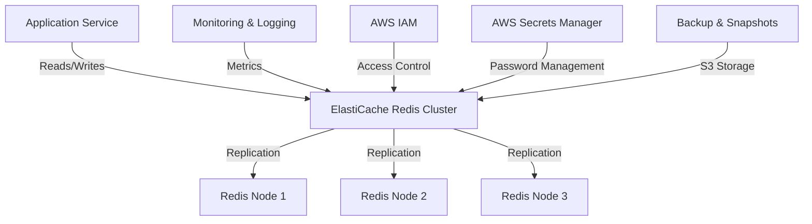

# ElastiCache Redis — AWS

## Overview and scope

The purpose of this document is to establish standards and best practices for the implementation and use of ElastiCache Redis within Xentic's AWS infrastructure. This standard aims to provide a consistent approach to leveraging Redis as an in-memory data store, ensuring optimal performance, security, and maintainability across various services.

### Audience

This document is intended for:
- Software Engineers
- DevOps Engineers
- Solution Architects
- Technical Leads
- System Administrators

### Scope

This standard covers:
- Configuration and deployment of ElastiCache Redis clusters
- Integration with Xentic services using the Java programming language
- Security best practices for Redis
- Monitoring and maintenance guidelines
- Performance optimization techniques

### Non-goals

This document does NOT cover:
- General Redis usage outside of AWS ElastiCache
- Other caching solutions or technologies
- Detailed application-level design patterns unrelated to Redis

### Glossary

| Term               | Definition                                                                 |
|--------------------|-----------------------------------------------------------------------------|
| ElastiCache        | A fully managed in-memory data store service provided by AWS.              |
| Redis              | An open-source, in-memory data structure store used as a database, cache, and message broker. |
| Cluster            | A collection of one or more Redis nodes that work together to provide high availability and scalability. |
| Node               | A single instance of a Redis server within a cluster.                      |
| Sharding           | The process of distributing data across multiple nodes to improve performance and scalability. |

### How this standard fits the Xentic platform

The integration of ElastiCache Redis into the Xentic platform is crucial for enhancing application performance by providing low-latency data access and reducing the load on primary databases. This standard aligns with Xentic's commitment to building scalable and efficient services, ensuring that all teams adhere to a unified approach when utilizing Redis.

By following these guidelines, Xentic aims to:
- Achieve consistency in Redis configurations across services
- Enhance collaboration among teams by standardizing integration practices
- Optimize resource utilization and minimize costs associated with AWS services

### Configuration Example

Below is an example of a basic ElastiCache Redis configuration in YAML format:

```yaml
redis:
  cluster:
    enabled: true
    node_count: 3
    engine: redis
    engine_version: 6.x
    parameter_group: default.redis6.x
    port: 6379
    security_group_ids:
      - sg-0123456789abcdef0
    subnet_group_name: my-redis-subnet-group
```

### Conclusion

Adhering to this standard will ensure that all Xentic services leverage ElastiCache Redis effectively, promoting best practices in performance, security, and maintainability.

## Standards and policies

1. **MUST** use the Java base package naming convention `com.xentic.<service>` for all Redis-related classes and configurations. This ensures consistency across the codebase and aligns with Xentic's package structure.

2. **MUST NOT** expose Redis instances directly to the public internet. All ElastiCache Redis clusters MUST be deployed within a private subnet to enhance security.

3. **MUST** configure Redis clusters with at least three nodes to ensure high availability and fault tolerance. This aligns with best practices for production environments.

4. **SHOULD** enable Redis cluster mode for sharding to distribute the load across multiple nodes. This can be configured in the YAML file as shown below:

    ```yaml
    redis:
      cluster:
        enabled: true
    ```

5. **MUST** use AWS Identity and Access Management (IAM) roles to control access to ElastiCache Redis. Ensure that only authorized services and users have permission to interact with the Redis clusters.

6. **MUST NOT** use the default Redis password. A strong password MUST be generated and configured to secure the Redis instances. This can be set in the parameter group:

    ```yaml
    redis:
      password: <strong_generated_password>
    ```

7. **SHOULD** implement Redis backup and snapshot policies to prevent data loss. Snapshots MUST be taken regularly and stored in S3 for recovery purposes.

8. **MUST** monitor Redis performance metrics using Amazon CloudWatch. Key metrics to monitor include:
   - CPU utilization
   - Memory usage
   - Evictions
   - Cache hits and misses

9. **MUST** use Redis data types appropriately to optimize memory usage. For example, use hashes for storing objects instead of strings when applicable.

10. **SHOULD** implement connection pooling in your Java applications to efficiently manage Redis connections. Use libraries such as Jedis or Lettuce with connection pooling capabilities.

    ```java
    JedisPoolConfig poolConfig = new JedisPoolConfig();
    poolConfig.setMaxTotal(128);
    poolConfig.setMaxIdle(128);
    poolConfig.setMinIdle(16);
    
    try (JedisPool pool = new JedisPool(poolConfig, "redis-cluster-endpoint", 6379)) {
        try (Jedis jedis = pool.getResource()) {
            // Use jedis instance
        }
    }
    ```

11. **MUST NOT** store sensitive information directly in Redis. Instead, use secure storage solutions such as AWS Secrets Manager or AWS Systems Manager Parameter Store.

12. **SHOULD** implement a cache eviction policy based on the specific use case. Common policies include Least Recently Used (LRU) or Time-to-Live (TTL) settings.

    ```yaml
    redis:
      eviction_policy: allkeys-lru
      maxmemory: 256mb
    ```

13. **MUST** document all Redis configurations and changes in the service's README or documentation repository to maintain transparency and facilitate troubleshooting.

14. **SHOULD** regularly review and audit Redis configurations and access logs to ensure compliance with security policies and to identify potential vulnerabilities.

15. **MUST** ensure that all Redis-related code is covered by unit tests, particularly when implementing caching logic, to maintain code quality and reliability.

By adhering to these standards and policies, Xentic can ensure a secure, performant, and maintainable implementation of ElastiCache Redis across its services.

## Architecture and design

The architecture of ElastiCache Redis within Xentic's AWS infrastructure is designed to provide high availability, scalability, and fault tolerance. The following sections outline the component diagram, data flows, integration points, and failure domains.

### Component Diagram



### Data Flows

1. **Application Service to Redis Cluster**: 
   - The application service interacts with the Redis cluster for data retrieval and storage. 
   - Data is written to and read from the Redis nodes, which handle replication and sharding.

2. **Monitoring and Logging**: 
   - Metrics from the Redis cluster are sent to Amazon CloudWatch for monitoring. 
   - Logs are collected for auditing and troubleshooting purposes.

3. **Access Control**: 
   - AWS IAM policies are applied to control which services and users can access the Redis cluster.
   - Secrets for Redis authentication are managed through AWS Secrets Manager.

4. **Backup and Snapshots**: 
   - Regular snapshots of the Redis data are taken and stored in Amazon S3 for disaster recovery.

### Integration Points

- **Java Application Integration**: 
  - Use libraries such as Jedis or Lettuce to interact with the Redis cluster.
  - Example integration code using Jedis:

    ```java
    Jedis jedis = new Jedis("redis-cluster-endpoint", 6379);
    jedis.set("key", "value");
    String value = jedis.get("key");
    ```

- **Monitoring Integration**: 
  - Integrate with Amazon CloudWatch to monitor key performance metrics.
  - Example CloudWatch metric configuration:

    ```yaml
    metrics:
      - name: CPUUtilization
        namespace: AWS/ElastiCache
      - name: CacheHits
        namespace: AWS/ElastiCache
    ```

- **Security Integration**: 
  - Implement IAM roles for access control and manage Redis passwords securely via AWS Secrets Manager.
  
### Failure Domains

1. **Node Failure**: 
   - If one Redis node fails, the cluster continues to operate using the remaining nodes. 
   - Ensure that the cluster is configured for automatic failover.

2. **Network Partitioning**: 
   - In the event of a network partition, the application should handle retries and fallbacks gracefully.
   - Implement connection pooling to manage transient failures.

3. **Data Loss**: 
   - Regular snapshots and backups to S3 mitigate the risk of data loss. 
   - Ensure that backup policies are in place and tested regularly.

4. **Security Breaches**: 
   - Monitor access logs and implement strict IAM policies to prevent unauthorized access.
   - Regularly review security configurations and update as necessary.

### Summary

The architecture of ElastiCache Redis within Xentic's AWS infrastructure is designed to ensure high availability, performance, and security. By adhering to the outlined data flows, integration points, and understanding potential failure domains, Xentic can effectively leverage Redis as an in-memory data store across its services.

## Configuration reference

### application.yml

The following is a comprehensive configuration reference for ElastiCache Redis in the `application.yml` format:

```yaml
redis:
  cluster:
    enabled: true
    node_count: 3
    engine: redis
    engine_version: 6.x
    parameter_group: default.redis6.x
    port: 6379
    security_group_ids:
      - sg-0123456789abcdef0
    subnet_group_name: my-redis-subnet-group
    password: <strong_generated_password>
    eviction_policy: allkeys-lru
    maxmemory: 256mb
    backup:
      enabled: true
      frequency: daily
      retention_days: 7
```

### Terraform Configuration

Below is an example of how to configure ElastiCache Redis using Terraform:

```hcl
resource "aws_elasticache_cluster" "redis" {
  cluster_id           = "my-redis-cluster"
  engine              = "redis"
  engine_version      = "6.x"
  node_type           = "cache.t3.micro"
  number_cache_nodes   = 3
  port                = 6379
  parameter_group_name = "default.redis6.x"
  subnet_group_name    = aws_elasticache_subnet_group.redis_subnet_group.name

  security_group_ids = [
    "sg-0123456789abcdef0"
  ]

  tags = {
    Name = "MyRedisCluster"
  }
}

resource "aws_elasticache_subnet_group" "redis_subnet_group" {
  name       = "my-redis-subnet-group"
  subnet_ids = ["subnet-0123456789abcdef0", "subnet-0123456789abcdef1"]

  tags = {
    Name = "MyRedisSubnetGroup"
  }
}
```

### Environment Variables

The following table outlines the required environment variables for configuring ElastiCache Redis, including default and production values:

| Environment Variable         | Default Value                  | Production Value                |
|------------------------------|--------------------------------|---------------------------------|
| `REDIS_CLUSTER_ENABLED`      | `true`                         | `true`                          |
| `REDIS_NODE_COUNT`           | `3`                           | `3`                             |
| `REDIS_ENGINE`               | `redis`                       | `redis`                         |
| `REDIS_ENGINE_VERSION`       | `6.x`                         | `6.x`                           |
| `REDIS_PORT`                 | `6379`                        | `6379`                          |
| `REDIS_SECURITY_GROUP_IDS`   | `sg-0123456789abcdef0`       | `sg-0123456789abcdef0`         |
| `REDIS_SUBNET_GROUP_NAME`    | `my-redis-subnet-group`      | `my-redis-subnet-group`        |
| `REDIS_PASSWORD`             | `<strong_generated_password>` | `<strong_generated_password>`   |
| `REDIS_EVICTION_POLICY`      | `allkeys-lru`                | `allkeys-lru`                  |
| `REDIS_MAXMEMORY`            | `256mb`                      | `256mb`                        |
| `REDIS_BACKUP_ENABLED`       | `false`                      | `true`                          |
| `REDIS_BACKUP_FREQUENCY`     | `none`                       | `daily`                         |
| `REDIS_BACKUP_RETENTION_DAYS`| `0`                          | `7`                             |

### Summary

By adhering to the configurations outlined above, Xentic services can effectively integrate ElastiCache Redis while ensuring compliance with best practices for performance, security, and maintainability.

## Implementation guide

Implementing ElastiCache Redis in Xentic's AWS environment involves several steps, from setting up the cluster to integrating it into your Java application. Below is a detailed guide to help you through the process.

### Step 1: Create an ElastiCache Redis Cluster

You can create an ElastiCache Redis cluster using the AWS Management Console, AWS CLI, or Terraform. Below is an example using Terraform:

```hcl
resource "aws_elasticache_cluster" "redis" {
  cluster_id           = "my-redis-cluster"
  engine              = "redis"
  engine_version      = "6.x"
  node_type           = "cache.t3.micro"
  number_cache_nodes   = 3
  port                = 6379
  parameter_group_name = "default.redis6.x"
  subnet_group_name    = aws_elasticache_subnet_group.redis_subnet_group.name

  security_group_ids = [
    "sg-0123456789abcdef0"
  ]

  tags = {
    Name = "MyRedisCluster"
  }
}

resource "aws_elasticache_subnet_group" "redis_subnet_group" {
  name       = "my-redis-subnet-group"
  subnet_ids = ["subnet-0123456789abcdef0", "subnet-0123456789abcdef1"]

  tags = {
    Name = "MyRedisSubnetGroup"
  }
}
```

### Step 2: Configure Security Groups

Ensure that your security group allows inbound traffic on the Redis port (default 6379) from your application servers. You can manage this in the AWS Management Console or via Terraform:

```hcl
resource "aws_security_group" "redis_sg" {
  name        = "redis-security-group"
  description = "Allow access to Redis"

  ingress {
    from_port   = 6379
    to_port     = 6379
    protocol    = "tcp"
    cidr_blocks = ["10.0.0.0/16"]  # Replace with your application subnet
  }

  egress {
    from_port   = 0
    to_port     = 0
    protocol    = "-1"
    cidr_blocks = ["0.0.0.0/0"]
  }
}
```

### Step 3: Java Application Integration

Use the Jedis library to connect to your Redis cluster. Below is an example of a Redis client configuration and usage in a Java application:

```java
import redis.clients.jedis.Jedis;
import redis.clients.jedis.JedisPool;
import redis.clients.jedis.JedisPoolConfig;

public class RedisClient {
    private static JedisPool jedisPool;

    static {
        JedisPoolConfig poolConfig = new JedisPoolConfig();
        poolConfig.setMaxTotal(128);
        poolConfig.setMaxIdle(128);
        poolConfig.setMinIdle(16);
        
        jedisPool = new JedisPool(poolConfig, "redis-cluster-endpoint", 6379);
    }

    public String getValue(String key) {
        try (Jedis jedis = jedisPool.getResource()) {
            return jedis.get(key);
        }
    }

    public void setValue(String key, String value) {
        try (Jedis jedis = jedisPool.getResource()) {
            jedis.set(key, value);
        }
    }
}
```

### Step 4: Configure Application Properties

Ensure your application is configured to connect to the Redis cluster. Below is an example of the `application.yml` configuration:

```yaml
redis:
  cluster:
    enabled: true
    node_count: 3
    engine: redis
    engine_version: 6.x
    parameter_group: default.redis6.x
    port: 6379
    security_group_ids:
      - sg-0123456789abcdef0
    subnet_group_name: my-redis-subnet-group
    password: <strong_generated_password>
    eviction_policy: allkeys-lru
    maxmemory: 256mb
    backup:
      enabled: true
      frequency: daily
      retention_days: 7
```

### Step 5: Implement Caching Logic

When implementing caching logic, ensure that you handle cache misses and data expiration appropriately. Here’s an example of a method that retrieves a value from Redis or computes it if it’s not present:

```java
public String getCachedValue(String key, Supplier<String> valueSupplier) {
    String value = getValue(key);
    if (value == null) {
        value = valueSupplier.get();
        setValue(key, value);
    }
    return value;
}
```

### Step 6: Testing and Validation

**MUST** ensure that all Redis-related code is covered by unit tests. Below is an example using JUnit:

```java
import org.junit.jupiter.api.Test;
import static org.junit.jupiter.api.Assertions.*;

public class RedisClientTest {
    private final RedisClient redisClient = new RedisClient();

    @Test
    public void testSetAndGetValue() {
        String key = "testKey";
        String value = "testValue";
        
        redisClient.setValue(key, value);
        String retrievedValue = redisClient.getValue(key);
        
        assertEquals(value, retrievedValue);
    }
}
```

### Summary

By following these steps, Xentic can effectively implement and integrate ElastiCache Redis into its services. This guide covers the creation of the Redis cluster, security configurations, Java application integration, caching logic, and testing, ensuring a robust and efficient caching solution.

## Security requirements

In the context of using ElastiCache Redis within Xentic's AWS infrastructure, it is imperative to establish a comprehensive security framework to mitigate potential threats. The following outlines the key security requirements, including threat modeling, authentication and authorization, secrets management, input validation, and audit logging.

### Threat Model Summary

1. **Data Breach**: Unauthorized access to sensitive data stored in Redis.
2. **Denial of Service (DoS)**: Attackers may attempt to overwhelm the Redis service, causing downtime.
3. **Data Corruption**: Malicious actors may attempt to modify or delete cached data.
4. **Misconfiguration**: Improperly configured security groups or access controls could expose Redis to the public internet.

### Authentication and Authorization

- **MUST** enable password authentication for Redis. The password must be strong and randomly generated.
- **MUST NOT** use default Redis configurations that expose the service without authentication.
- **MUST** implement IAM roles and policies to restrict access to the ElastiCache instance.
  
Example IAM Policy:

```json
{
  "Version": "2012-10-17",
  "Statement": [
    {
      "Effect": "Allow",
      "Action": "elasticache:*",
      "Resource": "*",
      "Condition": {
        "StringEquals": {
          "aws:SourceArn": "arn:aws:elasticache:us-east-1:123456789012:cluster:my-redis-cluster"
        }
      }
    }
  ]
}
```

### Secrets Management

- **MUST** store Redis passwords securely using AWS Secrets Manager or AWS Systems Manager Parameter Store.
- **MUST NOT** hard-code sensitive information in application code or configuration files.

Example of storing the Redis password in AWS Secrets Manager:

```bash
aws secretsmanager create-secret --name redisPassword --secret-string 'strong_generated_password'
```

### Input Validation

- **MUST** validate all keys and values being stored in Redis to prevent injection attacks.
- **MUST NOT** accept untrusted input directly from users without sanitization.

Example of input validation in Java:

```java
public void setValue(String key, String value) {
    if (!isValidKey(key) || !isValidValue(value)) {
        throw new IllegalArgumentException("Invalid key or value");
    }
    // Proceed to set value in Redis
}

private boolean isValidKey(String key) {
    return key != null && key.matches("^[a-zA-Z0-9_-]{1,64}$");
}

private boolean isValidValue(String value) {
    return value != null && value.length() <= 256; // Example length check
}
```

### Audit Logging

- **MUST** enable Redis slow log to monitor long-running queries and potential performance issues.
- **MUST** implement application-level logging for all interactions with Redis, including successful and failed access attempts.

Example of enabling slow log in Redis configuration:

```yaml
slowlog-log-slower-than: 10000  # Log queries that take longer than 10 seconds
slowlog-max-len: 128             # Maximum number of entries in the slow log
```

### Summary

By adhering to these security requirements, Xentic can significantly reduce the risk of vulnerabilities associated with ElastiCache Redis. Implementing strong authentication, proper secrets management, rigorous input validation, and comprehensive audit logging will ensure a secure and resilient caching solution.

## Testing strategy

To ensure the reliability and correctness of the integration with ElastiCache Redis, Xentic MUST implement a comprehensive testing strategy that includes unit tests, integration tests, and contract tests. The following outlines the requirements and examples for each testing type.

### Unit Tests

Unit tests MUST cover all methods in the Redis client class. The target coverage for unit tests SHOULD be at least 80%. Unit tests should be isolated, testing individual methods without dependencies on external systems.

Example unit test class using JUnit:

```java
import org.junit.jupiter.api.BeforeEach;
import org.junit.jupiter.api.Test;
import redis.clients.jedis.Jedis;
import redis.clients.jedis.JedisPool;

import static org.mockito.Mockito.*;

public class RedisClientUnitTest {
    private RedisClient redisClient;
    private JedisPool mockJedisPool;
    private Jedis mockJedis;

    @BeforeEach
    public void setUp() {
        mockJedisPool = mock(JedisPool.class);
        mockJedis = mock(Jedis.class);
        when(mockJedisPool.getResource()).thenReturn(mockJedis);
        redisClient = new RedisClient(mockJedisPool);
    }

    @Test
    public void testSetValue() {
        String key = "testKey";
        String value = "testValue";
        
        redisClient.setValue(key, value);
        
        verify(mockJedis).set(key, value);
    }

    @Test
    public void testGetValue() {
        String key = "testKey";
        String expectedValue = "testValue";
        when(mockJedis.get(key)).thenReturn(expectedValue);
        
        String actualValue = redisClient.getValue(key);
        
        assertEquals(expectedValue, actualValue);
    }
}
```

### Integration Tests

Integration tests MUST verify the interaction between the application and the Redis cluster. These tests should be run against a real or a mocked Redis instance. The target coverage for integration tests SHOULD be at least 70%.

Example integration test class:

```java
import org.junit.jupiter.api.AfterEach;
import org.junit.jupiter.api.BeforeEach;
import org.junit.jupiter.api.Test;
import redis.clients.jedis.Jedis;
import redis.clients.jedis.JedisPool;

import static org.junit.jupiter.api.Assertions.*;

public class RedisClientIntegrationTest {
    private RedisClient redisClient;
    private JedisPool jedisPool;

    @BeforeEach
    public void setUp() {
        jedisPool = new JedisPool("redis-cluster-endpoint", 6379);
        redisClient = new RedisClient(jedisPool);
    }

    @AfterEach
    public void tearDown() {
        try (Jedis jedis = jedisPool.getResource()) {
            jedis.flushDB(); // Clear the database after each test
        }
    }

    @Test
    public void testSetAndGetValueIntegration() {
        String key = "integrationKey";
        String value = "integrationValue";
        
        redisClient.setValue(key, value);
        String retrievedValue = redisClient.getValue(key);
        
        assertEquals(value, retrievedValue);
    }
}
```

### Contract Tests

Contract tests MUST ensure that the expected behavior of the Redis client aligns with the service contracts defined for the application. These tests should validate the inputs and outputs of the Redis client methods against predefined contracts.

Example contract test using Pact:

```java
import au.com.dius.pact.consumer.junit5.PactConsumerTestExt;
import au.com.dius.pact.consumer.junit5.PactFolder;
import org.junit.jupiter.api.Test;
import org.junit.jupiter.api.extension.ExtendWith;

@ExtendWith(PactConsumerTestExt.class)
@PactFolder("pacts")
public class RedisClientContractTest {

    @Test
    void testRedisContract() {
        // Define the contract and verify the interactions
    }
}
```

### Coverage Targets

| Test Type       | Coverage Target |
|------------------|-----------------|
| Unit Tests       | 80%             |
| Integration Tests | 70%             |
| Contract Tests   | 100%            |

### Summary

Xentic MUST implement a robust testing strategy that includes unit, integration, and contract tests to ensure the reliability and correctness of the Redis integration. By adhering to the coverage targets and utilizing the provided examples, the development team can maintain high-quality standards in their codebase.

## Observability and operations

To ensure the effective monitoring and management of ElastiCache Redis within Xentic's AWS infrastructure, a comprehensive observability and operations framework MUST be established. This framework includes metrics, logs, traces, dashboards, alerts, and SLOs, along with on-call runbook steps for incident management.

### Metrics

Xentic MUST collect the following key metrics from ElastiCache Redis:

| Metric                          | Description                                                  |
|---------------------------------|--------------------------------------------------------------|
| `CacheHits`                     | Number of successful cache hits.                            |
| `CacheMisses`                   | Number of cache misses, indicating data not found in cache. |
| `Evictions`                     | Number of keys removed from cache due to memory pressure.    |
| `Latency`                       | Time taken for operations (GET, SET, etc.) in milliseconds. |
| `MemoryUsage`                   | Total memory used by Redis in bytes.                        |
| `ConnectedClients`              | Number of clients connected to the Redis instance.          |

Metrics MUST be visualized using AWS CloudWatch dashboards. An example configuration for a CloudWatch dashboard is as follows:

```yaml
Resources:
  RedisMetricsDashboard:
    Type: 'AWS::CloudWatch::Dashboard'
    Properties:
      DashboardName: "RedisMetricsDashboard"
      DashboardBody: !Sub |
        {
          "widgets": [
            {
              "type": "metric",
              "x": 0,
              "y": 0,
              "width": 6,
              "height": 6,
              "properties": {
                "metrics": [
                  [ "AWS/ElastiCache", "CacheHits", "CacheClusterId", "${RedisClusterId}" ],
                  [ "AWS/ElastiCache", "CacheMisses", "CacheClusterId", "${RedisClusterId}" ]
                ],
                "period": 300,
                "stat": "Sum",
                "title": "Cache Hits and Misses"
              }
            }
          ]
        }
```

### Logs

Xentic MUST enable Redis logging for operational insights. The following logs should be captured:

- **General Logs**: For monitoring command executions and errors.
- **Slow Logs**: To identify long-running queries that may affect performance.

Example configuration for enabling logging in Redis:

```yaml
loglevel: notice
logfile: "/var/log/redis/redis-server.log"
slowlog-log-slower-than: 10000  # Log queries that take longer than 10 seconds
slowlog-max-len: 128             # Maximum number of entries in the slow log
```

### Traces

Distributed tracing MUST be implemented to monitor the interactions between services using Redis. Xentic SHOULD use AWS X-Ray or OpenTelemetry for this purpose. The following steps outline the integration:

1. **Instrument Redis Client**: Modify the Redis client to include tracing information.
2. **Capture Traces**: Use tracing libraries to capture and send trace data to the tracing system.

Example of tracing integration in Java:

```java
import io.opentelemetry.api.trace.Tracer;
import io.opentelemetry.api.GlobalOpenTelemetry;

public class RedisClient {
    private final Tracer tracer = GlobalOpenTelemetry.getTracer("com.xentic.redis");

    public void setValue(String key, String value) {
        var span = tracer.spanBuilder("setValue").startSpan();
        try (var scope = span.makeCurrent()) {
            // Redis set operation
        } finally {
            span.end();
        }
    }
}
```

### Dashboards

Xentic MUST create dashboards to visualize Redis metrics and logs. AWS CloudWatch dashboards or Grafana can be used to aggregate and display relevant metrics. 

A sample dashboard layout might include:

- Cache performance (hits, misses)
- Memory usage trends
- Eviction rates
- Latency statistics

### Alerts

Alerts MUST be configured to notify the team of critical issues. The following alert thresholds should be established:

- **High Cache Miss Rate**: Alert if the cache miss rate exceeds 10% over a 5-minute period.
- **High Latency**: Alert if the average latency exceeds 100ms for a sustained period.
- **Memory Usage**: Alert if memory usage exceeds 80% of allocated memory.

Example CloudWatch alarm configuration:

```yaml
Resources:
  HighCacheMissRateAlarm:
    Type: 'AWS::CloudWatch::Alarm'
    Properties:
      AlarmName: "HighCacheMissRate"
      MetricName: "CacheMisses"
      Namespace: "AWS/ElastiCache"
      Statistic: "Sum"
      Period: 300
      EvaluationPeriods: 1
      Threshold: 10
      ComparisonOperator: "GreaterThanThreshold"
      AlarmActions: 
        - !Ref NotificationTopic
```

### SLOs

Service Level Objectives (SLOs) MUST be defined to measure the reliability of the caching service. Suggested SLOs include:

| SLO Name              | Objective                     | Measurement Method                      |
|----------------------|-------------------------------|-----------------------------------------|
| Cache Hit Rate       | ≥ 90%                         | (CacheHits / (CacheHits + CacheMisses)) * 100 |
| Latency              | ≤ 100ms                       | Average latency for all operations      |
| Availability          | ≥ 99.9%                       | Uptime percentage over a rolling 30-day period |

### On-Call Runbook Steps

In the event of an incident related to ElastiCache Redis, the following runbook steps MUST be followed:

1. **Identify the Issue**: Check CloudWatch dashboards for alerts and metrics.
2. **Investigate Logs**: Review Redis logs for errors or slow queries.
3. **Check Redis Health**: Use AWS Console to check the health of the Redis cluster.
4. **Scale Up Resources**: If memory usage is high, consider scaling the Redis cluster.
5. **Notify the Team**: If the issue persists, escalate to the on-call engineer and notify the team via the communication channel.
6. **Document the Incident**: After resolution, document the incident for future reference and improvement.

### Summary

By implementing a robust observability and operations framework, Xentic can ensure that its ElastiCache Redis instances are monitored effectively. This includes collecting metrics, logging, tracing, creating dashboards, setting alerts, defining SLOs, and having a clear runbook for incident management. Adhering to these guidelines will enhance the reliability and performance of the caching solution.

## Migration and versioning

Xentic MUST establish clear migration and versioning policies for ElastiCache Redis to ensure smooth transitions between versions and minimize disruptions to service. The following guidelines outline the upgrade paths, deprecation policy, backward compatibility, and rollback procedures.

### Upgrade Paths

1. **Minor Version Upgrades**: 
   - Xentic SHOULD regularly upgrade to the latest minor versions of Redis to benefit from performance improvements and security patches.
   - Minor upgrades MUST NOT introduce breaking changes.
   - Example upgrade command using AWS CLI:
     ```bash
     aws elasticache modify-replication-group --replication-group-id my-replication-group --engine-version 6.2.6
     ```

2. **Major Version Upgrades**:
   - Major version upgrades MUST be planned and executed with caution as they may introduce breaking changes.
   - Xentic SHOULD perform thorough testing in a staging environment before applying major upgrades in production.
   - Example of a major version upgrade:
     ```bash
     aws elasticache modify-replication-group --replication-group-id my-replication-group --engine-version 7.0.0
     ```

### Deprecation Policy

- Xentic MUST adhere to a deprecation policy that provides sufficient notice for any features or versions that will be deprecated.
- A minimum notice period of **6 months** MUST be given before deprecating any Redis features or versions.
- Deprecated features MUST continue to function until the end of the notice period, after which they will be removed.

### Backward Compatibility

- Xentic MUST ensure that new versions of Redis maintain backward compatibility with existing applications.
- Any changes that could affect compatibility MUST be documented in the release notes.
- Xentic SHOULD implement feature toggles to allow gradual migration to new features without breaking existing functionality.

### Rollback Procedures

In the event of a failed upgrade or critical issue post-upgrade, Xentic MUST have a rollback process in place:

1. **Snapshot Backups**: 
   - Xentic MUST take snapshots of the Redis cluster before performing any upgrades. This allows for restoring the previous state if necessary.
   - Example command to create a snapshot:
     ```bash
     aws elasticache create-snapshot --snapshot-name my-snapshot --replication-group-id my-replication-group
     ```

2. **Rollback Steps**:
   - If an upgrade fails, Xentic MUST follow these steps:
     1. Identify the issue using logs and metrics.
     2. Restore the previous snapshot using the following command:
        ```bash
        aws elasticache restore-cache-cluster --snapshot-name my-snapshot
        ```
     3. Monitor the cluster for stability post-rollback.
     4. Document the incident and review the upgrade process for improvements.

### Versioning Strategy

Xentic MUST adopt a versioning strategy that aligns with Redis's versioning scheme:

| Version Type       | Description                                   |
|--------------------|-----------------------------------------------|
| Major Version      | Introduces breaking changes.                  |
| Minor Version      | Adds functionality in a backward-compatible manner. |
| Patch Version      | Includes bug fixes and performance improvements. |

### Documentation

- Xentic MUST maintain comprehensive documentation for each version of Redis used within the organization.
- Documentation MUST include:
  - Release notes highlighting new features, bug fixes, and breaking changes.
  - Migration guides for upgrading from one version to another.
  - Compatibility matrices to assist in determining the impact of version changes.

### Summary

By adhering to the outlined migration and versioning policies, Xentic can ensure a stable and reliable Redis environment. This includes establishing clear upgrade paths, a deprecation policy, maintaining backward compatibility, implementing rollback procedures, and documenting version changes effectively. Following these guidelines will minimize disruptions and enhance the overall reliability of the caching solution.

## FAQ, anti-patterns, and checklists

### FAQ

1. **What is ElastiCache Redis?**
   - ElastiCache Redis is a fully managed, in-memory caching service provided by AWS that supports Redis, an open-source, in-memory data structure store.

2. **How do I connect to an ElastiCache Redis instance?**
   - Use the Redis client library appropriate for your programming language, specifying the endpoint provided by AWS. Example in Java:
     ```java
     Jedis jedis = new Jedis("my-cache-endpoint.xxxxxx.0001.use1.cache.amazonaws.com");
     ```

3. **What are the benefits of using ElastiCache Redis?**
   - Improved performance, reduced latency, scalability, and support for various data structures.

4. **How can I monitor ElastiCache Redis performance?**
   - Use AWS CloudWatch to monitor key metrics such as cache hits, misses, latency, and memory usage.

5. **What is the maximum size for a Redis key?**
   - The maximum size for a Redis key is 512 MB.

6. **How do I handle Redis data persistence?**
   - Xentic MUST use Redis snapshots (RDB) or append-only files (AOF) based on the application’s data durability requirements.

7. **Can I use ElastiCache Redis for session storage?**
   - Yes, ElastiCache Redis is suitable for session storage due to its low latency and high throughput.

8. **What happens if my Redis instance runs out of memory?**
   - Redis will evict keys based on the configured eviction policy. Xentic MUST choose an appropriate eviction policy based on use case.

9. **How do I scale my ElastiCache Redis cluster?**
   - Use the AWS Management Console or AWS CLI to modify the replication group and add or remove nodes as necessary.

10. **What security measures should I implement for ElastiCache Redis?**
    - Xentic MUST enable encryption in transit and at rest, use VPCs, and configure security groups to restrict access.

### Anti-Patterns

| Anti-Pattern                      | Description                                                                 |
|-----------------------------------|-----------------------------------------------------------------------------|
| Using Redis as a Primary Database | Redis MUST NOT be used as a primary database; it is designed for caching.  |
| Ignoring Data Expiration          | Keys MUST have expiration set to prevent stale data accumulation.           |
| Overloading a Single Instance      | Xentic MUST NOT overload a single Redis instance; use clustering for scale. |
| Not Monitoring Performance         | Failing to monitor Redis metrics can lead to unnoticed performance issues.  |
| Hardcoding Configuration           | Configuration values MUST be externalized and managed through environment variables or config files. |

### Pre-Merge Checklist

- [ ] Code adheres to Xentic's Java package naming conventions (`com.xentic.<service>`).
- [ ] All Redis interactions are properly instrumented for tracing.
- [ ] Configuration files are updated with any new Redis settings.
- [ ] Unit tests cover all new Redis-related functionalities.
- [ ] Documentation is updated to reflect changes in Redis usage.

### Production Checklist

- [ ] Ensure Redis cluster is properly configured and monitored.
- [ ] Confirm that all necessary security measures are in place.
- [ ] Validate that all alerts are configured and tested.
- [ ] Review SLOs and ensure they are achievable with current Redis setup.
- [ ] Perform a final review of logs and metrics before deployment.
