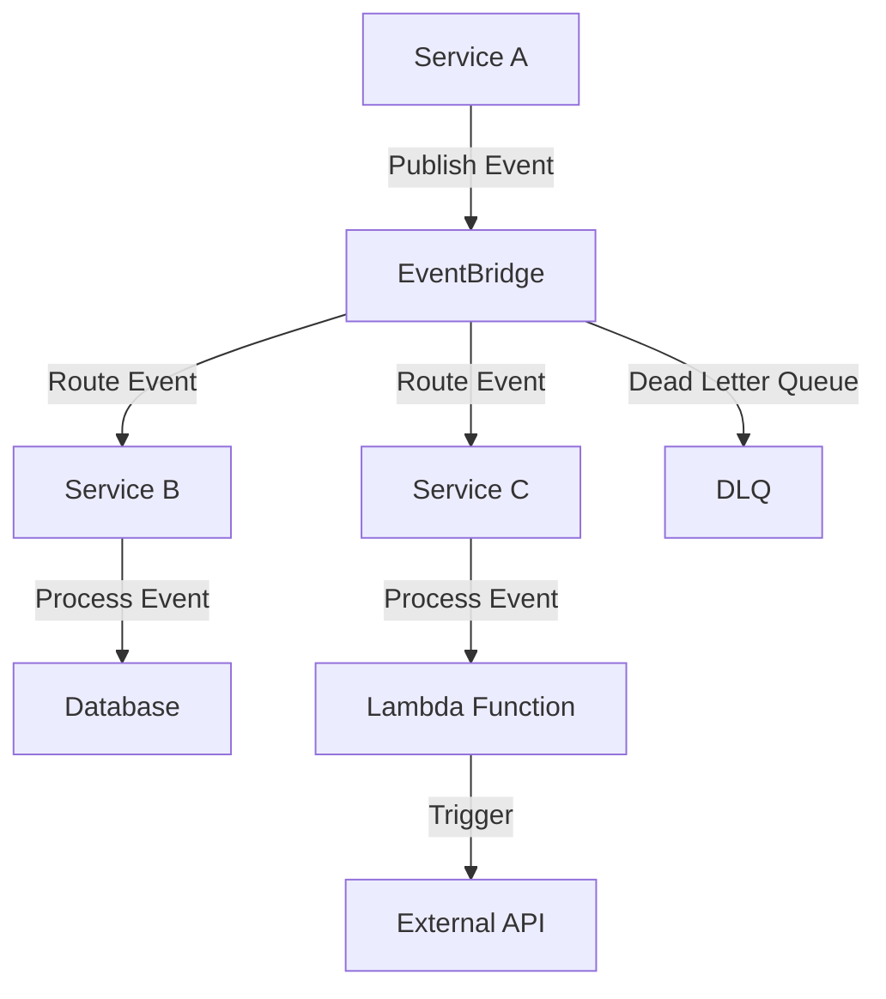

# EventBridge Event Standards — AWS

## Overview and scope

The purpose of this document is to establish standards for the design, implementation, and management of AWS EventBridge events within the Xentic platform. These standards aim to ensure consistency, reliability, and maintainability of event-driven architectures across various services.

### Audience

This document is intended for:
- Software Engineers
- Solution Architects
- DevOps Engineers
- Technical Leads

### Scope

The scope of this document includes:
- Event schema design
- Event naming conventions
- Event routing and filtering
- Security and access control measures
- Monitoring and logging practices

### Non-goals

This document does NOT cover:
- Implementation details specific to individual services
- Non-AWS event systems or architectures
- General AWS service usage outside of EventBridge

### Glossary

| Term               | Definition                                                                 |
|--------------------|-----------------------------------------------------------------------------|
| Event              | A notification that something has happened in a system.                    |
| EventBridge        | A serverless event bus service provided by AWS to connect applications.    |
| Schema             | The structure that defines the format and content of an event.             |
| Rule               | A condition that determines how events are processed and routed.           |
| Target             | The AWS service or resource that will receive the event for processing.    |

### How This Standard Fits the Xentic Platform

The EventBridge Event Standards are critical for ensuring that event-driven components within the Xentic platform communicate effectively and efficiently. By adhering to these standards, teams can achieve the following:

- **Interoperability**: Services developed by different teams can seamlessly integrate through a common event schema.
- **Scalability**: A consistent approach to event handling allows for easier scaling of services as demand grows.
- **Maintainability**: Clear guidelines reduce complexity and improve the maintainability of event-driven systems.

### Example Event Schema

```json
{
  "source": "com.xentic.<service>",
  "detail-type": "OrderCreated",
  "detail": {
    "orderId": "12345",
    "customerId": "67890",
    "items": [
      {
        "itemId": "abc",
        "quantity": 2
      }
    ],
    "totalAmount": 99.99
  },
  "resources": [
    "arn:aws:events:us-east-1:123456789012:rule/MyRule"
  ]
}
```

### Key Standards

- **Event Naming Convention**: Events MUST follow the format `ActionType` (e.g., `OrderCreated`, `UserRegistered`).
- **Schema Versioning**: Events MUST include a version field to manage changes over time.
- **Security**: Access to EventBridge resources MUST be controlled using IAM roles and policies, ensuring that only authorized services can publish or subscribe to events.

By adhering to these standards, Xentic can ensure a robust and efficient event-driven architecture that supports the needs of its various services and applications.

## Standards and policies

1. **Event Structure**: All events MUST conform to a defined structure that includes the following mandatory fields:
   - `source`: The source of the event, which MUST follow the format `com.xentic.<service>`.
   - `detail-type`: A string that identifies the type of event.
   - `detail`: A JSON object containing the event-specific data.
   - `resources`: An array of ARNs that identify the resources involved in the event.

   Example:
   ```json
   {
     "source": "com.xentic.order",
     "detail-type": "OrderCreated",
     "detail": {
       "orderId": "12345",
       "customerId": "67890"
     },
     "resources": [
       "arn:aws:events:us-east-1:123456789012:rule/MyRule"
     ]
   }
   ```

2. **Event Naming Convention**: Events MUST use PascalCase for naming. The format MUST be `ActionType` (e.g., `OrderCreated`, `UserRegistered`). 

3. **Schema Versioning**: Events MUST include a `version` field in the `detail` object to manage backward compatibility. The versioning format MUST be `v1`, `v2`, etc.

   Example:
   ```json
   {
     "detail": {
       "version": "v1",
       "orderId": "12345"
     }
   }
   ```

4. **Event Routing**: Event rules MUST be defined clearly to ensure proper routing of events. Each rule MUST specify a target and the conditions under which it triggers.

   Example Rule in YAML:
   ```yaml
   RuleName: "OrderCreatedRule"
   EventPattern:
     source:
       - "com.xentic.order"
     detail-type:
       - "OrderCreated"
   Targets:
     - Id: "LambdaFunction"
       Arn: "arn:aws:lambda:us-east-1:123456789012:function:ProcessOrder"
   ```

5. **Security and Access Control**: Access to EventBridge MUST be restricted using IAM roles. Each service MUST have a dedicated IAM role with the least privilege required to publish or subscribe to events.

   Example IAM Policy:
   ```json
   {
     "Version": "2012-10-17",
     "Statement": [
       {
         "Effect": "Allow",
         "Action": [
           "events:PutEvents",
           "events:DescribeRule"
         ],
         "Resource": "arn:aws:events:us-east-1:123456789012:rule/*"
       }
     ]
   }
   ```

6. **Error Handling**: All event processing MUST include error handling mechanisms. Failed events MUST be logged, and retries MUST be implemented using dead-letter queues (DLQs).

7. **Monitoring and Logging**: All events MUST be monitored using AWS CloudWatch. Custom metrics MUST be created to track the success and failure rates of event processing.

8. **Testing and Validation**: Events MUST be validated against their schemas before being sent to EventBridge. A schema validation tool MUST be used to ensure compliance.

9. **Documentation**: Each event type MUST be documented in the internal wiki at `https://docs.internal.xentic.io/event-schemas`. Documentation MUST include:
   - Event name
   - Description
   - Schema
   - Example payloads

10. **Version Deprecation**: When deprecating an event version, a deprecation notice MUST be communicated to all stakeholders at least 30 days in advance, and the old version MUST remain available during the transition period.

11. **Event Size Limitations**: Events MUST not exceed the maximum size limit of 256 KB. If an event payload exceeds this limit, it MUST be split into multiple events or stored in an external service like S3.

12. **Compliance**: All events MUST comply with Xentic's data governance policies, ensuring that sensitive information is handled according to regulatory requirements.

By adhering to these standards and policies, Xentic ensures a robust, secure, and maintainable event-driven architecture that meets the needs of its services and applications.

## Architecture and design

The architecture of the AWS EventBridge event-driven system at Xentic is designed to facilitate seamless communication between various services while ensuring reliability and scalability. Below is a component diagram that illustrates the key components and their interactions.



### Data Flows

- **Event Production**: Services publish events to EventBridge. Each event must include the mandatory fields as defined in the standards.
- **Event Routing**: EventBridge routes events based on defined rules. Each rule specifies the event pattern and the target services that should receive the event.
- **Event Processing**: Target services process the events and may interact with databases or external APIs as needed.
- **Error Handling**: If an event fails to be processed, it is sent to a Dead Letter Queue (DLQ) for further investigation.

### Integration Points

- **Service A**: Publishes events to EventBridge.
- **EventBridge**: Acts as the central hub for event routing.
- **Service B and Service C**: Subscribe to events from EventBridge and perform necessary actions.
- **Lambda Function**: Can be triggered by events to perform asynchronous processing.
- **DLQ**: Captures failed events for later analysis.

### Failure Domains

- **EventBridge**: If EventBridge experiences downtime, events will not be routed, causing a potential backlog. Services MUST implement retry mechanisms to handle transient failures.
- **Service B and Service C**: If either service fails to process an event, the event should be sent to the DLQ. Monitoring should be in place to alert on failures.
- **External API**: If an external API is unreachable, the Lambda function should handle the error gracefully and log the incident.

### Configuration Examples

#### Event Rule Configuration (YAML)

```yaml
RuleName: "UserRegisteredRule"
EventPattern:
  source:
    - "com.xentic.user"
  detail-type:
    - "UserRegistered"
Targets:
  - Id: "ServiceB"
    Arn: "arn:aws:lambda:us-east-1:123456789012:function:ProcessUserRegistration"
```

#### Dead Letter Queue Configuration (HCL)

```hcl
resource "aws_sqs_queue" "event_dlq" {
  name = "event-dlq"
  message_retention_seconds = 86400
}
```

### Summary of Best Practices

- **Event Schema**: MUST be well-defined and documented.
- **Error Handling**: MUST include DLQs for failed events.
- **Monitoring**: MUST use CloudWatch for tracking event processing metrics.
- **Documentation**: MUST maintain comprehensive documentation for each event type.

By adhering to these architectural principles and design standards, the Xentic platform ensures a robust event-driven architecture capable of handling various service interactions efficiently and effectively.

## Configuration reference

### application.yml Configuration

The following is a sample configuration for an application using AWS EventBridge in a Spring Boot application.

```yaml
spring:
  cloud:
    aws:
      eventbridge:
        enabled: true
        region: us-east-1
        endpoint: https://events.us-east-1.amazonaws.com
        credentials:
          access-key: YOUR_AWS_ACCESS_KEY
          secret-key: YOUR_AWS_SECRET_KEY

eventbridge:
  default:
    event-bus-name: "default-event-bus"
    retry-policy:
      max-attempts: 3
      delay: 1000  # milliseconds
      backoff-rate: 2.0
    dead-letter-queue:
      arn: "arn:aws:sqs:us-east-1:123456789012:event-dlq"
```

### Terraform Configuration

The following Terraform configuration sets up an EventBridge rule and a dead-letter queue.

```hcl
provider "aws" {
  region = "us-east-1"
}

resource "aws_sqs_queue" "event_dlq" {
  name = "event-dlq"
  message_retention_seconds = 86400
}

resource "aws_cloudwatch_event_rule" "order_created_rule" {
  name = "OrderCreatedRule"
  event_pattern = jsonencode({
    "source" = ["com.xentic.order"],
    "detail-type" = ["OrderCreated"]
  })
}

resource "aws_cloudwatch_event_target" "process_order" {
  rule = aws_cloudwatch_event_rule.order_created_rule.name
  arn  = "arn:aws:lambda:us-east-1:123456789012:function:ProcessOrder"
}

resource "aws_lambda_permission" "allow_eventbridge" {
  statement_id  = "AllowExecutionFromEventBridge"
  action        = "lambda:InvokeFunction"
  function_name = "ProcessOrder"
  principal     = "events.amazonaws.com"
  source_arn    = aws_cloudwatch_event_rule.order_created_rule.arn
}
```

### Environment Variables

The following table outlines the required environment variables for configuring AWS EventBridge:

| Environment Variable            | Default Value                   | Production Value                   |
|----------------------------------|----------------------------------|------------------------------------|
| AWS_ACCESS_KEY_ID               | YOUR_AWS_ACCESS_KEY            | [REDACTED]                        |
| AWS_SECRET_ACCESS_KEY           | YOUR_AWS_SECRET_KEY            | [REDACTED]                        |
| AWS_REGION                       | us-east-1                      | us-east-1                          |
| EVENT_BUS_NAME                   | default-event-bus              | production-event-bus               |
| DLQ_ARN                         | arn:aws:sqs:us-east-1:123456789012:event-dlq | [REDACTED]                        |

### EventBridge Rule Configuration (YAML)

The following YAML configuration defines an EventBridge rule for the `UserRegistered` event.

```yaml
RuleName: "UserRegisteredRule"
EventPattern:
  source:
    - "com.xentic.user"
  detail-type:
    - "UserRegistered"
Targets:
  - Id: "ServiceB"
    Arn: "arn:aws:lambda:us-east-1:123456789012:function:ProcessUserRegistration"
```

### Dead Letter Queue Configuration (HCL)

The following HCL configuration creates a dead-letter queue for handling failed events.

```hcl
resource "aws_sqs_queue" "event_dlq" {
  name = "event-dlq"
  message_retention_seconds = 86400
}
```

### Summary of Configuration Best Practices

- **Use Environment Variables**: Sensitive information like AWS credentials MUST be stored in environment variables and not hardcoded in the application.
- **Use Default Values**: Default configurations MUST be provided for local development, while production configurations MUST be securely managed.
- **Document Configuration**: All configurations MUST be documented to ensure clarity and maintainability across teams.

By following these configuration standards, Xentic ensures that applications are set up correctly to interact with AWS EventBridge, facilitating a robust event-driven architecture.

## Implementation guide

To implement AWS EventBridge at Xentic, follow the step-by-step guide below. This guide includes code examples and configurations to ensure a smooth integration.

### Step 1: Create an EventBridge Event Bus

First, create an EventBridge event bus to handle your events. You can do this via the AWS Management Console or using Terraform.

#### Terraform Configuration

```hcl
resource "aws_cloudwatch_event_bus" "xentic_event_bus" {
  name = "xentic-event-bus"
}
```

### Step 2: Define Event Schema

Define the schema for the events you will be publishing. Use JSON Schema for validation.

#### Example Event Schema

```json
{
  "$schema": "http://json-schema.org/draft-07/schema#",
  "title": "UserRegistered",
  "type": "object",
  "properties": {
    "userId": {
      "type": "string"
    },
    "email": {
      "type": "string",
      "format": "email"
    },
    "timestamp": {
      "type": "string",
      "format": "date-time"
    }
  },
  "required": ["userId", "email", "timestamp"]
}
```

### Step 3: Publish Events to EventBridge

Implement the logic to publish events to the EventBridge event bus. Below is an example in Java using the AWS SDK.

#### Java Code Example

```java
package com.xentic.user;

import software.amazon.awssdk.services.eventbridge.EventBridgeClient;
import software.amazon.awssdk.services.eventbridge.model.PutEventsRequest;
import software.amazon.awssdk.services.eventbridge.model.PutEventsResponse;
import software.amazon.awssdk.services.eventbridge.model.EventBridgeEvent;

public class EventPublisher {

    private final EventBridgeClient eventBridgeClient;

    public EventPublisher(EventBridgeClient eventBridgeClient) {
        this.eventBridgeClient = eventBridgeClient;
    }

    public void publishUserRegisteredEvent(String userId, String email) {
        EventBridgeEvent event = EventBridgeEvent.builder()
                .source("com.xentic.user")
                .detailType("UserRegistered")
                .detail("{\"userId\":\"" + userId + "\", \"email\":\"" + email + "\", \"timestamp\":\"" + System.currentTimeMillis() + "\"}")
                .eventBusName("xentic-event-bus")
                .build();

        PutEventsRequest request = PutEventsRequest.builder()
                .entries(event)
                .build();

        PutEventsResponse response = eventBridgeClient.putEvents(request);
        if (response.failedEntryCount() > 0) {
            // Handle failure
        }
    }
}
```

### Step 4: Create Event Rules

Define rules to route events to specific targets based on their type. Below is a YAML configuration for an EventBridge rule.

#### Event Rule Configuration (YAML)

```yaml
RuleName: "UserRegisteredRule"
EventPattern:
  source:
    - "com.xentic.user"
  detail-type:
    - "UserRegistered"
Targets:
  - Id: "ProcessUserRegistration"
    Arn: "arn:aws:lambda:us-east-1:123456789012:function:ProcessUserRegistration"
```

### Step 5: Set Up Lambda Function

Create a Lambda function that will process the events. Below is a simple example in Java.

#### Java Lambda Function Example

```java
package com.xentic.user;

import com.amazonaws.services.lambda.runtime.Context;
import com.amazonaws.services.lambda.runtime.RequestHandler;
import com.fasterxml.jackson.databind.ObjectMapper;

public class ProcessUserRegistration implements RequestHandler<String, String> {

    private final ObjectMapper objectMapper = new ObjectMapper();

    @Override
    public String handleRequest(String input, Context context) {
        try {
            UserRegisteredEvent event = objectMapper.readValue(input, UserRegisteredEvent.class);
            // Process the event (e.g., save to database)
            return "Success";
        } catch (Exception e) {
            // Handle error
            return "Error processing event";
        }
    }

    public static class UserRegisteredEvent {
        public String userId;
        public String email;
        public String timestamp;
    }
}
```

### Step 6: Configure Dead Letter Queue (DLQ)

Set up a Dead Letter Queue to capture failed events. Below is the HCL configuration.

#### Dead Letter Queue Configuration (HCL)

```hcl
resource "aws_sqs_queue" "event_dlq" {
  name = "event-dlq"
  message_retention_seconds = 86400
}
```

### Step 7: Monitor and Log Events

Implement monitoring using CloudWatch to track the success and failure of event processing. Set up alerts for any failures.

### Summary of Implementation Steps

- **Create Event Bus**: Use Terraform to create an EventBridge event bus.
- **Define Event Schema**: Use JSON Schema for event validation.
- **Publish Events**: Implement Java code to publish events to EventBridge.
- **Create Event Rules**: Define rules in YAML for routing events.
- **Set Up Lambda**: Create a Lambda function to process events.
- **Configure DLQ**: Set up a Dead Letter Queue for failed events.
- **Monitor Events**: Utilize CloudWatch for monitoring and alerts.

By following these steps, Xentic can effectively implement AWS EventBridge, ensuring a robust event-driven architecture that meets organizational standards.

## Security requirements

### Threat Model Summary

Xentic's implementation of AWS EventBridge must adhere to stringent security requirements to mitigate risks associated with event-driven architectures. The primary threats include unauthorized access, data breaches, and denial-of-service attacks. The following measures must be implemented:

- **Authentication and Authorization**: Ensure that only authenticated and authorized services can publish and consume events.
- **Data Integrity**: Validate the integrity of the data being processed to prevent injection attacks or data corruption.
- **Confidentiality**: Protect sensitive information in transit and at rest to prevent data leaks.

### Authentication and Authorization

- **AWS IAM Roles**: Use AWS Identity and Access Management (IAM) roles to control access to EventBridge and associated resources. Each service must have a dedicated role with the principle of least privilege.
  
  Example IAM policy for EventBridge publishing:

  ```json
  {
    "Version": "2012-10-17",
    "Statement": [
      {
        "Effect": "Allow",
        "Action": "events:PutEvents",
        "Resource": "arn:aws:events:us-east-1:123456789012:event-bus/xentic-event-bus"
      }
    ]
  }
  ```

- **Service-to-Service Authentication**: Use AWS SigV4 signing for service-to-service communication to ensure that requests are authenticated.

### Secrets Management

- **AWS Secrets Manager**: Store sensitive information, such as API keys and database credentials, in AWS Secrets Manager. Secrets must not be hardcoded in the application.

  Example configuration for accessing a secret:

  ```java
  import software.amazon.awssdk.services.secretsmanager.SecretsManagerClient;
  import software.amazon.awssdk.services.secretsmanager.model.GetSecretValueRequest;
  import software.amazon.awssdk.services.secretsmanager.model.GetSecretValueResponse;

  public String getSecret(String secretName) {
      SecretsManagerClient client = SecretsManagerClient.create();
      GetSecretValueRequest request = GetSecretValueRequest.builder()
              .secretId(secretName)
              .build();
      GetSecretValueResponse response = client.getSecretValue(request);
      return response.secretString();
  }
  ```

### Input Validation

- **Schema Validation**: All incoming events must be validated against a predefined JSON schema to ensure they meet the expected structure and data types. Use libraries such as `json-schema-validator` in Java.

  Example validation code:

  ```java
  import com.github.fge.jsonschema.main.JsonSchema;
  import com.github.fge.jsonschema.main.JsonSchemaFactory;

  public void validateEvent(String eventJson) {
      JsonSchemaFactory factory = JsonSchemaFactory.byDefault();
      JsonSchema schema = factory.getJsonSchema("path/to/schema.json");
      ProcessingReport report = schema.validate(JsonLoader.fromString(eventJson));
      if (!report.isSuccess()) {
          throw new IllegalArgumentException("Invalid event structure");
      }
  }
  ```

- **Rate Limiting**: Implement rate limiting to prevent abuse and denial-of-service attacks by limiting the number of requests from a single source.

### Audit Logging

- **CloudTrail Integration**: Enable AWS CloudTrail to log all API calls made to EventBridge. This ensures that all actions are recorded for auditing purposes.

  Example CloudTrail configuration:

  ```hcl
  resource "aws_cloudtrail" "xentic_cloudtrail" {
    name                          = "xentic-cloudtrail"
    s3_bucket_name               = aws_s3_bucket.cloudtrail_bucket.id
    is_multi_region_trail        = true
    enable_log_file_validation    = true
    include_global_service_events = true
  }
  ```

- **Custom Application Logging**: Implement structured logging within the application to capture critical events, errors, and warnings. Use a centralized logging solution like AWS CloudWatch Logs.

  Example logging in Java:

  ```java
  import org.slf4j.Logger;
  import org.slf4j.LoggerFactory;

  public class EventProcessor {
      private static final Logger logger = LoggerFactory.getLogger(EventProcessor.class);

      public void processEvent(String event) {
          logger.info("Processing event: {}", event);
          // Event processing logic
      }
  }
  ```

### Summary of Security Requirements

- **Authentication**: Use IAM roles and AWS SigV4 for service authentication.
- **Authorization**: Implement least privilege access policies for EventBridge resources.
- **Secrets Management**: Store sensitive data in AWS Secrets Manager.
- **Input Validation**: Validate incoming events against JSON schemas and implement rate limiting.
- **Audit Logging**: Enable CloudTrail for API logging and implement custom application logging.

By adhering to these security requirements, Xentic ensures that its AWS EventBridge implementation is secure, compliant, and resilient against potential threats.

## Testing strategy

To ensure the reliability and correctness of the AWS EventBridge implementation at Xentic, a comprehensive testing strategy must be adopted. This strategy encompasses unit tests, integration tests, and contract tests. Each type of test serves a specific purpose and contributes to the overall quality of the system.

### Unit Tests

Unit tests are essential for validating individual components of the application in isolation. Each function or method should be tested to confirm that it behaves as expected. The following coverage targets must be met:

- **Coverage Target**: A minimum of 80% code coverage for all Java classes related to event processing.
- **Testing Framework**: Use JUnit 5 for writing unit tests.

#### Example Unit Test Class

```java
package com.xentic.user;

import org.junit.jupiter.api.Test;
import static org.junit.jupiter.api.Assertions.*;

class ProcessUserRegistrationTest {

    @Test
    void testHandleRequest_Success() {
        ProcessUserRegistration handler = new ProcessUserRegistration();
        String input = "{\"userId\":\"12345\",\"email\":\"user@example.com\",\"timestamp\":\"1625256000000\"}";
        String result = handler.handleRequest(input, null);
        assertEquals("Success", result);
    }

    @Test
    void testHandleRequest_Error() {
        ProcessUserRegistration handler = new ProcessUserRegistration();
        String input = "invalid json";
        String result = handler.handleRequest(input, null);
        assertEquals("Error processing event", result);
    }
}
```

### Integration Tests

Integration tests validate the interactions between components and external services, ensuring that they work together as expected. The following guidelines should be followed:

- **Coverage Target**: At least 70% coverage for integration points (e.g., EventBridge, Lambda).
- **Testing Framework**: Use Spring Boot Test for integration testing.

#### Example Integration Test Class

```java
package com.xentic.integration;

import org.junit.jupiter.api.Test;
import org.springframework.boot.test.context.SpringBootTest;
import org.springframework.beans.factory.annotation.Autowired;
import com.amazonaws.services.lambda.runtime.Context;

@SpringBootTest
class EventIntegrationTest {

    @Autowired
    private ProcessUserRegistration handler;

    @Test
    void testEventProcessing() {
        String input = "{\"userId\":\"12345\",\"email\":\"user@example.com\",\"timestamp\":\"1625256000000\"}";
        String result = handler.handleRequest(input, null);
        assertEquals("Success", result);
        // Additional assertions to verify state changes in the database can be added here
    }
}
```

### Contract Tests

Contract tests ensure that the interactions between services adhere to a predefined contract. This is particularly important for microservices that communicate via events. The following practices should be adopted:

- **Testing Framework**: Use Pact for contract testing.
- **Coverage Target**: All service interfaces must have corresponding contract tests.

#### Example Contract Test Class

```java
package com.xentic.contract;

import au.com.dius.pact.consumer.junit5.PactConsumerTestExt;
import au.com.dius.pact.consumer.junit5.Pact;
import au.com.dius.pact.core.model.PactFragment;
import org.junit.jupiter.api.extension.ExtendWith;

@ExtendWith(PactConsumerTestExt.class)
class UserServiceContractTest {

    @Pact(consumer = "UserService", provider = "EventBridge")
    PactFragment createPact(PactDslWithProvider builder) {
        return builder
            .given("User is registered")
            .uponReceiving("A request to process user registration")
            .path("/processUserRegistration")
            .method("POST")
            .body("{\"userId\":\"12345\",\"email\":\"user@example.com\"}")
            .willRespondWith()
            .status(200)
            .body("{\"status\":\"Success\"}")
            .toFragment();
    }
}
```

### Testing Coverage Summary

| Test Type         | Coverage Target |
|-------------------|-----------------|
| Unit Tests        | 80%             |
| Integration Tests  | 70%             |
| Contract Tests    | 100%            |

### Conclusion

By implementing a robust testing strategy that includes unit, integration, and contract tests, Xentic can ensure that its AWS EventBridge implementation is reliable, maintainable, and meets the quality standards expected in an enterprise environment. Regular reviews of test coverage and adherence to testing practices should be conducted to continuously improve the testing strategy.

## Observability and operations

To ensure the reliability and performance of AWS EventBridge implementations at Xentic, a comprehensive observability strategy must be adopted. This strategy encompasses metrics, logs, traces, dashboards, alerts, and Service Level Objectives (SLOs). The following sections detail the requirements and configurations necessary for effective observability.

### Metrics

Metrics are essential for monitoring the health and performance of the EventBridge system. The following key metrics MUST be collected:

- **Event Count**: Total number of events processed.
- **Error Rate**: Percentage of failed event processing attempts.
- **Latency**: Time taken to process events.
- **Throttled Events**: Number of events that were throttled due to rate limiting.

Example configuration for CloudWatch metrics:

```yaml
Metrics:
  - Name: EventCount
    Namespace: Xentic/EventBridge
    Statistic: Sum
    Period: 60
  - Name: ErrorRate
    Namespace: Xentic/EventBridge
    Statistic: Average
    Period: 60
  - Name: Latency
    Namespace: Xentic/EventBridge
    Statistic: Average
    Period: 60
  - Name: ThrottledEvents
    Namespace: Xentic/EventBridge
    Statistic: Sum
    Period: 60
```

### Logs

Structured logging MUST be implemented to capture critical events, errors, and warnings. Logs should be sent to AWS CloudWatch Logs for centralized access and analysis. The following log levels MUST be used:

- **INFO**: General operational entries about the application's state.
- **ERROR**: Error events that might allow the application to continue running.
- **WARN**: Potential issues that should be monitored.

Example logging configuration in Java:

```java
import org.slf4j.Logger;
import org.slf4j.LoggerFactory;

public class EventProcessor {
    private static final Logger logger = LoggerFactory.getLogger(EventProcessor.class);

    public void processEvent(String event) {
        logger.info("Processing event: {}", event);
        try {
            // Event processing logic
        } catch (Exception e) {
            logger.error("Error processing event: {}", event, e);
        }
    }
}
```

### Traces

Distributed tracing MUST be implemented to track the flow of events through the system. Use AWS X-Ray to visualize and analyze trace data. The following steps should be taken:

- Instrument the application to send trace data to AWS X-Ray.
- Ensure that all asynchronous calls are traced.

Example configuration for AWS X-Ray in Java:

```java
import com.amazonaws.xray.AWSXRay;
import com.amazonaws.xray.interceptors.TracingInterceptor;

public class EventProcessor {
    public void processEvent(String event) {
        AWSXRay.beginSegment("EventProcessing");
        try {
            // Event processing logic
        } finally {
            AWSXRay.endSegment();
        }
    }
}
```

### Dashboards

Dashboards MUST be created in AWS CloudWatch to visualize key metrics and logs. The following components should be included:

- **Event Count Graph**: Displays the total number of events processed over time.
- **Error Rate Graph**: Shows the percentage of errors over time.
- **Latency Graph**: Visualizes the latency of event processing.
- **Log Insights**: Provides a view of the most recent logs and error occurrences.

### Alerts

Alerts MUST be configured to notify the on-call team of critical issues. The following alert rules should be established:

- **High Error Rate**: Alert if the error rate exceeds 5% over a 5-minute period.
- **High Latency**: Alert if the average latency exceeds 200ms over a 5-minute period.
- **Throttled Events**: Alert if the number of throttled events exceeds 100 in a 5-minute period.

Example CloudWatch alarm configuration:

```yaml
Alarms:
  - Name: HighErrorRate
    MetricName: ErrorRate
    Threshold: 5
    ComparisonOperator: GreaterThanThreshold
    Period: 300
    EvaluationPeriods: 1
  - Name: HighLatency
    MetricName: Latency
    Threshold: 200
    ComparisonOperator: GreaterThanThreshold
    Period: 300
    EvaluationPeriods: 1
  - Name: HighThrottledEvents
    MetricName: ThrottledEvents
    Threshold: 100
    ComparisonOperator: GreaterThanThreshold
    Period: 300
    EvaluationPeriods: 1
```

### Service Level Objectives (SLOs)

SLOs MUST be defined to measure the performance and reliability of the EventBridge system. The following SLOs should be established:

| SLO Description         | Target   |
|-------------------------|----------|
| Event Processing Success Rate | 95%      |
| Average Event Processing Latency | < 200ms  |
| Maximum Error Rate      | < 5%     |

### On-Call Runbook Steps

In the event of an alert, the following steps MUST be followed by the on-call engineer:

1. **Acknowledge the Alert**: Confirm receipt of the alert in the incident management system.
2. **Check Metrics**: Review CloudWatch metrics for the affected service.
3. **Review Logs**: Analyze logs in CloudWatch Logs for any error messages or anomalies.
4. **Investigate Traces**: Use AWS X-Ray to trace the flow of events and identify bottlenecks.
5. **Identify the Root Cause**: Determine if the issue is due to application errors, infrastructure issues, or external dependencies.
6. **Implement a Fix**: Apply a fix or workaround to resolve the issue.
7. **Document the Incident**: Record the incident details, actions taken, and any follow-up actions required.
8. **Notify Stakeholders**: Inform relevant stakeholders about the incident and resolution.

By adhering to these observability and operations standards, Xentic can ensure that its AWS EventBridge implementation is robust, reliable, and capable of meeting the demands of the business. Regular reviews and updates to these practices should be conducted to adapt to evolving requirements and technologies.

## Migration and versioning

To maintain the integrity and reliability of the AWS EventBridge implementations at Xentic, a structured approach to migration, versioning, and deprecation is essential. This section outlines the policies and practices that MUST be followed.

### Upgrade Paths

When upgrading services that utilize EventBridge, the following paths MUST be adhered to:

- **Semantic Versioning**: All services MUST follow semantic versioning (MAJOR.MINOR.PATCH). Breaking changes MUST increment the MAJOR version, while backward-compatible changes increment the MINOR version.
- **Versioned Events**: Events sent to EventBridge MUST include a version field to allow consumers to handle different event formats gracefully.

Example event structure with versioning:

```json
{
  "version": "1.0.0",
  "eventType": "UserRegistered",
  "data": {
    "userId": "12345",
    "email": "user@example.com"
  }
}
```

### Deprecation Policy

Deprecation of events or services MUST be managed carefully. The following guidelines MUST be followed:

- **Deprecation Notice**: A deprecation notice MUST be communicated to all stakeholders at least 3 months prior to the removal of any event or service.
- **Grace Period**: Deprecated events MUST remain available for at least one major version cycle to allow consumers to transition.
- **Documentation**: All deprecated events MUST be documented, including the reason for deprecation and suggested alternatives.

### Backward Compatibility

Backward compatibility is critical to ensure that existing consumers are not disrupted. The following practices MUST be implemented:

- **Non-Breaking Changes**: Changes to event schemas MUST be non-breaking. For example, adding new fields is allowed, but removing or renaming existing fields is NOT permitted.
- **Versioned Consumers**: Consumers MUST be able to specify which version of the event they are handling, allowing them to adapt to changes gradually.

### Rollback Procedures

In the event of a failed deployment or migration, rollback procedures MUST be in place. The following steps MUST be followed:

1. **Identify the Issue**: Quickly determine the cause of the failure by reviewing logs and metrics.
2. **Notify Stakeholders**: Inform relevant stakeholders about the issue and the planned rollback.
3. **Revert to Previous Version**: Use version control to revert the service to the last stable version. This may involve redeploying the previous version of the service and restoring any affected event schemas.
4. **Test the Rollback**: Validate that the rollback has resolved the issue and that the service is functioning as expected.
5. **Document the Incident**: Record the details of the incident, including the cause, actions taken, and any lessons learned.

### Migration Example

When migrating from one version of an event to another, the following YAML configuration can be used to define the migration strategy:

```yaml
migrations:
  - from: "1.0.0"
    to: "1.1.0"
    changes:
      - type: "add"
        field: "userName"
        description: "Added userName field to the UserRegistered event."
  - from: "1.1.0"
    to: "2.0.0"
    changes:
      - type: "remove"
        field: "email"
        description: "Removed email field, use userName instead."
```

### Versioning Strategy Table

| Version Type | Description                                     | Impact on Consumers         |
|--------------|-------------------------------------------------|-----------------------------|
| MAJOR        | Breaking changes; consumers MUST adapt         | Requires immediate action    |
| MINOR        | Backward-compatible changes; consumers SHOULD adapt | Optional adaptation          |
| PATCH        | Bug fixes; no action required by consumers      | No impact                   |

By adhering to these migration and versioning standards, Xentic can ensure that its AWS EventBridge implementations remain stable, reliable, and adaptable to changing business needs. Regular reviews of these practices should be conducted to ensure they remain effective and relevant.

## FAQ, anti-patterns, and checklists

### FAQ

1. **What is AWS EventBridge?**
   - AWS EventBridge is a serverless event bus service that makes it easy to connect applications using events. It allows for the ingestion, filtering, and routing of events from various sources.

2. **How do I create an event rule in EventBridge?**
   - You can create an event rule using the AWS Management Console, AWS CLI, or SDKs. The rule specifies the event pattern and the target to which the event should be sent.

   Example using AWS CLI:
   ```bash
   aws events put-rule --name MyRule --event-pattern '{"source": ["my.source"]}' --state ENABLED
   ```

3. **What are the limits of EventBridge?**
   - EventBridge has limits on the number of events per second, event size, and rules per event bus. Refer to the [AWS documentation](https://docs.aws.amazon.com/eventbridge/latest/userguide/limits.html) for detailed limits.

4. **How can I monitor EventBridge?**
   - Use AWS CloudWatch to monitor EventBridge metrics such as the number of events sent, failed invocations, and throttled events.

5. **What is the difference between EventBridge and SNS?**
   - EventBridge is designed for event-driven architectures and supports complex event routing and filtering, while SNS is a simple publish-subscribe messaging service.

6. **Can I use EventBridge with on-premises applications?**
   - Yes, you can send events from on-premises applications to EventBridge using the AWS SDKs or AWS CLI.

7. **What should I do if my events are throttled?**
   - Review your event processing logic and consider increasing the concurrency limits of your targets or optimizing your event handling to reduce the rate of incoming events.

8. **How do I handle errors in event processing?**
   - Implement error handling in your event processing logic, and consider using Dead Letter Queues (DLQs) to capture failed events for later analysis.

9. **What is a Dead Letter Queue (DLQ)?**
   - A DLQ is an SQS queue that receives events that could not be processed successfully after a specified number of retries.

10. **How do I ensure security for my EventBridge events?**
    - Use AWS IAM policies to control access to EventBridge and ensure that only authorized services can publish or consume events.

### Anti-Patterns

| Anti-Pattern                     | Description                                                                                      |
|----------------------------------|--------------------------------------------------------------------------------------------------|
| Hardcoding Event Patterns         | Hardcoding event patterns in code makes it difficult to change them later. Patterns should be configurable. |
| Ignoring Versioning              | Not versioning events can lead to compatibility issues as the system evolves. Always include a version field. |
| Overloading Events               | Using a single event type for multiple purposes can complicate processing logic. Create specific events for distinct actions. |
| Lack of Error Handling           | Failing to implement error handling can lead to lost events. Always handle exceptions and consider DLQs. |
| Synchronous Processing           | Blocking on synchronous processing can lead to bottlenecks. Use asynchronous processing where possible. |
| Not Using Filtering              | Not utilizing event filtering can lead to unnecessary processing of irrelevant events. Always filter events at the source. |

### Pre-Merge Checklist

- [ ] Ensure all new event types are documented with schemas.
- [ ] Verify that event versioning is implemented.
- [ ] Review event processing code for error handling.
- [ ] Check that all events are instrumented for tracing.
- [ ] Confirm that CloudWatch metrics and alarms are configured.
- [ ] Ensure that all changes are reviewed by at least one other engineer.

### Production Checklist

- [ ] Validate that all event rules are enabled and correctly configured.
- [ ] Monitor CloudWatch metrics for anomalies post-deployment.
- [ ] Ensure that alerts are set up for critical metrics (error rate, latency).
- [ ] Confirm that rollback procedures are documented and accessible.
- [ ] Review the incident management process for any recent alerts.
- [ ] Ensure that all stakeholders are informed of the deployment and any potential impacts.
