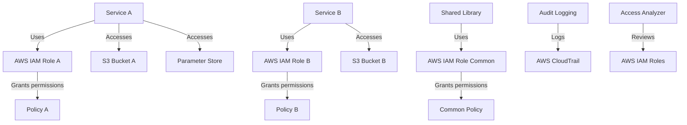

# IAM Least-Privilege Standards

## Overview and scope

The IAM Least-Privilege Standards document outlines the necessary guidelines and practices for managing Identity and Access Management (IAM) roles and policies within Xentic's AWS infrastructure. This standard aims to ensure that all services operate under the principle of least privilege, thereby minimizing security risks and ensuring compliance with regulatory requirements.

### Purpose

The purpose of this document is to establish a clear framework for creating, managing, and auditing IAM roles and policies across all Xentic services. By adhering to these standards, we aim to enhance our security posture, reduce the attack surface, and ensure that access is granted only to the necessary resources required for each service's functionality.

### Audience

This document is intended for:
- Infrastructure Engineers
- DevOps Teams
- Security Teams
- Compliance Officers
- Software Developers

### Scope

The scope of this standard includes:
- All AWS IAM roles and policies associated with Xentic services.
- All environments (development, staging, production) within the AWS ecosystem.
- Integration points with shared libraries and services (e.g., `com.xentic.auth`, `com.xentic.common`).

### Non-goals

This standard does NOT cover:
- Specific implementation details for third-party services outside of Xentic's control.
- Non-AWS IAM systems or services.
- User account management practices unrelated to service roles.

### Glossary

| Term                      | Definition                                                                 |
|---------------------------|-----------------------------------------------------------------------------|
| IAM                       | Identity and Access Management, a framework for managing digital identities.|
| Least Privilege           | A security principle that restricts access rights for accounts to the bare minimum.|
| ARN                       | Amazon Resource Name, a unique identifier for AWS resources.               |
| OIDC                      | OpenID Connect, an authentication layer on top of OAuth 2.0.              |
| SCP                       | Service Control Policies, used to manage permissions across AWS Organizations.|

### How this standard fits the Xentic platform

This standard is critical to the Xentic platform as it aligns with our overarching security strategy and compliance requirements. By implementing IAM least-privilege practices, we ensure that:
- Each service operates independently with its own IAM role, thereby reducing the risk of cross-service access.
- Policies are tailored to the specific needs of each service, avoiding unnecessary permissions.
- Regular audits and reviews are conducted to maintain compliance and security integrity.

### Principles

1. Each service MUST have its own IAM role — sharing roles is NOT permitted.
2. Services MUST be granted only the permissions they require to function.
3. Conditions SHOULD be used to restrict access to specific resources (ARN).
4. Inline policies MUST NOT be used; managed policies MUST be utilized instead.

### ECS Task Role Example

```hcl
resource "aws_iam_policy" "user_service" {
  policy = jsonencode({
    Statement = [
      {
        Effect   = "Allow"
        Action   = ["ssm:GetParameter", "ssm:GetParameters"]
        Resource = "arn:aws:ssm:${var.region}:${var.account_id}:parameter/${var.env}/user-service/*"
      },
      {
        Effect   = "Allow"
        Action   = ["s3:PutObject", "s3:GetObject"]
        Resource = "arn:aws:s3:::acme-${var.env}-user-service-uploads/*"
      },
      {
        Effect   = "Allow"
        Action   = ["sns:Publish"]
        Resource = aws_sns_topic.user_events.arn
      }
    ]
  })
}
```

### GitHub Actions OIDC Role

```hcl
resource "aws_iam_role" "github_actions" {
  assume_role_policy = jsonencode({
    Statement = [{
      Effect    = "Allow"
      Principal = { Federated = aws_iam_openid_connect_provider.github.arn }
      Action    = "sts:AssumeRoleWithWebIdentity"
      Condition = {
        StringEquals = {
          "token.actions.githubusercontent.com:sub" = "repo:myorg/myrepo:ref:refs/heads/main"
        }
      }
    }]
  })
}
```

### Rules

- IAM roles MUST be reviewed quarterly using AWS Access Analyzer.
- Any policy with `"Resource": "*"` MUST be flagged immediately for review.
- Service Control Policies (SCPs) MUST be implemented in AWS Organizations to enforce guardrails.

## Standards and policies

1. **IAM Role Creation**  
   Each service MUST have a dedicated IAM role. Sharing IAM roles across multiple services MUST NOT be allowed to prevent unintended access.

2. **Permission Granting**  
   Services MUST be granted only the permissions necessary for their operation. Permissions should be carefully evaluated and limited to the minimum required.

3. **Policy Type**  
   Inline policies MUST NOT be used. Only managed policies MUST be utilized to maintain consistency and ease of management.

4. **Resource Restrictions**  
   Policies SHOULD include conditions to restrict access to specific resources using ARNs. This ensures that permissions are tightly scoped.

5. **Policy Review Frequency**  
   IAM roles and policies MUST be reviewed at least quarterly using AWS Access Analyzer to ensure compliance with least-privilege principles.

6. **Wildcard Resource Usage**  
   Any policy that uses `"Resource": "*"` MUST be flagged for immediate review and must be replaced with more specific ARNs.

7. **Service Control Policies (SCPs)**  
   SCPs MUST be implemented within AWS Organizations to enforce organizational guardrails and limit permissions across accounts.

8. **Audit Logging**  
   All IAM actions MUST be logged using AWS CloudTrail to ensure traceability and accountability for all access and permission changes.

9. **Temporary Credentials**  
   Services MUST utilize temporary credentials (e.g., AWS STS) instead of long-term access keys to reduce the risk of credential leakage.

10. **Environment-Specific Roles**  
    IAM roles MUST be environment-specific (development, staging, production) to prevent accidental cross-environment access.

11. **Role Assumption**  
    Services MUST use role assumption for cross-account access, ensuring that only the necessary permissions are granted.

12. **Documentation**  
    All IAM roles and policies MUST be documented in a centralized repository, including purpose, permissions granted, and any conditions applied.

13. **Automated Policy Enforcement**  
    Automated tools SHOULD be employed to enforce IAM policies and detect deviations from established standards.

14. **Multi-Factor Authentication (MFA)**  
    IAM roles that allow access to sensitive resources MUST require MFA to enhance security.

15. **Least-Privilege Principle**  
    All new IAM roles MUST adhere to the least-privilege principle from the outset, avoiding the accumulation of excessive permissions over time.

16. **Service Integration**  
    When integrating with shared libraries (e.g., `com.xentic.auth`), IAM roles MUST be configured to allow only the necessary permissions for the shared functionality.

17. **Access Requests**  
    Access requests for IAM roles MUST be documented and approved through a formal process to ensure accountability.

18. **Training and Awareness**  
    All team members involved in IAM management MUST receive regular training on best practices and compliance requirements related to IAM.

19. **Incident Response**  
    Any suspected unauthorized access or policy violation MUST be reported immediately and investigated as part of the incident response process.

20. **Policy Versioning**  
    IAM policies MUST be version-controlled to track changes and facilitate rollbacks if necessary.

### Example IAM Policy

```yaml
Version: "2012-10-17"
Statement:
  - Effect: "Allow"
    Action:
      - "s3:ListBucket"
    Resource: "arn:aws:s3:::example-bucket"
  - Effect: "Allow"
    Action:
      - "s3:GetObject"
    Resource: "arn:aws:s3:::example-bucket/*"
```

### Example SQL for Policy Audit

```sql
SELECT role_name, policy_name, action, resource
FROM iam_policies
WHERE resource = '*'
ORDER BY role_name;
```

By adhering to these standards and policies, Xentic ensures that IAM roles and permissions are managed effectively, maintaining a strong security posture across all AWS services.

## Architecture and design

The architecture for IAM least-privilege standards at Xentic is designed to ensure that each service operates securely and independently. Below is a component diagram that illustrates the key elements and their interactions.



### Data Flows
- **Service A** and **Service B** each utilize their dedicated IAM roles to access AWS resources like S3 buckets and Parameter Store.
- The **Shared Library** uses a common IAM role to provide shared functionality across services.
- All IAM actions are logged through **AWS CloudTrail** for auditing purposes.
- **AWS Access Analyzer** is used to review IAM roles and ensure compliance with least-privilege standards.

### Integration Points
- Each service integrates with its corresponding IAM role, which contains specific policies tailored to its needs.
- The **Shared Library** integrates with IAM roles that allow access to necessary resources without exposing excessive permissions.
- Services must also interact with AWS services like S3, SNS, and Parameter Store, which require specific permissions defined in their IAM policies.

### Failure Domains
- **IAM Role Failure**: If an IAM role is misconfigured or deleted, the corresponding service will fail to operate correctly, leading to potential downtime.
- **Policy Misconfiguration**: Incorrectly defined policies can either over-permit access or deny essential permissions, impacting service functionality.
- **Shared Library Issues**: If the shared library encounters issues with its IAM role, all dependent services may experience failures in accessing shared resources.
- **Audit and Compliance Failures**: Inadequate logging or failure to review IAM roles can lead to compliance violations, exposing Xentic to security risks.

### Summary Table of Components

| Component             | Description                                      | Responsibility                     |
|-----------------------|--------------------------------------------------|------------------------------------|
| Service A             | A microservice that requires specific permissions | Operates under IAM Role A         |
| Service B             | Another microservice with distinct needs         | Operates under IAM Role B         |
| Shared Library        | Common functionality used by multiple services    | Operates under AWS IAM Role Common |
| AWS CloudTrail        | Logs all IAM actions for auditing                 | Provides traceability              |
| AWS Access Analyzer   | Reviews IAM roles for compliance                  | Ensures least-privilege adherence  |

By following this architecture and design framework, Xentic can maintain a robust IAM strategy that adheres to least-privilege principles, ensuring secure and efficient access to resources across the AWS environment.

## Configuration reference

### Application Configuration (application.yml)

```yaml
aws:
  iam:
    roles:
      serviceA:
        roleArn: "arn:aws:iam::123456789012:role/serviceA-role"
        policies:
          - "arn:aws:iam::123456789012:policy/serviceA-policy"
      serviceB:
        roleArn: "arn:aws:iam::123456789012:role/serviceB-role"
        policies:
          - "arn:aws:iam::123456789012:policy/serviceB-policy"
      sharedLibrary:
        roleArn: "arn:aws:iam::123456789012:role/sharedLibrary-role"
        policies:
          - "arn:aws:iam::123456789012:policy/sharedLibrary-policy"
  cloudTrail:
    enabled: true
    s3Bucket: "cloudtrail-logs-bucket"
```

### Terraform Configuration

| Resource Type           | Configuration Example                                                                                      |
|-------------------------|-----------------------------------------------------------------------------------------------------------|
| IAM Role for Service A  | ```hcl<br>resource "aws_iam_role" "serviceA" {<br>  name = "serviceA-role"<br>  assume_role_policy = jsonencode({<br>    Statement = [{<br>      Effect = "Allow"<br>      Principal = { Service = "lambda.amazonaws.com" }<br>      Action = "sts:AssumeRole"<br>    }]<br>  })<br>}<br>``` |
| IAM Role for Service B  | ```hcl<br>resource "aws_iam_role" "serviceB" {<br>  name = "serviceB-role"<br>  assume_role_policy = jsonencode({<br>    Statement = [{<br>      Effect = "Allow"<br>      Principal = { Service = "lambda.amazonaws.com" }<br>      Action = "sts:AssumeRole"<br>    }]<br>  })<br>}<br>``` |
| IAM Role for Shared Lib | ```hcl<br>resource "aws_iam_role" "sharedLibrary" {<br>  name = "sharedLibrary-role"<br>  assume_role_policy = jsonencode({<br>    Statement = [{<br>      Effect = "Allow"<br>      Principal = { Service = "lambda.amazonaws.com" }<br>      Action = "sts:AssumeRole"<br>    }]<br>  })<br>}<br>``` |

### Environment Variables

| Variable Name                 | Default Value                     | Production Value                     |
|-------------------------------|-----------------------------------|--------------------------------------|
| AWS_REGION                    | "us-east-1"                       | "us-west-2"                          |
| AWS_ACCESS_KEY_ID             | "default_access_key"             | "actual_production_access_key"      |
| AWS_SECRET_ACCESS_KEY         | "default_secret_key"             | "actual_production_secret_key"      |
| AWS_SESSION_TOKEN              | ""                                | "actual_production_session_token"    |
| IAM_ROLE_SERVICE_A            | "serviceA-role"                   | "serviceA-role-prod"                 |
| IAM_ROLE_SERVICE_B            | "serviceB-role"                   | "serviceB-role-prod"                 |
| IAM_ROLE_SHARED_LIBRARY        | "sharedLibrary-role"              | "sharedLibrary-role-prod"            |

### Notes

- All IAM roles MUST be defined in the application configuration to ensure proper access management.
- Terraform configurations MUST be kept in version control to track changes and facilitate rollbacks if necessary.
- Environment variables MUST be used to manage sensitive information securely and should never be hard-coded in the application.

## Implementation guide

To implement IAM least-privilege standards at Xentic, follow these step-by-step instructions, ensuring that each service is granted only the permissions it requires.

### Step 1: Define IAM Roles

Each service must have a dedicated IAM role. Below are examples of how to define IAM roles for Service A and Service B.

#### IAM Role for Service A

```hcl
resource "aws_iam_role" "serviceA" {
  name = "serviceA-role"
  assume_role_policy = jsonencode({
    Version = "2012-10-17"
    Statement = [
      {
        Effect = "Allow"
        Principal = {
          Service = "lambda.amazonaws.com"
        }
        Action = "sts:AssumeRole"
      }
    ]
  })
}
```

#### IAM Role for Service B

```hcl
resource "aws_iam_role" "serviceB" {
  name = "serviceB-role"
  assume_role_policy = jsonencode({
    Version = "2012-10-17"
    Statement = [
      {
        Effect = "Allow"
        Principal = {
          Service = "lambda.amazonaws.com"
        }
        Action = "sts:AssumeRole"
      }
    ]
  })
}
```

### Step 2: Define IAM Policies

Next, create IAM policies that specify the permissions for each service. Below are examples for both services.

#### IAM Policy for Service A

```hcl
resource "aws_iam_policy" "serviceA_policy" {
  name        = "serviceA-policy"
  description = "IAM policy for Service A"
  policy      = jsonencode({
    Version = "2012-10-17"
    Statement = [
      {
        Effect = "Allow"
        Action = [
          "s3:ListBucket",
          "s3:GetObject"
        ]
        Resource = [
          "arn:aws:s3:::example-bucket",
          "arn:aws:s3:::example-bucket/*"
        ]
      }
    ]
  })
}
```

#### IAM Policy for Service B

```hcl
resource "aws_iam_policy" "serviceB_policy" {
  name        = "serviceB-policy"
  description = "IAM policy for Service B"
  policy      = jsonencode({
    Version = "2012-10-17"
    Statement = [
      {
        Effect = "Allow"
        Action = [
          "dynamodb:GetItem",
          "dynamodb:PutItem"
        ]
        Resource = "arn:aws:dynamodb:us-east-1:123456789012:table/example-table"
      }
    ]
  })
}
```

### Step 3: Attach Policies to Roles

After defining the roles and policies, attach the policies to the respective roles.

```hcl
resource "aws_iam_role_policy_attachment" "attach_serviceA_policy" {
  policy_arn = aws_iam_policy.serviceA_policy.arn
  role       = aws_iam_role.serviceA.name
}

resource "aws_iam_role_policy_attachment" "attach_serviceB_policy" {
  policy_arn = aws_iam_policy.serviceB_policy.arn
  role       = aws_iam_role.serviceB.name
}
```

### Step 4: Configure Application to Use IAM Roles

In your application configuration, specify the IAM roles for each service.

```yaml
aws:
  iam:
    roles:
      serviceA:
        roleArn: "arn:aws:iam::123456789012:role/serviceA-role"
      serviceB:
        roleArn: "arn:aws:iam::123456789012:role/serviceB-role"
```

### Step 5: Implement Logging and Monitoring

Enable AWS CloudTrail to log IAM actions for auditing purposes. This is critical for maintaining compliance.

```hcl
resource "aws_cloudtrail" "main" {
  name                          = "xentic-cloudtrail"
  s3_bucket_name               = "cloudtrail-logs-bucket"
  is_multi_region_trail        = true
  enable_log_file_validation    = true
}
```

### Step 6: Review and Audit IAM Policies Regularly

Establish a process for regular reviews of IAM policies to ensure they adhere to least-privilege principles. Use AWS Access Analyzer to assist in identifying overly permissive policies.

### Summary of Steps

1. **Define IAM Roles**: Create dedicated IAM roles for each service.
2. **Define IAM Policies**: Create specific policies that grant only necessary permissions.
3. **Attach Policies to Roles**: Connect the policies to the appropriate roles.
4. **Configure Application**: Update application configuration to use the defined IAM roles.
5. **Implement Logging**: Enable AWS CloudTrail for logging IAM actions.
6. **Regular Reviews**: Conduct periodic audits of IAM policies.

By following these steps, Xentic can effectively implement IAM least-privilege standards, ensuring secure access management across its AWS environment.

## Security requirements

### Threat Model Summary

Xentic's infrastructure on AWS must be designed to mitigate potential threats, including unauthorized access, data breaches, and compliance violations. The following threats should be considered:

- **Unauthorized Access**: Attackers gaining access to resources without proper authentication.
- **Data Breaches**: Sensitive data being exposed due to misconfigured permissions.
- **Privilege Escalation**: Users or services gaining more permissions than necessary.
- **Insider Threats**: Employees misusing their access to sensitive information.

### Authentication and Authorization (AuthN/Z)

- **MUST** use AWS IAM for authentication and authorization.
- **MUST NOT** hard-code AWS credentials in the application code.
- **MUST** implement Multi-Factor Authentication (MFA) for all IAM users.
- **MUST** use role-based access control (RBAC) to define permissions based on user roles.

#### Example IAM Policy for Role-Based Access Control

```json
{
  "Version": "2012-10-17",
  "Statement": [
    {
      "Effect": "Allow",
      "Action": "s3:ListBucket",
      "Resource": "arn:aws:s3:::example-bucket",
      "Condition": {
        "StringEquals": {
          "aws:username": "${aws:username}"
        }
      }
    }
  ]
}
```

### Secrets Management

- **MUST** use AWS Secrets Manager or AWS Systems Manager Parameter Store for managing sensitive information.
- **MUST NOT** store secrets in source code or configuration files.
- **MUST** rotate secrets regularly and automatically where possible.

#### Example Secrets Manager Configuration

```yaml
secrets:
  dbPassword: 
    secretName: "prod/dbPassword"
    rotationEnabled: true
```

### Input Validation

- **MUST** validate all inputs to prevent injection attacks (e.g., SQL injection, command injection).
- **MUST** use a whitelist approach for input validation, allowing only expected formats and values.
- **MUST NOT** trust any input from users or external systems.

#### Example Input Validation in Java

```java
public boolean isValidInput(String input) {
    String regex = "^[a-zA-Z0-9]*$"; // Only allows alphanumeric characters
    return input.matches(regex);
}
```

### Audit Logging

- **MUST** enable AWS CloudTrail to log all API calls made in the AWS account.
- **MUST** configure logging for all IAM actions to ensure traceability.
- **MUST** regularly review logs for suspicious activity and compliance.

#### Example CloudTrail Configuration

```hcl
resource "aws_cloudtrail" "main" {
  name                          = "xentic-cloudtrail"
  s3_bucket_name               = "cloudtrail-logs-bucket"
  is_multi_region_trail        = true
  enable_log_file_validation    = true
  include_global_service_events = true
}
```

### Summary of Security Requirements

- Implement robust authentication and authorization mechanisms.
- Manage secrets securely and ensure they are not exposed.
- Validate all inputs to safeguard against injection attacks.
- Maintain comprehensive audit logging to monitor and review access and actions.

By adhering to these security requirements, Xentic can significantly reduce the risk of security incidents and maintain a secure AWS environment.

## Testing strategy

To ensure the integrity of IAM least-privilege implementations at Xentic, a robust testing strategy is mandatory. This strategy encompasses unit tests, integration tests, and contract tests, each with specific coverage targets and examples.

### Unit Tests

Unit tests MUST be written for every function that interacts with IAM roles and policies. The coverage target for unit tests SHOULD be at least 80%. Unit tests validate the logic of individual components in isolation.

#### Example Unit Test Class

```java
import static org.mockito.Mockito.*;
import org.junit.jupiter.api.Test;
import static org.junit.jupiter.api.Assertions.*;

public class IAMPolicyServiceTest {

    @Test
    public void testCreatePolicy() {
        IAMPolicyService policyService = new IAMPolicyService();
        String policyJson = policyService.createPolicy("serviceA", "s3:ListBucket");
        
        assertNotNull(policyJson);
        assertTrue(policyJson.contains("serviceA"));
        assertTrue(policyJson.contains("s3:ListBucket"));
    }
}
```

### Integration Tests

Integration tests MUST validate the interaction between IAM roles, policies, and the application. The coverage target for integration tests SHOULD be at least 70%. These tests ensure that the components work together as expected.

#### Example Integration Test Class

```java
import org.junit.jupiter.api.Test;
import static org.junit.jupiter.api.Assertions.*;

public class IAMIntegrationTest {

    @Test
    public void testAttachPolicyToRole() {
        IAMRoleService roleService = new IAMRoleService();
        IAMPolicyService policyService = new IAMPolicyService();
        
        String roleArn = roleService.createRole("serviceA");
        String policyArn = policyService.createPolicy("serviceA", "s3:ListBucket");
        
        boolean isAttached = roleService.attachPolicy(roleArn, policyArn);
        
        assertTrue(isAttached);
    }
}
```

### Contract Tests

Contract tests MUST verify that the APIs adhere to the expected contracts, including IAM role and policy configurations. The coverage target for contract tests SHOULD be at least 90%. These tests ensure that the services meet the defined API specifications.

#### Example Contract Test Class

```java
import org.junit.jupiter.api.Test;
import static org.junit.jupiter.api.Assertions.*;

public class IAMContractTest {

    @Test
    public void testPolicyContract() {
        IAMPolicyService policyService = new IAMPolicyService();
        
        String policyJson = policyService.createPolicy("serviceA", "s3:ListBucket");
        
        // Validate the JSON structure against the expected contract
        assertTrue(policyJson.contains("Version"));
        assertTrue(policyJson.contains("Statement"));
    }
}
```

### Coverage Targets Summary

| Test Type       | Coverage Target |
|------------------|-----------------|
| Unit Tests       | 80%             |
| Integration Tests | 70%             |
| Contract Tests   | 90%             |

### Best Practices for Testing

- **MUST** use mocking frameworks (e.g., Mockito) for unit tests to isolate dependencies.
- **SHOULD** employ a continuous integration (CI) pipeline to run tests automatically on code changes.
- **MUST NOT** skip writing tests for critical IAM functionalities to ensure reliability.

By adhering to this testing strategy, Xentic can ensure that its IAM implementations are robust, secure, and compliant with the least-privilege standards.

## Observability and operations

To effectively monitor and manage IAM implementations at Xentic, a comprehensive observability and operations strategy MUST be established. This includes metrics, logs, traces, dashboards, alerts, and Service Level Objectives (SLOs) to ensure the integrity and performance of IAM services.

### Metrics

Xentic MUST define key metrics to monitor IAM usage and performance. These metrics should include:

- **IAM Role Usage**: Track how often each IAM role is used.
- **Policy Attachments**: Monitor the number of policies attached to roles.
- **Failed API Calls**: Count the number of failed API calls due to permission issues.
- **MFA Usage**: Measure the percentage of users utilizing Multi-Factor Authentication.

#### Example Metrics Configuration (Prometheus)

```yaml
metrics:
  iam:
    role_usage:
      enabled: true
      type: counter
      help: "Count of IAM role usage"
    failed_api_calls:
      enabled: true
      type: counter
      help: "Count of failed API calls due to permission issues"
    mfa_usage:
      enabled: true
      type: gauge
      help: "Percentage of users using MFA"
```

### Logs

All IAM-related actions MUST be logged for auditing and troubleshooting. AWS CloudTrail logs should be configured to capture all IAM API calls.

#### Example Log Configuration

```yaml
logging:
  level: INFO
  format: json
  destination: cloudwatch
  cloudtrail:
    enabled: true
    log_group: "/aws/cloudtrail/iam-logs"
```

### Traces

Distributed tracing MUST be implemented to gain insights into the performance of IAM-related operations. AWS X-Ray can be used to trace requests and analyze latency.

#### Example X-Ray Configuration

```yaml
xray:
  service_name: "iam-service"
  sampling_rate: 0.1
  enabled: true
```

### Dashboards

Dashboards MUST be created to visualize IAM metrics and logs. Xentic should utilize tools like Grafana or AWS CloudWatch Dashboards to create real-time visualizations.

#### Example Dashboard Configuration (Grafana)

```json
{
  "title": "IAM Metrics Dashboard",
  "panels": [
    {
      "type": "graph",
      "title": "IAM Role Usage",
      "targets": [
        {
          "target": "sum(rate(iam_role_usage[5m]))"
        }
      ]
    },
    {
      "type": "graph",
      "title": "Failed API Calls",
      "targets": [
        {
          "target": "sum(rate(failed_api_calls[5m]))"
        }
      ]
    }
  ]
}
```

### Alerts

Alerts MUST be configured to notify the appropriate teams when thresholds are breached. This includes alerting for:

- High number of failed API calls.
- Unusual IAM role usage patterns.
- MFA usage dropping below a certain percentage.

#### Example Alert Configuration (Prometheus Alertmanager)

```yaml
groups:
  - name: iam-alerts
    rules:
      - alert: HighFailedAPICalls
        expr: sum(rate(failed_api_calls[5m])) > 10
        for: 5m
        labels:
          severity: critical
        annotations:
          summary: "High number of failed API calls"
          description: "More than 10 failed API calls in the last 5 minutes."
```

### Service Level Objectives (SLOs)

SLOs MUST be defined to measure the reliability and performance of IAM services. Examples include:

| SLO Name                  | Objective          | Measurement Method                       |
|---------------------------|--------------------|------------------------------------------|
| Role Usage Availability    | 99.9% uptime       | Monitor role usage metrics               |
| API Call Success Rate      | 95% successful calls| Track successful API call metrics        |
| MFA Adoption Rate          | 90% of users       | Measure percentage of users with MFA    |

### On-Call Runbook Steps

In the event of an incident related to IAM, the following on-call runbook steps MUST be followed:

1. **Identify the Incident**: Check alerts in the monitoring system for IAM-related issues.
2. **Gather Logs and Metrics**: Access CloudTrail logs and relevant metrics to understand the scope of the problem.
3. **Assess Impact**: Determine which services or users are affected by the incident.
4. **Communicate**: Notify stakeholders about the incident and provide updates as more information is gathered.
5. **Mitigate**: If applicable, take immediate action to mitigate the issue (e.g., revoke permissions, disable roles).
6. **Document**: Record the incident details, actions taken, and any follow-up required.
7. **Review**: After resolution, conduct a post-mortem to identify root causes and improve processes.

By implementing these observability and operations standards, Xentic can ensure effective monitoring, quick incident response, and continuous improvement of its IAM practices.

## Migration and versioning

To maintain a secure and efficient IAM environment at Xentic, a clear migration and versioning strategy MUST be established. This strategy should address upgrade paths, deprecation policies, backward compatibility, and rollback procedures.

### Upgrade Paths

When upgrading IAM components, the following paths MUST be adhered to:

- **Major Version Upgrades**: These MUST include breaking changes and require thorough testing. Documentation MUST be updated to reflect these changes.
- **Minor Version Upgrades**: These SHOULD introduce new features without breaking existing functionality. Testing SHOULD be performed to ensure compatibility.
- **Patch Releases**: These MUST address bugs and security vulnerabilities and SHOULD be deployed as quickly as possible.

#### Example Versioning Scheme

| Version Type      | Description                                      | Compatibility   |
|-------------------|--------------------------------------------------|------------------|
| Major (1.x)      | Breaking changes, requires migration              | NOT backward compatible |
| Minor (1.1)      | New features, no breaking changes                 | Backward compatible |
| Patch (1.1.1)    | Bug fixes and security updates                    | Backward compatible |

### Deprecation Policy

Xentic MUST have a clear deprecation policy for IAM roles and policies. The policy SHOULD include:

- **Notification Period**: A minimum of 3 months' notice MUST be provided before a feature is deprecated.
- **Documentation**: Deprecated features MUST be documented, including alternatives and migration paths.
- **Support**: Deprecated features MUST continue to be supported for at least one major version after deprecation.

### Backward Compatibility

All IAM components MUST strive for backward compatibility. This means that:

- Existing configurations MUST continue to work after an upgrade, unless explicitly stated otherwise.
- New features SHOULD be added in a way that does not disrupt existing functionality.
- If breaking changes are necessary, they MUST be clearly communicated in release notes.

### Rollback Procedures

In the event of an unsuccessful upgrade, a rollback procedure MUST be in place. This procedure SHOULD include:

1. **Backup**: Always create a backup of the current configuration before performing an upgrade.
2. **Rollback Steps**: Clearly document the steps required to revert to the previous version.
3. **Testing**: After rollback, perform tests to ensure that the system is functioning as expected.
4. **Communication**: Notify stakeholders of the rollback and any implications.

#### Example Rollback Configuration

```bash
# Backup current IAM configuration
aws iam list-roles > iam_roles_backup.json

# Rollback command
aws iam update-role --role-name serviceA --assume-role-policy-document file://previous_policy.json
```

### Migration Steps

When migrating IAM roles or policies, the following steps MUST be followed:

1. **Assessment**: Evaluate the existing IAM setup and identify components that need migration.
2. **Planning**: Create a detailed migration plan, including timelines and resources needed.
3. **Testing**: Conduct tests in a staging environment to validate the migration process.
4. **Execution**: Execute the migration according to the plan, ensuring minimal disruption to services.
5. **Verification**: After migration, verify that all roles and policies are functioning as intended.

#### Example Migration Plan

| Step               | Description                                      | Responsible Team |
|--------------------|--------------------------------------------------|-------------------|
| Assessment         | Review current IAM roles and policies            | IAM Team          |
| Planning           | Develop a migration strategy                     | DevOps Team       |
| Testing            | Validate migration in a staging environment      | QA Team           |
| Execution          | Perform the migration                            | IAM Team          |
| Verification       | Confirm successful migration                     | QA Team           |

By adhering to these migration and versioning standards, Xentic can ensure a smooth transition between IAM versions while maintaining security and operational integrity.

## FAQ, anti-patterns, and checklists

### FAQ

1. **What is the principle of least privilege?**
   - The principle of least privilege states that users and systems should have only the permissions necessary to perform their tasks. This minimizes the risk of accidental or malicious misuse.

2. **How often should IAM roles be reviewed?**
   - IAM roles MUST be reviewed at least quarterly to ensure they adhere to the least-privilege principle and to remove any unnecessary permissions.

3. **What should I do if I find an over-permissioned IAM role?**
   - Over-permissioned IAM roles MUST be immediately revised to remove unnecessary permissions. Document the changes made for auditing purposes.

4. **Can I use wildcards in IAM policies?**
   - Wildcards SHOULD be used sparingly. They can lead to over-permissioning and should be replaced with specific resource ARNs whenever possible.

5. **What is the recommended way to manage access keys?**
   - Access keys MUST be rotated regularly and should not be hard-coded in applications. Use AWS Secrets Manager or AWS Systems Manager Parameter Store for secure storage.

6. **How do I enforce MFA for IAM users?**
   - MFA MUST be enforced by configuring IAM policies that require MFA for sensitive actions. This can be done using conditions in IAM policies.

7. **What should I do if a user leaves the company?**
   - Immediately revoke all IAM permissions for the user and remove their access keys. Conduct a review of their roles to ensure no lingering permissions remain.

8. **How can I monitor IAM activity?**
   - IAM activity MUST be monitored using AWS CloudTrail. Ensure that CloudTrail is enabled to log all IAM API calls for auditing purposes.

9. **What is the difference between IAM roles and IAM users?**
   - IAM users are permanent identities with long-term credentials, while IAM roles are temporary identities that can be assumed by users or services to perform specific tasks.

10. **How can I implement resource-based policies?**
    - Resource-based policies MUST be used when you want to grant permissions directly on a resource (like an S3 bucket) rather than through IAM roles or users.

### Anti-Patterns

| Anti-Pattern                          | Description                                                                                   |
|---------------------------------------|-----------------------------------------------------------------------------------------------|
| Over-Permissioning                    | Assigning more permissions than necessary to users or roles, increasing security risks.      |
| Hard-Coding Credentials                | Storing IAM credentials in source code, leading to potential exposure.                      |
| Lack of MFA                           | Not enforcing MFA for IAM users, which increases vulnerability to unauthorized access.       |
| Ignoring Role Reviews                 | Failing to regularly review IAM roles and permissions, leading to outdated access controls.  |
| Using Wildcards Excessively           | Overusing wildcards in IAM policies, which can grant broader access than intended.          |
| Not Logging IAM Activities            | Failing to enable logging for IAM activities, making it difficult to audit and troubleshoot. |

### Pre-Merge Checklist

- [ ] Ensure all IAM policies follow the least-privilege principle.
- [ ] Review IAM roles for over-permissioning.
- [ ] Confirm that MFA is enforced for all IAM users.
- [ ] Validate that no hard-coded credentials are present in the codebase.
- [ ] Ensure that all changes are documented and communicated to the team.

### Production Checklist

- [ ] Verify that CloudTrail is enabled and logging IAM activities.
- [ ] Check that alerts for IAM activities are configured and functioning.
- [ ] Ensure that all IAM roles and policies have been reviewed and approved.
- [ ] Confirm that backups of IAM configurations have been created before deployment.
- [ ] Monitor IAM metrics and logs post-deployment for any anomalies.
