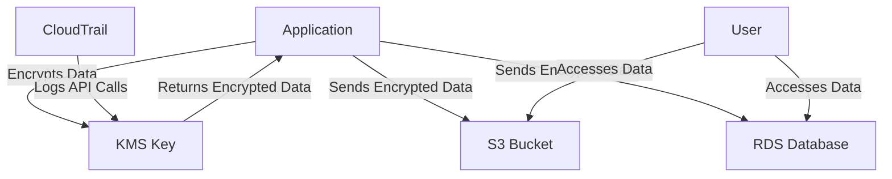

# KMS Encryption Standards — AWS

## Overview and scope

The purpose of this document is to establish the standards for implementing Key Management Service (KMS) encryption within the AWS environment at Xentic. This standard aims to ensure that all data at rest and in transit is adequately protected using industry best practices and compliant with relevant regulations. 

### Audience

This document is intended for:
- Cloud Architects
- DevOps Engineers
- Security Teams
- Application Developers
- Compliance Officers

### Scope

This standard applies to:
- All AWS services utilized by Xentic that require encryption.
- All data stored in AWS, including but not limited to S3 buckets, RDS databases, and EBS volumes.
- Any applications developed within the Xentic platform that handle sensitive data.

### Non-goals

This document does NOT cover:
- On-premises encryption solutions.
- Non-AWS cloud environments.
- Encryption practices for non-sensitive data.

### Glossary

| Term               | Definition                                                                 |
|--------------------|-----------------------------------------------------------------------------|
| KMS                | AWS Key Management Service, a managed service that simplifies the creation and control of encryption keys. |
| Encryption         | The process of converting data into a coded format to prevent unauthorized access. |
| Data at Rest       | Data that is stored physically in any digital form (e.g., databases, data warehouses). |
| Data in Transit    | Data that is actively moving from one location to another, such as across the internet or through a private network. |

### How This Standard Fits the Xentic Platform

The KMS Encryption Standards are integral to the security framework of the Xentic platform. By adhering to these standards, Xentic ensures that:
- Sensitive information is protected against unauthorized access and breaches.
- Compliance with regulatory requirements is maintained.
- A consistent approach to encryption is applied across all services and applications.

### Example Configuration

Below is an example of how to configure KMS in an AWS CloudFormation template:

```yaml
Resources:
  MyKMSKey:
    Type: 'AWS::KMS::Key'
    Properties:
      KeyPolicy:
        Version: '2012-10-17'
        Statement:
          - Effect: Allow
            Principal:
              AWS: arn:aws:iam::123456789012:role/MyRole
            Action: kms:*
            Resource: '*'
      Description: "KMS key for encrypting sensitive data"
```

### Example SQL for Key Rotation

To implement key rotation, you can use the following SQL command to enable automatic key rotation for a KMS key:

```sql
ALTER KEY my_kms_key
SET ROTATE = TRUE;
```

### Example Code Snippet

The following Java code snippet demonstrates how to encrypt data using KMS in a Spring Boot application:

```java
import com.amazonaws.services.kms.AWSKMS;
import com.amazonaws.services.kms.AWSKMSClientBuilder;
import com.amazonaws.services.kms.model.EncryptRequest;
import com.amazonaws.services.kms.model.EncryptResult;

public class KmsEncryptionService {

    private final AWSKMS kmsClient;

    public KmsEncryptionService() {
        this.kmsClient = AWSKMSClientBuilder.defaultClient();
    }

    public byte[] encryptData(String keyId, byte[] plaintext) {
        EncryptRequest encryptRequest = new EncryptRequest()
                .withKeyId(keyId)
                .withPlaintext(ByteBuffer.wrap(plaintext));
        EncryptResult encryptResult = kmsClient.encrypt(encryptRequest);
        return encryptResult.getCiphertextBlob().array();
    }
}
```

By following these standards, Xentic will maintain a robust security posture while leveraging AWS KMS for encryption.

## Standards and policies

1. **MUST** use AWS Key Management Service (KMS) for all encryption needs involving sensitive data within the AWS environment at Xentic.

2. **MUST NOT** hard-code KMS key IDs or ARNs in application code. Instead, retrieve them from a secure configuration management system or environment variables.

3. **SHOULD** implement automatic key rotation for all KMS keys to enhance security. This can be configured in the AWS Management Console or via AWS CLI.

   Example command to enable key rotation:
   ```bash
   aws kms enable-key-rotation --key-id <your-key-id>
   ```

4. **MUST** define a key policy that grants the necessary permissions to IAM roles and users who require access to the KMS keys. The policy should follow the principle of least privilege.

   Example key policy:
   ```json
   {
     "Version": "2012-10-17",
     "Statement": [
       {
         "Effect": "Allow",
         "Principal": {
           "AWS": "arn:aws:iam::123456789012:role/MyRole"
         },
         "Action": "kms:*",
         "Resource": "*"
       }
     ]
   }
   ```

5. **MUST** ensure that all data at rest is encrypted using KMS keys. This includes but is not limited to:
   - Amazon S3 buckets
   - Amazon RDS databases
   - Amazon EBS volumes

6. **SHOULD** use customer-managed keys (CMKs) rather than AWS-managed keys for sensitive data to maintain control over key management.

7. **MUST NOT** use the default AWS-managed keys for production workloads involving sensitive data. Always create and manage your own keys.

8. **SHOULD** log all KMS API calls using AWS CloudTrail to maintain an audit trail of key usage and access.

9. **MUST** implement encryption for data in transit using TLS 1.2 or higher. This applies to all communications between services and applications.

10. **MUST** regularly review KMS key policies and IAM policies associated with KMS keys to ensure they meet current security requirements and access needs.

11. **SHOULD** document the purpose and usage of each KMS key in a centralized repository to facilitate management and compliance audits.

12. **MUST** ensure that all developers and engineers are trained on KMS best practices and the importance of encryption in protecting sensitive data.

13. **MUST NOT** store plaintext sensitive information in version control systems. Always use encryption before storing sensitive data.

14. **SHOULD** use tagging for KMS keys to categorize and manage keys effectively. Tags should include information such as owner, purpose, and environment.

   Example of tagging a KMS key:
   ```bash
   aws kms tag-resource --key-id <your-key-id> --tags TagKey=Owner,TagValue=DevTeam
   ```

15. **MUST** perform periodic reviews of KMS key access and usage to identify any unauthorized access or misconfigurations.

By adhering to these standards and policies, Xentic will ensure a secure and compliant approach to data encryption using AWS KMS.

## Architecture and design

The architecture for implementing AWS Key Management Service (KMS) encryption at Xentic consists of various components that interact to ensure secure handling of sensitive data. The following diagram illustrates the key components and their interactions:



### Data Flows

1. **Data Encryption**: 
   - Applications send plaintext data to KMS for encryption.
   - KMS returns encrypted data, which is then stored in AWS services like S3 or RDS.

2. **Data Access**:
   - Users or applications retrieve encrypted data from S3 or RDS.
   - Decryption requests are sent to KMS, which returns the plaintext data if the requester has the appropriate permissions.

3. **Logging**:
   - All KMS API calls are logged by AWS CloudTrail for auditing purposes.

### Integration Points

- **AWS SDK**: Applications must integrate with the AWS SDK to interact with KMS for encryption and decryption.
- **IAM Roles**: Proper IAM roles must be configured to allow applications and users to access KMS keys securely.
- **CloudTrail**: Integration with CloudTrail is essential to log all key management operations for compliance and auditing.

### Failure Domains

- **KMS Availability**: If KMS is unavailable, applications will not be able to encrypt or decrypt data, leading to potential service disruptions.
- **Network Issues**: Connectivity issues between the application and AWS services can hinder data access and encryption processes.
- **IAM Misconfigurations**: Incorrect IAM policies can lead to unauthorized access to KMS keys or denial of service for legitimate requests.

### Example Configuration

Below is an example of a KMS key configuration in YAML for use in AWS CloudFormation:

```yaml
Resources:
  MyKMSKey:
    Type: 'AWS::KMS::Key'
    Properties:
      KeyPolicy:
        Version: '2012-10-17'
        Statement:
          - Effect: Allow
            Principal:
              AWS: arn:aws:iam::123456789012:role/MyRole
            Action: kms:*
            Resource: '*'
      Description: "KMS key for encrypting sensitive data"
      KeyUsage: ENCRYPT_DECRYPT
      Origin: AWS_KMS
      EnableKeyRotation: true
```

### Example SQL for Key Rotation

To enable automatic key rotation for a KMS key, you can use the following SQL command:

```sql
ALTER KEY my_kms_key
SET ROTATE = TRUE;
```

### Example Code Snippet

The following Java code snippet demonstrates how to decrypt data using KMS in a Spring Boot application:

```java
import com.amazonaws.services.kms.AWSKMS;
import com.amazonaws.services.kms.AWSKMSClientBuilder;
import com.amazonaws.services.kms.model.DecryptRequest;
import com.amazonaws.services.kms.model.DecryptResult;

public class KmsDecryptionService {

    private final AWSKMS kmsClient;

    public KmsDecryptionService() {
        this.kmsClient = AWSKMSClientBuilder.defaultClient();
    }

    public byte[] decryptData(byte[] ciphertext) {
        DecryptRequest decryptRequest = new DecryptRequest()
                .withCiphertextBlob(ByteBuffer.wrap(ciphertext));
        DecryptResult decryptResult = kmsClient.decrypt(decryptRequest);
        return decryptResult.getPlaintext().array();
    }
}
```

By adhering to the architecture and design standards outlined above, Xentic will maintain a robust and secure framework for managing encryption keys and protecting sensitive data using AWS KMS.

## Configuration reference

### application.yml

The following is an example configuration for KMS in a Spring Boot application using `application.yml`:

```yaml
kms:
  key-id: ${KMS_KEY_ID} # Must be set in environment variables
  region: us-east-1
  endpoint: https://kms.us-east-1.amazonaws.com
  encryption:
    enabled: true
    algorithm: AES_256
```

### Terraform Configuration

The following Terraform configuration creates a KMS key with appropriate settings:

```hcl
resource "aws_kms_key" "example" {
  description = "KMS key for encrypting sensitive data"
  enable_key_rotation = true

  key_policy = jsonencode({
    Version = "2012-10-17"
    Statement = [
      {
        Effect = "Allow"
        Principal = {
          AWS = "arn:aws:iam::123456789012:role/MyRole"
        }
        Action = "kms:*"
        Resource = "*"
      }
    ]
  })
}
```

### Environment Variables

The following table outlines the necessary environment variables for KMS configuration:

| Variable Name      | Default Value       | Production Value        | Description                                      |
|--------------------|---------------------|-------------------------|--------------------------------------------------|
| `KMS_KEY_ID`       | `null`              | `arn:aws:kms:us-east-1:123456789012:key/abcd-efgh-ijkl` | The ARN of the KMS key used for encryption.      |
| `KMS_REGION`       | `us-east-1`         | `us-west-2`             | The AWS region where the KMS key is located.    |
| `KMS_ENDPOINT`     | `https://kms.us-east-1.amazonaws.com` | `https://kms.us-west-2.amazonaws.com` | The endpoint for the KMS service.                |
| `KMS_ENCRYPTION_ENABLED` | `true`      | `true`                  | Flag to enable or disable KMS encryption.        |
| `KMS_ALGORITHM`     | `AES_256`          | `AES_256`               | The encryption algorithm to use.                 |

### Additional Configuration Options

- **Key Rotation**: Ensure that key rotation is enabled in both the application configuration and the AWS KMS settings.
- **Logging**: Configure AWS CloudTrail to log all KMS API calls for auditing purposes.
- **IAM Roles**: Define IAM roles that have permissions to use the KMS keys and ensure they are correctly associated with the application.

### Example IAM Policy for KMS Access

The following IAM policy grants access to the KMS key for specific actions:

```json
{
  "Version": "2012-10-17",
  "Statement": [
    {
      "Effect": "Allow",
      "Action": [
        "kms:Encrypt",
        "kms:Decrypt",
        "kms:GenerateDataKey"
      ],
      "Resource": "arn:aws:kms:us-east-1:123456789012:key/abcd-efgh-ijkl"
    }
  ]
}
```

### Summary

By following the configuration standards outlined above, Xentic ensures that KMS is properly integrated into applications, maintaining a secure and compliant environment for handling sensitive data.

## Implementation guide

To implement AWS KMS encryption at Xentic, follow the step-by-step guide below. This guide includes code examples, configurations, and best practices to ensure a secure integration.

### Step 1: Create a KMS Key

Use the AWS Management Console or AWS CLI to create a KMS key. Below is an example using the AWS CLI:

```bash
aws kms create-key --description "KMS key for encrypting sensitive data" --key-usage ENCRYPT_DECRYPT --origin AWS_KMS
```

### Step 2: Define Key Policy

Define a key policy that grants permissions to the necessary IAM roles or users. The following example demonstrates a key policy in JSON format:

```json
{
  "Version": "2012-10-17",
  "Statement": [
    {
      "Effect": "Allow",
      "Principal": {
        "AWS": "arn:aws:iam::123456789012:role/MyRole"
      },
      "Action": "kms:*",
      "Resource": "*"
    }
  ]
}
```

### Step 3: Configure IAM Roles

Create an IAM role that allows your application to use the KMS key. Below is an example IAM policy that grants access to the KMS key:

```json
{
  "Version": "2012-10-17",
  "Statement": [
    {
      "Effect": "Allow",
      "Action": [
        "kms:Encrypt",
        "kms:Decrypt",
        "kms:GenerateDataKey"
      ],
      "Resource": "arn:aws:kms:us-east-1:123456789012:key/abcd-efgh-ijkl"
    }
  ]
}
```

### Step 4: Integrate KMS in Your Application

Use the AWS SDK for Java to integrate KMS in your application. Below is a complete example of a service that encrypts and decrypts data using KMS.

#### KmsEncryptionService.java

```java
import com.amazonaws.services.kms.AWSKMS;
import com.amazonaws.services.kms.AWSKMSClientBuilder;
import com.amazonaws.services.kms.model.EncryptRequest;
import com.amazonaws.services.kms.model.DecryptRequest;
import com.amazonaws.services.kms.model.DecryptResult;
import com.amazonaws.services.kms.model.EncryptResult;

import java.nio.ByteBuffer;

public class KmsEncryptionService {

    private final AWSKMS kmsClient;
    private final String keyId;

    public KmsEncryptionService(String keyId) {
        this.kmsClient = AWSKMSClientBuilder.defaultClient();
        this.keyId = keyId;
    }

    public byte[] encryptData(byte[] plaintext) {
        EncryptRequest encryptRequest = new EncryptRequest()
                .withKeyId(keyId)
                .withPlaintext(ByteBuffer.wrap(plaintext));
        EncryptResult encryptResult = kmsClient.encrypt(encryptRequest);
        return encryptResult.getCiphertextBlob().array();
    }

    public byte[] decryptData(byte[] ciphertext) {
        DecryptRequest decryptRequest = new DecryptRequest()
                .withCiphertextBlob(ByteBuffer.wrap(ciphertext));
        DecryptResult decryptResult = kmsClient.decrypt(decryptRequest);
        return decryptResult.getPlaintext().array();
    }
}
```

### Step 5: Configure Application Properties

In your Spring Boot application, configure the KMS key ID and region in `application.yml`:

```yaml
kms:
  key-id: ${KMS_KEY_ID} # Must be set in environment variables
  region: us-east-1
```

### Step 6: Use the KMS Service in Your Application

You can now use the `KmsEncryptionService` in your application to encrypt and decrypt sensitive data:

```java
import org.springframework.beans.factory.annotation.Autowired;
import org.springframework.stereotype.Service;

@Service
public class MyService {

    private final KmsEncryptionService kmsEncryptionService;

    @Autowired
    public MyService(KmsEncryptionService kmsEncryptionService) {
        this.kmsEncryptionService = kmsEncryptionService;
    }

    public void handleSensitiveData(String sensitiveData) {
        byte[] encryptedData = kmsEncryptionService.encryptData(sensitiveData.getBytes());
        // Store encryptedData in your database or S3

        byte[] decryptedData = kmsEncryptionService.decryptData(encryptedData);
        String originalData = new String(decryptedData);
        // Use originalData as needed
    }
}
```

### Step 7: Enable Logging with CloudTrail

Ensure that AWS CloudTrail is enabled to log all KMS API calls. This can be done through the AWS Management Console or the following CLI command:

```bash
aws cloudtrail create-trail --name MyTrail --s3-bucket-name my-cloudtrail-bucket
aws cloudtrail start-logging --name MyTrail
```

### Step 8: Tagging KMS Keys

Tag your KMS keys for better management. Use the following command to add tags:

```bash
aws kms tag-resource --key-id <your-key-id> --tags TagKey=Owner,TagValue=DevTeam
```

### Summary of Steps

1. Create a KMS key.
2. Define the key policy.
3. Configure IAM roles for access.
4. Integrate KMS in your application.
5. Configure application properties.
6. Use the KMS service in your application.
7. Enable logging with CloudTrail.
8. Tag KMS keys for management.

By following these steps, Xentic will ensure a secure and compliant implementation of AWS KMS encryption across its applications.

## Security requirements

### Threat Model Summary

Xentic's KMS encryption implementation must address various threat vectors, including:

- **Data Breaches**: Unauthorized access to sensitive data at rest or in transit.
- **Insider Threats**: Malicious or negligent actions by employees or contractors.
- **Misconfiguration**: Improper settings leading to vulnerabilities.
- **Denial of Service**: Attacks that disrupt access to KMS or encrypted data.

To mitigate these threats, the following security measures MUST be implemented:

- Use of IAM roles with the principle of least privilege.
- Regular audits of access policies and logs.
- Implementation of encryption in transit and at rest.

### Authentication and Authorization (Authn/z)

- **IAM Roles**: All applications MUST use IAM roles to access KMS. Hardcoding credentials is NOT permitted.
- **Key Policies**: Key policies MUST explicitly define who can use the KMS keys and for what actions. The following example illustrates a key policy:

```json
{
  "Version": "2012-10-17",
  "Statement": [
    {
      "Effect": "Allow",
      "Principal": {
        "AWS": "arn:aws:iam::123456789012:role/MyRole"
      },
      "Action": [
        "kms:Encrypt",
        "kms:Decrypt",
        "kms:GenerateDataKey"
      ],
      "Resource": "arn:aws:kms:us-east-1:123456789012:key/abcd-efgh-ijkl"
    }
  ]
}
```

### Secrets Management

- **Environment Variables**: Secrets such as KMS key IDs MUST be stored in environment variables and not hardcoded in the source code. An example of required environment variables is as follows:

| Variable Name      | Description                                      |
|--------------------|--------------------------------------------------|
| `KMS_KEY_ID`       | The ARN of the KMS key used for encryption.      |
| `KMS_REGION`       | The AWS region where the KMS key is located.    |
| `KMS_ENCRYPTION_ENABLED` | Flag to enable or disable KMS encryption. |

- **Secret Rotation**: Xentic MUST implement a strategy for rotating secrets associated with KMS keys regularly to reduce the risk of exposure.

### Input Validation

- **Data Validation**: All input data that will be encrypted MUST be validated against predefined schemas to prevent injection attacks. For example, string inputs should be validated as follows:

```java
public void validateInput(String input) {
    if (input == null || input.isEmpty() || input.length() > 255) {
        throw new IllegalArgumentException("Invalid input data");
    }
}
```

- **Sanitization**: Input data MUST be sanitized to remove any potentially malicious content before processing.

### Audit Logging

- **CloudTrail**: AWS CloudTrail MUST be enabled to log all KMS API calls. This provides an audit trail for all actions taken on KMS keys. The following command can be used to enable logging:

```bash
aws cloudtrail create-trail --name MyTrail --s3-bucket-name my-cloudtrail-bucket
aws cloudtrail start-logging --name MyTrail
```

- **Log Retention**: Audit logs MUST be retained for a minimum of 365 days to comply with regulatory requirements.

- **Access Monitoring**: Regular reviews of CloudTrail logs MUST be conducted to identify any unauthorized access attempts or anomalies.

By adhering to these security requirements, Xentic will ensure that its KMS encryption implementation is robust, secure, and compliant with industry standards.

## Testing strategy

To ensure the integrity and reliability of the KMS encryption implementation, Xentic MUST adopt a comprehensive testing strategy that includes unit tests, integration tests, and contract tests. The following outlines the testing requirements and examples for each category.

### Unit Tests

Unit tests MUST verify the functionality of individual components in isolation. Each method in the `KmsEncryptionService` class MUST be covered by unit tests.

- **Coverage Target**: Minimum of 80% code coverage.
- **Testing Framework**: JUnit 5 and Mockito.

#### Example Unit Test Class

```java
import static org.mockito.Mockito.*;
import static org.junit.jupiter.api.Assertions.*;

import com.amazonaws.services.kms.AWSKMS;
import com.amazonaws.services.kms.model.EncryptResult;
import com.amazonaws.services.kms.model.DecryptResult;
import org.junit.jupiter.api.BeforeEach;
import org.junit.jupiter.api.Test;
import java.nio.ByteBuffer;

public class KmsEncryptionServiceTest {

    private AWSKMS mockKmsClient;
    private KmsEncryptionService kmsEncryptionService;
    private final String keyId = "arn:aws:kms:us-east-1:123456789012:key/abcd-efgh-ijkl";

    @BeforeEach
    public void setUp() {
        mockKmsClient = mock(AWSKMS.class);
        kmsEncryptionService = new KmsEncryptionService(keyId);
        // Injecting the mock client into the service (using reflection or constructor injection)
    }

    @Test
    public void testEncryptData() {
        byte[] plaintext = "Hello World".getBytes();
        ByteBuffer ciphertextBuffer = ByteBuffer.wrap(new byte[]{1, 2, 3});
        EncryptResult encryptResult = new EncryptResult().withCiphertextBlob(ciphertextBuffer);

        when(mockKmsClient.encrypt(any())).thenReturn(encryptResult);

        byte[] result = kmsEncryptionService.encryptData(plaintext);
        assertArrayEquals(new byte[]{1, 2, 3}, result);
    }

    @Test
    public void testDecryptData() {
        ByteBuffer ciphertextBuffer = ByteBuffer.wrap(new byte[]{1, 2, 3});
        ByteBuffer plaintextBuffer = ByteBuffer.wrap("Hello World".getBytes());
        DecryptResult decryptResult = new DecryptResult().withPlaintext(plaintextBuffer);

        when(mockKmsClient.decrypt(any())).thenReturn(decryptResult);

        byte[] result = kmsEncryptionService.decryptData(new byte[]{1, 2, 3});
        assertArrayEquals("Hello World".getBytes(), result);
    }
}
```

### Integration Tests

Integration tests MUST validate the interaction between components, including the AWS KMS service. These tests should run in a controlled environment with access to AWS services.

- **Coverage Target**: Minimum of 70% integration coverage.
- **Testing Framework**: Spring Boot Test.

#### Example Integration Test Class

```java
import static org.springframework.test.web.servlet.request.MockMvcRequestBuilders.*;
import static org.springframework.test.web.servlet.result.MockMvcResultMatchers.*;

import org.junit.jupiter.api.Test;
import org.springframework.beans.factory.annotation.Autowired;
import org.springframework.boot.test.autoconfigure.web.servlet.WebMvcTest;
import org.springframework.test.web.servlet.MockMvc;

@WebMvcTest(MyService.class)
public class MyServiceIntegrationTest {

    @Autowired
    private MockMvc mockMvc;

    @Test
    public void testHandleSensitiveData() throws Exception {
        mockMvc.perform(post("/api/sensitive-data")
                .content("Sensitive Data"))
                .andExpect(status().isOk());
    }
}
```

### Contract Tests

Contract tests MUST ensure that the API contracts between services are maintained. These tests should validate that the expected input and output formats are adhered to.

- **Coverage Target**: 100% of API contracts MUST be tested.
- **Testing Framework**: Pact or Spring Cloud Contract.

#### Example Contract Test Class

```java
import au.com.dius.pact.consumer.junit5.PactConsumerTestExt;
import au.com.dius.pact.consumer.junit5.PactTestFor;
import org.junit.jupiter.api.extension.ExtendWith;

@ExtendWith(PactConsumerTestExt.class)
@PactTestFor(providerName = "KmsProvider", port = "8080")
public class KmsContractTest {

    // Define your contract here
    // Use Pact DSL to define interactions
}
```

### Summary of Testing Strategy

| Test Type        | Coverage Target | Frameworks                |
|------------------|-----------------|---------------------------|
| Unit Tests       | 80%             | JUnit 5, Mockito          |
| Integration Tests| 70%             | Spring Boot Test          |
| Contract Tests   | 100%            | Pact, Spring Cloud Contract|

By implementing this exhaustive testing strategy, Xentic will ensure that its KMS encryption services are robust, reliable, and maintainable, ultimately leading to a secure application environment.

## Observability and operations

To ensure the effective monitoring and management of KMS encryption services, Xentic MUST implement a comprehensive observability strategy that encompasses metrics, logs, traces, dashboards, alerts, and SLOs. The following guidelines outline the necessary components for observability and operations.

### Metrics

Xentic MUST collect the following metrics related to KMS usage:

- **Encryption Requests**: Total number of encryption requests processed.
- **Decryption Requests**: Total number of decryption requests processed.
- **Error Rates**: Percentage of failed encryption and decryption requests.
- **Latency**: Time taken to process encryption and decryption requests.

#### Example Metrics Configuration (YAML)

```yaml
metrics:
  enabled: true
  endpoint: /actuator/metrics
  tags:
    service: kms-encryption
```

### Logs

All KMS operations MUST be logged for audit and troubleshooting purposes. The following log levels MUST be used:

- **INFO**: General information about encryption and decryption operations.
- **ERROR**: Detailed error messages for failed operations.
- **DEBUG**: Detailed information for debugging issues.

#### Example Logging Configuration (Logback XML)

```xml
<configuration>
    <appender name="FILE" class="ch.qos.logback.core.FileAppender">
        <file>logs/kms-encryption.log</file>
        <encoder>
            <pattern>%d{yyyy-MM-dd HH:mm:ss} %-5level %logger{36} - %msg%n</pattern>
        </encoder>
    </appender>

    <root level="INFO">
        <appender-ref ref="FILE" />
    </root>
</configuration>
```

### Traces

Distributed tracing MUST be implemented to track requests across microservices. Xentic SHOULD use tools like AWS X-Ray or OpenTelemetry for this purpose. 

#### Example Trace Configuration (OpenTelemetry)

```yaml
opentelemetry:
  tracing:
    enabled: true
    service-name: kms-encryption-service
    exporter:
      otlp:
        endpoint: otel-collector:4317
```

### Dashboards

Xentic MUST create dashboards to visualize the collected metrics and logs. These dashboards should include:

- **Encryption and Decryption Success Rates**: A real-time view of successful vs. failed operations.
- **Latency Trends**: Graphs showing latency over time for encryption and decryption requests.
- **Error Rate Analysis**: A breakdown of error rates by type and frequency.

#### Example Dashboard Configuration (Grafana)

```json
{
  "title": "KMS Encryption Dashboard",
  "panels": [
    {
      "type": "graph",
      "title": "Encryption Success Rate",
      "targets": [
        {
          "target": "sum(rate(encryption_requests_total{status=\"success\"}[5m]))"
        }
      ]
    },
    {
      "type": "graph",
      "title": "Decryption Latency",
      "targets": [
        {
          "target": "avg(decryption_latency_seconds)"
        }
      ]
    }
  ]
}
```

### Alerts

Xentic MUST configure alerts for critical metrics to ensure timely responses to issues. Alerts should be set for:

- **High Error Rates**: Alert when error rates exceed 5% for any given period.
- **Increased Latency**: Alert when latency exceeds 200ms for encryption or decryption requests.
- **Service Outages**: Alert when the service is unavailable for more than 5 minutes.

#### Example Alert Configuration (Prometheus Alertmanager)

```yaml
groups:
  - name: kms-alerts
    rules:
      - alert: HighErrorRate
        expr: rate(encryption_requests_total{status="error"}[5m]) > 0.05
        for: 5m
        labels:
          severity: critical
        annotations:
          summary: "High error rate detected in KMS encryption"
          description: "Error rate exceeds 5% for the last 5 minutes."
```

### SLOs (Service Level Objectives)

Xentic MUST define SLOs to measure the reliability and performance of KMS encryption services. Suggested SLOs include:

- **Availability**: 99.9% uptime for KMS encryption services.
- **Performance**: 95% of encryption requests processed within 200ms.
- **Error Rate**: Less than 1% error rate for encryption and decryption operations.

### On-Call Runbook Steps

In the event of an incident, the following on-call runbook steps MUST be followed:

1. **Identify the Issue**: Check the monitoring dashboards for alerts and logs.
2. **Assess Impact**: Determine the scope of the incident (e.g., affected services, users).
3. **Mitigate**: If possible, implement a temporary workaround to restore service.
4. **Communicate**: Notify stakeholders about the incident and expected resolution time.
5. **Resolve**: Fix the underlying issue and validate the solution.
6. **Document**: Update incident logs with findings and resolution steps for future reference.

By adhering to these observability and operations standards, Xentic will ensure that its KMS encryption services are effectively monitored, managed, and maintained, leading to enhanced reliability and performance.

## Migration and versioning

Xentic MUST establish clear guidelines for migration and versioning of KMS encryption services to ensure smooth transitions between service versions, maintain backward compatibility, and manage deprecations effectively. The following sections outline the necessary policies and practices.

### Upgrade Paths

When upgrading KMS encryption services, the following upgrade paths MUST be followed:

1. **Major Version Upgrades**: 
   - MUST include breaking changes.
   - MUST provide a migration guide detailing changes and required actions.
   - MUST maintain backward compatibility for at least one major version.

2. **Minor Version Upgrades**:
   - SHOULD introduce new features and improvements.
   - MUST NOT include breaking changes.
   - MUST provide release notes highlighting new features and enhancements.

3. **Patch Version Upgrades**:
   - MUST address bug fixes and security vulnerabilities.
   - MUST NOT introduce new features or breaking changes.

### Deprecation Policy

Xentic MUST implement a deprecation policy to communicate changes effectively:

- **Deprecation Notices**: 
  - MUST provide clear notices in release notes when features or APIs are deprecated.
  - Deprecation notices MUST be communicated at least one release cycle in advance.

- **Removal Timeline**:
  - Deprecated features MUST remain available for at least two major versions before removal.
  - MUST provide a timeline for removal in the deprecation notice.

### Backward Compatibility

Backward compatibility MUST be prioritized to ensure that existing clients and services continue to function without interruption. The following practices MUST be adhered to:

- **Versioned APIs**: 
  - MUST implement versioning in API endpoints (e.g., `/api/v1/kms/encrypt`).
  - Clients MUST be able to specify the version they wish to use.

- **Feature Flags**:
  - MUST utilize feature flags to control the rollout of new features.
  - Clients MUST have the option to opt-in to new features while maintaining access to existing functionality.

### Rollback Procedures

Xentic MUST have rollback procedures in place to restore previous versions of KMS encryption services in case of failures during deployment:

1. **Version Control**:
   - All service versions MUST be tagged in the version control system (e.g., Git).
   - Rollback to a previous version MUST be a straightforward process using version tags.

2. **Rollback Process**:
   - In the event of a failure, the following steps MUST be followed:
     1. **Identify the Issue**: Analyze logs and metrics to determine the cause of failure.
     2. **Notify Stakeholders**: Inform relevant teams about the issue and the rollback decision.
     3. **Execute Rollback**: Use deployment tools to revert to the last stable version.
     4. **Validate**: Ensure that the rollback is successful and services are operational.
     5. **Document**: Record the incident, including the cause, impact, and resolution steps.

### Example Migration Guide (Markdown)

```markdown
# Migration Guide for KMS Encryption Service v2.0

## Breaking Changes
- The `encryptData` method now requires an additional parameter for specifying the encryption context.
  
## Migration Steps
1. Update your method calls from:
   ```java
   byte[] encrypted = kmsEncryptionService.encryptData(plaintext);
   ```
   to:
   ```java
   byte[] encrypted = kmsEncryptionService.encryptData(plaintext, encryptionContext);
   ```

2. Review the new features introduced in v2.0:
   - Support for additional encryption algorithms.
   - Enhanced logging capabilities.

## Rollback Instructions
If issues are encountered after upgrading to v2.0, you can rollback to v1.0 using the following command:
```bash
git checkout tags/v1.0
```
```

By adhering to these migration and versioning standards, Xentic will ensure that its KMS encryption services evolve smoothly, minimizing disruptions for clients and maintaining a high level of service reliability.

## FAQ, anti-patterns, and checklists

### FAQ

1. **What is KMS?**
   - KMS (Key Management Service) is a managed service that allows you to create and control encryption keys used to encrypt your data.

2. **How do I create a new encryption key in AWS KMS?**
   - You can create a new encryption key using the AWS Management Console, AWS CLI, or SDKs. Here's a CLI example:
     ```bash
     aws kms create-key --description "My encryption key"
     ```

3. **What is the difference between symmetric and asymmetric keys?**
   - Symmetric keys use the same key for encryption and decryption, while asymmetric keys use a pair of keys (public and private) for the process.

4. **How do I manage access to my KMS keys?**
   - Access can be managed through IAM policies and key policies. Ensure that only authorized users and services have permissions to use the keys.

5. **What happens if I delete a KMS key?**
   - Once a KMS key is deleted, it cannot be recovered. All data encrypted with that key will be inaccessible.

6. **Can I use KMS with services other than AWS?**
   - KMS is primarily designed for AWS services. However, you can integrate it with on-premises applications using the AWS SDKs.

7. **How do I monitor KMS key usage?**
   - You can enable AWS CloudTrail to log all API calls made to KMS. This will provide detailed information about key usage.

8. **What is the maximum number of keys I can create in KMS?**
   - AWS KMS allows you to create up to 100 customer-managed keys per AWS account per region.

9. **How do I rotate KMS keys?**
   - You can enable automatic key rotation in the AWS Management Console or use the AWS CLI:
     ```bash
     aws kms enable-key-rotation --key-id <key-id>
     ```

10. **What should I do if I suspect a key has been compromised?**
    - Immediately disable the key and assess the impact. Consider rotating the key and reviewing access logs for unauthorized usage.

### Anti-Patterns

| Anti-Pattern                       | Description                                                                                         |
|------------------------------------|-----------------------------------------------------------------------------------------------------|
| Hardcoding Key IDs                  | MUST NOT hardcode KMS key IDs in your application code to avoid security risks.                    |
| Using Default Key Policies           | MUST NOT use default key policies; always customize them to enforce the principle of least privilege.|
| Ignoring Key Rotation               | MUST implement key rotation policies; failing to do so increases the risk of key compromise.       |
| Lack of Monitoring                  | MUST NOT neglect monitoring KMS key usage; enable CloudTrail for auditing purposes.                |
| Overly Broad IAM Permissions        | MUST NOT grant overly broad IAM permissions to KMS; restrict access to only what is necessary.    |

### Pre-Merge Checklist

- [ ] Ensure all code adheres to KMS encryption standards.
- [ ] Validate that all encryption keys are managed through KMS.
- [ ] Confirm that IAM policies are correctly configured for key access.
- [ ] Run unit tests to verify encryption and decryption functionality.
- [ ] Review logging and monitoring configurations for KMS operations.

### Production Checklist

- [ ] Verify that all KMS keys are enabled and properly configured.
- [ ] Ensure that automatic key rotation is enabled for all applicable keys.
- [ ] Confirm that CloudTrail logging is active for KMS key usage.
- [ ] Check that alerts are configured for high error rates and latency issues.
- [ ] Review incident response plans related to KMS key management.
