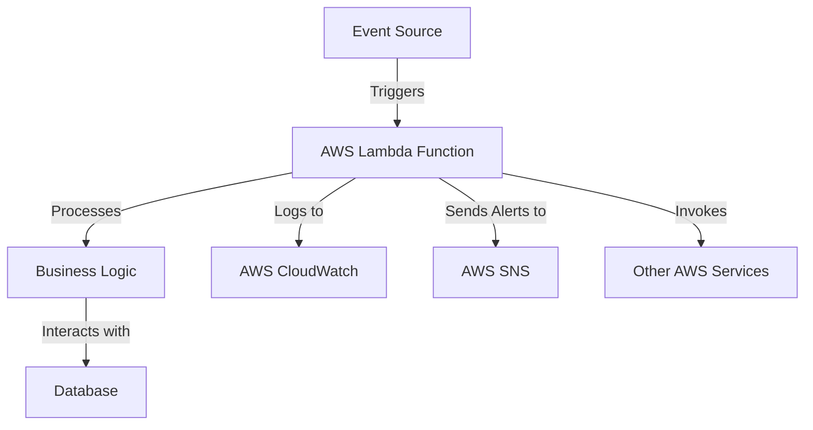

# AWS Lambda Standards

## Overview and scope

The purpose of this document is to establish standards for the use of AWS Lambda within Xentic's infrastructure. These standards aim to ensure consistency, reliability, and maintainability across all Lambda functions deployed in our environment.

### Audience
This document is intended for:
- Software Engineers
- DevOps Engineers
- Solution Architects
- Technical Team Leads

### Scope
This standard covers:
- Naming conventions for Lambda functions and associated resources
- Configuration management
- Deployment practices
- Logging and monitoring
- Security best practices
- Error handling and retries

### Non-goals
This document does NOT cover:
- General AWS best practices outside of Lambda
- Specific application-level logic or implementation details
- Third-party service integrations not related to Lambda

### Glossary
| Term                | Definition                                                                 |
|---------------------|-----------------------------------------------------------------------------|
| AWS Lambda          | A serverless compute service that runs code in response to events.         |
| Function            | A single unit of code deployed to AWS Lambda.                             |
| Event Source        | A service or resource that triggers the execution of a Lambda function.    |
| IAM                 | Identity and Access Management; a service to manage permissions in AWS.    |
| VPC                 | Virtual Private Cloud; a private network within AWS.                       |

### How this standard fits the Xentic platform
The AWS Lambda standards are designed to integrate seamlessly with Xentic's microservices architecture. By adhering to these guidelines, teams can ensure that their Lambda functions are:
- **Consistent**: Following the same naming and configuration patterns facilitates easier collaboration and maintenance.
- **Secure**: Implementing security best practices protects sensitive data and complies with Xentic’s security policies.
- **Observable**: Proper logging and monitoring practices enable teams to quickly identify and resolve issues.

### Configuration Example
A sample configuration for a Lambda function using YAML is provided below:

```yaml
function:
  name: com.xentic.myservice.myFunction
  runtime: java11
  handler: com.xentic.myservice.MyHandler::handleRequest
  memorySize: 512
  timeout: 30
  environment:
    ENVIRONMENT: production
    DB_CONNECTION_STRING: ${DB_CONNECTION_STRING}
```

### Deployment Example
An example of an HCL configuration for Terraform deployment is as follows:

```hcl
resource "aws_lambda_function" "my_lambda_function" {
  function_name = "com.xentic.myservice.myFunction"
  handler       = "com.xentic.myservice.MyHandler::handleRequest"
  runtime       = "java11"
  memory_size   = 512
  timeout       = 30

  environment {
    ENVIRONMENT = "production"
    DB_CONNECTION_STRING = var.db_connection_string
  }

  s3_bucket = "my-bucket"
  s3_key    = "my-function.zip"
}
```

By following these standards, Xentic aims to leverage AWS Lambda effectively while maintaining high standards of quality and security across all deployments.

## Standards and policies

1. **Naming Conventions**  
   Lambda function names MUST follow the pattern `com.xentic.<service>.<function_name>`. For example, a function for user authentication in the authentication service should be named `com.xentic.auth.userAuthentication`.

2. **Code Structure**  
   Lambda functions MUST be structured in a way that separates business logic from handler code. This promotes reusability and easier testing. Code should be organized as follows:
   ```
   com/xentic/<service>/
       ├── handler/
       │   └── MyHandler.java
       ├── service/
       │   └── BusinessLogic.java
       └── model/
           └── User.java
   ```

3. **Configuration Management**  
   All configuration values MUST be stored in environment variables or AWS Systems Manager Parameter Store. Hardcoding sensitive information in the code is NOT allowed.

4. **Timeout Settings**  
   The timeout for Lambda functions MUST be set according to the expected execution time, with a maximum of 30 seconds. Functions that require longer processing MUST be refactored or use AWS Step Functions.

5. **Memory Allocation**  
   Memory size MUST be allocated based on the function's needs. The default should be 512 MB, but it SHOULD be increased if performance testing indicates that the function requires more resources.

6. **Error Handling**  
   Lambda functions MUST implement proper error handling. Uncaught exceptions MUST be logged, and the function should return meaningful error messages. Use structured logging for better observability.

7. **Logging**  
   All Lambda functions MUST use AWS CloudWatch for logging. Logs MUST include the following:
   - Function execution start and end times
   - Input parameters
   - Output results
   - Error messages

   Example logging code:
   ```java
   import org.slf4j.Logger;
   import org.slf4j.LoggerFactory;

   public class MyHandler {
       private static final Logger logger = LoggerFactory.getLogger(MyHandler.class);

       public String handleRequest(String input) {
           logger.info("Function started with input: {}", input);
           // Function logic
           logger.info("Function completed successfully.");
           return "Success";
       }
   }
   ```

8. **Security Best Practices**  
   - IAM roles MUST be scoped to the minimum permissions necessary for the Lambda function to operate. 
   - Sensitive data MUST be encrypted in transit and at rest.
   - Lambda functions MUST NOT have permissions to delete resources unless absolutely necessary.

9. **Deployment Practices**  
   Lambda functions MUST be deployed using Infrastructure as Code (IaC) tools such as Terraform or AWS CloudFormation. Manual deployments are NOT allowed.

10. **Monitoring and Alerts**  
    Monitoring MUST be set up for all Lambda functions using AWS CloudWatch. Alerts MUST be configured for the following:
    - Function errors exceeding 5% of invocations
    - Function timeouts
    - High concurrency usage

11. **Versioning**  
    Lambda functions MUST use versioning to manage deployments. Each deployment MUST create a new version, and the alias should be used for routing traffic to the appropriate version.

12. **Testing**  
    All Lambda functions MUST have unit tests covering at least 80% of the codebase. Integration tests MUST be performed in a staging environment before deploying to production.

By adhering to these standards and policies, Xentic ensures that AWS Lambda functions are reliable, maintainable, and secure, aligning with the company's overall engineering principles.

## Architecture and design

### Component Diagram

The following component diagram illustrates the architecture of an AWS Lambda function within Xentic's infrastructure. It includes the key components, data flows, and integration points.



### Data Flows

1. **Event Triggering**: 
   - AWS Lambda functions are triggered by various event sources such as API Gateway, S3 uploads, DynamoDB streams, or scheduled events (CloudWatch Events).
   - Each event source sends a payload to the Lambda function, which contains the necessary data for processing.

2. **Processing Logic**:
   - Upon invocation, the Lambda function executes its handler, which processes the incoming data.
   - The processing logic may involve interacting with other services, such as databases or third-party APIs.

3. **Database Interaction**:
   - Lambda functions MUST interact with databases (e.g., Amazon RDS, DynamoDB) to read or write data as needed.
   - All database connections MUST be managed efficiently to avoid connection leaks.

4. **Logging and Monitoring**:
   - Logs generated during execution MUST be sent to AWS CloudWatch for monitoring and debugging purposes.
   - Important metrics such as execution time, error rates, and invocation counts MUST be tracked.

5. **Alerting**:
   - Alerts MUST be configured to notify the relevant teams via AWS SNS when specific thresholds are exceeded (e.g., error rates, timeouts).

### Integration Points

- **AWS API Gateway**: Used for exposing Lambda functions as RESTful APIs.
- **AWS S3**: Triggers Lambda functions upon object creation or updates.
- **AWS DynamoDB**: Streams can trigger Lambda functions for real-time data processing.
- **AWS Step Functions**: Can coordinate multiple Lambda functions for complex workflows.
- **AWS SNS**: Used for sending notifications and alerts based on Lambda execution results.

### Failure Domains

- **Lambda Function Failures**:
  - Functions MUST implement retries for transient errors. AWS Lambda automatically retries failed invocations for asynchronous events.
  - For synchronous invocations, clients should handle failures and implement their own retry logic.

- **Database Failures**:
  - Functions MUST handle database connection errors gracefully. Connection pooling or retry mechanisms should be implemented to manage transient database issues.

- **External Service Failures**:
  - When invoking external services, functions MUST implement circuit breaker patterns to prevent cascading failures in case of service unavailability.

- **Logging Failures**:
  - If logging to CloudWatch fails, the function MUST handle this gracefully and ensure that critical errors are still reported through alternative means (e.g., sending alerts).

### Example SQL for Database Interaction

An example SQL query for interacting with a DynamoDB table:

```sql
SELECT * FROM Users WHERE userId = :userId;
```

### Example Code Snippet for Lambda Function

The following Java code snippet demonstrates a simple AWS Lambda function that processes an incoming event and interacts with a database:

```java
import com.amazonaws.services.lambda.runtime.Context;
import com.amazonaws.services.lambda.runtime.RequestHandler;

public class UserProcessor implements RequestHandler<UserEvent, String> {
    @Override
    public String handleRequest(UserEvent event, Context context) {
        logger.info("Received event: {}", event);
        
        // Business Logic
        User user = fetchUserFromDatabase(event.getUserId());
        
        if (user == null) {
            logger.error("User not found for ID: {}", event.getUserId());
            return "User not found";
        }
        
        // Further processing...
        logger.info("Processing user: {}", user);
        return "Success";
    }

    private User fetchUserFromDatabase(String userId) {
        // Implement database interaction logic here
    }
}
```

By following these architectural guidelines, Xentic ensures that AWS Lambda functions are designed for scalability, reliability, and maintainability, aligning with the overall engineering standards of the organization.

## Configuration reference

### application.yml

The following is a sample `application.yml` configuration for a Lambda function within Xentic:

```yaml
lambda:
  function:
    name: com.xentic.auth.userAuthentication
    timeout: 30 # seconds
    memorySize: 512 # MB
  environment:
    DB_URL: ${DB_URL} # Database connection URL
    DB_USER: ${DB_USER} # Database username
    DB_PASSWORD: ${DB_PASSWORD} # Database password
    AWS_REGION: ${AWS_REGION} # AWS Region
    LOG_LEVEL: INFO # Log level
```

### Terraform Configuration

The following Terraform configuration defines an AWS Lambda function with necessary settings:

```hcl
resource "aws_lambda_function" "user_authentication" {
  function_name = "com.xentic.auth.userAuthentication"
  handler       = "com.xentic.auth.handler.UserHandler::handleRequest"
  runtime       = "java11"
  memory_size   = 512
  timeout       = 30

  environment {
    DB_URL      = var.db_url
    DB_USER     = var.db_user
    DB_PASSWORD = var.db_password
    AWS_REGION  = var.aws_region
    LOG_LEVEL   = var.log_level
  }

  s3_bucket = "xentic-lambda-bucket"
  s3_key    = "user-authentication.zip"
}
```

### Environment Variables Table

| Variable Name     | Default Value      | Production Value         |
|-------------------|--------------------|--------------------------|
| `DB_URL`          | `jdbc:mysql://localhost:3306/xentic` | `jdbc:mysql://prod-db.xentic.io:3306/xentic` |
| `DB_USER`         | `root`             | `prod_user`              |
| `DB_PASSWORD`     | `password`         | `secure_password`        |
| `AWS_REGION`      | `us-east-1`        | `us-west-2`              |
| `LOG_LEVEL`       | `INFO`             | `ERROR`                  |

### Additional Configuration Options

- **IAM Role**: The Lambda function MUST be assigned an IAM role with the minimum permissions required for operation.
  
- **VPC Configuration**: If the Lambda function needs access to resources in a VPC, the following configuration MUST be included:

```hcl
vpc_config {
  subnet_ids          = var.subnet_ids
  security_group_ids  = var.security_group_ids
}
```

- **Dead Letter Queue**: A dead letter queue (DLQ) MUST be configured to capture failed events:

```hcl
dead_letter_config {
  target_arn = aws_sqs_queue.lambda_dlq.arn
}
```

### Conclusion

By adhering to the configuration standards outlined above, Xentic ensures that AWS Lambda functions are consistently deployed with the necessary settings for optimal performance and security. All configurations MUST be reviewed and approved before deployment to production environments.

## Implementation guide

To implement AWS Lambda functions at Xentic, follow these step-by-step guidelines ensuring compliance with the established standards.

### Step 1: Set Up Your Development Environment

1. **Install Java SDK**: Ensure you have Java 11 or higher installed.
2. **Install Maven**: Use Maven for dependency management.
3. **Set Up AWS CLI**: Configure AWS CLI with appropriate credentials.

### Step 2: Create a New Maven Project

Create a new Maven project structure as follows:

```
my-lambda-project/
│
├── pom.xml
├── src/
│   ├── main/
│   │   ├── java/
│   │   │   └── com/
│   │   │       └── xentic/
│   │   │           └── auth/
│   │   │               ├── UserProcessor.java
│   │   │               └── UserEvent.java
│   │   └── resources/
│   │       └── application.yml
│   └── test/
│       └── java/
│           └── com/
│               └── xentic/
│                   └── auth/
│                       └── UserProcessorTest.java
```

### Step 3: Define Dependencies in `pom.xml`

Add the following dependencies to your `pom.xml`:

```xml
<project xmlns="http://maven.apache.org/POM/4.0.0"
         xmlns:xsi="http://www.w3.org/2001/XMLSchema-instance"
         xsi:schemaLocation="http://maven.apache.org/POM/4.0.0 http://maven.apache.org/xsd/maven-4.0.0.xsd">
    <modelVersion>4.0.0</modelVersion>
    <groupId>com.xentic.auth</groupId>
    <artifactId>auth-starter</artifactId>
    <version>1.0-SNAPSHOT</version>
    <properties>
        <maven.compiler.source>11</maven.compiler.source>
        <maven.compiler.target>11</maven.compiler.target>
    </properties>
    <dependencies>
        <dependency>
            <groupId>com.amazonaws</groupId>
            <artifactId>aws-lambda-java-core</artifactId>
            <version>1.2.1</version>
        </dependency>
        <dependency>
            <groupId>org.slf4j</groupId>
            <artifactId>slf4j-api</artifactId>
            <version>1.7.30</version>
        </dependency>
        <dependency>
            <groupId>org.junit.jupiter</groupId>
            <artifactId>junit-jupiter</artifactId>
            <version>5.7.1</version>
            <scope>test</scope>
        </dependency>
    </dependencies>
</project>
```

### Step 4: Implement the Lambda Function

Create `UserProcessor.java`:

```java
import com.amazonaws.services.lambda.runtime.Context;
import com.amazonaws.services.lambda.runtime.RequestHandler;
import org.slf4j.Logger;
import org.slf4j.LoggerFactory;

public class UserProcessor implements RequestHandler<UserEvent, String> {
    private static final Logger logger = LoggerFactory.getLogger(UserProcessor.class);

    @Override
    public String handleRequest(UserEvent event, Context context) {
        logger.info("Received event: {}", event);
        
        // Business Logic
        User user = fetchUserFromDatabase(event.getUserId());
        
        if (user == null) {
            logger.error("User not found for ID: {}", event.getUserId());
            return "User not found";
        }
        
        // Further processing...
        logger.info("Processing user: {}", user);
        return "Success";
    }

    private User fetchUserFromDatabase(String userId) {
        // Implement database interaction logic here
        return null; // Placeholder for actual implementation
    }
}
```

Create `UserEvent.java`:

```java
public class UserEvent {
    private String userId;

    public String getUserId() {
        return userId;
    }

    public void setUserId(String userId) {
        this.userId = userId;
    }
}
```

### Step 5: Configure Application Properties

Create `application.yml` in `src/main/resources`:

```yaml
lambda:
  function:
    name: com.xentic.auth.userAuthentication
    timeout: 30 # seconds
    memorySize: 512 # MB
  environment:
    DB_URL: ${DB_URL}
    DB_USER: ${DB_USER}
    DB_PASSWORD: ${DB_PASSWORD}
    AWS_REGION: ${AWS_REGION}
    LOG_LEVEL: INFO
```

### Step 6: Write Unit Tests

Create `UserProcessorTest.java`:

```java
import org.junit.jupiter.api.Test;
import static org.junit.jupiter.api.Assertions.assertEquals;

public class UserProcessorTest {
    @Test
    public void testHandleRequest() {
        UserProcessor processor = new UserProcessor();
        UserEvent event = new UserEvent();
        event.setUserId("12345");
        
        String result = processor.handleRequest(event, null);
        assertEquals("Success", result);
    }
}
```

### Step 7: Package the Lambda Function

Run the following command to package your Lambda function:

```bash
mvn clean package
```

### Step 8: Deploy Using Terraform

Create a Terraform configuration file `lambda.tf`:

```hcl
provider "aws" {
  region = "us-east-1"
}

resource "aws_lambda_function" "user_authentication" {
  function_name = "com.xentic.auth.userAuthentication"
  handler       = "com.xentic.auth.UserProcessor::handleRequest"
  runtime       = "java11"
  memory_size   = 512
  timeout       = 30

  environment {
    DB_URL      = var.db_url
    DB_USER     = var.db_user
    DB_PASSWORD = var.db_password
    AWS_REGION  = var.aws_region
    LOG_LEVEL   = var.log_level
  }

  s3_bucket = "xentic-lambda-bucket"
  s3_key    = "user-authentication.zip"
}
```

### Step 9: Initialize and Apply Terraform

Run the following commands to deploy the Lambda function:

```bash
terraform init
terraform apply
```

### Step 10: Monitor and Test

- Use AWS CloudWatch to monitor logs and metrics.
- Test the Lambda function using the AWS Console or API Gateway.

By following these steps, Xentic ensures that AWS Lambda functions are implemented consistently and in accordance with the company's engineering standards.

## Security requirements

To ensure the security of AWS Lambda functions at Xentic, the following requirements must be adhered to:

### Threat Model Summary

AWS Lambda functions are exposed to various threats, including but not limited to:

- **Unauthorized Access**: Malicious users attempting to invoke functions without proper authentication.
- **Data Breaches**: Sensitive data being exposed through misconfigured permissions or logging.
- **Denial of Service (DoS)**: Attackers overwhelming the function with excessive requests.
- **Injection Attacks**: Malicious inputs leading to SQL injection or other types of code execution.

### Authentication and Authorization (Authn/Z)

1. **IAM Roles**: Each Lambda function MUST be assigned an IAM role with the least privilege principle. This role should only allow necessary actions, such as invoking other AWS services.

   Example IAM policy:

   ```json
   {
     "Version": "2012-10-17",
     "Statement": [
       {
         "Effect": "Allow",
         "Action": [
           "dynamodb:GetItem",
           "dynamodb:PutItem"
         ],
         "Resource": "arn:aws:dynamodb:us-east-1:123456789012:table/MyTable"
       }
     ]
   }
   ```

2. **API Gateway Integration**: If the Lambda function is exposed via API Gateway, it MUST use AWS IAM or Amazon Cognito for authentication. API keys MUST NOT be used for production environments.

### Secrets Management

1. **AWS Secrets Manager**: All sensitive information, such as database credentials, MUST be stored in AWS Secrets Manager. Directly embedding secrets in code or environment variables is NOT permitted.

   Example of retrieving secrets in Java:

   ```java
   import com.amazonaws.services.secretsmanager.AWSSecretsManager;
   import com.amazonaws.services.secretsmanager.AWSSecretsManagerClientBuilder;
   import com.amazonaws.services.secretsmanager.model.GetSecretValueRequest;
   import com.amazonaws.services.secretsmanager.model.GetSecretValueResult;

   public String getSecret(String secretName) {
       AWSSecretsManager client = AWSSecretsManagerClientBuilder.standard().build();
       GetSecretValueRequest getSecretValueRequest = new GetSecretValueRequest().withSecretId(secretName);
       GetSecretValueResult getSecretValueResult = client.getSecretValue(getSecretValueRequest);
       return getSecretValueResult.getSecretString();
   }
   ```

### Input Validation

1. **Input Sanitization**: All inputs to the Lambda function MUST be validated and sanitized to prevent injection attacks. Use libraries like Apache Commons Validator or custom validation logic.

   Example of input validation:

   ```java
   public boolean isValidUserId(String userId) {
       return userId != null && userId.matches("^[a-zA-Z0-9]{1,20}$");
   }
   ```

2. **Error Handling**: Any errors resulting from invalid inputs MUST be logged and handled gracefully without exposing sensitive information.

### Audit Logging

1. **CloudWatch Logs**: All Lambda functions MUST log relevant information to AWS CloudWatch Logs. This includes:

   - Invocation details
   - Input parameters
   - Errors and exceptions

   Example of logging in Java:

   ```java
   import com.amazonaws.services.lambda.runtime.Context;
   import org.slf4j.Logger;
   import org.slf4j.LoggerFactory;

   public class UserProcessor {
       private static final Logger logger = LoggerFactory.getLogger(UserProcessor.class);

       public String handleRequest(UserEvent event, Context context) {
           logger.info("Received event: {}", event);
           // Processing logic...
           return "Success";
       }
   }
   ```

2. **Log Retention Policy**: CloudWatch Logs MUST have a retention policy configured to retain logs for a minimum of 90 days.

### Summary

By implementing these security requirements, Xentic ensures that AWS Lambda functions are protected against common threats while maintaining compliance with internal security policies. All security measures MUST be reviewed and updated regularly to adapt to evolving threats.

## Testing strategy

To ensure the reliability and quality of AWS Lambda functions at Xentic, a comprehensive testing strategy must be implemented. This strategy includes unit tests, integration tests, and contract tests, with defined coverage targets for each type.

### Unit Tests

Unit tests are essential for validating the functionality of individual components in isolation. The following guidelines apply:

- **Coverage Target**: Unit tests MUST achieve a minimum of 80% code coverage.
- **Framework**: Use JUnit 5 for writing unit tests.
- **Mocking**: Utilize Mockito for mocking dependencies.

**Example Unit Test Class:**

```java
import static org.mockito.Mockito.*;
import static org.junit.jupiter.api.Assertions.*;
import org.junit.jupiter.api.Test;

public class UserProcessorTest {
    
    @Test
    public void testHandleRequest_Success() {
        UserProcessor processor = new UserProcessor();
        UserEvent event = new UserEvent();
        event.setUserId("12345");
        
        String result = processor.handleRequest(event, null);
        assertEquals("Success", result);
    }

    @Test
    public void testHandleRequest_UserNotFound() {
        UserProcessor processor = new UserProcessor();
        UserEvent event = new UserEvent();
        event.setUserId("nonexistent");

        String result = processor.handleRequest(event, null);
        assertEquals("User not found", result);
    }
}
```

### Integration Tests

Integration tests validate the interaction between components and external systems, such as databases and AWS services.

- **Coverage Target**: Integration tests SHOULD cover at least 70% of the integration points.
- **Framework**: Use Spring Boot Test for integration testing.
- **Environment**: Integration tests MUST run in a staging environment that mimics production.

**Example Integration Test Class:**

```java
import static org.springframework.test.web.servlet.request.MockMvcRequestBuilders.*;
import static org.springframework.test.web.servlet.result.MockMvcResultMatchers.*;
import org.junit.jupiter.api.Test;
import org.springframework.beans.factory.annotation.Autowired;
import org.springframework.boot.test.autoconfigure.web.servlet.AutoConfigureMockMvc;
import org.springframework.boot.test.context.SpringBootTest;

@SpringBootTest
@AutoConfigureMockMvc
public class UserProcessorIntegrationTest {

    @Autowired
    private MockMvc mockMvc;

    @Test
    public void testUserAuthenticationEndpoint() throws Exception {
        mockMvc.perform(post("/user/authenticate")
                .contentType("application/json")
                .content("{\"userId\":\"12345\"}"))
                .andExpect(status().isOk())
                .andExpect(content().string("Success"));
    }
}
```

### Contract Tests

Contract tests ensure that the API contracts between services are adhered to, preventing breaking changes.

- **Coverage Target**: Contract tests SHOULD cover all published API endpoints.
- **Tooling**: Use Pact for contract testing between services.

**Example Pact Test:**

```java
import au.com.dius.pact.consumer.junit5.PactConsumerTestExt;
import au.com.dius.pact.consumer.junit5.Pact;
import au.com.dius.pact.consumer.dsl.PactDslWithProvider;
import org.junit.jupiter.api.extension.ExtendWith;

@ExtendWith(PactConsumerTestExt.class)
public class UserProcessorContractTest {

    @Pact(consumer = "UserService", provider = "AuthService")
    public RequestResponsePact createPact(PactDslWithProvider builder) {
        return builder
                .given("User exists")
                .uponReceiving("A request to authenticate user")
                .path("/user/authenticate")
                .method("POST")
                .body("{\"userId\":\"12345\"}")
                .willRespondWith()
                .status(200)
                .body("Success")
                .toPact();
    }
}
```

### Coverage Reporting

To maintain high-quality standards, coverage reports MUST be generated and reviewed regularly. Use tools like JaCoCo to generate coverage reports and integrate them into the CI/CD pipeline.

### Summary of Testing Strategy

| Test Type         | Coverage Target | Framework/Tool        |
|-------------------|-----------------|------------------------|
| Unit Tests        | 80%             | JUnit 5, Mockito       |
| Integration Tests  | 70%             | Spring Boot Test       |
| Contract Tests    | All endpoints    | Pact                   |

By adhering to this testing strategy, Xentic ensures that AWS Lambda functions are robust, reliable, and maintainable, ultimately leading to higher quality software delivery.

## Observability and operations

To ensure effective observability and operations of AWS Lambda functions at Xentic, the following standards MUST be adhered to regarding metrics, logs, traces, dashboards, alerts, and SLOs.

### Metrics

1. **Custom Metrics**: Each Lambda function MUST emit custom metrics to Amazon CloudWatch. Metrics to be collected include:
   - Invocation count
   - Error count
   - Duration
   - Throttles

   Example of emitting a custom metric in Java:

   ```java
   import com.amazonaws.services.cloudwatch.AmazonCloudWatch;
   import com.amazonaws.services.cloudwatch.AmazonCloudWatchClientBuilder;
   import com.amazonaws.services.cloudwatch.model.PutMetricDataRequest;
   import com.amazonaws.services.cloudwatch.model.MetricDatum;

   public void emitCustomMetric(String metricName, double value) {
       AmazonCloudWatch cloudWatch = AmazonCloudWatchClientBuilder.defaultClient();
       MetricDatum datum = new MetricDatum()
               .withMetricName(metricName)
               .withValue(value)
               .withUnit("Count");
       PutMetricDataRequest request = new PutMetricDataRequest()
               .withNamespace("Xentic/Lambda")
               .withMetricData(datum);
       cloudWatch.putMetricData(request);
   }
   ```

### Logs

1. **Structured Logging**: All logs MUST be structured in JSON format to facilitate parsing and querying. Include relevant context such as request IDs, user IDs, and timestamps.

   Example of structured logging in Java:

   ```java
   import org.slf4j.Logger;
   import org.slf4j.LoggerFactory;

   public class UserProcessor {
       private static final Logger logger = LoggerFactory.getLogger(UserProcessor.class);

       public String handleRequest(UserEvent event, Context context) {
           logger.info("{\"event\": {}, \"context\": {}}", event, context);
           // Processing logic...
           return "Success";
       }
   }
   ```

2. **Log Aggregation**: Logs MUST be aggregated and monitored using Amazon CloudWatch Logs Insights. Regular queries should be set up to identify anomalies and errors.

### Traces

1. **AWS X-Ray**: All Lambda functions MUST be instrumented with AWS X-Ray for distributed tracing. This allows tracking of requests across microservices.

   Example of enabling X-Ray tracing in a Lambda function:

   ```java
   import com.amazonaws.xray.AWSXRay;
   import com.amazonaws.xray.interceptors.TracingInterceptor;

   public void init() {
       AWSXRay.setInterceptor(new TracingInterceptor());
   }
   ```

2. **Trace Data**: Trace data MUST include information about service latencies, errors, and the overall request flow through the system.

### Dashboards

1. **CloudWatch Dashboards**: A CloudWatch dashboard MUST be created for each Lambda function to visualize key metrics. Each dashboard should include:
   - Invocation count
   - Error count
   - Duration
   - Custom metrics

   Example dashboard configuration in YAML:

   ```yaml
   DashboardName: "UserProcessorDashboard"
   Widgets:
     - Type: "metric"
       Properties:
         Metrics:
           - [ "AWS/Lambda", "Invocations", "FunctionName", "UserProcessor" ]
           - [ "AWS/Lambda", "Errors", "FunctionName", "UserProcessor" ]
           - [ "AWS/Lambda", "Duration", "FunctionName", "UserProcessor" ]
         Title: "User Processor Metrics"
         Period: 300
         Stat: "Sum"
   ```

### Alerts

1. **CloudWatch Alarms**: Alarms MUST be set up for critical metrics such as error rates and invocation counts. Alerts should notify the on-call engineer via Amazon SNS.

   Example alarm configuration:

   ```yaml
   AlarmName: "HighErrorRate"
   MetricName: "Errors"
   Namespace: "AWS/Lambda"
   Statistic: "Sum"
   Period: 300
   EvaluationPeriods: 1
   Threshold: 1
   ComparisonOperator: "GreaterThanThreshold"
   AlarmActions:
     - "arn:aws:sns:us-east-1:123456789012:alerts"
   ```

### SLOs

1. **Service Level Objectives**: Each Lambda function MUST define SLOs for key metrics. Examples include:
   - Error rate < 1%
   - 95th percentile latency < 200ms

   SLOs should be reviewed quarterly and updated as necessary.

### On-Call Runbook Steps

1. **Incident Response**: In the event of an incident, the following steps MUST be followed:
   - Acknowledge the alert within 5 minutes.
   - Investigate using CloudWatch Logs and X-Ray traces.
   - Identify the root cause and document findings.
   - Communicate with stakeholders about the incident status.
   - Implement a fix and deploy the updated Lambda function.
   - Review the incident in a post-mortem meeting to prevent recurrence.

By adhering to these observability and operational standards, Xentic ensures that AWS Lambda functions are monitored effectively, enabling rapid response to incidents and maintaining high service reliability.

## Migration and versioning

When managing AWS Lambda functions at Xentic, it is crucial to have a clear strategy for migration and versioning to ensure stability and backward compatibility. This section outlines the upgrade paths, deprecation policy, backward compatibility, and rollback procedures.

### Upgrade Paths

1. **Semantic Versioning**: All Lambda functions MUST follow semantic versioning (MAJOR.MINOR.PATCH). 
   - MAJOR version increments indicate breaking changes.
   - MINOR version increments indicate backward-compatible new features.
   - PATCH version increments indicate backward-compatible bug fixes.

   Example of versioning in a Lambda function:

   ```yaml
   version: "1.2.0" # MAJOR.MINOR.PATCH
   ```

2. **Versioning Strategy**: 
   - When introducing new features, increment the MINOR version.
   - When making breaking changes, increment the MAJOR version and ensure proper migration paths are documented.
   - PATCH versions should be used for bug fixes that do not alter functionality.

### Deprecation Policy

1. **Deprecation Timeline**: When a feature or version is marked for deprecation, it MUST be communicated to all stakeholders at least 3 months in advance. This includes:
   - Announcing the deprecation in internal channels.
   - Updating documentation to reflect the deprecation.

2. **Grace Period**: A grace period of 6 months MUST be provided after the deprecation announcement before the feature or version is removed.

3. **Deprecated Features**: Deprecated features MUST remain functional until the end of the grace period, but they SHOULD be clearly marked in the documentation.

### Backward Compatibility

1. **Compatibility Testing**: All new versions of Lambda functions MUST be tested for backward compatibility with existing consumers. This includes:
   - Running integration tests against both the new and old versions.
   - Ensuring that existing clients can still function without modification.

2. **API Versioning**: If breaking changes are necessary, API versioning MUST be implemented. The version should be included in the API endpoint.

   Example of versioned API endpoint:

   ```java
   @RequestMapping("/v1/user/authenticate")
   public ResponseEntity<String> authenticateUser(@RequestBody UserRequest request) {
       // Authentication logic...
   }
   ```

### Rollback Procedures

1. **Rollback Strategy**: In case of a failed deployment, a rollback procedure MUST be in place. This includes:
   - Keeping the previous version of the Lambda function available for immediate rollback.
   - Using AWS Lambda versioning to manage different versions of the function.

   Example of rolling back to a previous version:

   ```bash
   aws lambda update-function-configuration --function-name UserProcessor --revision-id <previous-version-id>
   ```

2. **Monitoring Post-Deployment**: After deploying a new version, monitoring MUST be increased for at least 48 hours to ensure that no issues arise. Key metrics to monitor include:
   - Error rates
   - Latency
   - Invocation counts

3. **Documentation of Rollback Events**: Any rollback MUST be documented, including the reason for the rollback, the metrics that triggered it, and the steps taken to resolve the issue.

### Summary of Migration and Versioning Strategy

| Aspect                    | Requirement                                                                 |
|---------------------------|-----------------------------------------------------------------------------|
| Versioning                | MUST follow semantic versioning (MAJOR.MINOR.PATCH)                       |
| Deprecation Notification   | MUST notify stakeholders 3 months in advance                                |
| Grace Period              | MUST provide a 6-month grace period for deprecated features                 |
| Backward Compatibility     | MUST test for compatibility with existing consumers                          |
| Rollback Procedures       | MUST have a documented rollback strategy and maintain previous versions     |

By adhering to these migration and versioning standards, Xentic ensures that AWS Lambda functions can evolve without disrupting existing services, providing a seamless experience for all users.

## FAQ, anti-patterns, and checklists

### FAQ

1. **What is the maximum execution time for a Lambda function?**
   - The maximum execution time for a Lambda function is 15 minutes. Functions MUST be designed to complete within this limit.

2. **How are Lambda functions triggered?**
   - Lambda functions can be triggered by various AWS services such as S3, DynamoDB, API Gateway, and CloudWatch Events. You MUST choose the appropriate trigger based on the use case.

3. **Can Lambda functions access VPC resources?**
   - Yes, Lambda functions can access VPC resources. You MUST configure the function to run within a VPC and assign appropriate security group and subnet settings.

4. **How is memory allocated to a Lambda function?**
   - Memory allocation for a Lambda function can be configured between 128 MB and 10,240 MB. You MUST select the minimum memory required for optimal performance.

5. **What programming languages are supported by AWS Lambda?**
   - AWS Lambda supports several programming languages, including Java, Python, Node.js, and Go. You MUST use one of the supported languages for your function.

6. **How do I handle errors in Lambda functions?**
   - Errors can be handled using try-catch blocks and by implementing error handling strategies such as retries or dead-letter queues (DLQs). You MUST ensure that error handling is robust.

7. **What is the cost structure for AWS Lambda?**
   - AWS Lambda pricing is based on the number of requests and the duration of execution. You MUST monitor usage to manage costs effectively.

8. **How do I deploy Lambda functions?**
   - Lambda functions can be deployed using the AWS Management Console, AWS CLI, or CI/CD pipelines. You MUST use version control and automated deployment strategies.

9. **Can I use environment variables in Lambda functions?**
   - Yes, environment variables can be used to pass configuration settings to Lambda functions. You MUST avoid hardcoding sensitive information.

10. **What is the best practice for managing dependencies in Lambda functions?**
    - Dependencies should be packaged with the Lambda function code or managed using Lambda layers. You MUST ensure that the deployment package is kept lightweight.

### Anti-Patterns

| Anti-Pattern                        | Description                                                                                   |
|-------------------------------------|-----------------------------------------------------------------------------------------------|
| **Hardcoding Configuration**        | Hardcoding values such as database credentials or API keys directly in the code.             |
| **Ignoring Error Handling**         | Failing to implement proper error handling, leading to unhandled exceptions.                  |
| **Excessive Memory Allocation**     | Allocating more memory than necessary, resulting in higher costs without performance benefits. |
| **Long-Running Processes**          | Using Lambda for tasks that exceed the maximum execution time of 15 minutes.                 |
| **Neglecting Logging**              | Not implementing structured logging, making it difficult to debug issues.                     |
| **Not Using Versions**              | Failing to use Lambda function versions and aliases, complicating deployments and rollbacks.  |
| **Overly Complex Functions**        | Creating Lambda functions that do too much, violating the single responsibility principle.    |
| **Lack of Monitoring**              | Not setting up CloudWatch metrics and alarms, leading to undetected failures.                 |

### Pre-Merge Checklist

- [ ] Code adheres to Xentic coding standards.
- [ ] All new features are covered by unit tests.
- [ ] Integration tests are updated and passing.
- [ ] Code is reviewed by at least one other engineer.
- [ ] Documentation is updated to reflect changes.
- [ ] No hardcoded values are present in the codebase.
- [ ] Proper error handling is implemented.

### Production Checklist

- [ ] Deployment package is under the size limit (50 MB unzipped).
- [ ] Environment variables are configured correctly.
- [ ] CloudWatch alarms are set up for critical metrics.
- [ ] CloudFormation templates or infrastructure as code are updated.
- [ ] Rollback procedures are documented and tested.
- [ ] Post-deployment monitoring is in place for at least 48 hours.
- [ ] Stakeholders are notified of the deployment status.
