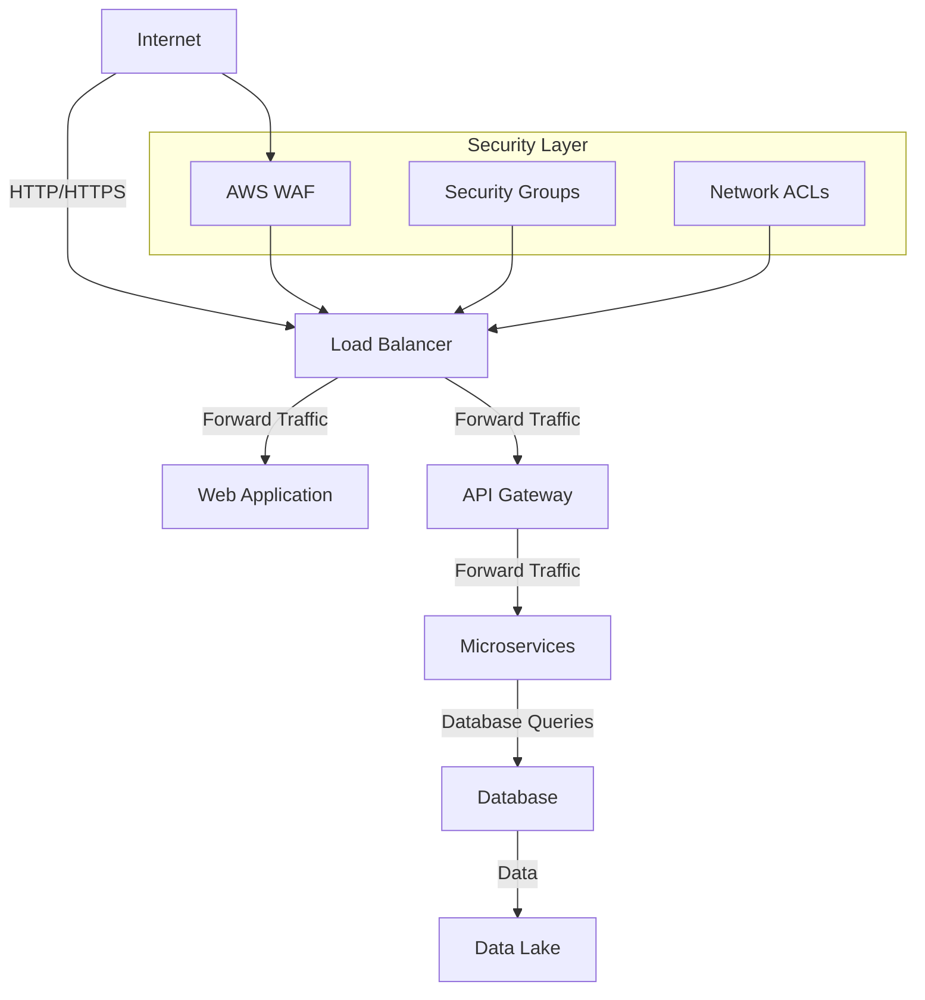

# Network Firewall — AWS

## Overview and scope

The purpose of this document is to establish the standards and best practices for configuring and managing network firewalls within the AWS environment at Xentic. This standard aims to ensure that all network traffic is appropriately filtered, monitored, and controlled to protect the integrity, confidentiality, and availability of Xentic's services and data.

### Audience

This document is intended for:

- Cloud Architects
- DevOps Engineers
- Security Engineers
- Network Administrators
- Application Developers

### Scope

This standard applies to:

- All AWS accounts used by Xentic.
- All network firewall configurations, including but not limited to AWS Security Groups, Network ACLs, and AWS WAF (Web Application Firewall).
- All services hosted on AWS that require network access controls.

### Non-goals

This document does NOT cover:

- Application-level security measures.
- Endpoint security configurations.
- User authentication and authorization mechanisms.

### Glossary

| Term                       | Definition                                                                 |
|----------------------------|-----------------------------------------------------------------------------|
| AWS                        | Amazon Web Services, a comprehensive cloud computing platform.             |
| Security Group             | A virtual firewall that controls inbound and outbound traffic for AWS resources. |
| Network ACL                | A set of rules that controls inbound and outbound traffic at the subnet level. |
| AWS WAF                    | A web application firewall that helps protect applications from common web exploits. |

### How This Standard Fits the Xentic Platform

The network firewall standards outlined in this document are critical to maintaining a secure and resilient Xentic platform. They align with our overall security posture and compliance requirements. Adhering to these standards will ensure that all network traffic is managed effectively, reducing the risk of unauthorized access and potential data breaches.

### Key Principles

- **Least Privilege**: Firewalls MUST be configured to allow only the minimum necessary traffic.
- **Segmentation**: Different environments (e.g., development, testing, production) MUST be segmented using appropriate firewall rules.
- **Monitoring and Logging**: All firewall configurations MUST include logging for auditing and monitoring purposes.

### Example Configuration

#### Security Group Example (YAML)

```yaml
SecurityGroup:
  Type: AWS::EC2::SecurityGroup
  Properties:
    GroupDescription: "Allow HTTP and HTTPS traffic"
    VpcId: "vpc-12345678"
    SecurityGroupIngress:
      - IpProtocol: "tcp"
        FromPort: 80
        ToPort: 80
        CidrIp: "0.0.0.0/0"
      - IpProtocol: "tcp"
        FromPort: 443
        ToPort: 443
        CidrIp: "0.0.0.0/0"
```

#### Network ACL Example (HCL)

```hcl
resource "aws_network_acl" "example" {
  vpc_id = "vpc-12345678"

  ingress {
    rule_no     = 100
    protocol    = "tcp"
    rule_action = "allow"
    cidr_block  = "0.0.0.0/0"
    from_port   = 80
    to_port     = 80
  }

  egress {
    rule_no     = 100
    protocol    = "-1"
    rule_action = "allow"
    cidr_block  = "0.0.0.0/0"
  }
}
```

By adhering to these standards, Xentic will ensure a robust and secure network infrastructure that supports our business objectives while safeguarding our resources.

## Standards and policies

1. **Firewall Configuration**  
   All network firewalls MUST be configured according to the principle of least privilege. Only necessary ports and protocols for each service MUST be allowed.

2. **Service Naming Conventions**  
   All AWS resources, including firewalls, MUST adhere to the naming conventions defined in the Xentic standards. For example, security groups MUST be prefixed with `sg-` followed by the service name, e.g., `sg-auth-service`.

3. **Use of Tags**  
   All AWS firewall configurations MUST include tags for identification and cost allocation. Tags MUST include at least `Environment`, `Owner`, and `Service`.

4. **Segmentation**  
   Environments MUST be isolated using separate security groups and network ACLs. For example, production and development environments MUST NOT share the same firewall rules.

5. **Logging and Monitoring**  
   All firewalls MUST have logging enabled. Logs MUST be sent to a centralized logging service, such as AWS CloudWatch Logs, for monitoring and auditing purposes.

6. **Regular Review**  
   Firewall rules MUST be reviewed at least quarterly to ensure they are still necessary and comply with the current security posture of Xentic.

7. **Change Management**  
   Any changes to firewall configurations MUST go through the change management process as defined in Xentic's internal policies. This includes peer reviews and approvals.

8. **Default Deny Rule**  
   All security groups MUST have a default deny rule for inbound traffic. Only specific allow rules for necessary traffic SHOULD be added.

9. **Use of AWS WAF**  
   For web applications, AWS WAF MUST be implemented to protect against common web exploits such as SQL injection and cross-site scripting.

10. **IP Whitelisting**  
    Where feasible, IP whitelisting MUST be used to restrict access to specific known IP addresses or ranges for sensitive services.

11. **Network ACL Rules**  
    Network ACLs MUST be used to provide an additional layer of security at the subnet level. Ingress and egress rules MUST be defined to allow only necessary traffic.

12. **Documentation**  
    All firewall configurations MUST be documented in the internal knowledge base at `https://docs.internal.xentic.io/firewall-configs`. Documentation MUST include the purpose of each rule and any associated risks.

13. **Automated Compliance Checks**  
    Automated compliance checks MUST be implemented to ensure that firewall configurations adhere to Xentic standards. Tools such as AWS Config MUST be utilized for this purpose.

14. **Incident Response**  
    In the event of a security incident, firewall configurations MUST be reviewed as part of the incident response process to identify potential weaknesses or misconfigurations.

15. **Training and Awareness**  
    All personnel involved in the management of network firewalls MUST receive regular training on security best practices and Xentic’s policies.

16. **Third-Party Access**  
    Access to Xentic's AWS resources by third parties MUST be controlled and monitored. Temporary access MUST be granted through specific security groups with strict time limits.

17. **Testing Firewall Rules**  
    Any new firewall rules MUST be tested in a staging environment before being deployed to production to avoid service disruptions.

18. **Backup Configurations**  
    Firewall configurations MUST be backed up regularly to ensure they can be restored in case of accidental deletion or misconfiguration.

19. **Compliance with Regulations**  
    All firewall configurations MUST comply with relevant legal and regulatory requirements applicable to Xentic's operations, including GDPR and HIPAA where applicable.

20. **Use of Security Tools**  
    Security tools such as AWS GuardDuty MUST be enabled to provide additional threat detection capabilities and alerting for suspicious activities related to network traffic.

By adhering to these standards and policies, Xentic will maintain a secure and resilient network infrastructure, ensuring the protection of its services and data against potential threats.

## Architecture and design

The architecture of the network firewall within the AWS environment at Xentic is designed to provide a robust security posture while ensuring efficient traffic management. The following sections outline the component diagram, data flows, integration points, and failure domains.

### Component Diagram



### Data Flows

- **Incoming Traffic**: 
  - Traffic from the Internet flows through the AWS WAF, which inspects requests for malicious patterns.
  - Valid requests are forwarded to the Load Balancer, which distributes traffic to the Web Application and API Gateway.

- **Internal Communication**: 
  - The API Gateway routes requests to various Microservices based on the defined paths.
  - Microservices interact with the Database for data retrieval and storage.

- **Data Storage**: 
  - The Database stores structured data, while the Data Lake is used for unstructured data analytics.

### Integration Points

- **AWS WAF**: 
  - Integrates with the Load Balancer to filter incoming traffic based on predefined rules.

- **Load Balancer**: 
  - Integrates with both the Web Application and API Gateway, ensuring high availability and load distribution.

- **Microservices**: 
  - Each Microservice communicates with the Database and may also interact with other Microservices for complex operations.

- **Monitoring Tools**: 
  - AWS CloudWatch is integrated for logging and monitoring firewall activities and network traffic.

### Failure Domains

- **Load Balancer Failure**: 
  - If the Load Balancer fails, incoming traffic will not reach the Web Application or API Gateway. This can be mitigated by using multiple Availability Zones.

- **WAF Misconfiguration**: 
  - Incorrect rules in the AWS WAF can lead to legitimate traffic being blocked. Regular reviews of WAF rules MUST be conducted.

- **Database Outage**: 
  - A failure in the Database will affect all Microservices that rely on it. Implementing read replicas and failover strategies is essential.

- **Network ACL and Security Group Misconfigurations**: 
  - Misconfigured rules can lead to unintended access or denial of service. Regular audits and automated compliance checks MUST be performed.

### Summary

The architecture and design of the network firewall at Xentic leverage AWS services to create a secure and resilient environment. By implementing the outlined component diagram, managing data flows effectively, ensuring integration points are robust, and recognizing potential failure domains, Xentic can maintain a high level of security and operational efficiency.

## Configuration reference

### application.yml Example

The following is an example configuration for the application.yml file, which includes settings for network firewall rules.

```yaml
firewall:
  securityGroup:
    groupDescription: "Allow HTTP and HTTPS traffic"
    vpcId: "vpc-12345678"
    ingressRules:
      - ipProtocol: "tcp"
        fromPort: 80
        toPort: 80
        cidrIp: "0.0.0.0/0"
      - ipProtocol: "tcp"
        fromPort: 443
        toPort: 443
        cidrIp: "0.0.0.0/0"
    egressRules:
      - ipProtocol: "-1"
        fromPort: 0
        toPort: 0
        cidrIp: "0.0.0.0/0"
```

### Terraform Configuration Example

The following Terraform configuration demonstrates how to set up a security group with appropriate ingress and egress rules.

```hcl
resource "aws_security_group" "web_sg" {
  name        = "sg-web-service"
  description = "Allow HTTP and HTTPS traffic"
  vpc_id      = "vpc-12345678"

  ingress {
    from_port   = 80
    to_port     = 80
    protocol    = "tcp"
    cidr_blocks = ["0.0.0.0/0"]
  }

  ingress {
    from_port   = 443
    to_port     = 443
    protocol    = "tcp"
    cidr_blocks = ["0.0.0.0/0"]
  }

  egress {
    from_port   = 0
    to_port     = 0
    protocol    = "-1"
    cidr_blocks = ["0.0.0.0/0"]
  }

  tags = {
    Environment = "production"
    Owner       = "team-x"
    Service     = "web-service"
  }
}
```

### Environment Variables

The following table outlines the environment variables that can be configured for network firewall settings, including default and production values.

| Variable                 | Default Value         | Production Value      |
|--------------------------|-----------------------|------------------------|
| `FIREWALL_VPC_ID`       | `vpc-12345678`        | `vpc-prod-98765432`    |
| `FIREWALL_HTTP_PORT`    | `80`                  | `80`                   |
| `FIREWALL_HTTPS_PORT`   | `443`                 | `443`                  |
| `FIREWALL_CIDR`         | `0.0.0.0/0`           | `192.168.1.0/24`       |

### SQL Example for Logging Firewall Rules

To log firewall rules into a database for auditing purposes, the following SQL command can be used.

```sql
CREATE TABLE firewall_rules (
    id SERIAL PRIMARY KEY,
    rule_description VARCHAR(255) NOT NULL,
    action VARCHAR(10) NOT NULL,
    protocol VARCHAR(10) NOT NULL,
    from_port INT NOT NULL,
    to_port INT NOT NULL,
    cidr_block VARCHAR(20) NOT NULL,
    created_at TIMESTAMP DEFAULT CURRENT_TIMESTAMP
);

INSERT INTO firewall_rules (rule_description, action, protocol, from_port, to_port, cidr_block)
VALUES 
    ('Allow HTTP traffic', 'ALLOW', 'tcp', 80, 80, '0.0.0.0/0'),
    ('Allow HTTPS traffic', 'ALLOW', 'tcp', 443, 443, '0.0.0.0/0');
```

### Summary

By adhering to the configuration references outlined above, Xentic can ensure that its network firewall settings are consistently applied across various environments, thereby enhancing security and compliance with internal standards.

## Implementation guide

To implement network firewall configurations in AWS for Xentic, follow the steps outlined below. This guide provides a comprehensive approach to setting up security groups, configuring AWS WAF, and ensuring compliance with internal standards.

### Step 1: Create a Security Group

First, create a security group that allows HTTP and HTTPS traffic. This can be done using the AWS Management Console or through Terraform.

#### Terraform Configuration

```hcl
resource "aws_security_group" "web_sg" {
  name        = "sg-web-service"
  description = "Allow HTTP and HTTPS traffic"
  vpc_id      = var.firewall_vpc_id

  ingress {
    from_port   = 80
    to_port     = 80
    protocol    = "tcp"
    cidr_blocks = ["0.0.0.0/0"]
  }

  ingress {
    from_port   = 443
    to_port     = 443
    protocol    = "tcp"
    cidr_blocks = ["0.0.0.0/0"]
  }

  egress {
    from_port   = 0
    to_port     = 0
    protocol    = "-1"
    cidr_blocks = ["0.0.0.0/0"]
  }

  tags = {
    Environment = "production"
    Owner       = "team-x"
    Service     = "web-service"
  }
}
```

### Step 2: Configure AWS WAF

Next, configure AWS WAF to protect your web applications from common web exploits. Create a WAF web ACL and associate it with your load balancer.

#### AWS CLI Example

```bash
aws wafv2 create-web-acl \
    --name "WebACL" \
    --scope "REGIONAL" \
    --default-action '{"Block": {}}' \
    --visibility-config '{"SampledRequestsEnabled": true, "CloudWatchMetricsEnabled": true, "MetricName": "WebACLMetric"}' \
    --rules '[{"Name": "AllowAll", "Priority": 1, "Statement": {"ByteMatchStatement": {"SearchString": "example", "FieldToMatch": {"UriPath": {}}, "TextTransformations": [{"Priority": 0, "Type": "NONE"}]}}, "Action": {"Allow": {}}, "VisibilityConfig": {"SampledRequestsEnabled": true, "CloudWatchMetricsEnabled": true, "MetricName": "AllowAll"}}]' \
    --region us-east-1
```

### Step 3: Associate WAF with Load Balancer

After creating the WAF, associate it with your load balancer to start filtering incoming traffic.

#### AWS CLI Example

```bash
aws wafv2 associate-web-acl \
    --web-acl-arn "arn:aws:wafv2:us-east-1:123456789012:regional/webacl/WebACL/abcd1234-efgh-5678-ijkl-mnopqrstuvwxyz" \
    --resource-arn "arn:aws:elasticloadbalancing:us-east-1:123456789012:loadbalancer/app/my-load-balancer/50dc6c495c0c9188" \
    --region us-east-1
```

### Step 4: Validate Security Group Rules

Validate that your security group rules are correctly applied. Use the AWS CLI or Management Console to check the ingress and egress rules.

#### AWS CLI Example

```bash
aws ec2 describe-security-groups --group-ids $(aws ec2 describe-security-groups --filters "Name=group-name,Values=sg-web-service" --query "SecurityGroups[*].GroupId" --output text)
```

### Step 5: Implement Logging for Firewall Rules

To maintain an audit trail of firewall rules, implement logging in your database. Use the following SQL command to create a logging table.

#### SQL Command

```sql
CREATE TABLE firewall_logs (
    id SERIAL PRIMARY KEY,
    action VARCHAR(10) NOT NULL,
    rule_description VARCHAR(255) NOT NULL,
    timestamp TIMESTAMP DEFAULT CURRENT_TIMESTAMP
);
```

### Step 6: Insert Firewall Events into the Log

Whenever a firewall rule is triggered, log the event using the following SQL command.

```sql
INSERT INTO firewall_logs (action, rule_description)
VALUES ('ALLOW', 'HTTP traffic allowed'),
       ('ALLOW', 'HTTPS traffic allowed');
```

### Step 7: Regular Review and Compliance Checks

Conduct regular reviews of firewall configurations and compliance checks using AWS Config. Ensure that all configurations adhere to Xentic standards.

### Summary

By following this implementation guide, Xentic can effectively set up and manage network firewalls in AWS. The steps outlined ensure that security groups are properly configured, AWS WAF is utilized for protection, and logging is established for compliance and auditing purposes. Regular reviews and automated checks will help maintain a secure network infrastructure.

## Security requirements

To ensure the security of Xentic's network infrastructure on AWS, the following requirements must be adhered to:

### Threat Model Summary

1. **Unauthorized Access**: Attackers may attempt to gain unauthorized access to services.
2. **Data Breach**: Sensitive data may be exposed through misconfigured security groups or insufficient access controls.
3. **Denial of Service (DoS)**: Attackers may launch DoS attacks to disrupt service availability.
4. **Malicious Payloads**: Web applications may be targeted with malicious payloads to exploit vulnerabilities.

### Authentication and Authorization (AuthN/Z)

- **IAM Roles**: All services MUST use AWS IAM roles for authentication, ensuring that only authorized entities can access resources.
- **Least Privilege Principle**: Permissions MUST be granted based on the least privilege principle, ensuring users and services have only the access necessary to perform their functions.
- **Multi-Factor Authentication (MFA)**: MFA MUST be enforced for all administrative access to AWS Management Console and critical services.

### Secrets Management

- **AWS Secrets Manager**: Secrets (e.g., database credentials, API keys) MUST be stored in AWS Secrets Manager to ensure secure access and management.
- **Environment Variables**: Secrets MUST NOT be hard-coded in application code. Instead, they should be injected at runtime using environment variables or configuration management tools.
- **Encryption**: All secrets MUST be encrypted both at rest and in transit using AWS KMS.

### Input Validation

- **Sanitization**: All user inputs MUST be sanitized to prevent SQL injection and cross-site scripting (XSS) attacks.
- **Validation Libraries**: Use established libraries for input validation, such as `javax.validation` for Java applications.
- **Error Handling**: Applications MUST NOT expose stack traces or sensitive information in error messages. Instead, generic error messages should be returned to users.

### Audit Logging

- **CloudTrail**: AWS CloudTrail MUST be enabled to log all API calls made within the AWS account for auditing purposes.
- **Custom Application Logs**: Applications MUST log all access attempts, including successful logins and failed login attempts, to a centralized logging service.
- **Log Retention Policy**: Logs MUST be retained for a minimum of 90 days for compliance and forensic analysis.

### Example Configuration for Logging

The following YAML configuration demonstrates how to enable logging for AWS services:

```yaml
logging:
  cloudTrail:
    enabled: true
    s3Bucket: "xentic-cloudtrail-logs"
    logRetentionDays: 90
  application:
    logLevel: "INFO"
    logFilePath: "/var/log/xentic-app.log"
```

### Example SQL for Audit Logging

To create an audit log table for application access, use the following SQL command:

```sql
CREATE TABLE access_logs (
    id SERIAL PRIMARY KEY,
    user_id INT NOT NULL,
    action VARCHAR(50) NOT NULL,
    timestamp TIMESTAMP DEFAULT CURRENT_TIMESTAMP,
    ip_address VARCHAR(45) NOT NULL
);

INSERT INTO access_logs (user_id, action, ip_address)
VALUES 
    (1, 'LOGIN_SUCCESS', '192.168.1.10'),
    (2, 'LOGIN_FAILURE', '192.168.1.11');
```

### Summary

By adhering to the outlined security requirements, Xentic can effectively mitigate risks associated with unauthorized access, data breaches, and service disruptions. Implementing robust authentication and authorization mechanisms, managing secrets securely, validating inputs, and maintaining comprehensive audit logs are critical components of a secure network infrastructure on AWS.

## Testing strategy

To ensure the reliability and security of network firewall configurations in AWS, Xentic MUST implement a comprehensive testing strategy that includes unit tests, integration tests, and contract tests. The following sections outline the specific testing types, coverage targets, and example test classes.

### Testing Types

1. **Unit Tests**
   - Validate individual components of the firewall configuration logic.
   - Coverage target: 80% of all methods MUST be covered by unit tests.

2. **Integration Tests**
   - Test the interaction between the firewall configurations and other AWS services (e.g., EC2, WAF).
   - Coverage target: 75% of integration points MUST be tested.

3. **Contract Tests**
   - Ensure that the configurations adhere to defined contracts between services.
   - Coverage target: 100% of critical service interactions MUST have contract tests.

### Coverage Targets

| Test Type        | Coverage Target |
|------------------|-----------------|
| Unit Tests       | 80%             |
| Integration Tests| 75%             |
| Contract Tests   | 100%            |

### Example Test Classes

#### Unit Test Example

```java
package com.xentic.firewall;

import org.junit.jupiter.api.Test;
import static org.junit.jupiter.api.Assertions.*;

class SecurityGroupConfigTest {

    @Test
    void testSecurityGroupCreation() {
        SecurityGroupConfig config = new SecurityGroupConfig();
        String groupId = config.createSecurityGroup("sg-web-service");
        
        assertNotNull(groupId);
        assertEquals("sg-web-service", config.getSecurityGroupName(groupId));
    }
}
```

#### Integration Test Example

```java
package com.xentic.firewall.integration;

import org.junit.jupiter.api.Test;
import static org.junit.jupiter.api.Assertions.*;
import software.amazon.awssdk.services.ec2.Ec2Client;

class FirewallIntegrationTest {

    private final Ec2Client ec2Client = Ec2Client.create();

    @Test
    void testSecurityGroupIngressRules() {
        String groupId = "sg-web-service";
        var response = ec2Client.describeSecurityGroups(r -> r.groupIds(groupId));
        
        assertTrue(response.securityGroups().get(0).ipPermissions().stream()
            .anyMatch(permission -> permission.fromPort() == 80 && permission.toPort() == 80));
    }
}
```

#### Contract Test Example

```java
package com.xentic.firewall.contract;

import org.junit.jupiter.api.Test;
import static org.junit.jupiter.api.Assertions.*;

class FirewallContractTest {

    @Test
    void testFirewallContract() {
        // Mocking the expected behavior
        FirewallService service = new FirewallService();
        String expectedResponse = "ALLOW";
        
        String actualResponse = service.checkAccess("192.168.1.10", 80);
        
        assertEquals(expectedResponse, actualResponse);
    }
}
```

### Best Practices for Testing

- **Automate Tests**: All tests MUST be automated and run in a CI/CD pipeline to ensure that any changes to the firewall configurations do not introduce regressions.
- **Use Mocks**: When testing interactions with AWS services, utilize mocking frameworks (e.g., Mockito) to simulate AWS responses and avoid incurring costs.
- **Run Tests in Isolation**: Tests MUST be run in isolation to prevent side effects between tests, ensuring that each test is independent and reliable.
- **Maintain Test Data**: Use a consistent and clean test data setup for integration tests to ensure repeatability.

### Summary

By implementing a robust testing strategy that includes unit, integration, and contract tests, Xentic can ensure that its network firewall configurations are reliable and compliant with internal standards. Adhering to the defined coverage targets and best practices will enhance the overall quality and security of the network infrastructure on AWS.

## Observability and operations

To ensure effective observability and operations of network firewalls in AWS, Xentic MUST implement a comprehensive monitoring and alerting strategy. This includes metrics collection, logging, tracing, dashboards, alerts, and service level objectives (SLOs). The following sections provide detailed requirements and examples.

### Metrics

Xentic MUST collect the following key metrics related to network firewall performance:

- **Incoming Traffic**: Measure the total number of incoming requests to the firewall.
- **Blocked Requests**: Track the number of requests blocked by the firewall.
- **Latency**: Measure the response time for requests passing through the firewall.
- **Error Rates**: Monitor the percentage of requests resulting in errors (e.g., 4xx and 5xx responses).

#### Example Metrics Configuration (Prometheus)

```yaml
metrics:
  enabled: true
  endpoint: "/metrics"
  collectionInterval: 15s
  metricsList:
    - name: incoming_requests
      type: counter
    - name: blocked_requests
      type: counter
    - name: latency
      type: histogram
    - name: error_rate
      type: gauge
```

### Logs

Xentic MUST implement centralized logging for all firewall-related activities. The following logs should be captured:

- **Access Logs**: Record all incoming requests, including source IP, request path, and response status.
- **Error Logs**: Capture details of any errors encountered, including timestamps and error messages.
- **Configuration Changes**: Log all changes made to firewall configurations, including who made the change and when.

#### Example Logging Configuration (AWS CloudWatch)

```yaml
logging:
  cloudWatch:
    logGroup: "xentic-firewall-logs"
    retentionInDays: 90
    logStream: "firewall-access-logs"
```

### Traces

Distributed tracing MUST be implemented to monitor the flow of requests through the firewall. This enables Xentic to identify performance bottlenecks and troubleshoot issues effectively.

#### Example Tracing Configuration (OpenTelemetry)

```yaml
tracing:
  enabled: true
  serviceName: "xentic-firewall"
  endpoint: "http://otel-collector:4317"
  samplingRate: 0.1
```

### Dashboards

Xentic SHOULD create dashboards to visualize key metrics and logs. Dashboards should include:

- **Traffic Overview**: A summary of incoming traffic and blocked requests over time.
- **Error Rates**: A graph displaying the percentage of requests resulting in errors.
- **Latency Metrics**: A visualization of latency trends to identify performance issues.

#### Example Dashboard (Grafana)

| Dashboard Name      | Panels Included                          |
|---------------------|-----------------------------------------|
| Firewall Overview    | Incoming Traffic, Blocked Requests      |
| Error Monitoring     | Error Rates, Recent Errors              |
| Performance Metrics   | Latency Trends, Response Time           |

### Alerts

Xentic MUST set up alerts based on the collected metrics to proactively monitor the firewall's health. Alerts should include:

- **High Blocked Requests**: Alert if blocked requests exceed a defined threshold.
- **Increased Latency**: Notify if latency exceeds acceptable limits.
- **Error Rate Spike**: Trigger an alert if error rates increase significantly.

#### Example Alert Configuration (AWS CloudWatch Alarms)

```yaml
alarms:
  - name: HighBlockedRequests
    metric: blocked_requests
    threshold: 100
    comparisonOperator: GreaterThanThreshold
    evaluationPeriods: 1
    period: 60
    statistic: Sum
    actions:
      - notify: "team-alerts@example.com"

  - name: IncreasedLatency
    metric: latency
    threshold: 200
    comparisonOperator: GreaterThanThreshold
    evaluationPeriods: 1
    period: 60
    statistic: Average
    actions:
      - notify: "team-alerts@example.com"
```

### Service Level Objectives (SLOs)

Xentic MUST define SLOs for the firewall to ensure that it meets performance and reliability expectations. Suggested SLOs include:

- **99.9% Availability**: The firewall must be available 99.9% of the time.
- **Response Time**: 95% of requests must have a latency of less than 200ms.
- **Error Rate**: The error rate must remain below 1% for all requests.

### On-Call Runbook Steps

In the event of an incident, Xentic MUST follow these on-call runbook steps:

1. **Identify the Incident**: Check alerts and logs to determine the nature of the incident.
2. **Assess Impact**: Evaluate the impact on services and users.
3. **Mitigate Risks**: If necessary, temporarily adjust firewall rules to mitigate immediate risks.
4. **Investigate**: Analyze logs and metrics to identify the root cause.
5. **Document Findings**: Record the incident details, including actions taken and lessons learned.
6. **Communicate**: Notify stakeholders of the incident resolution and any required follow-up actions.

### Summary

By implementing comprehensive observability and operations practices, including metrics, logs, traces, dashboards, alerts, SLOs, and on-call runbook steps, Xentic can ensure the effective monitoring and management of network firewalls in AWS. These practices are critical for maintaining a secure and reliable network infrastructure.

## Migration and versioning

Xentic MUST establish clear guidelines for migration and versioning of network firewall configurations to ensure smooth transitions between versions, maintain backward compatibility, and facilitate rollback if necessary. The following policies and practices are mandatory:

### Upgrade Paths

- **Incremental Upgrades**: Upgrades MUST be performed incrementally, moving from one stable version to the next. Major version changes MUST be carefully planned and tested.
- **Documentation**: Each version MUST include comprehensive release notes that outline new features, bug fixes, and any breaking changes.
- **Versioning Scheme**: Xentic MUST adopt a semantic versioning scheme (MAJOR.MINOR.PATCH) for firewall configurations. For example:
  - **MAJOR**: Incompatible API changes
  - **MINOR**: New features added in a backward-compatible manner
  - **PATCH**: Backward-compatible bug fixes

### Deprecation Policy

- **Deprecation Notices**: Features that are planned for deprecation MUST be communicated to all stakeholders at least one release cycle in advance.
- **Grace Period**: Deprecated features MUST remain available for a minimum of two release cycles before removal.
- **Alternatives**: Xentic MUST provide clear alternatives or migration paths for deprecated features.

### Backward Compatibility

- **Compatibility Testing**: All new versions MUST undergo compatibility testing to ensure that existing configurations and integrations continue to function as expected.
- **Feature Flags**: New features MUST be implemented behind feature flags to allow for gradual rollout and easy rollback if issues arise.

### Rollback Procedures

In the event of a failure during a migration, Xentic MUST have a rollback procedure in place:

1. **Backup Configurations**: Before any upgrade, a complete backup of the current firewall configuration MUST be taken.
2. **Rollback Plan**: A documented rollback plan MUST be created, detailing the steps required to revert to the previous version.
3. **Automated Rollback**: Where possible, rollback processes MUST be automated to minimize downtime and human error.

#### Example Rollback Configuration (AWS CLI)

```bash
# Backup current configuration
aws ec2 describe-security-groups --group-ids sg-web-service > backup-sg-web-service.json

# Rollback to previous configuration
aws ec2 create-security-group --group-name sg-web-service --description "Rollback security group"
aws ec2 authorize-security-group-ingress --group-id <NEW_GROUP_ID> --protocol tcp --port 80 --cidr 0.0.0.0/0
```

### Migration Checklist

| Task                                | Status        |
|-------------------------------------|---------------|
| Backup current configurations        | Completed     |
| Review release notes                | Completed     |
| Test compatibility with existing setups | In Progress   |
| Implement feature flags              | Not Started   |
| Rollback plan documented            | Completed     |
| Notify stakeholders                 | Pending       |

### Versioning Example

An example of a versioning strategy for a firewall configuration might look like this:

```yaml
version: "1.2.0"
releaseDate: "2023-10-01"
changes:
  - added: 
      - "Support for IPv6"
  - fixed:
      - "Resolved issue with incorrect IP filtering"
  - deprecated:
      - "Support for legacy security group rules (will be removed in 2.0.0)"
```

### Summary

By adhering to these migration and versioning policies, Xentic can ensure that network firewall configurations are managed effectively, minimizing disruptions and maintaining a high level of service reliability. The established processes for upgrade paths, deprecation, backward compatibility, and rollback procedures are essential for maintaining the integrity of the network infrastructure.

## FAQ, anti-patterns, and checklists

### FAQ

1. **What is the primary purpose of the network firewall?**
   - The network firewall is designed to control incoming and outgoing network traffic based on predetermined security rules, protecting Xentic's infrastructure from unauthorized access and threats.

2. **How often should firewall rules be reviewed?**
   - Firewall rules MUST be reviewed at least quarterly or whenever there are significant changes to the network or application architecture.

3. **What should be done if a firewall rule is found to be ineffective?**
   - If a rule is ineffective, it MUST be modified or removed immediately, and the change MUST be documented in the configuration change logs.

4. **Can we use default firewall configurations provided by AWS?**
   - Xentic MUST NOT rely solely on default configurations; all firewall settings MUST be customized to meet specific security requirements.

5. **How do we handle temporary access requests?**
   - Temporary access requests MUST be documented, approved by the security team, and implemented using time-bound rules that are automatically removed after the access period expires.

6. **What is the procedure for logging access to the firewall?**
   - All access MUST be logged as specified in the logging section, including timestamps, source IPs, and actions taken.

7. **How do we ensure compliance with security policies?**
   - Compliance MUST be ensured through regular audits, automated checks, and adherence to the established security guidelines outlined in this document.

8. **What actions should be taken in case of a security breach?**
   - In case of a breach, the incident response plan MUST be initiated, including immediate containment, investigation, and communication to stakeholders.

9. **Are there any specific IP ranges that should be whitelisted?**
   - Whitelisting MUST be limited to known and trusted IP ranges, and all requests from other IPs MUST be denied by default.

10. **How can we monitor the effectiveness of our firewall?**
    - Effectiveness MUST be monitored through metrics, logs, and alerts as defined in the observability practices, enabling proactive management of firewall performance.

### Anti-Patterns

| Anti-Pattern                          | Description                                                                                     |
|---------------------------------------|-------------------------------------------------------------------------------------------------|
| Overly Permissive Rules               | Rules that allow broad access (e.g., allowing all IPs) should be avoided.                      |
| Ignoring Logs                         | Failing to review logs regularly can lead to missed security incidents.                        |
| Hardcoding Secrets                    | Secrets or credentials MUST NOT be hardcoded in firewall configurations.                        |
| Lack of Documentation                 | Changes made to firewall rules MUST be documented to maintain an accurate configuration history.|
| Using Default Settings                 | Relying on AWS default settings without customization can lead to security vulnerabilities.     |
| Neglecting Testing                    | Firewall rules MUST be tested in a staging environment before being applied to production.     |

### Pre-Merge Checklist

| Task                                      | Status        |
|-------------------------------------------|---------------|
| Review firewall rule changes               | Completed     |
| Ensure compliance with security policies    | Completed     |
| Document all changes                       | In Progress   |
| Validate against existing configurations    | Not Started   |
| Conduct peer review of changes             | Pending       |

### Production Checklist

| Task                                      | Status        |
|-------------------------------------------|---------------|
| Backup current firewall configurations      | Completed     |
| Confirm logging is enabled and configured  | Completed     |
| Verify alerting mechanisms are operational  | In Progress   |
| Test new rules in a staging environment    | Not Started   |
| Communicate changes to stakeholders         | Pending       |
