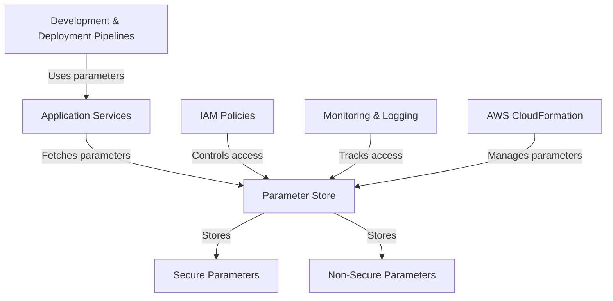

# Systems Manager Parameter Store — AWS

## Overview and scope

The purpose of this document is to establish standards and best practices for using AWS Systems Manager Parameter Store within the Xentic infrastructure. It aims to provide guidance on how to securely store, manage, and retrieve application configuration data and secrets, ensuring consistency and security across all services.

### Audience

This document is intended for:

- **Software Engineers**: Responsible for implementing and integrating AWS Systems Manager Parameter Store in applications.
- **DevOps Engineers**: Tasked with managing infrastructure and deployment pipelines utilizing Parameter Store.
- **Architects**: Overseeing the architectural decisions related to configuration management and security.
- **Security Teams**: Ensuring compliance with security policies related to sensitive data management.

### Scope

This standard covers:

- Configuration management practices using AWS Systems Manager Parameter Store.
- Guidelines for storing different types of parameters (String, SecureString, StringList).
- Access control and permissions related to Parameter Store.
- Integration patterns with Xentic services.

### Non-goals

This document does NOT cover:

- Detailed AWS Systems Manager Parameter Store API documentation.
- Alternatives to Parameter Store (e.g., AWS Secrets Manager).
- Specific implementation details for every Xentic service, as these may vary.

### Glossary

| Term                | Definition                                                                 |
|---------------------|-----------------------------------------------------------------------------|
| Parameter Store     | A service that provides secure, hierarchical storage for configuration data. |
| SecureString        | A parameter type that stores sensitive data encrypted at rest.              |
| IAM                 | Identity and Access Management, used to manage access to AWS resources.     |
| SSM                 | AWS Systems Manager, a service that helps manage AWS resources.             |

### How This Standard Fits the Xentic Platform

The AWS Systems Manager Parameter Store is a critical component of the Xentic platform, enabling centralized configuration management and enhancing security posture. By adhering to this standard, teams can:

- Ensure consistent parameter naming conventions across services.
- Implement robust access controls to sensitive configuration data.
- Facilitate easier onboarding of new services with predefined configurations.

### Configuration Example

The following is an example of how to define parameters in YAML format for use with AWS Systems Manager Parameter Store:

```yaml
parameters:
  - name: /xentic/service/database/url
    type: String
    value: jdbc:mysql://db.internal.xentic.io:3306/xentic_db
  - name: /xentic/service/database/username
    type: String
    value: xentic_user
  - name: /xentic/service/database/password
    type: SecureString
    value: superSecretPassword123!
```

### Access Control Example

To control access to the parameters, use AWS IAM policies. Below is an example IAM policy that grants read access to specific parameters:

```json
{
  "Version": "2012-10-17",
  "Statement": [
    {
      "Effect": "Allow",
      "Action": [
        "ssm:GetParameter",
        "ssm:GetParameters",
        "ssm:GetParameterHistory"
      ],
      "Resource": [
        "arn:aws:ssm:us-east-1:123456789012:parameter/xentic/service/*"
      ]
    }
  ]
}
```

By following these guidelines, Xentic teams will effectively leverage AWS Systems Manager Parameter Store, enhancing the security and manageability of application configurations across the platform.

## Standards and policies

1. **MUST** use the naming convention `/xentic/<service>/<parameter>` for all parameters stored in AWS Systems Manager Parameter Store to maintain consistency across services.

2. **MUST NOT** store sensitive information in plain text. Use the `SecureString` type for any sensitive data, such as passwords or API keys.

3. **SHOULD** categorize parameters based on their usage context, such as development, testing, and production, by prefixing them with the appropriate environment identifier (e.g., `/xentic/dev/service/...`, `/xentic/prod/service/...`).

4. **MUST** implement IAM policies that follow the principle of least privilege. Only grant permissions necessary for the service or user to function.

5. **SHOULD** use versioning for parameters by storing historical values when changes are made. This can be achieved using the `GetParameterHistory` API call.

6. **MUST NOT** hard-code parameter values in application code. Instead, retrieve parameters programmatically from Parameter Store.

7. **SHOULD** document all parameters in a central repository accessible to the engineering team, including their purpose, type, and access controls.

8. **MUST** use a consistent format for parameter values, such as JSON or YAML, when applicable, to facilitate parsing and validation.

9. **SHOULD** regularly review and audit parameter access logs to ensure compliance with security policies and detect any unauthorized access attempts.

10. **MUST** ensure that all non-sensitive parameters are stored as `String` type, avoiding the use of `SecureString` unless necessary for security.

11. **SHOULD** implement parameter encryption at rest and in transit to enhance security, using AWS Key Management Service (KMS) for managing encryption keys.

12. **MUST NOT** expose Parameter Store directly to the public internet. All access must be routed through secure channels, such as VPC endpoints or AWS Lambda functions.

13. **SHOULD** use tags on parameters to facilitate cost management and organization. Tags can help identify parameters by owner, environment, or application.

14. **MUST** implement monitoring and alerting for critical parameters using AWS CloudWatch to track changes and access patterns.

15. **SHOULD** ensure that all development and deployment documentation references the use of AWS Systems Manager Parameter Store for configuration management.

16. **MUST** provide training for engineering teams on the proper use of Parameter Store, including security best practices and access management.

17. **SHOULD** utilize AWS CloudFormation or Terraform for managing Parameter Store configurations as part of infrastructure as code (IaC) practices.

18. **MUST NOT** allow direct access to Parameter Store from client-side applications. All access must be mediated through backend services to maintain security.

19. **SHOULD** leverage AWS Secrets Manager for managing secrets that require automatic rotation, while using Parameter Store for static configuration values.

20. **MUST** ensure that all parameters are validated upon retrieval to prevent misconfigurations and runtime errors.

By adhering to these standards and policies, Xentic teams will ensure a secure, consistent, and manageable approach to using AWS Systems Manager Parameter Store across all services.

## Architecture and design

The architecture of the AWS Systems Manager Parameter Store integrates with various components within the Xentic infrastructure. The following component diagram illustrates the key elements and their interactions:



### Data Flows

1. **Parameter Retrieval**:
   - Application services request parameters from the Parameter Store using the AWS SDK or CLI.
   - The request is authenticated and authorized based on IAM policies.
   - The Parameter Store returns the requested parameter values to the application.

2. **Parameter Storage**:
   - Parameters are stored in the Parameter Store categorized as `String`, `SecureString`, or `StringList`.
   - Sensitive data is encrypted at rest using AWS KMS.

3. **Access Control**:
   - IAM policies define which services or users can access specific parameters.
   - Access logs are generated for monitoring and auditing purposes.

### Integration Points

- **Application Services**: Directly interact with Parameter Store to retrieve configuration data.
- **IAM**: Manages permissions for accessing parameters, ensuring that only authorized services can retrieve sensitive information.
- **AWS CloudFormation**: Automates the creation and management of parameters as part of infrastructure provisioning.
- **Monitoring Tools**: Utilize AWS CloudWatch to monitor access patterns and changes to parameters, triggering alerts for suspicious activities.

### Failure Domains

- **Parameter Store Availability**: If the Parameter Store becomes unavailable, application services must have a fallback mechanism, such as local caching of critical parameters or default configurations.
- **IAM Policy Misconfiguration**: Incorrect IAM policies may lead to unauthorized access or denial of access to necessary parameters. Regular audits of IAM policies are essential.
- **Network Issues**: Any network disruptions between application services and the Parameter Store can lead to failures in retrieving parameters. Implementing retries with exponential backoff can mitigate transient network issues.

### Example SQL for Parameter Management

To manage parameters within a relational database, you may utilize the following SQL structure:

```sql
CREATE TABLE parameters (
    id SERIAL PRIMARY KEY,
    name VARCHAR(255) NOT NULL UNIQUE,
    type VARCHAR(50) NOT NULL,
    value TEXT NOT NULL,
    created_at TIMESTAMP DEFAULT CURRENT_TIMESTAMP,
    updated_at TIMESTAMP DEFAULT CURRENT_TIMESTAMP ON UPDATE CURRENT_TIMESTAMP
);

INSERT INTO parameters (name, type, value) VALUES
('/xentic/service/database/url', 'String', 'jdbc:mysql://db.internal.xentic.io:3306/xentic_db'),
('/xentic/service/database/username', 'String', 'xentic_user'),
('/xentic/service/database/password', 'SecureString', 'superSecretPassword123!');
```

### Summary

By adhering to the architecture and design principles outlined above, Xentic teams will ensure a robust integration with AWS Systems Manager Parameter Store, facilitating secure and efficient management of application configuration data across the organization.

## Configuration reference

### application.yml Configuration

The following example illustrates how to configure parameters in the `application.yml` file for a service utilizing AWS Systems Manager Parameter Store:

```yaml
spring:
  cloud:
    aws:
      parameterstore:
        enabled: true
        prefix: /xentic/service
        default-context: application
  datasource:
    url: ${/xentic/service/database/url}
    username: ${/xentic/service/database/username}
    password: ${/xentic/service/database/password}
```

### Terraform Configuration

When using Terraform to manage parameters in AWS Systems Manager Parameter Store, the following configuration can be applied:

```hcl
resource "aws_ssm_parameter" "database_url" {
  name  = "/xentic/service/database/url"
  type  = "String"
  value = "jdbc:mysql://db.internal.xentic.io:3306/xentic_db"
}

resource "aws_ssm_parameter" "database_username" {
  name  = "/xentic/service/database/username"
  type  = "String"
  value = "xentic_user"
}

resource "aws_ssm_parameter" "database_password" {
  name  = "/xentic/service/database/password"
  type  = "SecureString"
  value = "superSecretPassword123!"
  key_id = "alias/aws/ssm" # Specify your KMS key alias if needed
}
```

### Environment Variables Configuration

The following table outlines the environment variables that can be used to configure your application, along with their default and production values:

| Environment Variable                     | Default Value                          | Production Value                        |
|------------------------------------------|---------------------------------------|----------------------------------------|
| `DATABASE_URL`                          | `jdbc:mysql://localhost:3306/xentic_db` | `jdbc:mysql://db.internal.xentic.io:3306/xentic_db` |
| `DATABASE_USERNAME`                     | `root`                                | `xentic_user`                          |
| `DATABASE_PASSWORD`                     | `password`                            | `superSecretPassword123!`             |
| `AWS_REGION`                            | `us-east-1`                           | `us-east-1`                            |
| `AWS_PARAMETER_STORE_PREFIX`            | `/xentic/service`                     | `/xentic/service`                      |

### Summary of Configuration Practices

- **MUST** use the `/xentic/service/<parameter>` naming convention for all parameters.
- **MUST NOT** hard-code sensitive information in application code; retrieve it from Parameter Store.
- **SHOULD** utilize environment variables for local development to override default configurations.
- **MUST** ensure that all configurations are version-controlled and documented for clarity and maintainability.

By following these configuration guidelines, Xentic teams will ensure a standardized approach to managing application parameters across different environments, enhancing both security and operational efficiency.

## Implementation guide

To implement AWS Systems Manager Parameter Store effectively within Xentic, follow these step-by-step instructions. This guide includes code examples for Java applications and Terraform configurations for managing parameters.

### Step 1: Set Up AWS IAM Permissions

Create an IAM policy that grants access to the Parameter Store. The following example policy allows read access to specific parameters:

```json
{
  "Version": "2012-10-17",
  "Statement": [
    {
      "Effect": "Allow",
      "Action": [
        "ssm:GetParameter",
        "ssm:GetParameters",
        "ssm:GetParametersByPath"
      ],
      "Resource": [
        "arn:aws:ssm:us-east-1:123456789012:parameter/xentic/service/*"
      ]
    }
  ]
}
```

### Step 2: Create Parameters in AWS Systems Manager

Use Terraform to create parameters in the Parameter Store. The following configuration defines three parameters:

```hcl
resource "aws_ssm_parameter" "database_url" {
  name  = "/xentic/service/database/url"
  type  = "String"
  value = "jdbc:mysql://db.internal.xentic.io:3306/xentic_db"
}

resource "aws_ssm_parameter" "database_username" {
  name  = "/xentic/service/database/username"
  type  = "String"
  value = "xentic_user"
}

resource "aws_ssm_parameter" "database_password" {
  name  = "/xentic/service/database/password"
  type  = "SecureString"
  value = "superSecretPassword123!"
  key_id = "alias/aws/ssm" # Specify your KMS key alias if needed
}
```

### Step 3: Configure Java Application to Use Parameter Store

In your Java application, you must include the Spring Cloud AWS dependency to enable integration with Parameter Store. Add the following dependency to your `pom.xml`:

```xml
<dependency>
    <groupId>org.springframework.cloud</groupId>
    <artifactId>spring-cloud-starter-aws-parameter-store-config</artifactId>
</dependency>
```

### Step 4: Update `application.yml`

Configure your Spring Boot application to retrieve parameters from the Parameter Store by updating the `application.yml` file:

```yaml
spring:
  cloud:
    aws:
      parameterstore:
        enabled: true
        prefix: /xentic/service
        default-context: application
  datasource:
    url: ${/xentic/service/database/url}
    username: ${/xentic/service/database/username}
    password: ${/xentic/service/database/password}
```

### Step 5: Create a Service to Fetch Parameters

Create a service class to fetch parameters from the Parameter Store. This class uses the AWS SDK to retrieve parameters securely:

```java
package com.xentic.service;

import com.amazonaws.services.simplesystemsmanagement.AmazonSSM;
import com.amazonaws.services.simplesystemsmanagement.AmazonSSMClientBuilder;
import com.amazonaws.services.simplesystemsmanagement.model.GetParameterRequest;
import com.amazonaws.services.simplesystemsmanagement.model.GetParameterResult;
import org.springframework.stereotype.Service;

@Service
public class ParameterStoreService {

    private final AmazonSSM ssmClient;

    public ParameterStoreService() {
        this.ssmClient = AmazonSSMClientBuilder.defaultClient();
    }

    public String getParameter(String name) {
        GetParameterRequest request = new GetParameterRequest()
                .withName(name)
                .withWithDecryption(true);
        GetParameterResult result = ssmClient.getParameter(request);
        return result.getParameter().getValue();
    }
}
```

### Step 6: Use the Service in Your Application

Inject the `ParameterStoreService` into your application components to retrieve parameters as needed:

```java
package com.xentic.controller;

import com.xentic.service.ParameterStoreService;
import org.springframework.beans.factory.annotation.Autowired;
import org.springframework.web.bind.annotation.GetMapping;
import org.springframework.web.bind.annotation.RestController;

@RestController
public class DatabaseConfigController {

    private final ParameterStoreService parameterStoreService;

    @Autowired
    public DatabaseConfigController(ParameterStoreService parameterStoreService) {
        this.parameterStoreService = parameterStoreService;
    }

    @GetMapping("/database-config")
    public String getDatabaseConfig() {
        String dbUrl = parameterStoreService.getParameter("/xentic/service/database/url");
        return "Database URL: " + dbUrl;
    }
}
```

### Step 7: Testing

To test the integration, run your Spring Boot application and access the endpoint `/database-config`. You should see the database URL fetched from the Parameter Store.

### Summary of Implementation Steps

- **MUST** create IAM policies to control access to Parameter Store.
- **MUST** use Terraform to manage parameter creation and updates.
- **MUST** configure the Spring Boot application to use Parameter Store.
- **SHOULD** encapsulate parameter retrieval logic within a dedicated service class.
- **MUST** ensure that sensitive parameters are retrieved securely with decryption enabled.

By following this implementation guide, Xentic teams will establish a secure and efficient integration with AWS Systems Manager Parameter Store, ensuring consistent configuration management across services.

## Security requirements

To ensure the security of applications utilizing AWS Systems Manager Parameter Store at Xentic, the following requirements must be adhered to:

### Threat Model Summary

1. **Unauthorized Access**: Attackers may attempt to gain access to sensitive parameters stored in the Parameter Store.
2. **Data Leakage**: Improper handling of parameters can lead to exposure of sensitive information, such as database credentials.
3. **Injection Attacks**: Input parameters must be validated to prevent injection attacks (e.g., SQL injection).
4. **Insufficient Logging**: Lack of audit logging can hinder the ability to trace unauthorized access or modifications.

### Authentication and Authorization (AuthN/Z)

- **MUST** implement AWS IAM roles with the least privilege principle for accessing Parameter Store.
- **MUST NOT** use root AWS accounts for application access; create dedicated IAM users or roles.
- **SHOULD** use AWS Identity and Access Management (IAM) policies to restrict access to specific parameters based on application needs.

Example IAM policy for read access:

```json
{
  "Version": "2012-10-17",
  "Statement": [
    {
      "Effect": "Allow",
      "Action": [
        "ssm:GetParameter",
        "ssm:GetParameters",
        "ssm:GetParametersByPath"
      ],
      "Resource": [
        "arn:aws:ssm:us-east-1:123456789012:parameter/xentic/service/*"
      ]
    }
  ]
}
```

### Secrets Management

- **MUST** store sensitive information (e.g., passwords, API keys) as `SecureString` in Parameter Store.
- **MUST NOT** hard-code sensitive information in application code or configuration files.
- **SHOULD** enable KMS encryption for `SecureString` parameters to add an additional layer of security.

Example configuration for a secure parameter:

```hcl
resource "aws_ssm_parameter" "database_password" {
  name  = "/xentic/service/database/password"
  type  = "SecureString"
  value = "superSecretPassword123!"
  key_id = "alias/aws/ssm" # Specify your KMS key alias if needed
}
```

### Input Validation

- **MUST** validate all input parameters to prevent injection attacks and ensure data integrity.
- **SHOULD** implement whitelisting for acceptable parameter values to mitigate risks.
- **MUST NOT** trust user input; always sanitize and validate before use.

Example of input validation in Java:

```java
public String validateAndFetchParameter(String parameterName) {
    if (!isValidParameterName(parameterName)) {
        throw new IllegalArgumentException("Invalid parameter name");
    }
    return parameterStoreService.getParameter(parameterName);
}

private boolean isValidParameterName(String name) {
    return name.matches("^/xentic/service/[a-zA-Z0-9/_-]+$");
}
```

### Audit Logging

- **MUST** enable AWS CloudTrail to log all access to Parameter Store, including parameter retrieval and modification events.
- **SHOULD** regularly review logs for unauthorized access attempts or anomalies.
- **MUST NOT** disable logging features as they are critical for compliance and security audits.

Example CloudTrail logging configuration:

```json
{
  "Trail": {
    "Name": "XenticParameterStoreTrail",
    "S3BucketName": "xentic-cloudtrail-logs",
    "IncludeGlobalServiceEvents": true,
    "IsMultiRegionTrail": true,
    "EnableLogFileValidation": true,
    "IsOrganizationTrail": false
  }
}
```

By adhering to these security requirements, Xentic teams will significantly enhance the security posture of applications utilizing AWS Systems Manager Parameter Store, reducing the risk of unauthorized access and data breaches.

## Testing strategy

To ensure the reliability and correctness of the integration with AWS Systems Manager Parameter Store, Xentic teams MUST implement a comprehensive testing strategy that includes unit tests, integration tests, and contract tests. The following guidelines outline the approach to testing, coverage targets, and example test classes.

### Testing Types

1. **Unit Tests**
   - **MUST** cover all individual methods in the service class.
   - **SHOULD** use mocking frameworks (e.g., Mockito) to isolate the unit being tested.
   - **MUST NOT** depend on external services or databases.

2. **Integration Tests**
   - **MUST** test the interaction between the application and AWS Parameter Store.
   - **SHOULD** use a dedicated test AWS account or a mocked environment (e.g., LocalStack) to avoid affecting production data.
   - **MUST** validate the retrieval of parameters and handle exceptions appropriately.

3. **Contract Tests**
   - **SHOULD** ensure that the service contract between the application and the Parameter Store is upheld.
   - **MUST** verify that the expected parameters are available and correctly formatted.

### Coverage Targets

- **MUST** aim for at least 80% code coverage across all service classes.
- **MUST** ensure that critical paths (e.g., parameter retrieval) achieve 100% coverage.
- **SHOULD** regularly review coverage reports and address any gaps.

### Example Test Classes

#### Unit Test for `ParameterStoreService`

```java
package com.xentic.service;

import com.amazonaws.services.simplesystemsmanagement.AmazonSSM;
import com.amazonaws.services.simplesystemsmanagement.model.GetParameterRequest;
import com.amazonaws.services.simplesystemsmanagement.model.GetParameterResult;
import org.junit.jupiter.api.BeforeEach;
import org.junit.jupiter.api.Test;
import org.mockito.Mockito;

import static org.junit.jupiter.api.Assertions.assertEquals;
import static org.mockito.Mockito.when;

public class ParameterStoreServiceTest {

    private ParameterStoreService parameterStoreService;
    private AmazonSSM mockSsmClient;

    @BeforeEach
    public void setUp() {
        mockSsmClient = Mockito.mock(AmazonSSM.class);
        parameterStoreService = new ParameterStoreService(mockSsmClient);
    }

    @Test
    public void testGetParameter() {
        String parameterName = "/xentic/service/database/url";
        GetParameterResult mockResult = new GetParameterResult();
        mockResult.setParameter(new Parameter().withValue("jdbc:mysql://db.internal.xentic.io:3306/xentic_db"));
        
        when(mockSsmClient.getParameter(Mockito.any(GetParameterRequest.class))).thenReturn(mockResult);
        
        String result = parameterStoreService.getParameter(parameterName);
        assertEquals("jdbc:mysql://db.internal.xentic.io:3306/xentic_db", result);
    }
}
```

#### Integration Test for `ParameterStoreService`

```java
package com.xentic.service;

import org.junit.jupiter.api.Test;
import org.springframework.beans.factory.annotation.Autowired;
import org.springframework.boot.test.context.SpringBootTest;

import static org.junit.jupiter.api.Assertions.assertNotNull;

@SpringBootTest
public class ParameterStoreServiceIntegrationTest {

    @Autowired
    private ParameterStoreService parameterStoreService;

    @Test
    public void testGetParameterIntegration() {
        String dbUrl = parameterStoreService.getParameter("/xentic/service/database/url");
        assertNotNull(dbUrl);
        // Additional assertions can be made based on expected values
    }
}
```

### Summary of Testing Strategy

- **MUST** implement unit tests to validate individual methods in service classes.
- **SHOULD** use integration tests to verify interactions with AWS Parameter Store.
- **MUST** establish contract tests to ensure the service contract is maintained.
- **MUST** achieve a minimum of 80% overall code coverage, with critical paths at 100%.
- **SHOULD** regularly review and update tests to reflect changes in the application logic or requirements.

By adhering to this testing strategy, Xentic teams will ensure a robust and reliable integration with AWS Systems Manager Parameter Store, leading to higher quality software and reduced risk of defects in production.

## Observability and operations

To ensure effective observability and operations for applications utilizing AWS Systems Manager Parameter Store at Xentic, the following guidelines must be implemented. This includes metrics, logs, traces, dashboards, alerts, Service Level Objectives (SLOs), and on-call runbook steps.

### Metrics

- **MUST** collect metrics related to Parameter Store usage, including:
  - Number of parameter retrievals
  - Latency of parameter retrievals
  - Error rates for parameter access
- **SHOULD** use AWS CloudWatch to monitor these metrics and set up alarms for abnormal patterns.

Example CloudWatch metric configuration:

```yaml
Resources:
  ParameterStoreMetrics:
    Type: "AWS::CloudWatch::Alarm"
    Properties:
      AlarmName: "ParameterStoreRetrievalErrorRate"
      MetricName: "GetParameterErrorCount"
      Namespace: "AWS/SSM"
      Statistic: "Sum"
      Period: 300
      EvaluationPeriods: 1
      Threshold: 1
      ComparisonOperator: "GreaterThanThreshold"
      AlarmActions:
        - !Ref AlarmNotificationTopic
```

### Logs

- **MUST** enable logging for all interactions with Parameter Store.
- **SHOULD** utilize AWS CloudTrail for logging access events.
- **MUST NOT** ignore log retention policies; logs should be retained for at least 90 days for compliance.

Example CloudTrail logging configuration:

```json
{
  "Trail": {
    "Name": "XenticParameterStoreTrail",
    "S3BucketName": "xentic-cloudtrail-logs",
    "IncludeGlobalServiceEvents": true,
    "IsMultiRegionTrail": true,
    "EnableLogFileValidation": true
  }
}
```

### Traces

- **MUST** implement distributed tracing to monitor requests that involve Parameter Store.
- **SHOULD** use AWS X-Ray to visualize traces and identify performance bottlenecks.
- **MUST NOT** omit trace context in API calls to ensure traceability.

Example trace implementation in Java:

```java
import com.amazonaws.xray.AWSXRay;
import com.amazonaws.xray.entities.Subsegment;

public String getParameterWithTrace(String parameterName) {
    Subsegment subsegment = AWSXRay.beginSubsegment("GetParameter");
    try {
        return parameterStoreService.getParameter(parameterName);
    } finally {
        subsegment.close();
    }
}
```

### Dashboards

- **MUST** create CloudWatch dashboards to visualize key metrics and logs.
- **SHOULD** include the following widgets:
  - Parameter retrieval count
  - Error rates
  - Latency metrics
- **MUST NOT** rely solely on manual checks; dashboards should provide real-time insights.

Example CloudWatch dashboard configuration:

```json
{
  "DashboardName": "ParameterStoreDashboard",
  "Widgets": [
    {
      "Type": "metric",
      "Properties": {
        "Metrics": [
          [ "AWS/SSM", "GetParameterErrorCount", "ServiceName", "ParameterStore" ]
        ],
        "Period": 300,
        "Stat": "Sum"
      }
    }
  ]
}
```

### Alerts

- **MUST** configure alerts for critical metrics, such as error rates and latency.
- **SHOULD** use SNS (Simple Notification Service) to notify the on-call team of alerts.
- **MUST NOT** ignore alert fatigue; ensure alerts are actionable and relevant.

Example SNS alert configuration:

```yaml
Resources:
  ParameterStoreAlertTopic:
    Type: "AWS::SNS::Topic"
    Properties:
      DisplayName: "Parameter Store Alerts"
```

### Service Level Objectives (SLOs)

- **MUST** define SLOs for parameter retrieval operations.
- **SHOULD** target a 99.9% success rate for parameter retrievals.
- **MUST NOT** set SLOs without a clear monitoring strategy.

Example SLO documentation:

| SLO Name                | Objective          | Measurement Method      |
|------------------------|--------------------|--------------------------|
| Parameter Retrieval SLO | 99.9% success rate | CloudWatch Metrics       |

### On-call Runbook Steps

In the event of an alert related to Parameter Store, the on-call engineer MUST follow these steps:

1. **Review Alerts**: Check CloudWatch and SNS notifications for details.
2. **Investigate Logs**: Access CloudTrail logs for the time of the alert.
3. **Check Metrics**: View CloudWatch metrics to identify trends or anomalies.
4. **Validate Parameter Store**: Ensure that the parameters are accessible and correct.
5. **Resolve Issues**: If an issue is identified, take corrective action (e.g., fix permissions, update parameters).
6. **Document Incident**: Record the incident details and resolution steps in the incident management system.
7. **Communicate**: Notify relevant stakeholders of the incident and resolution.

By adhering to these observability and operations guidelines, Xentic teams will ensure a robust monitoring and response strategy for applications utilizing AWS Systems Manager Parameter Store, leading to improved reliability and performance.

## Migration and versioning

When managing AWS Systems Manager Parameter Store at Xentic, it is crucial to establish a clear migration and versioning strategy to ensure smooth transitions between versions, maintain backward compatibility, and provide a rollback mechanism in case of issues.

### Upgrade Paths

- **MUST** define clear upgrade paths for any changes to the parameter structure or access patterns.
- **SHOULD** document the changes in a migration guide that includes:
  - Version number
  - Description of changes
  - Steps required for migration
  - Expected impact on existing services

Example migration guide entry:

| Version | Description               | Migration Steps                                       | Impact                               |
|---------|---------------------------|------------------------------------------------------|--------------------------------------|
| 1.0    | Initial release           | - Create parameters in Parameter Store               | None                                 |
| 1.1    | Added new parameters      | - Add new parameters<br>- Update service to use new parameters | Minimal, requires service update     |
| 2.0    | Refactored parameter structure | - Migrate existing parameters to new structure<br>- Update service to access new structure | Moderate, potential service downtime |

### Deprecation Policy

- **MUST** establish a deprecation policy for parameters that are no longer needed.
- **SHOULD** provide a grace period of at least 30 days before removing deprecated parameters.
- **MUST NOT** remove parameters without notifying affected teams.

Example deprecation notice:

```yaml
deprecation:
  parameter: "/xentic/service/old_parameter"
  deprecation_date: "2023-10-01"
  removal_date: "2023-11-01"
  notice: "This parameter will be removed. Please update your services to use /xentic/service/new_parameter."
```

### Backward Compatibility

- **MUST** ensure that any new versions of parameters maintain backward compatibility with existing services.
- **SHOULD** implement feature toggles to allow gradual rollout of new features without breaking existing functionality.
- **MUST NOT** introduce breaking changes without a clear migration path.

Example feature toggle configuration:

```yaml
featureToggles:
  newParameterFeature:
    enabled: true
```

### Rollback Strategy

- **MUST** have a rollback strategy in place for any changes made to parameters.
- **SHOULD** maintain previous versions of parameters for at least 90 days after an upgrade.
- **MUST NOT** assume that new parameters will be stable without testing; always validate new parameters in a staging environment before production deployment.

Example rollback procedure:

1. **Identify Issue**: Monitor for any issues post-deployment.
2. **Notify Team**: Inform relevant stakeholders of the rollback.
3. **Revert Parameters**: Use the AWS CLI or SDK to revert to the previous version of the parameter.

Example AWS CLI command for rollback:

```bash
aws ssm put-parameter --name "/xentic/service/database/url" --value "jdbc:mysql://old-db.internal.xentic.io:3306/xentic_db" --type String --overwrite
```

### Summary

By adhering to these migration and versioning guidelines, Xentic teams will ensure a structured approach to managing AWS Systems Manager Parameter Store, minimizing risks associated with changes and maintaining service reliability.

## FAQ, anti-patterns, and checklists

### FAQ

1. **What is AWS Systems Manager Parameter Store?**
   - AWS Systems Manager Parameter Store is a secure storage service for configuration data management and secrets management.

2. **How do I create a new parameter?**
   - You can create a new parameter using the AWS Management Console, AWS CLI, or SDKs. Example CLI command:
     ```bash
     aws ssm put-parameter --name "/xentic/service/my_parameter" --value "my_value" --type String
     ```

3. **What types of parameters can I store?**
   - You can store String, StringList, and SecureString types.

4. **How do I retrieve a parameter?**
   - Use the following CLI command to retrieve a parameter:
     ```bash
     aws ssm get-parameter --name "/xentic/service/my_parameter" --with-decryption
     ```

5. **Can I use Parameter Store for sensitive data?**
   - Yes, use the SecureString type for sensitive data to encrypt it at rest.

6. **What is the maximum size of a parameter value?**
   - The maximum size for a parameter value is 4 KB for String and StringList, and 4096 characters for SecureString.

7. **How do I manage permissions for accessing parameters?**
   - Use AWS Identity and Access Management (IAM) policies to control access to parameters.

8. **Is there a limit on the number of parameters I can create?**
   - The default limit is 10,000 parameters per account, which can be increased by requesting a service limit increase.

9. **How do I version parameters?**
   - Parameter Store automatically versions parameters; you can access previous versions using the `--version` flag in the CLI.

10. **What happens if I delete a parameter?**
    - Deleting a parameter is permanent; however, you can recreate it with the same name, but it will not retain previous values.

### Anti-patterns

| Anti-pattern                          | Description                                                                                         |
|---------------------------------------|-----------------------------------------------------------------------------------------------------|
| Hardcoding parameter values            | **MUST NOT** hardcode parameter values in application code; always retrieve them from Parameter Store. |
| Ignoring access control                | **MUST NOT** neglect IAM policies; ensure that only authorized services and users can access parameters. |
| Overusing SecureString                 | **SHOULD** use SecureString only for sensitive data; avoid using it unnecessarily to reduce complexity. |
| Not using versioning                   | **MUST NOT** ignore parameter versioning; always leverage versioning for rollback capabilities.      |
| Lack of documentation                  | **MUST** document parameter usage, including purpose and access patterns, to aid in maintenance.   |
| Not monitoring access                  | **MUST** monitor access patterns using CloudTrail to detect unauthorized access attempts.           |
| Failing to validate parameters         | **MUST NOT** deploy applications without validating parameter values in a staging environment first. |

### Pre-merge Checklist

- **MUST** ensure all parameters are created and documented in Parameter Store.
- **SHOULD** validate that all new parameters have corresponding access policies.
- **MUST NOT** merge code that references parameters not present in Parameter Store.
- **MUST** run unit tests that validate parameter retrieval logic.
- **SHOULD** ensure that all changes are reflected in the migration guide.

### Production Checklist

- **MUST** confirm that all parameters are accessible and correctly configured.
- **SHOULD** verify that CloudWatch alarms are set up for critical parameter access metrics.
- **MUST NOT** deploy without ensuring that all parameters are versioned and documented.
- **MUST** check that IAM policies are in place and restrict access appropriately.
- **SHOULD** perform a final review of logs and metrics before going live.
