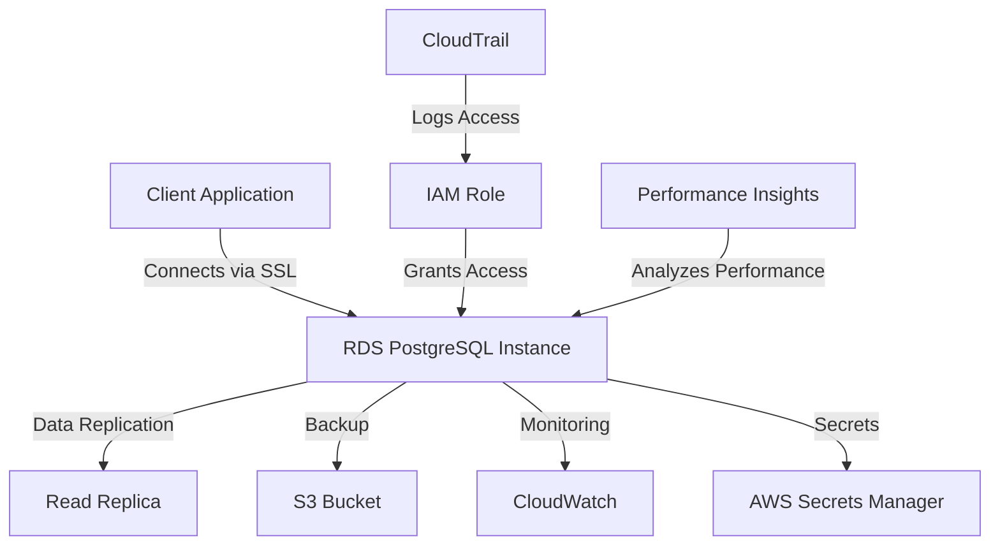

# AWS RDS PostgreSQL Setup Standards

## Overview and scope

The purpose of this document is to establish the standards and best practices for setting up and managing AWS RDS PostgreSQL instances within the Xentic infrastructure. This standard aims to ensure that all deployments are consistent, secure, and performant, aligning with Xentic's architectural principles.

### Audience
This document is intended for:
- Cloud Infrastructure Engineers
- Database Administrators
- DevOps Teams
- Software Development Teams

### Scope
This standard applies to all AWS RDS PostgreSQL instances deployed at Xentic, including but not limited to:
- Production environments
- Development environments
- Testing environments

### Non-goals
This document does NOT cover:
- Application-level database interactions
- Non-PostgreSQL database setups
- Detailed operational procedures for database migrations or backups

### Glossary
| Term                       | Definition                                                                 |
|----------------------------|-----------------------------------------------------------------------------|
| RDS                        | Amazon Relational Database Service, a managed database service provided by AWS. |
| Multi-AZ                   | A deployment option that provides high availability by automatically replicating data across multiple Availability Zones. |
| Secrets Manager            | An AWS service that helps you protect access to your applications, services, and IT resources without the upfront investment and on-going maintenance costs of operating your own infrastructure. |
| Performance Insights       | A feature that provides advanced monitoring and performance tuning for RDS instances. |

### How this standard fits the Xentic platform
The AWS RDS PostgreSQL Setup Standards are integral to the Xentic platform as they ensure that our data storage solutions are reliable, secure, and scalable. By adhering to these standards, teams can efficiently deploy PostgreSQL databases that meet the needs of various services while maintaining compliance with Xentic's security and operational policies.

### Terraform Configuration Example
The following Terraform configuration example illustrates the proper setup of an AWS RDS PostgreSQL instance:

```hcl
module "db" {
  source  = "terraform-aws-modules/rds/aws"
  version = "~> 6.0"

  identifier     = "${var.env}-${var.service}-db"
  engine         = "postgres"
  engine_version = "15.4"
  instance_class = var.env == "production" ? "db.t3.large" : "db.t3.micro"

  storage_encrypted = true
  kms_key_id        = aws_kms_key.rds.arn

  manage_master_user_password = true   # stores in Secrets Manager

  multi_az               = var.env == "production"
  backup_retention_period = 30
  deletion_protection    = true

  performance_insights_enabled = true
  monitoring_interval          = 60

  parameters = [
    { name = "log_min_duration_statement", value = "1000" },
    { name = "shared_preload_libraries",   value = "pg_stat_statements" },
  ]
}
```

### Rules
- **Encryption at rest (KMS)** and **in transit (SSL)** MUST always be enabled.
- **Secrets Manager** MUST be used for managing database credentials.
- **Performance Insights** MUST be enabled for production environments.
- **Multi-AZ** deployments are REQUIRED for production environments to ensure high availability.
- **Read replicas** MUST be created if read traffic exceeds **60%** of total load to balance the read operations.

By following these standards, Xentic ensures that its PostgreSQL databases are set up in a manner that promotes security, performance, and reliability across all environments.

## Standards and policies

1. **Database Naming Conventions**  
   Database names MUST follow the pattern: `com_xentic_<service>_<environment>`. For example, `com_xentic_auth_production`.

2. **Instance Class Selection**  
   The instance class MUST be selected based on the environment:
   - Production: `db.t3.large` or higher.
   - Development/Test: `db.t3.micro` or `db.t3.small`.

3. **Storage Configuration**  
   Storage MUST be set to at least **20 GiB** for production databases and **10 GiB** for development/test databases. Storage MUST be configured as **auto-scaling** when possible.

4. **Backup Configuration**  
   Backup retention period MUST be set to **30 days** for production environments. For development/test environments, a minimum of **7 days** is acceptable.

5. **Monitoring and Alerts**  
   Amazon CloudWatch monitoring MUST be enabled, with alarms set for:
   - CPU utilization exceeding **80%**.
   - Free storage space falling below **10%**.

6. **Security Groups**  
   Security groups MUST restrict access to the database to only necessary IP ranges and services. Public access MUST NOT be allowed.

7. **Database Parameter Groups**  
   Custom parameter groups MUST be created for each database to manage specific configurations. Default parameter groups MUST NOT be used.

8. **IAM Roles**  
   IAM roles MUST be used for applications accessing the database, rather than embedding credentials in code. 

9. **Database User Management**  
   The default PostgreSQL user MUST NOT be used for application access. A specific user with limited permissions MUST be created for each application.

10. **SSL Connections**  
    SSL connections MUST be enforced for all database connections to ensure data in transit is encrypted.

11. **Database Maintenance**  
    Maintenance windows MUST be scheduled during off-peak hours, and the default maintenance window MUST NOT be used.

12. **Data Encryption**  
    Data at rest MUST be encrypted using AWS KMS keys. The use of customer-managed keys is encouraged.

13. **Database Migration**  
    Database migrations MUST be performed using `pg_dump` and `pg_restore` or AWS Database Migration Service (DMS) to ensure data integrity.

14. **Read Replicas**  
    Read replicas MUST be utilized when read traffic exceeds **60%** of total load to balance read operations efficiently.

15. **Performance Insights**  
    Performance Insights MUST be enabled for all production databases to assist in monitoring and tuning.

16. **Secrets Management**  
    Database credentials MUST be stored in AWS Secrets Manager, and access to these secrets MUST be controlled via IAM roles.

17. **Automated Failover**  
    Automated failover MUST be configured for Multi-AZ deployments to ensure high availability.

18. **Compliance Auditing**  
    Regular audits MUST be conducted to ensure compliance with Xentic’s security and operational policies.

19. **Documentation**  
    All database configurations and changes MUST be documented in the internal wiki at `https://docs.internal.xentic.io`.

20. **Version Control**  
    Database schema changes MUST be version controlled using tools like Flyway or Liquibase to ensure consistency across environments.

By adhering to these standards and policies, Xentic will maintain a robust, secure, and efficient PostgreSQL database infrastructure that meets the needs of its services while ensuring compliance with organizational guidelines.

## Architecture and design

The architecture for AWS RDS PostgreSQL at Xentic is designed to ensure high availability, security, and scalability. The following component diagram illustrates the major components and their interactions:



### Data Flows

1. **Client Application to RDS**: 
   - Applications connect to the RDS PostgreSQL instance using SSL to ensure data is encrypted in transit.
   - Connections are authenticated using credentials stored in AWS Secrets Manager.

2. **Data Replication**:
   - For read-heavy applications, data is replicated to read replicas to balance load and improve performance.
   - Replication is asynchronous to minimize latency.

3. **Backup and Restore**:
   - Automated backups are stored in S3, ensuring durability and availability.
   - Backups can be restored to a new RDS instance if needed.

4. **Monitoring and Alerts**:
   - Amazon CloudWatch monitors key metrics such as CPU utilization and storage space.
   - Alerts are configured to notify administrators when thresholds are breached.

5. **Secrets Management**:
   - Database credentials are stored in AWS Secrets Manager, which provides secure access to applications via IAM roles.

6. **Performance Insights**:
   - Performance data is collected and analyzed to identify bottlenecks and optimize database performance.

### Integration Points

- **AWS Secrets Manager**: All database credentials MUST be managed through Secrets Manager to ensure security and compliance.
- **CloudWatch**: Monitoring and alerting for database performance and health MUST be integrated with CloudWatch.
- **IAM Roles**: Applications MUST use IAM roles for database access instead of hardcoded credentials to enhance security.
- **S3**: Backup data MUST be stored in S3 for durability and easy access during restoration processes.

### Failure Domains

- **Single Point of Failure**: RDS instances in a single Availability Zone (AZ) represent a failure domain. Multi-AZ deployments MUST be used to mitigate this risk.
- **Network Issues**: Network partitions can affect connectivity. Applications MUST implement retry logic for transient failures.
- **Secrets Manager Access**: If access to Secrets Manager is disrupted, applications will fail to authenticate. IAM policies MUST be regularly reviewed to ensure access is maintained.
- **Read Replica Lag**: Read replicas may experience lag during high write operations. Applications MUST be designed to handle potential stale reads.

By adhering to this architecture and design framework, Xentic ensures that its AWS RDS PostgreSQL deployments are robust, secure, and capable of handling varying loads while maintaining high availability and performance.

## Configuration reference

### application.yml Configuration

The following is an example of how to configure your Spring Boot application to connect to an AWS RDS PostgreSQL instance. This configuration should be placed in the `application.yml` file.

```yaml
spring:
  datasource:
    url: jdbc:postgresql://<db-endpoint>:5432/com_xentic_<service>_<environment>
    username: ${DB_USERNAME}
    password: ${DB_PASSWORD}
    driver-class-name: org.postgresql.Driver
  jpa:
    hibernate:
      ddl-auto: update
    show-sql: true
    properties:
      hibernate:
        dialect: org.hibernate.dialect.PostgreSQLDialect
```

### Terraform Configuration

The following table outlines the required environment variables and their default values for Terraform configuration:

| Variable            | Default Value            | Production Value          |
|---------------------|-------------------------|---------------------------|
| `env`               | `development`           | `production`              |
| `service`           | `example-service`       | `<your-service-name>`     |
| `db_username`       | `dev_user`              | `prod_user`               |
| `db_password`       | `dev_password`          | `prod_password`           |
| `db_instance_class` | `db.t3.micro`           | `db.t3.large`             |
| `backup_retention`  | `7`                     | `30`                      |
| `multi_az`          | `false`                 | `true`                    |

### Environment Variables

The following environment variables MUST be defined for the application to connect to the database:

| Environment Variable | Description                          | Default Value            |
|----------------------|--------------------------------------|-------------------------|
| `DB_USERNAME`        | Database username                     | `dev_user`              |
| `DB_PASSWORD`        | Database password                     | `dev_password`          |
| `DB_URL`             | JDBC connection URL                   | `jdbc:postgresql://<db-endpoint>:5432/com_xentic_<service>_<environment>` |

### SQL Example for Database Initialization

To initialize your database, you may run the following SQL commands:

```sql
CREATE TABLE users (
    id SERIAL PRIMARY KEY,
    username VARCHAR(50) UNIQUE NOT NULL,
    password VARCHAR(255) NOT NULL,
    created_at TIMESTAMP DEFAULT CURRENT_TIMESTAMP
);

CREATE INDEX idx_username ON users (username);
```

### Code Example for Database Connection

In your Java application, you can use the following code to establish a connection to the PostgreSQL database:

```java
import org.springframework.beans.factory.annotation.Value;
import org.springframework.jdbc.core.JdbcTemplate;
import org.springframework.stereotype.Repository;

import javax.sql.DataSource;

@Repository
public class UserRepository {

    private final JdbcTemplate jdbcTemplate;

    public UserRepository(DataSource dataSource) {
        this.jdbcTemplate = new JdbcTemplate(dataSource);
    }

    public void createUser(String username, String password) {
        String sql = "INSERT INTO users (username, password) VALUES (?, ?)";
        jdbcTemplate.update(sql, username, password);
    }
}
```

By following the configuration references provided above, Xentic ensures that applications are correctly set up to connect to AWS RDS PostgreSQL instances, promoting security and maintainability across all environments.

## Implementation guide

To implement AWS RDS PostgreSQL at Xentic, follow these step-by-step instructions, ensuring adherence to the established standards.

### Step 1: Create an RDS PostgreSQL Instance

Use the AWS Management Console or Terraform to create a new RDS PostgreSQL instance. Below is an example of a Terraform configuration for creating the instance:

```hcl
resource "aws_db_instance" "postgres" {
  identifier              = "com-xentic-${var.service}-${var.env}-db"
  engine                 = "postgres"
  engine_version         = "14.5"
  instance_class         = var.db_instance_class
  allocated_storage       = 20
  storage_type           = "gp2"
  username               = var.db_username
  password               = var.db_password
  db_name                = "com_xentic_${var.service}_${var.env}"
  multi_az               = var.multi_az
  backup_retention_period = var.backup_retention
  vpc_security_group_ids  = [aws_security_group.rds_sg.id]
  final_snapshot_identifier = "com-xentic-${var.service}-${var.env}-final-snapshot"
  skip_final_snapshot    = false
}
```

### Step 2: Configure Security Groups

Ensure that the RDS instance is accessible only from trusted sources. Create a security group with the following rules:

```hcl
resource "aws_security_group" "rds_sg" {
  name        = "com-xentic-${var.service}-${var.env}-rds-sg"
  description = "Security group for RDS PostgreSQL instance"

  ingress {
    from_port   = 5432
    to_port     = 5432
    protocol    = "tcp"
    cidr_blocks = ["<trusted-ip>/32"]  # Change to your trusted IP range
  }

  egress {
    from_port   = 0
    to_port     = 0
    protocol    = "-1"
    cidr_blocks = ["0.0.0.0/0"]
  }
}
```

### Step 3: Enable Enhanced Monitoring

Enable Enhanced Monitoring on your RDS instance for better insights into performance. This can be done via the AWS Management Console or Terraform:

```hcl
resource "aws_db_instance" "postgres" {
  ...
  monitoring_interval = 60  # in seconds
  monitoring_role_arn = aws_iam_role.rds_monitoring_role.arn
}
```

### Step 4: Configure IAM Role for Secrets Manager

Create an IAM role that allows your application to access the database credentials stored in AWS Secrets Manager:

```hcl
resource "aws_iam_role" "rds_monitoring_role" {
  name = "com-xentic-${var.service}-${var.env}-rds-monitoring-role"

  assume_role_policy = jsonencode({
    Version = "2012-10-17"
    Statement = [{
      Action    = "sts:AssumeRole"
      Principal = {
        Service = "rds.amazonaws.com"
      }
      Effect    = "Allow"
      Sid       = ""
    }]
  })
}

resource "aws_iam_policy" "secrets_manager_access" {
  name        = "com-xentic-${var.service}-${var.env}-secrets-manager-access"
  description = "Allows access to RDS database credentials in Secrets Manager"

  policy = jsonencode({
    Version = "2012-10-17"
    Statement = [{
      Action   = "secretsmanager:GetSecretValue"
      Resource = "*"
      Effect   = "Allow"
    }]
  })
}

resource "aws_iam_role_policy_attachment" "attach_policy" {
  policy_arn = aws_iam_policy.secrets_manager_access.arn
  role       = aws_iam_role.rds_monitoring_role.name
}
```

### Step 5: Store Database Credentials in Secrets Manager

Store your database credentials securely in AWS Secrets Manager. Use the following example to create a secret:

```hcl
resource "aws_secretsmanager_secret" "db_credentials" {
  name = "com-xentic-${var.service}-${var.env}-db-credentials"

  secret_string = jsonencode({
    username = var.db_username
    password = var.db_password
  })
}
```

### Step 6: Connect to the Database from Your Application

Use the following Spring Boot configuration to connect to the RDS PostgreSQL instance:

```yaml
spring:
  datasource:
    url: jdbc:postgresql://<db-endpoint>:5432/com_xentic_<service>_<environment>
    username: ${DB_USERNAME}
    password: ${DB_PASSWORD}
    driver-class-name: org.postgresql.Driver
  jpa:
    hibernate:
      ddl-auto: update
    show-sql: true
    properties:
      hibernate:
        dialect: org.hibernate.dialect.PostgreSQLDialect
```

### Step 7: Implement a Repository for Database Operations

Create a repository class to handle database operations:

```java
import org.springframework.beans.factory.annotation.Value;
import org.springframework.jdbc.core.JdbcTemplate;
import org.springframework.stereotype.Repository;

import javax.sql.DataSource;

@Repository
public class UserRepository {

    private final JdbcTemplate jdbcTemplate;

    public UserRepository(DataSource dataSource) {
        this.jdbcTemplate = new JdbcTemplate(dataSource);
    }

    public void createUser(String username, String password) {
        String sql = "INSERT INTO users (username, password) VALUES (?, ?)";
        jdbcTemplate.update(sql, username, password);
    }

    public User findUserByUsername(String username) {
        String sql = "SELECT * FROM users WHERE username = ?";
        return jdbcTemplate.queryForObject(sql, new Object[]{username}, new UserRowMapper());
    }
}
```

### Step 8: Create a User Row Mapper

Implement a row mapper to convert database rows into User objects:

```java
import org.springframework.jdbc.core.RowMapper;

import java.sql.ResultSet;
import java.sql.SQLException;

public class UserRowMapper implements RowMapper<User> {
    @Override
    public User mapRow(ResultSet rs, int rowNum) throws SQLException {
        User user = new User();
        user.setId(rs.getLong("id"));
        user.setUsername(rs.getString("username"));
        user.setPassword(rs.getString("password"));
        user.setCreatedAt(rs.getTimestamp("created_at"));
        return user;
    }
}
```

### Conclusion

By following these implementation steps, Xentic can successfully deploy and configure an AWS RDS PostgreSQL instance, ensuring that all security and operational standards are met.

## Security requirements

To ensure the security of AWS RDS PostgreSQL instances at Xentic, the following security requirements MUST be adhered to:

### Threat Model Summary

The primary threats to consider include:

- **Unauthorized Access**: Attackers gaining access to the database.
- **Data Breaches**: Sensitive data being exposed or stolen.
- **Denial of Service**: Disruption of database availability.
- **Data Integrity Attacks**: Malicious alteration of data.

### Authentication and Authorization

- **IAM Roles**: Use IAM roles to manage access to AWS resources securely. Database access should be granted based on the principle of least privilege.
- **Database User Management**: Database users MUST be created with specific roles and permissions. Avoid using superuser accounts for application access.

Example of creating a user with limited permissions:

```sql
CREATE USER app_user WITH PASSWORD 'secure_password';
GRANT CONNECT ON DATABASE com_xentic_<service>_<environment> TO app_user;
```

### Secrets Management

- **AWS Secrets Manager**: Database credentials MUST be stored in AWS Secrets Manager. This prevents hardcoding secrets in application code and allows for automatic rotation of credentials.
- **Environment Variables**: Environment variables MUST NOT contain sensitive information. Use Secrets Manager to retrieve credentials at runtime.

Example of storing a secret in AWS Secrets Manager:

```hcl
resource "aws_secretsmanager_secret" "db_credentials" {
  name = "com-xentic-${var.service}-${var.env}-db-credentials"

  secret_string = jsonencode({
    username = var.db_username
    password = var.db_password
  })
}
```

### Input Validation

- **Parameter Binding**: All SQL queries MUST use parameter binding to prevent SQL injection attacks. Do NOT concatenate user input directly into SQL queries.
  
Example of safe query execution:

```java
public void createUser(String username, String password) {
    String sql = "INSERT INTO users (username, password) VALUES (?, ?)";
    jdbcTemplate.update(sql, username, password);
}
```

- **Input Sanitization**: Validate and sanitize all user inputs before processing. Use libraries such as Apache Commons Validator or Spring's validation framework.

### Audit Logging

- **Enable Database Logging**: RDS PostgreSQL logging MUST be enabled to capture all SQL queries and errors. This is crucial for auditing and troubleshooting.
  
Example of enabling logging in PostgreSQL:

```sql
ALTER SYSTEM SET log_statement = 'all';
ALTER SYSTEM SET log_directory = 'pg_log';
ALTER SYSTEM SET log_filename = 'postgresql-%Y-%m-%d_%H%M%S.log';
```

- **Access Logs**: Implement logging for all access attempts, successful or failed, to monitor unauthorized access attempts.

### Summary Table of Security Measures

| Security Measure               | Description                                                  | Status     |
|--------------------------------|--------------------------------------------------------------|------------|
| IAM Roles                      | Use IAM roles for secure access management                   | MUST       |
| Secrets Management             | Store credentials in AWS Secrets Manager                     | MUST       |
| Input Validation               | Use parameter binding and input sanitization                 | MUST       |
| Database Logging               | Enable logging for auditing and troubleshooting               | MUST       |
| Least Privilege                | Grant minimal permissions to database users                   | MUST       |

By adhering to these security requirements, Xentic can significantly reduce the risk of security incidents and ensure that AWS RDS PostgreSQL instances are secure and compliant with industry standards.

## Testing strategy

To ensure the reliability and quality of the application that interacts with AWS RDS PostgreSQL, Xentic MUST implement a comprehensive testing strategy that includes unit tests, integration tests, and contract tests. The following guidelines outline the requirements for each testing type, coverage targets, and example test classes.

### Unit Tests

- **Purpose**: Unit tests are designed to validate the functionality of individual components in isolation.
- **Coverage Target**: A minimum of 80% coverage across all service classes MUST be achieved.
- **Framework**: JUnit 5 and Mockito MUST be used for writing unit tests.

**Example Unit Test Class:**

```java
import org.junit.jupiter.api.Test;
import org.mockito.InjectMocks;
import org.mockito.Mock;
import org.mockito.MockitoAnnotations;

import static org.mockito.Mockito.*;

class UserRepositoryTest {

    @Mock
    private JdbcTemplate jdbcTemplate;

    @InjectMocks
    private UserRepository userRepository;

    public UserRepositoryTest() {
        MockitoAnnotations.openMocks(this);
    }

    @Test
    void testCreateUser() {
        userRepository.createUser("testUser", "testPassword");
        String sql = "INSERT INTO users (username, password) VALUES (?, ?)";
        verify(jdbcTemplate, times(1)).update(sql, "testUser", "testPassword");
    }

    @Test
    void testFindUserByUsername() {
        when(jdbcTemplate.queryForObject(anyString(), any(Object[].class), any(UserRowMapper.class)))
                .thenReturn(new User("testUser", "testPassword"));
        
        User user = userRepository.findUserByUsername("testUser");
        assertNotNull(user);
        assertEquals("testUser", user.getUsername());
    }
}
```

### Integration Tests

- **Purpose**: Integration tests validate the interaction between components and external systems such as the database.
- **Coverage Target**: A minimum of 70% coverage across integration tests MUST be achieved.
- **Framework**: Spring Boot Test and Testcontainers MUST be used for integration tests.

**Example Integration Test Class:**

```java
import org.junit.jupiter.api.Test;
import org.springframework.beans.factory.annotation.Autowired;
import org.springframework.boot.test.autoconfigure.jdbc.AutoConfigureTestDatabase;
import org.springframework.boot.test.context.SpringBootTest;
import org.springframework.test.context.ActiveProfiles;

import static org.assertj.core.api.Assertions.assertThat;

@SpringBootTest
@ActiveProfiles("test")
@AutoConfigureTestDatabase(replace = AutoConfigureTestDatabase.Replace.NONE)
class UserRepositoryIntegrationTest {

    @Autowired
    private UserRepository userRepository;

    @Test
    void testCreateAndFindUser() {
        userRepository.createUser("integrationUser", "securePassword");
        User user = userRepository.findUserByUsername("integrationUser");
        assertThat(user).isNotNull();
        assertThat(user.getUsername()).isEqualTo("integrationUser");
    }
}
```

### Contract Tests

- **Purpose**: Contract tests ensure that the service's API adheres to the expected contract, verifying that the API remains consistent over time.
- **Framework**: Spring Cloud Contract MUST be used for contract testing.

**Example Contract Test Class:**

```groovy
import org.springframework.cloud.contract.spec.Contract

Contract.make {
    description "should return user by username"
    request {
        method GET()
        url("/users/testUser")
    }
    response {
        status 200
        body("""
            {
                "username": "testUser",
                "password": "testPassword"
            }
        """)
        headers {
            contentType(applicationJson())
        }
    }
}
```

### Coverage Targets Summary

| Test Type       | Coverage Target |
|------------------|-----------------|
| Unit Tests       | 80%             |
| Integration Tests| 70%             |
| Contract Tests   | 100%            |

### Additional Testing Guidelines

- **Test Data Management**: Use Testcontainers or an in-memory database for integration tests to ensure a clean state for each test run.
- **Continuous Integration**: All tests MUST be executed in the CI/CD pipeline to ensure that code changes do not introduce regressions.
- **Code Reviews**: All test code MUST be reviewed as part of the code review process to ensure adherence to testing standards.

By implementing this testing strategy, Xentic can maintain high code quality, reduce the risk of defects, and ensure that the application interacts correctly with the AWS RDS PostgreSQL database.

## Observability and operations

To ensure the reliability and performance of AWS RDS PostgreSQL instances, Xentic MUST implement robust observability and operational practices. This includes metrics collection, logging, tracing, dashboarding, alerting, and defining Service Level Objectives (SLOs). The following guidelines outline the necessary components for effective observability and operations.

### Metrics

- **Database Metrics**: Collect key performance metrics from PostgreSQL to monitor the health of the database. Metrics MUST include:
  - CPU utilization
  - Memory usage
  - Disk I/O
  - Connection counts
  - Query performance (latency, throughput)

**Example of Prometheus configuration for PostgreSQL metrics:**

```yaml
scrape_configs:
  - job_name: 'postgres'
    static_configs:
      - targets: ['<RDS_ENDPOINT>:9187']
```

### Logs

- **Log Collection**: Enable and configure PostgreSQL logging to capture query execution details and errors. Logs MUST be sent to a centralized logging solution such as Amazon CloudWatch Logs or ELK Stack.
- **Log Format**: Use a standardized log format that includes timestamps, log levels, and contextual information.

**Example of configuring PostgreSQL logging:**

```sql
ALTER SYSTEM SET log_statement = 'all';
ALTER SYSTEM SET log_directory = 'pg_log';
ALTER SYSTEM SET log_filename = 'postgresql-%Y-%m-%d_%H%M%S.log';
```

### Traces

- **Distributed Tracing**: Implement distributed tracing using tools like AWS X-Ray or OpenTelemetry to track requests across microservices and identify performance bottlenecks.
- **Trace Context Propagation**: Ensure that trace context is propagated through HTTP headers for all outgoing requests.

**Example of adding trace context in a Spring Boot application:**

```java
import org.springframework.web.client.RestTemplate;
import org.springframework.http.HttpHeaders;

public class TraceService {
    private final RestTemplate restTemplate;

    public TraceService(RestTemplate restTemplate) {
        this.restTemplate = restTemplate;
    }

    public void callExternalService(String url) {
        HttpHeaders headers = new HttpHeaders();
        headers.set("X-Amzn-Trace-Id", "Root=" + traceId);
        restTemplate.getForObject(url, String.class, headers);
    }
}
```

### Dashboards

- **Monitoring Dashboards**: Create dashboards in Grafana or AWS CloudWatch to visualize key metrics and logs. Dashboards MUST provide insights into database performance, query execution times, and error rates.
- **Dashboard Components**: Include the following components:
  - CPU and memory usage graphs
  - Query performance heatmaps
  - Error rate trends

### Alerts

- **Alerting Rules**: Define alerting rules based on critical metrics. Alerts MUST notify the on-call team via tools like Amazon SNS, PagerDuty, or Slack.
- **Common Alerts**:
  - High CPU utilization (> 80%)
  - High memory usage (> 75%)
  - Slow query execution time (e.g., > 500ms)
  - Connection count exceeding threshold

**Example of an alerting rule in Prometheus:**

```yaml
groups:
  - name: postgres-alerts
    rules:
      - alert: HighCpuUsage
        expr: avg(rate(node_cpu_seconds_total{mode="idle"}[5m])) < 0.2
        for: 5m
        labels:
          severity: critical
        annotations:
          summary: "High CPU usage detected"
          description: "CPU usage is above 80% for more than 5 minutes."
```

### Service Level Objectives (SLOs)

- **Defining SLOs**: Establish SLOs for database performance and availability. SLOs MUST be measurable and aligned with business objectives.
- **Common SLOs**:
  - **Availability**: 99.9% uptime for the database.
  - **Performance**: 95% of queries should execute within 200ms.

### On-Call Runbook Steps

In the event of an incident, the on-call engineer MUST follow these steps:

1. **Acknowledge the Alert**: Confirm receipt of the alert and begin investigation.
2. **Check Metrics**: Review relevant metrics in the monitoring dashboard to identify anomalies.
3. **Inspect Logs**: Analyze PostgreSQL logs for any errors or unusual query patterns.
4. **Assess Impact**: Determine the scope of the issue and its impact on users.
5. **Mitigate**: If necessary, apply temporary fixes (e.g., scaling the database, optimizing queries).
6. **Notify Stakeholders**: Communicate the issue and ongoing efforts to relevant stakeholders.
7. **Document the Incident**: After resolution, document the incident details and steps taken for future reference.

By adhering to these observability and operational guidelines, Xentic can ensure that AWS RDS PostgreSQL instances are monitored effectively, allowing for quick identification and resolution of issues, ultimately maintaining high service reliability.

## Migration and versioning

To maintain the integrity and performance of AWS RDS PostgreSQL databases, Xentic MUST establish clear migration and versioning standards. This section outlines the upgrade paths, deprecation policies, backward compatibility requirements, and rollback procedures necessary for managing database schema and data migrations.

### Upgrade Paths

- **Versioning Strategy**: Database versions MUST be managed using a semantic versioning scheme (MAJOR.MINOR.PATCH).
- **Upgrade Process**:
  - Migrations MUST be applied in a controlled manner using versioned migration scripts.
  - Each migration script MUST be idempotent, meaning it can be run multiple times without adverse effects.
  - Upgrade paths MUST be documented, specifying which versions are compatible with each other.

**Example of a migration script:**

```sql
-- 2023_10_01_001_create_users_table.sql
CREATE TABLE users (
    id SERIAL PRIMARY KEY,
    username VARCHAR(50) NOT NULL UNIQUE,
    password VARCHAR(255) NOT NULL,
    created_at TIMESTAMP DEFAULT CURRENT_TIMESTAMP
);
```

### Deprecation Policy

- **Deprecation Notices**: Features or database objects that are to be deprecated MUST be announced at least one release cycle in advance.
- **Grace Period**: A grace period of at least two release cycles MUST be provided before removing deprecated features.
- **Documentation**: All deprecated features MUST be clearly documented, including alternatives and timelines for removal.

**Example of a deprecation notice:**

```markdown
### Deprecation Notice: Users Table Password Field

The `password` field in the `users` table is deprecated as of version 2.0.0. 
Use the `hashed_password` field instead. This field will be removed in version 2.2.0.
```

### Backward Compatibility

- **Compatibility Requirements**: New migrations MUST maintain backward compatibility with the previous version of the database schema.
- **Testing**: Each migration MUST be tested against both the current and previous versions of the schema to ensure compatibility.
- **Feature Flags**: New features MUST be implemented behind feature flags to allow gradual rollouts without breaking existing functionality.

### Rollback Procedures

- **Rollback Strategy**: A rollback strategy MUST be defined for each migration. This includes providing a corresponding down migration script.
- **Testing Rollbacks**: Rollback scripts MUST be tested to ensure they restore the database to its previous state without data loss.
- **Documentation**: All rollback procedures MUST be documented and included in the migration plan.

**Example of a rollback script:**

```sql
-- 2023_10_01_001_create_users_table.sql
DROP TABLE IF EXISTS users;
```

### Migration Management Tools

- **Tooling**: Xentic MUST use a migration management tool such as Flyway or Liquibase for handling database migrations.
- **Configuration**: The migration tool MUST be configured to run migrations automatically during application startup.

**Example Flyway configuration (application.yml):**

```yaml
spring:
  flyway:
    enabled: true
    locations: classpath:db/migration
    baseline-on-migrate: true
```

### Migration Tracking

- **Tracking Table**: A tracking table MUST be used to record applied migrations. This table should include columns for the migration version, description, and timestamp.
  
**Example of a tracking table schema:**

```sql
CREATE TABLE flyway_schema_history (
    version VARCHAR(50) NOT NULL,
    description VARCHAR(200) NOT NULL,
    installed_on TIMESTAMP NOT NULL DEFAULT CURRENT_TIMESTAMP,
    type VARCHAR(20) NOT NULL,
    state VARCHAR(20) NOT NULL
);
```

### Summary

By adhering to these migration and versioning standards, Xentic can ensure that database changes are managed systematically, minimizing risks associated with upgrades and maintaining the integrity of the database throughout its lifecycle.

## FAQ, anti-patterns, and checklists

### FAQ

1. **What is the maximum size for an AWS RDS PostgreSQL instance?**
   - The maximum storage size for an RDS PostgreSQL instance is 64 TiB.

2. **How can I enable automatic backups for my RDS instance?**
   - Automatic backups can be enabled during instance creation or modified afterward. Set the `BackupRetentionPeriod` parameter to a value greater than 0.

3. **What is the recommended instance class for production workloads?**
   - For production workloads, it is recommended to use instance classes such as `db.m5.large` or higher, depending on the application's resource requirements.

4. **How do I configure read replicas in RDS?**
   - Read replicas can be created from the AWS Management Console or using the AWS CLI. Ensure that the source DB instance has binary logging enabled.

5. **What are the best practices for securing my RDS PostgreSQL instance?**
   - Use VPC security groups, enable encryption at rest and in transit, and utilize IAM roles for database access.

6. **Can I use custom PostgreSQL extensions in RDS?**
   - AWS RDS supports a limited set of PostgreSQL extensions. Check the AWS documentation for a list of supported extensions.

7. **How often should I perform maintenance on my RDS instance?**
   - Regular maintenance should be scheduled based on the application needs, but at a minimum, review performance metrics and logs weekly.

8. **What should I do if my RDS instance is experiencing high latency?**
   - Investigate slow queries, check instance metrics for CPU and memory usage, and consider scaling the instance or optimizing the database.

9. **How do I monitor the performance of my RDS instance?**
   - Use Amazon CloudWatch for monitoring metrics such as CPU utilization, memory usage, and disk I/O. Set up alerts for critical thresholds.

10. **What is the procedure for migrating data to RDS PostgreSQL?**
    - Use AWS Database Migration Service (DMS) for seamless data migration, or export data from the source database and import it using `pg_dump` and `pg_restore`.

### Anti-Patterns

| Anti-Pattern                     | Description                                                                                     |
|----------------------------------|-------------------------------------------------------------------------------------------------|
| Hardcoding Connection Strings     | Connection strings MUST NOT be hardcoded in application code. Use environment variables instead. |
| Ignoring Backups                 | Failing to configure backups can lead to data loss. Always enable automatic backups.           |
| Overusing Single DB Instances     | Using a single instance for multiple services can lead to contention. Use separate instances.  |
| Not Monitoring Performance        | Ignoring performance metrics can result in outages. Always monitor and set alerts.            |
| Disabling SSL                    | Disabling SSL for database connections can expose data. Always enforce SSL connections.        |
| Not Using Parameter Groups        | Failing to configure parameter groups can lead to suboptimal performance. Customize as needed. |

### Pre-Merge Checklist

- [ ] Ensure all database migrations are included in the pull request.
- [ ] Verify migration scripts are idempotent and tested.
- [ ] Check for any deprecated features and update documentation.
- [ ] Run integration tests to validate database interactions.
- [ ] Ensure all new features are behind feature flags.

### Production Checklist

- [ ] Confirm that the RDS instance is in a VPC with proper security group settings.
- [ ] Verify that backups are enabled and retention policies are set.
- [ ] Ensure monitoring and alerting are configured in CloudWatch.
- [ ] Check that all database connections use SSL.
- [ ] Review performance metrics and logs for any anomalies before deployment.
