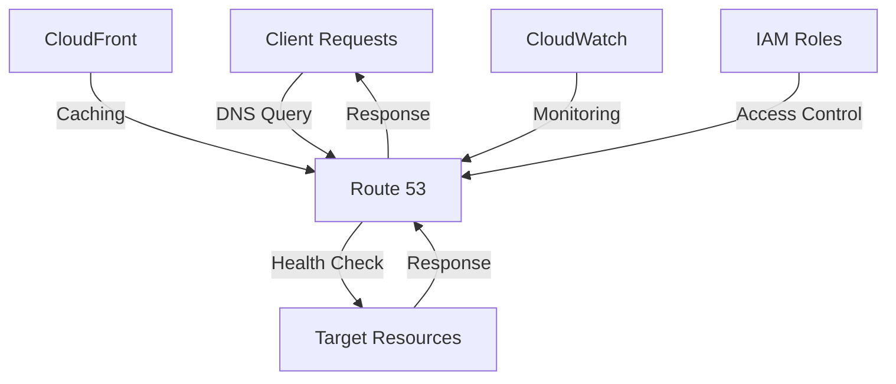

# Route 53 DNS Standards — AWS

## Overview and scope

The purpose of this document is to outline the standards and best practices for using Amazon Route 53 as the DNS service within Xentic's AWS infrastructure. This standard aims to ensure consistency, reliability, and security across all DNS configurations and deployments.

### Audience

This document is intended for:

- **Infrastructure Engineers**: Responsible for deploying and managing DNS configurations.
- **DevOps Teams**: Involved in CI/CD pipelines that require DNS management.
- **Application Developers**: Who need to understand DNS configurations for their services.
- **Security Teams**: Ensuring compliance with security standards and practices.

### Scope

This standard covers:

- DNS zone creation and management.
- Record types and their appropriate use cases.
- Health checks and routing policies.
- Security configurations, including IAM roles and permissions.
- Integration with other AWS services.

### Non-goals

This document does NOT cover:

- General AWS account management.
- Non-DNS related AWS services.
- Third-party DNS services or configurations.

### Glossary

| Term              | Definition                                                                 |
|-------------------|-----------------------------------------------------------------------------|
| DNS               | Domain Name System, a hierarchical system for naming resources on the internet. |
| Route 53          | AWS's scalable Domain Name System (DNS) web service.                      |
| Zone              | A distinct part of the DNS namespace that is managed by a specific DNS server. |
| Record            | A database entry in the DNS that maps a domain name to an IP address or other data. |
| Health Check      | A method to monitor the health of resources and ensure traffic is routed only to healthy endpoints. |
| Routing Policy    | A set of rules that determines how Route 53 responds to DNS queries.     |

### How this standard fits the Xentic platform

The Route 53 DNS Standards are integral to Xentic's cloud architecture, ensuring that all services are accessible, resilient, and secure. By adhering to these standards, teams can achieve:

- **Consistency**: Uniform DNS configurations across all services.
- **Reliability**: High availability through proper health checks and routing policies.
- **Security**: Controlled access to DNS configurations, minimizing the risk of misconfigurations and security breaches.

### Example Configuration

Below is an example of a YAML configuration for a Route 53 hosted zone:

```yaml
HostedZone:
  Name: example.xentic.io
  CallerReference: "unique-string-identifier"
  HostedZoneConfig:
    Comment: "Hosted zone for Xentic services"
    PrivateZone: false
```

### Example SQL for Health Checks

To create a health check in Route 53, you can use the following SQL-like pseudocode:

```sql
CREATE HEALTH_CHECK myHealthCheck
  WITH TYPE = "HTTP"
  AND RESOURCE_PATH = "/health"
  AND REQUEST_INTERVAL = 30
  AND FAILURE_THRESHOLD = 3;
```

### Example Code Snippet

Here’s a Java code snippet using AWS SDK to create a new DNS record:

```java
import software.amazon.awssdk.services.route53.Route53Client;
import software.amazon.awssdk.services.route53.model.Change;
import software.amazon.awssdk.services.route53.model.ChangeBatch;
import software.amazon.awssdk.services.route53.model.ChangeResourceRecordSetsRequest;
import software.amazon.awssdk.services.route53.model.ResourceRecordSet;
import software.amazon.awssdk.services.route53.model.RRType;

public void createDNSRecord(String hostedZoneId, String domainName, String ipAddress) {
    Route53Client route53 = Route53Client.create();
    
    ResourceRecordSet recordSet = ResourceRecordSet.builder()
        .name(domainName)
        .type(RRType.A)
        .ttl(300L)
        .resourceRecords(RecordSet.builder().value(ipAddress).build())
        .build();
    
    Change change = Change.builder()
        .action("CREATE")
        .resourceRecordSet(recordSet)
        .build();
    
    ChangeBatch changeBatch = ChangeBatch.builder()
        .changes(change)
        .build();
    
    ChangeResourceRecordSetsRequest request = ChangeResourceRecordSetsRequest.builder()
        .hostedZoneId(hostedZoneId)
        .changeBatch(changeBatch)
        .build();
    
    route53.changeResourceRecordSets(request);
}
```

By following these standards, Xentic can maintain a robust DNS infrastructure that supports its diverse range of services while ensuring high availability and security.

## Standards and policies

1. **MUST** use the domain naming convention `*.xentic.io` for all hosted zones. This ensures consistency and clarity in identifying Xentic's resources.

2. **MUST NOT** create any hosted zones outside of the `xentic.io` domain. All DNS management must be centralized within this domain to maintain control and security.

3. **MUST** use Route 53's health checks for all critical services. Health checks should be configured to monitor the health of resources and ensure traffic is routed only to healthy endpoints.

   Example YAML configuration for a health check:
   ```yaml
   HealthCheck:
     CallerReference: "unique-string-identifier"
     HealthCheckConfig:
       Type: "HTTP"
       ResourcePath: "/health"
       FullyQualifiedDomainName: "service.example.xentic.io"
       RequestInterval: 30
       FailureThreshold: 3
   ```

4. **SHOULD** implement routing policies based on the service requirements. The following routing policies are recommended:

   | Policy Type       | Use Case                                       |
   |-------------------|------------------------------------------------|
   | Simple Routing    | For straightforward use cases with a single resource. |
   | Weighted Routing   | To distribute traffic across multiple resources. |
   | Latency Routing    | To route traffic to the lowest latency resource. |
   | Failover Routing   | To route traffic to a backup resource in case of failure. |

5. **MUST** ensure that all DNS records are tagged appropriately with metadata for better management and reporting. Tags should include the service name, environment (e.g., production, staging), and owner.

   Example of tagging in YAML:
   ```yaml
   Tags:
     - Key: "Service"
       Value: "auth-service"
     - Key: "Environment"
       Value: "production"
     - Key: "Owner"
       Value: "team-auth"
   ```

6. **MUST NOT** expose sensitive information in DNS records. Avoid including internal IP addresses or sensitive data in publicly accessible DNS records.

7. **MUST** use IAM roles with the principle of least privilege for managing Route 53 resources. Roles should be specifically scoped to only allow necessary actions on Route 53.

   Example IAM policy:
   ```json
   {
     "Version": "2012-10-17",
     "Statement": [
       {
         "Effect": "Allow",
         "Action": [
           "route53:ChangeResourceRecordSets",
           "route53:GetChange",
           "route53:ListResourceRecordSets"
         ],
         "Resource": "arn:aws:route53:::hostedzone/your-hosted-zone-id"
       }
     ]
   }
   ```

8. **SHOULD** regularly review and audit DNS configurations for compliance with Xentic's security policies. This includes checking for outdated records, unused hosted zones, and ensuring that health checks are functioning as expected.

9. **MUST** document all changes made to DNS configurations in a central repository. This documentation should include the reason for the change, the person responsible, and the date of the change.

10. **SHOULD** implement monitoring and alerting for DNS changes. Use AWS CloudTrail to track changes and set up alerts for any unauthorized modifications.

11. **MUST NOT** mix public and private DNS records within the same hosted zone. Separate hosted zones must be created for public and private records to maintain clarity and security.

12. **MUST** ensure that all DNS queries are logged for auditing purposes. Enable query logging in Route 53 to capture and analyze DNS queries.

By adhering to these standards and policies, Xentic will maintain a secure, efficient, and manageable DNS infrastructure that supports its operational needs.

## Architecture and design

The architecture of the Route 53 DNS implementation at Xentic is designed to ensure high availability, reliability, and scalability. Below is a component diagram that illustrates the key components and their interactions.



### Data Flows

1. **Client Requests**: Clients initiate DNS queries to resolve domain names.
2. **Route 53**: Receives DNS queries and routes them based on configured policies.
3. **Health Checks**: Route 53 performs health checks on target resources to ensure they are operational before routing traffic.
4. **Target Resources**: These are the actual services or endpoints that the DNS records point to (e.g., EC2 instances, load balancers).
5. **CloudFront**: Can be used to cache responses from Route 53, improving performance and reducing latency.
6. **CloudWatch**: Monitors DNS queries and health check statuses, providing alerts and logs for operational insights.
7. **IAM Roles**: Manage access control to Route 53, ensuring that only authorized personnel can make changes.

### Integration Points

- **AWS CloudFront**: Integrates with Route 53 to provide content delivery and caching capabilities, enhancing performance.
- **AWS CloudWatch**: Monitors metrics and logs for DNS queries and health checks, allowing for proactive management of DNS resources.
- **AWS IAM**: Manages permissions for accessing and modifying Route 53 resources, ensuring compliance with security policies.

### Failure Domains

- **Route 53**: If Route 53 experiences issues, DNS queries may fail, leading to service downtime. Implementing health checks and failover routing policies can mitigate this risk.
- **Target Resources**: If the target resources are unhealthy, Route 53 will not route traffic to them. Health checks must be configured correctly to avoid routing to failed resources.
- **Network Issues**: Network outages can prevent clients from reaching Route 53, leading to DNS resolution failures. Using multiple regions can help distribute the risk.

### Example Configuration

The following YAML configuration demonstrates a Route 53 health check integrated with a target resource:

```yaml
HealthCheck:
  CallerReference: "unique-health-check-id"
  HealthCheckConfig:
    Type: "HTTP"
    ResourcePath: "/health"
    FullyQualifiedDomainName: "service.example.xentic.io"
    RequestInterval: 30
    FailureThreshold: 3
    HealthThreshold: 2
```

### Example SQL for Integration with CloudWatch

To set up CloudWatch alarms based on Route 53 health checks, you can use the following SQL-like pseudocode:

```sql
CREATE ALARM HealthCheckFailureAlarm
  FOR HealthCheck "myHealthCheck"
  WITH THRESHOLD = 1
  AND COMPARISON_OPERATOR = "GreaterThanThreshold"
  AND EVALUATION_PERIODS = 1
  AND ACTION = "NotifyAdmin";
```

### Example IAM Policy for Route 53 Access

The following IAM policy grants permissions to manage Route 53 resources while adhering to the principle of least privilege:

```json
{
  "Version": "2012-10-17",
  "Statement": [
    {
      "Effect": "Allow",
      "Action": [
        "route53:ChangeResourceRecordSets",
        "route53:GetChange",
        "route53:ListResourceRecordSets",
        "route53:GetHealthCheckStatus"
      ],
      "Resource": "arn:aws:route53:::hostedzone/your-hosted-zone-id"
    }
  ]
}
```

By adhering to these architectural principles and integration points, Xentic can ensure a robust and resilient DNS infrastructure that meets the demands of its services while maintaining high security and performance standards.

## Configuration reference

### application.yml

The following is an example of an `application.yml` configuration for a service using Route 53:

```yaml
route53:
  hostedZoneId: "Z1234567890"
  healthCheck:
    callerReference: "unique-health-check-id"
    config:
      type: "HTTP"
      resourcePath: "/health"
      fullyQualifiedDomainName: "service.example.xentic.io"
      requestInterval: 30
      failureThreshold: 3
      healthThreshold: 2
  tags:
    - key: "Service"
      value: "auth-service"
    - key: "Environment"
      value: "production"
    - key: "Owner"
      value: "team-auth"
```

### Terraform Configuration

The following Terraform configuration illustrates how to set up a Route 53 hosted zone and health check:

```hcl
resource "aws_route53_zone" "xentic" {
  name = "xentic.io"
  comment = "Hosted zone for Xentic services"
}

resource "aws_route53_health_check" "service_health_check" {
  fqdn              = "service.example.xentic.io"
  type              = "HTTP"
  resource_path     = "/health"
  request_interval   = 30
  failure_threshold  = 3
  health_threshold   = 2
  tags = {
    Service     = "auth-service"
    Environment = "production"
    Owner       = "team-auth"
  }
}
```

### Environment Variables

The following table outlines the recommended environment variables for configuring Route 53 settings, including defaults and production values.

| Variable Name                | Default Value               | Production Value           |
|------------------------------|-----------------------------|-----------------------------|
| `ROUTE53_HOSTED_ZONE_ID`     | `Z1234567890`               | `Z0987654321`               |
| `ROUTE53_HEALTH_CHECK_PATH`   | `/health`                   | `/health`                   |
| `ROUTE53_HEALTH_CHECK_INTERVAL` | `30`                        | `30`                        |
| `ROUTE53_HEALTH_CHECK_THRESHOLD` | `3`                       | `3`                         |
| `ROUTE53_SERVICE_NAME`        | `auth-service`              | `auth-service`              |
| `ROUTE53_ENVIRONMENT`         | `development`               | `production`                |
| `ROUTE53_OWNER`               | `team-dev`                  | `team-auth`                 |

### SQL for Health Check Integration

To integrate health checks with CloudWatch alarms, you may use the following SQL-like pseudocode:

```sql
CREATE ALARM IF NOT EXISTS HealthCheckFailureAlarm
  FOR HealthCheck "service_health_check"
  WITH THRESHOLD = 1
  AND COMPARISON_OPERATOR = "GreaterThanThreshold"
  AND EVALUATION_PERIODS = 1
  AND ACTION = "NotifyAdmin";
```

### IAM Policy Example

The following IAM policy provides the necessary permissions for managing Route 53 resources:

```json
{
  "Version": "2012-10-17",
  "Statement": [
    {
      "Effect": "Allow",
      "Action": [
        "route53:ChangeResourceRecordSets",
        "route53:GetChange",
        "route53:ListResourceRecordSets",
        "route53:GetHealthCheckStatus"
      ],
      "Resource": "arn:aws:route53:::hostedzone/Z1234567890"
    }
  ]
}
```

By following the above configuration references, Xentic ensures a standardized approach to managing Route 53 DNS settings across all services, enhancing maintainability and operational efficiency.

## Implementation guide

To implement Route 53 DNS standards at Xentic, follow the step-by-step guide outlined below. This guide includes code examples and configurations necessary for setting up a robust DNS infrastructure.

### Step 1: Create a Hosted Zone

Start by creating a hosted zone in Route 53 for your domain. This can be done using the AWS Management Console or Terraform. Below is an example using Terraform.

```hcl
resource "aws_route53_zone" "xentic" {
  name    = "xentic.io"
  comment = "Hosted zone for Xentic services"
}
```

### Step 2: Configure DNS Records

Once the hosted zone is created, configure the necessary DNS records. Here’s an example of creating an A record for a service.

```hcl
resource "aws_route53_record" "service_a_record" {
  zone_id = aws_route53_zone.xentic.zone_id
  name     = "service.example.xentic.io"
  type     = "A"
  ttl      = 300
  records   = ["192.0.2.1"]
}
```

### Step 3: Set Up Health Checks

Health checks ensure that Route 53 only routes traffic to healthy endpoints. Below is an example of how to set up a health check.

```hcl
resource "aws_route53_health_check" "service_health_check" {
  fqdn              = "service.example.xentic.io"
  type              = "HTTP"
  resource_path     = "/health"
  request_interval   = 30
  failure_threshold  = 3
  health_threshold   = 2
  tags = {
    Service     = "auth-service"
    Environment = "production"
    Owner       = "team-auth"
  }
}
```

### Step 4: Associate Health Checks with DNS Records

You can associate the health check with your DNS records to enable failover routing.

```hcl
resource "aws_route53_record" "service_failover_record" {
  zone_id = aws_route53_zone.xentic.zone_id
  name     = "service.example.xentic.io"
  type     = "A"
  ttl      = 300
  records   = ["192.0.2.1"]

  health_check_id = aws_route53_health_check.service_health_check.id
}
```

### Step 5: Configure CloudWatch Alarms

Set up CloudWatch alarms to monitor the health of your DNS records. The following example demonstrates how to create an alarm for the health check.

```hcl
resource "aws_cloudwatch_metric_alarm" "health_check_failure_alarm" {
  alarm_name          = "HealthCheckFailureAlarm"
  comparison_operator  = "GreaterThanThreshold"
  evaluation_periods   = 1
  metric_name         = "HealthCheckStatus"
  namespace           = "AWS/Route53"
  period              = 60
  statistic           = "Average"
  threshold           = 1
  alarm_description   = "Alarm when health check fails"
  
  dimensions = {
    HealthCheckId = aws_route53_health_check.service_health_check.id
  }

  alarm_actions = [aws_sns_topic.alerts.arn]
}
```

### Step 6: Create IAM Policies

Ensure that only authorized users can modify Route 53 resources by creating an IAM policy. Below is an example policy.

```json
{
  "Version": "2012-10-17",
  "Statement": [
    {
      "Effect": "Allow",
      "Action": [
        "route53:ChangeResourceRecordSets",
        "route53:GetChange",
        "route53:ListResourceRecordSets",
        "route53:GetHealthCheckStatus"
      ],
      "Resource": "arn:aws:route53:::hostedzone/Z1234567890"
    }
  ]
}
```

### Step 7: Enable Query Logging

To enable query logging for auditing, configure Route 53 to log DNS queries. This can be done through the AWS Management Console or via CLI.

```bash
aws route53 create-query-logging-config --hosted-zone-id Z1234567890 --cloud-logs-log-group-arn arn:aws:logs:us-east-1:123456789012:log-group:route53-logs
```

### Step 8: Document Changes

Maintain a central repository for documenting all changes made to DNS configurations. This should include:

- Change description
- Responsible person
- Date of change

### Conclusion

By following these steps, Xentic will establish a comprehensive and secure Route 53 DNS infrastructure that meets enterprise-grade standards. Ensure that all configurations are reviewed and tested before deployment to production environments.

## Security requirements

### Threat Model Summary

Xentic's DNS infrastructure must be resilient against various threats, including but not limited to:

- **DNS Spoofing**: Attackers may attempt to redirect traffic to malicious sites.
- **DDoS Attacks**: An overload of requests can disrupt service availability.
- **Unauthorized Access**: Users with insufficient permissions may alter DNS records.
- **Data Leakage**: Sensitive information may be exposed through misconfigured records.

To mitigate these threats, the following security measures MUST be implemented:

- Use Route 53's built-in features such as DNSSEC to protect against spoofing.
- Implement AWS Shield for DDoS protection.
- Enforce strict IAM policies to limit access to DNS management.

### Authentication and Authorization

Authentication and authorization are critical for securing access to Route 53 resources. The following guidelines MUST be followed:

- All users MUST authenticate using AWS IAM.
- IAM roles and policies MUST be defined to enforce least privilege access.
- Multi-factor authentication (MFA) MUST be enabled for all IAM users with access to Route 53.

Example IAM policy for restricting access:

```json
{
  "Version": "2012-10-17",
  "Statement": [
    {
      "Effect": "Allow",
      "Action": "route53:*",
      "Resource": "arn:aws:route53:::hostedzone/YOUR_HOSTED_ZONE_ID",
      "Condition": {
        "StringEquals": {
          "aws:username": "specific_user"
        }
      }
    }
  ]
}
```

### Secrets Management

Sensitive data, such as API keys and database credentials, MUST NOT be hardcoded in the application code. Instead, use AWS Secrets Manager or AWS Systems Manager Parameter Store to manage secrets securely.

Example of storing a secret in AWS Secrets Manager:

```bash
aws secretsmanager create-secret --name MyDNSSecret --secret-string '{"username":"admin","password":"P@ssw0rd"}'
```

### Input Validation

All inputs to DNS records MUST be validated to prevent injection attacks and ensure data integrity. The following validations MUST be performed:

- Ensure that domain names conform to DNS naming conventions.
- Validate IP addresses to ensure they are in the correct format.
- Reject any inputs that contain special characters or SQL injection patterns.

Example validation in Java:

```java
public boolean isValidDomain(String domain) {
    String domainPattern = "^(?!-)[A-Za-z0-9-]{1,63}(?<!-)$";
    return domain.matches(domainPattern);
}
```

### Audit Logging

Audit logging is essential for tracking changes and identifying unauthorized access attempts. Route 53 MUST be configured to log all DNS changes and access attempts.

- Enable AWS CloudTrail for logging API calls made to Route 53.
- Set up alerts for any unauthorized changes or access attempts.

Example of enabling CloudTrail for Route 53:

```bash
aws cloudtrail create-trail --name Route53Trail --s3-bucket-name my-logging-bucket --include-global-service-events
```

### Summary Table of Security Measures

| Security Aspect          | Requirement                                                                 |
|-------------------------|-----------------------------------------------------------------------------|
| Threat Mitigation       | Use DNSSEC, AWS Shield, and IAM policies                                    |
| Authentication          | AWS IAM with MFA enabled                                                    |
| Secrets Management      | Use AWS Secrets Manager or Parameter Store                                   |
| Input Validation        | Validate domain names and IP addresses                                      |
| Audit Logging           | Enable AWS CloudTrail for logging API calls and changes                     |

By adhering to these security requirements, Xentic can ensure a secure and resilient Route 53 DNS infrastructure that protects against potential threats while maintaining operational integrity.

## Testing strategy

To ensure the reliability and performance of the Route 53 DNS configurations at Xentic, a comprehensive testing strategy must be implemented. This strategy includes unit tests, integration tests, and contract tests, each serving a specific purpose in the overall testing lifecycle.

### Unit Tests

Unit tests are essential for validating individual components of the DNS configuration and ensuring that they behave as expected. The following guidelines MUST be followed:

- Each component must have a minimum of 80% code coverage.
- Tests should be written using JUnit 5.
- Mock external dependencies using Mockito.

#### Example Unit Test Class

```java
import static org.mockito.Mockito.*;
import static org.junit.jupiter.api.Assertions.*;
import org.junit.jupiter.api.Test;

public class DnsRecordServiceTest {

    private DnsRecordService dnsRecordService = new DnsRecordService();

    @Test
    public void testCreateARecord() {
        DnsRecord record = dnsRecordService.createARecord("service.example.xentic.io", "192.0.2.1", 300);
        assertNotNull(record);
        assertEquals("A", record.getType());
        assertEquals("service.example.xentic.io", record.getName());
    }
}
```

### Integration Tests

Integration tests validate the interaction between different components and external systems, such as AWS Route 53. The following guidelines MUST be followed:

- Integration tests should run against a staging environment that mirrors production.
- Use AWS SDK for Java to interact with Route 53 in tests.
- Ensure that integration tests are idempotent and clean up after execution.

#### Example Integration Test Class

```java
import static org.junit.jupiter.api.Assertions.*;
import org.junit.jupiter.api.Test;
import software.amazon.awssdk.services.route53.Route53Client;

public class Route53IntegrationTest {

    private Route53Client route53Client = Route53Client.create();

    @Test
    public void testCreateHostedZone() {
        CreateHostedZoneResponse response = route53Client.createHostedZone(CreateHostedZoneRequest.builder()
            .name("xentic.io")
            .callerReference(UUID.randomUUID().toString())
            .build());

        assertEquals("xentic.io", response.hostedZone().name());
    }
}
```

### Contract Tests

Contract tests ensure that the services that interact with the DNS configurations adhere to the agreed-upon contracts. The following guidelines MUST be followed:

- Use Pact for contract testing between services.
- Ensure that all interactions with Route 53 are covered by contract tests.

#### Example Contract Test Class

```java
import au.com.dius.pact.consumer.junit5.PactConsumerTestExt;
import au.com.dius.pact.consumer.junit5.Pact;
import au.com.dius.pact.consumer.dsl.PactDslWithProvider;
import org.junit.jupiter.api.Test;
import org.junit.jupiter.api.extension.ExtendWith;

@ExtendWith(PactConsumerTestExt.class)
public class DnsContractTest {

    @Pact(consumer = "DnsConsumer", provider = "DnsProvider")
    public RequestResponsePact createPact(PactDslWithProvider builder) {
        return builder
            .given("A DNS record exists")
            .uponReceiving("A request to retrieve the DNS record")
            .path("/dns/service.example.xentic.io")
            .method("GET")
            .willRespondWith()
            .status(200)
            .body("{\"name\": \"service.example.xentic.io\", \"type\": \"A\", \"value\": \"192.0.2.1\"}")
            .toPact();
    }

    @Test
    public void testRetrieveDnsRecord() {
        // Implement test logic here
    }
}
```

### Coverage Targets

- **Unit Tests**: Minimum of **80%** code coverage.
- **Integration Tests**: Must validate all critical paths and interactions.
- **Contract Tests**: Coverage of all service interactions with Route 53.

### Summary of Testing Strategy

| Test Type       | Purpose                                               | Coverage Target       |
|------------------|------------------------------------------------------|------------------------|
| Unit Tests       | Validate individual components                        | Minimum 80% coverage   |
| Integration Tests| Validate interactions with AWS Route 53              | All critical paths     |
| Contract Tests   | Ensure service interactions adhere to contracts       | Full coverage of interactions |

By implementing this testing strategy, Xentic will maintain a robust and reliable Route 53 DNS infrastructure, ensuring that all components function as intended and meet enterprise-grade standards.

## Observability and operations

To ensure the effective monitoring and management of Route 53 DNS configurations at Xentic, the following observability and operations standards MUST be adhered to. This includes metrics collection, logging, tracing, dashboard creation, alerting, service level objectives (SLOs), and on-call runbook steps.

### Metrics Collection

Metrics provide insights into the performance and health of DNS operations. The following metrics MUST be collected:

- **DNS Query Count**: Total number of DNS queries received.
- **Latency**: Time taken to respond to DNS queries.
- **Error Rate**: Percentage of DNS queries that result in errors.
- **Health Check Status**: Status of health checks for endpoints.

#### Example Metrics Configuration (YAML)

```yaml
metrics:
  enabled: true
  endpoint: "/metrics"
  collection_interval: 60s
  metrics:
    - name: dns_query_count
      type: counter
    - name: dns_query_latency
      type: histogram
    - name: dns_error_rate
      type: gauge
    - name: health_check_status
      type: gauge
```

### Logging

Comprehensive logging is essential for troubleshooting and auditing. The following logging standards MUST be implemented:

- **Log Level**: Use appropriate log levels (INFO, WARN, ERROR).
- **Structured Logging**: Logs MUST be structured in JSON format for easier parsing.
- **Retention Policy**: Logs MUST be retained for a minimum of 90 days.

#### Example Logging Configuration (properties)

```properties
logging.level.root=INFO
logging.pattern.console=%d{yyyy-MM-dd HH:mm:ss} - %msg%n
logging.file.name=/var/log/xentic/dns.log
logging.file.max-size=10MB
logging.file.max-history=30
```

### Tracing

Distributed tracing MUST be implemented to track requests through the system. The following standards MUST be followed:

- **Trace Context Propagation**: Ensure trace IDs are propagated through all services.
- **Integration with AWS X-Ray**: Use AWS X-Ray for visualizing traces.

#### Example Trace Configuration (YAML)

```yaml
tracing:
  enabled: true
  service_name: "xentic-dns-service"
  xray:
    sampling_rate: 0.1
```

### Dashboards

Dashboards MUST be created to visualize key metrics and logs. The following guidelines MUST be adhered to:

- **Visualization Tools**: Use Grafana or AWS CloudWatch for dashboard creation.
- **Key Metrics Displayed**: DNS query count, latency, error rates, and health check status.
- **Real-Time Updates**: Dashboards MUST refresh data in real-time.

#### Example Dashboard Configuration (Grafana JSON)

```json
{
  "title": "Route 53 DNS Dashboard",
  "panels": [
    {
      "type": "graph",
      "title": "DNS Query Count",
      "targets": [
        {
          "target": "dns_query_count"
        }
      ]
    },
    {
      "type": "graph",
      "title": "DNS Query Latency",
      "targets": [
        {
          "target": "dns_query_latency"
        }
      ]
    },
    {
      "type": "graph",
      "title": "DNS Error Rate",
      "targets": [
        {
          "target": "dns_error_rate"
        }
      ]
    }
  ]
}
```

### Alerts

Alerting mechanisms MUST be established to notify the team of any anomalies. The following guidelines MUST be followed:

- **Alert Types**: Set up alerts for high error rates, latency spikes, and health check failures.
- **Notification Channels**: Use Slack, email, or SMS for alert notifications.
- **Alert Thresholds**: Define clear thresholds for alerts.

#### Example Alert Configuration (Prometheus Alertmanager YAML)

```yaml
groups:
  - name: dns-alerts
    rules:
      - alert: HighErrorRate
        expr: rate(dns_error_rate[5m]) > 0.05
        for: 10m
        labels:
          severity: critical
        annotations:
          summary: "High error rate detected"
          description: "Error rate exceeds 5% for the last 10 minutes."
```

### Service Level Objectives (SLOs)

Establishing SLOs is crucial for measuring the reliability of DNS services. The following SLOs MUST be defined:

- **Availability**: 99.9% uptime for DNS resolution.
- **Latency**: 95th percentile of DNS queries should be under 100ms.
- **Error Rate**: Error rate should not exceed 1% over a rolling 30-day period.

### On-Call Runbook Steps

In the event of an incident, the following runbook steps MUST be followed:

1. **Acknowledge the Alert**: Confirm receipt of the alert and begin investigation.
2. **Check Metrics**: Review metrics for anomalies in query count, latency, and error rates.
3. **Inspect Logs**: Analyze logs for any error messages or unusual patterns.
4. **Verify Health Checks**: Ensure that all health checks are passing.
5. **Engage Team**: If the issue persists, escalate to the on-call engineer or relevant team.
6. **Document the Incident**: After resolution, document the incident for future reference and improvement.

By adhering to these observability and operations standards, Xentic can ensure a robust and resilient Route 53 DNS infrastructure that is well-monitored and managed effectively.

## Migration and versioning

When managing DNS configurations in AWS Route 53, it is essential to have a clear migration and versioning strategy to ensure smooth transitions, maintain backward compatibility, and facilitate rollback procedures when necessary. The following guidelines MUST be adhered to:

### Upgrade Paths

1. **Versioning Strategy**: All DNS configurations MUST be versioned to track changes over time. Use semantic versioning (MAJOR.MINOR.PATCH) for clarity.
2. **Deprecation Notices**: When a new version is released, deprecation notices MUST be provided for the previous versions, giving teams at least 3 months to migrate.
3. **Migration Scripts**: Provide automated migration scripts for transitioning from one version to another. These scripts MUST be tested and validated before deployment.

#### Example Migration Script (Bash)

```bash
#!/bin/bash

# Migration script to update Route 53 records
OLD_ZONE_ID="Z1234567890"
NEW_ZONE_ID="Z0987654321"

# Fetch existing records
aws route53 list-resource-record-sets --hosted-zone-id $OLD_ZONE_ID > old_records.json

# Migrate records to new zone
jq -c '.ResourceRecordSets[]' old_records.json | while read record; do
    aws route53 change-resource-record-sets --hosted-zone-id $NEW_ZONE_ID --change-batch "{
        \"Changes\": [
            {
                \"Action\": \"CREATE\",
                \"ResourceRecordSet\": $record
            }
        ]
    }"
done
```

### Deprecation Policy

- **Grace Period**: A deprecation grace period of **3 months** MUST be enforced for any deprecated features or configurations.
- **Communication**: All stakeholders MUST be informed of deprecations through internal communication channels (e.g., email, Slack).
- **Documentation Updates**: Documentation MUST be updated to reflect any deprecated features and provide guidance on alternatives.

### Backward Compatibility

- **Compatibility Checks**: New versions of DNS configurations MUST be backward compatible. This means existing services should continue to function without changes when the new version is deployed.
- **Testing**: Comprehensive testing MUST be conducted to ensure that new changes do not break existing functionality. This includes unit tests, integration tests, and contract tests.

### Rollback Procedures

In case of issues arising from a new version deployment, the following rollback procedures MUST be established:

1. **Rollback Plan**: A rollback plan MUST be documented and tested before deploying any new version. This plan should detail how to revert to the previous stable version.
2. **Version Control**: Use version control systems (e.g., Git) to manage DNS configuration files, allowing easy reversion to previous versions.
3. **Rollback Scripts**: Provide rollback scripts that can quickly revert changes made during the migration. These scripts MUST be part of the version control repository.

#### Example Rollback Script (Bash)

```bash
#!/bin/bash

# Rollback script to revert Route 53 records to previous version
OLD_ZONE_ID="Z1234567890"
ROLLBACK_ZONE_ID="Z0987654321"

# Fetch previous records
aws route53 list-resource-record-sets --hosted-zone-id $ROLLBACK_ZONE_ID > rollback_records.json

# Revert records to old zone
jq -c '.ResourceRecordSets[]' rollback_records.json | while read record; do
    aws route53 change-resource-record-sets --hosted-zone-id $OLD_ZONE_ID --change-batch "{
        \"Changes\": [
            {
                \"Action\": \"CREATE\",
                \"ResourceRecordSet\": $record
            }
        ]
    }"
done
```

### Summary Table

| Aspect                  | Requirement                                                                 |
|-------------------------|-----------------------------------------------------------------------------|
| Versioning Strategy     | Use semantic versioning (MAJOR.MINOR.PATCH)                               |
| Deprecation Notice      | Provide 3 months notice for deprecated features                            |
| Migration Scripts       | Automated scripts MUST be provided and tested                              |
| Backward Compatibility   | New versions MUST be backward compatible                                    |
| Rollback Plan           | Documented and tested rollback procedures MUST be in place                 |

By following these migration and versioning standards, Xentic will ensure a smooth and reliable management of Route 53 DNS configurations, minimizing disruptions and maintaining service integrity.

## FAQ, anti-patterns, and checklists

### FAQ

1. **What is Route 53?**
   - Route 53 is a scalable Domain Name System (DNS) web service designed to provide highly reliable and cost-effective domain registration and DNS routing.

2. **How do I create a new DNS record in Route 53?**
   - Use the AWS Management Console or the AWS CLI command:
     ```bash
     aws route53 change-resource-record-sets --hosted-zone-id <zone-id> --change-batch '{
       "Changes": [{
         "Action": "CREATE",
         "ResourceRecordSet": {
           "Name": "example.com",
           "Type": "A",
           "TTL": 300,
           "ResourceRecords": [{"Value": "192.0.2.1"}]
         }
       }]
     }'
     ```

3. **What types of DNS records can I create?**
   - Common types include A, AAAA, CNAME, MX, TXT, and NS records.

4. **How do I set up health checks in Route 53?**
   - Health checks can be configured via the AWS Management Console or using the CLI:
     ```bash
     aws route53 create-health-check --caller-reference "unique-string" --health-check-config '{
       "Type": "HTTP",
       "ResourcePath": "/",
       "FullyQualifiedDomainName": "example.com",
       "RequestInterval": 30,
       "FailureThreshold": 3
     }'
     ```

5. **What is the maximum number of records I can create in a hosted zone?**
   - Each hosted zone can contain up to 10,000 records.

6. **How can I migrate records between hosted zones?**
   - Use AWS CLI commands or scripts to export records from one zone and import them into another, as shown in the migration script example above.

7. **What should I do if I encounter a DNS resolution error?**
   - Check the DNS configuration, ensure health checks are passing, and verify that the correct records are set up.

8. **Can I use Route 53 for load balancing?**
   - Yes, Route 53 can be used in conjunction with AWS Elastic Load Balancing to distribute traffic across multiple resources.

9. **What is the cost structure for Route 53?**
   - Costs are based on the number of hosted zones, the number of DNS queries, and health checks. Refer to the AWS pricing page for detailed information.

10. **How do I set up DNS failover?**
    - Configure multiple resource records for the same domain and set up health checks to route traffic to healthy endpoints.

### Anti-Patterns

| Anti-Pattern                       | Description                                                                 |
|------------------------------------|-----------------------------------------------------------------------------|
| Hardcoding DNS Records             | Avoid hardcoding DNS records in application code; use configuration files. |
| Ignoring TTL Values                | Setting TTL values too low can lead to excessive DNS queries and costs.    |
| Not Utilizing Health Checks         | Failing to set health checks can lead to downtime without automatic failover.|
| Overcomplicating Record Types      | Using unnecessary complex record types can confuse management and increase errors.|
| Neglecting Documentation           | Failing to document DNS changes can lead to confusion and errors in teams.  |

### Pre-Merge Checklist

- [ ] Ensure all DNS records are versioned.
- [ ] Validate migration scripts in a staging environment.
- [ ] Review and update documentation for any changes.
- [ ] Confirm backward compatibility of new configurations.
- [ ] Conduct testing for all new health checks.

### Production Checklist

- [ ] Monitor DNS metrics post-deployment.
- [ ] Verify that all health checks are operational.
- [ ] Ensure alerting mechanisms are in place and functioning.
- [ ] Document any changes made during the deployment.
- [ ] Communicate changes to all relevant stakeholders.
