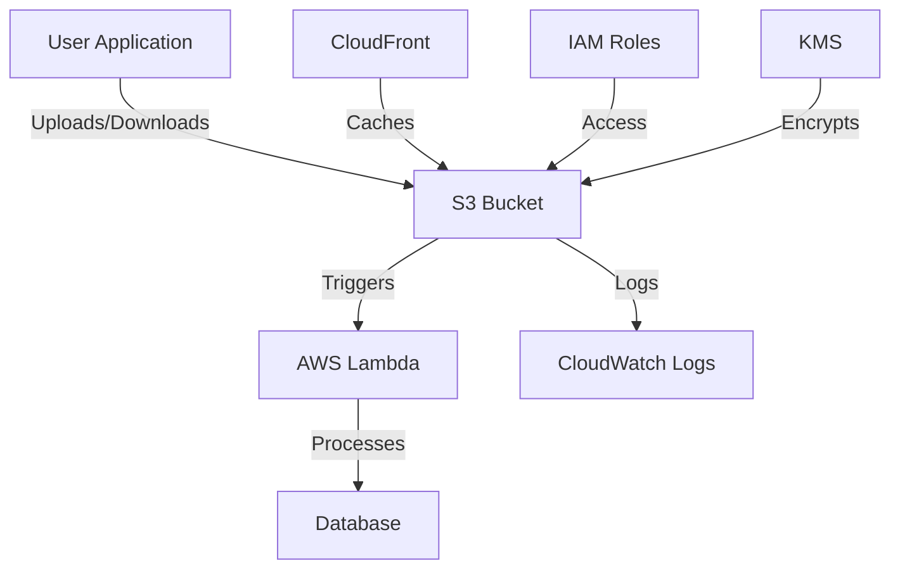

# S3 Standards

## Overview and scope

The purpose of this document is to establish the standards and best practices for utilizing Amazon S3 (Simple Storage Service) within Xentic's infrastructure. This standard aims to ensure consistency, security, and efficiency in the management of S3 buckets across various services.

### Audience

This document is intended for:
- Cloud architects
- DevOps engineers
- Software developers
- Security teams

### Scope

This standard applies to all S3 buckets created and managed within the Xentic environment. It encompasses:
- Naming conventions for S3 buckets
- Mandatory configurations for security and lifecycle management
- Guidelines for generating pre-signed URLs
- Access control policies

### Non-goals

This document does NOT cover:
- Detailed AWS account management practices
- Specific application-level interactions with S3 beyond the scope of bucket management
- S3 usage in non-production environments unless specified

### Glossary

| Term                          | Definition                                                                                       |
|-------------------------------|--------------------------------------------------------------------------------------------------|
| S3                            | Amazon Simple Storage Service, a scalable object storage service.                               |
| Bucket                        | A container for storing objects in S3.                                                          |
| Pre-signed URL                | A URL that grants temporary access to an S3 object, allowing for secure uploads/downloads.      |
| Lifecycle Configuration       | Rules that define how S3 manages objects over time, including transitions to different storage classes. |
| KMS                           | AWS Key Management Service, used for managing encryption keys.                                   |

### How This Standard Fits the Xentic Platform

The S3 Standards are a critical component of Xentic's cloud infrastructure strategy. By adhering to these guidelines, Xentic ensures that all services leverage S3 in a secure, efficient, and standardized manner. This promotes interoperability between services, enhances security posture, and simplifies maintenance and compliance efforts.

### Naming Convention

Buckets MUST follow the naming convention: `{xentic}-{env}-{service}-{purpose}`. For example:
- `xentic-prod-user-service-uploads`
- `xentic-dev-data-archive`

### Mandatory Bucket Configuration

The following configurations MUST be applied to all S3 buckets:

```hcl
resource "aws_s3_bucket" "uploads" {
  bucket = "xentic-prod-user-service-uploads"
}

resource "aws_s3_bucket_server_side_encryption_configuration" "uploads" {
  bucket = aws_s3_bucket.uploads.id
  rule {
    apply_server_side_encryption_by_default {
      sse_algorithm     = "aws:kms"
      kms_master_key_id = aws_kms_key.s3.arn
    }
  }
}

resource "aws_s3_bucket_public_access_block" "uploads" {
  bucket = aws_s3_bucket.uploads.id
  block_public_acls       = true
  block_public_policy     = true
  ignore_public_acls      = true
  restrict_public_buckets = true
}

resource "aws_s3_bucket_lifecycle_configuration" "uploads" {
  bucket = aws_s3_bucket.uploads.id
  rule {
    id     = "TransitionToIA"
    status = "Enabled"
    transition {
      days          = 90
      storage_class = "STANDARD_IA"
    }
    transition {
      days          = 365
      storage_class = "GLACIER"
    }
  }
}
```

### Pre-Signed URL Pattern

When generating pre-signed URLs, the following Python function MUST be used:

```python
def generate_upload_url(key: str, content_type: str) -> dict:
    return s3.generate_presigned_post(
        Bucket=settings.UPLOAD_BUCKET,
        Key=key,
        Fields={"Content-Type": content_type},
        Conditions=[["content-length-range", 1, 10 * 1024 * 1024]],
        ExpiresIn=900,  # 15 minutes
    )
```

### Rules

- All buckets MUST block public access.
- Access to S3 objects MUST be via pre-signed URLs or CloudFront; direct public access MUST NOT be allowed.
- Application roles MUST NOT be granted `s3:*` permissions; instead, adhere to the principle of least privilege on a per-bucket or per-prefix basis.

## Standards and policies

1. **Bucket Naming Convention**  
   Buckets MUST follow the naming convention: `{xentic}-{env}-{service}-{purpose}`. This ensures clarity and consistency across environments.  
   Examples:  
   - `xentic-prod-user-service-uploads`  
   - `xentic-dev-data-archive`  

2. **Bucket Configuration**  
   All S3 buckets MUST have the following mandatory configurations applied to ensure security and compliance:
   - Server-side encryption using AWS KMS.
   - Public access block settings to prevent unauthorized access.
   - Lifecycle policies for object management.

3. **Public Access**  
   All buckets MUST block public access. This includes:
   - `block_public_acls = true`
   - `block_public_policy = true`
   - `ignore_public_acls = true`
   - `restrict_public_buckets = true`

4. **Access Control**  
   Access to S3 objects MUST be via pre-signed URLs or CloudFront. Direct public access MUST NOT be allowed. This ensures that sensitive data remains protected.

5. **IAM Policies**  
   Application roles MUST NOT be granted `s3:*` permissions. Instead, roles MUST adhere to the principle of least privilege, granting only necessary permissions on a per-bucket or per-prefix basis.  
   Example IAM policy snippet:
   ```json
   {
     "Version": "2012-10-17",
     "Statement": [
       {
         "Effect": "Allow",
         "Action": [
           "s3:GetObject",
           "s3:PutObject"
         ],
         "Resource": "arn:aws:s3:::xentic-prod-user-service-uploads/*"
       }
     ]
   }
   ```

6. **Versioning**  
   Bucket versioning SHOULD be enabled for all production buckets to ensure data recovery and auditing capabilities.  
   Example configuration:
   ```hcl
   resource "aws_s3_bucket_versioning" "uploads" {
     bucket = aws_s3_bucket.uploads.id
     enabled = true
   }
   ```

7. **Lifecycle Management**  
   Lifecycle policies MUST be defined for all buckets to manage object transitions between storage classes and to delete obsolete objects.  
   Example lifecycle configuration:
   ```hcl
   resource "aws_s3_bucket_lifecycle_configuration" "uploads" {
     bucket = aws_s3_bucket.uploads.id
     rule {
       id     = "DeleteOldVersions"
       status = "Enabled"
       noncurrent_version_expiration {
         days = 30
       }
     }
   }
   ```

8. **Logging**  
   Server access logging SHOULD be enabled on all buckets to track requests for access to the bucket and its objects. Logs MUST be stored in a separate S3 bucket with appropriate access controls.

9. **Encryption**  
   All data stored in S3 MUST be encrypted at rest using AWS KMS. This includes both server-side encryption and client-side encryption when applicable.

10. **Monitoring and Alerts**  
    Monitoring MUST be configured for all S3 buckets using AWS CloudWatch to track metrics such as request counts and error rates. Alerts SHOULD be set up for unusual access patterns or errors.

11. **Data Retention**  
    Data retention policies MUST be defined and documented for each bucket, ensuring compliance with legal and regulatory requirements.

12. **Cross-Region Replication**  
    Cross-region replication SHOULD be considered for critical data to enhance availability and disaster recovery capabilities.

13. **Testing and Validation**  
    All configurations MUST be tested in a staging environment before deployment to production to ensure compliance with these standards.

14. **Documentation**  
    All S3 bucket configurations and policies MUST be documented in the internal wiki at `https://docs.internal.xentic.io/s3-standards` for transparency and reference.

## Architecture and design

The architecture for utilizing Amazon S3 within Xentic's infrastructure is designed to ensure high availability, security, and scalability. Below is a component diagram that illustrates the key components and their interactions.



### Data Flows

1. **User Interaction**:
   - Users interact with the application to upload or download files.
   - The application generates pre-signed URLs for secure access to S3 objects.

2. **S3 Operations**:
   - Upon receiving a request, the application communicates with S3 to upload or download objects.
   - All operations are logged for auditing and monitoring purposes.

3. **Lambda Processing**:
   - S3 events (e.g., object creation) trigger AWS Lambda functions for processing.
   - Lambda functions can perform operations such as data transformation or moving files to different buckets.

4. **Logging and Monitoring**:
   - All access requests to S3 are logged in CloudWatch Logs for monitoring.
   - Alerts are configured for unusual access patterns or errors.

### Integration Points

- **IAM Roles**: Access to S3 buckets is managed through IAM roles, ensuring that only authorized applications can interact with the S3 service.
- **KMS**: AWS Key Management Service (KMS) is used for encrypting data at rest in S3, ensuring compliance with security standards.
- **CloudFront**: Amazon CloudFront is utilized to cache S3 content, improving performance and reducing latency for end-users.

### Failure Domains

- **S3 Service Availability**: While S3 is designed for high availability, applications MUST implement retry logic for transient errors. 
- **Lambda Function Failures**: If a Lambda function fails, the event can be retried or sent to a Dead Letter Queue (DLQ) for further investigation.
- **Network Issues**: Applications MUST handle network-related errors gracefully, including timeouts and connection failures.

### Best Practices

- **Retry Logic**: Implement exponential backoff for retries on S3 operations to handle transient failures.
- **Error Handling**: Ensure robust error handling in Lambda functions to prevent data loss or corruption.
- **Monitoring**: Set up CloudWatch Alarms for S3 bucket metrics to proactively address issues.

By adhering to these architectural principles and design patterns, Xentic ensures that its use of Amazon S3 is efficient, secure, and resilient against failures.

## Configuration reference

### application.yml

The following configuration settings MUST be included in the `application.yml` file for services interacting with S3:

```yaml
s3:
  upload-bucket: xentic-prod-user-service-uploads
  region: us-west-2
  access-key: ${AWS_ACCESS_KEY_ID}
  secret-key: ${AWS_SECRET_ACCESS_KEY}
  endpoint: https://s3.us-west-2.amazonaws.com
  pre-signed-url-expiration: 900  # 15 minutes
  encryption:
    enabled: true
    kms-key-id: ${AWS_KMS_KEY_ID}
```

### Terraform Configuration

The following Terraform configurations MUST be used to set up S3 buckets and their associated properties:

| Resource Type | Configuration Example                                                                 |
|---------------|---------------------------------------------------------------------------------------|
| S3 Bucket     | ```hcl<br>resource "aws_s3_bucket" "uploads" {<br>  bucket = "xentic-prod-user-service-uploads"<br>}<br>``` |
| Encryption    | ```hcl<br>resource "aws_s3_bucket_server_side_encryption_configuration" "uploads" {<br>  bucket = aws_s3_bucket.uploads.id<br>  rule {<br>    apply_server_side_encryption_by_default {<br>      sse_algorithm     = "aws:kms"<br>      kms_master_key_id = aws_kms_key.s3.arn<br>    }<br>  }<br>}<br>``` |
| Public Access | ```hcl<br>resource "aws_s3_bucket_public_access_block" "uploads" {<br>  bucket = aws_s3_bucket.uploads.id<br>  block_public_acls       = true<br>  block_public_policy     = true<br>  ignore_public_acls      = true<br>  restrict_public_buckets = true<br>}<br>``` |
| Versioning    | ```hcl<br>resource "aws_s3_bucket_versioning" "uploads" {<br>  bucket = aws_s3_bucket.uploads.id<br>  enabled = true<br>}<br>``` |
| Lifecycle     | ```hcl<br>resource "aws_s3_bucket_lifecycle_configuration" "uploads" {<br>  bucket = aws_s3_bucket.uploads.id<br>  rule {<br>    id     = "TransitionToIA"<br>    status = "Enabled"<br>    transition {<br>      days          = 90<br>      storage_class = "STANDARD_IA"<br>    }<br>    transition {<br>      days          = 365<br>      storage_class = "GLACIER"<br>    }<br>  }<br>}<br>``` |

### Environment Variables

The following environment variables MUST be set for the application to interact with S3:

| Variable                | Default Value           | Production Value         |
|-------------------------|-------------------------|---------------------------|
| AWS_ACCESS_KEY_ID      | (not set)               | <your-production-access-key> |
| AWS_SECRET_ACCESS_KEY  | (not set)               | <your-production-secret-key> |
| AWS_REGION              | us-west-2               | us-west-2                 |
| AWS_KMS_KEY_ID         | (not set)               | <your-production-kms-key-id> |

### SQL for Bucket Metadata

The following SQL command MUST be used to store metadata for S3 buckets in the database:

```sql
CREATE TABLE s3_bucket_metadata (
    id SERIAL PRIMARY KEY,
    bucket_name VARCHAR(255) NOT NULL UNIQUE,
    created_at TIMESTAMP DEFAULT CURRENT_TIMESTAMP,
    updated_at TIMESTAMP DEFAULT CURRENT_TIMESTAMP,
    encryption_enabled BOOLEAN DEFAULT TRUE,
    versioning_enabled BOOLEAN DEFAULT FALSE,
    lifecycle_policy JSONB
);
```

### Summary

By adhering to the configurations outlined above, Xentic ensures that all S3 interactions are secure, compliant, and efficient. These configurations MUST be reviewed and updated regularly to align with best practices and organizational standards.

## Implementation guide

To implement Amazon S3 within Xentic's infrastructure, follow the steps outlined below. This guide provides a comprehensive approach to setting up S3 buckets, configuring security, and integrating with other AWS services.

### Step 1: Create an S3 Bucket

Use Terraform to create an S3 bucket. The bucket name must be unique across all AWS accounts.

```hcl
resource "aws_s3_bucket" "uploads" {
  bucket = "xentic-prod-user-service-uploads"
  acl    = "private"
  tags = {
    Name        = "Uploads Bucket"
    Environment = "Production"
  }
}
```

### Step 2: Enable Versioning

Versioning MUST be enabled to keep multiple versions of an object in the bucket.

```hcl
resource "aws_s3_bucket_versioning" "uploads" {
  bucket = aws_s3_bucket.uploads.id
  enabled = true
}
```

### Step 3: Configure Encryption

Server-side encryption MUST be configured using AWS KMS to protect data at rest.

```hcl
resource "aws_kms_key" "s3" {
  description = "KMS key for S3 bucket encryption"
}

resource "aws_s3_bucket_server_side_encryption_configuration" "uploads" {
  bucket = aws_s3_bucket.uploads.id
  rule {
    apply_server_side_encryption_by_default {
      sse_algorithm     = "aws:kms"
      kms_master_key_id = aws_kms_key.s3.arn
    }
  }
}
```

### Step 4: Set Up Lifecycle Policies

Define lifecycle policies to manage object transitions and deletions.

```hcl
resource "aws_s3_bucket_lifecycle_configuration" "uploads" {
  bucket = aws_s3_bucket.uploads.id
  rule {
    id     = "DeleteOldVersions"
    status = "Enabled"
    noncurrent_version_expiration {
      days = 30
    }
    transition {
      days          = 90
      storage_class = "STANDARD_IA"
    }
    transition {
      days          = 365
      storage_class = "GLACIER"
    }
  }
}
```

### Step 5: Enable Logging

Server access logging MUST be enabled to track requests for access to the bucket.

```hcl
resource "aws_s3_bucket_logging" "uploads" {
  bucket = aws_s3_bucket.uploads.id
  target_bucket = "xentic-logs-bucket"
  target_prefix = "log/"
}
```

### Step 6: Set Up IAM Policies

IAM roles MUST be configured to grant access to the S3 bucket.

```hcl
resource "aws_iam_role" "s3_access_role" {
  name = "s3-access-role"

  assume_role_policy = jsonencode({
    Version = "2012-10-17"
    Statement = [{
      Action = "sts:AssumeRole"
      Principal = {
        Service = "ec2.amazonaws.com"
      }
      Effect = "Allow"
      Sid    = ""
    }]
  })
}

resource "aws_iam_policy" "s3_access_policy" {
  name        = "S3AccessPolicy"
  description = "Policy to allow access to S3 uploads bucket"

  policy = jsonencode({
    Version = "2012-10-17"
    Statement = [{
      Effect = "Allow"
      Action = [
        "s3:PutObject",
        "s3:GetObject",
        "s3:DeleteObject",
        "s3:ListBucket"
      ]
      Resource = [
        aws_s3_bucket.uploads.arn,
        "${aws_s3_bucket.uploads.arn}/*"
      ]
    }]
  })
}

resource "aws_iam_role_policy_attachment" "attach_policy" {
  role       = aws_iam_role.s3_access_role.name
  policy_arn = aws_iam_policy.s3_access_policy.arn
}
```

### Step 7: Implement Pre-signed URLs

Generate pre-signed URLs for secure access to S3 objects in Java.

```java
import com.amazonaws.services.s3.AmazonS3;
import com.amazonaws.services.s3.model.GeneratePresignedUrlRequest;
import java.util.Date;

public class S3Service {
    private final AmazonS3 s3Client;
    private final String bucketName;

    public S3Service(AmazonS3 s3Client, String bucketName) {
        this.s3Client = s3Client;
        this.bucketName = bucketName;
    }

    public String generatePresignedUrl(String objectKey) {
        Date expiration = new Date();
        long expTimeMillis = expiration.getTime();
        expTimeMillis += 1000 * 60 * 15; // 15 minutes
        expiration.setTime(expTimeMillis);

        GeneratePresignedUrlRequest generatePresignedUrlRequest =
                new GeneratePresignedUrlRequest(bucketName, objectKey)
                        .withMethod(HttpMethod.GET)
                        .withExpiration(expiration);

        return s3Client.generatePresignedUrl(generatePresignedUrlRequest).toString();
    }
}
```

### Step 8: Monitor and Alert

Set up CloudWatch alarms for monitoring the S3 bucket.

```hcl
resource "aws_cloudwatch_metric_alarm" "high_error_rate" {
  alarm_name          = "HighErrorRate"
  comparison_operator = "GreaterThanThreshold"
  evaluation_periods  = "1"
  metric_name        = "4xxErrors"
  namespace          = "AWS/S3"
  period             = "60"
  statistic          = "Sum"
  threshold          = "5"
  alarm_description  = "This alarm monitors for high error rates in S3 bucket"
  dimensions = {
    BucketName = aws_s3_bucket.uploads.bucket
    Filter     = "AllRequests"
  }
}
```

### Summary

Following these steps ensures that Xentic's S3 implementation is secure, compliant, and efficient. All configurations MUST be reviewed regularly to align with best practices and organizational standards.

## Security requirements

To ensure the security of Amazon S3 implementations at Xentic, the following security requirements MUST be adhered to:

### Threat Model Summary

- **Data Breach**: Unauthorized access to sensitive data stored in S3.
- **Data Loss**: Accidental deletion or corruption of data.
- **Denial of Service**: Attacks that prevent legitimate access to S3 resources.
- **Insider Threats**: Malicious actions by employees or contractors with access to S3.

### Authentication and Authorization

- **IAM Roles**: All applications MUST use IAM roles with the principle of least privilege to access S3 resources.
- **Policy Enforcement**: S3 bucket policies MUST be enforced to restrict access based on user roles and IP addresses.
- **Multi-Factor Authentication (MFA)**: MFA SHOULD be enabled for sensitive operations, such as deleting objects or changing bucket policies.

### Secrets Management

- **Environment Variables**: Secrets MUST NOT be hard-coded in the application. Use environment variables or AWS Secrets Manager for sensitive information.
- **KMS Encryption**: All sensitive data stored in S3 MUST be encrypted using AWS KMS. The KMS key MUST be rotated regularly.

```yaml
# Example of using AWS Secrets Manager
secrets:
  AWS_ACCESS_KEY_ID: ${AWS_ACCESS_KEY_ID}
  AWS_SECRET_ACCESS_KEY: ${AWS_SECRET_ACCESS_KEY}
```

### Input Validation

- **Sanitization**: All inputs to S3 operations MUST be validated and sanitized to prevent injection attacks.
- **File Type Checks**: Uploaded files MUST be checked for allowed MIME types and extensions to prevent malicious file uploads.

```java
public void validateFileUpload(MultipartFile file) {
    String contentType = file.getContentType();
    if (!isValidContentType(contentType)) {
        throw new IllegalArgumentException("Invalid file type");
    }
}

private boolean isValidContentType(String contentType) {
    return Arrays.asList("image/jpeg", "image/png", "application/pdf").contains(contentType);
}
```

### Audit Logging

- **S3 Access Logs**: Server access logging MUST be enabled for all S3 buckets to track requests and access patterns.
- **CloudTrail**: AWS CloudTrail MUST be enabled to log all API calls made to S3, including who accessed what and when.
- **Log Retention**: Logs MUST be retained for at least 90 days for compliance and auditing purposes.

```hcl
resource "aws_s3_bucket_logging" "uploads" {
  bucket        = aws_s3_bucket.uploads.id
  target_bucket = "xentic-logs-bucket"
  target_prefix = "log/"
}
```

### Summary of Security Practices

| Security Aspect         | Requirements                                                                                                      |
|-------------------------|------------------------------------------------------------------------------------------------------------------|
| Authentication          | Use IAM roles with least privilege; enable MFA for sensitive operations.                                         |
| Secrets Management      | Use environment variables or AWS Secrets Manager; rotate KMS keys regularly.                                     |
| Input Validation        | Validate and sanitize all inputs; check file types for uploads.                                                 |
| Audit Logging           | Enable S3 access logs and AWS CloudTrail; retain logs for at least 90 days.                                     |

By adhering to these security requirements, Xentic can mitigate risks associated with S3 usage and ensure the integrity, confidentiality, and availability of its data. Regular reviews and updates to these practices MUST be conducted to align with evolving security standards and threats.

## Testing strategy

To ensure the reliability and performance of S3 implementations at Xentic, a comprehensive testing strategy MUST be established. This strategy should encompass unit tests, integration tests, and contract tests, with defined coverage targets.

### Unit Tests

Unit tests MUST be written to validate the functionality of individual components in isolation. Each service should aim for a minimum coverage of 80%. Unit tests should focus on:

- Validating input parameters
- Ensuring correct responses from methods
- Handling exceptions and edge cases

#### Example Unit Test Class

```java
import static org.junit.jupiter.api.Assertions.*;
import org.junit.jupiter.api.BeforeEach;
import org.junit.jupiter.api.Test;

public class S3ServiceTest {
    private S3Service s3Service;

    @BeforeEach
    public void setup() {
        // Mock AmazonS3 client
        AmazonS3 mockS3Client = Mockito.mock(AmazonS3.class);
        s3Service = new S3Service(mockS3Client, "test-bucket");
    }

    @Test
    public void testGeneratePresignedUrl() {
        String objectKey = "test-object";
        String presignedUrl = s3Service.generatePresignedUrl(objectKey);
        assertNotNull(presignedUrl);
    }

    @Test
    public void testGeneratePresignedUrlWithInvalidKey() {
        assertThrows(IllegalArgumentException.class, () -> {
            s3Service.generatePresignedUrl(null);
        });
    }
}
```

### Integration Tests

Integration tests MUST be used to verify the interaction between components and external services, such as AWS S3. These tests should cover:

- Successful uploads and downloads of objects
- Correct handling of permissions and policies
- Validating lifecycle rules and logging

Integration tests should have a coverage target of at least 70%.

#### Example Integration Test Class

```java
import static org.junit.jupiter.api.Assertions.*;
import org.junit.jupiter.api.Test;

public class S3IntegrationTest {
    private S3Service s3Service;

    @Test
    public void testUploadFile() {
        // Assume setup for S3 client and bucket
        boolean isUploaded = s3Service.uploadFile("test-object", new File("path/to/file"));
        assertTrue(isUploaded);
    }

    @Test
    public void testDownloadFile() {
        // Assume setup for S3 client and bucket
        File downloadedFile = s3Service.downloadFile("test-object");
        assertNotNull(downloadedFile);
        assertTrue(downloadedFile.exists());
    }
}
```

### Contract Tests

Contract tests MUST be implemented to ensure that the interactions between services conform to expected behaviors. This includes validating API contracts and ensuring that the S3 service meets the agreed-upon specifications.

- Use tools like Pact to define consumer-driven contracts.
- Ensure that both the consumer and provider sides are tested against the contract.

### Coverage Targets

| Test Type       | Coverage Target |
|------------------|-----------------|
| Unit Tests       | 80%             |
| Integration Tests| 70%             |
| Contract Tests   | 100%            |

### Continuous Integration

All tests MUST be integrated into the CI/CD pipeline to ensure that they are executed automatically on each commit. This ensures that any breaking changes are caught early in the development process.

### Summary

By adhering to this testing strategy, Xentic can ensure that its S3 implementations are robust, reliable, and maintainable. Regular reviews of test coverage and the addition of new tests MUST be performed to keep pace with evolving application requirements.

## Observability and operations

To ensure effective observability and operations for Amazon S3 implementations at Xentic, the following standards MUST be established. This includes metrics collection, logging practices, tracing, dashboard creation, alerting mechanisms, and defining Service Level Objectives (SLOs).

### Metrics

Metrics MUST be collected to monitor the health and performance of S3 buckets. Key metrics include:

- **Request Count**: Total number of requests to the bucket.
- **Error Rate**: Number of 4xx and 5xx errors.
- **Data Transfer**: Amount of data transferred in and out of the bucket.
- **Latency**: Time taken to process requests.

#### Example CloudWatch Metric Configuration

```hcl
resource "aws_cloudwatch_metric_alarm" "high_request_count" {
  alarm_name          = "HighRequestCount"
  comparison_operator = "GreaterThanThreshold"
  evaluation_periods  = "1"
  metric_name        = "AllRequests"
  namespace          = "AWS/S3"
  period             = "60"
  statistic          = "Sum"
  threshold          = "1000"
  alarm_description  = "This alarm monitors for high request counts in S3 bucket"
  dimensions = {
    BucketName = aws_s3_bucket.uploads.bucket
  }
}
```

### Logs

Logging MUST be implemented to capture detailed information about access and operations performed on S3 buckets. The following logs are essential:

- **S3 Server Access Logs**: Track requests made to the bucket.
- **CloudTrail Logs**: Capture API calls made to S3.

#### Enabling Server Access Logging

```hcl
resource "aws_s3_bucket_logging" "uploads" {
  bucket        = aws_s3_bucket.uploads.id
  target_bucket = "xentic-logs-bucket"
  target_prefix = "log/"
}
```

### Traces

Distributed tracing MUST be implemented to monitor the flow of requests through the system. This helps identify bottlenecks and performance issues. Use AWS X-Ray or similar tools to trace requests from the application to S3.

### Dashboards

Dashboards MUST be created to visualize metrics and logs. Key components of the dashboard should include:

- Error rates over time
- Request counts and trends
- Data transfer volumes
- Latency metrics

Utilize AWS CloudWatch Dashboards to create visualizations that provide insights into the performance of S3 buckets.

### Alerts

Alerts MUST be configured to notify the on-call team of any anomalies or critical issues. Common alerts include:

- High error rates (4xx and 5xx)
- Excessive latency
- Sudden spikes in request counts

#### Example Alert Configuration

```hcl
resource "aws_cloudwatch_metric_alarm" "high_error_rate" {
  alarm_name          = "HighErrorRate"
  comparison_operator = "GreaterThanThreshold"
  evaluation_periods  = "1"
  metric_name        = "4xxErrors"
  namespace          = "AWS/S3"
  period             = "60"
  statistic          = "Sum"
  threshold          = "5"
  alarm_description  = "This alarm monitors for high error rates in S3 bucket"
  dimensions = {
    BucketName = aws_s3_bucket.uploads.bucket
    Filter     = "AllRequests"
  }
}
```

### Service Level Objectives (SLOs)

SLOs MUST be defined to set expectations for service performance. Examples of SLOs for S3 operations include:

| SLO Description                      | Target         |
|--------------------------------------|----------------|
| 99.9% of requests should succeed     | Over a month   |
| Average latency should be < 100ms    | Over a month   |
| 95% of requests should be processed in < 200ms | Over a month   |

### On-Call Runbook Steps

In the event of an incident, the following on-call runbook steps MUST be followed:

1. **Identify the Issue**: Check CloudWatch alarms and logs for anomalies.
2. **Assess Impact**: Determine the scope of the issue (e.g., affected services, users).
3. **Mitigate**: If possible, apply a temporary fix (e.g., scaling the service, adjusting bucket policies).
4. **Notify Stakeholders**: Inform relevant teams and stakeholders about the incident and the impact.
5. **Resolve**: Implement a permanent fix and monitor the situation.
6. **Post-Mortem**: Conduct a post-mortem analysis to identify root causes and prevent future occurrences.

By adhering to these observability and operations standards, Xentic can ensure that its S3 implementations are monitored effectively, enabling proactive management and rapid response to incidents. Regular reviews of metrics, logs, and alert configurations MUST be conducted to maintain alignment with operational excellence.

## Migration and versioning

To maintain the integrity and reliability of S3 implementations at Xentic, a clear migration and versioning strategy MUST be established. This strategy should include defined upgrade paths, a deprecation policy, backward compatibility measures, and rollback procedures.

### Upgrade Paths

When upgrading S3-related services or libraries, the following guidelines MUST be followed:

- **Semantic Versioning**: All services MUST adhere to semantic versioning (MAJOR.MINOR.PATCH). Breaking changes MUST increment the MAJOR version.
- **Documentation**: Each upgrade path MUST be documented, detailing the changes, migration steps, and potential impacts.
- **Testing**: Comprehensive testing MUST be performed before deploying any upgrades, including unit, integration, and contract tests.

#### Example Upgrade Path Documentation

| Version | Changes                                   | Migration Steps                          |
|---------|-------------------------------------------|-----------------------------------------|
| 1.0.0  | Initial release                          | N/A                                     |
| 1.1.0  | Added support for multipart uploads      | Update configuration, run migration script |
| 2.0.0  | Breaking change: API endpoint modified   | Update client code, run migration script |

### Deprecation Policy

Xentic MUST have a clear deprecation policy for S3 services and features:

- **Notification**: Deprecation MUST be communicated at least one release cycle in advance.
- **Grace Period**: Deprecated features MUST remain available for at least two release cycles before removal.
- **Documentation**: All deprecated features MUST be documented, including alternative solutions or replacements.

#### Example Deprecation Notice

```markdown
### Deprecation Notice for `generatePresignedUrlV1`

The `generatePresignedUrlV1` method will be deprecated in version 2.0.0. Please use `generatePresignedUrlV2` instead.

- **Last Supported Version**: 1.1.0
- **Removal Date**: MM/DD/YYYY
- **Alternative**: Use `generatePresignedUrlV2` which offers enhanced security features.
```

### Backward Compatibility

Backward compatibility MUST be maintained wherever feasible to minimize disruption for consumers of the S3 services:

- **Versioned APIs**: Implement versioning in API endpoints to allow clients to continue using older versions without disruption.
- **Feature Toggles**: Use feature toggles to enable or disable new features without impacting existing functionality.

#### Example Versioned API Endpoint

```java
@RestController
@RequestMapping("/api/v1/s3")
public class S3Controller {
    @GetMapping("/presigned-url")
    public ResponseEntity<String> generatePresignedUrl(@RequestParam String objectKey) {
        // Implementation for v1
    }
}

@RestController
@RequestMapping("/api/v2/s3")
public class S3ControllerV2 {
    @GetMapping("/presigned-url")
    public ResponseEntity<String> generatePresignedUrlV2(@RequestParam String objectKey) {
        // Enhanced implementation for v2
    }
}
```

### Rollback Procedures

Rollback procedures MUST be defined and tested to ensure that any issues arising from upgrades can be addressed quickly:

- **Automated Rollback**: Implement automated rollback mechanisms in the CI/CD pipeline to revert to the last stable version if a deployment fails.
- **Backup Strategy**: Maintain backups of critical data and configurations prior to upgrades to facilitate recovery.

#### Example Rollback Script

```bash
#!/bin/bash

# Rollback to the previous version of the S3 service
echo "Rolling back to the previous version..."
kubectl rollout undo deployment/s3-service
echo "Rollback completed."
```

### Summary

By establishing a robust migration and versioning strategy, Xentic can ensure that its S3 implementations remain stable, reliable, and user-friendly. Regular reviews of upgrade paths, deprecation notices, and rollback procedures MUST be conducted to maintain alignment with best practices and organizational goals.

## FAQ, anti-patterns, and checklists

### FAQ

1. **What is the maximum size of an object that can be stored in S3?**
   - The maximum size of a single object in S3 is 5 TB.

2. **How can I secure my S3 buckets?**
   - Use bucket policies, IAM roles, and enable server-side encryption (SSE) to secure your S3 buckets.

3. **What is the difference between S3 Standard and S3 Glacier?**
   - S3 Standard is for frequently accessed data, while S3 Glacier is for archival storage with lower retrieval speeds.

4. **Can I use S3 for static website hosting?**
   - Yes, S3 can be configured to host static websites.

5. **How do I enable versioning on an S3 bucket?**
   - Versioning can be enabled by setting the `versioning` configuration in the bucket properties.

   ```hcl
   resource "aws_s3_bucket_versioning" "example" {
     bucket = aws_s3_bucket.uploads.id
     versioning_configuration {
       enabled = true
     }
   }
   ```

6. **What are the costs associated with S3?**
   - Costs include storage, requests, and data transfer out of S3. Refer to the [AWS S3 Pricing](https://aws.amazon.com/s3/pricing/) page for detailed information.

7. **How can I monitor S3 bucket activity?**
   - Use S3 server access logs and AWS CloudTrail to monitor bucket activity.

8. **What is the best practice for naming S3 buckets?**
   - Bucket names MUST be globally unique, DNS-compliant, and should not contain uppercase letters.

9. **How can I manage access to S3 buckets?**
   - Use IAM policies, bucket policies, and Access Control Lists (ACLs) to manage access.

10. **What should I do if I accidentally delete an S3 object?**
    - If versioning is enabled, you can restore the deleted object by retrieving its previous version.

### Anti-Patterns

| Anti-Pattern                     | Description                                                                 |
|----------------------------------|-----------------------------------------------------------------------------|
| Using Public Buckets             | Buckets should NEVER be public unless absolutely necessary.                 |
| Hardcoding Credentials            | Credentials MUST NOT be hardcoded in code; use AWS IAM roles instead.      |
| Ignoring Encryption               | Data at rest MUST be encrypted using server-side encryption (SSE).         |
| Lack of Lifecycle Policies        | Failing to set lifecycle policies can lead to unnecessary costs.           |
| Not Using Versioning             | Not enabling versioning can result in permanent data loss.                 |
| Overly Broad IAM Policies        | IAM policies MUST be principle of least privilege to minimize access.      |
| Ignoring Logging                  | Logging MUST be enabled to track access and operations on buckets.         |

### Pre-Merge Checklist

- [ ] Code adheres to Xentic coding standards.
- [ ] All S3 bucket configurations are reviewed and approved.
- [ ] Unit tests cover all new S3-related functionality.
- [ ] Integration tests validate interactions with S3.
- [ ] Documentation is updated to reflect any changes.
- [ ] Security reviews are conducted for IAM policies and bucket policies.
- [ ] Ensure all sensitive data is encrypted.

### Production Checklist

- [ ] Monitor CloudWatch metrics for S3 bucket performance.
- [ ] Verify that logging is enabled for S3 buckets.
- [ ] Ensure alerts are configured for high error rates and latency.
- [ ] Confirm that all S3 configurations are deployed correctly.
- [ ] Validate that versioning is enabled on critical buckets.
- [ ] Review lifecycle policies to manage data retention effectively.
- [ ] Conduct a post-deployment review to assess the impact of changes.
