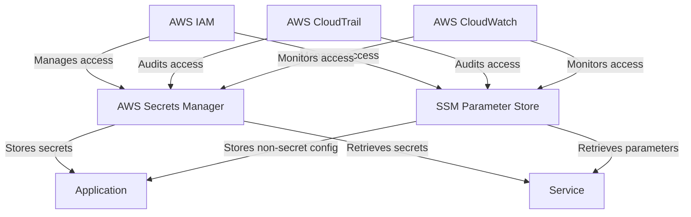

# Secrets Management — AWS Secrets Manager + SSM

## Overview and scope

The purpose of this document is to establish standards for managing secrets within the Xentic platform using AWS Secrets Manager and AWS Systems Manager (SSM) Parameter Store. This standard aims to ensure that sensitive information, such as database credentials and API keys, is handled securely and efficiently across all services.

### Audience
This document is intended for:
- Software Engineers
- DevOps Engineers
- Security Teams
- System Architects

### Scope
This standard applies to all Xentic services that require the management of sensitive information. It covers the usage of AWS Secrets Manager for storing and retrieving secrets, as well as SSM Parameter Store for managing non-secret application configuration. 

### Non-goals
- This document does not cover secrets management for services outside of AWS.
- It does not address the implementation of secrets management in development environments, which may have different requirements.

### Glossary
| Term                   | Definition                                                                                       |
|------------------------|--------------------------------------------------------------------------------------------------|
| Secrets Manager        | A service that helps you protect access to your applications, services, and IT resources without the upfront investment and on-going maintenance costs of operating your own infrastructure. |
| SSM Parameter Store    | A service that provides secure, hierarchical storage for configuration data management and secrets management. |
| KMS                    | AWS Key Management Service, a service that makes it easy to create and control the encryption keys used to encrypt your data. |
| IAM                    | AWS Identity and Access Management, a web service that helps you securely control access to AWS services and resources for your users. |

### How This Standard Fits the Xentic Platform
The secrets management strategy outlined in this document is integral to the security posture of the Xentic platform. By adhering to these standards, Xentic ensures that sensitive information is stored securely and accessed only by authorized services. This approach aligns with Xentic's commitment to best practices in security and compliance, enabling teams to focus on delivering value without compromising on security.

### Decision Guide
| Use Case                          | Tool               |
|-----------------------------------|--------------------|
| DB credentials (auto-rotation)    | Secrets Manager     |
| API keys, tokens                  | Secrets Manager     |
| App config (non-secret)           | SSM Parameter Store  |
| Feature flags                     | SSM Parameter Store  |

### SSM Parameter Store Example
```hcl
resource "aws_ssm_parameter" "db_url" {
  name   = "/${var.env}/${var.service}/DATABASE_URL"
  type   = "SecureString"
  value  = "postgresql://..."
  key_id = aws_kms_key.ssm.arn
}
```

### Reading Secrets in Application (Python)
```python
import boto3
import json
from functools import lru_cache

@lru_cache(maxsize=None)
def get_secret(secret_name: str) -> dict:
    client = boto3.client("secretsmanager")
    response = client.get_secret_value(SecretId=secret_name)
    return json.loads(response["SecretString"])
```

### Rules
- **MUST** never commit secrets to Git.
- **MUST** ensure all secrets are KMS-encrypted with service-specific keys.
- **MUST** enable auto-rotation for all database credentials.
- **MUST** audit secret access monthly via CloudTrail.
- **MUST NOT** allow each service IAM role to access secrets outside its own scope.

## Standards and policies

1. **MUST** use AWS Secrets Manager for managing sensitive information such as API keys, database credentials, and any other secrets. The naming convention for secrets in Secrets Manager MUST follow the format: `com.xentic.<service>/<secret_name>`.

2. **MUST** utilize SSM Parameter Store for non-sensitive configuration data. The naming convention for parameters in SSM MUST follow the format: `/com/xentic/<service>/<parameter_name>`.

3. **MUST NOT** hardcode secrets in application code. All sensitive information MUST be retrieved at runtime from AWS Secrets Manager or SSM Parameter Store.

4. **MUST** implement IAM policies that grant the least privilege necessary for accessing secrets. Each service MUST have a dedicated IAM role with permissions scoped only to the secrets it requires.

5. **MUST** enable versioning for all secrets stored in AWS Secrets Manager to facilitate rollback in case of issues.

6. **MUST** configure AWS Secrets Manager to use KMS for encryption with a service-specific key. The key MUST be created and managed according to Xentic’s key management policies.

7. **SHOULD** use environment variables to pass non-sensitive configuration parameters to applications when deploying in AWS.

8. **MUST** rotate secrets automatically at least every 30 days, and this should be configured within AWS Secrets Manager.

9. **MUST NOT** expose secrets through logs or error messages. Logging frameworks MUST be configured to mask sensitive information.

10. **MUST** implement monitoring and alerting for access to secrets using AWS CloudTrail and AWS CloudWatch. Alerts MUST be configured for any unauthorized access attempts.

11. **MUST** document all secrets and their usage within the service architecture documentation. This documentation MUST be kept up to date with any changes.

12. **SHOULD** use tagging for secrets and parameters in AWS to facilitate cost management and security audits. Tags MUST include `Owner`, `Environment`, and `Service`.

13. **MUST** ensure that all developers and operators are trained in the proper handling of secrets and the importance of security best practices.

14. **MUST NOT** share secrets between services unless absolutely necessary. In such cases, a secure mechanism for sharing MUST be implemented.

15. **SHOULD** periodically review and clean up unused secrets and parameters to minimize potential attack vectors.

16. **MUST** use a secure connection (HTTPS) for all interactions with AWS Secrets Manager and SSM Parameter Store.

### Example IAM Policy for Secrets Access
```json
{
  "Version": "2012-10-17",
  "Statement": [
    {
      "Effect": "Allow",
      "Action": [
        "secretsmanager:GetSecretValue",
        "secretsmanager:DescribeSecret"
      ],
      "Resource": "arn:aws:secretsmanager:us-east-1:123456789012:secret:com.xentic.myservice/*"
    }
  ]
}
```

### Example of Retrieving a Parameter from SSM
```python
import boto3

def get_parameter(parameter_name: str) -> str:
    ssm_client = boto3.client("ssm")
    response = ssm_client.get_parameter(Name=parameter_name, WithDecryption=True)
    return response['Parameter']['Value']
```

By adhering to these standards and policies, Xentic will maintain a robust security posture while managing sensitive information effectively.

## Architecture and design

### Component Diagram



### Data Flows

1. **Secrets Retrieval**:
   - Applications and services request secrets from AWS Secrets Manager using the AWS SDK.
   - Secrets are fetched securely over HTTPS and decrypted using KMS.

2. **Configuration Retrieval**:
   - Applications fetch non-secret configuration parameters from SSM Parameter Store.
   - Parameters can be either plain text or encrypted (SecureString).

3. **Access Management**:
   - IAM roles are used to control access to both AWS Secrets Manager and SSM Parameter Store.
   - Policies define which secrets or parameters a service can access.

4. **Auditing and Monitoring**:
   - AWS CloudTrail logs all access to secrets and parameters.
   - AWS CloudWatch monitors for unauthorized access attempts and alerts the security team.

### Integration Points

- **AWS Secrets Manager**: Integrated with applications for retrieving sensitive information.
- **SSM Parameter Store**: Integrated for managing non-secret configuration and feature flags.
- **AWS IAM**: Ensures that only authorized services can access secrets and parameters.
- **AWS KMS**: Provides encryption for secrets stored in AWS Secrets Manager and SSM Parameter Store.
- **AWS CloudTrail**: Logs all access to secrets and parameters for auditing purposes.
- **AWS CloudWatch**: Monitors access patterns and sends alerts for suspicious activities.

### Failure Domains

- **Secrets Manager Outage**: If AWS Secrets Manager is unavailable, applications may fail to retrieve necessary secrets, leading to service outages. Implement retries and fallbacks where possible.
- **SSM Parameter Store Outage**: Similar to Secrets Manager, an outage here can prevent applications from accessing critical configuration data. Ensure that applications can handle such failures gracefully.
- **IAM Misconfiguration**: Incorrect IAM policies can lead to unauthorized access or denial of access to secrets, which can impact application functionality. Regularly review IAM policies and access logs.
- **KMS Key Issues**: If the KMS key used for encryption is disabled or deleted, access to secrets will be lost. Ensure proper key management practices are followed.
- **Network Issues**: Network connectivity problems can prevent applications from accessing AWS services. Implement robust error handling and retry mechanisms.

### Best Practices

- **Caching**: Implement caching of secrets and parameters within the application to reduce the number of calls to AWS services and improve performance.
- **Versioning**: Utilize versioning in AWS Secrets Manager to manage changes to secrets effectively.
- **Environment-Specific Configurations**: Separate secrets and parameters by environment (e.g., development, staging, production) to prevent accidental exposure.
- **Documentation**: Keep documentation of secrets and their usage up to date, including their purpose and access requirements.

By following the outlined architecture and design principles, Xentic can ensure a secure and efficient approach to secrets management using AWS Secrets Manager and SSM Parameter Store.

## Configuration reference

### Application Configuration (`application.yml`)
```yaml
spring:
  cloud:
    aws:
      secretsmanager:
        enabled: true
        region: us-east-1
      parameterstore:
        enabled: true
        region: us-east-1

database:
  url: ${com.xentic.myservice/DATABASE_URL}
  username: ${com.xentic.myservice/DB_USERNAME}
  password: ${com.xentic.myservice/DB_PASSWORD}

api:
  key: ${com.xentic.myservice/API_KEY}
```

### Terraform Configuration for Secrets and Parameters

| Resource Type          | Name                                         | Type        | Value                        | Key ID                            |
|-----------------------|----------------------------------------------|-------------|------------------------------|-----------------------------------|
| `aws_ssm_parameter`   | db_url                                      | SecureString| postgresql://...             | aws_kms_key.ssm.arn              |
| `aws_ssm_parameter`   | db_username                                 | SecureString| my_db_user                   | aws_kms_key.ssm.arn              |
| `aws_ssm_parameter`   | db_password                                 | SecureString| my_secure_password           | aws_kms_key.ssm.arn              |
| `aws_secretsmanager_secret` | api_key                              | Secret      | my_api_key                   | aws_kms_key.secrets.arn          |

### Environment Variables

| Variable Name                          | Default Value         | Production Value           |
|----------------------------------------|-----------------------|----------------------------|
| `DATABASE_URL`                         | `jdbc:postgresql://localhost:5432/mydb` | `jdbc:postgresql://prod-db:5432/proddb` |
| `DB_USERNAME`                          | `dev_user`            | `prod_user`                |
| `DB_PASSWORD`                          | `dev_password`        | `prod_secure_password`     |
| `API_KEY`                              | `dev_api_key`        | `prod_api_key`             |

### Example of Retrieving Secrets in Java
```java
import software.amazon.awssdk.services.secretsmanager.SecretsManagerClient;
import software.amazon.awssdk.services.secretsmanager.model.GetSecretValueRequest;
import software.amazon.awssdk.services.secretsmanager.model.GetSecretValueResponse;

public class SecretsManagerUtil {
    private final SecretsManagerClient secretsManagerClient;

    public SecretsManagerUtil(SecretsManagerClient client) {
        this.secretsManagerClient = client;
    }

    public String getSecret(String secretName) {
        GetSecretValueRequest request = GetSecretValueRequest.builder()
                .secretId(secretName)
                .build();
        GetSecretValueResponse response = secretsManagerClient.getSecretValue(request);
        return response.secretString();
    }
}
```

### Example of Retrieving Parameters from SSM in Java
```java
import software.amazon.awssdk.services.ssm.SsmClient;
import software.amazon.awssdk.services.ssm.model.GetParameterRequest;
import software.amazon.awssdk.services.ssm.model.GetParameterResponse;

public class SSMUtil {
    private final SsmClient ssmClient;

    public SSMUtil(SsmClient client) {
        this.ssmClient = client;
    }

    public String getParameter(String parameterName) {
        GetParameterRequest request = GetParameterRequest.builder()
                .name(parameterName)
                .withDecryption(true)
                .build();
        GetParameterResponse response = ssmClient.getParameter(request);
        return response.parameter().value();
    }
}
```

By following the configuration reference outlined above, Xentic will ensure a consistent and secure approach to managing application secrets and parameters across different environments.

## Implementation guide

To implement secrets management using AWS Secrets Manager and SSM Parameter Store at Xentic, follow these detailed steps:

### Step 1: Set Up AWS IAM Roles

Create IAM roles that allow your application to access AWS Secrets Manager and SSM Parameter Store. Use the following policy as a reference:

```json
{
  "Version": "2012-10-17",
  "Statement": [
    {
      "Effect": "Allow",
      "Action": [
        "secretsmanager:GetSecretValue",
        "secretsmanager:DescribeSecret",
        "ssm:GetParameter",
        "ssm:GetParameters"
      ],
      "Resource": [
        "arn:aws:secretsmanager:us-east-1:123456789012:secret:com.xentic.myservice/*",
        "arn:aws:ssm:us-east-1:123456789012:parameter/com.xentic.myservice/*"
      ]
    }
  ]
}
```

### Step 2: Create Secrets in AWS Secrets Manager

Using the AWS Console or AWS CLI, create a secret for your application:

```bash
aws secretsmanager create-secret --name com.xentic.myservice/API_KEY --secret-string "my_api_key"
```

### Step 3: Store Parameters in SSM Parameter Store

Similarly, store parameters in SSM:

```bash
aws ssm put-parameter --name "com.xentic.myservice/DATABASE_URL" --value "jdbc:postgresql://prod-db:5432/proddb" --type "SecureString" --key-id "aws_kms_key.ssm.arn"
aws ssm put-parameter --name "com.xentic.myservice/DB_USERNAME" --value "prod_user" --type "SecureString" --key-id "aws_kms_key.ssm.arn"
aws ssm put-parameter --name "com.xentic.myservice/DB_PASSWORD" --value "prod_secure_password" --type "SecureString" --key-id "aws_kms_key.ssm.arn"
```

### Step 4: Configure Your Application

Update your `application.yml` to enable AWS integrations:

```yaml
spring:
  cloud:
    aws:
      secretsmanager:
        enabled: true
        region: us-east-1
      parameterstore:
        enabled: true
        region: us-east-1

database:
  url: ${com.xentic.myservice/DATABASE_URL}
  username: ${com.xentic.myservice/DB_USERNAME}
  password: ${com.xentic.myservice/DB_PASSWORD}

api:
  key: ${com.xentic.myservice/API_KEY}
```

### Step 5: Implement Java Classes for Secrets and Parameters Retrieval

Create a utility class for retrieving secrets:

```java
import software.amazon.awssdk.services.secretsmanager.SecretsManagerClient;
import software.amazon.awssdk.services.secretsmanager.model.GetSecretValueRequest;
import software.amazon.awssdk.services.secretsmanager.model.GetSecretValueResponse;

public class SecretsManagerUtil {
    private final SecretsManagerClient secretsManagerClient;

    public SecretsManagerUtil(SecretsManagerClient client) {
        this.secretsManagerClient = client;
    }

    public String getSecret(String secretName) {
        GetSecretValueRequest request = GetSecretValueRequest.builder()
                .secretId(secretName)
                .build();
        GetSecretValueResponse response = secretsManagerClient.getSecretValue(request);
        return response.secretString();
    }
}
```

Create another utility class for retrieving parameters from SSM:

```java
import software.amazon.awssdk.services.ssm.SsmClient;
import software.amazon.awssdk.services.ssm.model.GetParameterRequest;
import software.amazon.awssdk.services.ssm.model.GetParameterResponse;

public class SSMUtil {
    private final SsmClient ssmClient;

    public SSMUtil(SsmClient client) {
        this.ssmClient = client;
    }

    public String getParameter(String parameterName) {
        GetParameterRequest request = GetParameterRequest.builder()
                .name(parameterName)
                .withDecryption(true)
                .build();
        GetParameterResponse response = ssmClient.getParameter(request);
        return response.parameter().value();
    }
}
```

### Step 6: Use the Utilities in Your Application

You can now use the above utility classes in your application as follows:

```java
public class MyService {
    private final SecretsManagerUtil secretsManagerUtil;
    private final SSMUtil ssmUtil;

    public MyService(SecretsManagerUtil secretsManagerUtil, SSMUtil ssmUtil) {
        this.secretsManagerUtil = secretsManagerUtil;
        this.ssmUtil = ssmUtil;
    }

    public void performAction() {
        String apiKey = secretsManagerUtil.getSecret("com.xentic.myservice/API_KEY");
        String dbUrl = ssmUtil.getParameter("com.xentic.myservice/DATABASE_URL");
        String username = ssmUtil.getParameter("com.xentic.myservice/DB_USERNAME");
        String password = ssmUtil.getParameter("com.xentic.myservice/DB_PASSWORD");

        // Use the retrieved secrets and parameters
    }
}
```

### Step 7: Testing and Validation

- Ensure that your application has the correct IAM role attached.
- Test the retrieval of secrets and parameters in a development environment before deploying to production.
- Monitor AWS CloudTrail logs to ensure that access to secrets and parameters is logged correctly.

By following these steps, Xentic can implement a secure and efficient secrets management solution using AWS Secrets Manager and SSM Parameter Store.

## Security requirements

### Threat Model Summary

Xentic's application infrastructure must be resilient against various threats, including unauthorized access to secrets, data leakage, and injection attacks. The following threats have been identified:

- **Unauthorized Access**: Attackers gaining access to sensitive data due to insufficient authentication and authorization controls.
- **Data Leakage**: Accidental exposure of secrets through logs or error messages.
- **Injection Attacks**: Malicious inputs leading to unauthorized actions or data manipulation.
- **Insider Threats**: Employees misusing their access to sensitive information.

### Authentication and Authorization

- **MUST** use AWS IAM roles to control access to AWS Secrets Manager and SSM Parameter Store.
- **MUST NOT** hard-code credentials or secrets in application code.
- **MUST** implement least privilege access for IAM roles, ensuring that roles only have permissions necessary for their function.

### Secrets Management

- **MUST** store all sensitive information, such as API keys and database credentials, in AWS Secrets Manager or SSM Parameter Store.
- **MUST** use `SecureString` for parameters in SSM to ensure encryption at rest.
- **MUST** utilize AWS KMS for managing encryption keys associated with secrets and parameters.
- **MUST NOT** expose secrets in logs or error messages. Implement logging filters to sanitize sensitive information.

### Input Validation

- **MUST** validate all incoming data against a strict schema to prevent injection attacks.
- **MUST** implement whitelisting for acceptable input formats and lengths.
- **SHOULD** use libraries such as Apache Commons Validator or custom validation logic to enforce input constraints.

### Audit Logging

- **MUST** enable AWS CloudTrail to log all access to AWS Secrets Manager and SSM Parameter Store.
- **MUST** implement application-level logging to track access to secrets and parameters, including user identity and timestamp.
- **SHOULD** regularly review audit logs for unusual access patterns or unauthorized attempts to access secrets.

### Example Configuration for Audit Logging

```yaml
logging:
  level:
    root: INFO
    com.xentic: DEBUG
  appenders:
    console:
      type: Console
      layout:
        type: PatternLayout
        pattern: "%d{yyyy-MM-dd HH:mm:ss} %-5p %c{1} - %m%n"
    file:
      type: File
      filename: logs/application.log
      layout:
        type: PatternLayout
        pattern: "%d{yyyy-MM-dd HH:mm:ss} %-5p %c{1} - %m%n"
  loggers:
    com.xentic.service:
      level: DEBUG
      additivity: false
      appenders:
        - console
        - file
```

### Example SQL for Audit Log Table

```sql
CREATE TABLE audit_logs (
    id SERIAL PRIMARY KEY,
    user_id VARCHAR(255) NOT NULL,
    action VARCHAR(255) NOT NULL,
    timestamp TIMESTAMP DEFAULT CURRENT_TIMESTAMP,
    details TEXT
);
```

By adhering to these security requirements, Xentic will ensure a robust framework for managing secrets and protecting sensitive data across its infrastructure.

## Testing strategy

At Xentic, a comprehensive testing strategy is essential for ensuring the reliability and security of applications that utilize AWS Secrets Manager and SSM Parameter Store. The following outlines the required testing types, coverage targets, and example test classes.

### Testing Types

1. **Unit Tests**
   - **MUST** cover all utility classes such as `SecretsManagerUtil` and `SSMUtil`.
   - **SHOULD** mock AWS SDK calls to ensure tests do not depend on external services.
   - **MUST** validate both successful and error scenarios.

2. **Integration Tests**
   - **MUST** test the interaction between the application and AWS services in a controlled environment.
   - **SHOULD** use a dedicated AWS account or a localstack setup to mimic AWS services.
   - **MUST** validate that secrets and parameters can be retrieved correctly.

3. **Contract Tests**
   - **MUST** ensure that the contract between the application and AWS services remains consistent.
   - **SHOULD** use tools like Pact to define and verify interactions.

### Coverage Targets

- **Unit Tests:** Aim for a minimum of 80% code coverage for utility classes.
- **Integration Tests:** Ensure that all critical paths are covered, focusing on the retrieval of secrets and parameters.
- **Contract Tests:** All interactions with AWS services MUST be covered.

### Example Test Classes

#### Unit Test for SecretsManagerUtil

```java
import static org.mockito.Mockito.*;
import org.junit.jupiter.api.Test;
import software.amazon.awssdk.services.secretsmanager.SecretsManagerClient;
import software.amazon.awssdk.services.secretsmanager.model.GetSecretValueResponse;

import static org.junit.jupiter.api.Assertions.*;

class SecretsManagerUtilTest {
    
    @Test
    void testGetSecret() {
        SecretsManagerClient mockClient = mock(SecretsManagerClient.class);
        SecretsManagerUtil secretsManagerUtil = new SecretsManagerUtil(mockClient);
        
        String secretName = "com.xentic.myservice/API_KEY";
        String expectedSecret = "my_api_key";
        
        GetSecretValueResponse response = GetSecretValueResponse.builder()
                .secretString(expectedSecret)
                .build();
        
        when(mockClient.getSecretValue(any())).thenReturn(response);
        
        String actualSecret = secretsManagerUtil.getSecret(secretName);
        assertEquals(expectedSecret, actualSecret);
    }
    
    @Test
    void testGetSecretThrowsException() {
        SecretsManagerClient mockClient = mock(SecretsManagerClient.class);
        SecretsManagerUtil secretsManagerUtil = new SecretsManagerUtil(mockClient);
        
        String secretName = "com.xentic.myservice/API_KEY";
        
        when(mockClient.getSecretValue(any())).thenThrow(new RuntimeException("Secret not found"));
        
        Exception exception = assertThrows(RuntimeException.class, () -> {
            secretsManagerUtil.getSecret(secretName);
        });
        
        assertEquals("Secret not found", exception.getMessage());
    }
}
```

#### Integration Test for SSMUtil

```java
import static org.junit.jupiter.api.Assertions.*;
import org.junit.jupiter.api.Test;
import software.amazon.awssdk.services.ssm.SsmClient;
import software.amazon.awssdk.services.ssm.model.GetParameterResponse;

class SSMUtilIntegrationTest {
    
    @Test
    void testGetParameter() {
        SsmClient ssmClient = SsmClient.create(); // Use a real or mocked client
        SSMUtil ssmUtil = new SSMUtil(ssmClient);
        
        String parameterName = "com.xentic.myservice/DATABASE_URL";
        String expectedValue = "jdbc:postgresql://prod-db:5432/proddb"; // Ensure this parameter exists
        
        String actualValue = ssmUtil.getParameter(parameterName);
        assertEquals(expectedValue, actualValue);
    }
}
```

#### Contract Test Example

Using Pact for contract testing, define a contract for the interaction with AWS Secrets Manager:

```java
import au.com.dius.pact.consumer.junit5.PactConsumerTestExt;
import au.com.dius.pact.consumer.junit5.Pact;
import au.com.dius.pact.consumer.dsl.PactDslWithProvider;
import au.com.dius.pact.consumer.junit5.PactConsumerTestExt;

@ExtendWith(PactConsumerTestExt.class)
class SecretsManagerContractTest {
    
    @Pact(consumer = "MyService", provider = "SecretsManager")
    public RequestResponsePact createPact(PactDslWithProvider builder) {
        return builder
            .given("Secret exists")
            .uponReceiving("A request for a secret")
                .path("/secrets/com.xentic.myservice/API_KEY")
                .method("GET")
            .willRespondWith()
                .status(200)
                .body("{\"secretString\":\"my_api_key\"}")
            .toPact();
    }
    
    @Test
    void testGetSecretContract() {
        // Implement the test that verifies the contract
    }
}
```

### Summary

By implementing a robust testing strategy that includes unit, integration, and contract tests, Xentic can ensure that its applications reliably interact with AWS Secrets Manager and SSM Parameter Store. This approach not only enhances code quality but also mitigates risks associated with secrets management.

## Observability and operations

To ensure effective observability and operations for applications utilizing AWS Secrets Manager and SSM Parameter Store, Xentic must implement a comprehensive monitoring and alerting strategy. This includes metrics collection, logging, tracing, dashboards, and on-call runbook steps.

### Metrics

- **MUST** track the following key metrics:
  - **Secret Access Count**: Number of times secrets are accessed.
  - **Error Rate**: Percentage of failed secret retrieval attempts.
  - **Latency**: Time taken to retrieve secrets from AWS services.
  - **Audit Log Size**: Size of audit logs generated over time.

#### Example Metrics Configuration

```yaml
metrics:
  enabled: true
  prometheus:
    endpoint: /actuator/prometheus
    labels:
      service: com.xentic.myservice
```

### Logs

- **MUST** implement structured logging for all interactions with AWS Secrets Manager and SSM Parameter Store.
- **SHOULD** include the following attributes in logs:
  - Timestamp
  - User ID
  - Action performed (e.g., retrieve, update)
  - Result of the action (success or failure)

#### Example Logging Configuration

```yaml
logging:
  level:
    com.xentic: INFO
  appenders:
    file:
      type: File
      filename: logs/secrets_management.log
      layout:
        type: JsonLayout
```

### Traces

- **MUST** use distributed tracing tools (e.g., AWS X-Ray) to trace requests that involve secret retrieval.
- **SHOULD** annotate traces with relevant metadata such as user identity and secret name.

#### Example X-Ray Configuration

```yaml
xray:
  enabled: true
  sampling-rate: 0.1
  service-name: com.xentic.myservice
```

### Dashboards

- **MUST** create dashboards in tools like Grafana or AWS CloudWatch to visualize the following:
  - Secret access patterns
  - Error rates
  - Latency metrics
  - Audit log summaries

#### Example Dashboard Metrics

| Metric               | Description                        | Alert Threshold        |
|----------------------|------------------------------------|-------------------------|
| Secret Access Count  | Total number of secret accesses    | > 1000 accesses/hour    |
| Error Rate           | Percentage of failed attempts      | > 5%                    |
| Latency              | Average time to retrieve secrets   | > 200ms                 |

### Alerts

- **MUST** configure alerts for the following scenarios:
  - High error rates in secret retrieval.
  - Unusual spikes in secret access counts.
  - Latency exceeding acceptable thresholds.

#### Example Alert Configuration

```yaml
alerts:
  errorRate:
    threshold: 5
    duration: 5m
    action: notify-team
  highAccess:
    threshold: 1000
    duration: 1h
    action: notify-team
```

### SLOs

- **MUST** define Service Level Objectives (SLOs) for secret retrieval:
  - **Availability**: 99.9% of secret retrieval requests should succeed.
  - **Latency**: 95% of secret retrieval requests should complete in under 200ms.

### On-Call Runbook Steps

In the event of an incident related to secrets management, the following on-call runbook steps should be followed:

1. **Identify the Issue**: Review logs and metrics for anomalies.
2. **Assess Impact**: Determine the extent of the issue and affected services.
3. **Notify the Team**: Use the designated communication channel to alert the team.
4. **Investigate**: Check AWS CloudTrail logs for unauthorized access attempts.
5. **Remediate**: If a secret is compromised, rotate the secret immediately.
6. **Document**: Record the incident details, actions taken, and lessons learned.
7. **Review**: Conduct a post-incident review to improve processes and prevent recurrence.

By implementing these observability and operations practices, Xentic will enhance its ability to monitor, troubleshoot, and maintain the security and reliability of its secrets management strategy.

## Migration and versioning

When managing secrets with AWS Secrets Manager and SSM Parameter Store, Xentic must adhere to a clear migration and versioning strategy to ensure smooth transitions, maintain backward compatibility, and facilitate easy rollbacks when necessary.

### Upgrade Paths

- **Versioning**: All secrets and parameters MUST be versioned. This allows for easy rollback and tracking of changes.
- **Semantic Versioning**: Follow semantic versioning (MAJOR.MINOR.PATCH) for secrets and parameters. For example:
  - **MAJOR**: Incompatible changes (e.g., changing the structure of a secret).
  - **MINOR**: Backward-compatible changes (e.g., adding a new key to a JSON secret).
  - **PATCH**: Backward-compatible bug fixes (e.g., correcting a value).

### Deprecation Policy

- **Deprecation Notice**: When a secret or parameter is deprecated, a notice MUST be provided at least 3 months in advance. This notice should include:
  - The reason for deprecation.
  - The timeline for removal.
  - Suggested alternatives.

- **Grace Period**: After the deprecation notice, the secret or parameter MUST remain accessible for a grace period of 3 months before it is removed.

### Backward Compatibility

- **SHOULD** ensure that any new versions of secrets or parameters maintain backward compatibility with existing applications.
- **MUST NOT** remove or rename existing secrets or parameters without providing a versioned alternative.

### Rollback Strategy

In the event that a new version of a secret or parameter causes issues, Xentic MUST have a rollback strategy in place:

1. **Version Retrieval**: Ensure that the previous version of the secret or parameter can be retrieved easily. For example, using AWS CLI:
   ```bash
   aws secretsmanager get-secret-value --secret-id com.xentic.myservice/API_KEY --version-stage AWSCURRENT
   ```

2. **Rollback Procedure**:
   - Identify the problematic version.
   - Retrieve the last known good version.
   - Update the application configuration to point to the previous version.
   - Test the application to ensure functionality is restored.

3. **Documentation**: All rollback actions MUST be documented, including:
   - Reason for rollback.
   - Steps taken during the rollback.
   - Any changes made to the application configuration.

### Migration Example

When migrating from an older version of a secret to a new version, follow this example:

1. **Create a New Version**:
   ```bash
   aws secretsmanager put-secret-value --secret-id com.xentic.myservice/API_KEY --secret-string '{"api_key": "new_api_key_value"}'
   ```

2. **Update Application Configuration**:
   Ensure the application is updated to use the new version:
   ```yaml
   secrets:
     api_key: com.xentic.myservice/API_KEY
   ```

3. **Monitor**: After migration, monitor the application for any issues related to secret retrieval.

### Versioning Table

| Version | Change Type         | Description                               | Deprecation Notice |
|---------|---------------------|-------------------------------------------|---------------------|
| 1.0.0   | Initial Release     | Initial version of the API key secret    | N/A                 |
| 1.1.0   | Minor               | Added new key `api_key_v2`               | 2023-01-01          |
| 2.0.0   | Major               | Changed structure to include `api_key` as JSON | 2023-02-01          |

By adhering to these migration and versioning guidelines, Xentic ensures a robust secrets management process that minimizes disruptions and maintains the integrity of applications relying on AWS Secrets Manager and SSM Parameter Store.

## FAQ, anti-patterns, and checklists

### Frequently Asked Questions (FAQ)

1. **What is AWS Secrets Manager?**
   - AWS Secrets Manager is a service that helps you protect access to your applications, services, and IT resources without the upfront investment and on-going maintenance costs of operating your own infrastructure.

2. **How does AWS SSM Parameter Store differ from Secrets Manager?**
   - SSM Parameter Store is designed for storing configuration data and secrets in a hierarchical format, while Secrets Manager is specifically tailored for managing sensitive information like API keys and passwords.

3. **What types of secrets can I store in AWS Secrets Manager?**
   - You can store API keys, database credentials, OAuth tokens, and any other sensitive data that needs to be securely managed.

4. **How often should secrets be rotated?**
   - Secrets MUST be rotated at least every 90 days. However, for highly sensitive information, more frequent rotations are recommended.

5. **What permissions are required to access secrets?**
   - IAM policies must be configured to allow access to secrets. Users or roles must have permissions like `secretsmanager:GetSecretValue` and `secretsmanager:PutSecretValue`.

6. **Can I use AWS Secrets Manager with non-AWS services?**
   - Yes, you can retrieve secrets from AWS Secrets Manager in any application, regardless of where it is hosted, as long as it has the necessary permissions.

7. **How do I audit access to secrets?**
   - AWS CloudTrail can be used to log all API calls made to Secrets Manager, providing a detailed audit trail of who accessed which secrets and when.

8. **What is the best practice for storing secrets in code?**
   - Secrets MUST NOT be hard-coded in the source code. Instead, retrieve them at runtime from AWS Secrets Manager or SSM Parameter Store.

9. **How do I handle secret versioning?**
   - Secrets MUST be versioned using the built-in versioning capabilities of AWS Secrets Manager. Use semantic versioning to manage changes effectively.

10. **What should I do if a secret is compromised?**
    - Immediately rotate the secret, review access logs, and notify affected parties. Follow the incident response plan to mitigate risks.

### Anti-Patterns

| Anti-Pattern                       | Description                                                                 |
|------------------------------------|-----------------------------------------------------------------------------|
| Hardcoding Secrets                 | Storing secrets directly in the codebase, making them visible in version control. |
| Lack of Rotation                   | Failing to rotate secrets regularly, increasing the risk of exposure.      |
| Over-Permissioning                 | Granting excessive IAM permissions to users or roles, leading to security vulnerabilities. |
| Ignoring Audit Logs                | Not reviewing CloudTrail logs for suspicious activity related to secrets access. |
| Manual Secret Management           | Relying on manual processes for managing secrets instead of using automation. |

### Pre-Merge Checklist

- [ ] Ensure all secrets are retrieved from AWS Secrets Manager or SSM Parameter Store.
- [ ] Validate that no secrets are hard-coded in the codebase.
- [ ] Review IAM policies for least privilege access to secrets.
- [ ] Run tests to verify that secrets are correctly accessed and utilized.
- [ ] Ensure logging is implemented for all secret interactions.

### Production Checklist

- [ ] Confirm that all secrets are rotated as per the defined schedule.
- [ ] Monitor metrics for secret access and error rates.
- [ ] Review CloudTrail logs for any unauthorized access attempts.
- [ ] Validate that alerts for high error rates and unusual access patterns are configured.
- [ ] Conduct a post-deployment review to assess the impact of any changes related to secrets management.
