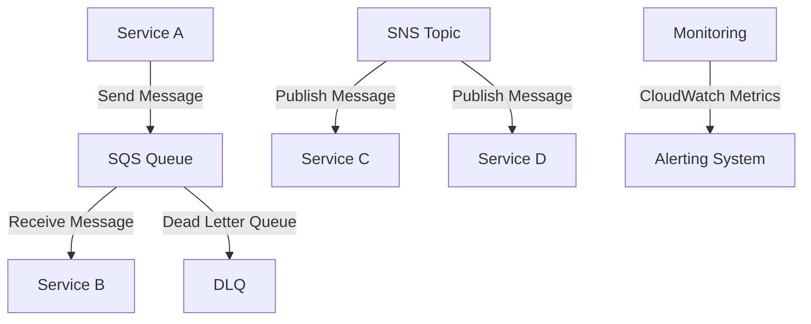

# SQS and SNS Messaging — AWS

## Overview and scope

The purpose of this document is to establish standards and best practices for implementing Amazon Simple Queue Service (SQS) and Amazon Simple Notification Service (SNS) within the Xentic infrastructure. This standard aims to ensure consistent messaging patterns, enhance system reliability, and improve maintainability across various services.

### Audience

This document is intended for:

- Software Engineers
- DevOps Engineers
- System Architects
- Technical Leads

### Scope

This standard covers:

- Configuration and usage of SQS and SNS
- Best practices for message handling
- Error handling strategies
- Security considerations
- Monitoring and logging requirements

### Non-goals

This document does NOT cover:

- Detailed AWS account management
- General AWS service usage outside of SQS and SNS
- Frontend or user interface considerations

### Glossary

| Term          | Definition                                                                 |
|---------------|-----------------------------------------------------------------------------|
| SQS           | Amazon Simple Queue Service, a fully managed message queuing service.      |
| SNS           | Amazon Simple Notification Service, a fully managed pub/sub messaging service. |
| Message       | A unit of data sent between services using SQS or SNS.                     |
| Queue         | A temporary storage for messages in SQS.                                   |
| Topic         | A communication channel in SNS to which subscribers can subscribe.         |
| Subscriber    | An endpoint that receives messages from an SNS topic.                      |

### How This Standard Fits the Xentic Platform

At Xentic, we leverage SQS and SNS to facilitate decoupled communication between microservices. By adhering to this standard, we ensure that our messaging architecture is robust, scalable, and aligned with our overall platform strategy. This standard integrates seamlessly with our existing services, which follow the Java base package structure of `com.xentic.<service>`, ensuring that all messaging implementations are easily identifiable and maintainable.

### Configuration Examples

#### SQS Configuration (YAML)

```yaml
sqs:
  queueName: my-service-queue
  visibilityTimeout: 30
  messageRetentionPeriod: 86400
```

#### SNS Configuration (YAML)

```yaml
sns:
  topicName: my-service-topic
  displayName: My Service Notifications
  subscription:
    - protocol: email
      endpoint: notifications@xentic.io
```

By following these guidelines, teams will be equipped to implement SQS and SNS effectively, ensuring a consistent and reliable messaging framework across the Xentic platform.

## Standards and policies

1. **MUST** use the Java base package structure `com.xentic.<service>` for all SQS and SNS related classes and configurations. This ensures consistency and maintainability in the codebase.

2. **MUST NOT** hard-code AWS region or credentials in the application code. Instead, use environment variables or AWS IAM roles to manage credentials securely.

3. **SHOULD** configure SQS queues with a visibility timeout that is appropriate for the expected processing time of messages. The default value is 30 seconds, but it should be adjusted based on service requirements.

4. **MUST** enable dead-letter queues (DLQs) for all SQS queues to handle message processing failures. This allows for better error handling and message recovery.

   Example configuration for a DLQ in YAML:
   ```yaml
   sqs:
     queueName: my-service-queue
     deadLetterQueue:
       queueName: my-service-dlq
       maxReceiveCount: 5
   ```

5. **SHOULD** use SNS topics to publish messages that need to be consumed by multiple services. This promotes loose coupling and scalability.

6. **MUST NOT** use SNS for messages that require guaranteed delivery. Instead, use SQS for such use cases, as SNS does not guarantee message delivery.

7. **MUST** implement message encryption in transit and at rest for both SQS and SNS. Use AWS KMS for managing encryption keys.

8. **SHOULD** use message attributes in SQS and SNS to provide additional metadata about the message, which can be useful for filtering and routing.

   Example of setting message attributes in Java:
   ```java
   Map<String, MessageAttributeValue> messageAttributes = new HashMap<>();
   messageAttributes.put("AttributeKey", new MessageAttributeValue()
       .withDataType("String")
       .withStringValue("AttributeValue"));

   SendMessageRequest sendMsgRequest = new SendMessageRequest()
       .withQueueUrl(queueUrl)
       .withMessageBody("message body")
       .withMessageAttributes(messageAttributes);
   ```

9. **MUST** implement retries and backoff strategies for message processing failures. This can be configured using AWS SDK or custom logic in the service.

10. **SHOULD** monitor SQS and SNS metrics using Amazon CloudWatch to track message processing, delivery success rates, and error rates.

11. **MUST NOT** exceed the maximum message size limits for SQS (256 KB) and SNS (256 KB for messages published to a topic). If larger messages are required, consider using Amazon S3 to store the payload and send a reference in the message.

12. **SHOULD** document all SQS and SNS configurations in the service's README or relevant documentation to ensure clarity for future developers.

13. **MUST** handle message deduplication for FIFO (First-In-First-Out) queues by using the `MessageDeduplicationId` property to prevent processing the same message multiple times.

14. **SHOULD** implement logging for all message send and receive operations to facilitate troubleshooting and auditing.

15. **MUST NOT** assume message order in standard SQS queues. If message order is critical, use FIFO queues instead.

16. **MUST** validate message content before processing to ensure it meets the expected schema or format, preventing downstream errors.

17. **SHOULD** implement a monitoring dashboard that visualizes SQS and SNS metrics, alerts, and error rates for better observability.

By adhering to these standards and policies, Xentic teams will ensure that their use of SQS and SNS is efficient, secure, and aligned with best practices, ultimately leading to a more resilient architecture.

## Architecture and design

The architecture for SQS and SNS messaging at Xentic is designed to facilitate reliable, decoupled communication between microservices. The following component diagram illustrates the key components and their interactions.



### Data Flows

1. **Service A** sends messages to an **SQS Queue**.
2. **Service B** processes messages from the **SQS Queue**. If processing fails, the message is sent to a **Dead Letter Queue (DLQ)**.
3. **Service C** and **Service D** subscribe to an **SNS Topic** to receive notifications or messages published by other services.
4. Monitoring tools track metrics and alert the team on failures or performance issues.

### Integration Points

- **SQS** is integrated with services that require guaranteed message delivery and processing.
- **SNS** is used for broadcasting messages to multiple subscribers, promoting a pub/sub model.
- Both services are monitored using **Amazon CloudWatch** for metrics like message count, processing time, and error rates.

### Failure Domains

- **SQS Queue Failures**: If a message fails to be processed after a defined number of retries, it is moved to the **DLQ** for further analysis.
- **SNS Delivery Failures**: If a subscriber fails to receive a message, SNS will attempt to resend based on the configured retry policy. If the maximum retry attempts are reached, the message will be dropped unless configured otherwise.
- **Monitoring Failures**: If metrics are not being reported correctly, alerts may not trigger, leading to undetected issues. A robust monitoring strategy is essential.

### Configuration Examples

#### SQS Queue Configuration (HCL)

```hcl
resource "aws_sqs_queue" "my_service_queue" {
  name                      = "my-service-queue"
  visibility_timeout_seconds = 30
  message_retention_seconds = 86400

  redrive_policy = jsonencode({
    deadLetterTargetArn = aws_sqs_queue.my_service_dlq.arn
    maxReceiveCount     = 5
  })
}

resource "aws_sqs_queue" "my_service_dlq" {
  name = "my-service-dlq"
}
```

#### SNS Topic Configuration (HCL)

```hcl
resource "aws_sns_topic" "my_service_topic" {
  name = "my-service-topic"
}

resource "aws_sns_topic_subscription" "email_subscription" {
  topic_arn = aws_sns_topic.my_service_topic.arn
  protocol  = "email"
  endpoint  = "notifications@xentic.io"
}
```

### Best Practices

- **MUST** ensure that all services interacting with SQS and SNS are properly authenticated using AWS IAM roles.
- **SHOULD** implement a circuit breaker pattern in services that consume messages to prevent cascading failures.
- **MUST NOT** rely solely on SNS for critical message delivery; use SQS for messages that require guaranteed processing.
- **SHOULD** leverage message filtering in SNS to reduce unnecessary processing in subscriber services.

By adhering to these architectural guidelines and design principles, Xentic can ensure a robust and scalable messaging infrastructure that meets the demands of its microservices architecture.

### Configuration reference

#### Application Configuration (YAML)

```yaml
aws:
  region: us-east-1
  sqs:
    queueName: my-service-queue
    visibilityTimeout: 30
    messageRetentionPeriod: 86400
    deadLetterQueue:
      queueName: my-service-dlq
      maxReceiveCount: 5
  sns:
    topicName: my-service-topic
    displayName: My Service Notifications
    subscription:
      - protocol: email
        endpoint: notifications@xentic.io
```

#### Terraform Configuration (HCL)

| Resource Type      | Configuration                                     | Default Value            | Production Value        |
|--------------------|--------------------------------------------------|--------------------------|--------------------------|
| `aws_sqs_queue`    | `name`                                           | `my-service-queue`      | `my-service-queue`      |
|                    | `visibility_timeout_seconds`                     | `30`                     | `30`                     |
|                    | `message_retention_seconds`                      | `86400`                  | `86400`                  |
|                    | `redrive_policy`                                 | N/A                      | See below                |
| `aws_sqs_queue`    | `name` (DLQ)                                    | `my-service-dlq`        | `my-service-dlq`        |
| `aws_sns_topic`    | `name`                                          | `my-service-topic`      | `my-service-topic`      |
| `aws_sns_topic_subscription` | `topic_arn`                        | N/A                      | `aws_sns_topic.my_service_topic.arn` |
|                    | `protocol`                                      | `email`                  | `email`                  |
|                    | `endpoint`                                      | `notifications@xentic.io` | `notifications@xentic.io` |

#### Environment Variables

| Variable Name                       | Default Value            | Production Value        |
|-------------------------------------|--------------------------|--------------------------|
| `AWS_REGION`                        | `us-east-1`              | `us-east-1`              |
| `SQS_QUEUE_NAME`                   | `my-service-queue`      | `my-service-queue`      |
| `SQS_DLQ_NAME`                     | `my-service-dlq`        | `my-service-dlq`        |
| `SNS_TOPIC_NAME`                   | `my-service-topic`      | `my-service-topic`      |
| `SNS_SUBSCRIPTION_EMAIL`           | `notifications@xentic.io` | `notifications@xentic.io` |

### Additional Configuration Notes

- **MUST** ensure that the AWS region specified in the configuration matches the region where your resources are deployed.
- **MUST NOT** use hard-coded credentials in any configuration files. Use IAM roles or environment variables to manage credentials securely.
- **SHOULD** validate all configurations before deploying to production to prevent misconfigurations that could lead to service outages.
- **MUST** document any changes made to configurations in the service's README or internal documentation to maintain clarity for future developers.

By following the above configuration references, teams at Xentic will ensure a consistent and reliable setup for SQS and SNS messaging across all services.

## Implementation guide

To implement AWS SQS and SNS messaging in your service at Xentic, follow the step-by-step guide below. This guide provides a comprehensive approach, including code examples and configuration details.

### Step 1: Set Up AWS Credentials

Ensure that your AWS credentials are configured properly. You can use the AWS CLI to configure them:

```bash
aws configure
```

You will need to provide your AWS Access Key, Secret Key, region, and output format.

### Step 2: Create SQS Queue and SNS Topic

Use the following Terraform code to create an SQS queue and an SNS topic along with a subscription.

```hcl
resource "aws_sqs_queue" "my_service_queue" {
  name                      = "my-service-queue"
  visibility_timeout_seconds = 30
  message_retention_seconds = 86400

  redrive_policy = jsonencode({
    deadLetterTargetArn = aws_sqs_queue.my_service_dlq.arn
    maxReceiveCount     = 5
  })
}

resource "aws_sqs_queue" "my_service_dlq" {
  name = "my-service-dlq"
}

resource "aws_sns_topic" "my_service_topic" {
  name = "my-service-topic"
}

resource "aws_sns_topic_subscription" "email_subscription" {
  topic_arn = aws_sns_topic.my_service_topic.arn
  protocol  = "email"
  endpoint  = "notifications@xentic.io"
}
```

### Step 3: Implement SQS Producer

Create a Java class to send messages to the SQS queue.

```java
package com.xentic.myservice;

import com.amazonaws.services.sqs.AmazonSQS;
import com.amazonaws.services.sqs.AmazonSQSClientBuilder;
import com.amazonaws.services.sqs.model.SendMessageRequest;

public class SQSProducer {

    private final AmazonSQS sqs;
    private final String queueUrl;

    public SQSProducer(String queueUrl) {
        this.sqs = AmazonSQSClientBuilder.defaultClient();
        this.queueUrl = queueUrl;
    }

    public void sendMessage(String message) {
        SendMessageRequest sendMessageRequest = new SendMessageRequest(queueUrl, message);
        sqs.sendMessage(sendMessageRequest);
    }
}
```

### Step 4: Implement SQS Consumer

Create a Java class to receive messages from the SQS queue.

```java
package com.xentic.myservice;

import com.amazonaws.services.sqs.AmazonSQS;
import com.amazonaws.services.sqs.AmazonSQSClientBuilder;
import com.amazonaws.services.sqs.model.ReceiveMessageRequest;
import com.amazonaws.services.sqs.model.Message;

import java.util.List;

public class SQSConsumer {

    private final AmazonSQS sqs;
    private final String queueUrl;

    public SQSConsumer(String queueUrl) {
        this.sqs = AmazonSQSClientBuilder.defaultClient();
        this.queueUrl = queueUrl;
    }

    public void receiveMessages() {
        ReceiveMessageRequest receiveMessageRequest = new ReceiveMessageRequest(queueUrl)
                .withMaxNumberOfMessages(10)
                .withWaitTimeSeconds(20);
        
        List<Message> messages = sqs.receiveMessage(receiveMessageRequest).getMessages();
        for (Message message : messages) {
            processMessage(message);
            // Delete message after processing
            sqs.deleteMessage(queueUrl, message.getReceiptHandle());
        }
    }

    private void processMessage(Message message) {
        // Implement your message processing logic here
        System.out.println("Received message: " + message.getBody());
    }
}
```

### Step 5: Publish Messages to SNS

Create a Java class to publish messages to the SNS topic.

```java
package com.xentic.myservice;

import com.amazonaws.services.sns.AmazonSNS;
import com.amazonaws.services.sns.AmazonSNSClientBuilder;
import com.amazonaws.services.sns.model.PublishRequest;

public class SNSPublisher {

    private final AmazonSNS sns;
    private final String topicArn;

    public SNSPublisher(String topicArn) {
        this.sns = AmazonSNSClientBuilder.defaultClient();
        this.topicArn = topicArn;
    }

    public void publishMessage(String message) {
        PublishRequest publishRequest = new PublishRequest(topicArn, message);
        sns.publish(publishRequest);
    }
}
```

### Step 6: Integration Example

Here’s how you can integrate the producer and consumer in your service.

```java
package com.xentic.myservice;

public class MessagingService {

    private final SQSProducer sqsProducer;
    private final SQSConsumer sqsConsumer;
    private final SNSPublisher snsPublisher;

    public MessagingService(String sqsQueueUrl, String snsTopicArn) {
        this.sqsProducer = new SQSProducer(sqsQueueUrl);
        this.sqsConsumer = new SQSConsumer(sqsQueueUrl);
        this.snsPublisher = new SNSPublisher(snsTopicArn);
    }

    public void run() {
        // Send a message to SQS
        sqsProducer.sendMessage("Hello from SQS");

        // Publish a message to SNS
        snsPublisher.publishMessage("Hello from SNS");

        // Start receiving messages
        sqsConsumer.receiveMessages();
    }
}
```

### Step 7: Configuration

Ensure that your application configuration (YAML) includes the necessary details for SQS and SNS.

```yaml
aws:
  region: us-east-1
  sqs:
    queueUrl: https://sqs.us-east-1.amazonaws.com/123456789012/my-service-queue
  sns:
    topicArn: arn:aws:sns:us-east-1:123456789012:my-service-topic
```

### Conclusion

By following these steps, you will have a fully functional implementation of AWS SQS and SNS messaging within your service at Xentic. Ensure that you adhere to the guidelines and best practices outlined in the previous sections for optimal performance and reliability.

## Security requirements

To ensure the security of SQS and SNS messaging at Xentic, the following requirements must be adhered to:

### Threat Model Summary

- **Data Exposure**: Messages in transit and at rest must be protected to prevent unauthorized access.
- **Denial of Service**: Services must be resilient against message flooding and other attack vectors.
- **Integrity**: Messages must be verified to ensure they have not been tampered with during transit.

### Authentication and Authorization

- **MUST** use AWS IAM roles to manage permissions for accessing SQS and SNS resources.
- **MUST NOT** hard-code AWS credentials in the application code or configuration files.
- **SHOULD** implement fine-grained access control using IAM policies to restrict access to only necessary actions.

Example IAM Policy for SQS and SNS:

```json
{
  "Version": "2012-10-17",
  "Statement": [
    {
      "Effect": "Allow",
      "Action": [
        "sqs:SendMessage",
        "sqs:ReceiveMessage",
        "sqs:DeleteMessage",
        "sns:Publish"
      ],
      "Resource": [
        "arn:aws:sqs:us-east-1:123456789012:my-service-queue",
        "arn:aws:sns:us-east-1:123456789012:my-service-topic"
      ]
    }
  ]
}
```

### Secrets Management

- **MUST** use AWS Secrets Manager or AWS Systems Manager Parameter Store to manage sensitive configuration data.
- **MUST NOT** store secrets in version control systems or in plaintext within application code.
- **SHOULD** rotate secrets regularly and update the application configuration accordingly.

Example of using AWS Secrets Manager in a Java application:

```java
import com.amazonaws.services.secretsmanager.AWSSecretsManager;
import com.amazonaws.services.secretsmanager.AWSSecretsManagerClientBuilder;
import com.amazonaws.services.secretsmanager.model.GetSecretValueRequest;

public class SecretsManager {

    public String getSecret(String secretName) {
        AWSSecretsManager client = AWSSecretsManagerClientBuilder.standard().build();
        GetSecretValueRequest getSecretValueRequest = new GetSecretValueRequest().withSecretId(secretName);
        return client.getSecretValue(getSecretValueRequest).getSecretString();
    }
}
```

### Input Validation

- **MUST** validate all incoming messages to ensure they conform to expected formats and types.
- **MUST NOT** process messages that do not meet validation criteria, and should log such occurrences for auditing.
- **SHOULD** implement a schema validation mechanism (e.g., JSON Schema) to enforce message structure.

Example of input validation in Java:

```java
import com.fasterxml.jackson.databind.JsonNode;
import com.fasterxml.jackson.databind.ObjectMapper;

public class MessageValidator {

    private final ObjectMapper objectMapper = new ObjectMapper();

    public boolean validate(String message) {
        try {
            JsonNode jsonNode = objectMapper.readTree(message);
            // Perform validation logic here
            return jsonNode.has("requiredField");
        } catch (Exception e) {
            return false;
        }
    }
}
```

### Audit Logging

- **MUST** implement logging for all message send and receive actions, including timestamps and user identities.
- **MUST NOT** log sensitive message content. Instead, log message IDs and metadata.
- **SHOULD** use AWS CloudTrail to monitor and log API calls made to SQS and SNS.

Example of logging in Java:

```java
import org.slf4j.Logger;
import org.slf4j.LoggerFactory;

public class MessagingLogger {

    private static final Logger logger = LoggerFactory.getLogger(MessagingLogger.class);

    public void logMessageSent(String messageId) {
        logger.info("Message sent with ID: {}", messageId);
    }

    public void logMessageReceived(String messageId) {
        logger.info("Message received with ID: {}", messageId);
    }
}
```

By adhering to these security requirements, Xentic will ensure a robust and secure messaging system using AWS SQS and SNS. Each team must regularly review and update their security practices to address emerging threats and vulnerabilities.

## Testing strategy

To ensure the reliability and correctness of the SQS and SNS messaging implementation at Xentic, a comprehensive testing strategy must be adopted. This strategy includes unit tests, integration tests, and contract tests, each serving a distinct purpose in the testing lifecycle.

### Unit Tests

Unit tests should focus on testing individual components in isolation. Each class responsible for SQS and SNS operations must have corresponding unit tests to verify their behavior.

- **Coverage Target**: Aim for at least 80% code coverage for all messaging classes.
- **Testing Framework**: Use JUnit 5 and Mockito for mocking dependencies.

Example unit test for `SQSProducer`:

```java
package com.xentic.myservice;

import com.amazonaws.services.sqs.AmazonSQS;
import com.amazonaws.services.sqs.model.SendMessageRequest;
import org.junit.jupiter.api.Test;
import org.mockito.Mockito;

import static org.mockito.Mockito.verify;

public class SQSProducerTest {

    @Test
    public void testSendMessage() {
        AmazonSQS sqsMock = Mockito.mock(AmazonSQS.class);
        SQSProducer producer = new SQSProducer("mockQueueUrl");
        producer.setSqs(sqsMock); // Assuming a setter for testing

        producer.sendMessage("Test Message");

        verify(sqsMock).sendMessage(new SendMessageRequest("mockQueueUrl", "Test Message"));
    }
}
```

### Integration Tests

Integration tests are essential for verifying the interaction between components and external systems. These tests should be run in an environment that closely resembles production.

- **Coverage Target**: Aim for 70% coverage on integration scenarios.
- **Testing Framework**: Use Spring Boot Test with embedded AWS services or localstack for integration testing.

Example integration test for `MessagingService`:

```java
package com.xentic.myservice;

import org.junit.jupiter.api.Test;
import org.springframework.boot.test.context.SpringBootTest;

@SpringBootTest
public class MessagingServiceIntegrationTest {

    @Test
    public void testMessagingFlow() {
        MessagingService messagingService = new MessagingService("mockQueueUrl", "mockTopicArn");
        messagingService.run();

        // Assertions to verify message was sent and received correctly
        // This would typically involve checking a mock or a localstack instance
    }
}
```

### Contract Tests

Contract tests ensure that the interaction between services adheres to agreed-upon contracts. This is particularly important when services communicate over APIs or messaging systems.

- **Coverage Target**: All public APIs and message formats must be covered.
- **Testing Framework**: Use Pact or Spring Cloud Contract for defining and verifying contracts.

Example contract test for SNS message format:

```java
package com.xentic.myservice;

import au.com.dius.pact.consumer.junit5.PactConsumerTestExt;
import org.junit.jupiter.api.Test;
import org.junit.jupiter.api.extension.ExtendWith;

@ExtendWith(PactConsumerTestExt.class)
public class SNSPublisherContractTest {

    @Test
    void testPublishMessageContract() {
        // Define the expected message format and behavior
        // Use Pact DSL to define the interaction
    }
}
```

### Summary of Testing Strategy

| Test Type         | Purpose                                     | Coverage Target | Frameworks                          |
|-------------------|---------------------------------------------|------------------|-------------------------------------|
| Unit Tests        | Test individual components in isolation     | 80%              | JUnit 5, Mockito                    |
| Integration Tests | Verify interaction between components        | 70%              | Spring Boot Test, Localstack        |
| Contract Tests    | Ensure adherence to agreed contracts        | 100%             | Pact, Spring Cloud Contract         |

### Best Practices

- **MUST** run all tests in a CI/CD pipeline to ensure code quality.
- **SHOULD** mock external dependencies in unit tests to isolate functionality.
- **MUST NOT** skip tests for critical components, especially those interacting with AWS services.
- **SHOULD** maintain clear and descriptive test names to enhance readability and maintainability.

By implementing this comprehensive testing strategy, Xentic can ensure the robustness and reliability of its SQS and SNS messaging systems, minimizing the risk of failures in production environments.

## Observability and operations

To ensure effective observability and operations for AWS SQS and SNS messaging at Xentic, the following practices MUST be implemented. This includes metrics collection, logging, tracing, dashboard creation, alerting, and defining service-level objectives (SLOs).

### Metrics

- **MUST** collect key metrics related to SQS and SNS usage, including:
  - Message count (sent, received, deleted)
  - Message processing time
  - Queue depth (number of messages in the queue)
  - Error rates (failed message deliveries)
  
Example Prometheus metrics configuration:

```yaml
metrics:
  enabled: true
  service:
    name: sqs-sns-metrics
  endpoints:
    - path: /metrics
      port: 8080
```

### Logging

- **MUST** implement structured logging for all message operations.
- **MUST NOT** log sensitive information, such as message content.
- **SHOULD** use a centralized logging solution (e.g., AWS CloudWatch Logs) to aggregate logs from all services.

Example logging configuration in `logback.xml`:

```xml
<configuration>
    <appender name="CLOUDWATCH" class="com.xentic.logging.CloudWatchAppender">
        <logGroupName>xentic-sqs-sns-logs</logGroupName>
        <logStreamName>application-log</logStreamName>
        <layout class="ch.qos.logback.classic.PatternLayout">
            <pattern>%d{yyyy-MM-dd HH:mm:ss} %-5level [%thread] %logger{36} - %msg%n</pattern>
        </layout>
    </appender>
    
    <root level="INFO">
        <appender-ref ref="CLOUDWATCH" />
    </root>
</configuration>
```

### Tracing

- **MUST** implement distributed tracing to monitor message flows across services.
- **SHOULD** use AWS X-Ray or OpenTelemetry for tracing requests through SQS and SNS.

Example OpenTelemetry configuration:

```yaml
otel:
  service:
    name: my-service
  traces:
    exporter:
      otlp:
        endpoint: "http://otel-collector:4317"
```

### Dashboards

- **MUST** create dashboards to visualize key metrics and logs.
- **SHOULD** use tools like Grafana or AWS CloudWatch Dashboards for real-time monitoring.

Example Grafana dashboard panel configuration:

```json
{
  "type": "graph",
  "title": "SQS Message Count",
  "targets": [
    {
      "target": "aws_sqs_messages_sent_total",
      "refId": "A",
      "format": "time_series"
    }
  ],
  "xaxis": {
    "mode": "time"
  },
  "yaxis": {
    "format": "short"
  }
}
```

### Alerts

- **MUST** set up alerts for critical metrics, such as:
  - High queue depth
  - Increased error rates
  - Latency spikes in message processing

Example alert configuration in Prometheus:

```yaml
groups:
  - name: sqs-alerts
    rules:
      - alert: HighQueueDepth
        expr: sqs_queue_depth > 100
        for: 5m
        labels:
          severity: critical
        annotations:
          summary: "High SQS Queue Depth"
          description: "The queue depth has exceeded 100 messages."
```

### Service Level Objectives (SLOs)

- **MUST** define SLOs for message processing, including:
  - 99.9% of messages processed within 1 second
  - 95% of messages delivered without error

Example SLO tracking:

```yaml
slo:
  message_processing:
    target: 99.9
    duration: 1s
  message_delivery:
    target: 95
    error_rate: 0.05
```

### On-call Runbook Steps

In the event of an incident related to SQS and SNS messaging, the following on-call runbook steps MUST be followed:

1. **Identify the Issue**:
   - Check the monitoring dashboard for alerts and anomalies.
   - Review logs for error messages related to SQS and SNS.

2. **Assess Impact**:
   - Determine the scope of the issue (e.g., affected services, number of impacted users).
   - Communicate with stakeholders regarding the status.

3. **Mitigate the Problem**:
   - If the queue depth is high, investigate the consumer application to ensure it is processing messages.
   - If there are delivery errors, check the SNS topic subscriptions and permissions.

4. **Fix the Root Cause**:
   - Implement necessary code fixes or configuration changes.
   - Test the changes in a staging environment before deploying to production.

5. **Document the Incident**:
   - Record the incident details, including the root cause and resolution steps.
   - Update the runbook with any new findings or improvements.

By following these observability and operational guidelines, Xentic can maintain a reliable and efficient messaging system using AWS SQS and SNS, ensuring high availability and performance for its services.

## Migration and versioning

When managing AWS SQS and SNS messaging within Xentic, a clear migration and versioning strategy is essential to ensure smooth transitions between versions and to maintain backward compatibility. The following guidelines MUST be adhered to:

### Upgrade Paths

- **MUST** define clear upgrade paths for all services utilizing SQS and SNS. This includes:
  - Documenting changes in major, minor, and patch versions.
  - Providing migration scripts or procedures for database changes.
  
| Version | Type    | Description                                   |
|---------|---------|-----------------------------------------------|
| 1.0.0   | Major   | Initial release with basic SQS/SNS integration. |
| 1.1.0   | Minor   | Added support for message attributes.        |
| 1.1.1   | Patch   | Bug fixes related to message delivery.       |

### Deprecation Policy

- **MUST** communicate deprecation of features at least one release cycle in advance.
- **SHOULD** provide alternative solutions or features to replace deprecated functionality.
- **MUST NOT** remove deprecated features without proper migration guidance.

Example deprecation notice in release notes:

```markdown
### Deprecation Notice
The `sendMessageWithDelay` method in the SQSProducer class is deprecated as of version 1.1.0. 
Please use the `sendMessage` method with the `delaySeconds` parameter instead.
```

### Backward Compatibility

- **MUST** ensure that new versions maintain backward compatibility for existing APIs and message formats.
- **SHOULD** implement versioning in message formats to allow consumers to handle different versions gracefully.

Example versioning in message payload:

```json
{
  "version": "1.0",
  "data": {
    "message": "Hello, World!"
  }
}
```

### Rollback Procedures

In case of issues during a deployment, a rollback procedure MUST be in place to revert to a previous stable version. This procedure should include:

1. **Identify the Version**:
   - Determine the last known stable version to revert to.

2. **Rollback Deployment**:
   - Use the deployment tool (e.g., AWS CodeDeploy, Terraform) to rollback to the previous version.

Example rollback command using AWS CLI:

```bash
aws deploy rollback --application-name MyApp --deployment-id <deployment-id>
```

3. **Verify Rollback**:
   - Ensure that the application is functioning as expected after the rollback.
   - Run integration tests to confirm that SQS and SNS messaging is operational.

4. **Document the Rollback**:
   - Record the reason for the rollback and any necessary follow-up actions in the incident log.

### Versioning Strategy

- **MUST** adopt semantic versioning (MAJOR.MINOR.PATCH) for all services.
- **SHOULD** tag releases in the version control system to facilitate tracking.

### Migration Scripts

- **MUST** provide migration scripts for database schema changes related to messaging.
- **SHOULD** include rollback capabilities in migration scripts.

Example migration script in SQL:

```sql
CREATE TABLE messages (
    id SERIAL PRIMARY KEY,
    content TEXT NOT NULL,
    created_at TIMESTAMP DEFAULT CURRENT_TIMESTAMP
);

-- Rollback script
DROP TABLE IF EXISTS messages;
```

By adhering to these migration and versioning guidelines, Xentic can ensure a robust and maintainable messaging infrastructure using AWS SQS and SNS, minimizing disruptions and enhancing the overall reliability of its services.

## FAQ, anti-patterns, and checklists

### FAQ

1. **What is the maximum message size for SQS?**
   - The maximum message size for SQS is 256 KB. Messages larger than this must be stored in S3 and the S3 URL sent through SQS.

2. **How can I ensure message delivery in SNS?**
   - SNS provides at-least-once delivery. To ensure message delivery, implement retries and monitor for failed deliveries.

3. **What are the costs associated with using SQS and SNS?**
   - Costs are based on the number of requests, data transfer, and additional features like message retention. Refer to the [AWS Pricing page](https://aws.amazon.com/sqs/pricing/) for details.

4. **Can I use SQS with multiple consumers?**
   - Yes, SQS supports multiple consumers. However, be aware of the potential for message duplication and ensure idempotency in processing.

5. **What happens to messages that are not processed?**
   - Unprocessed messages remain in the queue until they are either processed or reach the visibility timeout. After the timeout, they become visible again.

6. **How can I handle message failures?**
   - Implement a dead-letter queue (DLQ) to capture messages that fail processing after a specified number of attempts.

7. **Is SNS synchronous or asynchronous?**
   - SNS is an asynchronous messaging service. It allows for the decoupling of message producers and consumers.

8. **How do I monitor SQS and SNS?**
   - Use AWS CloudWatch to monitor metrics such as message count, error rates, and queue depth. Set up alerts based on these metrics.

9. **What is the difference between SQS and SNS?**
   - SQS is a message queue service for decoupled communication between distributed components, while SNS is a pub/sub messaging service for sending messages to multiple subscribers.

10. **How can I secure my SQS and SNS resources?**
    - Use IAM policies to control access, enable encryption for messages in transit and at rest, and implement VPC endpoints for private access.

### Anti-patterns

| Anti-pattern                          | Description                                                                 |
|---------------------------------------|-----------------------------------------------------------------------------|
| **Ignoring message visibility timeout** | Failing to set or monitor visibility timeout can lead to message duplication. |
| **Not using dead-letter queues**      | Not configuring DLQs can result in lost messages that cannot be processed.  |
| **Hardcoding message formats**        | Hardcoding formats makes it difficult to evolve message structures over time.|
| **Single consumer for high load**     | Relying on a single consumer can create bottlenecks; use multiple consumers. |
| **Neglecting error handling**         | Failing to implement error handling can lead to unhandled exceptions and message loss. |
| **Overloading message size**          | Sending large messages can lead to performance issues; use S3 for large payloads. |
| **Not monitoring metrics**            | Ignoring metrics can lead to undetected issues and performance degradation.  |
| **Poorly defined retry logic**        | Implementing inadequate retry logic can result in message loss or delays.   |

### Pre-merge Checklist

- **MUST** ensure all code adheres to Xentic's coding standards.
- **SHOULD** run unit tests with at least 80% code coverage.
- **MUST** validate that all SQS and SNS configurations are included in the deployment scripts.
- **SHOULD** check for proper error handling in message processing logic.
- **MUST** review IAM policies for least privilege access to SQS and SNS resources.
- **SHOULD** verify that all metrics and logging configurations are in place.

### Production Checklist

- **MUST** confirm that all changes have been tested in a staging environment.
- **MUST NOT** deploy without a rollback plan in case of failure.
- **SHOULD** ensure that monitoring and alerting are configured for SQS and SNS.
- **MUST** document any changes made to messaging configurations.
- **SHOULD** communicate deployment schedules to all stakeholders.
- **MUST** perform a post-deployment review to assess the impact and performance of the changes.
