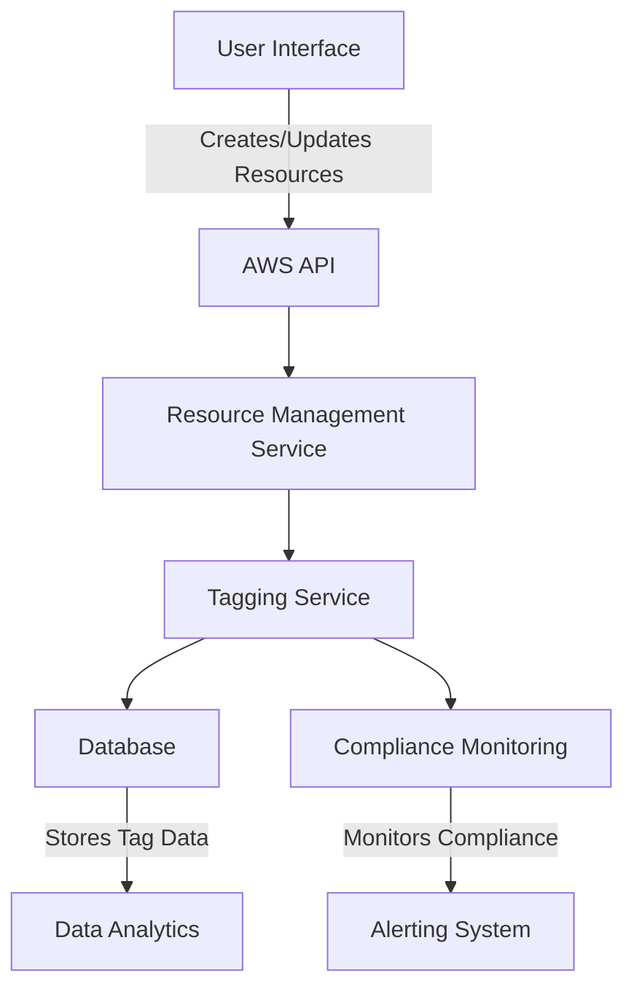

# Resource Tagging Standards — AWS

## Overview and scope

The purpose of this document is to establish the standards and guidelines for resource tagging within Amazon Web Services (AWS) at Xentic. Effective resource tagging is crucial for managing, monitoring, and optimizing cloud resources, ensuring compliance, and facilitating cost allocation.

### Audience

This document is intended for:
- Cloud Engineers
- DevOps Teams
- Infrastructure Architects
- Project Managers
- Compliance Officers

### Scope

This standard applies to all AWS resources utilized by Xentic, including but not limited to:
- EC2 Instances
- S3 Buckets
- RDS Databases
- Lambda Functions
- VPCs
- IAM Roles and Policies

### Non-goals

This document does not cover:
- Specific implementation details for individual AWS services
- Tagging strategies for non-AWS resources
- Resource management practices outside of tagging

### Glossary

| Term         | Definition                                                                 |
|--------------|-----------------------------------------------------------------------------|
| Tag          | A key-value pair used to categorize AWS resources.                        |
| Resource     | Any AWS service or component that can be tagged.                          |
| Cost Center  | A unit within Xentic that incurs costs and requires budget monitoring.    |
| Environment  | The context in which a resource operates, e.g., Development, Testing, Production. |

### How this Standard Fits the Xentic Platform

The resource tagging standards are integral to the Xentic platform, as they:
- Enable efficient resource management and cost allocation.
- Support compliance and governance requirements.
- Facilitate automation and orchestration processes.

### Tagging Standards

All AWS resources MUST be tagged according to the following schema:

```yaml
tags:
  Environment: <environment> # e.g., Development, Testing, Production
  Project: <project-name>     # e.g., Project Alpha
  CostCenter: <cost-center>   # e.g., CC-1234
  Owner: <owner-email>        # e.g., owner@xentic.io
  Application: <app-name>     # e.g., MyApp
```

### Example Tagging Implementation

When creating an EC2 instance, the following AWS CLI command MUST be used to apply the tags:

```bash
aws ec2 run-instances --image-id ami-12345678 --count 1 --instance-type t2.micro --tag-specifications 'ResourceType=instance,Tags=[{Key=Environment,Value=Development},{Key=Project,Value=Project Alpha},{Key=CostCenter,Value=CC-1234},{Key=Owner,Value=owner@xentic.io},{Key=Application,Value=MyApp}]'
```

By adhering to these standards, Xentic can ensure that all AWS resources are consistently tagged, leading to improved visibility, accountability, and efficiency in cloud resource management.

## Standards and policies

1. **MUST** tag all AWS resources using the defined schema outlined in the Tagging Standards section. This ensures uniformity and consistency across all resources.

2. **MUST NOT** use tags that exceed 128 characters for both keys and values. This limitation is enforced by AWS and must be adhered to for compatibility.

3. **MUST** include the following mandatory tags for every AWS resource:
   - `Environment`
   - `Project`
   - `CostCenter`
   - `Owner`
   - `Application`

4. **SHOULD** use lowercase letters for tag keys and values to maintain consistency and avoid case sensitivity issues. For example:
   ```yaml
   tags:
     environment: development
     project: project-alpha
     costcenter: cc-1234
     owner: owner@xentic.io
     application: myapp
   ```

5. **MUST NOT** use spaces in tag keys or values. Instead, use hyphens or underscores to separate words. For example:
   ```yaml
   tags:
     project_name: project-alpha
     cost-center: cc-1234
   ```

6. **SHOULD** use a standardized format for `Owner` email addresses, specifically in the format `<name>@xentic.io`. This facilitates easier identification of resource ownership.

7. **MUST** ensure that all tag values are meaningful and relevant to the resource. Generic or vague values like "test" or "temp" are not acceptable.

8. **MUST NOT** change or delete existing tags without proper justification and approval from the resource owner and the Cloud Governance team.

9. **SHOULD** implement automated tagging mechanisms where possible, such as AWS Lambda functions or AWS CloudFormation templates, to enforce tagging policies consistently across resource deployments.

10. **MUST** regularly audit AWS resources for compliance with tagging standards. Audits should be conducted at least quarterly and documented in a shared repository.

11. **SHOULD** utilize AWS Cost Explorer to analyze costs associated with tagged resources. This practice helps in understanding resource utilization and budget allocation.

12. **MUST** document any exceptions to the tagging policy in the project repository, including the reason for the exception and the approval from relevant stakeholders.

13. **SHOULD** educate all team members on the importance of resource tagging and the implications of non-compliance. Regular training sessions should be scheduled.

14. **MUST** use the AWS Resource Groups Tagging API to manage and organize resources based on tags. This API provides enhanced visibility and management capabilities.

15. **MUST NOT** create tags that could lead to confusion or conflict with existing tags. A tag naming convention should be established and communicated across teams.

16. **SHOULD** review and update tagging policies annually to ensure they remain relevant and effective as the organization and technology evolve.

By adhering to these standards and policies, Xentic can maintain a well-organized and efficient cloud infrastructure, enabling better resource management, cost control, and compliance.

## Architecture and design

The architecture for resource tagging in AWS at Xentic is designed to ensure that all resources are easily identifiable, manageable, and compliant with organizational standards. Below is a component diagram that illustrates the key components involved in the tagging process.



### Data Flows

1. **Resource Creation**: When a user creates or updates an AWS resource through the User Interface, the request is sent to the AWS API.
2. **Tagging Process**: The Resource Management Service interacts with the Tagging Service to apply the necessary tags based on the defined schema.
3. **Data Storage**: The Tagging Service stores the tag data in a centralized database for easy retrieval and management.
4. **Compliance Monitoring**: The Compliance Monitoring component regularly checks for adherence to tagging standards and generates alerts if discrepancies are found.
5. **Data Analytics**: Tag data is analyzed to provide insights into resource utilization and cost allocation.

### Integration Points

- **AWS API**: All resource interactions occur through the AWS API, which is the primary integration point for creating, updating, and deleting resources.
- **Tagging Service**: This service is responsible for applying and managing tags on AWS resources. It must be integrated with the Resource Management Service.
- **Compliance Monitoring**: This component must integrate with the Tagging Service to ensure that all resources are compliant with tagging standards.
- **Alerting System**: An alerting mechanism should be in place to notify stakeholders of any compliance issues related to tagging.

### Failure Domains

1. **Tagging Service Failure**: If the Tagging Service fails, resources may be created without the necessary tags, leading to compliance issues. A fallback mechanism should be implemented to retry tagging operations.
   
2. **Database Failure**: If the database storing tag data becomes unavailable, it may hinder the ability to retrieve or manage tags. This should be mitigated by implementing database replication and backup strategies.

3. **Compliance Monitoring Failure**: If compliance checks fail, resources may go unmonitored, leading to potential non-compliance. Regular health checks and alerts should be established to ensure the compliance monitoring system is operational.

4. **User Interface Failure**: If the User Interface fails, users may be unable to create or manage resources effectively. This can be mitigated by providing a command-line interface (CLI) as an alternative.

### Example Configuration

Here is an example of how to configure a tagging policy using AWS CloudFormation:

```yaml
Resources:
  MyEC2Instance:
    Type: AWS::EC2::Instance
    Properties:
      ImageId: ami-12345678
      InstanceType: t2.micro
      Tags:
        - Key: Environment
          Value: Development
        - Key: Project
          Value: Project Alpha
        - Key: CostCenter
          Value: CC-1234
        - Key: Owner
          Value: owner@xentic.io
        - Key: Application
          Value: MyApp
```

By following these architectural guidelines, Xentic will ensure that resource tagging is consistent, efficient, and compliant across all AWS services, thereby enhancing overall cloud resource management.

## Configuration reference

### Application Configuration (application.yml)

The following is an example of how to configure tagging in an application using YAML format:

```yaml
aws:
  tags:
    Environment: Development
    Project: Project Alpha
    CostCenter: CC-1234
    Owner: owner@xentic.io
    Application: MyApp
```

### Terraform Configuration

When using Terraform to provision AWS resources, the following example demonstrates how to apply the required tags:

```hcl
resource "aws_instance" "example" {
  ami           = "ami-12345678"
  instance_type = "t2.micro"

  tags = {
    Environment = "Development"
    Project     = "Project Alpha"
    CostCenter  = "CC-1234"
    Owner       = "owner@xentic.io"
    Application = "MyApp"
  }
}
```

### Environment Variables

For applications that require dynamic configuration, the following environment variables can be set, with defaults and production values:

| Variable                  | Default Value         | Production Value       |
|---------------------------|-----------------------|-------------------------|
| `AWS_TAG_ENVIRONMENT`     | `Development`         | `Production`            |
| `AWS_TAG_PROJECT`         | `Project Alpha`       | `Project Beta`          |
| `AWS_TAG_COSTCENTER`      | `CC-1234`             | `CC-5678`               |
| `AWS_TAG_OWNER`           | `owner@xentic.io`     | `owner@xentic.io`       |
| `AWS_TAG_APPLICATION`      | `MyApp`               | `MyAppProd`             |

### SQL Example for Tagging Compliance

To ensure compliance with tagging standards, the following SQL query can be used to audit resources:

```sql
SELECT resource_id, environment, project, cost_center, owner, application
FROM aws_resources
WHERE environment IS NULL OR project IS NULL OR cost_center IS NULL OR owner IS NULL OR application IS NULL;
```

This query retrieves all resources that are missing any of the mandatory tags, allowing for corrective actions to be taken.

### Summary of Configuration

- **Application Configuration**: Use `application.yml` for static tagging configurations.
- **Terraform**: Apply tags directly in resource definitions to ensure compliance during provisioning.
- **Environment Variables**: Utilize environment variables for dynamic configurations, with clear defaults and production values.
- **SQL Auditing**: Implement SQL queries to regularly check for compliance with tagging standards.

By following these configuration guidelines, Xentic can ensure that all AWS resources are appropriately tagged, facilitating better resource management and compliance across the organization.

## Implementation guide

To implement the resource tagging standards in AWS at Xentic, follow these step-by-step instructions. This guide includes code examples for various programming languages and tools, ensuring a comprehensive approach to tagging.

### Step 1: Define Tagging Schema

Before implementing tagging, define the tagging schema that includes mandatory and optional tags. Below is an example of a tagging schema:

| Tag Key        | Description                          | Mandatory |
|----------------|--------------------------------------|-----------|
| `Environment`  | Indicates the environment (e.g., Dev, Prod) | Yes       |
| `Project`      | Name of the project                  | Yes       |
| `CostCenter`   | Cost center identifier                | Yes       |
| `Owner`        | Owner's email address                 | Yes       |
| `Application`  | Name of the application               | Yes       |
| `Team`         | Team responsible for the resource     | No        |

### Step 2: Create AWS Resources with Tags

Utilize AWS CloudFormation to create resources with the defined tags. Below is an example of creating an S3 bucket with tags:

```yaml
Resources:
  MyS3Bucket:
    Type: AWS::S3::Bucket
    Properties:
      BucketName: my-xentic-bucket
      Tags:
        - Key: Environment
          Value: Development
        - Key: Project
          Value: Project Alpha
        - Key: CostCenter
          Value: CC-1234
        - Key: Owner
          Value: owner@xentic.io
        - Key: Application
          Value: MyApp
```

### Step 3: Implement Automated Tagging with Lambda

To enforce tagging policies, implement an AWS Lambda function that automatically tags resources upon creation. Below is a Python example using the AWS SDK (Boto3):

```python
import json
import boto3

def lambda_handler(event, context):
    ec2 = boto3.client('ec2')
    resource_id = event['detail']['instance-id']
    
    tags = [
        {'Key': 'Environment', 'Value': 'Development'},
        {'Key': 'Project', 'Value': 'Project Alpha'},
        {'Key': 'CostCenter', 'Value': 'CC-1234'},
        {'Key': 'Owner', 'Value': 'owner@xentic.io'},
        {'Key': 'Application', 'Value': 'MyApp'}
    ]
    
    ec2.create_tags(Resources=[resource_id], Tags=tags)
    return {
        'statusCode': 200,
        'body': json.dumps('Tags added successfully!')
    }
```

### Step 4: Configure Terraform for Tagging

When provisioning resources with Terraform, ensure that tags are included in the resource definitions. Here’s an example of an EC2 instance with tags:

```hcl
resource "aws_instance" "example" {
  ami           = "ami-12345678"
  instance_type = "t2.micro"

  tags = {
    Environment = "Development"
    Project     = "Project Alpha"
    CostCenter  = "CC-1234"
    Owner       = "owner@xentic.io"
    Application = "MyApp"
  }
}
```

### Step 5: Set Up Environment Variables

For applications that require dynamic tagging configurations, set up environment variables. Below is an example of how to configure these in a `.env` file:

```
AWS_TAG_ENVIRONMENT=Development
AWS_TAG_PROJECT=Project Alpha
AWS_TAG_COSTCENTER=CC-1234
AWS_TAG_OWNER=owner@xentic.io
AWS_TAG_APPLICATION=MyApp
```

### Step 6: Regular Auditing of Tags

To ensure compliance with tagging standards, implement a scheduled job that runs an SQL query to audit resources. Below is an example SQL query:

```sql
SELECT resource_id, environment, project, cost_center, owner, application
FROM aws_resources
WHERE environment IS NULL OR project IS NULL OR cost_center IS NULL OR owner IS NULL OR application IS NULL;
```

### Step 7: Document Exceptions

Maintain a log of any exceptions to the tagging policy. This log should include the resource ID, the reason for the exception, and the approval from relevant stakeholders. Below is an example format for documenting exceptions:

| Resource ID       | Reason for Exception                | Approved By        | Date       |
|-------------------|------------------------------------|---------------------|------------|
| i-0abcd1234efgh567 | Resource created for quick testing | john.doe@xentic.io | 2023-10-01 |

### Step 8: Educate Team Members

Conduct regular training sessions to educate team members on the importance of tagging. Provide documentation and resources for reference. Consider using a presentation format similar to the following:

- **Title**: Importance of Resource Tagging
- **Agenda**:
  - What is tagging?
  - Benefits of tagging
  - Tagging standards at Xentic
  - How to implement tagging
  - Q&A session

By following this implementation guide, Xentic will ensure that all AWS resources are tagged appropriately, facilitating better resource management, compliance, and cost allocation.

## Security requirements

### Threat Model Summary

Xentic must proactively identify and mitigate potential security threats associated with AWS resource tagging. The primary threats include:

- **Unauthorized Access**: Attackers could gain access to resources by exploiting misconfigured IAM roles or policies.
- **Data Leakage**: Inadequate tagging could lead to sensitive data exposure in shared environments.
- **Resource Misallocation**: Lack of proper tagging can result in unmonitored costs and resource sprawl.

### Authentication and Authorization

- **IAM Policies**: All users and services must have the minimum necessary permissions to perform their tasks. Use IAM roles with specific policies to enforce least privilege.
  
  Example IAM policy for tagging:

  ```json
  {
    "Version": "2012-10-17",
    "Statement": [
      {
        "Effect": "Allow",
        "Action": [
          "ec2:CreateTags",
          "ec2:DescribeTags"
        ],
        "Resource": "*"
      }
    ]
  }
  ```

- **Multi-Factor Authentication (MFA)**: MFA MUST be enforced for all IAM users, especially those with access to sensitive resources.

### Secrets Management

- **AWS Secrets Manager**: Use AWS Secrets Manager to store sensitive information such as API keys and database credentials. Secrets must not be hardcoded in application code.

  Example of storing a secret:

  ```json
  {
    "Name": "MyDatabasePassword",
    "SecretString": "MySuperSecretPassword",
    "Description": "Password for the production database"
  }
  ```

- **Environment Variables**: Sensitive data should be passed to applications via environment variables, ensuring they are not exposed in code repositories.

### Input Validation

- **Validation Libraries**: All inputs to APIs or services MUST be validated using established libraries (e.g., Hibernate Validator for Java applications) to prevent injection attacks.

  Example of input validation in Java:

  ```java
  @NotNull
  @Size(min = 1, max = 100)
  private String projectName;
  ```

- **Sanitization**: Input data must be sanitized to remove potentially harmful characters before processing.

### Audit Logging

- **CloudTrail**: Enable AWS CloudTrail to log all API calls made in your AWS account. Logs MUST be stored in a secure S3 bucket with restricted access.

  Example of enabling CloudTrail:

  ```yaml
  Resources:
    MyCloudTrail:
      Type: AWS::CloudTrail::Trail
      Properties:
        S3BucketName: my-cloudtrail-logs
        IsMultiRegionTrail: true
        EnableLogFileValidation: true
  ```

- **Custom Logging**: Implement application-level logging to capture important events and errors. Logs MUST include user actions, timestamps, and resource identifiers.

  Example of logging in a Java application:

  ```java
  import org.slf4j.Logger;
  import org.slf4j.LoggerFactory;

  public class TaggingService {
      private static final Logger logger = LoggerFactory.getLogger(TaggingService.class);

      public void addTag(String resourceId, String key, String value) {
          // Logic to add tag
          logger.info("Tag added: {}={} to resource {}", key, value, resourceId);
      }
  }
  ```

### Summary

By adhering to these security requirements, Xentic will enhance the integrity, confidentiality, and availability of its AWS resources. Regular reviews and updates to security practices MUST be conducted to adapt to evolving threats and compliance requirements.

## Testing strategy

To ensure the robustness and reliability of tagging implementations within AWS resources, Xentic MUST adopt a comprehensive testing strategy that includes unit tests, integration tests, and contract tests. The following outlines the required testing types, coverage targets, and example test classes.

### Unit Tests

Unit tests MUST be implemented for all tagging-related functions and methods to verify their correctness in isolation. The target coverage for unit tests should be at least **80%**.

#### Example Unit Test Class

```java
import static org.junit.jupiter.api.Assertions.*;
import org.junit.jupiter.api.Test;

public class TaggingServiceTest {

    private final TaggingService taggingService = new TaggingService();

    @Test
    public void testAddTag_Success() {
        String resourceId = "i-0abcd1234efgh567";
        String key = "Environment";
        String value = "Development";

        assertTrue(taggingService.addTag(resourceId, key, value));
    }

    @Test
    public void testAddTag_InvalidKey() {
        String resourceId = "i-0abcd1234efgh567";
        String key = "InvalidKey";
        String value = "Development";

        assertThrows(IllegalArgumentException.class, () -> {
            taggingService.addTag(resourceId, key, value);
        });
    }
}
```

### Integration Tests

Integration tests MUST validate the interaction between the tagging service and AWS services. The target coverage for integration tests should also be at least **80%**.

#### Example Integration Test Class

```java
import static org.mockito.Mockito.*;
import org.junit.jupiter.api.BeforeEach;
import org.junit.jupiter.api.Test;

public class TaggingIntegrationTest {

    private TaggingService taggingService;
    private AwsClient awsClient;

    @BeforeEach
    public void setUp() {
        awsClient = mock(AwsClient.class);
        taggingService = new TaggingService(awsClient);
    }

    @Test
    public void testAddTagToAwsResource() {
        String resourceId = "i-0abcd1234efgh567";
        String key = "Environment";
        String value = "Development";

        when(awsClient.createTag(resourceId, key, value)).thenReturn(true);

        boolean result = taggingService.addTag(resourceId, key, value);
        assertTrue(result);
        verify(awsClient, times(1)).createTag(resourceId, key, value);
    }
}
```

### Contract Tests

Contract tests MUST ensure that the tagging service adheres to defined contracts with other services, such as APIs or microservices. The coverage target for contract tests should be at least **90%**.

#### Example Contract Test Class

```java
import static org.springframework.test.web.servlet.request.MockMvcRequestBuilders.*;
import static org.springframework.test.web.servlet.result.MockMvcResultMatchers.*;
import org.junit.jupiter.api.Test;
import org.springframework.beans.factory.annotation.Autowired;
import org.springframework.boot.test.autoconfigure.web.servlet.WebMvcTest;
import org.springframework.test.web.servlet.MockMvc;

@WebMvcTest(TaggingController.class)
public class TaggingContractTest {

    @Autowired
    private MockMvc mockMvc;

    @Test
    public void testAddTagApi() throws Exception {
        mockMvc.perform(post("/api/tags")
                .contentType("application/json")
                .content("{\"resourceId\":\"i-0abcd1234efgh567\",\"key\":\"Environment\",\"value\":\"Development\"}"))
                .andExpect(status().isOk())
                .andExpect(jsonPath("$.status").value("success"));
    }

    @Test
    public void testAddTagApi_InvalidRequest() throws Exception {
        mockMvc.perform(post("/api/tags")
                .contentType("application/json")
                .content("{\"resourceId\":\"\",\"key\":\"Environment\",\"value\":\"Development\"}"))
                .andExpect(status().isBadRequest());
    }
}
```

### Coverage Targets

| Test Type        | Coverage Target |
|------------------|-----------------|
| Unit Tests       | 80%             |
| Integration Tests| 80%             |
| Contract Tests   | 90%             |

### Conclusion

By implementing a rigorous testing strategy that includes unit, integration, and contract tests, Xentic will ensure that tagging functionalities are reliable and compliant with defined standards. Regular reviews of test coverage MUST be conducted to maintain high-quality software practices.

## Observability and operations

To ensure effective observability and operations of AWS resources at Xentic, the following standards MUST be adhered to for metrics, logs, traces, dashboards, alerts, SLOs, and on-call runbook steps.

### Metrics

Metrics MUST be collected for all critical services and resources. The following metrics are recommended:

- **CPU Utilization**: Monitor the CPU usage of EC2 instances.
- **Memory Utilization**: Track memory usage for applications.
- **Request Latency**: Measure the time taken to process requests.
- **Error Rates**: Monitor the number of failed requests.

Example CloudWatch metric configuration in YAML:

```yaml
Resources:
  MyEC2Instance:
    Type: AWS::EC2::Instance
    Properties:
      ...
      Metrics:
        - Name: CPUUtilization
          Namespace: AWS/EC2
          Statistic: Average
          Period: 300
```

### Logs

All applications MUST generate logs that capture important events, errors, and performance metrics. Logs should be centralized in Amazon CloudWatch Logs or AWS Elasticsearch.

#### Log Format

Logs MUST follow a structured format (e.g., JSON) for easier parsing and analysis. An example log entry:

```json
{
  "timestamp": "2023-10-01T12:00:00Z",
  "level": "INFO",
  "service": "UserService",
  "message": "User created successfully",
  "userId": "1234"
}
```

### Traces

Distributed tracing MUST be implemented to monitor requests across microservices. AWS X-Ray should be used for tracing requests through the system.

#### X-Ray Configuration

Example configuration for enabling X-Ray in a Java application:

```java
import com.amazonaws.xray.AWSXRay;
import com.amazonaws.xray.interceptors.TracingInterceptor;

public class MyApplication {
    public static void main(String[] args) {
        AWSXRay.beginSegment("MyApplication");
        // Application logic
        AWSXRay.endSegment();
    }
}
```

### Dashboards

Dashboards MUST be created in Amazon CloudWatch to visualize key metrics and logs. Each service should have its own dashboard with the following components:

- **CPU Utilization Graph**
- **Request Latency Graph**
- **Error Rate Graph**
- **Log Stream Panel**

Example dashboard configuration in YAML:

```yaml
Resources:
  MyDashboard:
    Type: AWS::CloudWatch::Dashboard
    Properties:
      DashboardName: MyServiceDashboard
      DashboardBody: !Sub |
        {
          "widgets": [
            {
              "type": "metric",
              "properties": {
                "metrics": [["AWS/EC2", "CPUUtilization", "InstanceId", "${MyEC2Instance}"]],
                "period": 300,
                "stat": "Average",
                "title": "CPU Utilization"
              }
            }
          ]
        }
```

### Alerts

Alerts MUST be configured for critical metrics to notify the on-call team. Use Amazon CloudWatch Alarms to set thresholds for alerts.

#### Example Alarm Configuration

```yaml
Resources:
  HighCPUAlarm:
    Type: AWS::CloudWatch::Alarm
    Properties:
      AlarmName: HighCPUUsageAlarm
      MetricName: CPUUtilization
      Namespace: AWS/EC2
      Statistic: Average
      Period: 300
      EvaluationPeriods: 1
      Threshold: 80
      ComparisonOperator: GreaterThanThreshold
      AlarmActions:
        - arn:aws:sns:us-east-1:123456789012:MyTopic
```

### Service Level Objectives (SLOs)

SLOs MUST be defined for each service to measure reliability and performance. The following SLOs are recommended:

- **Availability**: 99.9% uptime.
- **Latency**: 95% of requests should be processed within 200ms.
- **Error Rate**: Less than 1% of requests should result in errors.

### On-Call Runbook Steps

In case of an incident, the following runbook steps MUST be followed:

1. **Identify the Incident**: Check CloudWatch for alerts and logs.
2. **Assess Impact**: Determine which services are affected and the extent of the impact.
3. **Mitigate the Issue**: Implement a temporary fix if possible (e.g., scaling up instances).
4. **Notify Stakeholders**: Inform the relevant teams and stakeholders about the incident.
5. **Document the Incident**: Record the details of the incident, including timestamps and actions taken.
6. **Postmortem Analysis**: Conduct a postmortem to analyze the root cause and prevent future occurrences.

By adhering to these observability and operations standards, Xentic will enhance its ability to monitor, respond to, and resolve incidents effectively, ensuring high reliability and performance of its AWS resources. Regular reviews of these practices MUST be conducted to adapt to evolving operational needs.

## Migration and versioning

To ensure smooth transitions between versions of the tagging service and its associated resources, Xentic MUST adhere to the following migration and versioning standards:

### Upgrade Paths

1. **Semantic Versioning**: All services MUST follow semantic versioning (MAJOR.MINOR.PATCH). Breaking changes MUST increment the MAJOR version, backward-compatible changes the MINOR version, and bug fixes the PATCH version.
   
2. **Clear Upgrade Paths**: Documentation MUST be provided for each version upgrade, detailing:
   - Changes made
   - Migration steps
   - Impact on existing resources

3. **Deprecation Notices**: Any deprecated features MUST be documented with at least one release cycle of notice before removal. This includes:
   - API endpoints
   - Configuration properties

### Deprecation Policy

- **Grace Period**: Deprecated features MUST remain functional for at least one full version cycle (e.g., if a feature is deprecated in version 2.0, it should remain available until at least version 3.0).
  
- **Communication**: Deprecation MUST be communicated through:
  - Release notes
  - Internal documentation (e.g., https://docs.internal.xentic.io/deprecation-policy)
  
- **Monitoring Usage**: Xentic MUST implement monitoring to track the usage of deprecated features to assess the impact and plan for removal.

### Backward Compatibility

- **Backward Compatibility**: New versions MUST maintain backward compatibility where feasible. Changes that break compatibility MUST be clearly documented and justified.

- **Testing**: Each release MUST include tests that validate backward compatibility, including:
  - Unit tests
  - Integration tests
  
Example of a backward compatibility test:

```java
@Test
public void testBackwardCompatibility() {
    // Simulate old API response
    String oldApiResponse = "{\"resourceId\":\"i-0abcd1234efgh567\",\"key\":\"Environment\"}";
    
    // Validate that the new implementation can handle the old response
    Tag tag = taggingService.parseTagResponse(oldApiResponse);
    assertNotNull(tag);
    assertEquals("i-0abcd1234efgh567", tag.getResourceId());
}
```

### Rollback Procedures

1. **Version Control**: All changes MUST be version-controlled. In case of a failed deployment, the previous stable version MUST be easily retrievable.

2. **Rollback Mechanism**: A rollback plan MUST be in place for each deployment, including:
   - Database migration rollbacks
   - Configuration reverts

3. **Rollback Testing**: Rollback procedures MUST be tested in staging environments to ensure they work as expected. A rollback simulation should be conducted during each release cycle.

Example rollback SQL command for a database migration:

```sql
-- Rollback command for a migration
ALTER TABLE tags DROP COLUMN deprecated_column;
```

### Migration Example

For migrating to a new version, the following YAML configuration can be used to update resources:

```yaml
apiVersion: v1
kind: ConfigMap
metadata:
  name: tagging-service-config
data:
  version: "2.1.0"
  deprecatedFeatures:
    - "oldTaggingMethod"
```

### Summary Table of Migration and Versioning Standards

| Standard                     | Requirement                                                                 |
|------------------------------|-----------------------------------------------------------------------------|
| Semantic Versioning          | MUST follow MAJOR.MINOR.PATCH format                                       |
| Upgrade Documentation         | MUST provide clear upgrade paths and migration steps                       |
| Deprecation Notices          | MUST communicate deprecations with at least one release cycle of notice    |
| Backward Compatibility        | MUST maintain backward compatibility where feasible                        |
| Testing for Compatibility     | MUST include tests validating backward compatibility                        |
| Rollback Procedures           | MUST have a rollback plan and test rollback procedures                     |

By following these migration and versioning standards, Xentic will ensure that transitions between versions of the tagging service are smooth, minimizing disruptions and maintaining system integrity. Regular reviews of these policies MUST be conducted to adapt to evolving needs and technologies.

## FAQ, anti-patterns, and checklists

### FAQ

1. **What is the purpose of resource tagging in AWS?**
   - Resource tagging allows for better organization, management, and cost allocation of AWS resources.

2. **How many tags should I apply to each resource?**
   - Each resource MUST have at least the following tags: `Environment`, `Owner`, and `Service`. Additional tags can be added as needed.

3. **Can I use special characters in tag keys and values?**
   - Tag keys and values MUST not contain leading or trailing whitespace, and special characters should be avoided to ensure compatibility.

4. **What is the maximum number of tags I can assign to an AWS resource?**
   - AWS allows a maximum of 50 tags per resource.

5. **How can I ensure consistency in tagging across services?**
   - A centralized tagging policy MUST be documented and communicated to all teams, along with automated checks to enforce compliance.

6. **What tools can I use to manage tags?**
   - AWS Tag Editor and AWS CLI are recommended tools for managing and auditing tags.

7. **How do I audit tags for compliance?**
   - Regular audits MUST be performed using AWS Config rules or custom scripts to ensure compliance with tagging standards.

8. **Can I automate the tagging process?**
   - Yes, tagging can be automated using AWS Lambda functions or during resource creation through CloudFormation templates.

9. **What happens if I do not tag my resources?**
   - Not tagging resources can lead to difficulties in resource management, cost allocation, and compliance with organizational policies.

10. **How do I handle tag updates?**
    - Tag updates MUST be documented, and any changes should be communicated to the relevant teams to avoid confusion.

### Anti-Patterns

| Anti-Pattern                              | Description                                                                                      |
|-------------------------------------------|--------------------------------------------------------------------------------------------------|
| Inconsistent Tagging                      | Using different tag keys or formats across services, leading to confusion and management issues. |
| Over-Tagging                              | Applying too many tags, which can complicate management and lead to performance issues.          |
| Tagging Sensitive Information              | Storing sensitive data in tags, which can expose information if not properly secured.          |
| Ignoring Tagging for Temporary Resources  | Failing to tag temporary resources, leading to potential cost overruns and management challenges. |
| Manual Tagging                            | Relying on manual processes for tagging, which can lead to human error and inconsistencies.     |

### Pre-Merge Checklist

- [ ] Ensure all new resources have the required tags (`Environment`, `Owner`, `Service`).
- [ ] Validate that tag values conform to the established format and naming conventions.
- [ ] Review the tagging policy documentation for any updates.
- [ ] Check for compliance with existing AWS Config rules related to tagging.
- [ ] Run automated scripts to identify any potential tagging issues.

### Production Checklist

- [ ] Confirm that all resources in production are tagged according to the standards.
- [ ] Conduct a final audit of tags before deployment.
- [ ] Ensure that monitoring tools are in place to track resource usage and costs associated with tags.
- [ ] Validate that any changes to tags are documented and communicated to relevant teams.
- [ ] Schedule regular audits post-deployment to maintain compliance with tagging standards.
