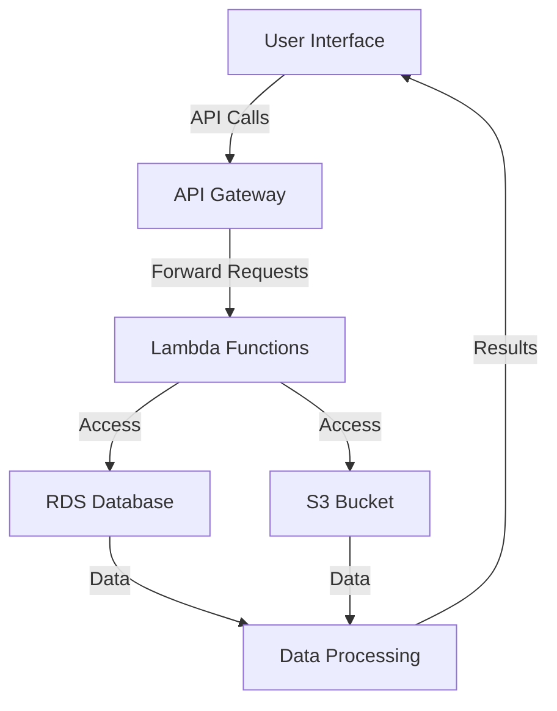

# Terraform Module Standards — AWS

## Overview and scope

The purpose of this document is to establish standards and best practices for creating and managing Terraform modules within the AWS infrastructure at Xentic. These standards aim to ensure consistency, maintainability, and scalability across all Terraform configurations used in our cloud environment.

### Audience

This document is intended for:
- Infrastructure Engineers
- DevOps Teams
- Software Developers involved in cloud infrastructure management
- Technical Leads overseeing infrastructure projects

### Scope

This standard covers:
- Naming conventions for Terraform modules
- Directory structure and organization of Terraform code
- Configuration management using Terraform variables
- Best practices for module documentation
- Security considerations specific to AWS resources
- Versioning and module lifecycle management

### Non-goals

This document does NOT cover:
- General Terraform usage outside of AWS
- Non-Terraform infrastructure management tools
- Application-level deployment strategies

### Glossary

| Term            | Definition                                                                 |
|-----------------|-----------------------------------------------------------------------------|
| Terraform       | An open-source infrastructure as code software tool created by HashiCorp. |
| Module          | A container for multiple resources that are used together in Terraform.    |
| Provider        | A plugin that Terraform uses to interact with cloud providers, SaaS providers, and other APIs. |
| Variable        | A named value that can be passed to a Terraform module to customize its behavior. |
| State           | The current configuration of the managed infrastructure, stored by Terraform. |

### How this standard fits the Xentic platform

The Terraform Module Standards are integral to the Xentic platform as they provide a framework for deploying and managing AWS resources consistently and efficiently. By adhering to these standards, teams can:
- Reduce duplication of effort by reusing modules across projects.
- Enhance collaboration between teams through shared understanding and practices.
- Improve the security posture of our cloud infrastructure by following best practices.
- Facilitate easier onboarding of new team members by providing clear guidelines.

### Example Module Structure

```plaintext
terraform-aws-example-module/
├── main.tf
├── variables.tf
├── outputs.tf
├── README.md
└── examples/
    └── example_usage.tf
```

### Example Variable Definition

```hcl
variable "instance_type" {
  description = "The type of EC2 instance to launch"
  type        = string
  default     = "t2.micro"
}
```

By following these standards, Xentic aims to create a robust and reliable infrastructure that can adapt to the evolving needs of our business while maintaining high standards of quality and security.

## Standards and policies

1. **Naming Conventions**  
   All Terraform module names MUST follow the pattern `terraform-aws-<module-name>`. This ensures clarity and consistency across the organization.  
   Example: `terraform-aws-vpc`, `terraform-aws-security-group`.

2. **Directory Structure**  
   The directory structure for each module MUST include the following files: `main.tf`, `variables.tf`, `outputs.tf`, and `README.md`. An `examples` directory SHOULD be included to demonstrate usage.  
   Example structure:
   ```plaintext
   terraform-aws-example-module/
   ├── main.tf
   ├── variables.tf
   ├── outputs.tf
   ├── README.md
   └── examples/
       └── example_usage.tf
   ```

3. **Variable Definitions**  
   All variables MUST be defined in the `variables.tf` file. Each variable MUST include a description and a type. Default values SHOULD be provided where applicable.  
   Example:
   ```hcl
   variable "region" {
     description = "The AWS region to deploy resources"
     type        = string
     default     = "us-east-1"
   }
   ```

4. **Output Values**  
   All modules MUST declare output values in the `outputs.tf` file to expose important information to the calling module. Outputs SHOULD be descriptive and include a meaningful name.  
   Example:
   ```hcl
   output "vpc_id" {
     description = "The ID of the VPC"
     value       = aws_vpc.main.id
   }
   ```

5. **Documentation**  
   Each module MUST include a `README.md` file that provides an overview of the module, usage examples, and descriptions of input variables and output values. The documentation MUST be kept up to date with any changes to the module.

6. **Version Control**  
   All Terraform modules MUST be versioned using semantic versioning (MAJOR.MINOR.PATCH). The version SHOULD be specified in the module's `README.md` and in any module calls.  
   Example:
   ```hcl
   module "example" {
     source  = "git::https://git.internal.xentic.io/terraform/terraform-aws-example-module.git?ref=v1.0.0"
   }
   ```

7. **Security Best Practices**  
   Sensitive data MUST NOT be hardcoded in Terraform configurations. Instead, sensitive values SHOULD be managed using AWS Secrets Manager or SSM Parameter Store.  
   Example:
   ```hcl
   data "aws_ssm_parameter" "db_password" {
     name = "/myapp/db_password"
   }
   ```

8. **Resource Naming**  
   All resources defined in a module MUST have unique names within the scope of the module. Resource names SHOULD include the module name as a prefix to avoid conflicts.  
   Example:
   ```hcl
   resource "aws_instance" "example_instance" {
     ami           = var.ami_id
     instance_type = var.instance_type
     tags = {
       Name = "example-${var.environment}-instance"
     }
   }
   ```

9. **State Management**  
   The Terraform state file MUST be stored remotely using an appropriate backend, such as AWS S3 with state locking enabled via DynamoDB. This ensures that the state is not lost and can be accessed by all team members.  
   Example configuration:
   ```hcl
   terraform {
     backend "s3" {
       bucket         = "xentic-terraform-state"
       key            = "terraform/production/terraform.tfstate"
       region         = "us-east-1"
       dynamodb_table = "terraform-locks"
       encrypt        = true
     }
   }
   ```

10. **Testing**  
    All modules SHOULD be tested using a testing framework such as `terratest` or `kitchen-terraform`. Automated tests MUST be included in the CI/CD pipeline to ensure the integrity of the modules.  
    Example test structure:
    ```plaintext
    terraform-aws-example-module/
    ├── test/
    │   └── test_example.go
    ```

By adhering to these policies, Xentic ensures that Terraform modules are developed in a consistent, secure, and maintainable manner, facilitating collaboration and reducing the risk of errors in our AWS infrastructure.

## Architecture and design

### Component Diagram



### Data Flows

1. **User Interaction**:
   - Users interact with the User Interface (UI) which sends API calls to the API Gateway.
   
2. **API Gateway**:
   - The API Gateway receives requests and forwards them to the appropriate Lambda Functions based on the endpoint.
   
3. **Lambda Functions**:
   - Lambda Functions process the requests, accessing necessary data from either the RDS Database or S3 Bucket.
   - Data processing can occur within Lambda or can be forwarded to a dedicated processing service.

4. **Database Access**:
   - Lambda Functions query the RDS Database for dynamic data or store results back into the database.
   
5. **S3 Access**:
   - Lambda Functions can read from or write to S3 Buckets for file storage and retrieval.
   
6. **Data Processing**:
   - Processed data is sent back to the UI for user display.

### Integration Points

- **API Gateway**: Acts as the entry point for all external requests, integrating with Lambda Functions.
- **AWS Lambda**: Integrates with various AWS services such as RDS and S3 for data access and processing.
- **Amazon RDS**: Provides a relational database service that Lambda Functions can query or update.
- **Amazon S3**: Serves as a storage service for files and data objects that Lambda Functions can access.

### Failure Domains

- **API Gateway**: If the API Gateway fails, all incoming requests will be blocked, leading to a complete outage of the service.
- **Lambda Functions**: If a Lambda function fails, it can lead to partial service degradation. Implementing retries and error handling is crucial.
- **Database (RDS)**: If the RDS instance becomes unavailable, all data operations will fail. High availability configurations and backups MUST be in place.
- **S3**: If S3 is unreachable, any file operations will fail. Ensure proper error handling and fallbacks.

### Best Practices

- **Monitoring and Logging**: Implement AWS CloudWatch for monitoring and logging to track the health of all components.
- **Error Handling**: Each component MUST have robust error handling to gracefully manage failures and provide meaningful feedback.
- **Security**: Ensure that all integrations are secured using IAM roles and policies to restrict access to only necessary resources.
- **Documentation**: Maintain comprehensive documentation for each component, including data flows and integration points, to facilitate easier troubleshooting and onboarding.

### Example Configuration

```hcl
resource "aws_api_gateway_rest_api" "example" {
  name        = "example-api"
  description = "API for example service"
}

resource "aws_lambda_function" "example" {
  function_name = "example_function"
  handler       = "index.handler"
  runtime       = "nodejs14.x"
  role          = aws_iam_role.lambda_exec.arn
  source_code_hash = filebase64sha256("lambda.zip")
}

resource "aws_rds_instance" "example" {
  identifier              = "example-db"
  instance_class          = "db.t2.micro"
  engine                 = "postgres"
  allocated_storage        = 20
  username                = "admin"
  password                = "password"
  db_name                 = "exampledb"
  skip_final_snapshot     = true
}

resource "aws_s3_bucket" "example" {
  bucket = "example-bucket"
}
```

By following these architecture and design standards, Xentic ensures that our AWS infrastructure is robust, scalable, and maintainable, allowing for efficient data flows and integration across services.

## Configuration reference

### Application Configuration (application.yml)

The following is a sample `application.yml` configuration for a typical Xentic service deployed on AWS:

```yaml
server:
  port: 8080

spring:
  application:
    name: example-service

aws:
  region: us-east-1
  s3:
    bucket: example-bucket
  rds:
    endpoint: example-db.xentic.io
    username: admin
    password: ${RDS_PASSWORD}
```

### Terraform Configuration

Below is an exhaustive reference for Terraform variables, including defaults and production values:

| Variable Name           | Description                                   | Default Value       | Production Value      |
|-------------------------|-----------------------------------------------|---------------------|-----------------------|
| `instance_type`         | The type of EC2 instance to launch            | `t2.micro`          | `t3.medium`           |
| `region`                | The AWS region to deploy resources            | `us-east-1`         | `us-west-2`           |
| `environment`           | The environment for deployment                | `dev`               | `prod`                |
| `ami_id`                | The AMI ID to use for the EC2 instance       | `ami-12345678`      | `ami-87654321`        |
| `db_username`           | The database username                          | `admin`             | `prod_user`           |
| `db_password`           | The database password (managed via SSM)      | `password`          | `${DB_PASSWORD}`      |
| `s3_bucket_name`        | The name of the S3 bucket                     | `example-bucket`    | `prod-example-bucket` |

### Environment Variables

The following environment variables are recommended for configuration in production environments:

| Environment Variable   | Description                                   | Default Value       |
|------------------------|-----------------------------------------------|---------------------|
| `RDS_PASSWORD`         | The password for the RDS database             | (not set)           |
| `DB_PASSWORD`          | The production database password               | (not set)           |
| `AWS_ACCESS_KEY_ID`   | AWS access key ID for authentication          | (not set)           |
| `AWS_SECRET_ACCESS_KEY`| AWS secret access key for authentication      | (not set)           |
| `AWS_SESSION_TOKEN`    | AWS session token for temporary credentials    | (not set)           |

### Example Terraform Configuration

Here is an example of how to configure a Terraform module using the defined variables:

```hcl
module "example_service" {
  source        = "git::https://git.internal.xentic.io/terraform/terraform-aws-example-module.git?ref=v1.0.0"
  instance_type = var.instance_type
  region        = var.region
  ami_id        = var.ami_id
  db_username   = var.db_username
  db_password   = data.aws_ssm_parameter.db_password.value
  s3_bucket_name = var.s3_bucket_name
}
```

### SQL Configuration for RDS

When setting up the RDS instance, ensure that the database is initialized with the necessary schema. Below is an example SQL script to create a sample table:

```sql
CREATE TABLE users (
    id SERIAL PRIMARY KEY,
    username VARCHAR(50) NOT NULL UNIQUE,
    password VARCHAR(255) NOT NULL,
    created_at TIMESTAMP DEFAULT CURRENT_TIMESTAMP
);
```

By adhering to these configuration references, Xentic ensures that our infrastructure is set up consistently and securely across different environments, facilitating easier management and deployment of our AWS resources.

## Implementation guide

To implement Terraform modules for AWS at Xentic, follow these step-by-step instructions. This guide will cover the creation of a simple AWS infrastructure including an API Gateway, Lambda function, RDS instance, and S3 bucket.

### Step 1: Create the Terraform Module Structure

Create a directory structure for your Terraform module:

```plaintext
terraform-aws-example-module/
├── main.tf
├── variables.tf
├── outputs.tf
└── README.md
```

### Step 2: Define the Main Terraform Configuration

In `main.tf`, define the resources you want to create. Below is an example configuration:

```hcl
provider "aws" {
  region = var.region
}

resource "aws_api_gateway_rest_api" "example" {
  name        = "example-api"
  description = "API for example service"
}

resource "aws_lambda_function" "example" {
  function_name = "example_function"
  handler       = "index.handler"
  runtime       = "nodejs14.x"
  role          = aws_iam_role.lambda_exec.arn
  source_code_hash = filebase64sha256("lambda.zip")
}

resource "aws_iam_role" "lambda_exec" {
  name = "lambda_exec_role"

  assume_role_policy = jsonencode({
    Version = "2012-10-17"
    Statement = [{
      Action    = "sts:AssumeRole"
      Principal = {
        Service = "lambda.amazonaws.com"
      }
      Effect    = "Allow"
      Sid       = ""
    }]
  })
}

resource "aws_rds_instance" "example" {
  identifier              = "example-db"
  instance_class          = "db.t2.micro"
  engine                 = "postgres"
  allocated_storage        = 20
  username                = var.db_username
  password                = var.db_password
  db_name                 = "exampledb"
  skip_final_snapshot     = true
}

resource "aws_s3_bucket" "example" {
  bucket = var.s3_bucket_name
}
```

### Step 3: Define Variables

In `variables.tf`, define the necessary variables for your module:

```hcl
variable "region" {
  description = "The AWS region to deploy resources"
  type        = string
  default     = "us-east-1"
}

variable "db_username" {
  description = "The database username"
  type        = string
}

variable "db_password" {
  description = "The database password"
  type        = string
}

variable "s3_bucket_name" {
  description = "The name of the S3 bucket"
  type        = string
}
```

### Step 4: Define Outputs

In `outputs.tf`, specify the outputs of your module:

```hcl
output "api_gateway_url" {
  value = aws_api_gateway_rest_api.example.invoke_url
}

output "rds_endpoint" {
  value = aws_rds_instance.example.endpoint
}

output "s3_bucket_name" {
  value = aws_s3_bucket.example.bucket
}
```

### Step 5: Create a README File

Document the usage of your module in `README.md`:

```markdown
# Terraform AWS Example Module

This module creates an API Gateway, Lambda function, RDS instance, and S3 bucket.

## Usage

```hcl
module "example_service" {
  source        = "git::https://git.internal.xentic.io/terraform/terraform-aws-example-module.git?ref=v1.0.0"
  region        = "us-east-1"
  db_username   = "admin"
  db_password   = "your_password"
  s3_bucket_name = "example-bucket"
}
```
```

### Step 6: Initialize and Apply the Module

Run the following commands to initialize and apply your Terraform configuration:

```bash
terraform init
terraform apply
```

### Step 7: Verify the Deployment

After the `terraform apply` command completes, verify that the resources have been created successfully in the AWS Management Console:

- Check the API Gateway for the created API.
- Verify the Lambda function is listed under AWS Lambda.
- Confirm the RDS instance is running in the RDS dashboard.
- Check the S3 bucket in the S3 console.

### Step 8: Clean Up Resources

To remove the resources created by the Terraform module, run:

```bash
terraform destroy
```

By following these implementation steps, Xentic ensures a consistent and reliable approach to deploying AWS infrastructure using Terraform, facilitating better management and scalability of our services.

## Security requirements

To ensure the security of our AWS infrastructure at Xentic, the following requirements must be adhered to:

### Threat Model Summary

- **Data Breaches**: Unauthorized access to sensitive data stored in S3 or RDS.
- **Denial of Service (DoS)**: Attacks aimed at disrupting service availability.
- **Misconfiguration**: Incorrectly configured resources leading to vulnerabilities.
- **Insider Threats**: Malicious actions by authorized personnel.

### Authentication and Authorization

- **IAM Policies**: All AWS resources MUST be protected with strict IAM policies. Use the principle of least privilege to limit access.
- **Role-Based Access Control (RBAC)**: Define roles for different user types (e.g., developers, admins) and assign permissions accordingly.
- **Multi-Factor Authentication (MFA)**: MFA MUST be enabled for all IAM users with console access.

Example IAM Policy for Lambda Execution Role:

```json
{
  "Version": "2012-10-17",
  "Statement": [
    {
      "Effect": "Allow",
      "Action": [
        "logs:CreateLogGroup",
        "logs:CreateLogStream",
        "logs:PutLogEvents"
      ],
      "Resource": "*"
    },
    {
      "Effect": "Allow",
      "Action": "s3:GetObject",
      "Resource": "arn:aws:s3:::example-bucket/*"
    }
  ]
}
```

### Secrets Management

- **AWS Secrets Manager**: Secrets (e.g., database passwords) MUST be stored in AWS Secrets Manager or AWS SSM Parameter Store.
- **Environment Variables**: Sensitive information MUST NOT be hardcoded in application code or Terraform files. Use environment variables or secret management solutions.

Example of accessing secrets in Terraform:

```hcl
data "aws_ssm_parameter" "db_password" {
  name = "/xentic/prod/db_password"
  with_decryption = true
}
```

### Input Validation

- **Input Sanitization**: All user inputs MUST be validated and sanitized to prevent injection attacks (e.g., SQL injection, XSS).
- **API Gateway Validation**: Use AWS API Gateway to validate incoming requests against defined schemas.

Example of input validation in a Lambda function:

```javascript
exports.handler = async (event) => {
    const input = event.body;
    if (!input || typeof input.username !== 'string') {
        throw new Error('Invalid input');
    }
    // Process input...
};
```

### Audit Logging

- **CloudTrail**: AWS CloudTrail MUST be enabled to log all API calls made in the account.
- **S3 Access Logs**: Enable S3 access logging to monitor access to S3 buckets.
- **Custom Application Logs**: Implement logging in applications to capture critical events and errors.

Example of enabling CloudTrail:

```hcl
resource "aws_cloudtrail" "example" {
  name                          = "example-cloudtrail"
  s3_bucket_name                = aws_s3_bucket.example.bucket
  is_multi_region_trail         = true
  enable_logging                = true
}
```

### Summary of Security Practices

| Security Aspect           | Requirement                                     |
|---------------------------|-------------------------------------------------|
| IAM Policies              | MUST enforce least privilege                     |
| MFA                       | MUST be enabled for all IAM users               |
| Secrets Management        | MUST use AWS Secrets Manager or SSM             |
| Input Validation          | MUST validate and sanitize all user inputs      |
| Audit Logging             | MUST enable CloudTrail and S3 access logs       |

By adhering to these security requirements, Xentic ensures a secure AWS infrastructure that protects sensitive data and maintains compliance with industry standards.

## Testing strategy

To ensure the reliability and stability of Terraform modules at Xentic, a comprehensive testing strategy must be implemented. This strategy includes unit tests, integration tests, and contract tests, each serving a specific purpose in the validation of infrastructure code.

### Unit Tests

Unit tests are designed to validate individual components of the Terraform modules. They should cover:

- **Resource Creation**: Ensure that resources are created as expected.
- **Variable Validation**: Check that variables are correctly defined and utilized.

**Coverage Target**: A minimum of 80% coverage on all Terraform files.

**Example Unit Test** (using `terraform-compliance`):

```yaml
# terraform-compliance.yml
version: v1.0
scenarios:
  - name: Ensure S3 bucket has versioning enabled
    resource: aws_s3_bucket
    tests:
      - name: Check versioning is enabled
        assert:
          - versioning:
              enabled: true
```

### Integration Tests

Integration tests validate the interaction between various components of the infrastructure. These tests ensure that the resources work together as intended.

**Integration Test Scenarios**:

- **API Gateway and Lambda**: Test that the API Gateway correctly triggers the Lambda function.
- **RDS Connectivity**: Verify that the application can connect to the RDS instance.

**Example Integration Test** (using `terratest`):

```go
package test

import (
    "testing"
    "github.com/gruntwork-io/terratest/modules/terraform"
)

func TestTerraformModule(t *testing.T) {
    terraformOptions := &terraform.Options{
        TerraformDir: "../path/to/your/module",
    }

    defer terraform.Destroy(t, terraformOptions)

    terraform.InitAndApply(t, terraformOptions)

    // Check if the API Gateway URL is reachable
    apiGatewayURL := terraform.Output(t, terraformOptions, "api_gateway_url")
    response, err := http.Get(apiGatewayURL)
    if err != nil {
        t.Fatalf("Failed to reach API Gateway: %v", err)
    }
    defer response.Body.Close()
    if response.StatusCode != 200 {
        t.Fatalf("Expected status code 200, got %d", response.StatusCode)
    }
}
```

### Contract Tests

Contract tests ensure that the expected outputs and behaviors of the Terraform modules remain consistent over time. They are critical for maintaining backward compatibility.

**Contract Test Scenarios**:

- **Output Validation**: Ensure that the outputs defined in the module match the expected values.
- **Resource State**: Validate the state of deployed resources against predefined contracts.

**Example Contract Test** (using `checkov`):

```yaml
# checkov.yaml
checks:
  - name: Ensure RDS instance is of the correct type
    resource: aws_rds_instance
    condition: instance_class == "db.t2.micro"
```

### Summary of Coverage Targets

| Test Type        | Coverage Target |
|------------------|-----------------|
| Unit Tests       | 80%              |
| Integration Tests| 100%             |
| Contract Tests   | 100%             |

### Example Test Classes

- **Unit Tests**: Use tools like `terraform-compliance` or `checkov` for validating individual resources and configurations.
- **Integration Tests**: Utilize `terratest` for testing the interaction of multiple resources.
- **Contract Tests**: Implement with `checkov` to ensure compliance with defined contracts.

By adhering to this testing strategy, Xentic ensures that all Terraform modules are rigorously tested, leading to a more stable and reliable infrastructure deployment process.

## Observability and operations

To ensure effective observability and operations of AWS infrastructure deployed via Terraform at Xentic, the following components must be implemented: metrics, logs, traces, dashboards, alerts, and Service Level Objectives (SLOs). 

### Metrics

Metrics should be collected from all critical components to monitor performance and health. The following metrics MUST be tracked:

- **API Gateway**: Latency, error rates, request counts.
- **Lambda Functions**: Invocation counts, duration, error counts, throttles.
- **RDS Instances**: CPU utilization, memory usage, disk I/O.
- **S3 Buckets**: Request counts, error rates.

Example configuration for CloudWatch metrics:

```hcl
resource "aws_cloudwatch_metric_alarm" "lambda_error_alarm" {
  alarm_name          = "LambdaErrorAlarm"
  metric_name         = "Errors"
  namespace           = "AWS/Lambda"
  statistic           = "Sum"
  period              = 300
  evaluation_periods  = 1
  threshold           = 1
  comparison_operator = "GreaterThanThreshold"
  dimensions = {
    FunctionName = aws_lambda_function.example.function_name
  }
  alarm_actions = [aws_sns_topic.alerts.arn]
}
```

### Logs

All applications MUST log relevant information to facilitate debugging and monitoring. The following logging practices are recommended:

- **Lambda Functions**: Use AWS CloudWatch Logs to capture function logs.
- **API Gateway**: Enable access logging to track requests.
- **RDS**: Enable general and slow query logs.

Example configuration for Lambda logging:

```hcl
resource "aws_lambda_function" "example" {
  function_name = "example_lambda"
  handler       = "index.handler"
  runtime       = "nodejs14.x"
  role          = aws_iam_role.lambda_exec.arn
  source_code_hash = filebase64sha256("lambda_function.zip")

  environment = {
    LOG_LEVEL = "info"
  }

  depends_on = [aws_iam_role_policy_attachment.lambda_logs]
}
```

### Traces

Distributed tracing MUST be implemented to track requests across services. AWS X-Ray should be used to visualize and analyze service performance.

- **X-Ray Daemon**: Deploy the X-Ray daemon in your VPC.
- **Lambda Integration**: Enable tracing for Lambda functions.

Example configuration for enabling X-Ray in Lambda:

```hcl
resource "aws_lambda_function" "example" {
  tracing_config {
    mode = "Active"
  }
}
```

### Dashboards

Dashboards MUST be created in AWS CloudWatch to visualize metrics and logs. Key dashboards should include:

- **API Performance Dashboard**: Display API Gateway metrics.
- **Lambda Performance Dashboard**: Show invocation counts and errors.
- **RDS Performance Dashboard**: Monitor database performance metrics.

Example CloudWatch Dashboard configuration:

```hcl
resource "aws_cloudwatch_dashboard" "example" {
  dashboard_name = "ExampleDashboard"
  dashboard_body = jsonencode({
    widgets = [
      {
        type = "metric",
        x = 0,
        y = 0,
        width = 6,
        height = 6,
        properties = {
          metrics = [
            ["AWS/Lambda", "Invocations", "FunctionName", aws_lambda_function.example.function_name],
            ["AWS/Lambda", "Errors", "FunctionName", aws_lambda_function.example.function_name]
          ],
          title = "Lambda Performance"
        }
      }
    ]
  })
}
```

### Alerts

Alerts MUST be configured to notify the on-call team of critical issues. Use Amazon SNS for alert notifications.

Key alerts to configure:

- **High Error Rates**: Trigger alerts when error rates exceed a threshold.
- **High Latency**: Alert when API Gateway latency exceeds acceptable limits.
- **Resource Utilization**: Notify when RDS CPU or memory usage is critically high.

Example SNS topic for alerts:

```hcl
resource "aws_sns_topic" "alerts" {
  name = "alerts-topic"
}
```

### Service Level Objectives (SLOs)

SLOs MUST be defined to measure the reliability and performance of services. Establish clear SLOs based on business requirements, such as:

- **Availability**: 99.9% uptime for critical services.
- **Response Time**: 95% of requests should respond within 200ms.

### On-Call Runbook Steps

In the event of an incident, the following runbook steps MUST be followed:

1. **Identify the Incident**: Check alerts in the monitoring dashboard.
2. **Gather Information**: Review logs and metrics to understand the scope of the issue.
3. **Assess Impact**: Determine which services are affected and the severity of the incident.
4. **Mitigate**: Apply any necessary temporary fixes (e.g., scaling resources, redeploying services).
5. **Communicate**: Notify stakeholders about the incident and expected resolution time.
6. **Resolve**: Implement a permanent fix and validate that the issue is resolved.
7. **Document**: Record the incident details and resolution steps for future reference.

By adhering to these observability and operations standards, Xentic ensures robust monitoring, quick identification of issues, and effective incident management, ultimately leading to a reliable and high-performance AWS infrastructure.

## Migration and versioning

When managing Terraform modules at Xentic, it is crucial to establish a clear migration and versioning policy to ensure smooth transitions between module versions, maintain backward compatibility, and facilitate rollback procedures when necessary. The following guidelines must be adhered to:

### Upgrade Paths

- **Semantic Versioning**: All Terraform modules MUST follow [Semantic Versioning](https://semver.org/) (MAJOR.MINOR.PATCH). 
  - **MAJOR** version changes MUST introduce breaking changes.
  - **MINOR** version changes SHOULD add functionality in a backward-compatible manner.
  - **PATCH** version changes MUST be backward-compatible bug fixes.

- **Upgrade Documentation**: Each version release MUST include comprehensive upgrade notes detailing:
  - Changes made
  - Migration steps required
  - Deprecation notices for removed features

### Deprecation Policy

- **Deprecation Notices**: Features or modules that are to be deprecated MUST be marked with a clear deprecation notice in the documentation and code comments.
  
- **Deprecation Timeline**: A minimum deprecation period of six months MUST be provided before a feature is removed. During this time:
  - Users MUST be encouraged to transition to the new features.
  - Deprecated features MUST remain functional but should log warnings indicating their deprecation.

### Backward Compatibility

- **Backward Compatibility Checks**: Every new version MUST be tested against the previous version to ensure that existing configurations continue to function as expected. This includes:
  - Running integration tests against both the old and new versions.
  - Validating outputs and resource states.

- **Configuration Changes**: If configuration changes are necessary, they MUST be documented clearly, and migration scripts SHOULD be provided to assist users in updating their configurations.

### Rollback Procedures

- **Version Control**: All Terraform modules MUST be version-controlled using Git. Tags corresponding to version numbers MUST be created for easy rollback.

- **Rollback Process**:
  1. Identify the version to roll back to using the version control system.
  2. Update the module reference in the Terraform configuration to the previous version.
  3. Run the following commands to apply the rollback:
  
    ```bash
    terraform init
    terraform apply
    ```

- **Rollback Testing**: After rolling back, it is essential to run all tests to ensure that the infrastructure is functioning as expected. This includes:
  - Unit tests
  - Integration tests
  - Contract tests

### Example Versioning Table

| Version | Release Date | Changes Made                             | Deprecation Notice       |
|---------|--------------|-----------------------------------------|---------------------------|
| 1.0.0  | 2023-01-01   | Initial release                         | N/A                       |
| 1.1.0  | 2023-03-01   | Added new feature X                     | Feature Y will be deprecated in 6 months |
| 1.2.0  | 2023-06-01   | Bug fixes and performance improvements   | N/A                       |
| 2.0.0  | 2023-09-01   | Breaking changes to resource structure   | Feature Y removed         |

By following these migration and versioning standards, Xentic ensures that Terraform modules remain robust, maintainable, and user-friendly, facilitating a smooth experience for all engineers involved in infrastructure management.

## FAQ, anti-patterns, and checklists

### FAQ

1. **What is the purpose of using Terraform modules?**
   - Terraform modules allow for the encapsulation of resources and configurations, promoting reusability and maintainability of infrastructure code.

2. **How should I structure my Terraform modules?**
   - Modules MUST be structured with a clear hierarchy, using directories for each module and including a `main.tf`, `variables.tf`, and `outputs.tf` file.

3. **What naming conventions should I follow for resources?**
   - Resource names MUST be descriptive and follow the format `service_resource_type_name`, e.g., `api_gateway_my_service`.

4. **How do I handle sensitive information in Terraform?**
   - Sensitive information MUST be stored in AWS Secrets Manager or SSM Parameter Store and referenced in Terraform using data sources.

5. **Can I use third-party Terraform modules?**
   - Third-party modules SHOULD be evaluated for security and compatibility before use. Preferably, use internal modules whenever possible.

6. **What should I do if I encounter a breaking change?**
   - If a breaking change is encountered, consult the upgrade documentation and follow the migration steps provided.

7. **How can I test my Terraform configurations?**
   - Use `terraform plan` to review changes before applying and implement automated tests using tools like `terratest` or `kitchen-terraform`.

8. **What is the recommended way to manage state files?**
   - State files MUST be stored in a remote backend, such as AWS S3, with state locking enabled via DynamoDB to prevent concurrent modifications.

9. **How do I ensure compliance with security policies?**
   - Regularly audit Terraform configurations against security best practices and use tools like `tfsec` or `checkov` to identify vulnerabilities.

10. **What is the process for deprecating a module?**
    - Deprecation MUST be communicated through documentation, and a timeline for removal should be established, allowing users to transition smoothly.

### Anti-Patterns

| Anti-Pattern                          | Description                                                                                       |
|---------------------------------------|---------------------------------------------------------------------------------------------------|
| Hardcoding values                     | Values like credentials or resource IDs MUST NOT be hardcoded; use variables instead.            |
| Overly complex modules                | Modules SHOULD be kept simple and focused on a single responsibility to enhance clarity.         |
| Lack of documentation                 | Every module MUST include clear documentation on usage, inputs, and outputs.                     |
| Ignoring state management             | State files MUST NOT be stored locally; always use a remote backend for state management.        |
| Not using version control              | All Terraform configurations MUST be version-controlled to track changes and facilitate rollbacks.|
| Unused resources                       | Resources that are no longer needed MUST be removed to avoid unnecessary costs.                  |

### Pre-Merge Checklist

- [ ] Code adheres to Xentic's Terraform module standards.
- [ ] All variables are documented in `variables.tf`.
- [ ] Outputs are defined in `outputs.tf`.
- [ ] No hardcoded values are present.
- [ ] Module has been tested with `terraform plan`.
- [ ] Documentation is updated to reflect changes.
- [ ] Relevant stakeholders have reviewed the changes.

### Production Checklist

- [ ] Ensure the latest version of the module is being used.
- [ ] Run `terraform plan` to verify changes before applying.
- [ ] Confirm that state is stored in a remote backend.
- [ ] Validate that all sensitive data is managed securely.
- [ ] Monitor the deployment for any unexpected issues post-application.
- [ ] Update the incident response documentation if necessary.
