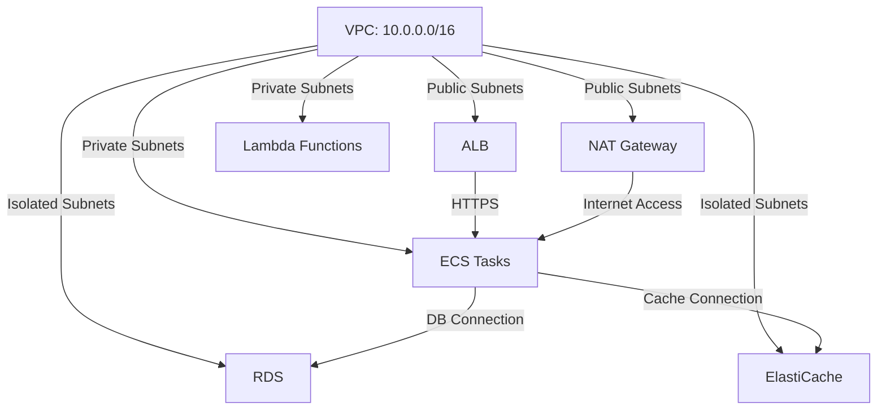

# VPC and Network Architecture Standard

## Overview and scope

The purpose of this document is to establish the standards and guidelines for the Virtual Private Cloud (VPC) and network architecture within the Xentic organization. This standard aims to ensure that all network-related configurations are consistent, secure, and scalable across all services deployed on the AWS platform. 

### Audience
This document is intended for:
- Cloud Architects
- DevOps Engineers
- Software Engineers
- Security Teams
- Network Administrators

### Scope
This standard applies to all AWS environments used by Xentic, including:
- Development
- Staging
- Production

It encompasses the design, implementation, and management of VPCs, subnets, security groups, and related networking components.

### Non-goals
This document does NOT cover:
- Application-level networking configurations
- Non-AWS cloud environments
- Networking policies for on-premises infrastructure

### Glossary
| Term               | Definition                                                                 |
|--------------------|-----------------------------------------------------------------------------|
| VPC                | A Virtual Private Cloud is a private network within the AWS cloud.         |
| Subnet             | A range of IP addresses in the VPC.                                        |
| Security Group     | A virtual firewall that controls inbound and outbound traffic for AWS resources. |
| NAT Gateway        | A managed NAT service that allows instances in a private subnet to access the internet. |
| ALB                | Application Load Balancer, a service that automatically distributes incoming application traffic across multiple targets. |

### How this standard fits the Xentic platform
The VPC and Network Architecture Standard is a critical component of the Xentic platform, ensuring that all services are deployed in a secure, efficient, and scalable manner. By adhering to this standard, teams can:
- Facilitate seamless communication between services
- Enhance security through controlled access
- Optimize resource allocation and management

### Standard VPC Layout
The following layout illustrates the standard VPC architecture:

```
VPC: 10.0.0.0/16
├── Public subnets   (ALB, NAT Gateway)
│   ├── 10.0.1.0/24  us-east-1a
│   ├── 10.0.2.0/24  us-east-1b
│   └── 10.0.3.0/24  us-east-1c
├── Private subnets  (ECS tasks, Lambda)
│   ├── 10.0.11.0/24
│   ├── 10.0.12.0/24
│   └── 10.0.13.0/24
└── Isolated subnets (RDS, ElastiCache)
    ├── 10.0.21.0/24
    ├── 10.0.22.0/24
    └── 10.0.23.0/24
```

### Security Group Rules
The following table outlines the security group rules that must be implemented:

| Security Group | Inbound Rules                          | Outbound Rules                       |
|----------------|---------------------------------------|--------------------------------------|
| ALB SG         | 443 from 0.0.0.0/0                   | 8080 to App SG                       |
| App SG         | 8080 from ALB SG                      | 5432 to DB SG, 443 to internet      |
| DB SG          | 5432 from App SG                      | none                                 |

### Terraform Module
The following Terraform module configuration is recommended for creating the VPC:

```hcl
module "vpc" {
  source  = "terraform-aws-modules/vpc/aws"
  version = "~> 5.0"
  name    = "${var.env}-vpc"
  cidr    = "10.0.0.0/16"
  azs     = ["us-east-1a", "us-east-1b", "us-east-1c"]
  public_subnets   = ["10.0.1.0/24",  "10.0.2.0/24",  "10.0.3.0/24"]
  private_subnets  = ["10.0.11.0/24", "10.0.12.0/24", "10.0.13.0/24"]
  database_subnets = ["10.0.21.0/24", "10.0.22.0/24", "10.0.23.0/24"]
  enable_nat_gateway     = true
  one_nat_gateway_per_az = true
}
```

By following these standards, Xentic can maintain a robust and secure network architecture that supports its business objectives and technical requirements.

## Standards and policies

1. **VPC Design**  
   All VPCs MUST be designed following the standard layout as outlined in the document. This includes the use of public, private, and isolated subnets.

2. **CIDR Blocks**  
   The CIDR block for VPCs MUST be in the range of 10.0.0.0/16 to 10.255.255.255. This ensures consistency and avoids IP conflicts.

3. **Subnet Allocation**  
   Subnets MUST be allocated in /24 blocks for public and private subnets, and /24 blocks for isolated subnets. This allows for a manageable number of IP addresses while maintaining scalability.

4. **Availability Zones**  
   Each VPC MUST span at least three Availability Zones (AZs) to ensure high availability and fault tolerance. The AZs used MUST be documented in the architecture.

5. **Security Groups**  
   Security groups MUST be defined for each service deployed within the VPC. The naming convention MUST follow the format `sg-<service>-<environment>`, e.g., `sg-auth-prod`.

6. **Ingress and Egress Rules**  
   Ingress and egress rules for security groups MUST be explicitly defined. The rules MUST follow the principle of least privilege, allowing only necessary traffic.

7. **NAT Gateway**  
   A NAT Gateway MUST be deployed in the public subnet to allow instances in private subnets to access the internet. The NAT Gateway MUST be highly available across multiple AZs.

8. **Route Tables**  
   Route tables MUST be configured to ensure proper routing between subnets and to the internet. Each subnet MUST be associated with the appropriate route table.

9. **VPC Peering**  
   VPC peering connections MUST be established using the Xentic naming convention: `vpc-peering-<source>-<target>`. Peering connections MUST be documented and reviewed regularly.

10. **Logging and Monitoring**  
    VPC Flow Logs MUST be enabled for all VPCs to monitor traffic and troubleshoot issues. Logs MUST be stored in an S3 bucket with appropriate lifecycle policies.

11. **Tagging**  
    All AWS resources within the VPC MUST be tagged according to the Xentic tagging strategy. Tags MUST include `Owner`, `Environment`, and `Service`.

12. **Shared Libraries**  
    Any shared libraries used in the VPC MUST follow the naming convention `com.xentic.common:*` to ensure consistency across services.

13. **DNS Configuration**  
    Route 53 MUST be used for DNS management within the VPC. Public and private hosted zones MUST be created as needed, following the naming conventions of the respective services.

14. **VPN and Direct Connect**  
    Any VPN or Direct Connect configurations MUST be documented and must adhere to the security policies outlined in the Xentic security standards.

15. **IAM Roles and Policies**  
    IAM roles and policies for services running within the VPC MUST follow the principle of least privilege and MUST be reviewed regularly.

16. **Backup and Recovery**  
    Backup and recovery procedures for critical resources within the VPC MUST be established and tested regularly to ensure business continuity.

17. **Documentation**  
    All architectural designs, configurations, and changes MUST be documented in the internal Confluence space at `https://docs.internal.xentic.io`.

18. **Compliance**  
    All VPC configurations MUST comply with applicable regulatory requirements and internal security policies.

19. **Review Process**  
    Any changes to the VPC architecture MUST undergo a review process involving the Cloud Architects and Security Teams to ensure adherence to standards.

20. **Training and Awareness**  
    All team members involved in VPC management MUST receive training on the standards and policies outlined in this document to ensure compliance and understanding.

By adhering to these standards and policies, Xentic will ensure a secure, efficient, and scalable network architecture that aligns with its operational goals.

## Architecture and design

The architecture and design of the VPC and network infrastructure at Xentic must adhere to a well-defined structure that supports scalability, security, and high availability. Below is a component diagram that illustrates the standard architecture:



### Data Flows

- **User Traffic**: Users access the application via the Application Load Balancer (ALB) using HTTPS. The ALB forwards requests to ECS tasks or Lambda functions in the private subnets.
- **Database Access**: ECS tasks and Lambda functions communicate with the RDS instance located in the isolated subnet over a secure connection.
- **Cache Access**: ECS tasks also connect to ElastiCache for caching purposes, enhancing performance.
- **Internet Access**: Instances in private subnets access the internet through the NAT Gateway, which is deployed in a public subnet.

### Integration Points

- **ALB to ECS/Lambda**: The ALB serves as the entry point for all incoming traffic and must be configured to route requests to the appropriate ECS services or Lambda functions based on the path or host rules.
- **ECS to RDS**: ECS tasks must be configured with the necessary IAM roles to access the RDS database securely.
- **ECS to ElastiCache**: The connection to ElastiCache should utilize VPC endpoints to ensure that traffic remains within the AWS network.

### Failure Domains

- **Single Point of Failure**: The ALB and NAT Gateway must be deployed in multiple Availability Zones (AZs) to prevent a single point of failure.
- **Database Redundancy**: RDS instances should be deployed with Multi-AZ configurations to ensure high availability and automatic failover.
- **Load Balancing**: The ALB must automatically distribute incoming traffic across multiple ECS tasks to handle failures gracefully.

### Configuration Examples

#### Security Group Configuration

The following YAML configuration outlines the security group settings:

```yaml
SecurityGroups:
  ALB_SG:
    Type: AWS::EC2::SecurityGroup
    Properties:
      GroupDescription: "Security group for ALB"
      VpcId: !Ref VPCId
      SecurityGroupIngress:
        - IpProtocol: "tcp"
          FromPort: 443
          ToPort: 443
          CidrIp: "0.0.0.0/0"
      SecurityGroupEgress:
        - IpProtocol: "-1"
          FromPort: "0"
          ToPort: "0"
          CidrIp: "0.0.0.0/0"

  App_SG:
    Type: AWS::EC2::SecurityGroup
    Properties:
      GroupDescription: "Security group for Application"
      VpcId: !Ref VPCId
      SecurityGroupIngress:
        - IpProtocol: "tcp"
          FromPort: 8080
          ToPort: 8080
          SourceSecurityGroupId: !Ref ALB_SG
      SecurityGroupEgress:
        - IpProtocol: "tcp"
          FromPort: 5432
          ToPort: 5432
          SourceSecurityGroupId: !Ref DB_SG
```

#### Route Table Configuration

The following HCL configuration illustrates the route table settings:

```hcl
resource "aws_route_table" "public" {
  vpc_id = aws_vpc.main.id

  route {
    cidr_block = "0.0.0.0/0"
    gateway_id = aws_internet_gateway.main.id
  }

  tags = {
    Name = "Public Route Table"
  }
}

resource "aws_route_table" "private" {
  vpc_id = aws_vpc.main.id

  route {
    cidr_block = "0.0.0.0/0"
    nat_gateway_id = aws_nat_gateway.main.id
  }

  tags = {
    Name = "Private Route Table"
  }
}
```

By adhering to these architectural guidelines, Xentic ensures a robust network infrastructure capable of supporting its applications while maintaining high levels of security and availability.

## Configuration reference

### application.yml

The following is an example of the `application.yml` configuration file for a service running within the VPC:

```yaml
server:
  port: 8080

spring:
  datasource:
    url: jdbc:postgresql://rds-instance:5432/mydb
    username: mydbuser
    password: mydbpassword
  redis:
    host: elasticache-instance
    port: 6379

logging:
  level:
    root: INFO
    com.xentic: DEBUG

security:
  oauth2:
    client:
      registration:
        xentic:
          client-id: your-client-id
          client-secret: your-client-secret
          redirect-uri: "{baseUrl}/login/oauth2/code/{registrationId}"
          scope: read,write
      provider:
        xentic:
          authorization-uri: https://auth.internal.xentic.io/oauth/authorize
          token-uri: https://auth.internal.xentic.io/oauth/token
```

### Terraform Configuration

The following table outlines the default and production values for Terraform variables used in the VPC setup:

| Variable Name            | Default Value         | Production Value      |
|--------------------------|-----------------------|------------------------|
| `vpc_cidr_block`        | `10.0.0.0/16`         | `10.0.0.0/16`          |
| `public_subnet_cidrs`   | `["10.0.1.0/24"]`     | `["10.0.1.0/24", "10.0.2.0/24", "10.0.3.0/24"]` |
| `private_subnet_cidrs`  | `["10.0.4.0/24"]`     | `["10.0.4.0/24", "10.0.5.0/24", "10.0.6.0/24"]` |
| `nat_gateway_enabled`    | `true`                | `true`                 |
| `instance_type`         | `t2.micro`            | `t3.medium`            |
| `db_instance_class`     | `db.t2.micro`         | `db.t3.medium`         |

### Environment Variables

The following table lists the required environment variables for services running in the VPC, including defaults and production values:

| Environment Variable    | Default Value         | Production Value      |
|-------------------------|-----------------------|------------------------|
| `DATABASE_URL`          | `jdbc:postgresql://localhost:5432/mydb` | `jdbc:postgresql://rds-instance:5432/mydb` |
| `REDIS_HOST`            | `localhost`           | `elasticache-instance` |
| `REDIS_PORT`            | `6379`                | `6379`                 |
| `JWT_SECRET`            | `defaultsecret`       | `productionsecret`     |
| `OAUTH_CLIENT_ID`       | `default-client-id`   | `your-client-id`       |
| `OAUTH_CLIENT_SECRET`   | `default-client-secret`| `your-client-secret`   |

### SQL Configuration for RDS

The following SQL script initializes the database schema for a sample application:

```sql
CREATE TABLE users (
    id SERIAL PRIMARY KEY,
    username VARCHAR(50) NOT NULL UNIQUE,
    password VARCHAR(255) NOT NULL,
    created_at TIMESTAMP DEFAULT CURRENT_TIMESTAMP
);

CREATE TABLE products (
    id SERIAL PRIMARY KEY,
    name VARCHAR(100) NOT NULL,
    price DECIMAL(10, 2) NOT NULL,
    created_at TIMESTAMP DEFAULT CURRENT_TIMESTAMP
);
```

### Summary

By adhering to the configuration standards outlined above, Xentic ensures that all services are consistently deployed and managed within the VPC, promoting security, reliability, and maintainability. Each service must utilize the specified configurations to align with the overall architecture and operational requirements.

## Implementation guide

To implement the VPC and network architecture at Xentic, follow the step-by-step guide below. This guide covers the creation of the VPC, subnets, security groups, route tables, and necessary AWS resources using Terraform.

### Step 1: Create VPC

The first step is to create a VPC with the specified CIDR block.

```hcl
resource "aws_vpc" "main" {
  cidr_block = "10.0.0.0/16"
  enable_dns_support = true
  enable_dns_hostnames = true

  tags = {
    Name = "Main VPC"
  }
}
```

### Step 2: Create Subnets

Next, create public and private subnets.

```hcl
resource "aws_subnet" "public" {
  count = 3
  vpc_id = aws_vpc.main.id
  cidr_block = "10.0.${count.index + 1}.0/24"
  availability_zone = element(data.aws_availability_zones.available.names, count.index)

  tags = {
    Name = "Public Subnet ${count.index + 1}"
  }
}

resource "aws_subnet" "private" {
  count = 3
  vpc_id = aws_vpc.main.id
  cidr_block = "10.0.${count.index + 4}.0/24"
  availability_zone = element(data.aws_availability_zones.available.names, count.index)

  tags = {
    Name = "Private Subnet ${count.index + 1}"
  }
}
```

### Step 3: Create Internet Gateway

An Internet Gateway is required for public internet access.

```hcl
resource "aws_internet_gateway" "main" {
  vpc_id = aws_vpc.main.id

  tags = {
    Name = "Main Internet Gateway"
  }
}
```

### Step 4: Create Route Tables

Create route tables for public and private subnets.

```hcl
resource "aws_route_table" "public" {
  vpc_id = aws_vpc.main.id

  route {
    cidr_block = "0.0.0.0/0"
    gateway_id = aws_internet_gateway.main.id
  }

  tags = {
    Name = "Public Route Table"
  }
}

resource "aws_route_table" "private" {
  vpc_id = aws_vpc.main.id

  route {
    cidr_block = "0.0.0.0/0"
    nat_gateway_id = aws_nat_gateway.main.id
  }

  tags = {
    Name = "Private Route Table"
  }
}
```

### Step 5: Associate Subnets with Route Tables

Associate the public and private subnets with their respective route tables.

```hcl
resource "aws_route_table_association" "public" {
  count = 3
  subnet_id = aws_subnet.public[count.index].id
  route_table_id = aws_route_table.public.id
}

resource "aws_route_table_association" "private" {
  count = 3
  subnet_id = aws_subnet.private[count.index].id
  route_table_id = aws_route_table.private.id
}
```

### Step 6: Create NAT Gateway

Create a NAT Gateway for private subnet internet access.

```hcl
resource "aws_eip" "nat" {
  vpc = true
}

resource "aws_nat_gateway" "main" {
  allocation_id = aws_eip.nat.id
  subnet_id = aws_subnet.public[0].id

  tags = {
    Name = "Main NAT Gateway"
  }
}
```

### Step 7: Create Security Groups

Define security groups for the ALB and application instances.

```hcl
resource "aws_security_group" "alb" {
  vpc_id = aws_vpc.main.id
  ingress {
    from_port   = 443
    to_port     = 443
    protocol    = "tcp"
    cidr_blocks = ["0.0.0.0/0"]
  }
  egress {
    from_port   = 0
    to_port     = 0
    protocol    = "-1"
    cidr_blocks = ["0.0.0.0/0"]
  }
  tags = {
    Name = "ALB Security Group"
  }
}

resource "aws_security_group" "app" {
  vpc_id = aws_vpc.main.id
  ingress {
    from_port   = 8080
    to_port     = 8080
    protocol    = "tcp"
    security_groups = [aws_security_group.alb.id]
  }
  egress {
    from_port   = 5432
    to_port     = 5432
    protocol    = "tcp"
    security_groups = [aws_security_group.db.id]
  }
  tags = {
    Name = "Application Security Group"
  }
}
```

### Step 8: Deploy ECS and RDS

Deploy ECS tasks and RDS instances in the private subnet.

```hcl
resource "aws_ecs_cluster" "main" {
  name = "Main ECS Cluster"
}

resource "aws_db_instance" "main" {
  allocated_storage    = 20
  engine             = "postgres"
  engine_version     = "13.3"
  instance_class     = "db.t3.micro"
  name               = "mydb"
  username           = "mydbuser"
  password           = "mydbpassword"
  db_subnet_group_name = aws_db_subnet_group.main.id
  vpc_security_group_ids = [aws_security_group.db.id]

  tags = {
    Name = "Main RDS Instance"
  }
}
```

### Summary

By following this implementation guide, Xentic can establish a robust and secure VPC architecture in AWS. Each step is critical to ensuring that the network is configured correctly to support applications while maintaining security and scalability.

## Security requirements

Xentic's network architecture must adhere to stringent security requirements to mitigate risks and protect sensitive data. The following sections outline the key components of the security framework, including threat modeling, authentication and authorization, secrets management, input validation, and audit logging.

### Threat Model Summary

The threat model for Xentic's infrastructure includes the following potential threats:

- **Unauthorized Access:** Attackers may attempt to gain access to services or data.
- **Data Breach:** Sensitive information could be exposed through vulnerabilities.
- **Denial of Service (DoS):** Services may be disrupted through overwhelming traffic.
- **Malicious Code Execution:** Attackers may exploit vulnerabilities to execute harmful code.

To address these threats, the following strategies MUST be implemented:

- Use of security groups and network ACLs to control inbound and outbound traffic.
- Regular vulnerability assessments and penetration testing.
- Implementation of rate limiting and throttling to mitigate DoS attacks.

### Authentication and Authorization

Xentic services MUST implement OAuth 2.0 for authentication and authorization. The following configuration is required in the `application.yml`:

```yaml
security:
  oauth2:
    client:
      registration:
        xentic:
          client-id: your-client-id
          client-secret: your-client-secret
          redirect-uri: "{baseUrl}/login/oauth2/code/{registrationId}"
          scope: read,write
      provider:
        xentic:
          authorization-uri: https://auth.internal.xentic.io/oauth/authorize
          token-uri: https://auth.internal.xentic.io/oauth/token
```

#### User Roles and Permissions

A role-based access control (RBAC) model MUST be implemented, defining roles and their associated permissions. The following table summarizes the roles:

| Role         | Permissions                           |
|--------------|---------------------------------------|
| Admin        | All permissions                       |
| User         | Read access to resources              |
| Editor       | Read and write access to resources    |

### Secrets Management

Secrets MUST NOT be hardcoded in source code or configuration files. Use AWS Secrets Manager or Parameter Store for managing sensitive information. Example configuration for accessing secrets in a Spring Boot application:

```yaml
spring:
  cloud:
    aws:
      parameterstore:
        enabled: true
        name: /xentic/app/secrets
```

### Input Validation

All inputs to services MUST be validated to prevent injection attacks and ensure data integrity. Use the following strategies:

- **Whitelist Validation:** Define acceptable input formats and reject anything outside these formats.
- **Sanitization:** Clean inputs to remove any harmful characters.

Example of input validation in Java:

```java
public void validateInput(String input) {
    if (!input.matches("^[a-zA-Z0-9]*$")) {
        throw new IllegalArgumentException("Invalid input");
    }
}
```

### Audit Logging

All access and changes to sensitive data MUST be logged for audit purposes. The logging framework should capture the following details:

- Timestamp
- User ID
- Action performed
- Resource accessed

Example configuration for logging in `application.yml`:

```yaml
logging:
  level:
    root: INFO
    com.xentic: DEBUG
  loggers:
    audit:
      level: INFO
      appender: auditAppender
```

#### Audit Log Format

The audit log entries MUST follow a standardized format:

```json
{
  "timestamp": "2023-10-01T12:00:00Z",
  "userId": "user123",
  "action": "UPDATE",
  "resource": "user-profile",
  "details": "Updated email address"
}
```

### Summary

By implementing the above security requirements, Xentic ensures a comprehensive approach to safeguarding its network architecture. Adherence to these standards is critical for maintaining the integrity, confidentiality, and availability of services and data. All teams MUST comply with these guidelines to promote a secure operational environment.

## Testing strategy

Xentic's software development process MUST incorporate a robust testing strategy to ensure the reliability and quality of applications. The testing strategy includes unit tests, integration tests, and contract tests, with specific coverage targets defined for each type of test.

### Unit Tests

Unit tests are essential for validating the functionality of individual components. Each service MUST achieve a minimum of 80% code coverage for unit tests. Unit tests should be written using JUnit 5 and Mockito for mocking dependencies.

#### Example Unit Test Class

```java
package com.xentic.service;

import static org.mockito.Mockito.*;
import static org.junit.jupiter.api.Assertions.*;

import org.junit.jupiter.api.BeforeEach;
import org.junit.jupiter.api.Test;
import org.mockito.InjectMocks;
import org.mockito.Mock;
import org.mockito.MockitoAnnotations;

class MyServiceTest {

    @InjectMocks
    private MyService myService;

    @Mock
    private MyRepository myRepository;

    @BeforeEach
    void setUp() {
        MockitoAnnotations.openMocks(this);
    }

    @Test
    void testGetData() {
        // Arrange
        when(myRepository.findData()).thenReturn("Mock Data");

        // Act
        String result = myService.getData();

        // Assert
        assertEquals("Mock Data", result);
        verify(myRepository).findData();
    }
}
```

### Integration Tests

Integration tests validate the interaction between components and external systems. Each service MUST achieve a minimum of 70% code coverage for integration tests. Spring Boot's testing framework should be utilized for integration testing.

#### Example Integration Test Class

```java
package com.xentic.service;

import static org.springframework.test.web.servlet.request.MockMvcRequestBuilders.get;
import static org.springframework.test.web.servlet.result.MockMvcResultMatchers.status;

import org.junit.jupiter.api.BeforeEach;
import org.junit.jupiter.api.Test;
import org.springframework.beans.factory.annotation.Autowired;
import org.springframework.boot.test.autoconfigure.web.servlet.WebMvcTest;
import org.springframework.test.web.servlet.MockMvc;

@WebMvcTest(MyController.class)
class MyControllerIntegrationTest {

    @Autowired
    private MockMvc mockMvc;

    @Test
    void testGetEndpoint() throws Exception {
        mockMvc.perform(get("/api/data"))
               .andExpect(status().isOk());
    }
}
```

### Contract Tests

Contract tests are critical for ensuring that services adhere to agreed-upon interfaces. Xentic services MUST implement contract tests using Pact to verify interactions between services. Each service MUST achieve a minimum of 75% code coverage for contract tests.

#### Example Contract Test

```java
package com.xentic.contract;

import au.com.dius.pact.consumer.PactConsumerTestExt;
import au.com.dius.pact.consumer.junit5.Pact;
import au.com.dius.pact.consumer.junit5.PactConsumerTest;
import org.junit.jupiter.api.Test;
import org.junit.jupiter.api.extension.ExtendWith;

@ExtendWith(PactConsumerTestExt.class)
class MyServiceContractTest extends PactConsumerTest {

    @Pact(consumer = "MyServiceConsumer", provider = "MyServiceProvider")
    public RequestResponsePact createPact(PactDslWithProvider builder) {
        return builder
            .given("Data exists")
            .uponReceiving("A request for data")
            .path("/api/data")
            .method("GET")
            .willRespondWith()
            .status(200)
            .body("{\"data\": \"Mock Data\"}")
            .toPact();
    }

    @Test
    void testGetData() {
        // Implement the test logic to verify the contract
    }
}
```

### Coverage Targets

| Test Type       | Minimum Coverage Target |
|------------------|-------------------------|
| Unit Tests       | 80%                     |
| Integration Tests | 70%                     |
| Contract Tests   | 75%                     |

### Summary

By adhering to the outlined testing strategy, Xentic ensures that all services are thoroughly tested and meet quality standards. All teams MUST prioritize writing tests and achieving the specified coverage targets to maintain a high level of software quality and reliability.

## Observability and operations

To ensure the reliability and performance of Xentic's infrastructure, a comprehensive observability and operations strategy MUST be established. This strategy encompasses metrics collection, logging, tracing, dashboards, alerts, service level objectives (SLOs), and on-call runbook steps.

### Metrics Collection

Xentic services MUST expose metrics in a standardized format, preferably using Prometheus. The following configuration MUST be included in the `application.yml` to enable metrics collection:

```yaml
management:
  metrics:
    export:
      prometheus:
        enabled: true
```

#### Key Metrics to Monitor

- **CPU Usage:** Monitor the percentage of CPU utilized.
- **Memory Usage:** Track the amount of memory consumed.
- **Request Latency:** Measure the time taken to handle requests.
- **Error Rate:** Calculate the percentage of failed requests.

### Logging

All services MUST implement structured logging using a logging framework such as Logback or Log4j2. The logs MUST include the following information:

- Timestamp
- Service name
- Log level
- Message
- Contextual data (e.g., user ID, request ID)

Example configuration for Logback in `logback-spring.xml`:

```xml
<configuration>
    <appender name="STDOUT" class="ch.qos.logback.core.ConsoleAppender">
        <encoder>
            <pattern>%d{yyyy-MM-dd HH:mm:ss} %-5level [%thread] %logger{36} - %msg%n</pattern>
        </encoder>
    </appender>

    <root level="INFO">
        <appender-ref ref="STDOUT" />
    </root>
</configuration>
```

### Tracing

Distributed tracing MUST be implemented using OpenTelemetry or a similar framework to track requests across multiple services. The following configuration MUST be added to enable tracing:

```yaml
spring:
  sleuth:
    sampler:
      probability: 1.0
```

### Dashboards

Dashboards MUST be created using Grafana to visualize metrics and logs. The following panels MUST be included:

- CPU and Memory Usage
- Request Latency and Error Rate
- Service Health Status

### Alerts

Alerts MUST be configured to notify the on-call team of any critical issues. The following alerting rules MUST be established:

| Alert Condition                | Severity | Notification Channel |
|--------------------------------|----------|----------------------|
| CPU Usage > 80%                | Critical | PagerDuty            |
| Error Rate > 5%                | High     | Slack                |
| Request Latency > 500ms        | Medium   | Email                |

Example alert rule in Prometheus:

```yaml
groups:
  - name: alert-rules
    rules:
      - alert: HighCpuUsage
        expr: sum(rate(container_cpu_usage_seconds_total[1m])) by (instance) > 0.8
        for: 5m
        labels:
          severity: critical
        annotations:
          summary: "High CPU Usage detected"
          description: "CPU usage is above 80% for more than 5 minutes."
```

### Service Level Objectives (SLOs)

SLOs MUST be defined for each service to measure performance and reliability. The following SLOs are recommended:

| Service Name        | SLO Description                  | Target   |
|---------------------|----------------------------------|----------|
| User Service        | 99.9% availability                | Monthly  |
| Payment Service     | 95% of requests processed within 200ms | Monthly  |
| Notification Service | 99% of notifications delivered within 5 seconds | Monthly  |

### On-Call Runbook Steps

An on-call runbook MUST be created to guide the on-call team during incidents. The following steps MUST be included:

1. **Identify the Issue:**
   - Check alerts in the monitoring dashboard.
   - Review logs for error messages.

2. **Assess Impact:**
   - Determine affected services and users.
   - Communicate with stakeholders.

3. **Mitigate the Issue:**
   - Restart affected services if necessary.
   - Scale up resources if CPU or memory limits are reached.

4. **Document the Incident:**
   - Record the incident details in the incident management system.
   - Include timestamps, actions taken, and resolution.

5. **Post-Incident Review:**
   - Conduct a post-mortem meeting to analyze the incident.
   - Identify root causes and propose preventive measures.

### Summary

By implementing a robust observability and operations strategy, Xentic ensures that all services are monitored effectively, enabling quick identification and resolution of issues. All teams MUST adhere to these standards to maintain operational excellence and service reliability.

## Migration and versioning

Xentic's approach to migration and versioning is critical for maintaining service reliability and ensuring smooth transitions between software versions. The following guidelines MUST be adhered to:

### Upgrade Paths

- Each service MUST define clear upgrade paths for major and minor version changes.
- Upgrades MUST be backward compatible whenever possible to minimize disruptions.
- Major version upgrades MUST be accompanied by comprehensive documentation outlining breaking changes and migration steps.

#### Example Upgrade Path Documentation

| Current Version | Target Version | Upgrade Steps                             |
|------------------|----------------|------------------------------------------|
| 1.0              | 2.0            | 1. Review breaking changes<br>2. Update configuration<br>3. Deploy and test |
| 1.1              | 1.2            | 1. No breaking changes<br>2. Deploy directly |

### Deprecation Policy

- Features MUST NOT be removed without a deprecation period of at least one full release cycle.
- Deprecation notices MUST be clearly communicated through release notes and internal documentation.
- Deprecated features MUST remain functional for at least one major version after the deprecation announcement.

#### Example Deprecation Notice

```markdown
### Deprecation Notice for Feature X

**Feature X** will be deprecated in version 2.0. It is recommended to transition to **Feature Y** by the next major release. The feature will remain available until version 3.0.
```

### Backward Compatibility

- Services MUST ensure backward compatibility for API endpoints whenever feasible.
- Any changes to the API MUST be versioned, and the old version MUST remain available until the deprecation period is complete.
- Clients MUST be informed of any changes that could affect their integration.

#### Example API Versioning

```java
@RestController
@RequestMapping("/api/v1/data")
public class DataController {
    // Endpoint for version 1
    @GetMapping
    public ResponseEntity<Data> getDataV1() {
        // Implementation for version 1
    }
}

@RestController
@RequestMapping("/api/v2/data")
public class DataControllerV2 {
    // Endpoint for version 2
    @GetMapping
    public ResponseEntity<Data> getDataV2() {
        // Implementation for version 2
    }
}
```

### Rollback Procedures

- Rollback procedures MUST be documented and tested for each service.
- In case of a failed deployment, the rollback process MUST be executed promptly to restore service functionality.
- All teams MUST maintain a rollback plan that includes:

  - **Backup Procedures:** Ensure data is backed up before deployments.
  - **Rollback Steps:** Clear instructions on how to revert to the previous version.
  - **Testing Post-Rollback:** Verify the service is functioning correctly after a rollback.

#### Example Rollback Procedure

1. **Identify the Failure:**
   - Monitor logs and alerts for errors post-deployment.
   
2. **Initiate Rollback:**
   - Execute the rollback command:
   ```bash
   kubectl rollout undo deployment/my-service
   ```

3. **Verify Service Health:**
   - Check the service status:
   ```bash
   kubectl get pods -l app=my-service
   ```

4. **Communicate with Stakeholders:**
   - Notify relevant teams about the rollback and any implications.

### Summary

By following these migration and versioning standards, Xentic ensures that services can evolve without disrupting existing functionality. All teams MUST adhere to these guidelines to maintain a stable and reliable infrastructure.

## FAQ, Anti-Patterns, and Checklists

### FAQ

1. **What is a VPC?**
   - A Virtual Private Cloud (VPC) is a private network within the AWS cloud where you can define your own network topology, including IP address ranges, subnets, route tables, and network gateways.

2. **How many subnets should I create in my VPC?**
   - You MUST create at least two subnets in different Availability Zones for high availability. A common practice is to have one public subnet for load balancers and one or more private subnets for application servers.

3. **What is the purpose of a NAT Gateway?**
   - A NAT Gateway allows instances in a private subnet to connect to the internet for updates and patches while preventing inbound traffic from the internet.

4. **What CIDR block should I use for my VPC?**
   - You SHOULD use a CIDR block that provides sufficient IP addresses for your needs, typically a /16 block (e.g., 10.0.0.0/16) for larger applications.

5. **How do I secure my VPC?**
   - You MUST implement security groups and network ACLs to control inbound and outbound traffic. Security groups act as virtual firewalls for your instances.

6. **Can I connect my VPC to on-premises networks?**
   - Yes, you SHOULD use AWS Direct Connect or a VPN connection to securely connect your VPC to your on-premises data center.

7. **What is the difference between public and private subnets?**
   - Public subnets have a route to the internet via an Internet Gateway, while private subnets do not have direct access to the internet.

8. **How do I monitor my VPC?**
   - You MUST enable VPC Flow Logs to capture information about the IP traffic going to and from network interfaces in your VPC.

9. **What are the best practices for VPC peering?**
   - You MUST ensure that the CIDR blocks of the VPCs do not overlap and that you configure route tables to allow traffic between the peered VPCs.

10. **How can I manage costs associated with my VPC?**
    - You SHOULD regularly review your resources, terminate unused instances, and monitor data transfer costs to optimize your VPC expenses.

### Anti-Patterns

| Anti-Pattern                     | Description                                                                                          |
|----------------------------------|------------------------------------------------------------------------------------------------------|
| Single Availability Zone         | Deploying all resources in a single Availability Zone, leading to a single point of failure.        |
| Overlapping CIDR Blocks          | Using overlapping CIDR blocks in VPC peering, causing routing conflicts.                            |
| Unrestricted Security Groups      | Configuring security groups with overly permissive rules, exposing instances to potential attacks.   |
| Lack of Subnet Segmentation      | Not segmenting subnets based on application tiers, leading to security and performance issues.       |
| Not Using NAT Gateway            | Allowing private instances to have public IPs for internet access, increasing security risks.        |
| Ignoring VPC Flow Logs          | Failing to enable VPC Flow Logs, missing critical insights into traffic patterns and potential issues.|

### Pre-Merge Checklist

- [ ] Ensure all new resources are documented in the architecture diagram.
- [ ] Review security group rules for compliance with company standards.
- [ ] Validate that VPC Flow Logs are enabled for new subnets.
- [ ] Confirm that all resources are tagged appropriately for cost allocation.
- [ ] Check that IAM roles and policies are scoped down to the minimum necessary permissions.

### Production Checklist

- [ ] Verify that all resources are deployed in at least two Availability Zones.
- [ ] Ensure that a NAT Gateway is configured for private subnets.
- [ ] Confirm that an Internet Gateway is attached to the VPC for public subnets.
- [ ] Validate that monitoring and alerting are set up for critical resources.
- [ ] Conduct a final review of security group and NACL configurations before going live.
