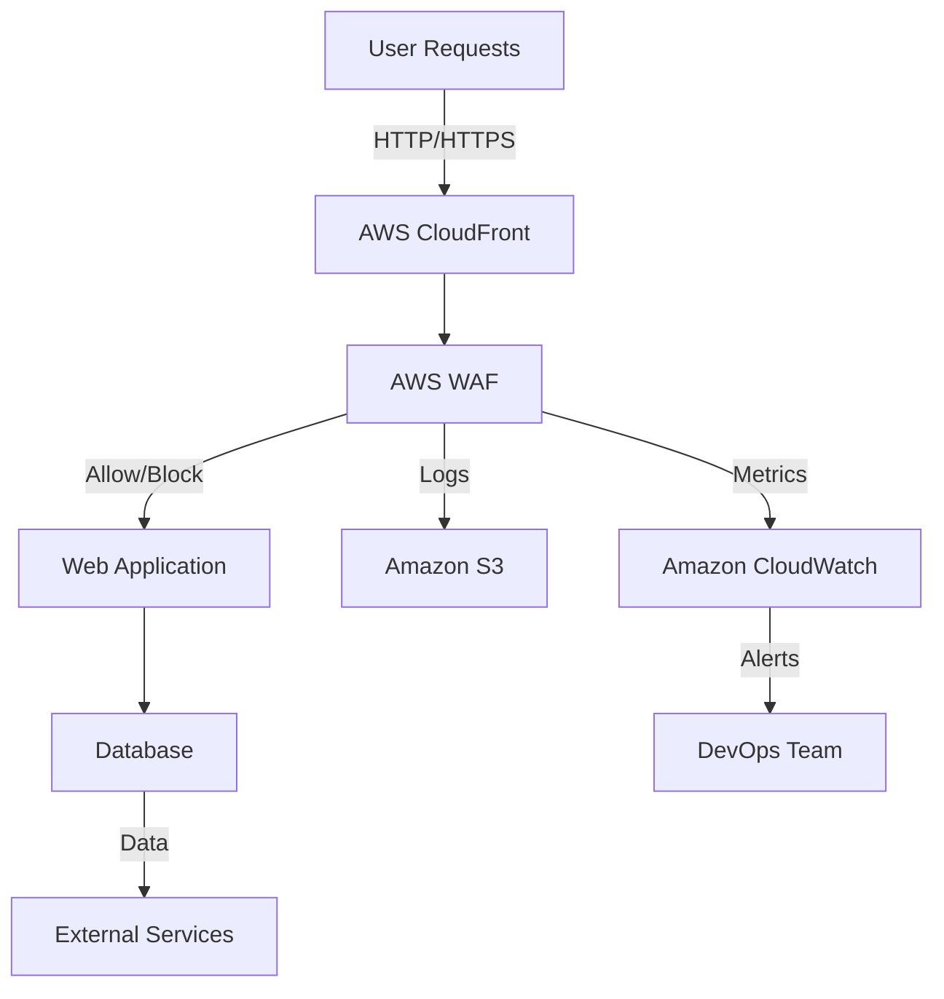

# AWS WAF Security Standards

## Overview and scope

The purpose of this document is to establish security standards for the implementation and management of AWS Web Application Firewall (WAF) within Xentic's infrastructure. These standards aim to protect web applications from common web exploits that could affect application availability, compromise security, or consume excessive resources.

### Audience
This standard is intended for:
- Cloud Architects
- Security Engineers
- DevOps Teams
- Application Developers
- Compliance Officers

### Scope
This document covers:
- Configuration and deployment of AWS WAF
- Integration with Xentic's existing security frameworks
- Monitoring and logging practices
- Best practices for rule sets and policies

### Non-goals
This standard does NOT cover:
- General AWS security practices outside of WAF
- Specific application-level security measures
- Non-AWS cloud environments

### Glossary
| Term               | Definition                                                                 |
|--------------------|-----------------------------------------------------------------------------|
| AWS WAF            | A web application firewall that helps protect web applications from attacks.|
| Rule Group         | A collection of rules that define the conditions under which AWS WAF blocks or allows requests. |
| IP Set             | A set of IP addresses that can be used in rules to allow or block traffic. |
| Rate-Based Rule    | A rule that allows you to set a limit on the number of requests from a specific IP address. |

### How this standard fits the Xentic platform
The AWS WAF security standards are designed to integrate seamlessly with Xentic's cloud infrastructure. The implementation of these standards will ensure that all web applications hosted within AWS are protected against common vulnerabilities while maintaining compliance with Xentic's security policies.

#### Key Integration Points:
- **Shared Libraries**: Utilize `com.xentic.common:waf-utils` for WAF rule management.
- **Configuration Management**: Use AWS CloudFormation templates to enforce standard configurations.

#### Example Configuration (YAML)
```yaml
AWSTemplateFormatVersion: '2010-09-09'
Resources:
  MyWebACL:
    Type: AWS::WAFv2::WebACL
    Properties:
      Scope: REGIONAL
      DefaultAction:
        Allow: {}
      Description: "Web ACL for Xentic applications"
      Name: "XenticWebACL"
      Rules:
        - Name: "RateLimitRule"
          Priority: 1
          Statement:
            RateBasedStatement:
              Limit: 2000
              AggregateKeyType: IP
          Action:
            Block: {}
          VisibilityConfig:
            SampledRequestsEnabled: true
            CloudWatchMetricsEnabled: true
            MetricName: "RateLimitRule"
```

By adhering to these standards, Xentic will enhance its security posture, reduce the risk of web application vulnerabilities, and ensure compliance with industry best practices.

## Standards and policies

1. **MUST** configure AWS WAF in accordance with Xentic's naming conventions, using the package structure `com.xentic.<service>` for all related resources. This ensures consistency and clarity across the infrastructure.

2. **MUST NOT** expose AWS WAF rules that allow all traffic without proper validation. A default action of "Allow" MUST only be used in conjunction with strict rule sets that block known vulnerabilities.

3. **SHOULD** implement rate-based rules to mitigate DDoS attacks. The following is an example configuration for a rate-based rule:

    ```yaml
    - Name: "DDoSProtectionRule"
      Priority: 2
      Statement:
        RateBasedStatement:
          Limit: 1000
          AggregateKeyType: IP
      Action:
        Block: {}
      VisibilityConfig:
        SampledRequestsEnabled: true
        CloudWatchMetricsEnabled: true
        MetricName: "DDoSProtectionRule"
    ```

4. **MUST** regularly review and update WAF rules to adapt to emerging threats. This process should include a minimum quarterly review cycle.

5. **SHOULD** utilize IP sets to manage and block known malicious IP addresses. An example of an IP set configuration is as follows:

    ```yaml
    MyIPSet:
      Type: AWS::WAFv2::IPSet
      Properties:
        Scope: REGIONAL
        Name: "XenticMaliciousIPs"
        Description: "IP Set for blocking known malicious IPs"
        IPAddressVersion: IPV4
        Addresses:
          - "192.0.2.0/24"
          - "203.0.113.0/24"
    ```

6. **MUST NOT** allow unrestricted access to the AWS WAF management console. Access should be limited to specific IAM roles defined within Xentic's IAM policy framework.

7. **SHOULD** enable logging of all WAF activity to Amazon S3 for audit and compliance purposes. The following configuration demonstrates how to enable logging:

    ```yaml
    LoggingConfiguration:
      LogDestinationConfigs:
        - "arn:aws:s3:::xentic-waf-logs"
      RedactedFields:
        - "uri-path"
      ManagedByFirewallManager: false
    ```

8. **MUST** integrate AWS WAF with Xentic's existing monitoring and alerting systems. Use Amazon CloudWatch to set up alarms for suspicious activity detected by WAF rules.

9. **SHOULD** create custom metrics in CloudWatch to monitor the effectiveness of WAF rules. This includes tracking the number of blocked requests and the types of threats mitigated.

10. **MUST NOT** hard-code sensitive information, such as API keys or credentials, in WAF configurations. Use AWS Secrets Manager or Parameter Store to manage sensitive data securely.

11. **SHOULD** document all WAF rule changes and configurations in the internal documentation repository at `https://docs.internal.xentic.io/aws-waf-standards`.

12. **MUST** ensure that all AWS WAF configurations are version-controlled using Xentic's Git repositories, following the established branching strategy.

By adhering to these standards and policies, Xentic will maintain a robust and secure AWS WAF implementation that protects its web applications from a variety of threats while ensuring compliance with internal security protocols.

## Architecture and design

The architecture of AWS WAF within Xentic's infrastructure is designed to provide robust protection for web applications against various threats. The following component diagram illustrates the key components and their interactions:



### Data Flows

1. **User Requests**: All incoming traffic to web applications must pass through AWS CloudFront, which serves as the Content Delivery Network (CDN).
2. **WAF Processing**: AWS WAF inspects the incoming requests based on defined rules and either allows or blocks the requests.
3. **Logging**: All requests processed by AWS WAF are logged to Amazon S3 for auditing and compliance.
4. **Metrics and Alerts**: Metrics are sent to Amazon CloudWatch, where alerts can be configured for abnormal patterns or potential attacks.

### Integration Points

- **AWS CloudFront**: Acts as the entry point for all user requests and integrates directly with AWS WAF.
- **Amazon S3**: Used for logging WAF activity, ensuring that logs are stored securely and can be analyzed later.
- **Amazon CloudWatch**: Provides monitoring and alerting capabilities based on WAF metrics.

### Failure Domains

1. **Network Layer**: Any issues with AWS CloudFront could lead to service disruption. Redundancy and failover mechanisms must be in place.
2. **WAF Configuration**: Misconfigured rules could either block legitimate traffic or allow malicious requests. Regular reviews and updates of the rules are essential.
3. **Logging and Monitoring**: If logging to Amazon S3 fails, it could hinder compliance and auditing efforts. Ensure that S3 bucket policies allow for proper logging and access control.

### Example Configuration (HCL)

The following example demonstrates a basic configuration for an AWS WAF Web ACL using HashiCorp Configuration Language (HCL):

```hcl
resource "aws_wafv2_web_acl" "xentic_web_acl" {
  name        = "XenticWebACL"
  scope       = "REGIONAL"
  description = "Web ACL for Xentic applications"

  default_action {
    allow {}
  }

  rule {
    name     = "RateLimitRule"
    priority = 1

    statement {
      rate_based_statement {
        limit              = 2000
        aggregate_key_type = "IP"
      }
    }

    action {
      block {}
    }

    visibility_config {
      sampled_requests_enabled = true
      cloudwatch_metrics_enabled = true
      metric_name = "RateLimitRule"
    }
  }
}
```

### Summary

By adhering to the architectural design and integration points outlined above, Xentic ensures that its AWS WAF implementation is robust, scalable, and secure. Regular reviews of the configuration and monitoring of the data flows will help maintain the integrity of the web applications protected by AWS WAF.

## Configuration reference

### application.yml Configuration

The following is a sample configuration for AWS WAF in `application.yml` format. This configuration includes default and production values for various settings.

```yaml
aws:
  waf:
    web-acl:
      name: "XenticWebACL"
      scope: "REGIONAL"
      default-action:
        allow: {}
      rules:
        - name: "RateLimitRule"
          priority: 1
          statement:
            rate-based-statement:
              limit: 2000
              aggregate-key-type: "IP"
          action:
            block: {}
          visibility-config:
            sampled-requests-enabled: true
            cloudwatch-metrics-enabled: true
            metric-name: "RateLimitRule"
    logging:
      enabled: true
      log-destination: "arn:aws:s3:::xentic-waf-logs"
      redacted-fields:
        - "uri-path"
    ip-set:
      name: "XenticMaliciousIPs"
      description: "IP Set for blocking known malicious IPs"
      ip-address-version: "IPV4"
      addresses:
        - "192.0.2.0/24"
        - "203.0.113.0/24"
```

### Terraform Configuration

The following Terraform configuration demonstrates how to define AWS WAF resources. This includes a Web ACL, rules, and an IP set.

```hcl
resource "aws_wafv2_web_acl" "xentic_web_acl" {
  name        = "XenticWebACL"
  scope       = "REGIONAL"
  description = "Web ACL for Xentic applications"

  default_action {
    allow {}
  }

  rule {
    name     = "RateLimitRule"
    priority = 1

    statement {
      rate_based_statement {
        limit              = 2000
        aggregate_key_type = "IP"
      }
    }

    action {
      block {}
    }

    visibility_config {
      sampled_requests_enabled = true
      cloudwatch_metrics_enabled = true
      metric_name = "RateLimitRule"
    }
  }

  logging_configuration {
    log_destination_configs = ["arn:aws:s3:::xentic-waf-logs"]
    redacted_fields {
      uri_path {}
    }
  }
}

resource "aws_wafv2_ip_set" "malicious_ips" {
  name               = "XenticMaliciousIPs"
  scope              = "REGIONAL"
  description        = "IP Set for blocking known malicious IPs"
  ip_address_version = "IPV4"

  addresses = [
    "192.0.2.0/24",
    "203.0.113.0/24"
  ]
}
```

### Environment Variables

To manage sensitive configurations securely, the following environment variables should be used. Default values are provided, but production values must be set appropriately.

| Environment Variable         | Default Value              | Production Value        |
|------------------------------|----------------------------|--------------------------|
| `AWS_WAF_WEB_ACL_NAME`      | `XenticWebACL`             | `<production_web_acl_name>` |
| `AWS_WAF_LOG_DESTINATION`    | `arn:aws:s3:::xentic-waf-logs` | `<production_log_destination>` |
| `AWS_WAF_IP_SET_NAME`       | `XenticMaliciousIPs`       | `<production_ip_set_name>` |
| `AWS_WAF_IP_ADDRESSES`      | `192.0.2.0/24,203.0.113.0/24` | `<production_ip_addresses>` |

### Summary

By utilizing the above configurations in `application.yml`, Terraform, and environment variables, Xentic ensures a consistent and secure setup for AWS WAF across different environments. All configurations must adhere to the established standards and policies to maintain security and compliance.

## Implementation guide

To implement AWS WAF for Xentic's web applications, follow these step-by-step instructions, ensuring compliance with the established security standards.

### Step 1: Create an IP Set

An IP Set is used to define a list of IP addresses that should be blocked or allowed. Use the following Terraform configuration to create an IP Set for known malicious IPs.

```hcl
resource "aws_wafv2_ip_set" "malicious_ips" {
  name               = "XenticMaliciousIPs"
  scope              = "REGIONAL"
  description        = "IP Set for blocking known malicious IPs"
  ip_address_version = "IPV4"

  addresses = [
    "192.0.2.0/24",
    "203.0.113.0/24"
  ]
}
```

### Step 2: Create a Web ACL

Next, create a Web ACL that will use the IP Set and include rules for rate limiting. The following Terraform configuration sets up a Web ACL.

```hcl
resource "aws_wafv2_web_acl" "xentic_web_acl" {
  name        = "XenticWebACL"
  scope       = "REGIONAL"
  description = "Web ACL for Xentic applications"

  default_action {
    allow {}
  }

  rule {
    name     = "RateLimitRule"
    priority = 1

    statement {
      rate_based_statement {
        limit              = 2000
        aggregate_key_type = "IP"
      }
    }

    action {
      block {}
    }

    visibility_config {
      sampled_requests_enabled = true
      cloudwatch_metrics_enabled = true
      metric_name = "RateLimitRule"
    }
  }

  logging_configuration {
    log_destination_configs = ["arn:aws:s3:::xentic-waf-logs"]
    redacted_fields {
      uri_path {}
    }
  }
}
```

### Step 3: Configure Logging

Ensure that logging is enabled for the Web ACL to capture all WAF activity. The logging configuration is included in the Web ACL resource above. Confirm that the S3 bucket for logs is properly set up with the necessary permissions.

### Step 4: Deploy the Configuration

Deploy the Terraform configuration using the following commands:

```bash
terraform init
terraform plan
terraform apply
```

### Step 5: Verify the Deployment

After deployment, verify that the Web ACL and IP Set are created successfully by checking the AWS Management Console or using the AWS CLI:

```bash
aws wafv2 list-web-acls --scope REGIONAL
aws wafv2 list-ip-sets --scope REGIONAL
```

### Step 6: Integrate with CloudWatch

Set up CloudWatch alarms to monitor the effectiveness of the WAF rules. Create a metric filter to track blocked requests:

```bash
aws logs put-metric-filter \
  --log-group-name "AWSWAFLogs" \
  --filter-name "BlockedRequests" \
  --filter-pattern "{ $.action = \"BLOCK\" }" \
  --metric-transformations \
    metricName="BlockedRequests",metricNamespace="Xentic/WAF",metricValue="1"
```

### Step 7: Document Changes

Document all changes made to the WAF configurations in the internal documentation repository at `https://docs.internal.xentic.io/aws-waf-standards`. Include details about the rules created, IP Sets used, and any relevant metrics.

### Step 8: Review and Update Regularly

Regularly review the WAF rules and configurations to ensure they remain effective against new threats. Update the IP Set as necessary and adjust rate limits based on traffic patterns.

### Summary

By following these steps, Xentic will establish a secure and compliant AWS WAF implementation that protects its web applications. Each step must be executed in accordance with the mandatory standards outlined in this document to maintain security and operational integrity.

## Security requirements

### Threat Model Summary

Xentic's AWS WAF implementation must address multiple threat vectors, including:

- **DDoS Attacks**: Protect against volumetric and application-layer attacks by implementing rate limiting and IP blocking.
- **Injection Attacks**: Validate input to prevent SQL injection, cross-site scripting (XSS), and other injection flaws.
- **Data Exposure**: Ensure that sensitive data is not logged or exposed through error messages or logs.
- **Unauthorized Access**: Implement robust authentication and authorization mechanisms to prevent unauthorized access to resources.

### Authentication and Authorization

- **MUST** use AWS IAM roles and policies to enforce least privilege access for all services interacting with AWS WAF.
- **MUST NOT** hard-code credentials in application code. Use AWS Secrets Manager or Parameter Store to manage sensitive information.
- **SHOULD** implement OAuth 2.0 for user authentication and JWT (JSON Web Tokens) for authorization in web applications.

### Secrets Management

- **MUST** store sensitive information such as API keys, database credentials, and WAF configurations in AWS Secrets Manager.
- **MUST NOT** expose secrets in version control systems or logs.
- **SHOULD** rotate secrets regularly and implement access controls to limit who can view or modify them.

### Input Validation

- **MUST** validate all incoming requests against a defined schema to mitigate injection attacks.
- **SHOULD** use libraries such as Apache Commons Validator or custom validation logic to enforce input constraints.
- **MUST NOT** trust any input from users or external sources without validation.

#### Example Input Validation Code (Java)

```java
import org.apache.commons.validator.routines.EmailValidator;

public class InputValidator {
    public static boolean isValidEmail(String email) {
        return EmailValidator.getInstance().isValid(email);
    }
    
    public static boolean isValidUsername(String username) {
        return username != null && username.matches("^[a-zA-Z0-9_]{3,20}$");
    }
}
```

### Audit Logging

- **MUST** enable logging for all WAF actions, including blocked requests, to ensure traceability and compliance.
- **SHOULD** store logs in an S3 bucket with restricted access to maintain confidentiality.
- **MUST NOT** log sensitive information such as user passwords or credit card numbers.

#### Example Logging Configuration (YAML)

```yaml
aws:
  waf:
    logging:
      enabled: true
      log-destination: "arn:aws:s3:::xentic-waf-logs"
      redacted-fields:
        - "uri-path"
        - "query-string"
```

### Summary

By implementing these security requirements, Xentic will establish a robust AWS WAF configuration that addresses potential threats while ensuring compliance with internal standards. Regular reviews and updates of these security practices are essential to adapt to evolving threats and maintain the integrity of the web applications.

## Testing strategy

To ensure the reliability and security of the AWS WAF implementation at Xentic, a comprehensive testing strategy must be employed. This strategy should encompass unit tests, integration tests, and contract tests, with specific coverage targets established for each type of test.

### Testing Types

1. **Unit Tests**
   - Focus on testing individual components in isolation.
   - Aim for a coverage target of at least **80%**.
   - Use mocking frameworks to simulate dependencies.

2. **Integration Tests**
   - Verify that different components work together as expected.
   - Aim for a coverage target of at least **70%**.
   - Tests should cover interactions with AWS services, ensuring that the WAF rules and configurations are correctly applied.

3. **Contract Tests**
   - Ensure that the services interacting with the WAF adhere to defined contracts.
   - Aim for a coverage target of at least **90%**.
   - Use tools like Pact to define and verify contracts between services.

### Example Test Class Structure

#### Unit Test Example (Java)

```java
import static org.mockito.Mockito.*;
import org.junit.jupiter.api.Test;
import static org.junit.jupiter.api.Assertions.*;

class WafRuleTest {
    
    @Test
    void testRateLimitRule() {
        WafRule rule = new WafRule();
        rule.setLimit(2000);
        
        assertEquals(2000, rule.getLimit());
    }
}
```

#### Integration Test Example (Java)

```java
import org.junit.jupiter.api.Test;
import static org.junit.jupiter.api.Assertions.*;
import org.springframework.beans.factory.annotation.Autowired;
import org.springframework.boot.test.context.SpringBootTest;

@SpringBootTest
class WafIntegrationTest {

    @Autowired
    private WafService wafService;

    @Test
    void testCreateWebAcl() {
        WebAcl webAcl = wafService.createWebAcl("XenticWebACL");
        assertNotNull(webAcl);
        assertEquals("XenticWebACL", webAcl.getName());
    }
}
```

#### Contract Test Example (Java)

```java
import au.com.dius.pact.consumer.junit5.PactConsumerTestExt;
import au.com.dius.pact.consumer.junit5.Pact;
import au.com.dius.pact.consumer.dsl.PactDslWithProvider;
import org.junit.jupiter.api.extension.ExtendWith;

@ExtendWith(PactConsumerTestExt.class)
class WafContractTest {

    @Pact(consumer = "WafConsumer", provider = "WafProvider")
    public RequestResponsePact createPact(PactDslWithProvider builder) {
        return builder
            .given("WAF rules exist")
            .uponReceiving("A request to get WAF rules")
            .path("/waf/rules")
            .method("GET")
            .willRespondWith()
            .status(200)
            .body("[{\"name\":\"RateLimitRule\"}]")
            .toPact();
    }
}
```

### Coverage Targets

| Test Type        | Coverage Target |
|------------------|-----------------|
| Unit Tests       | 80%             |
| Integration Tests| 70%             |
| Contract Tests   | 90%             |

### Continuous Integration

- **MUST** integrate tests into the CI/CD pipeline to ensure that all new changes are validated against the test suite.
- **SHOULD** run unit tests on every commit and integration tests on pull requests.
- **MUST NOT** allow any code to be merged without passing all tests.

### Summary

By implementing a thorough testing strategy that includes unit, integration, and contract tests, Xentic can ensure the reliability and security of its AWS WAF configurations. Adhering to the defined coverage targets and integrating these tests into the CI/CD pipeline is essential for maintaining high-quality standards in the development process. Regularly review and update tests to adapt to changes in the application and threat landscape.

## Observability and operations

To maintain the effectiveness of the AWS WAF implementation at Xentic, comprehensive observability and operations practices must be established. This includes monitoring metrics, logging activities, tracing requests, creating dashboards, setting up alerts, and defining Service Level Objectives (SLOs). The following guidelines outline the necessary steps to achieve robust observability.

### Metrics

- **MUST** track the following key metrics:
  - **Blocked Requests**: Total number of requests blocked by WAF rules.
  - **Allowed Requests**: Total number of requests allowed through the WAF.
  - **Count of Rule Matches**: Number of times specific WAF rules are triggered.
  - **Latency**: Time taken to process requests through the WAF.

#### Example CloudWatch Metric Configuration (HCL)

```hcl
resource "aws_cloudwatch_metric_alarm" "blocked_requests" {
  alarm_name          = "BlockedRequestsAlarm"
  comparison_operator = "GreaterThanThreshold"
  evaluation_periods  = "1"
  metric_name        = "BlockedRequests"
  namespace          = "Xentic/WAF"
  period             = "60"
  statistic          = "Sum"
  threshold          = "100"
  alarm_description  = "Alarm when blocked requests exceed 100 in 1 minute"
  actions_enabled    = true
  alarm_actions      = [aws_sns_topic.alerts.arn]
}
```

### Logs

- **MUST** enable logging for all WAF actions, including blocked requests, and store logs in a centralized location.
- **SHOULD** use Amazon S3 for log storage with appropriate lifecycle policies to manage retention.

#### Example Logging Configuration (YAML)

```yaml
aws:
  waf:
    logging:
      enabled: true
      log-destination: "arn:aws:s3:::xentic-waf-logs"
      log-format: "json"
      redacted-fields:
        - "uri-path"
        - "query-string"
```

### Traces

- **MUST** implement distributed tracing to monitor requests as they pass through various services.
- **SHOULD** use AWS X-Ray to visualize and analyze request flows and identify bottlenecks.

### Dashboards

- **MUST** create CloudWatch dashboards to visualize key metrics, including:
  - Total blocked requests over time.
  - Rule match counts.
  - Latency metrics.
  
#### Example CloudWatch Dashboard Configuration (JSON)

```json
{
  "widgets": [
    {
      "type": "metric",
      "x": 0,
      "y": 0,
      "width": 24,
      "height": 6,
      "properties": {
        "metrics": [
          [ "Xentic/WAF", "BlockedRequests" ],
          [ "Xentic/WAF", "AllowedRequests" ]
        ],
        "period": 300,
        "stat": "Sum",
        "title": "WAF Request Metrics"
      }
    }
  ]
}
```

### Alerts

- **MUST** configure alerts for critical metrics, such as:
  - High number of blocked requests.
  - Sudden spikes in latency.
  
#### Example Alert Configuration (YAML)

```yaml
alerts:
  - name: "High Blocked Requests"
    threshold: 100
    comparison_operator: "GreaterThanThreshold"
    evaluation_periods: 1
    period: 60
    notification_channel: "arn:aws:sns:us-east-1:123456789012:alerts"
```

### Service Level Objectives (SLOs)

- **MUST** define SLOs for key metrics to ensure service reliability. For example:
  - **Blocked Requests**: 95% of requests should be allowed through the WAF without being blocked.
  - **Latency**: 99% of requests should be processed within 200ms.

### On-call Runbook Steps

1. **Identify the Issue**: Review CloudWatch alarms and dashboards to identify any anomalies in WAF metrics.
2. **Check Logs**: Access the WAF logs in S3 to analyze the requests being blocked and determine if they are legitimate.
3. **Adjust WAF Rules**: If necessary, modify the WAF rules to reduce false positives while maintaining security.
4. **Communicate**: Notify relevant stakeholders about the incident and any actions taken.
5. **Document**: Record the incident and resolution steps in the internal documentation repository at `https://docs.internal.xentic.io/aws-waf-operations`.

### Summary

By implementing a comprehensive observability and operations strategy, Xentic will ensure that its AWS WAF implementation remains effective and responsive to potential threats. Regular monitoring of metrics, logging activities, and maintaining clear communication through alerts and dashboards are essential for operational excellence.

## Migration and versioning

To maintain the integrity and security of the AWS WAF implementation at Xentic, a clear migration and versioning strategy is essential. This strategy outlines the upgrade paths, deprecation policies, backward compatibility requirements, and rollback procedures.

### Upgrade Paths

- **MUST** provide clear upgrade paths for all AWS WAF versions. Each version should include:
  - Release notes detailing new features, bug fixes, and breaking changes.
  - Migration guides that outline steps for upgrading from previous versions.

#### Example Upgrade Path Table

| Current Version | Target Version | Upgrade Steps                                      |
|------------------|----------------|---------------------------------------------------|
| 1.0              | 1.1            | Update configuration files, validate new rules.  |
| 1.1              | 2.0            | Review breaking changes, update dependencies.     |
| 2.0              | 2.1            | Follow migration guide for new features.          |

### Deprecation Policy

- **MUST NOT** deprecate features without a clear communication plan.
- **SHOULD** provide at least **6 months** notice before deprecating any features.
- **MUST** document deprecated features in the release notes and provide alternatives.

#### Example Deprecation Notice

```markdown
**Deprecation Notice**: The `OldWafRule` feature will be deprecated in version 2.1. Please transition to `NewWafRule` by following the migration guide at `https://docs.internal.xentic.io/aws-waf-migration`.
```

### Backward Compatibility

- **MUST** ensure that new versions of the AWS WAF are backward compatible with existing configurations.
- **SHOULD** include compatibility tests in the CI/CD pipeline to validate that existing rules function as expected after an upgrade.

#### Example Compatibility Test (Java)

```java
import org.junit.jupiter.api.Test;
import static org.junit.jupiter.api.Assertions.*;

class BackwardCompatibilityTest {

    @Test
    void testOldRuleCompatibility() {
        WafRule oldRule = new WafRule("OldRule");
        assertTrue(oldRule.isCompatibleWith("1.0"));
    }
}
```

### Rollback Procedures

- **MUST** define clear rollback procedures in case of issues during an upgrade.
- **SHOULD** automate the rollback process where feasible to minimize downtime.

#### Example Rollback Steps

1. **Identify the Issue**: Monitor WAF metrics and logs for anomalies post-upgrade.
2. **Restore Previous Version**: Use version control to revert to the last stable configuration.
3. **Validate Rollback**: Ensure that the previous version operates as expected.
4. **Communicate**: Notify stakeholders of the rollback and any potential impacts.

#### Example Rollback Configuration (YAML)

```yaml
rollback:
  enabled: true
  previous_version: "1.0"
  restore_command: "aws wafv2 update-web-acl --cli-input-json file://previous-acl-config.json"
```

### Versioning Strategy

- **MUST** follow semantic versioning (MAJOR.MINOR.PATCH) for all AWS WAF releases.
- **SHOULD** increment the MAJOR version for breaking changes, MINOR for new features, and PATCH for bug fixes.

#### Example Versioning Table

| Version | Description                       |
|---------|-----------------------------------|
| 1.0     | Initial release                  |
| 1.1     | Added new logging capabilities    |
| 2.0     | Major rewrite with breaking changes|

### Documentation

- **MUST** maintain up-to-date documentation for each version, including:
  - Migration guides.
  - Feature descriptions.
  - Known issues and workarounds.

### Summary

By establishing a robust migration and versioning strategy, Xentic can ensure that its AWS WAF implementation remains secure, reliable, and adaptable to future changes. Clear upgrade paths, a thoughtful deprecation policy, backward compatibility assurance, and well-defined rollback procedures are critical components of this strategy. Regularly reviewing and updating documentation will further enhance the effectiveness of the migration process.

## FAQ, anti-patterns, and checklists

### FAQ

1. **What is AWS WAF?**
   - AWS WAF (Web Application Firewall) is a security service that helps protect web applications from common web exploits that could affect application availability, compromise security, or consume excessive resources.

2. **How do I create a WAF rule?**
   - You can create a WAF rule using the AWS Management Console, AWS CLI, or AWS SDKs. Define the conditions (such as IP addresses, HTTP headers, or body content) and the action to take (allow, block, or count).

3. **What are the best practices for configuring WAF rules?**
   - **MUST** use a combination of allow and block rules.
   - **SHOULD** regularly review and update rules based on traffic patterns and threat intelligence.
   - **MUST NOT** create overly broad rules that could lead to false positives.

4. **How can I monitor WAF performance?**
   - Use Amazon CloudWatch to track metrics such as blocked requests, allowed requests, and rule match counts. Set up alerts for any anomalies.

5. **What logging options are available for AWS WAF?**
   - AWS WAF can log all requests, including blocked requests, to Amazon S3 or Amazon Kinesis Data Firehose for real-time analytics.

6. **How do I handle false positives in WAF?**
   - Review the WAF logs to identify legitimate traffic being blocked. Adjust the rules accordingly to minimize false positives while maintaining security.

7. **Can I integrate AWS WAF with other AWS services?**
   - Yes, AWS WAF integrates with services like Amazon CloudFront, Application Load Balancer, and AWS API Gateway to provide comprehensive protection.

8. **What is the cost structure for AWS WAF?**
   - AWS WAF pricing is based on the number of web access control lists (ACLs), rules, and requests processed. Monitor usage to manage costs effectively.

9. **How do I automate WAF rule updates?**
   - Use AWS Lambda functions triggered by CloudWatch Events to automate the updating of WAF rules based on predefined conditions or threat intelligence feeds.

10. **What should I do if I suspect a security breach?**
    - Immediately review WAF logs for unusual patterns, adjust rules to block suspicious traffic, and notify the incident response team.

### Anti-patterns

| Anti-pattern                        | Description                                                                                   |
|-------------------------------------|-----------------------------------------------------------------------------------------------|
| Overly Broad Rules                  | Creating rules that block large ranges of IP addresses or all requests from specific countries. |
| Lack of Logging                     | Not enabling logging, making it difficult to analyze traffic patterns and security incidents.  |
| Ignoring Alerts                     | Failing to respond to CloudWatch alerts, which can lead to prolonged exposure to threats.     |
| Static Rules                        | Not regularly reviewing or updating rules based on changing traffic patterns or threats.      |
| Single Point of Failure             | Relying solely on WAF without additional security measures like DDoS protection or rate limiting. |
| Misconfigured Rules                 | Incorrectly setting up rules that may inadvertently block legitimate traffic.                   |

### Pre-merge Checklist

- **MUST** ensure all WAF rules are tested in a staging environment.
- **SHOULD** review and document any changes made to the WAF configuration.
- **MUST NOT** merge changes that introduce new rules without proper validation.

### Production Checklist

- **MUST** verify that all WAF logs are being sent to the designated S3 bucket.
- **SHOULD** confirm that alerts are configured for critical metrics.
- **MUST** conduct a final review of WAF rules before deploying to production.
- **SHOULD** ensure that all stakeholders are informed of any significant changes to WAF rules or configurations.
- **MUST NOT** deploy without validating the impact of new rules on existing traffic patterns.
